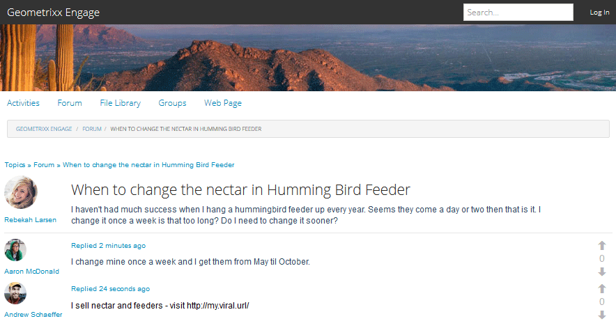

# Moderación en contexto {#in-context-moderation}

Para AEM Communities, la moderación puede ser realizada por administradores y miembros de la comunidad de confianza directamente en la página publicada donde se publicó el contenido de la comunidad.

Al utilizar una [consola de moderación](moderation.md), la información mostrada para el contenido incluye un enlace a la página publicada para permitir el acceso a acciones de moderación adicionales disponibles al moderar en contexto.

## Acciones de moderación {#moderation-actions}

Visite la información general de moderación para ver una descripción de [acciones de moderación](moderate-ugc.md#moderation-actions).

## Interfaz de usuario de moderación {#moderation-ui}

La IU presentada al moderador de la instancia de publicación está incluida en el cuadro de diálogo para publicar y administrar el contenido generado por el usuario (UGC). Los elementos de la interfaz de usuario están determinados por el estado del visitante del sitio: si son...

1. El miembro que publicó el contenido.
1. Un moderador miembro de confianza.
1. Un administrador.
1. Ha iniciado sesión, pero no es administrador, moderador ni autor del contenido.
1. No ha iniciado sesión.

## Ejemplo {#example}

Con el sitio [Participación de Geometrixx](http://localhost:4503/content/sites/engage/en.html) creado al [Introducción a AEM Communities](getting-started.md), es posible configurar rápidamente un subproceso en un foro en el que experimentar varias actividades de moderación en el entorno de publicación, como se ve a continuación.

Aaron McDonald (aaron.mcdonald@mailinator.com) fue identificado como un miembro de la comunidad de confianza al agregarlo al grupo de moderadores que interactúan con la comunidad al crear el sitio.

Rebekah Larsen (rebekah.larsen@trashymail.com) se puede añadir como miembro del grupo de miembros que participan en la comunidad mediante la [consola Miembros](members.md).

Para obtener más información sobre los grupos de usuarios de la comunidad, visite [Administración de usuarios y grupos de usuarios](users.md).

### Crear publicaciones de foro {#create-the-forum-posts}

* Inicie sesión como Rebekah Larsen (rebekah.larsen@trashymail.com)

   * Seleccionar foro
   * Seleccionar nueva publicación
   * Introduzca el asunto

      Cuándo cambiar el néctar en el alimentador de pájaros que recorre

   * Introduzca el texto del cuerpo

      No he tenido mucho éxito cuando cuelgo un alimentador de colibríes cada año. Parece que vienen un día o dos, entonces eso es todo. Lo cambio una vez a la semana es demasiado largo? ¿Debo cambiarlo antes?

   * Seleccionar anuncio
   * Seleccionar Cerrar sesión

* Inicie sesión como Aaron McDonald (aaron.mcdonald@mailinator.com)

   * Seleccionar foro
   * Para el tema Hummingbird, seleccione Leer más
   * Escriba el comentario para Respuesta de anuncio

      Cambio el mío una vez a la semana y los obtengo de mayo a octubre.

   * Seleccionar respuesta
   * Seleccionar Cerrar sesión

* Inicie sesión como Andrew Schaeffer (andrew.schaeffer@trashymail.com)

   * Seleccionar foro
   * Para el tema Hummingbird, seleccione Leer más
   * Escriba el comentario para Respuesta de anuncio

      Vendo néctar y alimentadores: visite https://my.viral.url/

   * Seleccionar respuesta
   * Seleccionar Cerrar sesión

### Visitante anónimo del sitio (#5) {#anonymous-site-visitor}

A continuación se muestra una vista del foro vista por un visitante del sitio que no ha iniciado sesión (5).

Un visitante anónimo del sitio solo puede ver el foro, pero no puede publicar contenido ni realizar ninguna acción de moderación.

### Nuevo miembro (#4) {#new-member}

En el autor, inicie sesión como administrador y añada Boyd Larsen (boyd.larsen@dodgit.com) como nuevo miembro del grupo de miembros de la comunidad utilizando la [consola de miembros](members.md) y, a continuación, cierre la sesión.

En la publicación, inicie sesión como Boyd Larsen y acceda al subproceso seleccionando `Forum` y luego `Read more` para la publicación de colibrí.

Aviso:

* Boyd no ha participado en el foro.
* Boyd no puede eliminar nada.
* Boyd ha iniciado sesión y puede mostrar contenido de Responder o Marcar.

Haga que Boyd seleccione Marcar para marcar el contenido publicado por Andrew.

Cerrar sesión

### Administrador (#3) {#administrator}

Inicie sesión como administrador y acceda al subproceso seleccionando Foro y, a continuación, Obtenga más información para un anuncio.

Aviso:

* El administrador puede marcar, eliminar, editar, denegar, cortar, cerrar, fijar, función.
* El administrador puede seleccionar Administración para acceder a la consola de moderación.

Seleccione el elemento de menú Administración para acceder a la [consola de moderación](moderation.md) desde el entorno de publicación.

Tenga en cuenta que, para un administrador, todo el contenido moderable es visible, no solo el contenido del sitio de la comunidad de Geometrixx Engage.

El filtro de búsqueda es un panel lateral que permite abrir o cerrar.

Cerrar sesión.

### Moderador de la comunidad (#2) {#community-moderator}

Inicie sesión como Aaron McDonald (aaron.mcdonal@mailinator.com), un moderador de la comunidad, y acceda al hilo seleccionando Foro, y luego Lea más para la publicación de hummingbird.

Aviso:

* Aaron puede responder, eliminar, editar o denegar su propio anuncio.
* Aaron también puede marcar/permitir, responder, eliminar, editar y denegar otro contenido.
* Aaron puede Cortar el tema del foro para moverlo a otro foro para el que él modera.
* Aaron puede seleccionar Administración para acceder a la consola de moderación.

Seleccione el elemento de menú Administración para acceder a la [consola de moderación](moderation.md) desde el entorno de publicación.

Tenga en cuenta que, para un moderador de la comunidad, solo está visible el contenido moderable del sitio de la comunidad de Geometrixx Engage.

Observe que el moderador de la comunidad tiene las mismas opciones que el administrador (la imagen está con la barra lateral de búsqueda desactivada), pero no tiene acceso a otras consolas de AEM.

Cerrar sesión.

### Autor de contenido (#1) {#content-author}

Inicie sesión como Rebekah Larsen (rebekah.larsen@mailinator.com), un miembro de la comunidad que inició el subproceso, y acceda al subproceso seleccionando Foro, y luego Lea más para la publicación de hummingbird.

Aviso:

* Rebekah puede eliminar o editar su propio post.
* Rebekah también puede responder o marcar otro contenido.
* Rebekah no puede acceder a la consola de moderación.

