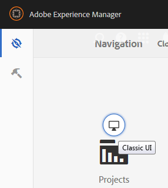

# Contenido inicial de zona protegida {#initial-sandbox-content}

En esta sección, creará las siguientes páginas, todas las cuales utilizan la [plantilla de página](initial-app.md#createthepagetemplate):

* Sitio de zona protegida de SCF, que redirige a la versión en inglés de la página principal.

   * Zona protegida de SCF: página principal de la versión en inglés del sitio.

   * Reproducción SCF: elemento secundario de la página principal en la que se va a reproducir.

Este tutorial no profundiza en [copias de idioma](../../help/sites-administering/tc-prep.md). En su lugar, está diseñado para que la página raíz pueda implementar la detección del idioma preferido del usuario a través del encabezado del HTML y redirigir a la página principal adecuada para el idioma. La convención es utilizar el código de país de dos letras para el nombre del nodo de la página como, por ejemplo, &quot;en&quot; para inglés y &quot;fr&quot; para francés.

## Crear primeras páginas {#create-first-pages}

Ahora que hay una [plantilla de página](initial-app.md#createthepagetemplate), puede establecer la página raíz del sitio web en el directorio /content.

1. Actualmente, la IU estándar proporciona modelos para la creación de sitios. Como este tutorial crea un sitio simple, la IU clásica resulta útil.

   Para cambiar a la IU clásica, seleccione navegación global y pase el ratón sobre la parte derecha del icono Proyectos. Seleccione el icono *Cambiar a la IU clásica* que aparece:

   

   Un administrador debe [habilitar la capacidad para cambiar a la IU clásica](../../help/sites-administering/enable-classic-ui.md).

1. En la [página de bienvenida clásica de la interfaz de usuario](http://localhost:4502/welcome.html), seleccione **[!UICONTROL Sitios web]**.

   

   También puede obtener acceso directo a la IU clásica de los sitios web si navega a [/siteadmin.](http://localhost:4502/siteadmin)

1. En el panel del explorador, seleccione **[!UICONTROL Sitios web]** y, a continuación, en la barra de herramientas, seleccione **[!UICONTROL Nuevo]** > **[!UICONTROL Nueva página]**.

   En el cuadro de diálogo **[!UICONTROL Crear página]**, escriba lo siguiente:

   * Título: `SCF Sandbox Site`
   * Nombre: `an-scf-sandbox`
   * Seleccione **[!UICONTROL Una plantilla de reproducción de espacio aislado de SCF]**
   * Haga clic en **[!UICONTROL Crear]**

   

1. En el panel del explorador, seleccione la página que creó, `/Websites/SCF Sandbox Site`, y haga clic en **[!UICONTROL Nueva]** > **[!UICONTROL Nueva página]**:

   * Título: `SCF Sandbox`
   * Nombre: `en`
   * Seleccione **[!UICONTROL Una plantilla de reproducción de espacio aislado de SCF]**
   * Haga clic en **[!UICONTROL Crear]**

1. En el panel del explorador, seleccione la página que creó, `/Websites/SCF Sandbox Site/SCF Sandbox`, y haga clic en **[!UICONTROL Nueva]** > **[!UICONTROL Nueva página]**

   * Título: `SCF Play`
   * Nombre: `play`
   * Seleccione **[!UICONTROL Una plantilla de reproducción de espacio aislado de SCF]**
   * Haga clic en **[!UICONTROL Crear]**

1. Así es como aparece ahora el sitio web en la consola Sitios web. Observe que las páginas secundarias del elemento seleccionado en el panel del explorador se muestran en el panel derecho donde se pueden administrar.

   

   Esta es la vista del repositorio de lo que se creó con la herramienta Sitio web y la plantilla:

   

## Añadir la ruta de diseño {#add-the-design-path}

Cuando se creó ` [/etc/designs/an-scf-sandbox](setup-website.md#setupthedesigntreeetcdesigns)` con la sección de diseños de la consola Herramientas, la propiedad &quot;

* `cq:template="/libs/wcm/core/templates/designpage"`

Se definió, lo que proporciona la capacidad opcional de hacer referencia a los recursos de diseño en un script con `currentDesign.getPath()`. Por ejemplo

* `% String favIcon = currentDesign.getPath() + "/favicon.ico"; %`

   * Nombre: `cq:designPath`
   * Tipo: `String`
   * Valor: `/etc/designs/an-scf-sandbox`

* Haga clic en el elemento verde `[+] Add`

El repositorio debe aparecer de la siguiente manera:

* Haga clic en **[!UICONTROL Guardar todo]**

Si hay algún problema al guardar la configuración, vuelva a iniciar sesión y configure de nuevo.

>[!NOTE]
>
>El uso de `cq:designPath` es opcional y no está relacionado con el [uso de clientlibs](develop-app.md#includeclientlibsintemplate), que son necesarios ya que los componentes de SCF utilizan [clientlibs](client-customize.md#clientlibs-for-scf) para administrar su JS y CSS.
