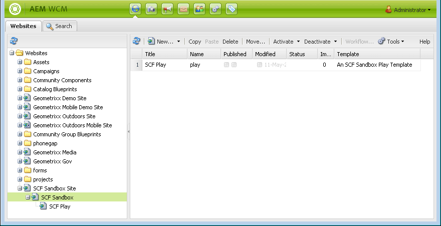

# Contenido inicial del Simulador para pruebas {#initial-sandbox-content}

En esta sección, se crean las páginas siguientes, que todas utilizan la variable [plantilla de página](initial-app.md#createthepagetemplate):

* Sitio de espacio aislado de SCF, que redireccionará a la versión en inglés de la página principal.

   * Simulador para pruebas SCF: la página principal de la versión en inglés del sitio.

   * SCF Play - Secundario de la página principal en la que se va a reproducir.

Aunque este tutorial no profundiza en [copias de idioma](../../help/sites-administering/tc-prep.md), está diseñado para que la página raíz pueda implementar la detección del idioma preferido del usuario a través del encabezado del HTML y redirigir a la página principal correspondiente para el idioma. La convención es utilizar el código de país de dos letras para el nombre de nodo de la página, por ejemplo, &quot;en&quot; para inglés, &quot;fr&quot; para francés, etc.

## Crear primeras páginas {#create-first-pages}

Ahora hay un [plantilla de página](initial-app.md#createthepagetemplate), podemos establecer la página raíz del sitio web en el directorio /content.

1. Actualmente, la interfaz de usuario estándar proporciona modelos para la creación de sitios. Como este tutorial está creando un sitio sencillo, la IU clásica es útil.

   Para cambiar a la IU clásica, seleccione navegación global y pase el ratón por el lado derecho del icono Proyectos . Seleccione el *Cambiar a la IU clásica* que aparece:

   

   La capacidad para cambiar a la IU clásica debe ser [activado por un administrador](../../help/sites-administering/enable-classic-ui.md).

1. En el [página de bienvenida de la IU clásica](http://localhost:4502/welcome.html), seleccione **[!UICONTROL Sitios web]**.

   

   También puede acceder a la IU clásica para sitios web directamente navegando hasta [/siteadmin.](http://localhost:4502/siteadmin)

1. En el panel Explorador, seleccione **[!UICONTROL Sitios web]** y, a continuación, en la barra de herramientas, seleccione **[!UICONTROL Nuevo]** > **[!UICONTROL Nueva página]**.

   En el **[!UICONTROL Crear página]** , escriba lo siguiente:

   * Título: `SCF Sandbox Site`
   * Nombre: `an-scf-sandbox`
   * Select **[!UICONTROL Plantilla de reproducción de espacio aislado de SCF]**
   * Haga clic en **[!UICONTROL Crear]**

   

1. En el panel del explorador, seleccione la página que acaba de crear, `/Websites/SCF Sandbox Site`y haga clic en **[!UICONTROL Nuevo]** > **[!UICONTROL Nueva página]**:

   * Título: `SCF Sandbox`
   * Nombre: `en`
   * Select **[!UICONTROL Plantilla de reproducción de espacio aislado de SCF]**
   * Haga clic en **[!UICONTROL Crear]**

1. En el panel del explorador, seleccione la página que acaba de crear, `/Websites/SCF Sandbox Site/SCF Sandbox`y haga clic en **[!UICONTROL Nuevo]** > **[!UICONTROL Nueva página]**

   * Título: `SCF Play`
   * Nombre: `play`
   * Select **[!UICONTROL Plantilla de reproducción de espacio aislado de SCF]**
   * Haga clic en **[!UICONTROL Crear]**

1. Así es como ahora aparece el sitio web en la consola Sitios web . Observe que las páginas secundarias del elemento seleccionado en el panel del explorador se muestran en el panel derecho, donde se pueden administrar.

   

   Esta es la vista del repositorio de lo que se creó con la herramienta Sitio web y la plantilla:

   

## Agregar la ruta de diseño {#add-the-design-path}

When ` [/etc/designs/an-scf-sandbox](setup-website.md#setupthedesigntreeetcdesigns)` se creó mediante la sección de diseños de la consola Herramientas , la propiedad &quot;

* `cq:template="/libs/wcm/core/templates/designpage"`

se definió, lo que proporciona la capacidad opcional de hacer referencia a recursos de diseño en una secuencia de comandos mediante `currentDesign.getPath()`. Por ejemplo

* `% String favIcon = currentDesign.getPath() + "/favicon.ico"; %`

   * Nombre: `cq:designPath`
   * Tipo: `String`
   * Valor: `/etc/designs/an-scf-sandbox`

* Haga clic en el icono verde `[+] Add`

El repositorio debe aparecer de la siguiente manera:

* Haga clic en **[!UICONTROL Guardar todo]**

En caso de problemas al guardar la configuración, vuelva a iniciar sesión y configúrela de nuevo.

>[!NOTE]
>
>El uso de `cq:designPath` es opcional y no está relacionado con la variable [uso de clientlibs](develop-app.md#includeclientlibsintemplate), que son esencialmente necesarias, ya que los componentes del SCF utilizan [clientlibs](client-customize.md#clientlibs-for-scf) para administrar su JS y CSS.
