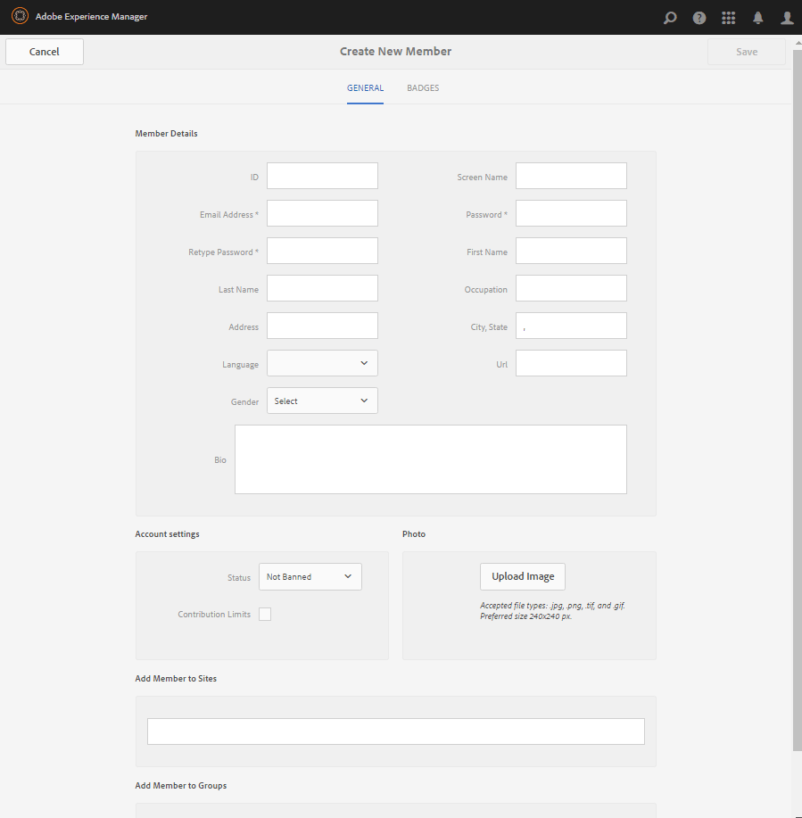

# Consolas de administración de miembros y grupos {#members-groups-management-consoles}

## Información general {#overview}

Las funciones de AEM Communities suelen requerir que los visitantes del sitio se registren e inicien sesión antes de participar en una comunidad en el entorno de publicación. Su registro de usuario solo debe existir en el entorno de publicación y se les suele llamar *miembros* para distinguirlos de *los usuarios* registrados en el entorno de creación.

### Miembros (usuarios) en la publicación {#members-users-on-publish}

Mediante las consolas Miembros y Grupos de Comunidades, los miembros y grupos miembros registrados en el entorno de *publicación* podrán crearse y gestionarse desde el entorno de *creación* . Esto solo es posible cuando el servicio [de](deploy-communities.md#tunnel-service-on-author) túnel está habilitado.

### Usuarios en el autor {#users-on-author}

Para administrar usuarios y grupos registrados en el entorno de *creación* , es necesario utilizar la consola de seguridad de la plataforma:

* En la navegación global, seleccione **[!UICONTROL Herramientas]** > **[!UICONTROL Seguridad]** > **[!UICONTROL Usuarios]**.
* En la navegación global, seleccione **[!UICONTROL Herramientas]** > **[!UICONTROL Seguridad]** > **[!UICONTROL Grupos]**.

>[!NOTE]
>
>Con el contenido de muestra implementado y activado, muchos usuarios de muestra existen tanto en los entornos de autor como de publicación. Estos usuarios no estarán presentes cuando se ejecuten con [nosamplecontent runmode](../../help/sites-administering/production-ready.md).

## Consola de miembros {#members-console}

En el entorno de creación, para llegar a la consola Miembros para administrar los miembros registrados en el entorno de publicación:

* En la navegación global, seleccione **[!UICONTROL Navegación]** > **[!UICONTROL Comunidades]** > **[!UICONTROL Miembros]**

>[!CAUTION]
>
>No será posible utilizar la consola Miembros si el servicio [de](deploy-communities.md#tunnel-service-on-author) túnel no está habilitado.

### Búsqueda {#search-features}

Seleccione el icono del panel lateral en el lado izquierdo del `Members` encabezado para abrir el panel lateral de búsqueda.

Seleccione el icono de búsqueda en la parte izquierda del encabezado para `Members` alternar el panel lateral de búsqueda cerrado.

### Estadísticas de los miembros {#member-statistics}

Las columnas que se muestran `Views`, `Posts``Follows` y `Likes` se actualizan cuando el usuario es miembro de uno o varios sitios de la comunidad con Adobe Analytics [habilitado](sites-console.md#analytics).

### Exportar CSV {#export-csv}

Si selecciona el `Export CSV` vínculo, se descargarán todos los miembros como una lista de valores separados por comas, lo cual resulta adecuado para importarlos a una hoja de cálculo.

Los encabezados de columna son

`| Screen Name |Last Name |First Name |Status |Views |Posts |Follows |Likes |`

## Crear nuevo miembro {#create-new-member}

Seleccione esta opción `Create Member` para crear un usuario en el entorno de publicación.

### GENERAL - Detalles de los miembros {#general-member-details}

La mayoría de los campos son campos opcionales que el miembro puede rellenar posteriormente en su perfil.

* **[!UICONTROL ID]**

(*Requerido*) El ID autorizable es el ID de inicio de sesión del miembro.
De forma predeterminada, el ID se establece en el valor de la dirección de correo electrónico requerida.
*Una vez creado, el ID no puede modificarse*.

* **[!UICONTROL Dirección de correo electrónico]**

(*Requerido*) La dirección de correo electrónico del miembro.
El miembro puede cambiar su dirección de correo electrónico al actualizar su perfil.Si el ID predeterminado es la dirección de correo electrónico, el ID *no cambiará* cuando se cambie la dirección de correo electrónico.

* **[!UICONTROL Contraseña]**

   (*Requerido*) La contraseña de inicio de sesión.

* **[!UICONTROL Repetir contraseña]**

   (*Obligatorio*) Vuelva a introducir la contraseña para la verificación.

* **[!UICONTROL Añadir miembro a los sitios]**

   (*Opcional*) Seleccione uno de los sitios de comunidad existentes para agregar el miembro al grupo de miembros del sitio de comunidad.

* **[!UICONTROL Añadir miembro a los grupos]**

   (*Opcional*) Seleccione uno de los grupos de miembros existentes para agregar el miembro a ese grupo.

* Seleccione **[!UICONTROL Guardar]**

### GENERAL: Configuración de la cuenta {#general-account-settings}

En Configuración de cuenta, un administrador de la comunidad puede:

* **[!UICONTROL Estado]**
   * ProhibidoUn miembro no puede iniciar sesión, lo que les impide ver páginas o participar en actividades que requieren iniciar sesión. Pueden seguir visitando anónimamente un sitio de la comunidad abierta.

   * No prohibidoUn miembro tiene acceso completo al sitio de la comunidad.

   El valor predeterminado es `Not Banned`.

* **[!UICONTROL Límites de contribución]**

   Si se selecciona, la capacidad del miembro para publicar contenido es limitada.
El valor predeterminado depende de la configuración de los límites de contribución.
Consulte Límites [de contribución de miembros](limits.md).

* **[!UICONTROL Cambiar contraseña]**

   Vínculo que está presente al modificar un miembro existente. Proporciona a un administrador de la comunidad la capacidad de restablecer una contraseña para un miembro.

### GENERAL - Foto {#general-photo}

Para proporcionar un avatar para el miembro, seleccione **[!UICONTROL Cargar imagen]** y elija una imagen de tipo .jpg, .png, .tif o .gif. El tamaño preferido para una imagen es de 240 x 240 píxeles a 72 ppp.

### GENERAL - Add Member to Sites {#general-add-member-to-sites}

El miembro puede agregarse a uno o más grupos de miembros de sitios de la comunidad. Comience por introducir texto en el cuadro de texto.

### GENERAL - Add Member to Groups {#general-add-member-to-groups}

El miembro puede agregarse a uno o más grupos de miembros. Comience por introducir texto en el cuadro de texto.

### Ficha BADGES {#badges-tab}

El `BADGES` panel permite asignar distintivos manualmente y revocarlos. Las insignias pueden ser para las funciones asignadas, así como para las insignias que se obtienen normalmente.

Consulte también [Puntuación y distintivos](implementing-scoring.md).

* **[!UICONTROL Añadir distintivos]**
   * Empiece a escribir para seleccionar los distintivos disponibles. Una vez seleccionado un distintivo, elija cada sitio, o todos los sitios, en los que el distintivo debe mostrarse junto con el avatar del miembro.
   * Se pueden elegir varios distintivos y sitios.
* **[!UICONTROL Eliminar distintivos]**
   * Seleccione el icono de papelera situado junto a un distintivo para eliminarlo.

## Consola Grupos {#groups-console}

La consola Grupos, disponible desde el entorno de creación, permite crear y administrar grupos de miembros registrados en el entorno de publicación. Resulta especialmente útil para:
* [Grupos de miembros privilegiados](users.md#privilegedmembersgroups)
* Asignación de recursos de [habilitación basada en grupos](resources.md)

Para acceder a la consola Grupos:
* En la navegación global, seleccione **[!UICONTROL Navegación]** > **[!UICONTROL Comunidades]** > **[!UICONTROL Grupos]**.

>[!CAUTION]
>
>No será posible utilizar la consola Grupos si el servicio [de](deploy-communities.md#tunnel-service-on-author) túnel no está habilitado.

### Crear un grupo nuevo {#create-new-group}

Seleccione esta opción `Add Group` para crear un grupo en el entorno de publicación.

Los campos necesarios para crear un nuevo grupo de miembros del lado de publicación son:

* **[!UICONTROL ID]**

   (*Requerido*) El ID exclusivo del grupo.

   *Una vez creado, el ID no puede modificarse.*

* **[!UICONTROL Nombre]**

   (*Opcional*) El nombre para mostrar del grupo.

   El valor predeterminado es el ID.

* **[!UICONTROL Descripción]**

   (*Opcional*) Una descripción del propósito y los permisos del grupo.

* **[!UICONTROL Añadir miembros al grupo]**

   (*Opcional*) Seleccione los miembros del lado de publicación que se incluirán como miembros iniciales del grupo.

* Seleccione **[!UICONTROL Guardar]**

## Administradores autorizados {#authorized-administrators}

Al trabajar con miembros en la consola de miembros de Communities, es necesario iniciar sesión como usuario con los permisos adecuados y configurar correctamente el agente de replicación utilizado por el servicio [de](deploy-communities.md#tunnel-service-on-author) túnel.

Si no ha iniciado sesión como `admin`, el usuario que ha iniciado sesión debe ser miembro del grupo de `administrators` usuarios.

Consulte también Agentes [de replicación en Autor](deploy-communities.md#replication-agents-on-author).
