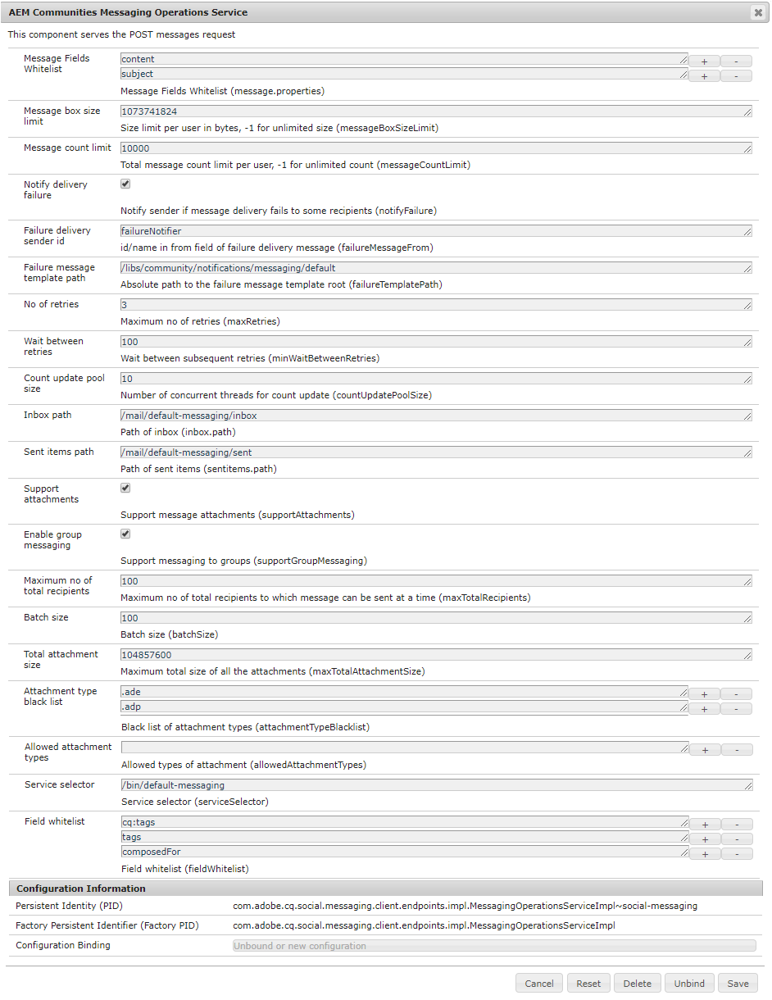

# Configurar la mensajería {#configure-messaging}

## Información general {#overview}

La función de mensajería para AEM Communities permite a los visitantes (miembros) del sitio que han iniciado sesión enviarse mensajes que son accesibles una vez que han iniciado sesión en el sitio.

La mensajería está habilitada para un sitio de la comunidad marcando una casilla durante la [creación del sitio de la comunidad](/help/communities/sites-console.md).

Esta página contiene información sobre la configuración predeterminada y los posibles ajustes.

Para obtener información adicional para desarrolladores, consulte [Messaging Essentials](/help/communities/essentials-messaging.md).

## Servicio de operaciones de mensajería {#messaging-operations-service}

La configuración [Servicio de operaciones de mensajería de AEM Communities](https://localhost:4502/system/console/configMgr/com.adobe.cq.social.messaging.client.endpoints.impl.MessagingOperationsServiceImpl) identifica el extremo que administra las solicitudes relacionadas con la mensajería, las carpetas que el servicio debe usar para almacenar mensajes y, si los mensajes pueden incluir archivos adjuntos, qué tipos de archivos se permiten.

Para los sitios de la comunidad creados con el `Communities Sites console`, existe una instancia del servicio, con la bandeja de entrada establecida en `/mail/inbox`.

### Servicio Community Messaging Operations {#community-messaging-operations-service}

Como se muestra a continuación, existe una configuración del servicio para los sitios creados con el [asistente para la creación de sitios](/help/communities/sites-console.md). La configuración se puede ver o editar seleccionando el icono de lápiz junto a la configuración.

### Añadir nueva configuración {#add-new-configuration}

Para agregar una configuración, seleccione el icono más &#39;**+**&#39; junto al nombre del servicio:

* **Lista de permitidos de campos de mensaje**

  Especifica las propiedades del componente Componer mensaje que los usuarios pueden editar y conservar. Si se agregan nuevos elementos de formulario, se debe agregar el ID del elemento si se desea almacenar en SRP. El valor predeterminado es de dos entradas: *subject* y *content*.

* **Límite de tamaño de cuadro de mensaje**

  Número máximo de bytes en el cuadro de mensaje de cada usuario. El valor predeterminado es *1073741824* (1 GB).

* **Límite de recuento de mensajes**

  Número total de mensajes permitidos por usuario. El valor -1 indica que se permite un número ilimitado de mensajes, sujeto al límite de tamaño del cuadro de mensaje. El valor predeterminado es *10000* (10k).

* **Notificar error de entrega**

  Si se selecciona, se notifica al remitente si la entrega del mensaje falla a algunos destinatarios. El valor predeterminado es *comprobado*.

* **Identificador de remitente del envío erróneo**

  Nombre del remitente que aparece en el mensaje de error de entrega. El valor predeterminado es *failureNotifier*.

* **Ruta de la plantilla del mensaje de error**

  Ruta absoluta a la raíz de la plantilla de mensaje del envío con error. El valor predeterminado es */etc/notification/messaging/default*.

* **Número de reintentos**

  Número de veces que se intenta reenviar el mensaje que no se puede enviar. El valor predeterminado es *3*.

* **Esperar entre reintentos**

  Número de segundos de espera entre intentos para reenviar el mensaje si no se puede enviar. El valor predeterminado es *100* (segundos).

* **Tamaño del grupo de actualización de recuento**

  Número máximo de subprocesos simultáneos utilizados para la actualización del recuento. El valor predeterminado es *10*.

* **Ruta de la bandeja de entrada**

  (*Obligatorio*) La ruta de acceso, relativa al nodo del usuario (/home/users/*username*), que se va a utilizar para la carpeta `inbox`. La ruta NO debe finalizar con una barra diagonal final &quot;/&quot;. El valor predeterminado es */correo/bandeja de entrada*.

* **Ruta de elementos enviados**

  (*Obligatorio*) La ruta de acceso, relativa al nodo del usuario (/home/users/*username*), que se va a utilizar para la carpeta `sent items`. La ruta NO debe finalizar con una barra diagonal final &quot;/&quot;. El valor predeterminado es */mail/sentitems*.

* **Adjuntos de soporte**

  Si se selecciona, los usuarios pueden agregar archivos adjuntos a sus mensajes. El valor predeterminado es *comprobado*.

* **Habilitar la mensajería de grupo**

  Si se selecciona, los usuarios registrados pueden enviar mensajes masivos a un grupo de miembros. El valor predeterminado es *sin seleccionar*.

* **Nº máximo del total de destinatarios**

  Si la mensajería de grupo está habilitada, especifique el número máximo de destinatarios a los que se pueden enviar mensajes de grupo a la vez. El valor predeterminado es *100*.

* **Tamaño de lote**

  Número de mensajes que se van a agrupar para un envío al enviarlos a un grupo grande de destinatarios. El valor predeterminado es *100*.

* **Tamaño total de los archivos adjuntos**

  Si se activa supportAttachments, este valor especifica el tamaño total máximo permitido (en bytes) de todos los datos adjuntos. El valor predeterminado es *104857600* (100 MB).

* **lista de bloqueados de tipo de datos adjuntos**

  Una lista de bloqueados de extensiones de nombre de archivo, con el prefijo &#39;**.**&#39;, que es rechazado por el sistema. Si no está incluida en la lista de bloqueados, se permite la extensión. Las extensiones se pueden agregar o quitar mediante los iconos &#39;**+**&#39; y &#39;**-**&#39;.

* **Tipos de archivos adjuntos permitidos**

  **(*Acción necesaria*)** Una lista de permitidos de extensiones de nombre de archivo, lo contrario de la lista de bloqueados. Para permitir todas las extensiones de nombre de archivo, excepto las incluidas en la lista de bloqueados, utilice el icono &#39;**-**&#39; para quitar la única entrada vacía.

* **Selector de servicio**

  (*Requerido*) Una ruta absoluta (extremo) a través de la cual se llama al servicio (recurso virtual). La raíz de la ruta elegida debe estar incluida en el parámetro de configuración *Rutas de ejecución* de la configuración de OSGi [`Apache Sling Servlet/Script Resolver and Error Handler`](https://localhost:4502/system/console/configMgr/org.apache.sling.servlets.resolver.SlingServletResolver), como `/bin/`, `/apps/` y `/services/`. Para seleccionar esta configuración para la característica de mensajería de un sitio, este extremo se proporciona como el valor **`Service selector`** para `Message List and Compose Message components` (consulte [Característica de mensaje](/help/communities/configure-messaging.md)).

  El valor predeterminado es */bin/messaging* .

* **Lista de permitidos de campo**

  Usar **Lista de permitidos Campos de mensaje**.

>[!CAUTION]
>
>Cada vez que se abre una configuración de `Messaging Operations Service` para su edición, si se había quitado `allowedAttachmentTypes.name`, se lee una entrada vacía para poder configurar la propiedad. Una sola entrada vacía deshabilita efectivamente los archivos adjuntos.
>
>Para permitir todas las extensiones de nombre de archivo, excepto las incluidas en la lista de bloqueados, use el icono &#39;**-**&#39; para quitar (de nuevo) la única entrada vacía antes de hacer clic en **Guardar**.

## Mensajería grupal {#group-messaging}

Para permitir que los usuarios registrados envíen mensajes directos de forma masiva a los grupos de usuarios, asegúrese de **Habilitar la mensajería de grupo** en las dos instancias siguientes de la configuración de **Servicios de operación de mensajería**:

* `com.adobe.cq.social.messaging.client.endpoints.impl.MessagingOperationsServiceImpl~social-console`
* `com.adobe.cq.social.messaging.client.endpoints.impl.MessagingOperationsServiceImpl~social-messaging`

**Servicio de operaciones de mensajería: consola social**

**Servicio de operaciones de mensajería: mensajería social**

## Resolución de problemas {#troubleshooting}

Una forma de solucionar problemas consiste en habilitar [mensajes de depuración en el registro.](/help/sites-administering/troubleshooting.md)

Vea también [Registradores y escritores para servicios individuales](/help/sites-deploying/configure-logging.md#loggers-and-writers-for-individual-services).

El paquete a supervisar es `com.adobe.cq.social.messaging`.
