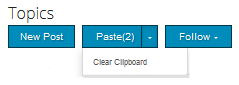

# Moderación del contenido de la comunidad {#moderating-community-content}

## Información general {#overview}

El contenido de la comunidad, también conocido como contenido generado por el usuario (UGC, por sus siglas en inglés), se crea cuando un miembro (que ha iniciado sesión en el visitante del sitio) publica contenido desde un sitio de la comunidad publicado mediante la interacción con uno de los siguientes componentes de la comunidad:

* [Blog](/help/communities/blog-feature.md): los miembros publican un artículo de blog o un comentario.
* [Calendario](/help/communities/calendar.md): los miembros publican un evento o comentario de calendario.
* [Comentarios](/help/communities/comments.md): los miembros publican un comentario o responden a un comentario.

* [Foro](/help/communities/forum.md): los miembros publican un tema nuevo o responden a él.
* [Ideación](/help/communities/ideation-feature.md): los miembros publican una idea o un comentario.
* [QnA](/help/communities/working-with-qna.md): los miembros crean una pregunta o responden a una pregunta.
* [Reseñas](/help/communities/reviews.md): los miembros publican un comentario al valorar un elemento.

La moderación de UGC es útil para reconocer las contribuciones positivas así como para limitar las negativas (como spam y lenguaje abusivo). La UGC se puede moderar desde varios entornos:

* [Almacenamiento de contenido de la comunidad](working-with-srp.md)

* [Consola de moderación masiva](moderation.md)

   Los administradores y [moderadores de la comunidad](/help/communities/users.md) del entorno público pueden acceder a la consola Moderación, así como los administradores del entorno de creación. Esto es posible cuando el contenido de la comunidad se almacena en un [almacén común](/help/communities/working-with-srp.md).

* [Moderación en contexto](in-context.md)

   Los administradores y los moderadores de la comunidad pueden moderar el entorno de publicación directamente en la página en la que se publicó el contenido.

## Acciones de moderación {#moderation-actions}

Las acciones que se pueden realizar en el contenido publicado (UGC) varían según la identidad del usuario y el entorno. La siguiente tabla utiliza la siguiente terminología para describir los diferentes roles según la identidad del usuario:

* `Admin`

   Usuario que es miembro del grupo [administradores de comunidad](users.md).

* `Moderator`

   Un miembro de un grupo [de moderadores de comunidad](users.md#publishenvironmentusersandgroups) (tiene [permisos de moderador](in-context.md#moderatorpermissions)).

* `Creator`

   Usuario que publicó el contenido.

* `Member`

   Usuario con sesión iniciada sin permisos especiales.

* `Visitor`

   Un usuario anónimo.

<table>
 <tbody>
  <tr>
   <td> </td>
   <td><strong>Administrador</strong></td>
   <td><strong>Moderador</strong></td>
   <td><strong>Creador</strong></td>
   <td><strong>Miembro</strong></td>
   <td><strong>Visitante</strong></td>
   <td><strong>Evento  activado</strong></td>
   <td><strong>Premoderado</strong></td>
  </tr>
  <tr>
   <td><strong>Editar/  Eliminar</strong></td>
   <td>X</td>
   <td>X</td>
   <td>X</td>
   <td> </td>
   <td> </td>
   <td> </td>
   <td> </td>
  </tr>
  <tr>
   <td><strong>Cortar</strong></td>
   <td>X</td>
   <td>X</td>
   <td> </td>
   <td> </td>
   <td> </td>
   <td> </td>
   <td> </td>
  </tr>
  <tr>
   <td><strong>Denegar</strong></td>
   <td>X</td>
   <td>X</td>
   <td> </td>
   <td> </td>
   <td> </td>
   <td>X</td>
   <td> </td>
  </tr>
  <tr>
   <td><strong>Cerrar/  Volver a abrir</strong></td>
   <td>X</td>
   <td>X</td>
   <td> </td>
   <td> </td>
   <td> </td>
   <td>X</td>
   <td>X  </td>
  </tr>
  <tr>
   <td><strong>Marcar/  Desmarcar</strong></td>
   <td>X</td>
   <td>X</td>
   <td> </td>
   <td>X</td>
   <td> </td>
   <td>X</td>
   <td> </td>
  </tr>
  <tr>
   <td><strong>Permitir</strong></td>
   <td>X</td>
   <td>X</td>
   <td> </td>
   <td> </td>
   <td> </td>
   <td>X</td>
   <td>X</td>
  </tr>
 </tbody>
</table>

### Editar / Eliminar {#edit-delete}

Después de realizar una publicación, el creador, un administrador o un moderador de la comunidad pueden editarla o eliminarla.

Cuando se elimina UGC, se elimina del repositorio y es posible que no se recupere.

### Cortar {#cut}

Es posible que un administrador o un moderador de la comunidad mueva uno o más temas del foro o preguntas de control de calidad de una ubicación a otra. Esto incluye desde un sitio de comunidad a otro sitio de comunidad, siempre que el mismo miembro tenga privilegios de moderación en ambos sitios.

Al seleccionar la acción Cortar, el contenido se copia en un portapapeles. Se pueden copiar varias publicaciones y moverlas como un grupo a la nueva ubicación.

En la otra ubicación, cuando el contenido está presente en el portapapeles, aparece un botón Pegar junto a Nueva publicación con un número que identifica el número de publicaciones que se pegarán. El botón Pegar incluye una opción para borrar el portapapeles en lugar de pegarlo.

### Denegar {#deny}

Un moderador puede no permitir que UGC permanezca visible en el sitio publicado. Para los administradores y moderadores de la comunidad, la publicación sigue estando disponible y se anota como correo no deseado.

### Cerrar / Volver a abrir {#close-reopen}

La acción Cerrar funciona en todo el hilo de conversación (un tema del foro o el comentario inicial) e incluye todas las publicaciones o respuestas posteriores.

Cuando se cierra, no sólo no se pueden dar más respuestas, sino que tampoco se permiten acciones de moderación.

Para realizar cualquier operación, se debe volver a abrir el tema o comentario.

Los administradores o los moderadores de la comunidad pueden realizar la acción Cerrar/Volver a abrir.

### Marcar / Desmarcar {#flag-unflag}

Marcar es un medio para que cualquier miembro que haya iniciado sesión, excepto el creador del contenido, indique que hay un problema con el contenido de una publicación. Una vez marcado, aparecerá un icono de desmarca que permitirá al mismo miembro desmarcar el contenido.

La moderación en contexto se puede configurar para permitir que los miembros seleccionen un motivo al marcar una publicación. La lista de motivos de indicador seleccionables se puede configurar, incluso si se puede especificar o no un motivo personalizado. El motivo del indicador se guarda con el UGC, pero el motivo no déclencheur ninguna acción en particular. Solo el número de indicadores déclencheur una notificación. El contenido marcado se anotará como tal, de manera que los moderadores puedan actuar en él.

El sistema realiza un seguimiento de todos los indicadores, que se marcan, y del motivo del indicador y envía un evento cuando se alcanza el umbral. Si un moderador de la comunidad permite el UGC, estos indicadores se archivan. Después de permitir y archivar, si se producen retazos posteriores, se archivarían como si no hubiera habido retazos anteriores.

### Permitir {#allow}

La acción Permitir es una opción para UGC que se ha marcado, denegado o no se ha aprobado en un sistema moderado previamente. La acción Permitir borrará cualquier estado marcado, denegado o no deseado presente y archivará los datos marcados.

## Conceptos de moderación comunes {#common-moderation-concepts}

### Premoderación {#premoderation}

Cuando UGC se modera previamente, la publicación no aparecerá en el sitio publicado hasta que se apruebe mediante una acción de moderación. Durante la creación de un [sitio de comunidad](/help/communities/sites-console.md), al marcar la casilla [El contenido está premoderado](sites-console.md#moderation) se habilitará la premoderación para todo el sitio. Una vez que los componentes se colocan en una página, los componentes que admiten moderación se pueden configurar para la premoderación mediante un ajuste en el cuadro de diálogo de edición:

*  Comentarios y  
revisiones en Moderación **** del usuario >  **[!UICONTROL Premoderación]**.

* [Foro](/help/communities/forum.md),  [ideación](/help/communities/ideation-feature.md),  [QnA](/help/communities/working-with-qna.md) y  
configuración **[!UICONTROL del calendario>]** Moderado ****.

### Detección de spam {#spam-detection}

La detección de correo no deseado es una funcionalidad de moderación automática que filtros partes indeseables de contenido generado por el usuario enviado marcándolos como correo no deseado. Una vez activado, identifica si el contenido generado por el usuario es spam o no se basa en una colección preconfigurada de palabras de spam. Las palabras de spam predeterminadas se proporcionan en

`/libs/settings/community/sites/moderation/spamdetector-conf/profiles/spam_words.txt`.

Sin embargo, para personalizar o ampliar las palabras de spam predeterminadas, cree un conjunto de palabras en el directorio /apps siguiendo la estructura de las palabras de spam predeterminadas mediante [overlay](/help/communities/overlay-comments.md).

Una publicación generada por el usuario (en todos los tipos de contenido, por ejemplo, blogs, foros y comentarios) que contiene palabras no deseadas se marca con el texto &quot;Esta publicación se clasificó como correo no deseado&quot; encima de la publicación.

El moderador puede ver una publicación de este tipo y marcar la misma para permitir o negar que aparezca en el sitio. Las acciones de moderación en estas publicaciones se pueden realizar en contexto o a través de la interfaz de usuario de moderación masiva.

Para habilitar el motor de detección de spam, siga estos pasos:

1. Abra [Consola Web](https://localhost:4502/system/console/configMgr), yendo a `/system/console/configMgr`.

1. Busque la configuración **Moderación automática** de AEM Communities y edítela.
1. Añada la entrada **[!UICONTROL SpamProcess]**.

>[!NOTE]
>
>La detección de spam solo se implementa para la configuración regional en inglés.

### Opinión {#sentiment}

La opinión se calcula en función del número de palabras clave positivas y negativas ([palabras clave](#configuringwatchwords)) presentes en una publicación (UGC).

La análisis de opinión utiliza un conjunto de reglas preconfiguradas y calcula la opinión del UGC. Las reglas predeterminadas se encuentran en: `/libs/cq/workflow/components/workflow/social/sentiments/rules.`

El valor que generan las reglas es de 1 (todas negativas, ninguna positiva) a 10 (todas positivas, ninguna negativa). Un valor de opinión de 5 es una opinión neutra y es el valor predeterminado.

Las reglas definidas en el componente /libs son:

* Artículo 1: establezca el valor en 1 si no hay palabras positivas y al menos una palabra negativa.
* Artículo 2: establezca el valor en 10 si no hay palabras negativas y al menos una palabra positiva.
* Artículo 3: establezca el valor en 3 si hay más palabras negativas que palabras positivas.
* Artículo 4: establezca el valor en 8 si hay más palabras positivas que negativas.

Para sobrescribir o agregar reglas, cree un conjunto de reglas en el directorio /apps siguiendo la estructura de las reglas predeterminadas. Edite la configuración de opinión para identificar la ubicación de las reglas.

Una vez analizada, la opinión se almacena con el UGC.

Desde la [consola de moderación masiva](/help/communities/moderation.md), es posible filtrar y vista UGC en función de si la opinión es negativa, neutra o positiva.

#### Palabras clave {#watchwords}

AEM comunidades proporciona un *analizador de palabras clave* como un paso en el proceso para evaluar la [opinión](#sentiment). La contribución al valor de opinión que proporcionan las palabras clave se debe a una comparación de las palabras clave negativas y positivas utilizadas en el contenido publicado, así como de las palabras prohibidas.

#### Configurar la opinión y las palabras clave {#configure-sentiment-and-watchwords}

La lista de palabras de observación positivas y negativas se puede personalizar, al igual que las reglas de opinión.

La lista predeterminada de las palabras de observación se puede introducir como propiedades de un nodo en el repositorio, similar al valor predeterminado o anulando el valor predeterminado configurando el servicio OSGi `sentimentprocess.name` con la lista de palabras.

También se puede modificar **sentimentprocess.name** para hacer referencia a la ubicación de un conjunto personalizado de reglas de opinión.

Para configurar la opinión y las palabras clave:

* Inicie sesión en la instancia de creación como administrador.
* Abra [Consola Web](https://localhost:4502/system/console/configMgr).
* Localice `sentimentprocess.name`.
* Seleccione la configuración que desea abrir en el modo de edición.

* **Palabras de observación positivas**

   Lista de palabras separadas por coma que contribuye a una opinión positiva que anula los valores predeterminados. El valor predeterminado es una lista vacía.

* **Palabras de observación negativas**

   Lista de palabras separadas por coma que contribuye a una opinión negativa que anula los valores predeterminados. El valor predeterminado es una lista vacía.

* **Ruta explícita al nodo Watchwords**

   Ubicación del repositorio de un nodo que contiene las propiedades `positive` y `negative` predeterminadas que especifican las palabras clave predeterminadas. El valor predeterminado es `/libs/settings/community/watchwords/default`.

* **Reglas de opinión**

   Ubicación del repositorio de las reglas para calcular la opinión en función de las palabras de observación positivas y negativas. El valor predeterminado es `/libs/cq/workflow/components/workflow/social/sentiments/rules` (sin embargo, ya no hay ningún flujo de trabajo involucrado).

A continuación se muestra un ejemplo de una entrada personalizada para las palabras clave predeterminadas, cuando `Explicit Path to Watchwords Node` se establece en `/libs/settings/community/watchwords/default`.

### Permisos del moderador {#moderator-permissions}

Los siguientes permisos, cuando se asignan al mismo recurso, se denominan de forma colectiva `moderator permissions`:

* `Read`
* `Modify`
* `Create`
* `Delete`
* `Replicate`

