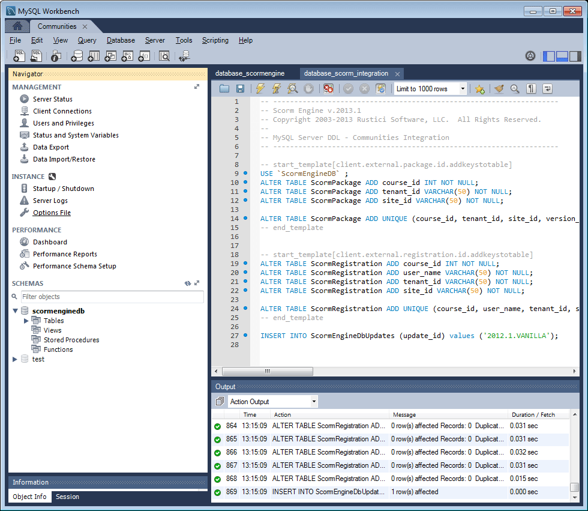

# Configuración de MySQL para funciones de habilitación {#mysql-configuration-for-enablement-features}

MySQL es una base de datos relacional que se utiliza principalmente para el seguimiento de SCORM y los datos de informes para los recursos de habilitación. Se incluyen tablas para otras funciones, como el seguimiento de la pausa y reanudación del vídeo.

Estas instrucciones describen cómo conectarse al servidor MySQL, establecer la base de datos de habilitación y rellenar la base de datos con datos iniciales.

## Requisitos  {#requirements}

Antes de configurar MySQL para la función de habilitación de comunidades, asegúrese de

* Instalar [servidor MySQL](https://dev.mysql.com/downloads/mysql/) Community Server versión 5.6:
   * La versión 5.7 no es compatible con SCORM.
   * AEM Puede ser el mismo servidor que la instancia de autor de la.
* AEM En todas las instancias de, instale el [Controlador JDBC para MySQL](deploy-communities.md#jdbc-driver-for-mysql).
* Instalar [MySQL Workbench](https://dev.mysql.com/downloads/tools/workbench/).
* AEM En todas las instancias de, instale [Paquete SCORM](enablement.md#scorm).

## Instalación de MySQL {#installing-mysql}

MySQL debe descargarse e instalarse siguiendo las instrucciones para el sistema operativo de destino.

### Nombres de tabla en minúsculas {#lower-case-table-names}

Como SQL no distingue entre mayúsculas y minúsculas, en los sistemas operativos que distinguen entre mayúsculas y minúsculas es necesario incluir una configuración para que todos los nombres de tabla estén en minúsculas.

Por ejemplo, para especificar todos los nombres de tablas en minúsculas en un sistema operativo Linux:

* Editar archivo `/etc/my.cnf`
* En el `[mysqld]` , añada la línea siguiente: `lower_case_table_names = 1`

### Conjunto de caracteres UTF8 {#utf-character-set}

Para proporcionar una mejor compatibilidad multilingüe, es necesario utilizar el conjunto de caracteres UTF8.

Cambie MySQL para que tenga UTF8 como conjunto de caracteres:
* mysql > SET NAMES &#39;utf8&#39;;

Cambie la base de datos MySQL a UTF8 de forma predeterminada:
* Editar archivo `/etc/my.cnf`
* En el `[client]` , añada: `default-character-set=utf8`
* En el `[mysqld]` , añada: `character-set-server=utf8`

## Instalación de MySQL Workbench {#installing-mysql-workbench}

MySQL Workbench proporciona una interfaz de usuario para ejecutar scripts SQL que instalan el esquema y los datos iniciales.

MySQL Workbench debe descargarse e instalarse siguiendo las instrucciones para el sistema operativo de destino.

## Conexión de habilitación {#enablement-connection}

Cuando se inicia por primera vez MySQL Workbench, a menos que ya se esté utilizando para otros fines, aún no se mostrará ninguna conexión:

### Nueva configuración de conexión {#new-connection-settings}

1. Seleccione el icono &quot;+&quot; a la derecha de `MySQL Connections`.
1. En el diálogo `Setup New Connection`AEM , introduzca los valores apropiados para su plataforma con fines de demostración, con la instancia de creación de la instancia de y MySQL en el mismo servidor:
   * Nombre de la conexión: `Enablement`
   * Método de conexión: `Standard (TCP/IP)`
   * Nombre de host: `127.0.0.1`
   * Nombre de usuario: `root`
   * Una contraseña: `no password by default`
   * Esquema predeterminado: `leave blank`
1. Seleccionar `Test Connection` para comprobar la conexión con el servicio MySQL en ejecución.

**Notas**:
* El puerto predeterminado es `3306`.
* El `Connection Name` elegido se introduce como `datasource` nombre en [Configuración OSGi de JDBC](#configure-jdbc-connections).

#### Conexión correcta {#successful-connection}

#### Nueva conexión de habilitación {#new-enablement-connection}

## Configuración de base de datos {#database-setup}

Al abrir la nueva conexión de Habilitación, observe que hay un esquema de prueba y cuentas de usuario predeterminadas.

### Obtener scripts SQL {#obtain-sql-scripts}

Los scripts SQL se obtienen utilizando CRXDE Lite en la instancia de autor. El [Paquete SCORM](deploy-communities.md#scorm) debe estar instalado:

1. Navegar al CRXDE Lite:
   * Por ejemplo, [http://localhost:4502/crx/de](http://localhost:4502/crx/de)
1. Expanda el `/libs/social/config/scorm/` carpeta
1. Descargar `database_scormengine.sql`
1. Descargar `database_scorm_integration.sql`

Un método para descargar el esquema es el siguiente:

* Seleccione el `jcr:content` nodo para el archivo sql.
* Observe el valor de `jcr:data` La propiedad es un vínculo de vista.
* Seleccione el vínculo Ver para guardar los datos en un archivo local.

### Crear base de datos SCORM {#create-scorm-database}

La base de datos SCORM de habilitación que se va a crear es:

* name: `ScormEngineDB`
* creado a partir de scripts:
   * esquema: `database_scormengine.sql`
   * datos: `database_scorm_integration.sql`
Siga estos pasos (
[open](#step-open-sql-file), [ejecutar](#step-execute-sql-script)) para instalar cada [Script SQL](#obtain-sql-scripts) . [Actualizar](#refresh) cuando sea necesario para ver los resultados de la ejecución del script.

Asegúrese de instalar el esquema antes de instalar los datos.

>[!CAUTION]
>
>Si se cambia el nombre de la base de datos, asegúrese de especificarlo correctamente en:
>
>* [Configuración de JDBC](#configure-jdbc-connections)
>* [Configuración de SCORM](#configure-scorm)

#### Paso 1: abrir el archivo SQL {#step-open-sql-file}

En MySQL Workbench

* En el menú desplegable Archivo
* Seleccione `Open SQL Script ...`
* En este orden, seleccione una de las siguientes opciones:
   1. `database_scormengine.sql`
   1. `database_scorm_integration.sql`

#### Paso 2: Ejecutar Script SQL {#step-execute-sql-script}

En la ventana de Workbench para el archivo abierto en el paso 1, seleccione `lightening (flash) icon` para ejecutar la secuencia de comandos.

Tenga en cuenta que la ejecución de `database_scormengine.sql` El script para crear la base de datos SCORM puede tardar un minuto en completarse.

#### Actualizar {#refresh}

Una vez ejecutados los scripts, es necesario actualizar el `SCHEMAS` de la sección `Navigator` para ver la nueva base de datos. Utilice el icono de actualización a la derecha de &quot;ESQUEMAS&quot;:

#### Resultado: scormenginedb {#result-scormenginedb}

Después de instalar y actualizar SCHEMAS, la variable `scormenginedb` será visible.

## Configuración de conexiones JDBC {#configure-jdbc-connections}

La configuración OSGi para **Grupo de conexiones JDBC de Day Commons** configura el Controlador JDBC de MySQL.

AEM Todas las instancias de publicación y de creación de la instancia de deben apuntar al mismo servidor MySQL.

AEM Cuando MySQL se ejecuta en un servidor diferente de, se debe especificar el nombre de host del servidor en lugar de &quot;localhost&quot; en el conector JDBC (que rellena el [ScormEngine](#configurescormengineservice) config).

* AEM En cada instancia de autor y publicación de la
* Ha iniciado sesión con privilegios de administrador
* Acceda a la [consola web](../../help/sites-deploying/configuring-osgi.md)
   * Por ejemplo, [http://localhost:4502/system/console/configMgr](http://localhost:4502/system/console/configMgr)
* Busque el `Day Commons JDBC Connections Pool`
* Seleccione el `+` para crear una nueva configuración

   

* Introduzca los siguientes valores:
   * **[!UICONTROL Clase de controlador JDBC]**: `com.mysql.jdbc.Driver`
   * **URI de conexión DBC**: `jdbc:mysql://localhost:3306/aem63reporting` AEM especifique el servidor en lugar de localhost si el servidor MySQL no es el mismo que el servidor &quot;this&quot; de la aplicación de la aplicación de tipo &quot;this&quot; (este).
   * **[!UICONTROL Nombre de usuario]**: raíz o introduzca el nombre de usuario configurado para el servidor MySQL, si no es &quot;raíz&quot;.
   * **[!UICONTROL Contraseña]**: borre este campo si no hay contraseña establecida para MySQL, de lo contrario introduzca la contraseña configurada para el nombre de usuario de MySQL.
   * **[!UICONTROL Nombre de Datasource]**: Nombre introducido para el [Conexión MySQL](#new-connection-settings), por ejemplo, &quot;habilitación&quot;.
* Seleccione **[!UICONTROL Guardar]**.

## Configurar Scorm {#configure-scorm}

### Servicio de AEM Communities ScormEngine {#aem-communities-scormengine-service}

La configuración OSGi para **Servicio de AEM Communities ScormEngine** configura SCORM para el uso del servidor MySQL por parte de una comunidad de habilitación.

Esta configuración está presente cuando el [Paquete SCORM](deploy-communities.md#scorm-package) está instalado.

Todas las instancias de publicación y autor apuntan al mismo servidor MySQL.

AEM Cuando MySQL se ejecuta en un servidor diferente de, se debe especificar el nombre de host del servidor en lugar de &quot;localhost&quot; en el servicio ScormEngine, que generalmente se rellena desde el [Conexión JDBC](#configure-jdbc-connections) config.

* AEM En cada instancia de autor y publicación de la
* Ha iniciado sesión con privilegios de administrador
* Acceda a la [consola web](../../help/sites-deploying/configuring-osgi.md)
   * Por ejemplo, [http://localhost:4502/system/console/configMgr](http://localhost:4502/system/console/configMgr)
* Busque el `AEM Communities ScormEngine Service`
* Seleccione el icono de edición

   

* Compruebe que los siguientes valores de parámetro son coherentes con el [Conexión JDBC](#configurejdbcconnectionspool) configuración:
   * **[!UICONTROL URI de conexión JDBC]**: `jdbc:mysql://localhost:3306/ScormEngineDB` *ScormEngineDB* es el nombre de base de datos predeterminado en los scripts SQL
   * **[!UICONTROL Nombre de usuario]**: raíz o introduzca el nombre de usuario configurado para el servidor MySQL, si no es &quot;raíz&quot;
   * **[!UICONTROL Contraseña]**: borre este campo si no hay contraseña establecida para MySQL, de lo contrario introduzca la contraseña configurada para el nombre de usuario de MySQL
* Con respecto al siguiente parámetro:
   * **[!UICONTROL Contraseña de usuario de Scorm]**: NO EDITAR

      Solo para uso interno: es para un usuario de servicio especial utilizado por AEM Communities para comunicarse con el motor de puntuación.
* Seleccione **[!UICONTROL Guardar]**

### Adobe Granite CSRF Filter {#adobe-granite-csrf-filter}

Para garantizar que los cursos de habilitación funcionen correctamente en todos los navegadores, es necesario añadir Mozilla como agente de usuario que no está marcado por el filtro CSRF.

* AEM Inicie sesión en la instancia de publicación de la con privilegios de administrador.
* Acceda a la [consola web](../../help/sites-deploying/configuring-osgi.md)
   * Por ejemplo, [http://localhost:4503/system/console/configMgr](http://localhost:4503/system/console/configMgr)
* Localizar `Adobe Granite CSRF Filter`.
* Seleccione el icono de edición.

   

* Seleccione el `[+]` para agregar un agente de usuario seguro.
* Entrar `Mozilla/*`.
* Seleccione **[!UICONTROL Guardar]**.
