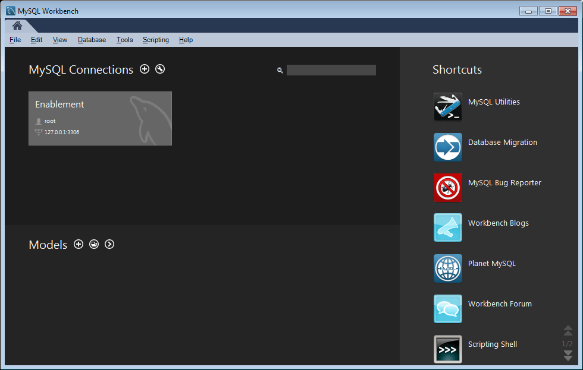

# Funciones de configuración de MySQL para habilitación {#mysql-configuration-for-enablement-features}

MySQL es una base de datos relacional que se utiliza principalmente para el seguimiento SCORM y los datos de sistema de informes para los recursos de habilitación. Se incluyen tablas para otras funciones, como el seguimiento de pausa/reanudación de vídeo.

Estas instrucciones describen cómo conectarse al servidor MySQL, establecer la base de datos de habilitación y rellenar la base de datos con datos iniciales.

## Requisitos {#requirements}

Antes de configurar la función de habilitación de MySQL para Comunidades, asegúrese de

* Instale [MySQL Server](https://dev.mysql.com/downloads/mysql/) Community Server versión 5.6:
   * La versión 5.7 no es compatible con SCORM.
   * Puede ser el mismo servidor que la instancia AEM autor.
* En todos los casos AEM, instale el controlador oficial [JDBC para MySQL](deploy-communities.md#jdbc-driver-for-mysql).
* Instale [Área de trabajo de MySQL](https://dev.mysql.com/downloads/tools/workbench/).
* En todos los casos AEM, instale el [paquete SCORM](enablement.md#scorm).

## Instalación de MySQL {#installing-mysql}

MySQL debe descargarse e instalarse siguiendo las instrucciones para el sistema operativo destinatario.

### Nombres de tablas en minúscula {#lower-case-table-names}

Como SQL no distingue entre mayúsculas y minúsculas, en los sistemas operativos que distinguen entre mayúsculas y minúsculas, es necesario incluir una configuración para reducir el uso de mayúsculas y minúsculas en todos los nombres de tabla.

Por ejemplo, para especificar todos los nombres de tabla en minúsculas en un sistema operativo Linux:

* Editar archivo `/etc/my.cnf`
* En la sección `[mysqld]`, agregue la línea siguiente: `lower_case_table_names = 1`

### Conjunto de caracteres UTF8 {#utf-character-set}

Para ofrecer una mejor compatibilidad multilingüe, es necesario utilizar el conjunto de caracteres UTF8.

Cambie MySQL para que tenga UTF8 como conjunto de caracteres:
* mysql > NOMBRES SET &#39;utf8&#39;;

Cambie la base de datos MySQL a UTF8 de forma predeterminada:
* Editar archivo `/etc/my.cnf`
* En la sección `[client]`, agregue: `default-character-set=utf8`
* En la sección `[mysqld]`, agregue: `character-set-server=utf8`

## Instalación de MySQL Workbench {#installing-mysql-workbench}

MySQL Workbench proporciona una interfaz de usuario para ejecutar scripts SQL que instalan el esquema y los datos iniciales.

MySQL Workbench debe descargarse e instalarse siguiendo las instrucciones del sistema operativo destinatario.

## Habilitación de la conexión {#enablement-connection}

Cuando MySQL Workbench se inicia por primera vez, a menos que ya se esté utilizando para otros fines, aún no mostrará ninguna conexión:

### Nueva configuración de conexión {#new-connection-settings}

1. Seleccione el icono &#39;+&#39; a la derecha de `MySQL Connections`.
1. En el cuadro de diálogo `Setup New Connection`, introduzca valores adecuados para su plataforma con fines de demostración, con la instancia de creación AEM y MySQL en el mismo servidor:
   * Nombre de la conexión: `Enablement`
   * Método de conexión: `Standard (TCP/IP)`
   * Nombre de host: `127.0.0.1`
   * Nombre de usuario: `root`
   * Contraseña: `no password by default`
   * Esquema predeterminado: `leave blank`
1. Seleccione `Test Connection` para verificar la conexión con el servicio MySQL en ejecución.

**Notas**:
* El puerto predeterminado es `3306`.
* El `Connection Name` elegido se introduce como el nombre `datasource` en [configuración OSGi JDBC](#configure-jdbc-connections).

#### Conexión correcta {#successful-connection}

#### Nueva conexión de habilitación {#new-enablement-connection}

## Configuración de base de datos {#database-setup}

Al abrir la nueva conexión de habilitación, observe que hay un esquema de prueba y cuentas de usuario predeterminadas.

### Obtención de secuencias de comandos de SQL {#obtain-sql-scripts}

Las secuencias de comandos SQL se obtienen mediante CRXDE Lite en la instancia de creación. El [paquete SCORM](deploy-communities.md#scorm) debe estar instalado:

1. Buscar CRXDE Lite:
   * Por ejemplo: [http://localhost:4502/crx/de](http://localhost:4502/crx/de)
1. Expanda la carpeta `/libs/social/config/scorm/`
1. Descargar `database_scormengine.sql`
1. Descargar `database_scorm_integration.sql`

Un método para descargar el esquema es:

* Seleccione el nodo `jcr:content` para el archivo sql.
* Observe que el valor de la propiedad `jcr:data` es un vínculo de vista.
* Seleccione el vínculo de vista para guardar los datos en un archivo local.

### Crear base de datos SCORM {#create-scorm-database}

La base de datos SCORM de habilitación que se va a crear es:

* name: `ScormEngineDB`
* creados a partir de secuencias de comandos:
   * esquema: `database_scormengine.sql`
   * data: `database_scorm_integration.sql`
Siga los pasos a continuación (
[abrir](#step-open-sql-file),  [ejecutar](#step-execute-sql-script)) para instalar cada secuencia de comandos  [SQL](#obtain-sql-scripts) .  Actualice cuando sea necesario para ver los resultados de la ejecución de la secuencia de comandos.

Asegúrese de instalar el esquema antes de instalar los datos.

>[!CAUTION]
>
>Si se cambia el nombre de la base de datos, asegúrese de especificarlo correctamente en:
>
>* [Configuración JDBC](#configure-jdbc-connections)
>* [Configuración de SCORM](#configure-scorm)

#### Paso 1: abrir archivo SQL {#step-open-sql-file}

En el área de trabajo de MySQL

* Desde el menú desplegable Archivo
* Seleccione `Open SQL Script ...`
* En este orden, seleccione una de las siguientes opciones:
   1. `database_scormengine.sql`
   1. `database_scorm_integration.sql`

#### Paso 2: ejecutar SQL Script {#step-execute-sql-script}

En la ventana Workbench del archivo abierto en el paso 1, seleccione `lightening (flash) icon` para ejecutar la secuencia de comandos.

Tenga en cuenta que la ejecución de la secuencia de comandos `database_scormengine.sql` para crear la base de datos SCORM puede tardar un minuto en completarse.

#### Actualizar {#refresh}

Una vez ejecutadas las secuencias de comandos, es necesario actualizar la sección `SCHEMAS` de `Navigator` para poder ver la nueva base de datos. Utilice el icono de actualización a la derecha de &#39;ESQUEMAS:

#### Resultado: scormenginedb {#result-scormenginedb}

Después de instalar y actualizar ESQUEMAS, el `scormenginedb` estará visible.

## Configurar conexiones JDBC {#configure-jdbc-connections}

La configuración OSGi para **Day Commons JDBC Connections Pool** configura el controlador JDBC de MySQL.

Todas las instancias de publicación y creación AEM deben apuntar al mismo servidor MySQL.

Cuando MySQL se ejecuta en un servidor diferente de AEM, el nombre de host del servidor debe especificarse en lugar de &#39;localhost&#39; en el conector JDBC (que rellena la configuración [ScormEngine](#configurescormengineservice)).

* En cada instancia de creación y publicación AEM
* Inicio de sesión con privilegios de administrador
* Acceda a la [consola web](../../help/sites-deploying/configuring-osgi.md)
   * Por ejemplo: [http://localhost:4502/system/console/configMgr](http://localhost:4502/system/console/configMgr)
* Busque el `Day Commons JDBC Connections Pool`
* Seleccione el icono `+` para crear una nueva configuración

   

* Introduzca los valores siguientes:
   * **[!UICONTROL Clase]** de controlador JDBC:  `com.mysql.jdbc.Driver`
   * **URL** de conexión DBC:  `jdbc:mysql://localhost:3306/aem63reporting` especifique el servidor en lugar de localhost si MySQL Server no es el mismo que &#39;this&#39; AEM server.
   * **[!UICONTROL Nombre de usuario]**: Raíz o escriba el nombre de usuario configurado para el servidor MySQL, si no es &#39;raíz&#39;.
   * **[!UICONTROL Contraseña]**: Borre este campo si no hay ninguna contraseña establecida para MySQL, de lo contrario introduzca la contraseña configurada para el nombre de usuario de MySQL.
   * **[!UICONTROL Nombre]** del origen de datos: Nombre introducido para la conexión MySQL, por ejemplo, &quot;habilitación&quot;.
* Seleccione **[!UICONTROL Guardar]**.

## Configurar Scorm {#configure-scorm}

### Servicio AEM Communities ScormEngine {#aem-communities-scormengine-service}

La configuración OSGi para **Servicio de AEM Communities ScormEngine** configura SCORM para el uso del servidor MySQL por parte de una comunidad de habilitación.

Esta configuración está presente cuando se instala el [paquete SCORM](deploy-communities.md#scorm-package).

Todas las instancias de publicación y creación apuntan al mismo servidor MySQL.

Cuando MySQL se ejecuta en un servidor diferente de AEM, el nombre de host del servidor debe especificarse en lugar de &#39;localhost&#39; en el servicio ScormEngine, que se rellena generalmente desde la configuración [Conexión JDBC](#configure-jdbc-connections).

* En cada instancia de creación y publicación AEM
* Inicio de sesión con privilegios de administrador
* Acceda a la [consola web](../../help/sites-deploying/configuring-osgi.md)
   * Por ejemplo: [http://localhost:4502/system/console/configMgr](http://localhost:4502/system/console/configMgr)
* Busque el `AEM Communities ScormEngine Service`
* Seleccione el icono de edición

   

* Verifique que los siguientes valores de parámetro sean coherentes con la configuración [Conexión JDBC](#configurejdbcconnectionspool):
   * **[!UICONTROL URI]** de conexión JDBC:  `jdbc:mysql://localhost:3306/ScormEngineDB` ** ScormEngineDBes el nombre de base de datos predeterminado en las secuencias de comandos SQL
   * **[!UICONTROL Nombre de usuario]**: Raíz o escriba el nombre de usuario configurado para el servidor MySQL, si no &#39;raíz&#39;
   * **[!UICONTROL Contraseña]**: Borre este campo si no hay ninguna contraseña establecida para MySQL, de lo contrario introduzca la contraseña configurada para el nombre de usuario de MySQL
* Respecto al parámetro siguiente:
   * **[!UICONTROL Contraseña]** de usuario de Scorm: NO EDITAR

      Solo para uso interno: Es para un usuario de servicio especial que AEM Communities utiliza para comunicarse con el motor de escorm.
* Seleccione **[!UICONTROL Guardar]**

### Filtro CSRF de granito de Adobe {#adobe-granite-csrf-filter}

Para garantizar que los cursos de habilitación funcionen correctamente en todos los exploradores, es necesario agregar Mozilla como agente de usuario que no esté marcado por el filtro CSRF.

* Inicie sesión en la instancia de publicación de AEM con privilegios de administrador.
* Acceda a la [consola web](../../help/sites-deploying/configuring-osgi.md)
   * Por ejemplo: [http://localhost:4503/system/console/configMgr](http://localhost:4503/system/console/configMgr)
* Localice `Adobe Granite CSRF Filter`.
* Seleccione el icono de edición.

   

* Seleccione el icono `[+]` para agregar un agente de usuario seguro.
* Escriba `Mozilla/*`.
* Seleccione **[!UICONTROL Guardar]**.

