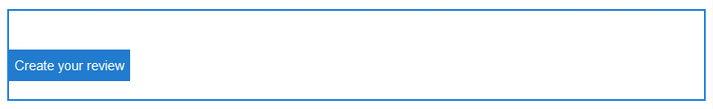

# Notificaciones de comunidades{#communities-notifications}

## Información general {#overview}

Comunidades de AEM proporciona una sección de notificaciones que muestra los eventos de interés para el miembro de la comunidad que ha firmado.

Las notificaciones son similares a [las actividades](/help/communities/essentials-activities.md) y [suscripciones](/help/communities/subscriptions.md) que pueden resultar de

* el miembro que publica contenido
* el miembro que decide seguir a otro miembro
* el miembro que elige seguir temas específicos, artículos y otros hilos de contenido
* el usuario que etiqueta (@Mención) otro miembro de la comunidad en un contenido generado por el usuario

Lo que distingue las notificaciones de las actividades y las suscripciones es

* siempre hay un vínculo a la sección de notificaciones en el encabezado de un sitio de comunidad

   * las actividades requieren que la función [de flujo de](/help/communities/functions.md#activity-stream-function) actividad se incluya en la estructura del sitio de la comunidad
   * las suscripciones requieren [la configuración del correo electrónico](/help/communities/email.md)

* la implementación de las notificaciones se realiza a través de canales escalables y conectables

   * las actividades solo están disponibles en la web
   * las suscripciones solo están disponibles mediante correo electrónico

A partir de Communities [FP1](/help/communities/deploy-communities.md#latestfeaturepack), los canales de notificación disponibles son

* el canal web, al que se accede mediante el `Notifications` vínculo
* el canal de correo electrónico, disponible cuando el correo electrónico está configurado correctamente

Los canales futuros son móviles y de escritorio.

### Requisitos {#requirements}

**Configurar correo electrónico**

El correo electrónico debe configurarse para que el canal de correo electrónico de las notificaciones funcione.

Para obtener instrucciones sobre cómo configurar el correo electrónico, consulte [Configuración del correo electrónico](/help/communities/analytics.md).

**Habilitar Seguir**

Los componentes deben configurarse para habilitar lo siguiente. Las funciones que permiten lo siguiente son [blog](/help/communities/blog-feature.md), [foro](/help/communities/forum.md), [QnA](/help/communities/working-with-qna.md), [calendario](/help/communities/calendar.md), [biblioteca](/help/communities/file-library.md)[](/help/communities/comments.md)de archivos y comentarios.

Tenga en cuenta que:

* los componentes utilizados dentro de las plantillas [de](/help/communities/sites.md) sitio de la comunidad y las plantillas [de](/help/communities/tools-groups.md) grupo ya pueden configurarse para permitir lo siguiente

* los perfiles de miembros ya están configurados para permitir que otros miembros sigan

## Notificaciones de lo siguiente {#notifications-from-following}


El botón **Seguir **proporciona un medio para seguir las entradas como actividades, suscripciones y/o notificaciones. Cada vez que se selecciona el botón **Seguir **se puede activar o desactivar una selección. La `Email Subscriptions` selección solo está presente cuando está configurada.

Si se selecciona cualquier método de seguimiento, el texto del botón cambia a **Siguiente**. Para mayor comodidad, es posible seleccionar `Unfollow All` desactivar todos los métodos.

Aparecerá el botón **Seguir **

* al ver el perfil de otro miembro
* en una página de características principal, como foros, QnA y blogs

   * sigue toda la actividad de esa función general

* para una entrada específica, como un tema del foro, una pregunta de preguntas y respuestas o un artículo del blog

   * sigue toda la actividad de esa entrada específica

## Administración de la configuración de notificaciones {#managing-notification-settings}

Al seleccionar el vínculo Configuración de notificación en la página Notificaciones, cada miembro puede administrar cómo se reciben las notificaciones.

El canal web siempre está habilitado.


El canal de correo electrónico, que depende de la [configuración correcta del correo electrónico](/help/communities/email.md), proporciona la misma configuración que para el canal web.

El canal de correo electrónico está desactivado de forma predeterminada.



Un miembro puede activarlo, pero aún depende de la configuración del correo electrónico.


## Visualización de notificaciones{#viewing-notifications} 

### Notificaciones Web {#web-notifications}

Un [asistente creado en un sitio](/help/communities/sites-console.md) de comunidad ahora incluye un vínculo a la `Notifications` función en la barra de encabezado del sitio que hay encima del letrero. A diferencia de los mensajes, las notificaciones se crean para cada sitio de la comunidad, mientras que los mensajes se deben habilitar durante el proceso de creación del sitio.

Al visitar el sitio publicado, al seleccionar el `Notifications` vínculo se mostrarán todas las notificaciones del miembro.


### Notificaciones de correo electrónico {#email-notifications}

Cuando el canal de correo electrónico está habilitado, el miembro recibe un correo electrónico que contiene un vínculo al contenido de la web.


## Personalizar notificaciones por correo electrónico {#customize-email-notifications}

Las organizaciones pueden personalizar las notificaciones por correo electrónico [superponiendo](/help/communities/client-customize.md#overlays) las plantillas en **/libs/settings/community/templates/email/html**.

Por ejemplo, para modificar las notificaciones de mensajes de correo electrónico de menciones (para un componente de comunidad), agregue una** si **condición para la **mención de verbo** en las plantillas de los componentes para los que habilitó la compatibilidad con **@mentions** .

Para modificar la plantilla de notificaciones de correo electrónico para @uncia en los comentarios del blog, coloque la plantilla predeterminada en: **/libs/settings/community/templates/email/html/social.journal.components.hbs.comment/es**

```java
{{#equals this.verb "mention"}}\
    A new mention <a href="{{objectUrl}}">comment</a> {{#if this.target.properties.[jcr:title]}}to the article "{{{target.displayName}}}" {{/if}}was added by {{{user.name}}} on {{dateUtil this.published format="EEE, d MMM yyyy HH:mm:ss z"}}.\n \
{{/equals}}\
```

