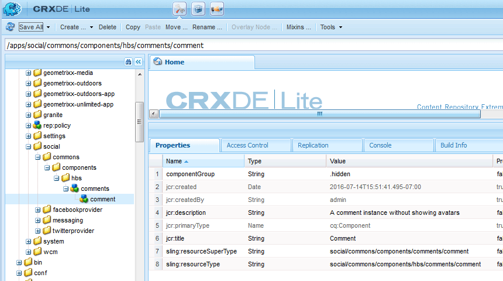

# Crear nodos {#create-nodes}

Superponga el sistema de comentarios con una versión personalizada copiando el número mínimo de archivos necesarios de `/libs` en `/apps` y modificarlos en `/apps`.

>[!CAUTION]
>
>El contenido de la carpeta /libs nunca se edita porque cualquier reinstalación o actualización puede eliminar o reemplazar la carpeta /libs mientras el contenido de la carpeta /apps no se modifica.

Uso de [CRXDE Lite](../../help/sites-developing/developing-with-crxde-lite.md) en una instancia de autor, comience creando una ruta en la carpeta /apps que sea idéntica a la ruta a los componentes superpuestos en la carpeta /libs.

La ruta que se está duplicando es:

* `/libs/social/commons/components/hbs/comments/comment`

Algunos nodos de la ruta son carpetas y otros son componentes.

1. Navegar a [http://localhost:4502/crx/de/index.jsp](http://localhost:4502/crx/de/index.jsp)
1. Crear `/apps/social` (si aún no existe)
   * Seleccionar `/apps` nodo
   * **[!UICONTROL Crear > Carpeta]**
      * Introduzca el nombre: `social`
1. Seleccionar `social` nodo
   * **[!UICONTROL Crear]** > **[!UICONTROL Carpeta]**
      * Introduzca el nombre: `commons`
1. Seleccionar `commons` nodo
   * **[!UICONTROL Crear > Carpeta]**
      * Introduzca el nombre: `components`
1. Seleccionar `components` nodo
   * **[!UICONTROL Crear > Carpeta]**.
      * Introduzca el nombre: `hbs`
1. Seleccionar `hbs` nodo
   * **[!UICONTROL Crear]** > **[!UICONTROL Crear componente]**
      * Introducir etiqueta: `comments`
      * Escriba el título: `Comments`
      * Escriba la descripción: `List of comments without showing avatars`
      * Super Type: `social/commons/components/comments`
      * Introducir grupo: `Communities`
      * Clic **[!UICONTROL Siguiente]** hasta **[!UICONTROL OK]**
1. Seleccionar `comments` nodo

   * **[!UICONTROL Crear]** > **[!UICONTROL Crear componente]**

      * Introducir etiqueta: `comment`
      * Escriba el título: `Comment`
      * Escriba la descripción: `A comment instance without avatars`
      * Super Type: `social/commons/components/comments/comment`
      * Introducir grupo: `.hidden`
      * Clic **[!UICONTROL Siguiente]** hasta **[!UICONTROL OK]**
   * Seleccionar **[!UICONTROL Guardar todo]**
1. Eliminar el valor predeterminado `comments.jsp`
   * Seleccionar nodo `/apps/social/commons/components/hbs/comments/comments.jsp`
   * Seleccione **[!UICONTROL Eliminar]**
1. Elimine el archivo comment.jsp predeterminado
   * seleccionar nodo `/apps/social/commons/components/hbs/comments/comment/comment.jsp`
   * Seleccione **[!UICONTROL Eliminar]**
   * Seleccionar **[!UICONTROL Guardar todo]**

>[!NOTE]
>
>Para conservar la cadena de herencia, la variable `Super Type` (propiedad) `sling:resourceSuperType`) de los componentes de superposición se establecen con el mismo valor que el `Super Type` de los componentes que se superponen, en este caso:
>
>* `social/commons/components/comments`
>* `social/commons/components/comments/comment`

La propia superposición `Type`(propiedad) `sling:resourceType`) debe ser una referencia automática relativa para que cualquier contenido que no se encuentre en /apps se busque en /libs.
* Nombre: `sling:resourceType`
* Tipo: `String`
* Valor: `social/commons/components/hbs/comments`

1. Seleccione el verde `[+] Add`
   * Nombre: `sling:resourceType`
   * Tipo: `String`
   * Valor: `social/commons/components/hbs/comments/comment`
1. Seleccione el verde `[+] Add`
   * Seleccionar **[!UICONTROL Guardar todo]**

