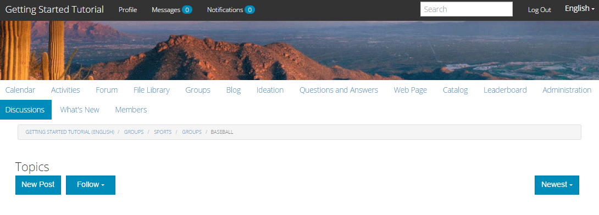

# Experimente el sitio publicado {#experience-the-published-site}

## Buscar nuevo sitio en la publicación {#browse-to-new-site-on-publish}

Ahora que se ha publicado el sitio de comunidades recién creado, busque la dirección URL que se muestra al crear el sitio, pero en el servidor de publicación, por ejemplo:

* URL del autor = https://localhost:4502/content/sites/engage/en.html
* URL de publicación = https://localhost:4503/content/sites/engage/en.html

Para minimizar la confusión sobre qué miembro ha iniciado sesión en la creación y publicación, se recomienda utilizar distintos navegadores para cada instancia.

Al llegar por primera vez al sitio publicado, el visitante del sitio no suele haber iniciado sesión y sería anónimo.

`https://localhost:4503/content/sites/engage/en.html {#http-localhost-content-sites-engage-en-html}`

## Visitante del sitio anónimo {#anonymous-site-visitor}

Un visitante de sitio anónimo ve lo siguiente en la interfaz de usuario:

* Título del sitio (Tutorial de introducción)
* Sin vínculo de perfil
* Ningún vínculo de mensajes
* Ningún vínculo de notificaciones
* Campo de búsqueda
* Vínculo de inicio de sesión
* La pancarta de la marca
* Vínculos de menú para los componentes incluidos en la plantilla de sitio de referencia.

Si selecciona varios vínculos, encontrará que están en modo de solo lectura.

### Impedir el acceso anónimo a JCR {#prevent-anonymous-access-on-jcr}

Una limitación conocida expone el contenido del sitio de la comunidad a visitantes anónimos a través del contenido jcr y json, aunque **permitir acceso anónimo** está deshabilitado para el contenido del sitio. Sin embargo, este comportamiento se puede controlar mediante restricciones de Sling como solución alternativa.

Para proteger el contenido del sitio de la comunidad del acceso de usuarios anónimos a través del contenido jcr y json, siga estos pasos:

1. En la instancia de AEM Author, vaya a https:// hostname:port/editor.html/content/site/sitename.html.

   >[!NOTE]
   >
   >No vaya al sitio localizado.

1. Vaya a **Propiedades de la página**.

   

1. Vaya a la ficha **Avanzado**.

1. Habilite **Requisito de autenticación**.

   

1. Añada la ruta de la página de inicio de sesión. Por ejemplo, **/content/......./GetStarted**.
1. Publique la página.

## Miembro de la comunidad de confianza {#trusted-community-member}

Esta experiencia supone que a [Aaron McDonald](/help/communities/tutorials.md#demo-users) se le asignaron las funciones de [administrador de la comunidad y moderador](/help/communities/create-site.md#roles). Si no es así, vuelva al entorno de creación para [modificar la configuración del sitio](/help/communities/sites-console.md#modifying-site-properties) y seleccione Aaron McDonald como administrador de la comunidad y moderador.

En la esquina superior derecha, seleccione `Log in` e inicie sesión con el nombre de usuario (aaron.mcdonald@mailinator.com) y la contraseña (contraseña). Tenga en cuenta la capacidad de iniciar sesión con credenciales de Twitter o Facebook.

Una vez que haya iniciado sesión como miembro de la comunidad registrado, observe los siguientes elementos de menú para hacer clic y explorar el sitio de la comunidad:

* **** Profileoption le permite realizar vistas y editar el perfil.
*  Messagesoption le dirige a la sección de mensajería directa, donde puede:

   1. Vista los mensajes directos recibidos (Bandeja de entrada), enviados (Elementos enviados) y eliminados (Papelera).
   1. Redacte nuevos mensajes directos para enviarlos a personas y grupos.

* [La opción ](/help/communities/notifications.md) Notificaciones le dirige a la sección de notificaciones, donde puede realizar vistas de sus eventos de interés y editar la configuración de las notificaciones.
*  Administración le dirige a la página de moderación de AEM Communities, si tiene privilegios de moderación.

Observe que la página Calendario es la página de inicio porque la plantilla de sitio de referencia elegida incluía primero la función Calendario, seguida de la función Flujo de Actividad, la función Foro, etc. Esta estructura está visible desde la consola [Plantilla del sitio](/help/communities/sites.md#edit-site-template) o al modificar las propiedades del sitio en el entorno de creación:

>[!NOTE]
>
>Para obtener más información sobre los componentes y funciones de Communities, visite:
>
>* [Componentes](/help/communities/author-communities.md)  de comunidades (para autores)
>* [Componentes, funciones y características esenciales](/help/communities/essentials.md)  (para desarrolladores)

### Vínculo de foro {#forum-link}

Para vista de la función básica de foro, seleccione el vínculo Foro.

Los miembros pueden publicar un tema nuevo o seguir un tema.

Los visitantes del sitio pueden realizar vistas de anuncios y ordenarlos de diversas maneras.

### Vínculo de grupos {#groups-link}

Como Aaron es administrador de grupos, si selecciona el vínculo Grupos, Aaron podrá crear un nuevo grupo de la comunidad seleccionando una plantilla de grupo, una imagen, si el grupo es abierto o secreto, e invitando a los miembros.

Este es un ejemplo en el que se crea un grupo en el entorno de publicación.

Los grupos también pueden crearse en el entorno del autor y administrarse dentro del sitio de la comunidad en el entorno del autor ([Consola de grupos de la comunidad](/help/communities/groups.md)). La experiencia de [creación de grupos en el autor](/help/communities/nested-groups.md) es la siguiente en este tutorial.

Crear un grupo de referencia:

1. Seleccionar **Nuevo grupo**
1. **Ficha Configuración**

   * Nombre del grupo : `Sports`
   * Descripción : `A parent group for various sporting groups`.
   * Nombre de URL del grupo : `sports`
   * Seleccione `Open Group` (permita que cualquier miembro de la comunidad participe al unirse)

1. **Ficha Plantilla**

   * Seleccionar `Reference Group` (contiene una función de grupo en su estructura para permitir grupos anidados)

1. Seleccione **Crear grupo**

   

Una vez creado el nuevo grupo, **seleccione el nuevo grupo de deportes** para crear dos grupos (anidados) dentro de él. Como una estructura de sitio no puede comenzar con la función de grupos, después de abrir el grupo Deportes, es necesario seleccionar el vínculo Grupos:

El segundo conjunto de vínculos, comenzando por `Blog`, pertenece al grupo seleccionado actualmente, el grupo `Sports`. Al seleccionar el vínculo &quot;Deportes&quot; `Groups`, es posible anidar dos grupos dentro del grupo Deportes.

Como ejemplo, agregue dos `new groups`.

* Uno con el nombre `Baseball`

   * Déjelo configurado como `Open Group` (pertenencia requerida).
   * En la ficha Plantillas, seleccione `Conversational Group`.

* Uno con el nombre `Gymnastics`

   * Cambie su configuración a `Member Only Group` (pertenencia restringida).
   * En la ficha Plantillas, seleccione `Conversational Group`.

**Aviso**:

* Es posible que sea necesario actualizar la página antes de que se muestren ambos grupos.
* Esta plantilla *no* incluye la función de grupos, por lo que no será posible anidar más grupos.
* En el autor, la [consola de grupos](/help/communities/groups.md) proporciona una tercera opción: `Public Group` (membresía opcional).

Una vez creados ambos grupos, seleccione el grupo de béisbol, un grupo abierto y observe sus vínculos:

`Discussions` `What's New` `Members`

Los vínculos del grupo se muestran debajo de los vínculos del sitio principal y se muestran de la siguiente manera:

En el caso del autor: con privilegios administrativos, vaya a la consola [Grupos de comunidades](/help/communities/members.md) y agregue Weston McCall al grupo `Community Engage Gymnastics <uid> Members`.

Continuando con la publicación, cierre la sesión como Aaron McDonald y vista los grupos en el grupo de deportes como un visitante anónimo en el sitio:

* Desde página de inicio
* Seleccionar vínculo `Groups`
* Seleccionar vínculo `Sports`
* Seleccione el vínculo &quot;Deportes&quot; `Groups`

Sólo el grupo de béisbol será visible.

Inicie sesión como Weston McCall (weston.mccall@dodgit.com / contraseña) y navegue a la misma ubicación. Observe que Weston puede `Join` abrir el grupo `Baseball` y `enter or Leave` el grupo privado `Gymnastics`.

### Vínculo de página Web {#web-page-link}

Vista la página Web básica incluida en el sitio seleccionando el vínculo Página Web. Las herramientas AEM de creación estándar pueden utilizarse para agregar contenido a esta página en el entorno de creación.

Por ejemplo, vaya a la instancia **author**, abra la carpeta `engage` en la consola [Communities Sites](/help/communities/sites-console.md), seleccione el icono **Open Site** para entrar en el modo de edición del autor. A continuación, seleccione el modo de previsualización para seleccionar el vínculo `Web Page` y, a continuación, seleccione el modo de edición para añadir los componentes Título y Texto. Por último, vuelva a publicar solo la página o todo el sitio.

### Vínculo de moderación {#moderationlink}

Cuando el miembro de la comunidad tiene privilegios de moderación, el vínculo Moderación estará visible y, al seleccionarlo, se mostrará el contenido de la comunidad publicado y se permitirá que esté [moderado](/help/communities/moderate-ugc.md) de manera similar a la [consola de moderación](/help/communities/moderation.md) en el entorno de creación.

Utilice el botón Atrás del explorador para volver al sitio publicado. La mayoría de las consolas no son accesibles desde la navegación global en el entorno de publicación. 

## Autorregistro {#self-registration}

Después de cerrar sesión, es posible crear un nuevo registro de usuario.

* Seleccione `Log In`
* Seleccione `Sign up for a new account`

De forma predeterminada, la dirección de correo electrónico es la identificación de inicio de sesión. Si no se selecciona, el visitante puede introducir su propia identificación de inicio de sesión (nombre de usuario). El nombre de usuario debe ser único en el entorno de publicación.

Después de especificar el nombre, el correo electrónico y la contraseña del usuario, al seleccionar `Sign Up` se creará el usuario y se le permitirá firmar.

Una vez iniciada la sesión, la primera página presentada es su `Profile` página, que pueden personalizar.

Si el miembro olvida su identificación de inicio de sesión, es posible recuperarla utilizando su dirección de correo electrónico.

