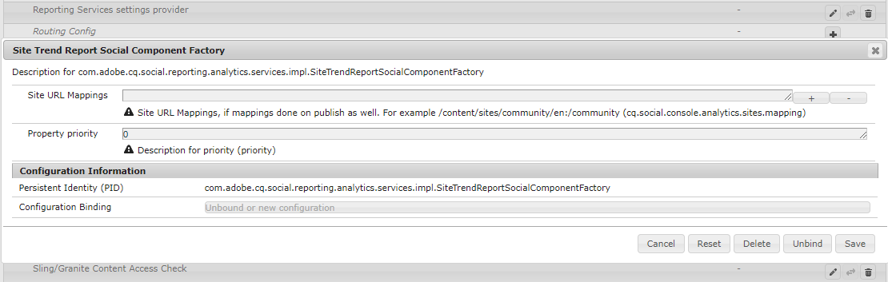

# Consola Informes {#reports-console}

## Información general {#overview}

Para AEM Communities, existen varios informes a los que se puede acceder de varias formas desde el entorno de creación.

En general, los diversos informes son:

* [Informe de asignaciones](#assignments-report)

   Para una [comunidad de habilitación](/help/communities/overview.md#enablement-community), proporciona una visión general del progreso de los estudiantes en sus asignaciones, incluida una puntuación asociada si se implementa el estándar SCORM.

* [Informe de vistas](#views-report)

   Proporciona un gráfico de vistas de contenido por miembros de la comunidad y visitantes del sitio para cualquier sitio de la comunidad.

* [Informe de anuncios](#posts-report)

   Proporciona un gráfico de varios tipos de anuncios de los miembros de la comunidad en cualquier sitio de la comunidad.

Cuando [Adobe Analytics está habilitado](/help/communities/sites-console.md#analytics), los informes incluirán la cantidad de vistas, reproducciones, comentarios y clasificaciones para cada recurso de habilitación a lo largo del tiempo.

Los informes tabulares se pueden exportar en formato .csv para su procesamiento posterior.

## Consolas de informes {#reporting-consoles}

### Informes para sitios de la comunidad {#reports-for-community-sites}

* Desde la navegación global: **[!UICONTROL Navegación]** > **[!UICONTROL Comunidades]** > **[!UICONTROL Informes]**

* Elija entre:

   * **[!UICONTROL Informe de asignaciones]**

      * Genere un informe para el sitio, el usuario o el grupo de la comunidad y la asignación seleccionados.
   * **[!UICONTROL Informe de anuncios]**

      * Genere un informe para el sitio de la comunidad, el tipo de contenido y el período de tiempo seleccionados.
   * **[!UICONTROL Informe de vistas]**

      * genere un informe para el sitio de la comunidad, el tipo de contenido y el período de tiempo seleccionados.

### Informes para recursos de habilitación y rutas de aprendizaje {#reports-for-enablement-resources-and-learning-paths}

* Desde la navegación global: **[!UICONTROL Navegación]** > **[!UICONTROL Comunidades]** > **[!UICONTROL Recursos]**

* Seleccione un sitio de comunidad de habilitación existente:

   * Seleccione el icono **Report** para generar informes que cubran todos los recursos de habilitación.
   * Seleccione una ruta de aprendizaje de habilitación.
   * Seleccione el icono **Informe** para generar informes para:

      * Los recursos de habilitación incluidos.
      * Los alumnos asignados a la ruta de aprendizaje.

* Estos informes proporcionan:

   * Datos de tabla, descargables como CSV:

      * Identificación del alumno
      * Su situación
      * Si se asigna o se accede a través del catálogo
      * Número de observaciones formuladas
      * Clasificación por estrellas

Para obtener más información, consulte la [sección Informes](/help/communities/resources.md#report) de la consola Recursos.

## Informe de asignaciones {#assignments-report}

La consola Asignaciones permite filtrar los informes por sitio de la comunidad de habilitación, usuarios o grupos y asignación.

El informe proporciona información sobre su progreso, así como cualquier comentario o calificación que se haya proporcionado.

Seleccione los criterios del informe :

* **Sitio**

   Seleccione un sitio de la comunidad de habilitación.

* **Usuario o grupo**
   * Seleccione Usuario para generar un informe para un alumno.
   * Seleccione Grupo para generar un informe para un grupo de estudiantes.

   El servicio de túnel accederá a los miembros y grupos de miembros desde el entorno de publicación.

* **Asignación**

   Elija entre los recursos de habilitación asignados a los alumnos seleccionados.

Seleccione **Generate** para crear el informe:

## Informe de vistas {#views-report}

La consola Vistas permite que las funciones de la comunidad generen informes sobre las vistas de página durante un período de tiempo determinado.

Seleccione los criterios del informe:

* **[!UICONTROL Sitio]**

   Seleccione un sitio de comunidad.

* **[!UICONTROL Tipo de contenido]**

   Puede elegir Todo el contenido o seleccionar una de las funciones presentes en el sitio.

* **[!UICONTROL Lapso de tiempo]**

   Seleccione una de las siguientes opciones:

   * Últimos 7 días
   * Últimos 30 días
   * Últimos 90 días
   * Año pasado

Seleccione **[!UICONTROL Generate]** para crear el informe.

## Informe de anuncios {#posts-report}

La consola Anuncios permite generar informes sobre el número de anuncios a las funciones de la comunidad durante un período de tiempo determinado.

Seleccione los criterios del informe:

* **[!UICONTROL Sitio]**

   Seleccione un sitio de comunidad.

* **[!UICONTROL Tipo de contenido]**

   Puede elegir Todo el contenido o seleccionar una de las funciones presentes en el sitio.

* **[!UICONTROL Lapso de tiempo]**

   Seleccione una de las siguientes opciones:

   * Últimos 7 días
   * Últimos 30 días
   * Últimos 90 días
   * Año pasado

Seleccione **[!UICONTROL Generate]** para crear el informe.

## Solución de problemas {#troubleshooting}

### No hay sitios de la comunidad enumerados {#no-community-sites-listed}

Si no aparece ningún sitio de la comunidad, asegúrese de que Adobe Analytics esté habilitado para un sitio. Si elige informes sobre asignaciones, asegúrese de que la función de asignaciones esté en la estructura del sitio de la comunidad.

### Los informes no se muestran en la instancia {#reports-do-not-show-in-aem-author-instance} de AEM Author

Si los informes no aparecen en la instancia de AEM Author, compruebe las personalizaciones, como la asignación de URL en la instancia de publicación. Si la asignación de URL solo se realiza en la instancia de publicación de AEM del sitio de comunidades, asegúrese de que lo mismo se haya configurado en la instancia de autor de AEM en la configuración **Site Trend Report Social Component Factory** .

