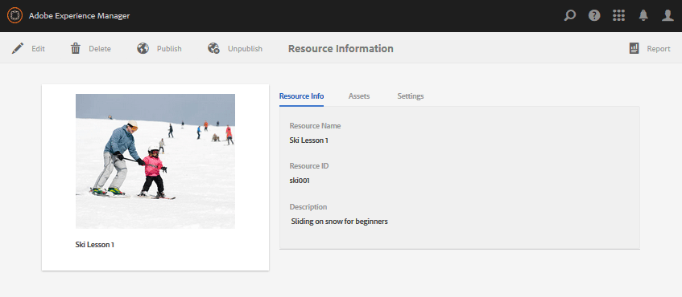
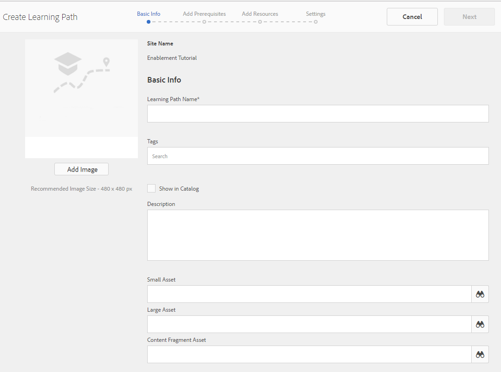

# Consola de recursos de habilitación {#enablement-resources-console}

Para AEM Communities, la consola Recursos es donde [Administradores de habilitación](users.md) cree, administre y asigne recursos a miembros de un sitio de comunidad de habilitación.

## Requisitos  {#requirements}

AEM Antes de agregar recursos de habilitación para un sitio de comunidad, las instancias de la comunidad deben configurarse correctamente, lo que incluye:

* SCORM
* FFmpeg

Para obtener más información, consulte [Configuración de habilitación](enablement.md).

>[!CAUTION]
>
>Si SCORM se instala después de la creación del sitio de la comunidad, se deben volver a crear los recursos de habilitación presentes antes de instalar SCORM.

>[!NOTE]
>
>Con el lanzamiento de [AEM,3](deploy-communities.md#latestfeaturepack) y los paquetes de funciones equivalentes de Communities [AEM Paquete de funciones 3 de 6.2](deploy-communities.md#latestfeaturepack) y [AEM Paquete de opciones 7 de 6.1](https://docs.adobe.com/content/docs/en/aem/6-1/deploy/communities.html#Latest Feature Pack), la función de activación ya no requiere un [base de datos MySQL](mysql.md).

## Terminología {#terminology}

### Recurso {#resource}

Los recursos son esenciales para una [comunidad de habilitación](overview.md#enablement-community). Son los materiales asignados a los miembros que les permiten mejorar sus habilidades.

Características de un recurso:

* Puede ser del tipo:
   * Imagen (JPG, PNG, GIF, BMP)
   * Vídeo (MP4)
   * Flash (SWF)
   * Documento (PDF)
   * Prueba (SCORM)
* Se puede hacer referencia a él desde una o varias rutas de aprendizaje.

### Ruta de aprendizaje {#learning-path}

Una ruta de aprendizaje es un conjunto lógico de recursos de habilitación agrupados para facilitar la asignación a los miembros.

### Grupo de miembros {#members-group}

Cuando se crea un sitio de la comunidad, el nombre dado al sitio para la URL se utiliza en la creación del [grupos de usuarios específicos del sitio](users.md) configurado con varios permisos para diversas funciones. Todos estos grupos creados automáticamente tienen el prefijo `Community <site-name>`.

Uno de estos grupos de usuarios es `Community <site-name> Members` , que identifica a los usuarios registrados en el entorno de publicación como miembros de la comunidad. Consulte el tutorial [Introducción a AEM Communities para la habilitación](getting-started-enablement.md) por ejemplo.

Para [comunidades de participación](overview.md#egagementcommunity)Sin embargo, es razonable permitir que los visitantes del sitio se registren automáticamente o utilicen el inicio de sesión social, momento en el que se añaden automáticamente al grupo de miembros.

Para [comunidades de habilitación](overview.md#enablement-community)Sin embargo, se recomienda convertir el sitio en privado, lo que requiere que un administrador agregue usuarios al grupo de miembros.

## Acceso a los recursos de habilitación de un sitio de la comunidad {#accessing-a-community-site-s-enablement-resources}

### Navegar a los recursos de Communities {#navigate-to-communities-resources}

En el entorno de creación, para llegar a la consola Recursos

* Desde la navegación global: **[!UICONTROL Navegación]** > **[!UICONTROL Communities]** > **[!UICONTROL Recursos]**

   

### Seleccione un sitio de la comunidad {#select-a-community-site}

La consola Recursos de comunidades mostrará todos los sitios de la comunidad.

Los recursos de habilitación se crean para un sitio de comunidad específico después de seleccionar el sitio en la consola Recursos.

Una vez seleccionado un sitio de comunidad específico, se puede acceder a cualquier recurso de habilitación y ruta de aprendizaje existentes para administrarlos y modificarlos, y se pueden crear nuevos recursos de habilitación y rutas de aprendizaje.

#### Búsqueda {#search-features}

Seleccione el icono de alternancia del panel lateral para buscar un recurso de habilitación o una ruta de aprendizaje. Al seleccionarlo, se abre un panel de búsqueda en el lado izquierdo de la consola y se proporciona un cuadro de texto en el que se pueden introducir términos de búsqueda.

#### Modo de selección {#selection-mode}

Para seleccionar varios recursos de habilitación, seleccione el primero pasando el puntero sobre la tarjeta y seleccionando el icono de marca de verificación. Una vez seleccionada, al seleccionar cualquier otra tarjeta, se agregará al grupo de selección. Si se selecciona una segunda vez, se anula la selección de la tarjeta.

## Crear un medio {#create-a-resource}

Para agregar un nuevo recurso de habilitación al sitio de la comunidad

* Seleccione el `Create` icono.
* En el submenú que aparece, seleccione **[!UICONTROL Recurso]**.

Esto inicia un proceso paso a paso de:

* Descripción del recurso (nombre, imagen de la tarjeta y texto).
* Selección del contenido del recurso.
* Selección de una imagen de portada para el recurso.
* Identificación de contactos de recursos.
* Asignación de recursos a los miembros.

Cuando el recurso forma parte de un curso, una ruta de aprendizaje, los miembros solo deben asignarse a la ruta de aprendizaje. Las asignaciones se pueden agregar después de crear el recurso de habilitación.

### 1 Información básica {#basic-info}

* **[!UICONTROL Agregar imagen]**

   (*Opcional*) Imagen que se mostrará en la tarjeta del recurso de habilitación en la página de asignaciones del miembro, así como en la consola Recursos. La imagen se selecciona del sistema de archivos local del servidor. Si no se proporciona una imagen, se generará una miniatura para el recurso cargado.

   ***Nota***: el tamaño de imagen recomendado no es simplemente de 480 x 480 píxeles. Debido al diseño interactivo de las tarjetas para varias dimensiones del navegador, el tamaño de la pantalla variará de 220 X 165 píxeles a 400 x 165 píxeles.

* **[!UICONTROL Nombre del sitio]**

   (*de solo lectura*) El sitio de la comunidad al que se agrega el recurso.

* **[!UICONTROL Nombre del medio]**

   (*Requerido*) El nombre para mostrar del recurso. Se crea un nombre de nodo válido a partir del nombre para mostrar.

* **[!UICONTROL Etiquetas]**

   (*Opcional*) Se pueden elegir una o más etiquetas que asocien el recurso de habilitación con uno o más catálogos. Consulte [Recursos de habilitación de etiquetas](tag-resources.md).

* **[!UICONTROL Mostrar en el catálogo]**

   Cuando está desmarcada, el recurso de habilitación no aparece en ningún catálogo. Si se selecciona, el recurso de habilitación aparecerá en todos los catálogos a menos que [prefiltrado](catalog-developer-essentials.md#pre-filters) o los filtros de miembro de la interfaz de usuario. El valor predeterminado está desmarcado.

* **[!UICONTROL Descripción]**

   (*Opcional*) Descripción que se mostrará para el recurso de habilitación.

* **[!UICONTROL Recurso pequeño]**

   (*Opcional*) Seleccionado de AEM Assets. Una imagen en miniatura para representar el recurso en el entorno de publicación, como en un catálogo.

* **[!UICONTROL Recurso grande]**

   (*Opcional*) Seleccionado de AEM Assets. Una imagen grande para representar el recurso en el entorno de publicación, como en la página principal de un recurso.

* **[!UICONTROL Recurso de fragmento de contenido]**

   (*Opcional*) Seleccionado de AEM Assets. Se puede hacer referencia a un fragmento de contenido en el entorno de publicación, pero no está en uso de forma predeterminada.

* Seleccione **[!UICONTROL Siguiente]**

### 2 Añadir contenido {#add-content}

Aunque parezca que se pueden seleccionar varios recursos de habilitación, solo se permite uno.

Seleccione el `'+' icon`, en la esquina superior derecha, para comenzar el proceso de selección del recurso mediante la identificación del origen.

* **[!UICONTROL Cargar desde mis archivos locales]**

   La carga desde el sistema de archivos local utiliza el explorador de archivos nativo para seleccionar y cargar un archivo. Los tipos de archivo admitidos son SCORM.zip (HTML 5 o SWF), vídeo MP4, SWF, PDF y tipos de imagen (JPG, PNG, GIF, BMP). El nombre del archivo se convierte en el nombre del recurso, que se añade a la biblioteca de recursos.

* **[!UICONTROL Explorar la biblioteca de recursos]**

   Seleccione en Biblioteca de recursos. La selección se limita a las que son visibles dentro del sitio de la comunidad.

* **[!UICONTROL Añadir URL externa]**

   Introduzca un vínculo al contenido de aprendizaje.

   En el cuadro de diálogo que se abre, introduzca:

   * **[!UICONTROL Título]**

      Nombre del recurso para el recurso de habilitación.

   * **[!UICONTROL URL]**

      La URL de un recurso.

* **[!UICONTROL Añadir una URL de Adobe Connect]**

   Introduzca un vínculo a una sesión de Adobe Connect.

   En el cuadro de diálogo que se abre, introduzca:

   * **[!UICONTROL Título]**

      Nombre del recurso para el recurso de habilitación.

   * **[!UICONTROL URL]**

      La URL de una sesión de Adobe Connect.

* **[!UICONTROL Definir un medio externo]**

   Introduzca la ubicación donde se va a presentar el material. Los valores del estado y la puntuación de éxito se introducen manualmente (consulte [Informes](reports.md)). Se puede utilizar una imagen de portada cargada para proporcionar información adicional.

   En el cuadro de diálogo que se abre, introduzca:

   * **[!UICONTROL Título]**

      Nombre del recurso para el recurso de habilitación.

   * **[!UICONTROL Ubicación]**

      La ubicación de un sitio físico, como una clase.

#### Ejemplo de un recurso de vídeo añadido {#example-of-an-added-video-resource}

* **[!UICONTROL Imagen de portada del medio]**

   La imagen de portada es una imagen que se mostrará cuando se visualice por primera vez el recurso de habilitación. Por ejemplo, la imagen de portada se muestra cuando un recurso de vídeo aún no se está reproduciendo. Si no se carga una imagen personalizada, se muestra una imagen predeterminada. Para los recursos de vídeo, es posible que [generar una miniatura](enablement.md#ffmpeg), pero solo cuando se carga y no cuando el vídeo se menciona como una dirección URL. Para los recursos de ubicación, la imagen se puede utilizar para proporcionar información adicional.

   El tamaño recomendado para la imagen de portada es de 640 x 360 px.

* Seleccione **[!UICONTROL Siguiente]**.

### 3 Ajustes {#settings}

>[!NOTE]
>
>Los alumnos no deben inscribirse directamente en recursos de habilitación a los que se haga referencia desde una ruta de aprendizaje. Los alumnos solo deben inscribirse en la ruta de aprendizaje.
>
>Si un miembro está inscrito en un recurso y en una ruta de aprendizaje que hace referencia a ese recurso, sus asignaciones mostrarán tanto el recurso único como el recurso dentro de la ruta de aprendizaje.

* **[!UICONTROL Entornos sociales]**

   Esta configuración controla si los alumnos pueden proporcionar datos sobre el recurso de habilitación. El [configuración de moderación](sites-console.md#moderation) son los del sitio de la comunidad principal.

   * **[!UICONTROL Permitir comentarios]**

      Si se selecciona, los miembros pueden realizar comentarios en el recurso. La opción predeterminada está activada.

   * **[!UICONTROL Permitir clasificaciones]**

      Si se selecciona esta opción, los miembros pueden valorar el recurso. La opción predeterminada está activada.

   * **[!UICONTROL Permitir acceso anónimo]**

      Si se selecciona, los visitantes anónimos del sitio pueden ver el recurso en un catálogo cuando el sitio de la comunidad también permite el acceso anónimo. El valor predeterminado está desmarcado.

* **[!UICONTROL Fecha de vencimiento]**

   *(Opcional)* Se puede seleccionar una fecha límite para finalizar la asignación.

* **[!UICONTROL Autor del medio]**

   *(Opcional)* El autor del recurso de habilitación. Utilice el menú desplegable para seleccionar entre los usuarios que son miembros de [grupo de miembros](#members-group).

* **[!UICONTROL Contacto de medios&amp;ast;]**

   *(Obligatorio)* Una persona con la que el miembro puede ponerse en contacto en relación con el recurso de habilitación. Utilice el menú desplegable para seleccionar entre los usuarios que son miembros de [grupo de miembros](#members-group).

* **[!UICONTROL Experto de medios]**

   *(Opcional)* Una persona con la que el miembro puede ponerse en contacto y que tenga experiencia con respecto al recurso de habilitación. Utilice el menú desplegable para seleccionar entre los usuarios que son miembros de [grupo de miembros](#members-group).

### 4 asignaciones {#assignments}

* **[!UICONTROL Añadir usuarios asignados]**

   Utilice el menú desplegable para seleccionar entre [miembros](#members-group) - Los usuarios y grupos de usuarios (enumerados en negrita): que se inscribirán como alumnos. Cuando los miembros inicien sesión en el sitio de la comunidad, los recursos de habilitación (y las rutas de aprendizaje) en los que estén inscritos aparecerán en su [Asignaciones](functions.md#assignments-function) página.

* Seleccione **[!UICONTROL Crear]**.

   

La creación correcta del recurso de habilitación vuelve a la consola Recursos con el recurso recién creado seleccionado. Desde esta consola, es posible [administrar el recurso](#managing-a-resource).

## Crear una ruta de aprendizaje {#create-a-learning-path}

Para agregar una nueva ruta de aprendizaje al sitio de la comunidad

* Seleccione el `Create` icono
* En el submenú que aparece, seleccione **[!UICONTROL Ruta de aprendizaje]**.

Esto inicia un proceso paso a paso de:

* Identificación de la ruta de aprendizaje.
* Proporcionar una imagen de tarjeta para representar la ruta de aprendizaje para los alumnos.
* Referencia a los recursos de habilitación para incluir en la ruta de aprendizaje.
* Si lo desea, puede ordenar los recursos.
* Identificación opcional de rutas de aprendizaje previas.
* Identificación de un contacto de ruta de aprendizaje.
* Inscripción de miembros.

Para los recursos de habilitación incluidos en una ruta de aprendizaje, las asignaciones solo deben realizarse para la ruta de aprendizaje y no para los recursos individuales.

### Información básica {#basic-info-1}

* **[!UICONTROL Agregar imagen]**

   (*Opcional*) Imagen que se mostrará en la tarjeta de la ruta de aprendizaje en la página de asignaciones del miembro, así como en la consola Recursos. La imagen se selecciona del sistema de archivos local del servidor. Si no se proporciona una imagen, se generará una miniatura para el recurso cargado.

   ***Nota***: el tamaño de imagen recomendado ya no es simplemente de 480 x 480 píxeles. Debido al diseño interactivo de las tarjetas para varias dimensiones del navegador, el tamaño de la pantalla variará de 220 X 165 píxeles a 400 x 165 píxeles.

* **[!UICONTROL Nombre del sitio]**

   (*Readonly*) El sitio de la comunidad al que se agrega el recurso.

* **[!UICONTROL Nombre de la ruta de aprendizaje]**

   (*Requerido*) El nombre para mostrar de la ruta de aprendizaje. Se crea un nombre de nodo válido a partir del nombre para mostrar.

* **[!UICONTROL Etiquetas]**

   (*Opcional*) Se pueden elegir una o más etiquetas que asocien la ruta de aprendizaje con uno o más catálogos. Consulte [Recursos de habilitación de etiquetas](tag-resources.md).

* **[!UICONTROL Mostrar en el catálogo]**

   Si no la marca, la ruta de aprendizaje no aparecerá en ningún catálogo. Si se selecciona, la ruta de aprendizaje aparecerá en todos los catálogos a menos que [prefiltrado](catalog-developer-essentials.md#pre-filters) o los filtros de miembro de la interfaz de usuario. Al mostrar la ruta de aprendizaje en un catálogo, se concederá indirectamente el acceso de LECTURA a todos los recursos incluidos. El valor predeterminado está desmarcado.

* **[!UICONTROL Descripción]**

   (*Opcional*) Descripción que se mostrará para el recurso de habilitación.

* **[!UICONTROL Recurso pequeño]**

   (*Opcional*) Seleccionado de AEM Assets. Una imagen en miniatura para representar el recurso en el entorno de publicación, como en un catálogo.

* **[!UICONTROL Recurso grande]**

   (*Opcional*) Seleccionado de AEM Assets. Una imagen grande para representar el recurso en el entorno de publicación, como en la página principal de un recurso.

* **[!UICONTROL Recurso de fragmento de contenido]**

   (*Opcional*) Seleccionado de AEM Assets. Se puede hacer referencia a un fragmento de contenido en el entorno de publicación, pero no está en uso de forma predeterminada.

* Seleccione **[!UICONTROL Siguiente]**.

### Añadir requisitos previos {#add-prerequisites}

* **[!UICONTROL Rutas de aprendizaje necesarias]**

   (*Opcional*) Cuando se seleccionan otras rutas de aprendizaje publicadas, deben completarse antes de que un alumno pueda seleccionar esta ruta de aprendizaje.

* Seleccione **[!UICONTROL Siguiente]**.

### Añadir medios {#add-resources}

* **[!UICONTROL Aplicar el orden de la ruta de aprendizaje]**

   (*Opcional*) Si se establece en Activado, el orden en el que se añaden los recursos de habilitación es el orden en el que los alumnos deben continuar con la ruta de aprendizaje. El valor predeterminado es Desactivado.

* **[!UICONTROL Recursos]**

   Uno o más recursos elegidos entre los *publicado* recursos de habilitación creados para el sitio de la comunidad actual.

>[!NOTE]
>
>Solo puede seleccionar los recursos disponibles en el mismo nivel que la ruta de aprendizaje. Por ejemplo, para una ruta de aprendizaje creada en un grupo solo están disponibles los recursos de nivel de grupo; para una ruta de aprendizaje creada en un sitio de comunidad, los recursos de ese sitio están disponibles para añadirlos a la ruta de aprendizaje.

* Seleccione **[!UICONTROL Siguiente]**.

### Configuración {#settings-1}

* **[!UICONTROL Añadir matriculaciones]**

   Utilice el menú desplegable para seleccionar entre los miembros y grupos de miembros (enumerados en negrita) que son miembros del sitio de la comunidad [grupo de miembros](#members-group). No es necesario añadir asignaciones al crear por primera vez la ruta de aprendizaje. Las propiedades de la ruta de aprendizaje se pueden modificar para añadir alumnos más adelante.

* **[!UICONTROL Contacto de ruta de aprendizaje&amp;ast;]**

   *(Obligatorio)* Una persona con la que el miembro puede ponerse en contacto en relación con la ruta de aprendizaje. Utilice el menú desplegable para seleccionar entre los usuarios que son miembros del sitio de la comunidad [grupo de miembros](#members-group).

* Seleccione **[!UICONTROL Crear]**

>[!NOTE]
>
>Los recursos de habilitación a los que se hace referencia desde la ruta de aprendizaje no deben enumerar los mismos usuarios asignados (alumnos), si los hay.
>
>Si un miembro está inscrito en un recurso de habilitación y en una ruta de aprendizaje que hace referencia a ese recurso, sus asignaciones mostrarán tanto el recurso único como el recurso dentro de la ruta de aprendizaje.

## Administración de un recurso {#managing-a-resource}

Para administrar un solo recurso de habilitación:

* Desde el **[!UICONTROL Recursos]** , seleccione el sitio de la comunidad que contiene el recurso.
* Seleccione el recurso.

Para el recurso de habilitación seleccionado, es posible:

* Ver propiedades (predeterminado)
* Editar propiedades
* Eliminar
* Publicación
* Cancelar publicación

Para cargar una nueva versión del recurso de habilitación, se recomienda crear un nuevo recurso y luego dar de baja a los miembros de la versión antigua e inscribirlos en la nueva versión.

### Editar recurso {#edit-resource}

Al seleccionar el icono de lápiz, los pasos mostrados para crear un recurso de habilitación están disponibles para que cualquiera de la información proporcionada pueda modificarse.

Si el único cambio consiste en modificar las asignaciones en el paso Configuración, guardar los cambios dará como resultado que se publiquen las modificaciones. Si se realizan otros cambios, el recurso debe publicarse explícitamente después de guardar.

### Eliminar medio {#delete-resource}

Al seleccionar el icono de la papelera, el recurso de habilitación será `Deleted` después de la confirmación.

### Publicación {#publish}

Antes de que los alumnos puedan ver los recursos de habilitación asignados, debe publicarse:

* Seleccione el icono del mundo para `Publish`.
* En el cuadro de diálogo que aparece, seleccione **[!UICONTROL Publish]** otra vez.
* Seleccionar **[!UICONTROL Cerrar]**.

Aunque el cuadro de diálogo indica que la acción está en cola, a menudo se publica inmediatamente.

### Cancelar publicación {#unpublish}

Para impedir temporalmente el acceso a los recursos de habilitación a los miembros del entorno de publicación sin eliminarlos, utilice el icono del mundo para lo siguiente `Unpublish` el recurso.

### Informe {#report}

El icono Informe proporciona acceso a los informes generados cuando los alumnos interactúan con los recursos de habilitación asignados en el entorno de publicación. El informe varía en función del tipo de recurso.

Para todas las rutas de aprendizaje, es posible ver un informe basado en recursos o en alumnos ( `User Report`.)

Este informe es específicamente para el recurso de habilitación o la ruta de aprendizaje actuales. La profundidad de la creación de informes depende de si [Adobe Analytics](analytics.md) tiene licencia y está habilitado para el sitio de la comunidad. El [Cronología](#timeline), [Participación del visor](#viewer-engagement), y [Participación por dispositivo](#engagement-by-device) Los informes de se importan desde Adobe Analytics según el [intervalo de sondeo](analytics.md#report-importer).

Hay informes sobre todos los recursos de habilitación, independientemente de si Adobe Analytics está habilitado o no [Estado de asignado](#assignee-status) y [Clasificaciones](#ratings) así como un [Resumen del informe](#report-summary) tabla.

#### Escala de cronología {#timeline}

El informe Cronología de Analytics muestra cuándo se producen eventos a lo largo del tiempo para este recurso de habilitación:

* **Vistas**

   Una vista es cuando un alumno visita la página de detalles de recursos.

* **Veces que se ha reproducido**

   Una reproducción se produce cuando todo el alumno interactúa con el recurso, como reproducir un vídeo o abrir un PDF.

* **Clasificaciones**

   Una clasificación se produce cuando un alumno asigna una clasificación por estrellas a un recurso.

* **Comentarios**

   Un comentario se produce cuando todo el alumno añade un comentario.

El eje vertical es el número de eventos.

El eje horizontal es la hora del calendario.

[Se requiere Adobe Analytics](sites-console.md#analytics).

#### Participación del visor {#viewer-engagement}

El informe Participación del visualizador de Analytics muestra, para los recursos de vídeo, el número de alumnos que han visto el recurso y, si no se ha reproducido hasta el final, en qué momento los alumnos han dejado de reproducirlo.

El eje vertical es el número de alumnos que han visto este recurso.

El eje horizontal es la duración de este recurso.

[Se requiere el ID de organización de Marketing Cloud](sites-console.md#enablement).

#### Participación por dispositivo {#engagement-by-device}

El informe Participación de Analytics por dispositivo, para recursos de vídeo, describe el porcentaje de vistas que se reprodujeron desde el escritorio y desde dispositivos móviles.

[Se requiere el ID de organización de Marketing Cloud](sites-console.md#enablement).

#### Estado del usuario asignado {#assignee-status}

El informe Estado de asignado, en función del número de alumnos, describe cuántos tienen

* **Sin iniciar**
* **En curso**
* **Completado**

#### Clasificaciones {#ratings}

El informe Clasificaciones se basa en el número de alumnos que han clasificado el recurso de habilitación, mostrando el número de cada clasificación por estrellas seguida de un resumen del número total de clasificaciones y la clasificación promedio.

#### Resumen del informe {#report-summary}

Para un recurso de habilitación, el Resumen de informes es una lista de tabla.

* Cada alumno que ha interactuado con el recurso
   * Su estado
   * Si se les asignó el recurso
      * En lugar de buscar el recurso en un catálogo
      * Número de comentarios publicados
      * La calificación dada, si la hay

Para un informe de recursos de ruta de aprendizaje, el resumen de informe es una lista de tabla

* Cada recurso incluido en la ruta de aprendizaje
   * Estado de publicación
   * Número de vistas
   * Número de reproducciones
   * Clasificación promedio
   * Formato
   * Tamaño
   * Nombre del sitio de comunidad

Para un informe de usuario de ruta de aprendizaje, el resumen de informe es una lista de tabla.

* Cada alumno asignado a la ruta de aprendizaje:
   * Número de medios completados.
   * Su estado.

Es posible ajustar la visualización de la tabla seleccionando columnas mediante el `Show / hide columns` selector.

#### Descargar informe como CSV {#download-report-as-csv}

La tabla Resumen de informes se puede descargar en formato CSV con un botón en la parte superior de la consola.

* Para un recurso de habilitación: `Download Resource Report as CSV` botón.
* Para una ruta de aprendizaje: `Download Learning Path Report as CSV` botón.

El resumen completo de informes se descarga independientemente de las columnas que se elijan para la visualización.
