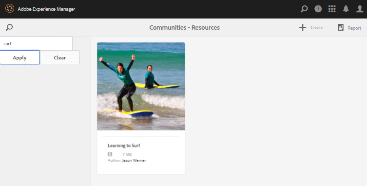

# Consola Recursos de Habilitación {#enablement-resources-console}

Para AEM Communities, la consola Recursos es donde [Enablement Managers](users.md) crean, administran y asignan recursos a los miembros de un sitio de la comunidad de habilitación.

## Requisitos {#requirements}

Antes de agregar recursos de habilitación para un sitio de comunidad, las instancias de AEM deben configurarse correctamente, incluidas:

* SCORM
* FFmpeg

Para obtener más información, consulte [Configuración de habilitación](enablement.md).

>[!CAUTION]
>
>Si SCORM se instala después de la creación del sitio de la comunidad, cualquier recurso de habilitación presente antes de que SCORM se instale debe volver a crearse.

>[!NOTE]
>
>Con el lanzamiento de [AEM 6.3](deploy-communities.md#latestfeaturepack) y los paquetes de funciones equivalentes de Communities [AEM 6.2 FP3](deploy-communities.md#latestfeaturepack) y [AEM 6.1 FP7](https://docs.adobe.com/content/docs/en/aem/6-1/deploy/communities.html#Latest Feature Pack), la función de habilitación ya no requiere una [base de datos MySQL](mysql.md).

## Terminología {#terminology}

### Medio {#resource}

Los recursos son esenciales para una [comunidad de habilitación](overview.md#enablement-community). Son los materiales asignados a los miembros que les permiten mejorar sus habilidades.

Características de un recurso:

* Puede ser del tipo:
   * Imagen (JPG, PNG, GIF, BMP)
   * Vídeo (MP4)
   * Flash (SWF)
   * Documento (PDF)
   * Cuestionario (SCORM)
* Se puede hacer referencia a desde una o más rutas de aprendizaje.

### Ruta de aprendizaje {#learning-path}

Una ruta de aprendizaje es un conjunto lógico de recursos de habilitación agrupados para facilitar la asignación a los miembros.

### Grupo de miembros {#members-group}

Cuando se crea un sitio de comunidad, el nombre proporcionado al sitio para la URL se utiliza en la creación de los [grupos de usuarios específicos del sitio](users.md) configurados con varios permisos para diversas funciones. Todos estos grupos creados automáticamente tienen el prefijo `Community <site-name>`.

Uno de estos grupos de usuarios es el grupo `Community <site-name> Members` , que identifica a los usuarios registrados en el entorno de publicación como miembros de la comunidad. Consulte el tutorial [Introducción a AEM Communities para Habilitación](getting-started-enablement.md) para ver un ejemplo.

Para [comunidades de participación](overview.md#egagementcommunity), es razonable permitir que los visitantes del sitio se registren por su cuenta o utilicen un inicio de sesión social, momento en el cual se añaden automáticamente al grupo de miembros.

Para [comunidades de habilitación](overview.md#enablement-community), se recomienda convertir el sitio en privado, lo que requiere un administrador para agregar usuarios al grupo de miembros.

## Acceso a los recursos de habilitación de un sitio de la comunidad {#accessing-a-community-site-s-enablement-resources}

### Vaya a Recursos de Communities {#navigate-to-communities-resources}

En el entorno de creación, para llegar a la consola Recursos

* Desde la navegación global: **[!UICONTROL Navegación]** > **[!UICONTROL Comunidades]** > **[!UICONTROL Recursos]**

   

### Seleccionar un sitio de la comunidad {#select-a-community-site}

La consola Recursos de Communities mostrará todos los sitios de la comunidad.

Los recursos de habilitación se crean para un sitio de comunidad específico después de seleccionar el sitio en la consola Recursos.

Una vez seleccionado un sitio de comunidad específico, se puede acceder a los recursos de habilitación y a las rutas de aprendizaje existentes para su administración y modificación, y se pueden crear nuevos recursos de habilitación y rutas de aprendizaje.

#### Búsqueda {#search-features}

Seleccione el icono de alternancia del panel lateral para buscar un recurso de habilitación o una ruta de aprendizaje. Cuando se selecciona, un panel de búsqueda se abre en la parte izquierda de la consola y proporciona un cuadro de texto en el que se pueden introducir términos de búsqueda.

#### Modo de selección {#selection-mode}

Para seleccionar varios recursos de habilitación, seleccione la primera al pasar el ratón por encima de la tarjeta y seleccionar el icono de marca de verificación. Una vez seleccionada, si selecciona cualquier otra tarjeta, se añadirá al grupo de selección. Al seleccionar una segunda vez, se anula la selección de la tarjeta.

## Crear un recurso {#create-a-resource}

Para agregar un nuevo recurso de habilitación al sitio de la comunidad

* Seleccione el icono `Create`.
* En el submenú que se muestra, seleccione **[!UICONTROL Recurso]**.

Esto inicia un proceso paso a paso de:

* Descripción del recurso (nombre, imagen de tarjeta y texto).
* Selección del contenido del recurso.
* Selección de una imagen de portada para el recurso.
* Identificación de contactos de recursos.
* Asignación de recursos a miembros.

Cuando el recurso forma parte de un curso, una ruta de aprendizaje, los miembros solo deben asignarse a la ruta de aprendizaje. Las asignaciones se pueden agregar después de crear el recurso de habilitación.

### 1 Información básica {#basic-info}

* **[!UICONTROL Agregar imagen]**

   (*Opcional*) Una imagen que se mostrará en la tarjeta del recurso de habilitación en la página de asignaciones del miembro, así como en la consola Recursos. La imagen se selecciona del sistema de archivos local del servidor. Si no se proporciona una imagen, se generará una miniatura para el recurso cargado.

   ***Nota***: El tamaño de imagen recomendado no es simplemente 480 x 480 píxeles. Debido al diseño interactivo de las tarjetas con distintas dimensiones del navegador, el tamaño de visualización variará de 220 X 165 píxeles a 400 x 165 píxeles.

* **[!UICONTROL Nombre del sitio]**

   (*readonly*) El sitio de la comunidad al que se agrega el recurso.

* **[!UICONTROL Nombre del medio]**

   (*Obligatorio*) El nombre para mostrar del recurso. Se crea un nombre de nodo válido a partir del nombre para mostrar.

* **[!UICONTROL Etiquetas]**

   (*Opcional*) Se pueden elegir una o más etiquetas que asocien el recurso de habilitación con uno o más catálogos. Consulte [Etiquetado de recursos de habilitación](tag-resources.md).

* **[!UICONTROL Mostrar en el catálogo]**

   Cuando está desactivada, el recurso de habilitación no aparece en ningún catálogo. Si se selecciona, el recurso de habilitación aparecerá en todos los catálogos a menos que [haya filtrado previamente](catalog-developer-essentials.md#pre-filters) o que los filtros de miembro procedan de la interfaz de usuario. El valor predeterminado no está seleccionado.

* **[!UICONTROL Descripción]**

   (*Opcional*) La descripción que se mostrará para el recurso de habilitación.

* **[!UICONTROL Recurso pequeño]**

   (*Opcional*) Seleccionado desde AEM Assets. Una imagen en miniatura para representar el recurso en el entorno de publicación, como en un catálogo.

* **[!UICONTROL Recurso grande]**

   (*Opcional*) Seleccionado desde AEM Assets. Una imagen grande para representar el recurso en el entorno de publicación, como en la página principal de un recurso.

* **[!UICONTROL Recurso de fragmento de contenido]**

   (*Opcional*) Seleccionado desde AEM Assets. Un fragmento de contenido al que se puede hacer referencia en el entorno de publicación, pero que no está en uso de forma predeterminada.

* Seleccione **[!UICONTROL Siguiente]**

### 2 Añadir contenido {#add-content}

Aunque aparece como si se pudieran seleccionar varios recursos de habilitación, solo se permite uno.

Seleccione `'+' icon`, en la esquina superior derecha, para comenzar el proceso de selección del recurso identificando el origen.

* **[!UICONTROL Cargar desde mis archivos locales]**

   La carga desde el sistema de archivos local utilizará el explorador de archivos nativo para seleccionar y cargar un archivo. Los tipos de archivo admitidos son SCORM.zip (HTML5 o SWF), vídeo MP4, SWF, PDF y tipos de imagen (JPG, PNG, GIF, BMP). El nombre de archivo se convierte en el nombre del recurso, que se añade a la biblioteca de recursos.

* **[!UICONTROL Explorar la biblioteca de recursos]**

   Seleccione en Biblioteca de recursos. La selección está limitada a las que son visibles dentro del sitio de la comunidad.

* **[!UICONTROL Añadir URL externa]**

   Introduzca un vínculo al contenido de aprendizaje.

   En el cuadro de diálogo que se abre, introduzca:

   * **[!UICONTROL Título]**

      Nombre del recurso para el recurso de habilitación.

   * **[!UICONTROL URL]**

      La URL de un recurso.

* **[!UICONTROL Añadir una URL de Adobe Connect]**

   Introduzca un vínculo a una sesión de Adobe Connect.

   En el cuadro de diálogo que se abre, introduzca:

   * **[!UICONTROL Título]**

      Nombre del recurso para el recurso de habilitación.

   * **[!UICONTROL URL]**

      Dirección URL de una sesión de Adobe Connect.

* **[!UICONTROL Definir un medio externo]**

   Introduzca la ubicación en la que se presentará el material. Los valores del estado de éxito y la puntuación se introducen manualmente (consulte [Informes](reports.md)). Se puede usar una imagen de portada cargada para proporcionar información adicional.

   En el cuadro de diálogo que se abre, introduzca:

   * **[!UICONTROL Título]**

      Nombre del recurso para el recurso de habilitación.

   * **[!UICONTROL Ubicación]**

      La ubicación de un sitio físico, como un salón de clases.

#### Ejemplo de un recurso de vídeo añadido {#example-of-an-added-video-resource}

* **[!UICONTROL Imagen de portada del medio]**

   La imagen de portada es una imagen que se mostrará cuando se vea por primera vez el recurso de habilitación. Por ejemplo, la imagen de portada se muestra cuando un recurso de vídeo aún no se está reproduciendo. Si no se carga una imagen personalizada, se muestra una imagen predeterminada. Para los recursos de vídeo, puede ser posible [generar una miniatura](enablement.md#ffmpeg), pero solo cuando se carga y no cuando se hace referencia al vídeo como URL. Para los recursos de ubicación, la imagen se puede utilizar para proporcionar información adicional.

   El tamaño recomendado para la imagen de portada es de 640 x 360 píxeles.

* Seleccione **[!UICONTROL Siguiente]**.

### 3 Configuración {#settings}

>[!NOTE]
>
>Los estudiantes no deben inscribirse directamente en los recursos de habilitación a los que se debe hacer referencia desde una ruta de aprendizaje. Los estudiantes solo deben inscribirse en la ruta de aprendizaje.
>
>Si un miembro está inscrito en un recurso y en una ruta de aprendizaje que hace referencia a ese recurso, sus asignaciones mostrarán el recurso único y el recurso dentro de la ruta de aprendizaje.

* **[!UICONTROL Entornos sociales]**

   Estos ajustes controlan si los estudiantes pueden proporcionar información sobre el recurso de habilitación. Los [ajustes de moderación](sites-console.md#moderation) son los del sitio de la comunidad principal.

   * **[!UICONTROL Permitir comentarios]**

      Si se selecciona, los miembros pueden comentar sobre el recurso. El valor predeterminado está marcado.

   * **[!UICONTROL Permitir clasificaciones]**

      Si está activada, los miembros pueden clasificar el recurso. El valor predeterminado está marcado.

   * **[!UICONTROL Permitir acceso anónimo]**

      Si se selecciona, los visitantes anónimos del sitio pueden ver el recurso en un catálogo cuando el sitio de la comunidad también permite el acceso anónimo. El valor predeterminado no está seleccionado.

* **[!UICONTROL Fecha de vencimiento]**

   *(Opcional)* Se puede seleccionar una fecha en la que se debe completar la asignación.

* **[!UICONTROL Autor del medio]**

   *(Opcional)* El autor del recurso de habilitación. Utilice el menú desplegable para seleccionar entre los usuarios que son miembros del [grupo de miembros](#members-group).

* **[!UICONTROL Contacto&amp;ast de recursos;]**

   *(Obligatorio)* Una persona a la que el miembro puede ponerse en contacto con respecto al recurso de habilitación. Utilice el menú desplegable para seleccionar entre los usuarios que son miembros del [grupo de miembros](#members-group).

* **[!UICONTROL Experto de medios]**

   *(Opcional)* Una persona a la que el miembro puede ponerse en contacto con quien tenga experiencia en el recurso de habilitación. Utilice el menú desplegable para seleccionar entre los usuarios que son miembros del [grupo de miembros](#members-group).

### 4 Asignaciones {#assignments}

* **[!UICONTROL Añadir usuarios asignados]**

   Utilice el menú desplegable para seleccionar entre [miembros](#members-group) - Los usuarios y grupos de usuarios (enumerados en negrita) - que se van a inscribir como estudiantes. Cuando los miembros inicien sesión en el sitio de la comunidad, los recursos de habilitación (y las rutas de aprendizaje) en los que estén inscritos aparecerán en su página [Asignaciones](functions.md#assignments-function).

* Seleccione **[!UICONTROL Crear]**.

   

La creación correcta del recurso de habilitación devuelve a la consola Recursos con el recurso recién creado seleccionado. Desde esta consola, es posible [administrar el recurso](#managing-a-resource).

## Crear una ruta de aprendizaje {#create-a-learning-path}

Para agregar una nueva ruta de aprendizaje al sitio de la comunidad

* Seleccione el icono `Create`
* En el submenú que se muestra, seleccione **[!UICONTROL Ruta de aprendizaje]**.

Esto inicia un proceso paso a paso de:

* Identificación de la ruta de aprendizaje.
* Proporcionar una imagen de tarjeta para representar la ruta de aprendizaje a los alumnos.
* Hacer referencia a los recursos de habilitación que se incluirán en la ruta de aprendizaje.
* Solicite los recursos de forma opcional.
* Identificación opcional de rutas de aprendizaje previas.
* Identificación de un contacto de ruta de aprendizaje.
* Miembros de inscripción.

Para los recursos de habilitación incluidos en una ruta de aprendizaje, las asignaciones solo deben realizarse para la ruta de aprendizaje y no para los recursos individuales.

### Información básica {#basic-info-1}

* **[!UICONTROL Agregar imagen]**

   (*Opcional*) Una imagen que se mostrará en la tarjeta para la ruta de aprendizaje en la página de asignaciones del miembro, así como en la consola Recursos. La imagen se selecciona del sistema de archivos local del servidor. Si no se proporciona una imagen, se generará una miniatura para el recurso cargado.

   ***Nota***: El tamaño de imagen recomendado ya no es simplemente 480 x 480 píxeles. Debido al diseño interactivo de las tarjetas con distintas dimensiones del navegador, el tamaño de visualización variará de 220 X 165 píxeles a 400 x 165 píxeles.

* **[!UICONTROL Nombre del sitio]**

   (*Readonly*) El sitio de la comunidad al que se agrega el recurso.

* **[!UICONTROL Nombre de la ruta de aprendizaje]**

   (*Requerido*) El nombre para mostrar de la ruta de aprendizaje. Se crea un nombre de nodo válido a partir del nombre para mostrar.

* **[!UICONTROL Etiquetas]**

   (*Opcional*) Se pueden elegir una o más etiquetas que asocien la ruta de aprendizaje con uno o más catálogos. Consulte [Etiquetado de recursos de habilitación](tag-resources.md).

* **[!UICONTROL Mostrar en el catálogo]**

   Cuando está desactivada, la ruta de aprendizaje no aparece en ningún catálogo. Si se selecciona, la ruta de aprendizaje aparecerá en todos los catálogos a menos que [se filtre previamente](catalog-developer-essentials.md#pre-filters) o que los filtros de miembro procedan de la interfaz de usuario. Mostrar la ruta de aprendizaje en un catálogo otorgará indirectamente el acceso READ a todos sus recursos contenidos. El valor predeterminado no está seleccionado.

* **[!UICONTROL Descripción]**

   (*Opcional*) La descripción que se mostrará para el recurso de habilitación.

* **[!UICONTROL Recurso pequeño]**

   (*Opcional*) Seleccionado desde AEM Assets. Una imagen en miniatura para representar el recurso en el entorno de publicación, como en un catálogo.

* **[!UICONTROL Recurso grande]**

   (*Opcional*) Seleccionado desde AEM Assets. Una imagen grande para representar el recurso en el entorno de publicación, como en la página principal de un recurso.

* **[!UICONTROL Recurso de fragmento de contenido]**

   (*Opcional*) Seleccionado desde AEM Assets. Un fragmento de contenido al que se puede hacer referencia en el entorno de publicación, pero que no está en uso de forma predeterminada.

* Seleccione **[!UICONTROL Siguiente]**.

### Añadir requisitos previos {#add-prerequisites}

* **[!UICONTROL Rutas de aprendizaje necesarias]**

   (*Opcional*) Cuando se seleccionan otras rutas de aprendizaje publicadas, deben completarse antes de que un estudiante pueda seleccionar esta ruta de aprendizaje.

* Seleccione **[!UICONTROL Siguiente]**.

### Añadir medios {#add-resources}

* **[!UICONTROL Aplicar el orden de la ruta de aprendizaje]**

   (*Opcional*) Si se establece en Activado, el orden en que se agregan los recursos de habilitación es el orden en que se requiere que los alumnos avancen por la ruta de aprendizaje. El valor predeterminado es Desactivado.

* **[!UICONTROL Medios]**

   Uno o más recursos elegidos entre los *recursos de habilitación publicados* creados para el sitio de la comunidad actual.

>[!NOTE]
>
>Solo puede seleccionar los recursos disponibles en el mismo nivel que la ruta de aprendizaje. Por ejemplo, para una ruta de aprendizaje creada en un grupo solo están disponibles los recursos de nivel de grupo; para una ruta de aprendizaje creada en un sitio de comunidad, los recursos de ese sitio están disponibles para añadirlos a la ruta de aprendizaje.

* Seleccione **[!UICONTROL Siguiente]**.

### Configuración {#settings-1}

* **[!UICONTROL Añadir matriculaciones]**

   Utilice el menú desplegable para seleccionar entre los miembros y grupos de miembros (enumerados en negrita) que sean miembros del [grupo de miembros](#members-group) del sitio de la comunidad. No es necesario añadir asignaciones al crear por primera vez la ruta de aprendizaje. Las propiedades de la ruta de aprendizaje se pueden modificar para añadir alumnos posteriormente.

* **[!UICONTROL Ruta de aprendizaje Contacto&amp;ast;]**

   *(Obligatorio)* Una persona a la que el miembro puede ponerse en contacto con respecto a la ruta de aprendizaje. Utilice el menú desplegable para seleccionar entre los usuarios que son miembros del [grupo de miembros](#members-group) del sitio de la comunidad.

* Seleccione **[!UICONTROL Crear]**

>[!NOTE]
>
>Los recursos de habilitación a los que se hace referencia desde la ruta de aprendizaje no deben enumerar los mismos Destinatarios (estudiantes), si los hay.
>
>Si un miembro está inscrito en un recurso de habilitación y en una ruta de aprendizaje que hace referencia a ese recurso, sus asignaciones mostrarán el recurso único y el recurso dentro de la ruta de aprendizaje.

## Administración de un recurso {#managing-a-resource}

Para administrar un solo recurso de habilitación:

* En la consola **[!UICONTROL Resources]**, seleccione el sitio de la comunidad que contiene el recurso.
* Seleccione el recurso .

Para el recurso de habilitación seleccionado, es posible:

* Ver propiedades (predeterminado)
* Editar propiedades
* Eliminar
* Publicación
* Cancelar publicación

Para cargar una nueva versión del recurso de habilitación, se recomienda crear un nuevo recurso y, a continuación, anular la inscripción de miembros de la versión antigua e inscribirlos en la nueva versión.

### Editar recurso {#edit-resource}

Al seleccionar el icono de lápiz, los pasos que se muestran para crear un recurso de habilitación están disponibles para que cualquiera de la información proporcionada pueda modificarse.

Si el único cambio es modificar asignaciones en el paso Configuración , al guardar los cambios se publicarán las modificaciones. Si se realizan otros cambios, el recurso debe publicarse explícitamente después de guardarse.

### Eliminar medio {#delete-resource}

Al seleccionar el icono de la papelera, el recurso de habilitación será `Deleted` después de la confirmación.

### Publicación {#publish}

Antes de que los alumnos puedan ver los recursos de habilitación asignados, debe publicarse:

* Seleccione el icono del mundo en `Publish`.
* En el cuadro de diálogo que aparece, seleccione **[!UICONTROL Publicar]** de nuevo.
* Seleccione **[!UICONTROL Cerrar]**.

Aunque el cuadro de diálogo indica que la acción está en cola, a menudo se publica inmediatamente.

### Cancelar publicación {#unpublish}

Para que los miembros del entorno de publicación no puedan acceder temporalmente a los recursos de habilitación sin eliminarlos, utilice el icono del mundo para `Unpublish` el recurso.

### Informe {#report}

El icono Informe proporciona acceso a los informes generados cuando los alumnos interactúan con los recursos de habilitación asignados en el entorno de publicación. El informe varía según el tipo de recurso.

Para todas las rutas de aprendizaje, es posible ver un informe basado en los recursos o en los estudiantes ( `User Report`).

Este informe es específicamente para el recurso de habilitación o la ruta de aprendizaje actual. La profundidad de los informes proporcionados depende de si [Adobe Analytics](analytics.md) tiene o no licencia y está habilitado para el sitio de la comunidad. Los informes [Línea de tiempo](#timeline), [Participación del visualizador](#viewer-engagement) y [Participación por dispositivo](#engagement-by-device) se importan desde Adobe Analytics en función del [intervalo de sondeo](analytics.md#report-importer).

Para todos los recursos de habilitación, independientemente de si Adobe Analytics está habilitado o no, existen informes sobre [Estado asignado](#assignee-status) y [Clasificaciones](#ratings), así como una tabla [Resumen de informe](#report-summary).

#### Escala de tiempo {#timeline}

El informe Cronología de Analytics muestra cuándo se producen eventos con el paso del tiempo para este recurso de activación:

* **Vistas**

   Una vista se produce cuando un estudiante visita la página de detalles del recurso.

* **Veces que se ha reproducido**

   Una reproducción se produce cuando todo el estudiante interactúa con el recurso, como reproducir un vídeo o abrir un PDF.

* **Clasificaciones**

   Una clasificación es cuando un estudiante asigna una clasificación de estrella a un recurso.

* **Comentarios**

   Un comentario es cuando alLearning añade un comentario.

El eje vertical es el número de eventos.

El eje horizontal es la hora del calendario.

[Adobe Analytics obligatorio](sites-console.md#analytics).

#### Participación del visor {#viewer-engagement}

El informe Participación del visualizador de Analytics muestra, para los recursos de vídeo, el número de estudiantes que han visto el recurso y, si no se ha reproducido hasta el final, en qué momento los estudiantes dejaron de reproducirlo.

El eje vertical es el número de estudiantes que han visto este recurso.

El eje horizontal es la duración de este recurso.

[Se requiere el ID de organización de Marketing Cloud](sites-console.md#enablement).

#### Participación por dispositivo {#engagement-by-device}

En el informe Participación de Analytics por dispositivo , en el caso de los recursos de vídeo, se describe el porcentaje de vistas que se reprodujeron desde el escritorio y desde dispositivos móviles.

[Se requiere el ID de organización de Marketing Cloud](sites-console.md#enablement).

#### Estado del usuario asignado {#assignee-status}

El informe Estado del usuario asignado, en función del número de alumnos, describe cuántos tienen

* **No iniciado**
* **En curso**
* **Completado**

#### Clasificaciones {#ratings}

El informe de clasificaciones se basa en el número de estudiantes que han clasificado el recurso de habilitación, que muestran el número de cada clasificación por estrella seguida de un resumen del número total de clasificaciones y la clasificación promedio.

#### Resumen de informes {#report-summary}

Para un recurso de habilitación, el resumen del informe es una lista de tabla.

* Cada alumno que ha interactuado con el recurso
   * Su situación
   * Si se les asignó el recurso
      * En lugar de buscar el recurso en un catálogo
      * Número de comentarios publicados
      * La calificación dada, si la hubiere

Para un Informe de recursos de ruta de aprendizaje, el Resumen de informes es una tabla que enumera

* Cada recurso incluido en la ruta de aprendizaje
   * Estado de publicación
   * Número de vistas
   * Número de reproducciones
   * Clasificación promedio
   * Formato
   * Tamaño
   * Nombre del sitio de la comunidad

Para un informe de usuario de ruta de aprendizaje, el resumen del informe es una lista de tabla.

* Cada alumno asignado a la ruta de aprendizaje:
   * Número de recursos completados.
   * Su condición.

Es posible ajustar la visualización de la tabla seleccionando columnas mediante el selector `Show / hide columns`.

#### Descargar informe como CSV {#download-report-as-csv}

La tabla Resumen de informes se puede descargar en formato CSV con un botón en la parte superior de la consola.

* Para un recurso de habilitación: `Download Resource Report as CSV`.
* Para una ruta de aprendizaje: `Download Learning Path Report as CSV`.

El resumen completo de los informes se descarga independientemente de las columnas que se elijan para mostrar.
