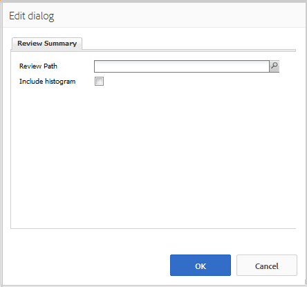

# Uso del resumen de críticas y comentarios (visualización) {#using-reviews-and-reviews-summary-display}

El `Reviews` el componente es una combinación de [Comentarios](comments.md) y [Clasificación](rating.md) componentes listos para usar.

El `Reviews Summary (Display)` proporciona un resumen de una instancia activa o cerrada de un `Reviews` componente para su visualización en cualquier otra parte del sitio.

>[!NOTE]
>
>No se admite la publicación anónima de una revisión. Los visitantes del sitio deben registrarse (convertirse en miembros) e iniciar sesión para participar. El visitante que ha iniciado sesión puede actualizar su revisión en cualquier momento.

## Agregar una revisión a una página {#adding-a-review-to-a-page}

Para agregar un `Reviews` a una página en modo de autor, utilice el navegador de componentes para localizar `Communities / Reviews` y arrástrela a su lugar en una página, como una posición relativa a la función que deben revisar los usuarios.

Para obtener la información necesaria, visite [Conceptos básicos de componentes de comunidades](basics.md).

Si la variable [bibliotecas requeridas del lado del cliente](reviews-basics.md#essentials-for-client-side) están incluidos, así es como se `Reviews` El componente aparecerá.

## Configuración de críticas {#configuring-reviews}

Seleccione el colocado `Reviews` para acceder y seleccionar el componente `Configure` que abre el cuadro de diálogo de edición.

En el **[!UICONTROL Clasificaciones permitidas]** , especifique la lista completa de clasificaciones que se mostrarán a los miembros. La primera calificación debe ser una calificación general/general, ya que es la calificación la que proporciona la calificación media para la `Review Summary (Display)` componente. A las dos clasificaciones siguientes de la configuración predeterminada se les debe asignar un título diferente, que no sea &quot;Subrating 1&quot; o &quot;Subrating 2&quot;.

* **[!UICONTROL Clasificaciones permitidas]**

  Lista de clasificaciones entre las que puede elegir un miembro.

  Utilice los botones de flecha arriba, flecha abajo y eliminar para modificar las selecciones visibles.

  Clic **[!UICONTROL Agregar elemento]** para añadir otra opción de clasificación.

En el **[!UICONTROL Clasificaciones obligatorias]** pestaña, vuelva a introducir elementos de la lista de **[!UICONTROL Clasificaciones permitidas]** que deben tener una calificación. Si un elemento solo se especifica en la ficha Clasificaciones permitidas, puede dejarse sin marcar cuando el miembro lo envíe.

En el sitio web, las clasificaciones requeridas se marcan con un asterisco. Si un elemento es obligatorio y se deja sin marcar, se mostrará un mensaje al miembro y se denegará el envío hasta que se marquen todas las clasificaciones requeridas.

* **[!UICONTROL Clasificaciones obligatorias]**

  Un subconjunto de clasificaciones permitidas, que indica qué clasificaciones son necesarias.

  Utilice los botones de flecha arriba, flecha abajo y eliminar para modificar las selecciones visibles.

  Clic **[!UICONTROL Agregar elemento]** para añadir otra opción de respuesta.

>[!NOTE]
>
>Si se introduce un elemento en la **[!UICONTROL Clasificaciones obligatorias]** que no se especifica en la **[!UICONTROL Clasificaciones permitidas]** , no se incluirá en los elementos que se van a clasificar.

En el **[!UICONTROL Críticas]** , especifique cómo se gestionan las revisiones.

* **[!UICONTROL Permitir respuestas]**

  Si se selecciona, permitir respuestas a críticas. El valor predeterminado está desmarcado.

* **[!UICONTROL Cerrado]**

  Si se selecciona, la revisión se cierra a nuevas críticas y respuestas. El valor predeterminado está desmarcado.

* **[!UICONTROL Permitir cargas de archivos]**

  Si se selecciona, permite que los archivos adjuntos se carguen para la revisión. El valor predeterminado está desmarcado.

* **Tamaño máximo de archivo**

  Relevante solo si **[!UICONTROL Permitir cargas de archivos]** está marcada. Este campo limita el tamaño (en bytes) de un archivo cargado. El valor predeterminado es 10 MB.

* **[!UICONTROL Longitud máxima del mensaje]**

  Número máximo de caracteres que pueden introducirse en el cuadro de texto. El valor predeterminado es de 4096 caracteres.

* **[!UICONTROL Tipos de archivo permitidos]**

  Relevante solo si **[!UICONTROL Permitir cargas de archivos]** está marcada. Lista separada por comas de las extensiones de archivo con el separador de &quot;puntos&quot;. Por ejemplo: .jpg, .jpeg, .png, .doc, .docx, .pdf. Si se especifica algún tipo de archivo, no se permitirán los que no se especifiquen. El valor predeterminado no se ha especificado, de modo que se permiten todos los tipos de archivo.

* **[!UICONTROL Editor de texto enriquecido]**

  Si se selecciona, las publicaciones pueden introducirse con marcado. El valor predeterminado está desmarcado.

* **[!UICONTROL Habilitar la votación]**

  Si se selecciona esta opción, se debe incluir la función de votación para un tema. El valor predeterminado está desmarcado.

En el **[!UICONTROL Moderación de usuario]** pestaña, especifique cómo se administran las críticas publicadas. Para obtener más información, consulte [Moderación del contenido generado por el usuario](moderate-ugc.md).

* **[!UICONTROL Moderación previa]**

  Si se selecciona, las revisiones deben aprobarse antes de que aparezcan en un sitio de publicación. El valor predeterminado está desmarcado.

* **[!UICONTROL Eliminar críticas]**

  Si se selecciona, el miembro que publicó la revisión tiene la capacidad de eliminarla. El valor predeterminado está desmarcado.

* **[!UICONTROL Denegar críticas]**

  Si se selecciona, permite que los moderadores denieguen críticas. El valor predeterminado está desmarcado.

* **[!UICONTROL Cerrar/abrir de nuevo las críticas]**

  Si se selecciona, permite que los moderadores cierren y abran de nuevo las críticas. El valor predeterminado está desmarcado.

* **[!UICONTROL Marcar críticas]**

  Si se selecciona esta opción, se permite que los miembros marquen las revisiones como inadecuadas. El valor predeterminado está desmarcado.

* **[!UICONTROL Lista de motivos de indicación]**

  Si se selecciona esta opción, se permite a los miembros elegir, en una lista desplegable, el motivo por el que marcan una revisión como inadecuada. El valor predeterminado está desmarcado.

* **[!UICONTROL Motivo de indicación personalizado]**

  Si se selecciona esta opción, se permite que los miembros especifiquen su propio motivo para señalar una revisión como inadecuada. El valor predeterminado está desmarcado.

* **[!UICONTROL Umbral de moderación]**

  Introduzca el número de veces que los miembros deben marcar una revisión antes de notificarlo a los moderadores. El valor predeterminado es una vez (1).

* **[!UICONTROL Límite de indicación]**

  Introduzca el número de veces que se debe marcar una revisión antes de ocultarla de la vista pública. Este número debe ser bueno o igual que **[!UICONTROL Umbral de moderación]**. El valor predeterminado es 5.

### Adición de un resumen de críticas (visualización) a una página {#adding-a-review-summary-display-to-a-page}

Para agregar un `Reviews Summary (Display)` a una página en modo de autor, busque el componente

* `Communities / Reviews Summary (Display)`

y arrástrela a su lugar en una página donde se va a mostrar un resumen de una revisión activa o cerrada.

Para obtener la información necesaria, visite [Conceptos básicos de componentes de comunidades](basics.md).

Si la variable [bibliotecas requeridas del lado del cliente](reviews-basics.md#essentials-for-client-side) están incluidos, así es como se `Reviews Summary (Display)`El componente aparecerá.

>[!NOTE]
>
>El &quot;Promedio&quot; refleja los votos del primer elemento enumerado en las fichas Clasificaciones permitidas de la revisión que se está resumiendo.

### Configuración del resumen de críticas (visualización) {#configuring-reviews-summary-display}

Seleccione el colocado `Reviews Summary (Display)` para acceder y seleccionar el componente `Configure` que abre el cuadro de diálogo de edición.

En el **[!UICONTROL Resumen de críticas]** pestaña

* `Review Path`

  introduzca o examine la instancia colocada del `reviews`para resumir, por ejemplo, si se añade a la página web del [Sitio de Geometrixx Engage,](getting-started.md) la ruta sería:

  `/content/sites/engage/en/page/jcr:content/content/primary/reviews`

* `Include histogram`

  Si se selecciona, se debe incluir la visualización de un gráfico de barras que indique el número de cada clasificación por estrellas que hay en las revisiones que se resumen. El valor predeterminado está desmarcado.

### Cambio a un tipo de revisión personalizado {#changing-to-a-custom-review-type}

El componente Revisiones utiliza el sistema de comentarios.

Al cambiar el Tipo de recurso de comentario, el sistema de comentarios ya no generará una instancia de un comentario con el valor predeterminado, sino una que los desarrolladores hayan personalizado (ampliado).

Una vez conocidos los tipos de recursos personalizados, escriba [Modo de diseño](../../help/sites-authoring/default-components-designmode.md) y haga doble clic en el `Comments` para abrir un cuadro de diálogo con una pestaña adicional.

En el **[!UICONTROL Tipos de recursos]** pestaña, especifique el resourceType personalizado para las nuevas instancias de la `Comments or Voting` componentes:

* **[!UICONTROL Tipo de medio de comentario]**

  Navegue hasta el resourceType de un `comment`componente (comentario único) en /apps. Por ejemplo, `/apps/social/commons/components/hbs/comments/comment`.

  Este recurso identificará el resourceType del UGC creado cuando un visitante publica un comentario.

* **[!UICONTROL Tipo de medio de votación]**

  Navegue hasta el resourceType de un `voting`en /apps. Por ejemplo, `/apps/social/components/hbs/voting`.

  Este recurso identificará el tipo de recurso de UGC creado cuando un visitante publica un voto.

* **[!UICONTROL Tipo de medio de sistema de comentario]**

  Navegue hasta el resourceType de un `comments`(Sistema de comentarios) en /apps. Dejar en blanco a menos que la plantilla de página [incluye dinámicamente](scf.md#add-or-include-a-communities-component) Utilice el sistema de comentarios en la secuencia de comandos subyacente en lugar de añadirse a la página como recurso (nodo de comentarios). Para obtener más información, lea la [{{include}} ayudante](handlebars-helpers.md#include).

## Experiencia del visitante del sitio {#site-visitor-experience}

### Moderadores y administradores {#moderators-and-administrators}

Cuando el usuario que ha iniciado sesión tiene privilegios de moderador o administrador, puede realizar las tareas de moderación permitidas por la configuración del componente, independientemente de quién haya creado la revisión.

### Miembros {#members}

Cuando el visitante del sitio inicia sesión, según la configuración, puede:

* Publicar una nueva revisión
* Editar su propia revisión
* Eliminar su propia revisión
* Marcar comentarios de críticas de otros usuarios

Solo se permite una clasificación por miembro. El socio puede cambiar su calificación en cualquier momento.

### Anónimo {#anonymous}

Los visitantes del sitio que no hayan iniciado sesión solo podrán leer las críticas publicadas, traducirlas si se admiten, pero no podrán añadir una valoración o una revisión, ni marcar los comentarios de las críticas de otros.

## Información adicional {#additional-information}

Puede encontrar más información en la [Revisar elementos esenciales](reviews-basics.md) para desarrolladores.

Para ver la moderación de los comentarios publicados, consulte [Moderación del contenido generado por el usuario](moderate-ugc.md).

Para ver la traducción de los comentarios publicados, consulte [Traducción del contenido generado por el usuario](translate-ugc.md).
