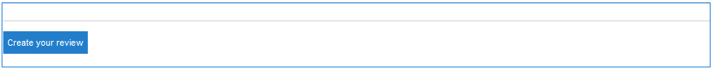

# Uso del resumen de críticas y comentarios (visualización) {#using-reviews-and-reviews-summary-display}

El componente `Reviews` es una combinación de [Comentarios](comments.md) y [Clasificación](rating.md) componentes listos para usar.

El componente `Reviews Summary (Display)` proporciona un resumen de una instancia activa o cerrada de un componente `Reviews` para su visualización en cualquier otra parte del sitio.

>[!NOTE]
>
>No se admite la publicación anónima de una revisión. Los visitantes del sitio deben registrarse (convertirse en miembros) e iniciar sesión para participar. El visitante que ha iniciado sesión puede actualizar su revisión en cualquier momento.

## Agregar una revisión a una página {#adding-a-review-to-a-page}

Para agregar un componente `Reviews` a una página en modo de autor, use el explorador de componentes para localizar `Communities / Reviews` y arrástrelo a su lugar en una página, como una posición relativa a la característica que deben revisar los usuarios.

Para obtener la información necesaria, visite [Conceptos básicos de componentes de comunidades](basics.md).

Cuando se incluyen las [bibliotecas requeridas del cliente](reviews-basics.md#essentials-for-client-side), así es como aparece el componente `Reviews`.

## Configuración de críticas {#configuring-reviews}

Seleccione el componente `Reviews` colocado para que pueda acceder y seleccionar el icono `Configure` que abre el cuadro de diálogo de edición.

En la ficha **[!UICONTROL Clasificaciones permitidas]**, especifique la lista completa de clasificaciones que se mostrarán a los miembros. La primera clasificación debe ser general/general, ya que es la clasificación la que proporciona la clasificación promedio del componente `Review Summary (Display)`. A las dos clasificaciones siguientes de la configuración predeterminada se les debe asignar un título diferente, que no sea &quot;Subrating 1&quot; o &quot;Subrating 2&quot;.

* **[!UICONTROL Clasificaciones permitidas]**

  Lista de clasificaciones entre las que puede elegir un miembro.

  Utilice los botones de flecha arriba, flecha abajo y eliminar para modificar las selecciones visibles.

  Haga clic en **[!UICONTROL Agregar elemento]** para agregar otra opción de clasificación.

En la ficha **[!UICONTROL Clasificaciones requeridas]**, vuelva a escribir los elementos de la lista de **[!UICONTROL Clasificaciones permitidas]** necesarias para la clasificación. Si un elemento solo se especifica en la ficha Clasificaciones permitidas, puede dejarse sin marcar cuando el miembro lo envíe.

En el sitio web, las clasificaciones requeridas se marcan con un asterisco. Si un elemento es obligatorio y se deja sin marcar, se muestra un mensaje al miembro y se deniega el envío hasta que se marquen todas las clasificaciones requeridas.

* **[!UICONTROL Clasificaciones requeridas]**

  Un subconjunto de clasificaciones permitidas, que indica qué clasificaciones son necesarias.

  Utilice los botones de flecha arriba, flecha abajo y eliminar para modificar las selecciones visibles.

  Haga clic en **[!UICONTROL Agregar elemento]** para agregar otra opción de respuesta.

>[!NOTE]
>
>Si se escribe un elemento en la ficha **[!UICONTROL Clasificaciones requeridas]** que no se especifica en la ficha **[!UICONTROL Clasificaciones permitidas]**, no se incluirá en los elementos que se van a clasificar.

En la ficha **[!UICONTROL Revisiones]**, especifique cómo se gestionan las revisiones.

* **[!UICONTROL Permitir respuestas]**

  Si se selecciona, permitir respuestas a críticas. El valor predeterminado está desmarcado.

* **[!UICONTROL Cerrado]**

  Si se selecciona, la revisión se cierra a nuevas críticas y respuestas. El valor predeterminado está desmarcado.

* **[!UICONTROL Permitir cargas de archivos]**

  Si se selecciona, permite que los archivos adjuntos se carguen para la revisión. El valor predeterminado está desmarcado.

* **Tamaño máximo de archivo**

  Relevante solo si se marca **[!UICONTROL Permitir cargas de archivos]**. Este campo limita el tamaño (en bytes) de un archivo cargado. El valor predeterminado es 10 MB.

* **[!UICONTROL Longitud máxima del mensaje]**

  Número máximo de caracteres que pueden introducirse en el cuadro de texto. El valor predeterminado es de 4096 caracteres.

* **[!UICONTROL Tipos de archivo permitidos]**

  Relevante solo si se marca **[!UICONTROL Permitir cargas de archivos]**. Lista separada por comas de las extensiones de archivo con el separador de &quot;puntos&quot;. Por ejemplo, .jpg, .jpeg, .png, .doc, .docx, .pdf. Si se especifica algún tipo de archivo, no se permiten los que no se hayan especificado. El valor predeterminado no se ha especificado, de modo que se permiten todos los tipos de archivo.

* **[!UICONTROL Editor de texto enriquecido]**

  Si se selecciona, las publicaciones pueden introducirse con marcado. El valor predeterminado está desmarcado.

* **[!UICONTROL Permitir Votación]**

  Si se selecciona esta opción, se debe incluir la función de votación para un tema. El valor predeterminado está desmarcado.

En la ficha **[!UICONTROL Moderación de usuarios]**, especifique cómo se administran las revisiones publicadas. Para obtener más información, consulte [Moderar contenido generado por el usuario](moderate-ugc.md).

* **[!UICONTROL Moderación previa]**

  Si se selecciona, las revisiones deben aprobarse antes de aparecer en un sitio de publicación. El valor predeterminado está desmarcado.

* **[!UICONTROL Eliminar críticas]**

  Si esta opción está activada, el miembro que publicó la revisión puede eliminarla. El valor predeterminado está desmarcado.

* **[!UICONTROL Denegar críticas]**

  Si se selecciona, permite que los moderadores denieguen críticas. El valor predeterminado está desmarcado.

* **[!UICONTROL Cerrar o volver a abrir críticas]**

  Si se selecciona, permite que los moderadores cierren y abran de nuevo las críticas. El valor predeterminado está desmarcado.

* **[!UICONTROL Marcar críticas]**

  Si se selecciona esta opción, se permite que los miembros marquen las revisiones como inadecuadas. El valor predeterminado está desmarcado.

* **[!UICONTROL Lista de motivos de marca]**

  Si se selecciona esta opción, se permite a los miembros elegir, en una lista desplegable, el motivo por el que marcan una revisión como inadecuada. El valor predeterminado está desmarcado.

* **[!UICONTROL Motivo de indicación personalizado]**

  Si se selecciona esta opción, se permite que los miembros especifiquen su propio motivo para señalar una revisión como inadecuada. El valor predeterminado está desmarcado.

* **[!UICONTROL Umbral de moderación]**

  Introduzca el número de veces que los miembros deben marcar una revisión antes de notificarlo a los moderadores. El valor predeterminado es una vez (1).

* **[!UICONTROL Límite de indicación]**

  Introduzca el número de veces que se debe marcar una revisión antes de ocultarla de la vista pública. Este número debe ser mayor o igual que el **[!UICONTROL umbral de moderación]**. El valor predeterminado es 5.

### Adición de un resumen de críticas (visualización) a una página {#adding-a-review-summary-display-to-a-page}

Para agregar un componente `Reviews Summary (Display)` a una página en modo de autor, busque el componente

* `Communities / Reviews Summary (Display)`

Y arrástrela a su lugar en una página donde se va a mostrar un resumen de una revisión activa o cerrada.

Para obtener la información necesaria, visite [Conceptos básicos de componentes de comunidades](basics.md).

Cuando se incluyen las [bibliotecas requeridas del lado del cliente](reviews-basics.md#essentials-for-client-side), así es como aparece `Reviews Summary (Display)`el componente.

>[!NOTE]
>
>El &quot;Promedio&quot; refleja los votos del primer elemento enumerado en las fichas Clasificaciones permitidas de la revisión que se está resumiendo.

### Configuración del resumen de críticas (visualización) {#configuring-reviews-summary-display}

Seleccione el componente `Reviews Summary (Display)` colocado para que pueda acceder y seleccionar el icono `Configure` que abre el cuadro de diálogo de edición.

En la ficha **[!UICONTROL Resumen de críticas]**

* `Review Path`

  Escriba o examine la instancia colocada del componente `reviews` para que pueda resumir, por ejemplo, si se agrega a la página web del sitio [Geometrixx Engage,](getting-started.md) la ruta sería:

  `/content/sites/engage/en/page/jcr:content/content/primary/reviews`

* `Include histogram`

  Si se selecciona, se debe incluir la visualización de un gráfico de barras que indique cuántas clasificaciones de estrellas hay en las revisiones que se resumen. El valor predeterminado está desmarcado.

### Cambio a un tipo de revisión personalizado {#changing-to-a-custom-review-type}

El componente Revisiones utiliza el sistema de comentarios.

Al cambiar el Tipo de recurso de comentario, el sistema de comentarios ya no genera una instancia de un comentario con el valor predeterminado, sino una que han personalizado (ampliado) los desarrolladores.

Cuando se conozcan los tipos de recursos personalizados, ingrese [Modo de diseño](../../help/sites-authoring/default-components-designmode.md) y haga doble clic en el componente `Comments` colocado para abrir un cuadro de diálogo con una ficha adicional.

En la ficha **[!UICONTROL Tipos de recursos]**, especifique el resourceType personalizado para las nuevas instancias de los componentes `Comments or Voting`:

* **[!UICONTROL Tipo de medio de comentario]**

  Vaya al resourceType de un componente `comment` extendido (un solo comentario) en /apps. Por ejemplo, `/apps/social/commons/components/hbs/comments/comment`.

  Este recurso identifica el resourceType del UGC creado cuando un visitante publica un comentario.

* **[!UICONTROL Tipo de medio de votación]**

  Vaya al resourceType de un componente `voting` extendido en /apps. Por ejemplo, `/apps/social/components/hbs/voting`.

  Este recurso identifica el tipo de recurso de UGC creado cuando un visitante publica un voto.

* **[!UICONTROL Tipo de recurso de sistema de comentario]**

  Vaya al resourceType de un componente `comments` extendido (sistema de comentarios) en /apps. Déjelo en blanco a menos que la plantilla de página [incluya](scf.md#add-or-include-a-communities-component) dinámicamente el sistema de comentarios en el script subyacente en lugar de agregarse a la página como recurso (nodo de comentarios). Obtenga más información leyendo sobre el [`{{include}}` asistente](handlebars-helpers.md#include).

## Experiencia del visitante del sitio {#site-visitor-experience}

### Moderadores y administradores {#moderators-and-administrators}

Cuando el usuario que ha iniciado sesión tiene privilegios de moderador o administrador, puede realizar las tareas de moderación permitidas por la configuración del componente, independientemente de quién haya creado la revisión.

### Miembros {#members}

Cuando el visitante del sitio inicia sesión, según la configuración, puede:

* Post ofrece una nueva revisión
* Editar su propia revisión
* Eliminar su propia revisión
* Marcar comentarios de críticas de otros usuarios

Solo se permite una clasificación por miembro. El socio puede cambiar su calificación en cualquier momento.

### Anónimo {#anonymous}

Los visitantes del sitio que no hayan iniciado sesión solo podrán leer las críticas publicadas, traducirlas si se admiten, pero no podrán añadir una valoración o una revisión, ni marcar los comentarios de las críticas de otros.

## Información adicional {#additional-information}

Encontrará más información en la página [Revisar elementos esenciales](reviews-basics.md) para desarrolladores.

Para moderar los comentarios publicados, consulte [Moderar el contenido generado por el usuario](moderate-ugc.md).

Para obtener la traducción de los comentarios publicados, consulte [Traducción del contenido generado por el usuario](translate-ugc.md).
