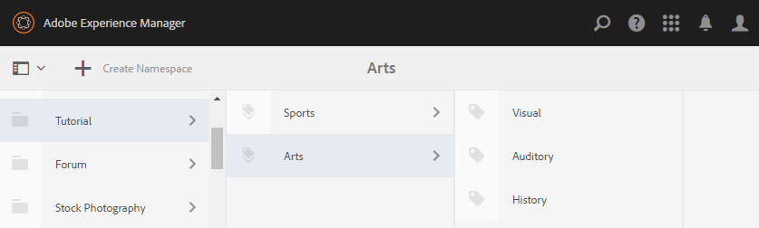

# Configuración inicial {#initial-setup}

## Iniciar instancias de autor y publicación {#start-author-and-publish-instances}

Para fines de desarrollo y demostración, será necesario ejecutar un autor y una instancia de publicación.

Para ello, siga la AEM básica [Introducción](../../help/sites-deploying/deploy.md#getting-started) instrucciones, lo que dará como resultado:

* Entorno de creación en [localhost:4502](http://localhost:4502/)
* Publicar entorno en [localhost:4503](http://localhost:4503/)

Para AEM Communities,

* El entorno de creación es para:

   * Desarrollo de sitios, plantillas y componentes.
   * Tareas administrativas y de configuración.

* El entorno de publicación es para:

   * La experiencia de la comunidad de publicar y moderar contenido.
   * Creación de grupos de la comunidad, miembros y grupos de miembros.

>[!NOTE]
>
>Si no está familiarizado con AEM, consulte la documentación de [tratamiento básico](../../help/sites-authoring/basic-handling.md) y [guía rápida para la creación de páginas](../../help/sites-authoring/qg-page-authoring.md).

## Instalación de la última versión de Communities {#install-latest-communities-release}

Este tutorial crea un [sitio de la comunidad de participación](overview.md#engagement-community) y se basa en AEM Communities 6.2 feature pack versión 1.10.

Para asegurarse de que está instalado el paquete de funciones más reciente, visite:

* [Últimas versiones](deploy-communities.md#latest-releases)

Para un tutorial que cree un [sitio de la comunidad de habilitación](overview.md#enablement-community), visita [Introducción a AEM Communities para la activación](getting-started-enablement.md).

## Configurar Analytics {#configure-analytics}

When [Adobe Analytics está configurado para el sitio de la comunidad](analytics.md), hay disponible información sobre la actividad de la comunidad que mejora la experiencia del miembro de la comunidad, así como comentarios para los administradores del sitio.

La integración con Adobe Analytics es opcional.

## Configurar el correo electrónico para las notificaciones {#configure-email-for-notifications}

La función de notificaciones está disponible de forma predeterminada para todos los sitios creados con el `Communities Sites` proporciona un canal de correo electrónico para las notificaciones.

Lo que es necesario es que el correo electrónico esté configurado correctamente para el sitio.

Consulte [Configuración del correo electrónico](email.md).

## Habilitar el servicio de túnel {#enable-the-tunnel-service}

Al crear un sitio de comunidad en el entorno de creación, el servicio de túnel permite asignar funciones a miembros de comunidad de confianza registrados en el entorno de publicación. El servicio de túnel también permite el acceso a los miembros de la comunidad desde el [Consolas Miembros y Grupos](members.md) en el entorno de creación.

La convención es para miembros y grupos de miembros creados en el entorno de publicación para *not* vuelva a crearse en el entorno de creación. Para obtener más información, consulte [Administración de usuarios y grupos de usuarios](users.md).

Para instrucciones sencillas para habilitar el servicio de túnel en un **author** instancia, consulte [Servicio de túnel](deploy-communities.md#tunnel-service-on-author).

## Función de administrador de la comunidad {#community-administrator-role}

Los miembros del grupo Administradores de la comunidad pueden crear sitios de la comunidad, administrar sitios, administrar miembros (pueden prohibir a los miembros de la comunidad) y moderar contenido.

### Crear usuario {#create-user}

Crear un usuario en *author*, a quien se asigna la función de administrador de la comunidad:

* En la instancia de autor

   * Por ejemplo, [http://localhost:4502/](http://localhost:4503/)

* Iniciar sesión con privilegios de administrador

   * Por ejemplo, el nombre de usuario &quot;admin&quot;/contraseña &quot;admin&quot;

* Desde la consola principal, vaya a **[!UICONTROL Herramientas]** > **[!UICONTROL Operaciones]** > **[!UICONTROL Seguridad]** > **[!UICONTROL Usuarios]**.
* En el **Editar** seleccione **[!UICONTROL Agregar usuario]**

* En el `Create New User` introduzca el cuadro de diálogo:

   * **[!UICONTROL ID]**: sirius
   * **[!UICONTROL Dirección De Correo Electrónico]**: sirius.nilson@mailinator.com
   * **[!UICONTROL Contraseña]**: password
   * **[!UICONTROL Confirmar contraseña&amp;ast;]**: password
   * **[!UICONTROL Nombre]**: Sirius
   * **[!UICONTROL Apellidos]**: Nilson

### Asignar Sirius al grupo de administradores de la comunidad {#assign-sirius-to-community-administrators-group}

Desplácese hacia abajo hasta `Add User to Groups`:

* Escriba &quot;C&quot; para buscar

   * Seleccione `Community Administrators`
   * Seleccione `Community Enablement Managers`

* Seleccione **[!UICONTROL Guardar]**.

## Habilitar inicio de sesión social {#enable-social-login}

Antes de poder utilizar las versiones de demostración del inicio de sesión social con Facebook y Twitter, es necesario

1. Instale un paquete de correcciones o [último feature pack](deploy-communities.md#latestfeaturepack) (para los cambios de la API de Facebook de marzo de 2017).
1. [Habilitar el proveedor de OAuth](social-login.md#adobe-granite-oauth-authentication-handler) en el entorno de publicación.

Para los servidores de producción, es necesario crear los servicios de nube necesarios para proporcionar el inicio de sesión social.

Consulte [Inicio de sesión en Social con Facebook y Twitter](social-login.md).

## Creación de etiquetas de tutorial {#create-tutorial-tags}

Cree etiquetas para utilizarlas en los tutoriales de interacción y habilitación, utilizando el espacio de nombres de las etiquetas de `Tutorial`.

Utilice la variable [Consola de etiquetado](../../help/sites-administering/tags.md#tagging-console) para crear las etiquetas siguientes:

* `Tutorial: Sports / Baseball`
* `Tutorial: Sports / Gymnastics`
* `Tutorial: Sports / Skiing`
* `Tutorial: Arts / Visual`
* `Tutorial: Arts / Auditory`
* `Tutorial: Arts / History`

A continuación, siga las instrucciones para:

1. [Definición de los permisos de etiqueta](../../help/sites-administering/tags.md#setting-tag-permissions).
1. [Publicación de las etiquetas](../../help/sites-administering/tags.md#publishing-tags).

Paquete de muestra de etiquetas creadas para los Tutorials de introducción a AEM Communities

[Obtener archivo](assets/tutorial_tags-v63.zip)

## MongoDB para UGC Common Store {#mongodb-for-ugc-common-store}

Se recomienda, pero es opcional, establecer [MSRP](msrp.md) (MongoDB) como [tienda común](working-with-srp.md) para experimentar la flexibilidad de moderar todo el UGC desde los entornos de publicación o autor.

Para obtener instrucciones, visite [Configuración de MongoDB para demostración](demo-mongo.md).

De forma predeterminada, la instalación de las instancias de autor y publicación de AEM hace que el contenido generado por el usuario (UGC) se almacene en [Almacenamiento de JCR Tar](../../help/sites-deploying/platform.md) a los que se accede mediante [JSRP](jsrp.md). JSRP no es un almacén común, lo que significa que UGC solo es visible en la instancia en la que se introdujo. Normalmente, UGC se introduce en una instancia de publicación y no estaría visible en el entorno de creación, lo que da como resultado todas las tareas de moderación que necesiten utilizar la instancia de publicación.
