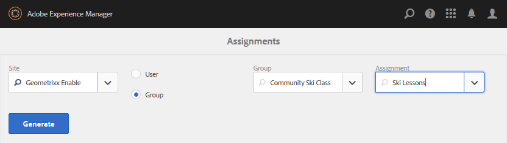

# Consola Sitios de comunidades {#communities-sites-console}

La consola Sitios de comunidades proporciona acceso a:

* Creación de sitios
* Edición del sitio
* Administración de sitios
* [Creación y edición de grupos](/help/communities/groups.md) anidados (subcomunidades)

Consulte [Introducción a las comunidades](/help/communities/getting-started.md) de AEM para comprobar la rapidez con la que se puede crear un sitio de comunidad en el entorno de creación, así como cómo crear grupos de comunidad a partir de los entornos de creación y publicación.

>[!NOTE]
>
>Los menús principales de Comunidades para la creación de sitios [de](/help/communities/sites-console.md)comunidad, plantillas [de sitios de](/help/communities/sites.md)comunidad, plantillas [de grupos de](/help/communities/tools-groups.md) comunidad y funciones [de](/help/communities/functions.md) comunidad solo se pueden usar en el entorno de creación.

## Requisitos previos {#prerequisites}

Antes de crear un sitio de comunidad, es *necesario* :

* Asegúrese de que se están ejecutando una o varias instancias de publicación.
* Habilite el servicio [de](/help/communities/deploy-communities.md#tunnel-service-on-author) túnel para administrar miembros y grupos de miembros.
* Identifique el publicador principal.
* [Configure la replicación](/help/communities/deploy-communities.md#replication-agents-on-author) cuando el puerto del publicador principal no sea el predeterminado (4503).

La práctica recomendada para garantizar que el sitio esté preparado para admitir muchas funciones es realizar los siguientes pasos:

* Instale el [último paquete](/help/communities/deploy-communities.md#latestfeaturepack)de funciones.
* Habilite [Adobe Analytics](/help/communities/analytics.md) para comunidades AEM.
* Configurar [correo electrónico](/help/communities/email.md)
* Identifique a los administradores [de la comunidad](/help/communities/users.md#creating-community-members).
* [Habilite el controlador](/help/communities/social-login.md#adobe-granite-oauth-authentication-handler) OAuth para el inicio de sesión social.

## Acceso a la consola Sitios de comunidades {#accessing-communities-sites-console}

En el entorno de creación, para acceder a la consola Sitios de comunidades:

* Desde la navegación global: **[!UICONTROL Comunidades]** > **[!UICONTROL Sitios]**

La consola Sitios de comunidades muestra todos los sitios de comunidad existentes. Desde esta consola, los sitios de comunidad pueden crearse, editarse, administrarse y eliminarse.

Para crear un nuevo sitio de comunidad, seleccione el icono **Crear** .

Para acceder a un sitio de comunidad existente, con el fin de crear, modificar, publicar, exportar o agregar un grupo anidado, seleccione el icono de carpeta del sitio.

Por ejemplo, la siguiente imagen muestra la consola principal Sitios de comunidades que muestra las carpetas de dos sitios de comunidad: [habilitar](/help/communities/getting-started-enablement.md) y [participar](/help/communities/getting-started.md):

## Creación del sitio {#site-creation}

La consola de creación del sitio proporciona un método paso a paso para agrupar las funciones del sitio en función de una plantilla [y una configuración del sitio de](/help/communities/sites.md) comunidad seleccionadas.

Cada sitio creado incluye una función de inicio de sesión, ya que los visitantes del sitio deben iniciar sesión antes de poder publicar contenido, enviar mensajes o participar en un grupo. Otras funciones incluidas son los perfiles de usuario, los mensajes, las notificaciones, el menú del sitio, la búsqueda, la temática y la marca.

El proceso se inicia seleccionando el `Create` botón situado en la parte superior de la consola Sitios de comunidades.

El proceso de creación consiste en una serie de pasos presentados como paneles que contienen un conjunto de características que se deben configurar (presentados como subpaneles). Es posible avanzar al paso **Siguiente** o **Volver** al paso anterior antes de comprometer el sitio en el paso final.

### Paso 1: Plantilla de sitio {#step-site-template}

En el panel Plantilla del sitio, se especifican el título, la descripción, la raíz del sitio, el idioma base, el nombre y la plantilla del sitio:

* **Título del sitio de la comunidad**

   Título que se muestra para el sitio.

   El título aparece en el sitio publicado, así como en la interfaz de usuario del administrador del sitio.

* **Descripción del sitio de la comunidad**

   Descripción del sitio.

   La descripción no aparece en el sitio publicado.

* **Raíz del sitio de la comunidad**

   La ruta raíz del sitio.

   La raíz predeterminada es `/content/sites`pero puede moverse a cualquier ubicación dentro del sitio Web.

* **Idioma de base del sitio de la comunidad**

   (No modificar para un solo idioma: Inglés) Utilice el menú desplegable para elegir uno *o varios* idiomas básicos de los disponibles: alemán, italiano, francés, japonés, español, portugués (Brasil), chino (tradicional) y chino (simplificado). Se creará un sitio de comunidad para cada idioma agregado y existirá dentro de la misma carpeta de sitio siguiendo las optimizaciones descritas en [Traducir contenido para sitios](/help/sites-administering/translation.md)multilingües. La página raíz de cada sitio contendrá una página secundaria con el nombre del código de idioma de uno de los idiomas seleccionados, como &quot;en&quot; para inglés o &quot;fr&quot; para francés.

* **Nombre del sitio de la comunidad**:

   Nombre de la página raíz del sitio que aparece en la dirección URL.

   * Compruebe el Doble del nombre, ya que no es fácil cambiarlo después de crear el sitio.
   * La dirección URL base ( `https://server:port/site root/site name)` se mostrará debajo de la `Community Site Name`.

   * Para una dirección URL válida, anexe un código de idioma base + &quot;.html&quot;

      *Por ejemplo*, `https://localhost:4502/content/sites/mysight/en.html`

* **Menú Plantilla** de sitio de comunidad

   Utilice el menú desplegable para elegir una plantilla [de sitio de](/help/communities/tools.md)comunidad disponible.

* Seleccione **Siguiente**.

### Paso 2: Diseño {#step-design}

El panel Diseño contiene dos subpaneles para seleccionar el tema y la pancarta de marca:

#### COMMUNITY SITE THEME {#community-site-theme}

El marco utiliza [Twitter Bootstrap](https://twitterbootstrap.org/) para llevar un diseño flexible y adaptable al sitio. Se puede seleccionar una de las muchas temáticas de Bootstrap precargadas para aplicar estilo a la plantilla de sitio de comunidad seleccionada o se puede cargar un tema de Bootstrap.

Cuando se selecciona, el tema se superpone con una marca de verificación azul opaca.

Después de publicar el sitio de la comunidad, es posible [editar las propiedades](#modifying-site-properties) y seleccionar un tema diferente.

#### COMMUNITY SITE BRANDING {#community-site-branding}

La marca del sitio de la comunidad es una imagen que se muestra como encabezado en la parte superior de cada página.

El tamaño de la imagen debe ser tan grande como la visualización esperada de la página en el navegador y 120 píxeles de altura.

Al crear o seleccionar una imagen, tenga en cuenta:

* La altura de la imagen se recortará a 120 píxeles medidos desde el borde superior de la imagen.
* La imagen se fija en el borde izquierdo de la ventana del explorador.
* No hay cambio de tamaño de la imagen, de modo que cuando la anchura de la imagen es...

   * Menos que el ancho del navegador, la imagen se repite horizontalmente.
   * Bueno al ancho del navegador, la imagen parece recortarse.

* Seleccione **Siguiente**.

### Paso 3: Configuración {#step-settings}

El panel Configuración contiene varios subpaneles que presentan las funciones que se deben configurar antes de pasar al último paso para crear el sitio.

* [ADMINISTRACIÓN DE USUARIOS](#user-management)
* [ETIQUETADO](#tagging)
* [FUNCIONES](#roles)
* [MODERACIÓN](#moderation)
* [ANALYTICS](#analytics)
* [TRADUCCIÓN](#translation)
* [HABILITACIÓN](#enablement)

>[!NOTE]
>
>**Habilitar servicio de túnel**
>
>Varios subpaneles de Configuración permiten que la asignación de un miembro de confianza modere UGC, administre grupos o se convierta en contactos para habilitar recursos en el entorno de publicación.
>
>La convención es que [los usuarios y grupos](/help/communities/users.md) de usuarios del lado de la publicación (miembros y grupos de miembros) no se dupliquen en el entorno del autor.
>
>Por lo tanto, al crear el sitio de comunidad en el entorno de creación y asignar miembros de confianza a varias funciones, es necesario recuperar datos de miembros del entorno de publicación.
>
>Esto se logra habilitando el entorno ` [AEM Communities Publish Tunnel Service](/help/communities/deploy-communities.md#tunnel-service-on-author)` para el autor.

#### USER MANAGEMENT {#user-management}

>[!NOTE]
>
>Se recomienda que los sitios [de la comunidad de](/help/communities/overview.md#enablement-community) habilitación sean privados (comuníquese con el representante de cuentas para obtener más información).
>
>Un sitio de la comunidad es privado cuando se deniega el acceso a los visitantes anónimos del sitio, es posible que no se registre por sí mismo y que no utilice el inicio de sesión en redes sociales.

* **Permitir el registro de usuarios**

   Si se selecciona, los visitantes del sitio pueden convertirse en miembros de la comunidad mediante el registro propio.
Si no se selecciona, el sitio de la comunidad está *restringido* y los visitantes del sitio deben asignarse al grupo de miembros del sitio de la comunidad, realizar una solicitud o recibir una invitación por correo electrónico. Si no se selecciona, no se debe permitir el acceso anónimo.
Desactive la casilla de verificación de un sitio de comunidad *privada* . El valor predeterminado está marcado.

* **Permitir acceso anónimo**

   Si se selecciona, el sitio de la comunidad está *abierto *y cualquier visitante del sitio puede acceder al sitio.
Si no está activada, solo los miembros con sesión iniciada pueden acceder al sitio.
Desmarque la búsqueda de un *sitio de comunidad privado. El valor predeterminado está marcado.

* **Permitir mensajes**

   Si se selecciona, los miembros pueden enviarse mensajes entre sí y al grupo dentro del sitio de la comunidad.
Si no se selecciona, los mensajes no se configuran para la comunidad.
El valor predeterminado no está marcado.

* **Permitir inicios de sesión de redes sociales: Facebook**

   Si se selecciona, permita que los visitantes del sitio inicien sesión con las credenciales de su cuenta de Facebook. La configuración [de nube de](/help/communities/social-login.md#create-a-facebook-connect-cloud-service) Facebook seleccionada debe configurarse para agregar usuarios al grupo de miembros del sitio de la comunidad una vez creado el sitio de la comunidad.
Si no se selecciona, no se muestra ningún inicio de sesión en Facebook.
No marcar un sitio de comunidad *privada* . El valor predeterminado no está marcado.

* **Permitir inicios de sesión de redes sociales: Twitter**

   Si está activada, permita que los visitantes del sitio inicien sesión con las credenciales de su cuenta de Twitter. La configuración [de nube de](/help/communities/social-login.md#create-a-twitter-connect-cloud-service) Twitter seleccionada debe configurarse para agregar usuarios al grupo de miembros del sitio de la comunidad una vez creado el sitio de la comunidad.
Si no se selecciona, no se muestra ningún inicio de sesión en Twitter.
No marcar un sitio de comunidad *privada* . El valor predeterminado no está marcado.

>[!NOTE]
>
>**Permitir inicios de sesión sociales**
>
>Aunque las configuraciones de Facebook y Twitter de muestra pueden existir y ser seleccionables, para un entorno [de](/help/sites-administering/production-ready.md)producción es necesario crear aplicaciones personalizadas de Facebook y Twitter. Consulte Inicio de sesión en [Social con Facebook y Twitter](/help/communities/social-login.md).

#### TAGGING {#tagging}

Las etiquetas que se pueden aplicar al contenido de la comunidad se controlan seleccionando Áreas de nombres de etiquetas previamente definidas a través de la Consola de [etiquetado](/help/sites-administering/tags.md#tagging-console).

Además, la selección de Áreas de nombres de etiquetas para el sitio de la comunidad limita la selección presentada al definir catálogos y recursos. Consulte [Etiquetado de recursos](/help/communities/tag-resources.md) de habilitación para obtener información importante.

* cuadro de búsqueda de texto: Escritura de Inicios para identificar las etiquetas permitidas para su uso en el sitio.

#### ROLES {#roles}

Las [funciones de los miembros](/help/communities/users.md) de la comunidad se asignan con esta configuración.

Encontrar miembros de la comunidad es fácil mediante la búsqueda por tipo.

* **Administradores de la comunidad**

   Escritura de Inicios para seleccionar uno o más miembros de la comunidad o grupos miembros que pueden administrar miembros de la comunidad y grupos miembros.

* **Moderadores de la comunidad**

   Escritura de Inicios para seleccionar uno o varios miembros de la comunidad o grupos de miembros en los que se debe confiar como moderadores del contenido generado por el usuario.

* **Miembros privilegiados de la comunidad**

   Escritura de Inicios para seleccionar uno o varios miembros de la comunidad o grupos de miembros para que se les pueda crear contenido nuevo cuando `Allow Privileged Member` se haya seleccionado para una función [de](/help/communities/functions.md)comunidad.

* **Administradores de la comunidad**

   Escritura de Inicios para seleccionar uno o más administradores del sitio que pueden administrar la estructura del sitio independientemente de otros administradores del sitio y del administrador predeterminado de la comunidad. Pueden crear grupos en cualquier nivel de la jerarquía y convertirse en el administrador predeterminado de los grupos anidados (pero posteriormente pueden eliminarse de la función de administrador de los grupos anidados).

#### MODERATION {#moderation}

Esta configuración controla la configuración global para moderar el contenido generado por el usuario (UGC). Los componentes individuales tienen una configuración adicional para controlar la moderación.

* **Contenido con moderación previa**

   Si se selecciona, el contenido de la comunidad publicado no aparecerá hasta que lo apruebe un moderador. El valor predeterminado no está marcado. Para obtener más información, consulte [Moderación del contenido](/help/communities/moderate-ugc.md#premoderation)de la comunidad.

* **Umbral de indicación antes de ocultar el contenido**

   Si es bueno que no sea 0, el número de veces que se debe marcar un tema o publicación antes de ocultarlo en la vista pública. Si se establece en -1, el tema o anuncio marcado nunca se oculta en la vista pública. El valor predeterminado es 5.

#### ANALYTICS {#analytics}

* **Activar Analytics**

   Solo está disponible cuando Adobe Analytics se ha [configurado](/help/communities/analytics.md) para las funciones de Comunidades.
El valor predeterminado no está marcado. Cuando se selecciona, aparece un menú de selección adicional:

* **Referencia de la estructura de configuración de la nube**

   En el menú desplegable, seleccione el marco de servicios en la nube de Analytics configurado para este sitio de comunidad.
   `Communities` es el ejemplo de marco de la documentación de funciones [de Configuración de](/help/communities/analytics.md#aem-analytics-framework-configuration) Analytics para comunidades.

#### TRANSLATION {#translation}

* **Permitir traducción automática**

   Cuando se selecciona (el valor predeterminado no está marcado), la traducción automática se activa para UGC dentro del sitio. Esto no afecta a ningún otro contenido, como el contenido de la página, aunque el sitio esté configurado como un sitio multilingüe. Consulte [Traducción de contenido](/help/communities/translate-ugc.md) generado por el usuario para obtener información sobre la configuración de un servicio de traducción con licencia para comunidades AEM. Consulte [Traducción de contenido para sitios](/help/sites-administering/translation.md) multilingües para obtener una descripción general completa.

* **Activar la traducción automática para los idiomas seleccionados**

   Los idiomas habilitados para la traducción automática se establecen de forma predeterminada en la configuración del sistema especificada por la configuración [de la integración de](/help/communities/translate-ugc.md#translation-integration-configuration)traducción. Esta configuración predeterminada se puede anular para este sitio eliminando los valores predeterminados o seleccionando otros idiomas en el menú desplegable.

* **Seleccione un proveedor de traducciones**

   De forma predeterminada, el proveedor de servicio es un servicio de prueba que utiliza solo `microsoft` para demostración. Si no hay ningún proveedor de servicio de traducción con licencia, se debe desactivar **Permitir traducción** automática.

* **Elegir almacén compartido global**

   Para un sitio web con varias copias de idiomas, una tienda compartida global proporciona un único subproceso de conversación, visible desde cada copia de idioma. Esto se logra seleccionando uno de los idiomas incluidos como copia del idioma. El valor predeterminado es *No hay un almacén* compartido global.

* **Elija la configuración del proveedor de traducciones**

   Elija un marco [de integración de](/help/sites-administering/tc-tic.md) traducción creado para el proveedor de traducción con licencia.

* **Seleccione las opciones de traducción del sitio de la comunidad**

   * **Traducir toda la página**

      Si se selecciona, todo el contenido generado por usuarios de una página se traduce al idioma base de la página.

      El valor predeterminado *no está seleccionado*.

   * **Traducir solo la selección**

      Si se selecciona, aparece una opción de traducción junto a cada anuncio que permite traducir anuncios individuales al idioma base de la página.
El valor predeterminado está *seleccionado*.

* **Seleccione las opciones de persistencia**

   * **Traducir las contribuciones a petición del usuario y persistir después** Si se selecciona, el contenido no se traduce hasta que se realiza una solicitud. Una vez traducida, la traducción se almacena en el repositorio.

      El valor predeterminado *no está seleccionado*.

   * **No continuar traduciendo**

      Si se selecciona, las traducciones no se almacenan en el repositorio.

      Si no se selecciona, las traducciones se conservan.

      El valor predeterminado *no está seleccionado*.

* **Procesamiento inteligente**

   Seleccione uno de los siguientes:

   * `Always show contributions in the original language` (predeterminada)
   * `Always show contributions in user preferred language`
   * `Show contributions in user preferred language for only logged-in users`

#### ENABLEMENT {#enablement}

La `ENABLEMENT`configuración se aplica cuando la plantilla de sitio de comunidad elegida incluye la función asignaciones, que está disponible cuando las funciones de habilitación tienen licencia y están [configuradas](/help/communities/enablement.md). La plantilla de sitio de referencia que incluye la función de asignaciones es `Reference Structured Learning Site Template.`

* **Administradores** de habilitación (obligatorio) Solo los miembros del `Community Enablementmanagers` grupo están disponibles para ser seleccionados para administrar esta comunidad de habilitación. Los administradores de habilitación son responsables de asignar miembros a los recursos. Consulte también [Administración de usuarios y grupos](/help/communities/users.md)de usuarios.

* **ID de organización de Marketing Cloud**

   (opcional) El ID de una licencia de [Video Heartbeat Analytics](/help/communities/analytics.md#video-heartbeat-analytics) .

* Seleccione **Siguiente**.

### Paso 4: Crear sitio de comunidades {#step-create-communities-site}

Si es necesario realizar algún ajuste, utilice el botón **Atrás** para realizarlo.

Una vez que se selecciona y se inicia **Crear** , el proceso de creación del sitio no se puede interrumpir.

Una vez creado el sitio:

* No se admite el cambio de la dirección URL (nombre de nodo).
* Los cambios futuros en la plantilla del sitio de la comunidad no afectarán al sitio de la comunidad creado.
* La desactivación de la plantilla de sitio de comunidad no afectará al sitio de comunidad creado.
* Es posible editar la [ESTRUCTURA](#modify-structure) de un sitio de comunidad modificando sus propiedades.

Cuando se completa el proceso, la carpeta del nuevo sitio se muestra en la consola Sitios de comunidades, desde donde los autores pueden agregar contenido de página o los administradores pueden modificar las propiedades del sitio.

Para modificar un sitio de comunidad, seleccione su carpeta de proyecto para abrirlo:

Al pasar el ratón por encima de un sitio o tocar una tarjeta del sitio, aparecen iconos que permiten [editar el sitio en modo](#authoring-site-content)de autor, [abrir las propiedades del sitio para modificarlo](#modifying-site-properties), [publicar el sitio](#publishing-the-site), [exportar el sitio](#exporting-the-site)y [eliminar el sitio](#deleting-the-site).

## Creación de contenido del sitio {#authoring-site-content}

El contenido de un sitio puede crearse con las mismas herramientas que cualquier otro sitio web de AEM. Para abrir el sitio para la creación, seleccione el `Open Site` icono que aparece al pasar el ratón por el sitio. El sitio se abrirá en una nueva ficha para que la consola Sitios de comunidades permanezca accesible.

>[!NOTE]
>
>Si no está familiarizado con AEM, vista la documentación sobre la gestión  básica y una guía [rápida para la creación de páginas](/help/sites-authoring/qg-page-authoring.md).

## Modificación de las propiedades del sitio {#modifying-site-properties}

Las propiedades de un sitio existente, especificadas durante el proceso de creación del sitio, se pueden modificar seleccionando el `Edit Site`icono que aparece al pasar el ratón por el sitio.

`Details of the following properties match the descriptions provided in the` Creación [del](#site-creation) sitio.

### Modificar básico {#modify-basic}

El panel BASIC permite modificar:

* Título del sitio de la comunidad
* Descripción del sitio de la comunidad

No se puede modificar el nombre del sitio de la comunidad.

La elección de una plantilla de sitio de comunidad diferente no afectaría a un sitio de comunidad existente, ya que no queda ninguna conexión entre plantillas y sitios.

En cambio, la [ESTRUCTURA](#modify-structure) del sitio de la comunidad puede ser modificada.

### Modificar estructura {#modify-structure}

El panel ESTRUCTURA permite modificar la estructura creada inicialmente a partir de la plantilla de sitio de comunidad seleccionada. Desde el panel, es posible:

* Arrastre y suelte funciones [de](/help/communities/functions.md) comunidad adicionales en la estructura del sitio.
* En una instancia de una función de comunidad en la estructura del sitio:

   * **`gear icon`**

      Edite la configuración, incluido el título para mostrar y el nombre de URL*, así como los grupos [de miembros](/help/communities/users.md#privilegedmembersgroups)privilegiados.

   * **`trashcan icon`**

      Quitar (eliminar) funciones de la estructura del sitio.

   * **`grid icon`**

      Modifique el orden de las funciones como se muestra en la barra de navegación de nivel superior del sitio.

>[!NOTE]
>
>Puede cambiar el orden de todas las funciones en la estructura del sitio, excepto la función en la parte superior. Por lo tanto, no se puede cambiar la página de inicio del sitio de las comunidades.

>[!CAUTION]
>
>* Aunque el título de visualización se puede cambiar sin efectos secundarios, no se recomienda editar el nombre de la dirección URL de una función de comunidad que pertenece a un sitio de comunidad.
>
>
Por ejemplo, si se cambia el nombre de la URL, no se moverá el UGC existente, lo que tendrá el efecto de &#39;perder&#39; UGC.

>[!CAUTION]
>
>La función de grupos *no debe* ser la *primera ni la única* función de la estructura del sitio.
>
>Cualquier otra función, como la función [de](/help/communities/functions.md#page-function)página, debe incluirse y enumerarse en primer lugar.

#### Ejemplo: Añadir una función de catálogo en una estructura de sitio de comunidad {#example-adding-a-catalog-function-to-a-community-site-structure}

### Modificar diseño {#modify-design}

El panel DISEÑO permite aplicar un nuevo tema:

* [Tema del sitio de la comunidad](#community-site-theme)
* [Marca del sitio de la comunidad](#community-site-branding)

   * Desplácese hasta la parte inferior del panel para cambiar la imagen de marca.

### Modificar configuración {#modify-settings}

El panel CONFIGURACIÓN permite acceder a la mayoría de los ajustes de los subpaneles de para el paso 3 de la creación del sitio de la comunidad:

* [Administración de usuarios](#user-management)
* [Etiquetas](#tagging)
* [Moderación](#moderation)
* [Funciones de miembro](#roles)
* [Análisis](#analytics)
* [Traducción](#translation)

### Modificar miniatura {#modify-thumbnail}

El panel MINIATURA permite cargar una imagen para representar el sitio en la consola Sitios de comunidades.

### Modificar habilitación {#modify-enablement}

El panel ACTIVACIÓN permite acceder a la configuración proporcionada durante la creación del sitio de la comunidad.

Consulte la descripción de [ENABLEMENT](#enablement) .

## Publicación del sitio {#publishing-the-site}

Una vez creado o modificado un sitio de comunidad, es posible publicar (activar) el sitio seleccionando el icono `Publish Site` , que aparece al pasar el ratón sobre el sitio.

Habrá una indicación después de que el sitio se haya publicado correctamente.

### Publicación con grupos anidados {#publishing-with-nested-groups}

Después de publicar un sitio de comunidad, es necesario publicar individualmente cada subcomunidad (grupo anidado) creada mediante la consola Grupos.

## Exportación del sitio {#exporting-the-site}

Seleccione el icono de exportación, al pasar el ratón por encima del sitio, para crear un paquete del sitio de la comunidad que se almacene en el administrador [de](/help/sites-administering/package-manager.md) paquetes y se descargue.

Tenga en cuenta que UGC no se incluye en el paquete del sitio.

## Eliminación del sitio {#deleting-the-site}

Para eliminar el sitio de comunidad, seleccione el icono Eliminar sitio que aparece al pasar el ratón sobre el sitio en la Consola de sitio de comunidades. Esta acción elimina todos los elementos asociados con el sitio, como UGC, grupos de usuarios, recursos y registros de bases de datos.

## Grupos de usuarios de la comunidad creados {#created-community-user-groups}

Una vez publicado el nuevo sitio de comunidad, se crean nuevos grupos de miembros (los grupos de usuarios se crean en el entorno de publicación) que tienen los permisos adecuados establecidos para diversas funciones administrativas y de miembros.

El nombre creado para los grupos de miembros incluye el nombre del *sitio* proporcionado en el [paso 1](#step13asitetemplate) (el nombre que aparece en la dirección URL), así como un identificador único para evitar conflictos con los sitios de la comunidad y los grupos que tienen el mismo nombre del sitio para las distintas raíces del sitio de la comunidad.

Por ejemplo, si el nombre fuera &quot;engagement&quot; para un sitio llamado &quot;Tutorial de introducción&quot;, entonces el grupo de usuarios para moderadores sería:

* title: Moderadores de participación de la comunidad
* name: community-*engagement-uid*-moderators

Tenga en cuenta que los miembros asignados a funciones como moderadores o administradores de grupos durante la creación del sitio se asignarán al grupo correspondiente y al grupo de miembros. Estos grupos y asignaciones de miembros se crean al publicar el nuevo sitio.

Para obtener más información, consulte [Administración de usuarios y grupos](/help/communities/users.md)de usuarios.

>[!NOTE]
>
>Si [permite el inicio de sesión en Social: Facebook](#user-management) está habilitado una vez que el grupo de usuarios
>
>* `community-<site-name>-<uid>-members`
>
>
se crea, el servicio [de nube de](/help/communities/social-login.md#createafacebookcloudservice) Facebook aplicado debe configurarse para agregar usuarios a este grupo.

## Error de configuración para autenticación {#configure-for-authentication-error}

De forma predeterminada, un sitio de comunidad redireccionará a una página de inicio de sesión de muestra cuando el usuario introduzca las credenciales incorrectas y no pueda iniciar sesión. Este inicio de sesión de muestra no estará presente en un servidor [de producción](/help/sites-administering/production-ready.md).

Para redireccionar correctamente, una vez que un sitio se haya configurado y se haya insertado para publicar, complete estos pasos para obtener un error de autenticación al redirigir al sitio de la comunidad:

* En cada instancia de publicación de AEM.
* Inicie sesión con privilegios de administrador.
* Acceda a la consola [web](/help/sites-deploying/configuring-osgi.md).

   * Por ejemplo, [https://localhost:4503/system/console/configMgr](https://localhost:4503/system/console/configMgr).

* Localizar `Adobe Granite Login Selector Authentication Handler`.
* Seleccione el `pencil` icono para abrir la configuración y editarla.
* Introduzca las asignaciones **de página de inicio de sesión** de la siguiente manera:

   `/content/sites/<site-name>/path/to/login/page:/content/sites/<site-name>`

   Por ejemplo:
   `/content/sites/engage/en/signin:/content/sites/engage/en`

* Seleccione **Guardar**.

### Redirección de autenticación de prueba {#test-authentication-redirection}

En la misma instancia de publicación de AEM configurada con una asignación de página de inicio de sesión para el sitio de la comunidad:

* Vaya a la página de inicio del sitio de la comunidad.

   * Por ejemplo, [https://localhost:4503/content/sites/engage/en.html](https://localhost:4503/content/sites/engage/en.html)

* Seleccione Cerrar sesión.
* Seleccione Iniciar sesión.
* Ingrese credenciales obviamente incorrectas, como el nombre de usuario &quot;x&quot; y la contraseña &quot;x&quot;.
* La página de inicio de sesión debe mostrarse con un error de &quot;inicio de sesión no válido&quot;.

## Acceso a sitios de la comunidad desde la consola Sitios principales {#accessing-community-sites-from-main-sites-console}

Desde la consola Sitios de navegación global, los sitios de comunidad se encuentran en la `Community Sites` carpeta.

Aunque es posible acceder a un sitio de la comunidad de esta manera, para tareas administrativas, el sitio de la comunidad debe ser accedido desde la consola Sitios de comunidades.

