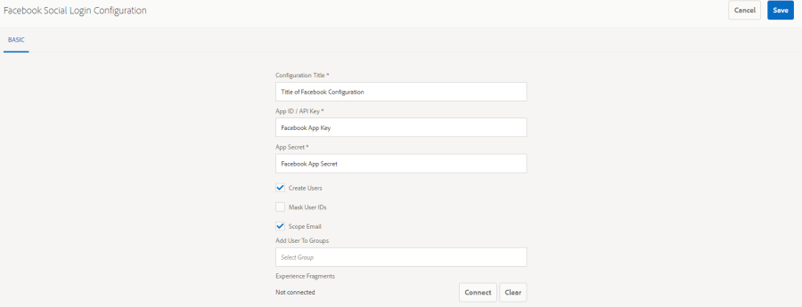

# Inicio de sesión social con Facebook y Twitter {#social-login-with-facebook-and-twitter}

El inicio de sesión en Social es la capacidad para presentar a un visitante del sitio la opción de iniciar sesión con su cuenta de Facebook o Twitter. Por lo tanto, incluya los datos permitidos de Facebook o Twitter en el perfil de miembros de su AEM.

## Información general de inicio de sesión social {#social-login-overview}

Para incluir el inicio de sesión social, es *necesario* crear aplicaciones personalizadas de Facebook y Twitter.

Aunque el ejemplo de venta minorista proporciona aplicaciones de Facebook y Twitter de muestra y servicios en la nube, no están disponibles en un [sitio web de producción](../../help/sites-administering/production-ready.md).

Los pasos necesarios son:

1. [Habilite la ](#adobe-granite-oauth-authentication-handler) autenticación OAuth en todas las instancias de publicación AEM.

   Sin OAuth habilitado, los intentos de inicio de sesión fallan.

1. **** Cree una aplicación social y un servicio en la nube.

   * Para admitir el inicio de sesión en Facebook:

      * Cree una [aplicación de Facebook](#create-a-facebook-app).
      * Cree y publique un [servicio de nube de Facebook Connect](#create-a-facebook-connect-cloud-service).
   * Para admitir el inicio de sesión en Twitter:

      * Cree una [aplicación de Twitter](#create-a-twitter-app).
      * Cree y publique un [servicio de nube de Twitter Connect](#create-a-twitter-connect-cloud-service).

1. [**** Habilita el ](#enable-social-login) inicio de sesión social para un sitio de comunidad.

Existen dos conceptos básicos:

1. **Ámbito**  (permisos) especifica los datos que la aplicación puede solicitar.

   * De forma predeterminada, las instancias de la aplicación y del proveedor [Adobe Granite OAuth de Facebook y Twitter incluyen los permisos básicos de la aplicación dentro de su ámbito.](#adobe-granite-oauth-application-and-provider)

1. **Fields** (params) especifica los datos reales solicitados mediante parámetros de URL.

   * Estos campos se especifican en [Proveedor de OAuth de Facebook](#aem-communities-facebook-oauth-provider) y [Proveedor de OAuth de AEM Communities Twitter](#aem-communities-twitter-oauth-provider).
   * Los campos predeterminados son suficientes para la mayoría de los casos de uso, pero se pueden modificar.

## Inicio de sesión en Facebook {#facebook-login}

### Versión de API de Facebook {#facebook-api-version}

El inicio de sesión social y la muestra de Facebook de venta minorista se desarrollaron cuando la API de gráfico de Facebook era la versión 1.0.
A partir de AEM 6.4 GA y AEM 6.3 SP1, el inicio de sesión social se actualizó para funcionar con la versión más reciente de la API de gráficos de Facebook 2.5.

>[!NOTE]
>
>Para versiones anteriores de AEM, si se encuentra con una excepción en los registros **No se puede extraer un token de esta**, actualice a la última CFP para esa versión AEM.

Para obtener información sobre la versión de la API de Facebook Graph, consulte el [registro de cambios de la API de Facebook](https://developers.facebook.com/docs/apps/changelog).

### Crear una aplicación de Facebook {#create-a-facebook-app}

Se requiere una aplicación de Facebook configurada correctamente para habilitar el inicio de sesión social en Facebook.

Para crear una aplicación de Facebook, siga las instrucciones de Facebook en [https://developers.facebook.com/apps/](https://developers.facebook.com/apps/). Los cambios en sus instrucciones no se reflejan en la siguiente información.

En general, desde la API de Facebook v2.7:

* *Añadir una nueva aplicación de Facebook*
   * Para *Plataforma*, elija Sitio web:
      * Para *URL del sitio*, introduzca `  https://<server>:<port>.`
      * Para *Nombre para mostrar*, escriba un título para utilizarlo como Título del servicio de conexión de Facebook.
      * Para *Categoría*, se recomienda elegir *Aplicaciones para páginas*, pero puede ser cualquier cosa.
      * *Añadir producto: Inicio de sesión en Facebook*
      * Para *URI de redirección de OAuth válidos*, introduzca `  https://<server>:<port>.`

>[!NOTE]
>
>Para el desarrollo, http://localhost:4503 funcionará.

Una vez creada la aplicación, localice la configuración **[!UICONTROL ID de la aplicación]** y **[!UICONTROL Secreto de la aplicación]**. Esta información es necesaria para configurar el [servicio de nube de Facebook](#createafacebookcloudservice).

### Crear un Cloud Service de Facebook Connect {#create-a-facebook-connect-cloud-service}

La instancia de [Proveedor y aplicación OAuth de Granite de Adobe](#adobe-granite-oauth-application-and-provider), creada mediante la creación de una configuración de servicio en la nube, identifica la aplicación de Facebook y los grupos de miembros a los que se agregan los nuevos usuarios.

1. En la instancia de creación de AEM, inicie sesión con privilegios de administrador.
1. En la navegación global, seleccione **[!UICONTROL Herramientas]** > **[!UICONTROL Cloud Services]** > **[!UICONTROL Configuración de inicio de sesión de Facebook Social]**.
1. Seleccione la configuración **[!UICONTROL ruta de contexto]**.

   **[!UICONTROL La ruta de]** contexto debe ser la misma que la ruta de configuración de la nube seleccionada al crear o editar un sitio de comunidad.

1. Compruebe si la ruta de contexto está habilitada para crear servicios en la nube debajo de ella.
1. Vaya a **[!UICONTROL Herramientas]** > **[!UICONTROL General]** > **[!UICONTROL Navegador de configuración]**. Seleccione el contexto y edite las propiedades. Habilite las configuraciones de nube si aún no están habilitadas.

   

   * Consulte la documentación de [Configuration Browser](/help/sites-administering/configurations.md) para obtener más información.

1. **Crear/** Editar configuración del servicio en la nube de Facebook.

   

   * **[!UICONTROL Título]**  (*obligatorio*) Escriba un título para mostrar que identifique la aplicación de Facebook. Se recomienda utilizar el mismo nombre introducido que *Nombre para mostrar* para la aplicación de Facebook.
   * **[!UICONTROL ID de aplicación/Clave]**  de API (*obligatoria*) Introduzca el  ***ID de*** aplicación para la aplicación de Facebook. Identifica la instancia de [Adobe Granite OAuth Application and Provider](https://helpx.adobe.com/experience-manager/6-3/communities/using/social-login.html#AdobeGraniteOAuthApplicationandProvider) creada a partir del cuadro de diálogo.
   * **[!UICONTROL Secreto]**  de la aplicación (*obligatorio*) Introduzca la  ***Secretaría de la aplicación*** para la aplicación de Facebook.
   * **[!UICONTROL Crear]** usuariosSi se activa, el inicio de sesión con una cuenta de Facebook creará una entrada de usuario AEM y la agregará como miembro a los grupos de usuarios seleccionados.  El valor predeterminado está marcado (se recomienda enfáticamente).
   * **[!UICONTROL Enmascarar ID de usuario]**: No se seleccione.
   * **[!UICONTROL Correo electrónico]** del ámbito: la ID de correo electrónico del usuario debe buscarse en Facebook.
   * **[!UICONTROL Añadir a]** grupos de usuarios seleccione Añadir grupo de usuarios para elegir uno o varios grupos  [de ](https://helpx.adobe.com/experience-manager/6-3/communities/using/users.html) miembros para el sitio de la comunidad al que se agregarán los usuarios.

   >[!NOTE]
   >
   >Los grupos pueden agregarse o eliminarse en cualquier momento. Sin embargo, las membresías de los usuarios existentes no se verán afectadas. La pertenencia automática solo se aplica a los usuarios nuevos que se crean después de esta actualización de campo. En Sitios donde los usuarios anónimos están deshabilitados, elija agregar usuarios al grupo de miembros de la comunidad correspondiente para ese sitio de comunidad cerrado.

   * Seleccione **[!UICONTROL GUARDAR]**.
   * **[!UICONTROL Publicación]**.

El resultado es una instancia de [Adobe Granite OAuth Application and Provider](https://helpx.adobe.com/experience-manager/6-3/communities/using/social-login.html#adobe-granite-oauth-application-and-provider) que no requiere ninguna modificación adicional a menos que se agreguen ámbitos (permisos) adicionales. El ámbito predeterminado son los permisos estándar para iniciar sesión en Facebook. Si se desea un ámbito adicional, es necesario editar la configuración OSGI directamente. Si se realizan modificaciones directamente a través del sistema o la consola, evite editar las configuraciones del servicio en la nube desde la IU táctil para evitar la sobrescritura.

### Proveedor de OAuth de Facebook de AEM Communities {#aem-communities-facebook-oauth-provider}

El proveedor de AEM Communities amplía la instancia de [Adobe Granite OAuth Application and Provider](#adobe-granite-oauth-application-and-provider).

Este proveedor necesitará editar para:

* Permitir actualizaciones de usuarios
* Añadir campos adicionales [dentro del ámbito](#adobe-granite-oauth-application-and-provider)

   * De forma predeterminada, no se incluyen todos los campos permitidos.

Si es necesario editar, en cada instancia de publicación AEM:

1. Inicie sesión con privilegios de administrador.
1. Vaya a la [Consola Web](../../help/sites-deploying/configuring-osgi.md). Por ejemplo, http://localhost:4503/system/console/configMgr.
1. Busque el proveedor de OAuth de Facebook de AEM Communities.
1. Seleccione el icono del lápiz para abrirlo y editarlo.

   

   * **[!UICONTROL ID de proveedor de OAuth]**

      (*Requerido*) El valor predeterminado es *soco -facebook*. No edite.

   * **[!UICONTROL Configuración de Cloud Service]**

      El valor predeterminado es `/etc/  cloudservices /  facebookconnect`. No edite.

   * **[!UICONTROL Configuración del servicio proveedor de OAuth]**

      El valor predeterminado es `/apps/social/facebookprovider/config/`. No edite.

   * **[!UICONTROL Habilitar etiquetas]**

      No editar.

   * **[!UICONTROL Ruta del usuario]**

      Ubicación en el repositorio donde se almacenan los datos del usuario. Para un sitio de comunidad, a fin de garantizar permisos para que los miembros realicen vistas entre sí, la ruta debe ser la */home/users/community* predeterminada.

   * **[!UICONTROL Habilitar campos]**

      Si se selecciona, los campos enumerados se especifican en la solicitud a Facebook para la autenticación y la información del usuario. El valor predeterminado no está seleccionado.

   * **[!UICONTROL Fields]**

      Cuando los campos están habilitados, se incluyen los siguientes campos al llamar a la API de gráficos de Facebook. Los campos deben permitirse dentro del ámbito definido en la configuración del servicio en la nube. Los campos adicionales pueden requerir la aprobación de Facebook. Consulte la sección Permisos de inicio de sesión de Facebook de la documentación de Facebook. Los campos predeterminados agregados como parámetros son:

      * id
      * name
      * first_name
      * last_name
      * link
      * locale
      * picture
      * timezone
      * update_time
      * verificado
      * correo electrónico

   Si se agrega o se cambia algún campo, actualice la configuración del controlador de sincronización predeterminada correspondiente para corregir la asignación.

   * **[!UICONTROL Actualizar usuario]**

      Si se selecciona, se actualizan los datos de usuario en el repositorio de cada inicio de sesión para reflejar los cambios de perfil o los datos adicionales solicitados. El valor predeterminado no está seleccionado.

#### Próximos pasos {#next-steps}

Los siguientes pasos son los mismos para Facebook y Twitter:

* [Publicar las configuraciones del servicio en la nube](#publishcloudservices)
* [Habilitar para un sitio de comunidad](#enable-social-login)

## Inicio de sesión en Twitter {#twitter-login}

### Crear una aplicación de Twitter {#create-a-twitter-app}

Se requiere una aplicación de Twitter configurada para habilitar el inicio de sesión social en Twitter.

Siga las instrucciones más recientes para crear una nueva aplicación de Twitter en [https://apps.twitter.com](https://apps.twitter.com/).

En general:

1. Escriba un *Nombre* que identifique la aplicación de Twitter con los usuarios del sitio Web.
1. Especificar una *Descripción*.
1. Para *sitio Web* - ingrese `https://<server>`.
1. Para *URL de llamada de retorno* - escriba `https://server`.

   >[!NOTE]
   >
   >No es necesario especificar el puerto.
   >
   >Para el desarrollo, https://127.0.0.1/ funcionará.

1. Una vez creada la aplicación, localice la clave **[!UICONTROL Consumidor (API)]** y **[!UICONTROL Secreto de consumidor (API)]**. Esta información será necesaria para configurar el [servicio de nube de Twitter](#createatwittercloudservice).

#### Permisos    {#permissions}

En la sección Permisos de la administración de aplicaciones de Twitter:

* **[!UICONTROL Acceso]**: Seleccione  `Read only`.

   * Otras opciones no son compatibles

* **[!UICONTROL Permisos]** adicionales: De forma opcional, elija  `Request email addresses from users`.

   * Si no se selecciona, el perfil del usuario en AEM no incluirá su dirección de correo electrónico.
   * Las instrucciones de Twitter indican pasos adicionales que deben seguirse.

La única solicitud de REST para inicio de sesión social es *[cuenta de GET/verificar credenciales](https://dev.twitter.com/rest/reference/get/account/verify_credentials)*.

### Crear un Cloud Service de Twitter Connect {#create-a-twitter-connect-cloud-service}

La instancia [Adobe Granite OAuth Application and Provider](#adobe-granite-oauth-application-and-provider), creada mediante la creación de una configuración de servicio en la nube, identifica la aplicación de Twitter y los grupos de miembros a los que se agregan los nuevos usuarios.

1. En la instancia de autor, inicie sesión con privilegios de administrador.
1. En la navegación global, seleccione **[!UICONTROL Herramientas]** > **[!UICONTROL Cloud Services]** > **[!UICONTROL Configuración de inicio de sesión de Twitter Social]**.
1. Elija la configuración **[!UICONTROL ruta de contexto]**.

   La ruta de contexto debe ser la misma que la ruta de configuración de la nube que seleccionó al crear o editar un sitio de comunidad.

1. Compruebe si la ruta de contexto está habilitada para crear servicios en la nube debajo de ella.
1. Vaya a **[!UICONTROL Herramientas]** > **[!UICONTROL General]** > **[!UICONTROL Navegador de configuración]**. Seleccione el contexto y edite las propiedades. Habilite las configuraciones de nube si aún no están habilitadas.

   

   * Consulte la documentación de [Configuration Browser](/help/sites-administering/configurations.md) para obtener más información.

1. Crear/editar la configuración del servicio en la nube de Twitter.

   

   * **[!UICONTROL Título]**

      (*Requerido*) Escriba un título de visualización que identifique la aplicación de Twitter. Se recomienda utilizar el mismo nombre introducido que *Nombre para mostrar* para la aplicación de Twitter.

   * **[!UICONTROL Clave de consumidor]**

      (*Requerido*) Introduzca la **Clave de consumidor (API)** para la aplicación de Twitter. Identifica la instancia de [Adobe Granite OAuth Application and Provider](https://helpx.adobe.com/experience-manager/6-3/communities/using/social-login.html#AdobeGraniteOAuthApplicationandProvider) creada a partir del cuadro de diálogo.

   * **[!UICONTROL Secreto del consumidor]**

      (*Requerido*) Introduzca el ***Secreto de Consumidor (API)*** para la aplicación de Twitter.

   * **[!UICONTROL Crear usuarios]**

      Si se selecciona, el inicio de sesión con una cuenta de Twitter creará una entrada de usuario AEM y la agregará como miembro a los grupos de usuarios seleccionados. El valor predeterminado está marcado (se recomienda enfáticamente).

   * **[!UICONTROL Enmascarar los ID de usuario]**

      No se seleccione.

   * **[!UICONTROL Añadir a los grupos de usuarios]**

      Seleccione Añadir grupo de usuarios para elegir uno o varios [grupos de miembros](https://helpx.adobe.com/experience-manager/6-3/communities/using/users.html) para el sitio de la comunidad al que se agregarán los usuarios.
   >[!NOTE]
   >
   >Los grupos pueden agregarse o eliminarse en cualquier momento. Pero la pertenencia de los usuarios existentes no se verá afectada. La pertenencia automática solo se aplica a los usuarios nuevos que se crean después de esta actualización de campo. En Sitios donde los usuarios anónimos están deshabilitados, agregue usuarios al grupo de miembros de la comunidad correspondiente que se dirija a ese sitio de comunidad cerrado.

1. Seleccione **[!UICONTROL GUARDAR]** y **[!UICONTROL Publicar]**.

El resultado es una instancia de [Adobe Granite OAuth Application and Provider](https://helpx.adobe.com/experience-manager/6-3/communities/using/social-login.html#adobe-granite-oauth-application-and-provider) que no requiere ninguna modificación adicional. El ámbito predeterminado son los permisos estándar para iniciar sesión en Twitter.

### Proveedor de OAuth de Twitter de AEM Communities {#aem-communities-twitter-oauth-provider}

La configuración de AEM Communities amplía la instancia de [Adobe Granite OAuth Application and Provider](#adobe-granite-oauth-application-and-provider). Este proveedor requerirá de edición para permitir las actualizaciones del usuario.

Si es necesario editar, en cada instancia de publicación AEM:

1. Inicie sesión con privilegios de administrador.
1. Vaya a la [Consola Web](../../help/sites-deploying/configuring-osgi.md).

   Por ejemplo, http://localhost:4503/system/console/configMgr.

1. Busque el proveedor de OAuth de Twitter de AEM Communities.
1. Seleccione el icono del lápiz para abrirlo y editarlo.

   

   * **[!UICONTROL ID de proveedor de OAuth]**

   (*Requerido*) El valor predeterminado es *soco -twitter*. No edite.

   * **[!UICONTROL Configuración de Cloud Service]**

      El valor predeterminado es *conf.* No edite.

   * **[!UICONTROL Configuración del servicio proveedor de OAuth]**

      El valor predeterminado es `/apps/social/twitterprovider/config/`. No edite.

   * **[!UICONTROL Ruta del usuario]**

      Ubicación en el repositorio donde se almacenan los datos del usuario. Para que un sitio de comunidad tenga permisos para que los miembros puedan vista en el perfil de los demás, la ruta debe ser la predeterminada `/home/users/community`.

   * **[!UICONTROL Activar]** parámetros no editar
   * **[!UICONTROL Los]** parámetros de URL no se editan
   * **[!UICONTROL Actualizar usuario]**

      Si se selecciona, se actualizan los datos de usuario en el repositorio de cada inicio de sesión para reflejar los cambios de perfil o los datos adicionales solicitados. El valor predeterminado no está seleccionado.

#### Próximos pasos {#next-steps-1}

Los siguientes pasos son los mismos para Facebook y Twitter:

* [Publicar las configuraciones del servicio en la nube](#publishcloudservices)
* [Habilitar para un sitio de comunidad](#enable-social-login)

## Habilitar inicio de sesión social {#enable-social-login}

### Consola Sitios de AEM Communities {#aem-communities-sites-console}

Una vez configurado un servicio en la nube, puede habilitarse para la configuración de inicio de sesión social correspondiente para un sitio de la comunidad mediante el subpanel [Administración de usuarios](https://helpx.adobe.com/experience-manager/6-3/communities/using/sites-console.html#USERMANAGEMENT) Configuración durante la creación del sitio de la comunidad  o [administración](https://helpx.adobe.com/experience-manager/6-3/communities/using/sites-console.html#ModifyingSiteProperties).

1. Elija el contexto de configuración del sitio en el que guardó las configuraciones de inicio de sesión social.

1. En la ficha General, establezca las configuraciones de nube.

   

1. En la ficha Configuración, habilite **[!UICONTROL Inicios de sesión sociales]** y Guardar.

   

## Inicio de sesión de Test Social {#test-social-login}

* Asegúrese de que el [controlador de autenticación OAuth Granite de Adobe](#adobe-granite-oauth-authentication-handler) esté habilitado en todas las instancias de publicación.
* Asegúrese de que se han publicado los servicios en la nube.
* Asegúrese de que el sitio de la comunidad se haya publicado.
* Inicie el sitio publicado en un explorador.
Por ejemplo, http://localhost:4503/content/sites/engage/en.html
* Seleccione **[!UICONTROL Iniciar sesión]**.
* Seleccione **[!UICONTROL Iniciar sesión con Facebook]** o **[!UICONTROL Iniciar sesión con Twitter]**.
* Si aún no ha iniciado sesión en Facebook o Twitter, inicie sesión con las credenciales correspondientes.
* Puede que sea necesario conceder permisos en función del cuadro de diálogo que muestre la aplicación de Facebook o Twitter.
* Observe que la barra de herramientas situada en la parte superior de la página se actualiza para reflejar el inicio de sesión correcto.
* Seleccione **[!UICONTROL Perfil]**: la página Perfil muestra la imagen del avatar, el nombre y los apellidos del usuario. También muestra la información del perfil de Facebook o Twitter según los campos o parámetros permitidos.

## Configuraciones de OAuth de la Plataforma AEM {#aem-platform-oauth-configurations}

### Controlador de autenticación OAuth de granito de Adobe {#adobe-granite-oauth-authentication-handler}

El `Adobe Granite OAuth Authentication Handler` no está habilitado de forma predeterminada y ***debe estar habilitado en todas las instancias de publicación AEM.***

Para habilitar el controlador de autenticación en la publicación, simplemente abra la configuración OSGi y guárdela:

* Inicie sesión con privilegios de administrador.
* Vaya a la [Consola Web](../../help/sites-deploying/configuring-osgi.md).
Por ejemplo, http://localhost:4503/system/console/configMgr
* Localice `Adobe Granite OAuth Authentication Handler`.
* Seleccione esta opción para abrir la configuración y editarla.
* Seleccione **[!UICONTROL Guardar]**.

>[!CAUTION]
>
>Tenga cuidado de no confundir el controlador de autenticación con una instancia de Facebook o Twitter de *Proveedor y aplicación OAuth de Adobe Granite*.

### Adobe Granite OAuth Application and Provider {#adobe-granite-oauth-application-and-provider}

Cuando se crea un servicio en la nube para Facebook o Twitter, se crea una instancia de `Adobe Granite OAuth Authentication Handler`.

Para localizar la instancia creada para una aplicación de Facebook o Twitter:

1. Inicie sesión con privilegios de administrador.
1. Vaya a la [Consola Web](../../help/sites-deploying/configuring-osgi.md).

   Por ejemplo, http://localhost:4503/system/console/configMgr.

1. Localice la aplicación y el proveedor de Adobe Granite OAuth.

   * Busque la instancia donde **[!UICONTROL ID de cliente]** coincide con el **[!UICONTROL ID de aplicación]**.

      

      Salvo las siguientes propiedades, no modifique las demás propiedades de la configuración:

   * **[!UICONTROL Id. de configuración]**

      (*Requeridos*) Los ID de configuración de OAuth deben ser únicos. Se genera automáticamente cuando se crea el servicio en la nube.

   * **[!UICONTROL ID del cliente]**

      (*Requerido*) El ID de aplicación proporcionado cuando se creó el servicio en la nube.

   * **[!UICONTROL Secreto del cliente]**

      (*Requerido*) El secreto de aplicación proporcionado cuando se creó el servicio en la nube.

   * **[!UICONTROL Ámbito]**

      (*Opcional*) Se puede solicitar al proveedor un ámbito adicional para lo que se permite. El ámbito predeterminado cubre los permisos necesarios para proporcionar autenticación social y datos de perfil.

   * **[!UICONTROL ID del proveedor]**

      (*Requerido*) El ID de proveedor para AEM Communities se establece cuando se creó el servicio en la nube. No edite. Para Facebook Connect, el valor es *soco -facebook*. Para Twitter Connect, el valor es *soco -twitter*.

   * **[!UICONTROL Grupos]**

      (*Recomendado*) Se agregan uno o más grupos de miembros a los que se han creado usuarios. Para AEM Communities, se recomienda realizar la lista del grupo de miembros para el sitio de la comunidad.

   * **[!UICONTROL URL de llamada de retorno]**

      (*Opcional*) URL configurada con los proveedores de OAuth para redireccionar al cliente. Utilice una dirección URL relativa para utilizar el host de la solicitud original. Deje vacío para utilizar la dirección URL solicitada originalmente. El sufijo &quot;/callback/j_security_check&quot; se anexa automáticamente a esta dirección URL.
   >[!NOTE]
   >
   >El dominio de la llamada de retorno debe estar registrado en el proveedor (Facebook o Twitter).

Para cada configuración del controlador de autenticación OAuth, hay dos configuraciones adicionales creadas en la instancia:

* Controlador de sincronización predeterminado Apache Jackrabbit Oak (org.apache.jackrabbit.oak.spi.security.authentication.external.impl.DefaultSyncHandler): no se requieren modificaciones allí, pero puede ver las asignaciones de campo de usuario cómo se asignan los campos de Facebook a un nodo de perfil de usuario de CQ. También observe que &#39;Nombre del controlador de sincronización&#39; coincide con el identificador de configuración de la configuración del proveedor de OAuth.
* Módulo de inicio de sesión externo Apache Jackrabbit Oak (org.apache.jackrabbit.oak.spi.security.authentication.external.impl.ExternalLoginModuleFactory) - Aquí no se requieren ediciones, pero puede que observe que &#39;Nombre de proveedor de identidad&#39; y &#39;Nombre del controlador de sincronización&#39; son iguales y apuntan a las configuraciones correspondientes de OAuth y controlador de sincronización respectivamente.

Para obtener más información, consulte [Autenticación con Apache Oak External Login Module](https://jackrabbit.apache.org/oak/docs/security/authentication/externalloginmodule.html).

## Rendimiento de recorrido del usuario de OAuth {#oauth-user-traversal-performance}

Para los sitios de la comunidad que ven que cientos de miles de usuarios se registran usando su inicio de sesión en Facebook o Twitter, el rendimiento transversal de la consulta realizada cuando un visitante del sitio utiliza su inicio de sesión social se puede mejorar agregando el siguiente índice Oak.

Si se ven advertencias transversales en los registros, se recomienda agregar este índice.

En una instancia de autor, ha iniciado sesión con privilegios administrativos:

1. Desde la navegación global: seleccione **Herramientas, [CRX/DE Lite](../../help/sites-developing/developing-with-crxde-lite.md).**
1. Cree un índice denominado ntBaseLucene-oauth a partir de una copia de ntBaseLucene:

   * En el nodo `/oak:index`
   * Seleccionar nodo `ntBaseLucene`
   * Seleccione **[!UICONTROL Copiar]**
   * Seleccione `/oak:index`
   * Seleccione **[!UICONTROL Pegar]**
   * Cambiar el nombre de la copia de ntBaseLucene a `ntBaseLucene-oauth`

1. Modifique las propiedades del nodo ntBaseLucene-oauth:

   * **[!UICONTROL indexPath]**:  `/oak:index/ntBaseLucene-oauth`
   * **[!UICONTROL name]**: `oauthid-123****`
   * **[!UICONTROL reindexar]**:  `true`
   * **[!UICONTROL reindexCount]**:  `1`

1. Bajo el nodo /oak:index/ntBaseLucene-oauth/indexRules/nt:base/properties:

   * Elimine todos los nodos secundarios, excepto cqTags.
   * Cambiar el nombre de cqTags a `oauthid-123****`
   * Modificar las propiedades del nodo `oauthid-123****`

      * **[!UICONTROL name]**:  `oauthid-123****`
   * Seleccione **[!UICONTROL Guardar todo]**.

* Para el **nombre** `oauthid-123`, reemplace *123* por la ***ID de la aplicación*** o la clave ***de consumo (API) de Twitter*** que es el valor del **ID del cliente** en el Adobe &lt;a111/>Configuración de Granite OAuth Application y Provider](social-login.md#adobe-granite-oauth-application-and-provider).[

   

Para obtener información y herramientas adicionales, consulte [Consultas e indexación de roble](../../help/sites-deploying/queries-and-indexing.md).

## Configuración del despachante {#dispatcher-configuration}

Consulte [Configuración de Dispatcher para Comunidades](dispatcher.md).
