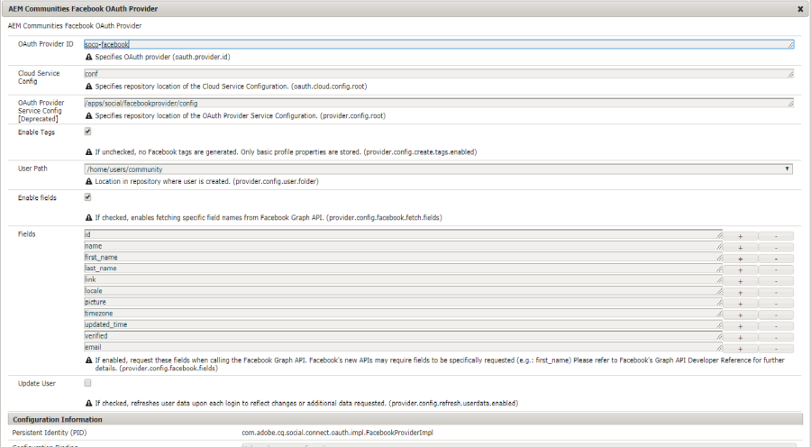

# Inicio de sesión social con Facebook y Twitter {#social-login-with-facebook-and-twitter}

El inicio de sesión social es la capacidad de presentar a un visitante del sitio la opción de iniciar sesión con su cuenta de Facebook o Twitter. Por lo tanto, incluye los datos de Facebook o Twitter AEM permitidos en su perfil de miembro de la.

## Información general de inicio de sesión social {#social-login-overview}

Para incluir el inicio de sesión social, es *obligatorio* para crear aplicaciones personalizadas de Facebook y Twitter.

Aunque el ejemplo de We-Retail proporciona aplicaciones de Facebook y Twitter de ejemplo y servicios en la nube, no están disponibles en un [sitio web de producción](../../help/sites-administering/production-ready.md).

Los pasos necesarios son:

1. [Habilitar la autenticación OAuth](#adobe-granite-oauth-authentication-handler) AEM en todas las instancias de publicación de la.

   Sin OAuth habilitado, no se puede iniciar sesión.

1. **Crear** una aplicación social y un servicio en la nube.

   * Para admitir el inicio de sesión con Facebook:

      * Crear un [aplicación de facebook](#create-a-facebook-app).
      * Creación y publicación de un [Facebook Connect Cloud Service](#create-a-facebook-connect-cloud-service).
   * Para admitir el inicio de sesión con Twitter:

      * Crear un [aplicación de twitter](#create-a-twitter-app).
      * Creación y publicación de un [Twitter Connect Cloud Service](#create-a-twitter-connect-cloud-service).

1. [**Activar** inicio de sesión social](#enable-social-login) para un sitio de la comunidad.

Hay dos conceptos básicos:

1. **Ámbito** (permisos) especifica los datos que la aplicación puede solicitar.

   * FACEBOOK y TWITTER [Adobe Granite Aplicación y proveedor de OAuth](#adobe-granite-oauth-application-and-provider) de forma predeterminada, incluyen los permisos básicos de la aplicación dentro de su ámbito.

1. **Campos** (parámetros) especifica los datos reales solicitados mediante parámetros de URL.

   * Estos campos se especifican en [Proveedor OAuth de AEM Communities Facebook](#aem-communities-facebook-oauth-provider) y [Proveedor OAuth de AEM Communities Twitter](#aem-communities-twitter-oauth-provider).
   * Los campos predeterminados son suficientes para la mayoría de los casos de uso, pero se pueden modificar.

## Inicio de sesión de facebook {#facebook-login}

### Versión de API de facebook {#facebook-api-version}

El inicio de sesión social y la muestra de Facebook we-retail se desarrollaron cuando la API de Facebook Graph era la versión 1.0. AEM AEM A partir de la versión 6.4, el inicio de sesión social de GA y la versión 6.3 SP1 de se actualizó para funcionar con la versión más reciente de la API 2.5 de Facebook Graph.

>[!NOTE]
>
>AEM Para versiones anteriores de la, si se encuentra con una excepción en los registros de **No se puede extraer un token de esto** AEM , actualice a la última versión del CFP para esa versión de la.

Para obtener información sobre la versión de la API de Facebook Graph, consulte la [ChangeLog de API de facebook](https://developers.facebook.com/docs/apps/changelog).

### Crear una aplicación de Facebook {#create-a-facebook-app}

Se necesita una aplicación de Facebook correctamente configurada para habilitar el inicio de sesión social de Facebook.

Para crear una aplicación de Facebook, siga las instrucciones de Facebook en [https://developers.facebook.com/apps/](https://developers.facebook.com/apps/). Los cambios en sus instrucciones no se reflejan en la siguiente información.

En general, a partir de la API de Facebook v2.7:

* *Agregar nueva aplicación de Facebook*
   * Para *Plataforma*, elija Sitio web:
      * Para *URL del sitio*, introduzca `  https://<server>:<port>.`
      * Para *Nombre para mostrar*, introduzca un título para utilizarlo como Título del servicio de Facebook connect.
      * Para *Categoría*, se recomienda elegir *Aplicaciones para páginas*, pero puede ser cualquier cosa.
      * *Añadir producto: inicio de sesión en Facebook*
      * Para *URI de redireccionamiento de OAuth válidos*, introduzca `  https://<server>:<port>.`

>[!NOTE]
>
>Para el desarrollo, http://localhost:4503 funcionará.

Una vez creada la aplicación, busque **[!UICONTROL ID de aplicación]** y **[!UICONTROL Secreto de aplicación]** configuración. Esta información es necesaria para configurar el [Facebook Cloud Service](#createafacebookcloudservice).

### Creación de un Cloud Service de Facebook Connect {#create-a-facebook-connect-cloud-service}

El [Adobe Granite Aplicación y proveedor de OAuth](#adobe-granite-oauth-application-and-provider) La instancia de, que se crea creando una configuración de servicio en la nube, identifica la aplicación de Facebook y los grupos de miembros a los que se agregan los nuevos usuarios.

1. AEM En la instancia de autor de la, inicie sesión con privilegios de administrador.
1. En la navegación global, seleccione **[!UICONTROL Herramientas]** > **[!UICONTROL Cloud Services]** > **[!UICONTROL Configuración del inicio de sesión social de facebook]**.
1. Seleccione la configuración **[!UICONTROL ruta de contexto]**.

   **[!UICONTROL Ruta de contexto]** debe ser la misma que la ruta de configuración de nube seleccionada al crear o editar un sitio de la comunidad.

1. Compruebe si la ruta de contexto está habilitada para crear servicios en la nube debajo de ella.
1. Ir a **[!UICONTROL Herramientas]** > **[!UICONTROL General]** > **[!UICONTROL Explorador de configuración]**. Seleccione el contexto y edite las propiedades. Habilite Configuraciones en la nube si aún no está habilitado.

   

   * Consulte la documentación del [Explorador de configuración](/help/sites-administering/configurations.md) para obtener más información.

1. **Crear/editar** Configuración del servicio de nube facebook.

   

   * **[!UICONTROL Título]** (*Requerido*) Escriba un título que identifique la aplicación de Facebook. Se recomienda utilizar el mismo nombre introducido como *Nombre para mostrar* para la aplicación de Facebook.
   * **[!UICONTROL ID de aplicación/Clave API]** (*Requerido*) Introduzca la ***ID de aplicación*** para la aplicación de Facebook. Esto identifica el [Adobe Granite Aplicación y proveedor de OAuth](https://helpx.adobe.com/experience-manager/6-3/communities/using/social-login.html#AdobeGraniteOAuthApplicationandProvider) instancia creada desde el cuadro de diálogo.
   * **[!UICONTROL Secreto de aplicación]** (*Requerido*) Introduzca la ***Secreto de aplicación*** para la aplicación de Facebook.
   * **[!UICONTROL Crear usuarios]** Si se selecciona, al iniciar sesión con una cuenta de Facebook AEM se creará una entrada de usuario de y se agregarán como miembros al grupo de usuarios seleccionado.  La opción predeterminada está activada (recomendado).
   * **[!UICONTROL Enmascarar ID de usuario]**: dejar sin seleccionar.
   * **[!UICONTROL Correo electrónico de ámbito]**: el id de correo electrónico del usuario debe recuperarse de Facebook.
   * **[!UICONTROL Añadir a grupos de usuarios]** seleccione Agregar grupo de usuarios para elegir uno o más [grupos de miembros](https://helpx.adobe.com/experience-manager/6-3/communities/using/users.html) para el sitio de la comunidad al que se agregarán usuarios.

   >[!NOTE]
   >
   >Los grupos se pueden agregar o eliminar en cualquier momento. Sin embargo, las suscripciones de los usuarios existentes no se verán afectadas. La pertenencia automática solo se aplica a los nuevos usuarios que se crean después de esta actualización de campo. Para los sitios en los que los usuarios anónimos están deshabilitados, elija agregar usuarios al grupo de miembros de la comunidad correspondiente destinado a ese sitio de comunidad cerrado.

   * Seleccionar **[!UICONTROL GUARDAR]**.
   * **[!UICONTROL Publicación]**.

El resultado es un [Adobe Granite Aplicación y proveedor de OAuth](https://helpx.adobe.com/experience-manager/6-3/communities/using/social-login.html#adobe-granite-oauth-application-and-provider) que no requiere ninguna modificación adicional a menos que se agregue un ámbito adicional (permisos). El ámbito predeterminado son los permisos estándar para el inicio de sesión de Facebook. Si desea un ámbito adicional, es necesario editar la configuración de OSGI directamente. Si hay modificaciones realizadas directamente a través del sistema o la consola, evite editar las configuraciones del servicio en la nube desde la interfaz de usuario táctil para evitar sobrescribirlas.

### Proveedor OAuth de AEM Communities Facebook {#aem-communities-facebook-oauth-provider}

El proveedor de AEM Communities amplía el [Adobe Granite Aplicación y proveedor de OAuth](#adobe-granite-oauth-application-and-provider) ejemplo.

Se debe editar este proveedor para:

* Permitir actualizaciones de usuario
* Añadir campos adicionales [dentro del ámbito](#adobe-granite-oauth-application-and-provider)

   * No todos los campos permitidos de forma predeterminada se incluyen de forma predeterminada.

AEM Si es necesario editar, en cada instancia de publicación de la:

1. Iniciar sesión con privilegios de administrador.
1. Vaya a [Consola web](../../help/sites-deploying/configuring-osgi.md). Por ejemplo, http://localhost:4503/system/console/configMgr.
1. Busque el proveedor de OAuth de AEM Communities Facebook.
1. Seleccione el icono de lápiz que desea abrir para editarlo.

   

   * **[!UICONTROL Identificador de proveedor de OAuth]**

      (*Requerido*) El valor predeterminado es *soco -facebook*. No editar.

   * **[!UICONTROL Configuración del Cloud Service]**

      El valor predeterminado es `/etc/  cloudservices /  facebookconnect`. No editar.

   * **[!UICONTROL Configuración del servicio de proveedor de OAuth]**

      El valor predeterminado es `/apps/social/facebookprovider/config/`. No editar.

   * **[!UICONTROL Habilitar etiquetas]**

      No editar.

   * **[!UICONTROL Ruta de usuario]**

      Ubicación en el repositorio donde se almacenan los datos de usuario. En el caso de un sitio de la comunidad, para garantizar que los miembros tengan permisos para ver el perfil de los demás, la ruta debe ser la predeterminada */home/users/community*.

   * **[!UICONTROL Habilitar campos]**

      Si se selecciona, los campos enumerados se especifican en la solicitud a Facebook para la autenticación y la información del usuario. La opción predeterminada no está seleccionada.

   * **[!UICONTROL Campos]**

      Cuando los campos están activados, se incluyen los siguientes campos al llamar a la API de Facebook Graph. Los campos deben permitirse dentro del ámbito definido en la configuración del servicio en la nube. Es posible que los campos adicionales requieran la aprobación de Facebook. Consulte la sección Permisos de inicio de sesión de Facebook en la documentación de Facebook. Los campos predeterminados agregados como parámetros son los siguientes:

      * id
      * name
      * first_name
      * last_name
      * vincular
      * locale
      * retratar
      * timezone
      * updated_time
      * verificado
      * email

   Si se agrega o cambia algún campo, actualice la configuración del controlador de sincronización predeterminada correspondiente para corregir la asignación.

   * **[!UICONTROL Actualizar usuario]**

      Si se selecciona, actualiza los datos de usuario en el repositorio en cada inicio de sesión para reflejar los cambios de perfil o los datos adicionales solicitados. La opción predeterminada no está seleccionada.

#### Pasos siguientes {#next-steps}

Los siguientes pasos son los mismos para Facebook y Twitter:

* [Publicar las configuraciones del servicio en la nube](#publishcloudservices)
* [Habilitar para un sitio de la comunidad](#enable-social-login)

## Inicio de sesión de twitter {#twitter-login}

### Crear una aplicación de Twitter {#create-a-twitter-app}

Se requiere una aplicación de Twitter configurada para habilitar el inicio de sesión social de Twitter.

Siga las instrucciones más recientes para crear una nueva aplicación de Twitter en [https://apps.twitter.com](https://apps.twitter.com/).

En general:

1. Introduzca una *Nombre* que identificará la aplicación de Twitter para los usuarios del sitio web.
1. Introduzca una *Descripción*.
1. Para *sitio web* - introducir `https://<server>`.
1. Para *URL de devolución de llamada* - introducir `https://server`.

   >[!NOTE]
   >
   >No es necesario especificar el puerto.
   >
   >Para el desarrollo, https://127.0.0.1/ funcionará.

1. Una vez creada la aplicación, busque **[!UICONTROL Clave de consumidor (API)]** y **[!UICONTROL Secreto de consumidor (API)]**. Esta información será necesaria para configurar el [Twitter Cloud Service](#createatwittercloudservice).

#### Permisos {#permissions}

En la sección de permisos de la administración de aplicaciones de Twitter:

* **[!UICONTROL Acceso]**: Seleccionar `Read only`.

   * Otras opciones no son compatibles

* **[!UICONTROL Permisos adicionales]**: opcionalmente, seleccione `Request email addresses from users`.

   * AEM Si no se selecciona, el perfil de usuario en la lista de direcciones no incluirá su dirección de correo electrónico.
   * Las instrucciones de twitter indican pasos adicionales que debe seguir.

La única solicitud de REST para el inicio de sesión social es *[GET de cuenta/verificación de credenciales](https://dev.twitter.com/rest/reference/get/account/verify_credentials)*.

### Creación de un Cloud Service de Twitter Connect {#create-a-twitter-connect-cloud-service}

El [Adobe Granite Aplicación y proveedor de OAuth](#adobe-granite-oauth-application-and-provider) La instancia de, que se crea creando una configuración de servicio en la nube, identifica la aplicación de Twitter y los grupos de miembros a los que se agregan los nuevos usuarios.

1. En la instancia de autor, inicie sesión con privilegios de administrador.
1. En la navegación global, seleccione **[!UICONTROL Herramientas]** > **[!UICONTROL Cloud Services]** > **[!UICONTROL Configuración del inicio de sesión social de twitter]**.
1. Elija la **[!UICONTROL ruta de contexto]** configuración.

   La ruta de contexto debe ser la misma que la ruta de configuración de nube seleccionada al crear o editar un sitio de la comunidad.

1. Compruebe si la ruta de contexto está habilitada para crear servicios en la nube debajo de ella.
1. Ir a **[!UICONTROL Herramientas]** > **[!UICONTROL General]** > **[!UICONTROL Explorador de configuración]**. Seleccione el contexto y edite las propiedades. Habilite Configuraciones en la nube si aún no está habilitado.

   

   * Consulte la documentación del [Explorador de configuración](/help/sites-administering/configurations.md) para obtener más información.

1. Cree o edite la configuración del servicio en la nube de Twitter.

   

   * **[!UICONTROL Título]**

      (*Requerido*) Escriba un título que identifique la aplicación de Twitter. Se recomienda utilizar el mismo nombre introducido como *Nombre para mostrar* para la aplicación de Twitter.

   * **[!UICONTROL Clave de consumidor]**

      (*Requerido*) Introduzca la **Clave de consumidor (API)** para la aplicación de Twitter. Esto identifica el [Adobe Granite Aplicación y proveedor de OAuth](https://helpx.adobe.com/experience-manager/6-3/communities/using/social-login.html#AdobeGraniteOAuthApplicationandProvider) instancia creada desde el cuadro de diálogo.

   * **[!UICONTROL Secreto del consumidor]**

      (*Requerido*) Introduzca la ***Secreto de consumidor (API)*** para la aplicación de Twitter.

   * **[!UICONTROL Crear usuarios]**

      Si se selecciona, al iniciar sesión con una cuenta de Twitter AEM se creará una entrada de usuario de y se agregarán como miembros al grupo de usuarios seleccionado. La opción predeterminada está activada (recomendado).

   * **[!UICONTROL Enmascarar los ID de usuario]**

      Dejar sin seleccionar.

   * **[!UICONTROL Añadir a los grupos de usuarios]**

      Seleccione Agregar grupo de usuarios para elegir uno o más [grupos de miembros](https://helpx.adobe.com/experience-manager/6-3/communities/using/users.html) para el sitio de la comunidad al que se agregarán usuarios.
   >[!NOTE]
   >
   >Los grupos se pueden agregar o eliminar en cualquier momento. Sin embargo, las suscripciones de los usuarios existentes no se verán afectadas. La pertenencia automática solo se aplica a los nuevos usuarios que se crean después de esta actualización de campo. En los sitios en los que los usuarios anónimos están deshabilitados, agregue usuarios al grupo de miembros de la comunidad correspondiente destinado a ese sitio de comunidad cerrado.

1. Seleccionar **[!UICONTROL GUARDAR]** y **[!UICONTROL Publish]**.

El resultado es un [Adobe Granite Aplicación y proveedor de OAuth](https://helpx.adobe.com/experience-manager/6-3/communities/using/social-login.html#adobe-granite-oauth-application-and-provider) instancia que no requiere ninguna modificación adicional. El ámbito predeterminado son los permisos estándar para el inicio de sesión de Twitter.

### Proveedor OAuth de AEM Communities Twitter {#aem-communities-twitter-oauth-provider}

La configuración de AEM Communities amplía el [Adobe Granite Aplicación y proveedor de OAuth](#adobe-granite-oauth-application-and-provider) ejemplo. Se debe editar este proveedor para permitir las actualizaciones del usuario.

AEM Si es necesario editar, en cada instancia de publicación de la:

1. Iniciar sesión con privilegios de administrador.
1. Vaya a [Consola web](../../help/sites-deploying/configuring-osgi.md).

   Por ejemplo, http://localhost:4503/system/console/configMgr.

1. Busque el proveedor de OAuth de AEM Communities Twitter.
1. Seleccione el icono de lápiz que desea abrir para editarlo.

   

   * **[!UICONTROL Identificador de proveedor de OAuth]**

   (*Requerido*) El valor predeterminado es *soco -twitter*. No editar.

   * **[!UICONTROL Configuración del Cloud Service]**

      El valor predeterminado es *conf.* No editar.

   * **[!UICONTROL Configuración del servicio de proveedor de OAuth]**

      El valor predeterminado es `/apps/social/twitterprovider/config/`. No editar.

   * **[!UICONTROL Ruta de usuario]**

      Ubicación en el repositorio donde se almacenan los datos de usuario. En el caso de un sitio de la comunidad, para garantizar que los miembros tengan permisos para ver el perfil de los demás, la ruta debe ser la predeterminada `/home/users/community`.

   * **[!UICONTROL Activar parámetros]** no editar
   * **[!UICONTROL Parámetros de URL]** no editar
   * **[!UICONTROL Actualizar usuario]**

      Si se selecciona, actualiza los datos de usuario en el repositorio en cada inicio de sesión para reflejar los cambios de perfil o los datos adicionales solicitados. La opción predeterminada no está seleccionada.

#### Pasos siguientes {#next-steps-1}

Los siguientes pasos son los mismos para Facebook y Twitter:

* [Publicar las configuraciones del servicio en la nube](#publishcloudservices)
* [Habilitar para un sitio de la comunidad](#enable-social-login)

## Habilitar inicio de sesión social {#enable-social-login}

### Consola de AEM Communities Sites {#aem-communities-sites-console}

Una vez configurado un servicio en la nube, puede habilitarse para la configuración de inicio de sesión social correspondiente en un sitio de la comunidad mediante [Administración de usuarios](https://helpx.adobe.com/experience-manager/6-3/communities/using/sites-console.html#USERMANAGEMENT) Subpanel Configuración durante el sitio de la comunidad [creación](https://helpx.adobe.com/experience-manager/6-3/communities/using/sites-console.html#SiteCreation) o [administración](https://helpx.adobe.com/experience-manager/6-3/communities/using/sites-console.html#ModifyingSiteProperties).

1. Elija el contexto de configuración del sitio en el que guardó las configuraciones de inicio de sesión social.

1. En la pestaña General, establezca las configuraciones de nube.

   

1. En la pestaña Configuración, habilite **[!UICONTROL Inicios de sesión sociales]** y Guardar.

   

## Probar inicio de sesión social {#test-social-login}

* Asegurar [Controlador de autenticación OAuth de Adobe Granite](#adobe-granite-oauth-authentication-handler) se ha habilitado en todas las instancias de publicación.
* Asegúrese de que se han publicado los servicios en la nube.
* Asegúrese de que se ha publicado el sitio de la comunidad.
* Inicie el sitio publicado en un explorador.
Por ejemplo, http://localhost:4503/content/sites/engage/en.html
* Seleccionar **[!UICONTROL Iniciar sesión]**.
* Seleccione una de las opciones **[!UICONTROL Iniciar sesión con Facebook]** o **[!UICONTROL Iniciar sesión con Twitter]**.
* Si aún no ha iniciado sesión en Facebook o Twitter, inicie sesión con las credenciales adecuadas.
* Puede que sea necesario conceder el permiso según el cuadro de diálogo que muestre la aplicación de Facebook o Twitter.
* Tenga en cuenta que la barra de herramientas situada en la parte superior de la página se actualiza para reflejar el inicio de sesión correcto.
* Seleccionar **[!UICONTROL Perfil]**: la página Perfil muestra la imagen de avatar del usuario, su nombre y apellidos. También muestra la información del perfil de Facebook o Twitter según los campos o parámetros permitidos.

## AEM Configuraciones de OAuth de plataforma {#aem-platform-oauth-configurations}

### Controlador de autenticación OAuth de Adobe Granite {#adobe-granite-oauth-authentication-handler}

El `Adobe Granite OAuth Authentication Handler` no está activada de forma predeterminada y ***AEM debe estar habilitado en todas las instancias de publicación de la.***

Para habilitar el controlador de autenticación en la publicación, simplemente abra la configuración OSGi y guárdela:

* Iniciar sesión con privilegios de administrador.
* Vaya a [Consola web](../../help/sites-deploying/configuring-osgi.md).
Por ejemplo, http://localhost:4503/system/console/configMgr
* Localizar `Adobe Granite OAuth Authentication Handler`.
* Seleccione para abrir la configuración y editarla.
* Seleccione **[!UICONTROL Guardar]**.

>[!CAUTION]
>
>Tenga cuidado de no confundir el controlador de autenticación con una instancia de Facebook o Twitter de *Adobe Granite Aplicación y proveedor de OAuth*.

### Adobe Granite Aplicación y proveedor de OAuth {#adobe-granite-oauth-application-and-provider}

Cuando se crea un servicio en la nube para Facebook o Twitter, se crea una instancia de `Adobe Granite OAuth Authentication Handler` se ha creado.

Para localizar la instancia creada para una aplicación de Facebook o Twitter:

1. Iniciar sesión con privilegios de administrador.
1. Vaya a [Consola web](../../help/sites-deploying/configuring-osgi.md).

   Por ejemplo, http://localhost:4503/system/console/configMgr.

1. Localice la aplicación y el proveedor de OAuth de Adobe Granite.

   * Busque la instancia donde **[!UICONTROL ID de cliente]** coincide con el **[!UICONTROL ID de aplicación]**.

      

      Salvo las siguientes propiedades, deje las demás propiedades de la configuración sin modificar:

   * **[!UICONTROL ID de configuración]**

      (*Requerido*) Los ID de configuración de OAuth deben ser únicos. Se genera automáticamente cuando se crea el servicio en la nube.

   * **[!UICONTROL ID del cliente]**

      (*Requerido*) El ID de aplicación proporcionado cuando se creó el servicio en la nube.

   * **[!UICONTROL Secreto de cliente]**

      (*Requerido* El secreto de la aplicación proporcionado cuando se creó el servicio en la nube.

   * **[!UICONTROL Ámbito]**

      (*Opcional*) Se puede solicitar al proveedor un ámbito adicional para lo que se permite. El ámbito predeterminado cubre los permisos necesarios para proporcionar autenticación social y datos de perfil.

   * **[!UICONTROL Identificador de proveedor]**

      (*Requerido*) El ID de proveedor para AEM Communities se establece cuando se creó el servicio en la nube. No editar. Para Facebook Connect, el valor es *soco -facebook*. Para Twitter Connect, el valor es *soco -twitter*.

   * **[!UICONTROL Grupos]**

      (*Recomendado*) Uno o varios grupos de miembros a los que se agregan los usuarios creados. Para AEM Communities, se recomienda enumerar el grupo de miembros del sitio de la comunidad.

   * **[!UICONTROL URL de llamada de retorno]**

      (*Opcional*) URL configurada con los proveedores de OAuth para redirigir al cliente de vuelta. Utilice una URL relativa para utilizar el host de la solicitud original. Dejar vacío para utilizar la URL solicitada originalmente en su lugar. El sufijo &quot;/callback/j_security_check&quot; se anexa automáticamente a esta URL
   >[!NOTE]
   >
   >El dominio para la llamada de retorno debe estar registrado con el proveedor (Facebook o Twitter).

Para cada configuración del controlador de autenticación OAuth, hay dos configuraciones adicionales creadas en la instancia:

* Controlador de sincronización predeterminado Apache Jackrabbit Oak (org.apache.jackrabbit.oak.spi.security.authentication.external.impl.DefaultSyncHandler): no se requieren ediciones allí, pero puede ver las asignaciones de campos de usuario y cómo se asignan los campos de Facebook a un nodo de perfil de usuario de CQ. Observe también que &quot;Nombre del controlador de sincronización&quot; coincide con el ID de configuración de la configuración del proveedor de OAuth.
* Módulo de inicio de sesión externo de Apache Jackrabbit Oak (org.apache.jackrabbit.oak.spi.security.authentication.external.impl.ExternalLoginModuleFactory): no se requieren ediciones allí, pero es posible que observe que &quot;Nombre del proveedor de identidad&quot; y &quot;Nombre del controlador de sincronización&quot; son iguales y apuntan a las configuraciones de OAuth y controlador de sincronización correspondientes, respectivamente.

Para obtener más información, consulte [Autenticación con el módulo de inicio de sesión externo de Apache Oak](https://jackrabbit.apache.org/oak/docs/security/authentication/externalloginmodule.html).

## Rendimiento de recorrido de usuario de OAuth {#oauth-user-traversal-performance}

Para los sitios de la comunidad que ven a cientos de miles de usuarios registrarse con su inicio de sesión de Facebook o Twitter, el rendimiento de recorrido de la consulta realizada cuando un visitante del sitio utiliza su inicio de sesión social se puede mejorar añadiendo el siguiente índice Oak.

Si se ven advertencias transversales en los registros, se recomienda añadir este índice.

En una instancia de autor, ha iniciado sesión con privilegios administrativos:

1. En la navegación global: seleccione **Herramientas, [CRX/DE Lite](../../help/sites-developing/developing-with-crxde-lite.md).**
1. Cree un índice denominado ntBaseLucene-oauth a partir de una copia de ntBaseLucene:

   * En el nodo `/oak:index`
   * Seleccionar nodo `ntBaseLucene`
   * Seleccionar **[!UICONTROL Copiar]**
   * Seleccionar `/oak:index`
   * Seleccionar **[!UICONTROL Pegar]**
   * Cambie el nombre de la copia de ntBaseLucene a `ntBaseLucene-oauth`

1. Modifique las propiedades del nodo ntBaseLucene-oauth:

   * **[!UICONTROL indexPath]**: `/oak:index/ntBaseLucene-oauth`
   * **[!UICONTROL name]**: `oauthid-123****`
   * **[!UICONTROL reindexar]**: `true`
   * **[!UICONTROL reindexCount]**: `1`

1. En el nodo /oak:index/ntBaseLucene-oauth/indexRules/nt:base/properties:

   * Elimine todos los nodos secundarios, excepto cqTags.
   * Cambie el nombre de cqTags a `oauthid-123****`
   * Modificar las propiedades del nodo `oauthid-123****`

      * **[!UICONTROL name]**: `oauthid-123****`
   * Seleccionar **[!UICONTROL Guardar todo]**.

* Para el **name** `oauthid-123`, reemplazar *123* con Facebook ***ID de aplicación*** o TWITTER ***Clave de consumidor (API)*** ese es el valor del **ID de cliente** en el [Adobe Granite Aplicación y proveedor de OAuth](social-login.md#adobe-granite-oauth-application-and-provider) configuración.

   

Para obtener más información y herramientas, consulte [Consultas e indexación de Oak](../../help/sites-deploying/queries-and-indexing.md).

## Configuración de Dispatcher {#dispatcher-configuration}

Consulte [Configurar Dispatcher para comunidades](dispatcher.md).
