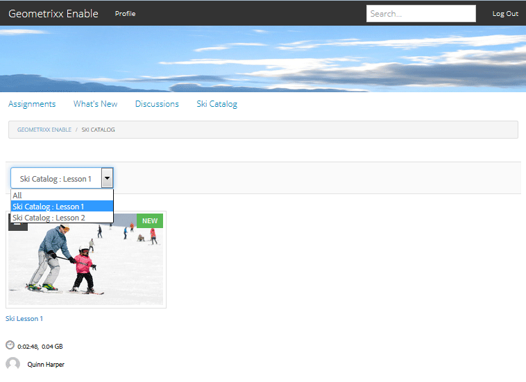

# Etiquetado de recursos de habilitación {#tagging-enablement-resources}

## Información general {#overview}

El etiquetado de los recursos de habilitación permite filtrar los recursos y las rutas de aprendizaje a medida que los miembros exploran [catálogos](functions.md#catalog-function).

Esencialmente:

* [Crear un espacio de ](../../help/sites-administering/tags.md#creating-a-namespace) nombres de etiqueta para cada catálogo

   * [Definir permisos de etiquetas](../../help/sites-administering/tags.md#setting-tag-permissions)
   * Solo para miembros de la comunidad (comunidad cerrada)

      * Permitir acceso de lectura para el grupo de miembros del [sitio de la comunidad](users.md#publish-group-roles)
   * Para cualquier visitante del sitio, ya sea de inicio de sesión o anónimo (comunidad abierta)

      * Permitir acceso de lectura para el grupo `Everyone`
   * [Publicación de las etiquetas](../../help/sites-administering/tags.md#publishing-tags)

* [Definir el alcance de las etiquetas de un sitio de comunidad](sites-console.md#tagging)

   * [Configurar los catálogos que existen en la estructura del sitio](functions.md#catalog-function)

      * Puede agregar etiquetas a la instancia de catálogo para controlar la lista de las etiquetas presentadas en los filtros de interfaz de usuario.
      * Puede agregar [filtros previos](catalog-developer-essentials.md#pre-filters) para restringir los recursos incluidos de un catálogo.

* [Publicar el sitio de la comunidad](sites-console.md#publishing-the-site)
* [Aplicar etiquetas a ](resources.md#create-a-resource) los recursos de habilitación para que se puedan filtrar por categorías
* [Publicación de los recursos de habilitación](resources.md#publish)

## Etiquetas del sitio de la comunidad {#community-site-tags}

Al crear o editar un sitio de comunidad, la configuración [Etiquetado](sites-console.md#tagging) establece el ámbito de las etiquetas disponibles para las características del sitio seleccionando un subconjunto de Áreas de nombres de etiquetas existentes.

Aunque las etiquetas se pueden crear y agregar al sitio de la comunidad en cualquier momento, se recomienda diseñar una taxonomía de antemano, de manera similar a diseñar una base de datos. Consulte [Uso de etiquetas](../../help/sites-authoring/tags.md).

Cuando más tarde se agregan etiquetas a un sitio de comunidad existente, es necesario guardar la edición antes de poder agregar la nueva etiqueta a una función de catálogo en la estructura del sitio.

Para un sitio de comunidad, una vez que se haya publicado el sitio y las etiquetas, es necesario habilitar el acceso de lectura para los miembros de la comunidad. Consulte [Configuración de permisos de etiquetas](../../help/sites-administering/tags.md#setting-tag-permissions).

A continuación se muestra cómo aparece en CRXDE cuando un administrador aplica permisos de lectura a `/etc/tags/ski-catalog` para el grupo `Community Enable Members`.

## Áreas de nombres de etiquetas de catálogo {#catalog-tag-namespaces}

La función de catálogo utiliza etiquetas para definirse. Al configurar la función de catálogo en un sitio de comunidad, el conjunto de Áreas de nombres de etiquetas para elegir se define mediante el ámbito de los espacios de nombres de etiquetas establecidos para el sitio de comunidad.

La función Catálogo incluye un ajuste de etiqueta que define las etiquetas que aparecen en la interfaz de usuario del filtro para el catálogo. La configuración &quot;Todas las Áreas de nombres&quot; hace referencia al ámbito de Áreas de nombres de etiquetas seleccionadas para el sitio de comunidad.

## Aplicación de etiquetas a los recursos de habilitación {#applying-tags-to-enablement-resources}

Los recursos de habilitación y las rutas de aprendizaje aparecerán en todo el catálogo cuando `Show in Catalog` esté marcado. Añadir las etiquetas a los recursos y las rutas de aprendizaje permitirá realizar un filtrado previo en catálogos específicos, así como en la interfaz de usuario del catálogo.

La restricción de recursos de habilitación y rutas de aprendizaje a catálogos específicos se logra mediante la creación de [filtros previos](catalog-developer-essentials.md#pre-filters).

La interfaz de usuario del catálogo permite que los visitantes apliquen un filtro de etiquetas a la lista de recursos y rutas de aprendizaje que aparecen en ese catálogo.

El administrador que aplique las etiquetas a los recursos de habilitación debe tener en cuenta las Áreas de nombres de etiquetas asociadas con los catálogos, así como la taxonomía para seleccionar una subetiqueta para una categorización más refinada.

Por ejemplo, si se crea una Área de nombres `ski-catalog` y se establece en un catálogo denominado `Ski Catalog`, puede tener dos etiquetas secundarias: `lesson-1` y `lesson-2`.

Por lo tanto, cualquier recurso de habilitación etiquetado con uno de los siguientes elementos:

* ski-catálogo:lección-1
* ski-catálogo:lección-2

aparecerá en `Ski Catalog` una vez que se haya publicado el recurso de habilitación.

## Visualización del catálogo en la publicación {#viewing-catalog-on-publish}

Una vez que todo se haya configurado desde el entorno del autor y se haya publicado, la experiencia de utilizar el catálogo para encontrar recursos de activación se puede experimentar en el entorno de publicación.

Si no aparece ninguna Área de nombres de etiquetas en la lista desplegable, asegúrese de que los permisos se han establecido correctamente en el entorno de publicación.

Si se han agregado Áreas de nombres de etiquetas y faltan, asegúrese de que las etiquetas y el sitio se han vuelto a publicar.

Si no aparece ningún recurso de habilitación después de seleccionar una etiqueta al ver el catálogo, asegúrese de que haya una etiqueta de la Área de nombres del catálogo aplicada al recurso de habilitación.

