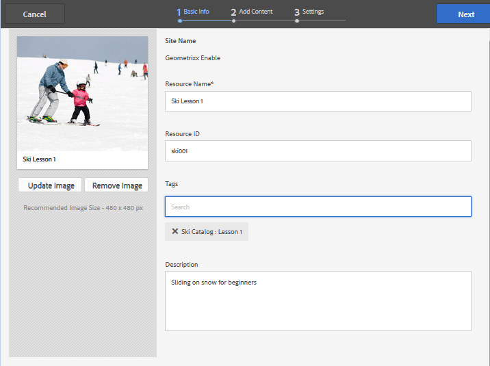

# Etiquetado de recursos de habilitación {#tagging-enablement-resources}

## Información general {#overview}

El etiquetado de los recursos de habilitación permite filtrar los recursos y las rutas de aprendizaje a medida que los miembros exploran [catálogos](functions.md#catalog-function).

Esencialmente:

* [Crear un espacio de ](../../help/sites-administering/tags.md#creating-a-namespace) nombres de etiqueta para cada catálogo

   * [Definir permisos de etiquetas](../../help/sites-administering/tags.md#setting-tag-permissions)
   * Solo para miembros de la comunidad (comunidad cerrada)

      * Permitir acceso de lectura para el grupo de miembros del [sitio de la comunidad](users.md#publish-group-roles)
   * Para cualquier visitante del sitio, ya sea que haya iniciado sesión o que sea anónimo (comunidad abierta)

      * Permitir acceso de lectura para el grupo `Everyone`
   * [Publicación de las etiquetas](../../help/sites-administering/tags.md#publishing-tags)

* [Definir el ámbito de las etiquetas de un sitio de comunidad](sites-console.md#tagging)

   * [Configurar los catálogos que existen en la estructura del sitio](functions.md#catalog-function)

      * Puede añadir etiquetas a la instancia de catálogo para controlar la lista de etiquetas presentadas en los filtros de interfaz de usuario.
      * Puede agregar [prefiltros](catalog-developer-essentials.md#pre-filters) para restringir los recursos incluidos de un catálogo.

* [Publicar el sitio de la comunidad](sites-console.md#publishing-the-site)
* [Aplicar etiquetas a los ](resources.md#create-a-resource) recursos de habilitación para que se puedan filtrar categóricamente
* [Publicación de los recursos de habilitación](resources.md#publish)

## Etiquetas de sitios de la comunidad {#community-site-tags}

Al crear o editar un sitio de la comunidad, la [configuración Etiquetado](sites-console.md#tagging) establece el ámbito de las etiquetas disponibles para las características del sitio seleccionando un subconjunto de áreas de nombres de etiquetas existentes.

Aunque las etiquetas se pueden crear y agregar al sitio de la comunidad en cualquier momento, se recomienda diseñar una taxonomía de antemano, similar a diseñar una base de datos. Consulte [Uso de etiquetas](../../help/sites-authoring/tags.md).

Cuando más tarde se agregan etiquetas a un sitio de comunidad existente, es necesario guardar la edición antes de poder agregar la nueva etiqueta a una función de catálogo en la estructura del sitio.

Para un sitio de la comunidad, una vez publicado el sitio y las etiquetas publicadas, es necesario permitir el acceso de lectura a los miembros de la comunidad. Consulte [Configuración de permisos de etiquetas](../../help/sites-administering/tags.md#setting-tag-permissions).

A continuación se muestra cómo aparece en CRXDE cuando un administrador aplica permisos de lectura a `/etc/tags/ski-catalog` para el grupo `Community Enable Members`.

## Espacios de nombres de etiquetas de catálogo {#catalog-tag-namespaces}

La función de catálogo utiliza etiquetas para definirse. Al configurar la función de catálogo en un sitio de comunidad, el conjunto de áreas de nombres de etiquetas entre las que elegir se define mediante el ámbito de los espacios de nombres de etiquetas definido para el sitio de comunidad.

La función Catálogo incluye una configuración de etiqueta que define las etiquetas que aparecen en la interfaz de usuario del filtro para el catálogo. La configuración &quot;Todos los espacios de nombres&quot; hace referencia al ámbito de los espacios de nombres de etiquetas seleccionados para el sitio de la comunidad.

## Aplicación de etiquetas a los recursos de habilitación {#applying-tags-to-enablement-resources}

Los recursos de habilitación y las rutas de aprendizaje aparecerán en todo el catálogo cuando se marque `Show in Catalog`. Añadir etiquetas a los recursos y a las rutas de aprendizaje permitirá el prefiltrado en catálogos específicos, así como el filtrado en la interfaz de usuario del catálogo.

Para restringir los recursos de habilitación y las rutas de aprendizaje a catálogos específicos, se crean [prefiltros](catalog-developer-essentials.md#pre-filters).

La interfaz de usuario del catálogo permite a los visitantes aplicar un filtro de etiquetas a la lista de recursos y rutas de aprendizaje que aparecen en dicho catálogo.

El administrador que aplique las etiquetas a los recursos de habilitación debe tener en cuenta las áreas de nombres de etiquetas asociadas con los catálogos, así como la taxonomía para seleccionar una subetiqueta para una categorización más refinada.

Por ejemplo, si se creó un espacio de nombres `ski-catalog` y se estableció en un catálogo denominado `Ski Catalog`, puede tener dos etiquetas secundarias: `lesson-1` y `lesson-2`.

Por lo tanto, cualquier recurso de habilitación etiquetado con uno de los siguientes elementos:

* ski-catalog:lección-1
* ski-catalog:lección-2

aparecerá en `Ski Catalog` después de publicar el recurso de habilitación.

## Visualización del catálogo en Publish {#viewing-catalog-on-publish}

Una vez que todo se ha configurado desde el entorno de creación y se ha publicado, la experiencia de utilizar el catálogo para encontrar recursos de habilitación se puede experimentar en el entorno de publicación.

Si no aparece ningún área de nombres de etiquetas en la lista desplegable, asegúrese de que los permisos se hayan establecido correctamente en el entorno de publicación.

Si se agregaron áreas de nombres de etiquetas que faltan, asegúrese de que las etiquetas y el sitio se volvieron a publicar.

Si no aparecen recursos de habilitación después de seleccionar una etiqueta al ver el catálogo, asegúrese de que haya una etiqueta del área de nombres del catálogo aplicada al recurso de habilitación.

