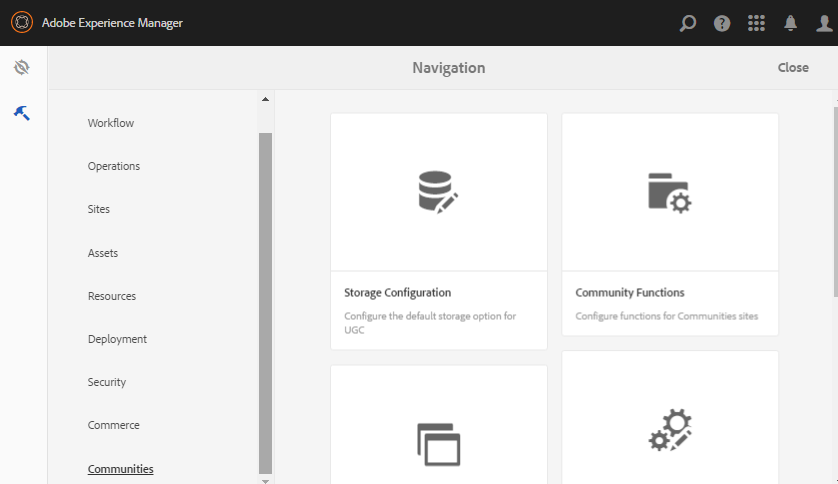

# Herramientas de Communities {#communities-tools}

Para acceder a la consola de herramientas de Communities, inicie sesión en la instancia de autor:

* Desde la navegación global: **[!UICONTROL Herramientas]** > **[!UICONTROL Comunidades]**.

   

* [Plantillas de sitio](sites.md) : consola para la creación y administración de plantillas de sitio.

* [Plantillas de grupo](tools-groups.md) : consola para la creación y administración de plantillas de grupo.

* [Funciones de la comunidad](functions.md) : consola para la creación y administración de funciones de la comunidad.

* [Configuración de almacenamiento](srp-config.md) : consola para la configuración y selección del  [SRP](working-with-srp.md) predeterminado.

* [Guía de componentes](components-guide.md) : abre un sitio interactivo que permite experimentar con cómo funcionan los componentes de SCF y cómo se pueden configurar o personalizar.

* [Distintivos](badges.md) : consola desde la que se pueden agregar distintivos personalizados para utilizarlos en las reglas de  [puntuación y distintivo](implementing-scoring.md)

