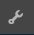
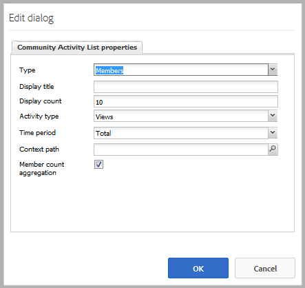

# Tendencias de actividades {#activity-trends}

## Introducción {#introduction}

El componente `Community Activity List` le permite agregar información de tendencias con respecto a las publicaciones y vistas de los miembros, así como publicaciones y vistas del contenido.

El documento describe:

* Agregando el componente `Community Activity List` a [sitio de la comunidad](/help/communities/overview.md#community-sites).

* Ajustes de configuración para el componente `Community Activity List`.

### Requisito {#requirement}

Los datos de `Community Activity List` solo están disponibles cuando Adobe Analytics tiene licencia y está configurado para el sitio de la comunidad.

Consulte [Configuración de Analytics para funciones de comunidades](/help/communities/analytics.md).

### Agregar una lista de actividades de la comunidad a una página {#adding-a-community-activity-list-to-a-page}

Para agregar un componente `Community Activity List` a una página en modo de autor, busque el componente `Communities / Community Activity List` y arrástrelo a su lugar en una página.

Para obtener la información necesaria, visite [Conceptos básicos de componentes de comunidades](/help/communities/basics.md).

Cuando se coloca por primera vez en una página de un sitio de la comunidad, así es como aparece el componente:

### Configurar la lista de actividades de comunidad  {#configuring-community-activity-list}

Seleccione el componente `Community Activity List` colocado y, a continuación, seleccione el icono `Configure` para poder abrir el cuadro de diálogo de edición.

En la ficha **Comentarios**, especifique si los comentarios de los archivos cargados aparecen y cómo:

* **Tipo**

  Especifique si desea mostrar datos sobre los miembros de la comunidad o sobre el contenido generado por el usuario (UGC).

  Seleccionar de:

   * `Members`
   * `Content`

  El valor predeterminado es `Members`.

* **Título para mostrar**

  Título descriptivo que se mostrará sobre los datos, como `Trending Content`.
El valor predeterminado es sin título.

* **Recuento de pantalla**

  Número de elementos que se van a enumerar.
El valor predeterminado es 10.

* **Tipo de actividad**

  Seleccione una de las siguientes opciones:

   * `Views`(visitas a la página)
   * `Posts`(creando UGC)
   * `Follows`
   * `Likes`

  El valor predeterminado es Vistas.

* **Período de tiempo**

  Seleccione una de las siguientes opciones:

   * `Last 24 hours`
   * `Last 7 days`
   * `Last 30 days`
   * `Last 90 days`
   * `This year (since Jan 1)`
   * `Total`

  El valor predeterminado es `Total`.

* **Ruta de acceso de contexto**

  Esto permite definir el ámbito de la actividad en un subconjunto del sitio, como un blog específico, por ejemplo.
De forma predeterminada, se muestra todo el sitio de la comunidad.

* **Agregación de recuento de miembros**

  Cuando no está seleccionada (desactivada), solo se cuentan las publicaciones de nivel superior. Por ejemplo, si el contexto es la página raíz (la predeterminada), entonces un `Activity Type` de `Posts` nunca mostrará ninguna actividad, ya que no hay capacidad para publicar contenido en la página raíz. Cuando se selecciona, se incluyen los recuentos de todas las páginas descendientes.
La opción predeterminada está activada.

### Página de ejemplo con cuatro componentes {#example-page-with-components}

**Configuración de visitantes principales**: Tipo = Miembros, Tipo de actividad = Vistas

**Colaboradores principales** configuración: Tipo = Miembros, Tipo de actividad = Publicaciones

**Contenido principal** configuración: Tipo = Contenido, Tipo de actividad = Vistas,

**Contenido de tendencias** configuración: Tipo = Contenido, Tipo de actividad = Publicaciones

