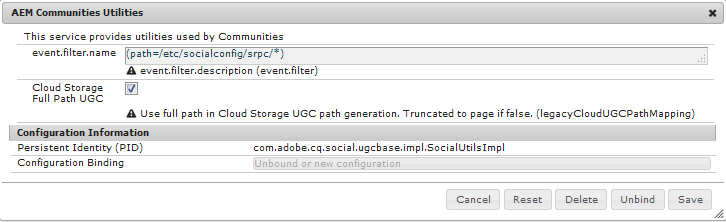

# Actualización a las comunidades de AEM 6.5 {#upgrading-to-aem-communities}

Según la topología y las características de cada sitio, pueden ser necesarias las siguientes acciones al actualizar a AEM Communities 6.5 o instalar el último paquete de funciones.

Esta sección es específica de Communities y complementa la información proporcionada en [Actualización a AEM 6.5](/help/sites-deploying/upgrade.md) (platform).

## Actualización desde AEM 6.1 o posterior {#upgrading-from-aem-or-later}

### Reindexar Solr {#reindex-solr}

Al instalar un nuevo paquete de funciones de Communities en una implementación configurada con MSRP, será necesario:

1. Instale [el último paquete de funciones](/help/communities/deploy-communities.md#latestfeaturepack).
1. Instale los [últimos archivos de configuración de Solr](/help/communities/msrp.md#upgrading).
1. Reindexar MSRP
vea la sección [Herramienta de reindexación MSRP](/help/communities/msrp.md#msrp-reindex-tool).

## Actualización desde AEM 6.0 {#upgrading-from-aem}

Si es necesario conservar el UGC preexistente, los medios para hacerlo dependen de si la implementación almacenó el UGC [local](#on-premise-storage) o en la nube [Adobe](#adobe-cloud-storage).

### Almacenamiento de Adobe Cloud {#adobe-cloud-storage}

Si el sitio actualizado se configuró para utilizar el almacenamiento en la nube de Adobe, puede aparecer (incorrectamente) como si se hubieran perdido todos los UGC, ya que los métodos SRP no podrán localizar el UGC preexistente en la ubicación antigua.

Por lo tanto, existe la capacidad de indicar a ASRP que utilice `AEM 6.0 compatability-mode` para acceder a UGC.

Para todas las instancias de autor y publicación de AEM 6.3:

* Iniciar sesión con privilegios de administrador.
* Configurar [ASRP](/help/communities/asrp.md).
* Siga estos pasos para hacer visible el UGC preexistente:

  * Vaya a la consola web:

    * Por ejemplo, [https://&lt;host>:&lt;port>/system/console/configMgr](https://localhost:4502/system/console/configMgr)

    * Busque la configuración de **Utilidades AEM Communities**.
    * Seleccione para expandir el panel de configuración:

      * *Desmarcar* `Cloud Storage`

      * Seleccionar **Guardar**

    

### Almacenamiento On-Premise {#on-premise-storage}

Si el sitio actualizado no utiliza almacenamiento en la nube, cualquier UGC preexistente debe convertirse para ajustarse a la nueva estructura introducida en las comunidades de AEM 6.1 como compatibilidad con el almacén común.

Para ello, hay disponible una herramienta de migración de código abierto en GitHub:
[Herramienta de migración de UGC para AEM Communities](https://github.com/Adobe-Marketing-Cloud/communities-ugc-migration)

### API de Java {#java-apis}

Al actualizar desde las comunidades sociales de AEM 6.0 a las comunidades de AEM 6.3, muchas API se han reorganizado en diferentes paquetes. La mayoría de los problemas se deben resolver fácilmente al usar un IDE para personalizar las características de Communities.

Para obtener más información sobre el paquete obsoleto de SocialUtils, visita [Refactorización de SocialUtils](/help/communities/socialutils.md).

Consulte también [Uso de Maven para comunidades](/help/communities/maven.md).

### No hay plantillas de componentes JSP {#no-jsp-component-templates}

El [marco de trabajo de componente social](/help/communities/scf.md) (SCF) usa el lenguaje de plantilla [HandlebarsJS](https://handlebarsjs.com/) (HBS) en lugar de las páginas de servidor Java (JSP) que se usaban antes de AEM 6.0.

En AEM 6.0, los componentes JSP permanecieron junto a los nuevos componentes del marco HBS en la misma ubicación, con los componentes HBS normalmente en subcarpetas denominadas &quot;hbs&quot;.

A partir de AEM 6.1, los componentes de JSP se eliminaron por completo. En el caso de las comunidades, se recomienda reemplazar todo el uso de componentes JSP por componentes SCF.

## Herramienta de migración de UGC para AEM Communities {#aem-communities-ugc-migration-tool}

La [Herramienta de migración para UGC de AEM Communities](https://github.com/Adobe-Marketing-Cloud/communities-ugc-migration) es una herramienta de migración de código abierto, disponible en GitHub, que se puede personalizar para exportar UGC desde versiones anteriores de comunidades sociales de AEM e importarlos a AEM Communities 6.1 o posterior.

Además de mover UGC de versiones anteriores, también es posible usar la herramienta para mover UGC de un [SRP](/help/communities/working-with-srp.md) a otro, como de MSRP a DSRP.

## Actualización de AEM 5.6.1 o anterior {#upgrading-from-aem-or-earlier}

Conceptualmente, hay tres generaciones de componentes de las comunidades:

**Gen 1**: Aproximadamente desde CQ 5.4 hasta AEM 5.6.0, estos son los componentes de **collab** que almacenaron UGC en el repositorio local mediante replicación como medio de sincronizar UGC entre plataformas. Otras diferencias implican la implementación mediante Java Server Pages (JSP) y la función de blog que consiste en crear solo en el entorno de creación.

**Gen 2**: Desde AEM 5.6.1 hasta AEM 6.1, se trata de una combinación de componentes **collab** y **social**. AEM 6.0 presentó el nuevo [marco de componentes sociales](/help/communities/scf.md) (SCF) y AEM 6.2 introdujo un [almacén de UGC común](/help/communities/working-with-srp.md) en el que se accede a UGC mediante un [proveedor de recursos de almacenamiento](/help/communities/srp.md) (SRP).

**Gen 3**: A partir de AEM 6.2, solo hay componentes **sociales**, implementados en SCF como componentes de Handlebars (HBS) que requieren una opción de SRP para UGC.
