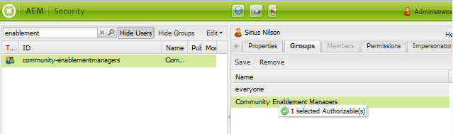

# Administración de usuarios y grupos de usuarios {#managing-users-and-user-groups}

## Información general {#overview}

En AEM Communities, en el entorno de publicación, los usuarios pueden registrarse automáticamente y editar sus perfiles. Dados los permisos adecuados, también pueden:

* Cree subcomunidades dentro del sitio de la comunidad (consulte [grupos de la comunidad](creating-groups.md)).

* [](moderation.md) Moderar contenido generado por el usuario (UGC).

* Ser [contactos de recursos de habilitación](resources.md).

* Tenga [privilegios](#privileged-members-group) para crear entradas para blogs, calendarios, QnA y foros.

Los usuarios registrados en el entorno de publicación suelen denominarse *miembros de la comunidad (miembros)* para distinguirlos de *usuarios* en el entorno de creación.

Los permisos se conceden asignando miembros a uno de los [grupos de miembros (usuarios)](#publish-group-roles) creados dinámicamente cuando el sitio de la comunidad está [creado](sites-console.md) o [modificado](sites-console.md#modifying-site-properties) desde el entorno de creación. Cuando se trabaja desde el entorno de creación, los miembros son visibles desde el entorno de publicación mediante el [servicio de túnel](#tunnel-service).

Por diseño, los miembros y los grupos de miembros creados en el entorno de publicación no deberían aparecer en el entorno de creación. Los usuarios y grupos de usuarios creados en el entorno de creación tienen la misma intención de permanecer en el entorno de creación.

Cuando los usuarios del autor y los miembros de la publicación provienen de la misma lista de usuarios, como sincronizados desde el mismo directorio LDAP, no se consideran el mismo usuario con los mismos permisos y pertenencia a grupos en los entornos de autor y publicación. Las funciones de los miembros y usuarios deben establecerse por separado en el momento de la publicación y del autor, según proceda.

Para una [granja de publicación](topologies.md), el registro y las modificaciones realizadas en una instancia de publicación deben sincronizarse con otras instancias de publicación para que tengan acceso a los mismos datos de usuario. Para obtener más información, consulte [Sincronización de usuarios](sync.md), que incluye una sección que describe [Qué sucede cuando...](sync.md#what-happens-when).

### Límites de contribución {#contribution-limits}

Para protegerse contra el spam, es posible limitar la frecuencia de publicación del contenido por parte de los miembros. Además, es posible limitar automáticamente las contribuciones de los miembros recién inscritos.

Para obtener más información, consulte [Límites de contribución de miembros](limits.md).

### Grupos de usuarios creados dinámicamente {#dynamically-created-user-groups}

Cuando se crea un nuevo sitio de comunidad, se crean de forma dinámica nuevos grupos de usuarios con id únicos (uid) y permisos adecuados para diversas funciones administrativas necesarias para administrar el sitio de la comunidad en el entorno de creación (consulte [Funciones del grupo de autores](#author-group-roles)) o en el entorno de publicación (consulte [Funciones del grupo de publicación](#publish-group-roles)).

Los nombres de los grupos se generan a partir del nombre dado al sitio durante la [creación del sitio de la comunidad](sites-console.md#step13asitetemplate). Los identificadores únicos evitan conflictos de nombres para sitios de comunidad y grupos de comunidades con nombres similares en el mismo servidor.

Por ejemplo, si el nombre del sitio fuera &quot;*involucre*&quot; para un sitio llamado &quot;Compromiso de We.Retail&quot;, uno de los grupos de usuarios creados sería:

* Miembros de la comunidad *Participación*

## Entorno de creación {#author-environment}

### Servicio de túnel {#tunnel-service}

Al utilizar el entorno de creación para [crear sitios](sites-console.md), [modificar propiedades del sitio](sites-console.md#modifying-site-properties) y [administrar miembros de la comunidad y grupos de miembros](members.md), es necesario acceder a los usuarios y grupos de usuarios registrados en el entorno de publicación.

El servicio de túnel proporciona este acceso mediante el agente de replicación en el autor.

* Para obtener más información, consulte [instrucciones de configuración](deploy-communities.md#tunnel-service-on-author) en la página de implementación.

Las [consolas Miembros y grupos de Communities](members.md) tienen el único propósito de administrar usuarios (miembros) y grupos de usuarios (grupos de miembros) registrados únicamente en el entorno de publicación.

Para administrar usuarios y grupos de usuarios registrados en el entorno de creación, utilice la [Consola de seguridad](../../help/sites-administering/security.md)

### Funciones del grupo de creación {#author-group-roles}

| Si es miembro del grupo... | Función principal |
|---|---|
| administradores | El grupo de administradores está formado por administradores de sistemas que tienen todas las capacidades de un administrador de la comunidad, así como la capacidad de gestionar el grupo de administradores de la comunidad. |
| Administradores de la comunidad | El grupo Administradores de la comunidad se convierte automáticamente en miembro de todos los sitios de la comunidad y de cualquier grupo de la comunidad creado en el sitio. Un miembro inicial del grupo Administradores de la comunidad es el grupo de administradores. En el entorno de creación, los administradores de la comunidad pueden crear sitios de la comunidad, administrar sitios, administrar miembros (pueden prohibir miembros de la comunidad) y moderar contenido. |
| Comunidad &lt;*nombre del sitio*> Sitecontentmanager | El Administrador de contenido de sitios de la comunidad puede realizar la creación de AEM tradicional, la creación de contenido y la modificación de páginas para un sitio de la comunidad. |
| Administradores de habilitación de la comunidad | El grupo Administradores de habilitación de la comunidad está formado por usuarios que están disponibles para asignación para administrar el grupo Gestores de habilitación de un sitio de la comunidad. |
| Comunidad &lt;*nombre del sitio* > Administradores de habilitación de sitios | El grupo Administradores de habilitación de sitios de la comunidad está formado por usuarios asignados para administrar la habilitación de [recursos](resources.md) de un sitio de la comunidad. |
| Ninguna | Es posible que un visitante anónimo del sitio no acceda al entorno de creación. |

### Administradores del sistema {#system-administrators}

Los miembros del grupo de administradores son administradores del sistema que pueden realizar la configuración inicial de una instalación de AEM para los entornos de autor y publicación.

Para fines de demostración y desarrollo, el grupo de administradores tiene un miembro cuyo userid es *admin* y la contraseña es *admin*.

Para los entornos de producción, se debe modificar el grupo de administradores predeterminado.

Asegúrese de seguir la [Lista de comprobación de seguridad](../../help/sites-administering/security-checklist.md).

## Entorno de publicación {#publish-environment}

### Convertirse en miembro {#becoming-a-member}

En el entorno de publicación, según la [configuración](sites-console.md#user-management) del sitio de la comunidad, el visitante del sitio puede convertirse en miembro de la comunidad:

* Cuando el sitio de la comunidad es privado (cerrado):
   * Por invitación
   * Mediante acciones de un administrador

* Cuando el sitio de la comunidad es público (abierto):
   * Por registro propio
   * Mediante inicio de sesión social con Facebook y Twitter

>[!NOTE]
>
>Si el visitante de un sitio se registra como miembro de un sitio de comunidad abierto, automáticamente se convierte en miembro de otros sitios de comunidad abiertos en el mismo entorno de publicación.

### Publicar funciones de grupo {#publish-group-roles}

| Si es miembro del grupo... | Función principal |
|---|---|
| Miembros de Community &lt;*site name* | Un miembro del sitio de la comunidad es un usuario registrado. Pueden iniciar sesión, modificar su perfil, unirse a un grupo de comunidad abierto, publicar contenido en la comunidad, enviar mensajes a otros miembros y seguir las actividades del sitio. |
| Moderadores del &lt;*nombre del sitio* de la comunidad | Un moderador de sitio de la comunidad es un miembro de la comunidad de confianza que puede moderar UGC de forma masiva, mediante la consola de moderación o en contexto, en la página en la que se publica el contenido. |
| Miembros de la comunidad &lt;*nombre del sitio*> &lt;*nombre del grupo* | Un miembro del grupo comunitario es un miembro de la comunidad que se ha unido a un grupo de la comunidad abierta o ha sido invitado a un grupo de la comunidad cerrado. Tienen las capacidades de un miembro para ese grupo de la comunidad dentro del sitio. |
| Comunidad &lt;*nombre del sitio*> Administradores de grupos | Un administrador de grupo de sitios de la comunidad es un miembro de la comunidad de confianza que está asignado para crear y administrar subcomunidades (grupos) dentro de un sitio de la comunidad. Se incluye la capacidad de proporcionar moderación en contexto. |
| *Grupo de seguridad de miembros privilegiados* | Grupo de usuarios creado y mantenido manualmente con el fin de restringir la creación de contenido. Consulte [Grupo de miembros privilegiados](#privileged-members-group). |
| Ninguna | Un visitante anónimo del sitio, que descubra el sitio, puede ver y buscar sitios de la comunidad que permitan el acceso anónimo. Para participar y publicar contenido, el usuario debe registrarse (si se permite) y convertirse en miembro de la comunidad. |

### Asignación de miembros a funciones de grupo de publicación {#assigning-members-to-publish-group-roles}

Cuando [crea un sitio de comunidad](sites-console.md) en el entorno de creación o cuando [modifica las propiedades del sitio, se pueden asignar a los miembros ](sites-console.md#modifying-site-properties) varias funciones que se realizan en el entorno de publicación, como moderadores, administradores de grupos, contactos de recursos o miembros privilegiados.

[Al habilitar el ](sync.md#accessingpublishusersfromauthor) servicio de túnel, las opciones de asignación se presentan desde los miembros en la publicación en lugar de los usuarios en el autor.

Los miembros seleccionados se asignarán automáticamente al [grupo apropiado](#publish-group-roles) y sus miembros se incluirán cuando se vuelva a publicar el sitio de la comunidad.

### Grupo de miembros privilegiados {#privileged-members-group}

El objetivo de un grupo de seguridad de miembros privilegiados es restringir la creación de contenido para ciertas funciones de la comunidad a un subconjunto privilegiado de miembros de un sitio de la comunidad.

El grupo de miembros privilegiados es un grupo de miembros creado y administrado mediante la [Consola de grupos de comunidades](members.md).

Después de crear un grupo de miembros privilegiados, y con el [servicio de túnel habilitado](sync.md#accessingpublishusersfromauthor), la estructura de un sitio de comunidad existente puede [modificarse](sites-console.md#modify-structure) para editar la configuración de sus funciones de comunidad a &quot;Permitir miembros privilegiados&quot; y agregar el grupo creado.

Las funciones de la comunidad que permiten especificar uno o más grupos de miembros privilegiados son:

* [Función de blog](functions.md#blog-function) : para restringir la creación de nuevos artículos.
* [Función de calendario](functions.md#calendar-function) : para restringir la creación de nuevos eventos.
* [Función de foro](functions.md#forum-function) : para restringir la creación de nuevos temas.
* [Función QnA](functions.md#qna-function) : para restringir la creación de nuevas preguntas.

Cuando una función de comunidad no está segura (no se ha asignado ningún grupo de miembros privilegiados), todos los miembros del sitio de la comunidad pueden crear contenido de funciones (artículos, eventos, temas, preguntas).

>[!NOTE]
>
>Agregar un usuario a un grupo de miembros privilegiados para un sitio de comunidad solo les otorgará privilegios de creación si también son miembros de ese mismo sitio de comunidad.

## Creación de miembros de la comunidad {#creating-community-members}

### Ubicación del repositorio {#repository-location}

Para que ciertas funciones funcionen correctamente, es necesario crear usuarios y grupos de usuarios con los privilegios adecuados.

Cuando los miembros se crean en `/home/users/community`, heredan las ACL adecuadas que otorgan privilegios de lectura a los perfiles de los miembros.

Del mismo modo, los grupos de usuarios de la comunidad personalizados (como los grupos de miembros privilegiados) deben crearse en `/home/groups/community`.

El uso de las [consolas Miembros y grupos de Communities](members.md) creará usuarios y grupos en estas rutas.

Para especificar una ruta personalizada, es necesario usar la IU de seguridad clásica, a la que se puede acceder desde [https://&lt;server>:&lt;port>/useradmin](http://localhost:4503/useradmin).

Para conceder privilegios de lectura para rutas de miembros personalizadas, en todas las instancias de publicación establezca ACL similares a `/home/users/community`:

```xml
<allow
  jcr:primaryType="rep:GrantACE"
  rep:principalName="everyone"
  rep:privileges="{Name}[jcr:read]" >
  <rep:restrictions
    jcr:primaryType="rep:Restrictions"
    rep:glob="*/profile*" />
</allow>
```

Para conceder los privilegios adecuados para las rutas de grupos de miembros personalizadas, como /home/groups/mycompany, en todas las instancias de publicación establezca ACL similares a `/home/groups/community`:

```xml
<allow
  jcr:primaryType="rep:GrantACE"
  rep:principalName="community-administrators"
  rep:privileges="{Name}[jcr:read]"  />
```

### Consolas {#consoles}

Hay cuatro consolas independientes disponibles solo en el entorno de creación:

| consola | Herramientas, Seguridad, Usuarios | Herramientas, Seguridad, Grupos | Comunidades, miembros | Comunidades, grupos |
|----------|-----------------------|------------------------|------------------------------------------------------------|------------------------------------------------------------|
| administre | usuarios en author | grupos de usuarios en author | miembros al publicar | grupos de miembros al publicar |
| requirements | permiso de administrador | permiso de administrador | permiso de administrador, servicio de túnel, sincronización de usuarios para la granja de publicaciones | permiso de administrador, servicio de túnel, sincronización de usuarios para la granja de publicaciones |

### Función Administrador de habilitación de la comunidad {#community-enablement-manager-role}

La capacidad para que un visitante del sitio se registre de forma automática generalmente no está permitida para una [comunidad de habilitación](overview.md#enablement-community), ya que hay costos asociados a cada miembro. Los recursos y aprendices de habilitación son administrados por un usuario asignado a la [función](#author-group-roles) de `enablement manager` [durante la creación del sitio](sites-console.md#enablement) en el autor (añadida como miembro del grupo `Community <site-name> Siteenablementmanagers`). `enablement manager` también es responsable de [asignar recursos de aprendizaje](resources.md) a los miembros de la comunidad del autor.

Solo los usuarios que sean miembros del grupo global `Community Enablement Managers` pueden seleccionarse como `enablement manager` para un sitio de comunidad específico.

Para crear un usuario al que se pueda asignar la función de `Community Site Enablement Manager`, utilice la consola de seguridad de la IU clásica para especificar la ruta:

En una instancia de autor:

1. Iniciado sesión con privilegios de administrador, vaya a la consola de seguridad de la IU clásica.

   Por ejemplo, [http://localhost:4502/useradmin](http://localhost:4502/useradmin)

2. En el menú Edición, seleccione **[!UICONTROL Crear usuario]**.
3. Complete el cuadro de diálogo `Create User`.
   * La ruta debe ser `/home/users/community`.
4. Seleccione **[!UICONTROL Crear]**.

   

* En el panel izquierdo, busque el usuario recién creado y seleccione para mostrarlo en el panel derecho.

   

En el panel izquierdo:

1. Desactive el cuadro de búsqueda y seleccione **[!UICONTROL Ocultar usuarios]**.
2. Busque y arrastre `community-enablementmanagers` a la pestaña **[!UICONTROL Grupos]** del nuevo usuario que se muestra en el panel derecho.

   

### Función de administradores de la comunidad {#community-administrators-role}

Como se indica en el gráfico [Funciones del grupo de autores](#author-group-roles), los miembros del grupo Administradores de la comunidad pueden crear sitios de la comunidad, administrar sitios, administrar miembros (pueden prohibir miembros de la comunidad) y moderar contenido.

Siga los mismos pasos que para crear y asignar un usuario a la función de [administrador de habilitación](#communitysiteenablementmanagerrole), pero agregue el grupo c `ommunity-administrators` en la ficha Grupos del usuario.

### Integración LDAP {#ldap-integration}

AEM admite el uso de LDAP para la autenticación de usuarios, así como la creación de cuentas de usuario. Esto se detalla en [Configuración de LDAP con AEM 6](../../help/sites-administering/ldap-config.md).

A continuación se detallan algunos detalles de configuración específicos para miembros de la comunidad y grupos de miembros.

1. Configure LDAP para cada instancia de publicación AEM.
2. [El proveedor de identidad LDAP](../../help/sites-administering/ldap-config.md#configuring-the-ldap-identity-provider)

   * No hay instrucciones especiales

3. [Controlador de sincronización](../../help/sites-administering/ldap-config.md#configuring-the-synchronization-handler)

   * Establezca las siguientes propiedades:

      * **[!UICONTROL Pertenencia]** automática del usuario:  `community-<site name>-<uid>-members`
      * **[!UICONTROL Prefijo]** de ruta de usuario:  `/community`
      * **[!UICONTROL Prefijo de ruta de grupo]**:  `/community`

4. [El módulo de inicio de sesión externo](../../help/sites-administering/ldap-config.md#the-external-login-module)

   * instrucciones especiales

Esto hace que los usuarios se asignen automáticamente al grupo de miembros del sitio de la comunidad y que la ubicación del repositorio sea `/home/users/community` y `/home/groups/community`, de modo que hereden los permisos adecuados para ver el perfil de los demás.

* El valor `User auto membership` debe ser la propiedad `rep:authorizableId`, no el `givenName` (nombre para mostrar) del perfil.

## Sincronización de usuarios entre instancias de AEM {#synchronizing-users-among-aem-instances}

Cuando utilice un [conjunto de servidores de publicación](topologies.md), asegúrese de que los usuarios tengan la misma ruta en cada instancia de publicación importando primero a los usuarios en una instancia y [habilitando la sincronización de usuarios](sync.md) para que Sling distribuya los usuarios a las otras instancias de publicación.

Si importa grupos de usuarios, para asegurarse de que los grupos de usuarios tengan la misma ruta en cada instancia de publicación, importe a una instancia, luego [cree un paquete](../../help/sites-administering/package-manager.md#creating-a-new-package) para exportarlo e instale ese paquete en todas las demás instancias de publicación.

Aunque la sincronización de grupos de usuarios mediante la sincronización de usuarios se incluirá en una versión futura, actualmente solo la *pertenencia* de un grupo de usuarios se sincronizará cuando se ejecute la sincronización de usuarios.

## Acerca de los grupos de comunidades {#about-community-groups}

Al discutir grupos, hay dos temas diferentes:

* **[Grupos de la comunidad](overview.md#communitygroups)**

   Los grupos comunitarios son las subcomunidades que pueden crearse en el entorno de publicación de un sitio comunitario que apoya la creación de grupos comunitarios. La creación de un grupo de comunidad da como resultado más páginas agregadas al sitio web y se administran de manera similar a su sitio de comunidad principal. Para obtener más información, visite [Community Group Essentials](essentials-groups.md) para desarrolladores y [Community Group](creating-groups.md) para autores.

* **[Grupos de miembros](../../help/sites-administering/security.md)**

   Los grupos de miembros son los grupos a los que los miembros pueden pertenecer y se administran a través de la consola Grupos . Gran parte del debate en esta página se ha dedicado a grupos miembros. Los grupos de miembros creados automáticamente para un sitio de la comunidad, con el prefijo *`Community`*, pueden ser referidos como grupo de la comunidad, por lo tanto debe considerarse el contexto de la discusión.
