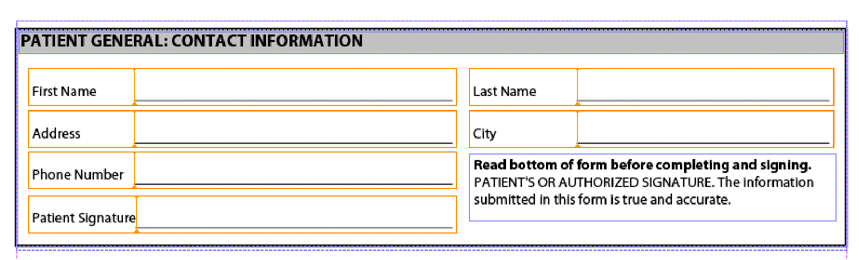

# Compilación de varios fragmentos XDP{#assembling-multiple-xdp-fragments}

Puede montar varios fragmentos XDP en un único documento XDP. Por ejemplo, piense en los fragmentos XDP donde cada archivo XDP contiene uno o más subformularios utilizados para crear un formulario de mantenimiento. La siguiente ilustración muestra la vista de esquema (representa el archivo tuc018_template_flowed.xdp utilizado en el inicio rápido de *ensamblar varios fragmentos* XDP):


La siguiente ilustración muestra la sección del paciente (representa el archivo tuc018_contact.xdp utilizado en el inicio rápido de *ensamblaje de varios fragmentos* XDP):



La siguiente ilustración muestra la sección de salud del paciente (representa el archivo tuc018_Patient.xdp utilizado en el inicio rápido de *ensamblaje de varios fragmentos* XDP):


Este fragmento contiene dos subformularios denominados *subPatientPhysical* y *subPatientHealth*. Se hace referencia a ambos subformularios en el documento DDX que se pasa al servicio de ensamblador. Con el servicio Ensamblador, puede combinar todos estos fragmentos XDP en un único documento XDP, como se muestra en la siguiente ilustración.


El siguiente documento DDX ensambla varios fragmentos XDP en un documento XDP.

```as3
 <?xml version="1.0" encoding="UTF-8"?>
 <DDX xmlns="https://ns.adobe.com/DDX/1.0/">
         <XDP result="tuc018result.xdp">
            <XDP source="tuc018_template_flowed.xdp">
             <XDPContent insertionPoint="ddx_fragment" source="tuc018_contact.xdp" fragment="subPatientContact" required="false"/>
               <XDPContent insertionPoint="ddx_fragment" source="tuc018_patient.xdp" fragment="subPatientPhysical" required="false"/>
               <XDPContent insertionPoint="ddx_fragment" source="tuc018_patient.xdp" fragment="subPatientHealth" required="false"/>
            </XDP>
         </XDP>
 </DDX>
```

El documento DDX contiene una `result` etiqueta XDP que especifica el nombre del resultado. En esta situación, el valor es `tuc018result.xdp`. Se hace referencia a este valor en la lógica de aplicación que se utiliza para recuperar el documento XDP después de que el servicio Ensamblador devuelva el resultado. Por ejemplo, piense en la siguiente lógica de aplicación Java que se utiliza para recuperar el documento XDP ensamblado (observe que el valor está en negrita):

```as3
 //Iterate through the map object to retrieve the result XDP document
 for (Iterator i = allDocs.entrySet().iterator(); i.hasNext();) {
     // Retrieve the Map object’s value
     Map.Entry e = (Map.Entry)i.next();
     //Get the key name as specified in the
     //DDX document
     String keyName = (String)e.getKey();
     if (keyName.equalsIgnoreCase("tuc018result.xdp"))
                 {
         Object o = e.getValue();
         outDoc = (Document)o;
         //Save the result PDF file
         File myOutFile = new File("C:\\AssemblerResultXDP.xdp");
         outDoc.copyToFile(myOutFile);
     }
 }
```

La `XDP source` etiqueta especifica el archivo XDP que representa un documento XDP completo que se puede utilizar como contenedor para agregar fragmentos XDP o como uno de varios documentos que se anexan juntos en orden. En este caso, el documento XDP solo se utiliza como contenedor (la primera ilustración que se muestra en *Compilación de varios fragmentos* XDP). Es decir, los otros archivos XDP se colocan dentro del contenedor XDP.

Para cada subformulario, puede agregar un `XDPContent` elemento (este elemento es opcional). En el ejemplo anterior, observe que hay tres subformularios: `subPatientContact`, `subPatientPhysical`, y `subPatientHealth`. Tanto el `subPatientPhysical` subformulario como el `subPatientHealth` subformulario se encuentran en el mismo archivo XDP, tuc018_customer.xdp. El elemento fragmento especifica el nombre del subformulario, tal como se define en Designer.

>[!NOTE]
>
>Para obtener más información sobre el servicio Compilador, consulte Referencia de [servicios para AEM Forms](https://www.adobe.com/go/learn_aemforms_services_63).

>[!NOTE]
>
>Para obtener más información sobre un documento DDX, consulte [Servicio de ensamblador y Referencia](https://www.adobe.com/go/learn_aemforms_ddx_63)DDX.

## Resumen de los pasos {#summary-of-steps}

Para montar varios fragmentos XDP, realice las siguientes tareas:

1. Incluir archivos de proyecto.
1. Cree un cliente de ensamblador de PDF.
1. Haga referencia a un documento DDX existente.
1. Consulte los documentos XDP.
1. Configure las opciones de tiempo de ejecución.
1. Compilación de varios documentos XDP.
1. Recupere el documento XDP montado.

**Incluir archivos de proyecto**

Incluya los archivos necesarios en el proyecto de desarrollo. Si va a crear una aplicación cliente mediante Java, incluya los archivos JAR necesarios. Si utiliza servicios Web, asegúrese de incluir los archivos proxy.

Se deben agregar los siguientes archivos JAR a la ruta de clases del proyecto:

* adobe-livecycle-client.jar
* adobe-usermanager-client.jar
* adobe-assembler-client.jar
* adobe-utilities.jar (obligatorio si AEM Forms se implementa en JBoss)
* jbossall-client.jar (obligatorio si AEM Forms se implementa en JBoss)

**Crear un cliente de ensamblador de PDF**

Antes de realizar una operación de ensamblador mediante programación, cree un cliente de servicio de ensamblador.

**Hacer referencia a un documento DDX existente**

Se debe hacer referencia a un documento DDX para ensamblar varios documentos XDP. Este documento DDX debe contener `XDP result`, `XDP source`y `XDPContent` elementos.

**Referencia a los documentos XDP**

Para montar varios documentos XDP, haga referencia a todos los archivos XDP que se utilizan para ensamblar el documento XDP resultante. Asegúrese de que el nombre del subformulario contenido en el documento XDP al que hace referencia el `source` atributo esté especificado en el `fragment` atributo. Designer define un subformulario. Por ejemplo, piense en el siguiente XML.

```as3
 <XDPContent insertionPoint="ddx_fragment" source="tuc018_contact.xdp" fragment="subPatientContact" required="false"/>
```

El subformulario denominado *subPatientContact* debe encontrarse en el archivo XDP denominado *tuc018_contact.xdp*.

**Definición de opciones de tiempo de ejecución**

Puede definir opciones en tiempo de ejecución que controlen el comportamiento del servicio de ensamblador mientras realiza un trabajo. Por ejemplo, puede definir una opción que indique al servicio Ensamblador que continúe procesando un trabajo si se produce un error.

**Compilación de varios documentos XDP**

Para montar varios archivos XDP, llame a la `invokeDDX` operación. El servicio Ensamblador devuelve el documento XDP ensamblado dentro de un objeto de colección.

**Recuperar el documento XDP ensamblado**

Un documento XDP ensamblado se devuelve dentro de un objeto de colección. Repita el objeto de colección y guarde el documento XDP como archivo XDP. También puede pasar el documento XDP a otro servicio de AEM Forms, como Output.

**Consulte también**

[Compilación de varios fragmentos XDP mediante la API de Java](assembling-multiple-xdp-fragments.md#assemble-multiple-xdp-fragments-using-the-java-api)

[Compilación de varios fragmentos XDP mediante la API de servicio web](assembling-multiple-xdp-fragments.md#assemble-multiple-xdp-fragments-using-the-web-service-api)

[Inclusión de archivos de biblioteca Java de AEM Forms](/help/forms/developing/invoking-aem-forms-using-java.md#including-aem-forms-java-library-files)

[Configuración de las propiedades de conexión](/help/forms/developing/invoking-aem-forms-using-java.md#setting-connection-properties)

[Compilación de documentos PDF mediante programación](/help/forms/developing/programmatically-assembling-pdf-documents.md#programmatically-assembling-pdf-documents)

[Creación de documentos PDF mediante fragmentos](/help/forms/developing/creating-document-output-streams.md#creating-pdf-documents-using-fragments)

## Compilación de varios fragmentos XDP mediante la API de Java {#assemble-multiple-xdp-fragments-using-the-java-api}

Monte varios fragmentos XDP mediante la API de servicio de ensamblador (Java):

1. Incluir archivos de proyecto.

   Incluya archivos JAR de cliente, como adobe-assembler-client.jar, en la ruta de clases del proyecto Java.

1. Cree un cliente de ensamblador de PDF.

   * Cree un `ServiceClientFactory` objeto que contenga propiedades de conexión.
   * Cree un `AssemblerServiceClient` objeto utilizando su constructor y pasando el `ServiceClientFactory` objeto.

1. Haga referencia a un documento DDX existente.

   * Cree un `java.io.FileInputStream` objeto que represente el documento DDX utilizando su constructor y pasando un valor de cadena que especifique la ubicación del archivo DDX.
   * Cree un `com.adobe.idp.Document` objeto utilizando su constructor y pasando el `java.io.FileInputStream` objeto.

1. Consulte los documentos XDP.

   * Cree un `java.util.Map` objeto que se utilice para almacenar documentos XDP de entrada mediante un `HashMap` constructor.
   * Cree un `com.adobe.idp.Document` objeto y pase el `java.io.FileInputStream` objeto que contiene el archivo XDP de entrada (repita esta tarea para cada archivo XDP).
   * Agregue una entrada al `java.util.Map` objeto invocando su `put` método y pasando los siguientes argumentos:

      * Un valor de cadena que representa el nombre de la clave. Este valor debe coincidir con el valor del `source` elemento especificado en el documento DDX (repita esta tarea para cada archivo XDP).
      * Un `com.adobe.idp.Document` objeto que contiene el documento XDP que corresponde al `source` elemento (repita esta tarea para cada archivo XDP).

1. Configure las opciones de tiempo de ejecución.

   * Cree un `AssemblerOptionSpec` objeto que almacene opciones de tiempo de ejecución mediante su constructor.
   * Configure las opciones de tiempo de ejecución para cumplir los requisitos comerciales invocando un método que pertenece al `AssemblerOptionSpec` objeto. Por ejemplo, para indicar al servicio Ensamblador que continúe procesando un trabajo cuando se produzca un error, invoque el `AssemblerOptionSpec` método del `setFailOnError` objeto y pase `false`.

1. Compilación de varios documentos XDP.

   Invoque el `AssemblerServiceClient` método del `invokeDDX` objeto y pase los siguientes valores obligatorios:

   * Un `com.adobe.idp.Document` objeto que representa el documento DDX que se va a utilizar
   * Un `java.util.Map` objeto que contiene los archivos XDP de entrada
   * Un `com.adobe.livecycle.assembler.client.AssemblerOptionSpec` objeto que especifica las opciones de tiempo de ejecución, incluyendo la fuente predeterminada y el nivel de registro de trabajos
   El `invokeDDX` método devuelve un `com.adobe.livecycle.assembler.client.AssemblerResult` objeto que contiene el documento XDP ensamblado.

1. Recupere el documento XDP montado.

   Para obtener el documento XDP ensamblado, realice las siguientes acciones:

   * Invocar el `AssemblerResult` método del `getDocuments` objeto. Este método devuelve un `java.util.Map` objeto.
   * Repita el `java.util.Map` objeto hasta que encuentre el `com.adobe.idp.Document` objeto resultante.
   * Invocar el `com.adobe.idp.Document` método del `copyToFile` objeto para extraer el documento XDP ensamblado.

**Consulte también**

[Compilación de varios fragmentos](assembling-multiple-xdp-fragments.md#assembling-multiple-xdp-fragments)XDP de inicio[rápido (modo SOAP): Compilación de varios fragmentos XDP mediante la API](/help/forms/developing/assembler-service-java-api-quick.md#quick-start-soap-mode-assembling-multiple-xdp-fragments-using-the-java-api)de Java[Inclusión de archivos](/help/forms/developing/invoking-aem-forms-using-java.md#including-aem-forms-java-library-files)de biblioteca Java de AEM Forms[Configuración de las propiedades de conexión](/help/forms/developing/invoking-aem-forms-using-java.md#setting-connection-properties)

## Compilación de varios fragmentos XDP mediante la API de servicio web {#assemble-multiple-xdp-fragments-using-the-web-service-api}

Monte varios fragmentos XDP mediante la API de servicio de ensamblador (servicio web):

1. Incluir archivos de proyecto.

   Cree un proyecto de Microsoft .NET que utilice MTOM. Asegúrese de utilizar la siguiente definición WSDL al configurar una referencia de servicio:

   ```as3
    https://localhost:8080/soap/services/AssemblerService?WSDL&lc_version=9.0.1.
   ```

   >[!NOTE]
   >
   >Reemplazar `localhost` por la dirección IP del servidor que aloja AEM Forms.

1. Cree un cliente de ensamblador de PDF.

   * Cree un `AssemblerServiceClient` objeto utilizando su constructor predeterminado.
   * Cree un `AssemblerServiceClient.Endpoint.Address` objeto mediante el `System.ServiceModel.EndpointAddress` constructor. Pase un valor de cadena que especifique el WSDL al servicio de AEM Forms, como `https://localhost:8080/soap/services/AssemblerService?blob=mtom`). No es necesario usar el `lc_version` atributo. Este atributo se utiliza al crear una referencia de servicio.
   * Cree un `System.ServiceModel.BasicHttpBinding` objeto obteniendo el valor del `AssemblerServiceClient.Endpoint.Binding` campo. Convierta el valor devuelto a `BasicHttpBinding`.
   * Establezca el `System.ServiceModel.BasicHttpBinding` campo del `MessageEncoding` objeto en `WSMessageEncoding.Mtom`. Este valor garantiza que se utilice MTOM.
   * Habilite la autenticación HTTP básica realizando las siguientes tareas:

      * Asigne el nombre de usuario de los formularios AEM al `AssemblerServiceClient.ClientCredentials.UserName.UserName` campo.
      * Asigne el valor de contraseña correspondiente al `AssemblerServiceClient.ClientCredentials.UserName.Password`campo.
      * Asigne el valor `HttpClientCredentialType.Basic` constante al `BasicHttpBindingSecurity.Transport.ClientCredentialType`campo.
      * Asigne el valor `BasicHttpSecurityMode.TransportCredentialOnly` constante al `BasicHttpBindingSecurity.Security.Mode`campo.

1. Haga referencia a un documento DDX existente.

   * Cree un `BLOB` objeto con su constructor. El `BLOB` objeto se utiliza para almacenar el documento DDX.
   * Cree un `System.IO.FileStream` objeto invocando su constructor y pasando un valor de cadena que represente la ubicación del archivo del documento DDX y el modo en que se abre el archivo.
   * Cree una matriz de bytes que almacene el contenido del `System.IO.FileStream` objeto. Puede determinar el tamaño de la matriz de bytes obteniendo la `System.IO.FileStream` propiedad del `Length` objeto.
   * Rellene la matriz de bytes con datos de flujo invocando el `System.IO.FileStream` método `Read` del objeto. Pase la matriz de bytes, la posición inicial y la longitud del flujo para leerlos.
   * Rellene el `BLOB` objeto asignando su `MTOM` propiedad con el contenido de la matriz de bytes.

1. Consulte los documentos XDP.

   * Para cada archivo XDP de entrada, cree un `BLOB` objeto utilizando su constructor. El `BLOB` objeto se utiliza para almacenar el archivo de entrada.
   * Cree un `System.IO.FileStream` objeto invocando su constructor y pasando un valor de cadena que represente la ubicación del archivo de entrada y el modo en que se abre el archivo.
   * Cree una matriz de bytes que almacene el contenido del `System.IO.FileStream` objeto. Puede determinar el tamaño de la matriz de bytes obteniendo la `System.IO.FileStream` propiedad del `Length` objeto.
   * Rellene la matriz de bytes con datos de flujo invocando el `System.IO.FileStream` método `Read` del objeto. Pase la matriz de bytes, la posición inicial y la longitud del flujo para leerlos.
   * Rellene el `BLOB` objeto asignando su `MTOM` campo con el contenido de la matriz de bytes.
   * Create a `MyMapOf_xsd_string_To_xsd_anyType` object. Este objeto de colección se utiliza para almacenar los archivos de entrada necesarios para crear un documento XDP ensamblado.
   * Para cada archivo de entrada, cree un `MyMapOf_xsd_string_To_xsd_anyType_Item` objeto.
   * Asigne un valor de cadena que represente el nombre clave al `MyMapOf_xsd_string_To_xsd_anyType_Item` campo del `key` objeto. Este valor debe coincidir con el valor del elemento especificado en el documento DDX. (Realice esta tarea para cada archivo XDP de entrada).
   * Asigne el `BLOB` objeto que almacena el archivo de entrada al `MyMapOf_xsd_string_To_xsd_anyType_Item` campo del `value` objeto. (Realice esta tarea para cada archivo XDP de entrada).
   * Agregue el `MyMapOf_xsd_string_To_xsd_anyType_Item` objeto al `MyMapOf_xsd_string_To_xsd_anyType` objeto. Invoque el `MyMapOf_xsd_string_To_xsd_anyType` método del `Add` objeto y pase el `MyMapOf_xsd_string_To_xsd_anyType` objeto. (Realice esta tarea para cada documento XDP de entrada).

1. Configure las opciones de tiempo de ejecución.

   * Cree un `AssemblerOptionSpec` objeto que almacene opciones de tiempo de ejecución mediante su constructor.
   * Configure las opciones de tiempo de ejecución para cumplir los requisitos comerciales asignando un valor a un miembro de datos que pertenece al `AssemblerOptionSpec` objeto. Por ejemplo, para indicar al servicio Ensamblador que continúe procesando un trabajo cuando se produzca un error, asigne `false` al miembro de datos del `AssemblerOptionSpec` objeto `failOnError` .

1. Compilación de varios documentos XDP.

   Invoque el `AssemblerServiceClient` método del `invokeDDX` objeto y pase los valores siguientes:

   * Un `BLOB` objeto que representa el documento DDX
   * El `MyMapOf_xsd_string_To_xsd_anyType` objeto que contiene los archivos necesarios
   * Un `AssemblerOptionSpec` objeto que especifica opciones de tiempo de ejecución
   El `invokeDDX` método devuelve un `AssemblerResult` objeto que contiene los resultados del trabajo y las excepciones que se hayan producido.

1. Recupere el documento XDP montado.

   Para obtener el documento XDP recién creado, realice las siguientes acciones:

   * Acceda al `AssemblerResult` campo del `documents` objeto, que es un `Map` objeto que contiene los documentos PDF resultantes.
   * Repita el `Map` objeto para obtener cada documento resultante. A continuación, convierta los miembros de la matriz `value` a un `BLOB`.
   * Extraiga los datos binarios que representan el documento PDF accediendo a la propiedad del `BLOB` objeto `MTOM` . Esto devuelve una matriz de bytes que puede escribir en un archivo XDP.

**Consulte también**

[Compilación de varios fragmentos](assembling-multiple-xdp-fragments.md#assembling-multiple-xdp-fragments)XDP[Invocación de formularios AEM mediante MTOM](/help/forms/developing/invoking-aem-forms-using-web.md#invoking-aem-forms-using-mtom)