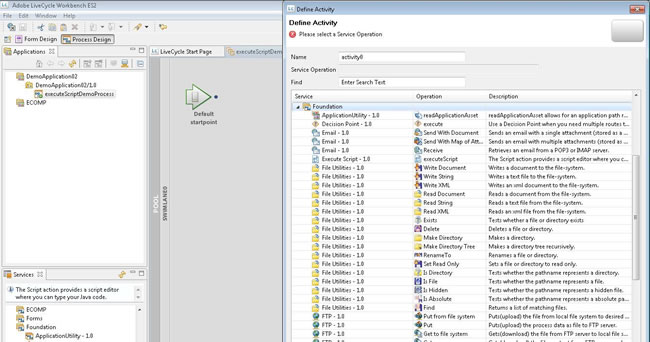

# Uso del servicio de ejecución de secuencias de comandos en AEM Forms en JEE Workbench para generar datos XML {#using-execute-script-service-forms-jee-workbench}

Hay muchos XML involucrados con AEM Forms en flujos de trabajo de administración de procesos JEE, por ejemplo: La información XML puede crearse en un proceso y enviarse a una aplicación de Flex en AEM Forms en el espacio de trabajo JEE, utilizarse para la configuración de sistemas o pasar información a y desde formularios. Hay muchas instancias en las que un desarrollador de AEM Forms en JEE necesita administrar XML, y muchas veces esto requiere que el XML se administre a través de un proceso AEM Forms en JEE.

Cuando se trata de una configuración XML simple, se puede utilizar el servicio `Set Value`, que es un AEM Forms predeterminado en el servicio JEE. Este servicio establece el valor de uno o más elementos de datos en el modelo de datos de proceso. Para una lógica condicional muy simple &quot;si esto, entonces eso&quot; escenarios, este servicio puede ajustarse al propósito.

Sin embargo, en situaciones más complejas, el servicio Definir valor no es tan eficaz. En estas situaciones, se necesita contar con un conjunto más sólido de comandos de programación, como los que proporciona un lenguaje de programación como Java. El uso de Java para crear XML complejo puede ser mucho más fácil y claro que crear un documento XML a partir de texto simple dentro del servicio Definir valor. Además, es más fácil incluir programación condicional en Java que dentro de un servicio Set Value.

## Uso del servicio de ejecución de secuencias de comandos en un proceso {#using-execute-script-service-in-process}

Dentro del conjunto de AEM Forms estándar en servicios JEE disponibles en AEM Forms en JEE Workbench, se encuentra el servicio `Execute Script`. Este servicio permite ejecutar secuencias de comandos en procesos y proporciona la operación `executeScript` para hacerlo.

### Crear una aplicación y un proceso con el servicio &quot;Ejecutar script&quot; definido como una actividad {#create-an-application}

La creación general de aplicaciones y procesos está fuera de alcance para este tutorial, pero en aras de esta instrucción, hemos creado una aplicación denominada &quot;DemoApplication02&quot;. Suponiendo que una aplicación ya se ha creado, necesitamos crear un proceso en esta aplicación para llamar al servicio executeScript. Para agregar un proceso a la aplicación que incluya el servicio `Execute Script`:

1. Haga clic con el botón derecho en la aplicación y seleccione [!UICONTROL New]. En el menú desplegable [!UICONTROL Nuevo], seleccione [!UICONTROL Proceso]. Asigne un nombre al proceso, añada una descripción si es necesario y seleccione el icono que desea que represente este proceso. Para los fines de este tutorial, se ha creado un proceso y se le ha asignado el nombre `executeScriptDemoProcess`.
1. Defina sus puntos iniciales o simplemente elija añadir sus puntos iniciales más adelante.
1. El proceso ahora se crea y debe abrirse automáticamente en la ventana [!UICONTROL Process Design]. En esta ventana, haga clic en el icono Selector de actividades en la parte superior de la ventana Diseño de procesos y arrastre la nueva actividad al carril de navegación. En este punto, debería aparecer [!UICONTROL Define Activity Window] (consulte la figura a continuación).
   
1. El servicio executeScript se puede encontrar en el conjunto `Foundation` de servicios. El nombre de Servicios enumera el objeto como `Execute Script – 1.0` con el nombre de Operación `executeScript`. Haga clic en para seleccionar este elemento.
1. Ahora se debe crear este proceso y, de forma predeterminada, la ventana [!UICONTROL Propiedades del proceso] debe aparecer en el panel de la izquierda.

#### Agregar una secuencia de comandos al proceso con el servicio &quot;Ejecutar secuencia de comandos&quot; {#add-script-to-process-with-execute-script}

Una vez que el proceso se ha creado con la actividad del servicio &quot;Ejecutar script&quot; definida, se puede añadir una secuencia de comandos a este proceso. Para agregar una secuencia de comandos a este proceso:

1. Vaya a la paleta [!UICONTROL Propiedades del proceso]. En esta paleta, expanda la sección [!UICONTROL Input] y haga clic en el icono &quot;...&quot;.

1. En el cuadro de texto que aparece, escriba la secuencia de comandos. Cuando se haya escrito la secuencia de comandos, pulse Aceptar (consulte la Figura siguiente).
   

## Creación de XML mediante el servicio de ejecución de secuencias de comandos {#create-xml-execute-script-service}

Una vez que se ha creado un proceso con el servicio Ejecutar script incluido, se puede utilizar esta secuencia de comandos para crear XML. Uno escribiría las secuencias de comandos que se describen a continuación en el cuadro de texto descrito en la sección Añadir un script al proceso con el servicio `Execute Script` anterior.

**Acerca de la tecnología del servicio Ejecutar Script**

Para saber cuáles son las capacidades y limitaciones del servicio Ejecutar Script, es necesario conocer los fundamentos tecnológicos del servicio. AEM Forms on JEE utiliza el analizador del Modelo de objetos de documento (DOM) de Apache Xerces para crear y almacenar variables XML dentro de procesos. Xerces es una implementación Java de la especificación del Modelo de objetos de documento de W3C; definido [aquí](https://dom.spec.whatwg.org/). La especificación DOM es una forma estándar de manipular XML que existe desde 1998. La implementación Java de Xerces, Xerces-J, es compatible con DOM Level 2 versión 1.0.

Las clases Java utilizadas para almacenar variables XML son:

* org.apache.xerces.dom.NodeImpl y

* org.apache.xerces.dom.DocumentImpl

DocumentImpl es una subclase de NodeImpl, por lo que se puede suponer que cualquier variable de proceso XML es una derivación de NodeImpl. Puede encontrar la documentación de NodeImpl [aquí](http://xerces.apache.org/xerces-j/apiDocs/org/apache/xerces/dom/NodeImpl.html).

**Creación de XML de muestra mediante el servicio Ejecutar script**

Este es un ejemplo de creación de XML, dentro de un servicio de ejecución de secuencias de comandos. El proceso tiene una variable, nodo, que es de tipo XML. El resultado final de esta actividad será un documento XML. Lo que hace ese documento o cómo se aplica al proceso general está fuera de alcance para este tutorial; en última instancia, se reduce a lo que XML debe hacer en la aplicación general. Como se mencionó en la introducción, XML puede utilizarse para muchos fines en AEM Forms en formularios y procesos JEE, esto es simplemente una explicación de cómo codificar la actividad Ejecutar script para generar un documento XML simple.

Una secuencia de comandos Java simple para generar XML tendría este aspecto:

```xml
import org.apache.xerces.dom.DocumentImpl;

import org.w3c.dom.Document;

import org.w3c.dom.Element;


Document document = new DocumentImpl();

Element topLevelResources = document.createElement("resources");

Element resource = document.createElement("resource");

resource.setAttribute("id", "first item id");

resource.setAttribute("value", "first item value");

topLevelResources.appendChild(resource);

document.appendChild(topLevelResources);

patExecContext.setProcessDataValue("/process_data/node", document);
```

>[!NOTE]
>
>que los objetos DOM mencionados deben importarse en la secuencia de comandos.

El resultado de esta secuencia de comandos sencilla es un nuevo documento XML con un nodo variable definido como:

```xml
<resources>

<resource id="first item id" value="first item value"/>

</resources>
```

**Uso de un bucle interactivo para añadir nodos al XML**

También se pueden agregar nodos a una variable XML existente dentro del proceso. La variable, node, contiene el objeto XML que acabamos de crear.

```xml
Document document = patExecContext.getProcessDataValue("/process_data/node");

NodeList childNodes = document.getChildNodes();

int numChildren = childNodes.getLength();

for (int i = 0; i < numChildren; i++)

{

Node currentChild = childNodes.item(i);

if (currentChild.getNodeType() == Node.ELEMENT_NODE)

{

// found the top level node

Element newResource = document.createElement("resource");

newResource.setAttribute("id", "second item id");

newResource.setAttribute("value", "second item value");

currentChild.appendChild(newResource);

break;

}

}

patExecContext.setProcessDataValue("/process_data/node", document);
The variable node in the XML is now set to:

<resources> 

<resource id="first item id" value="first item value"/> 

<resource id="second item id" value="second item value"/> 

</resources>
```


