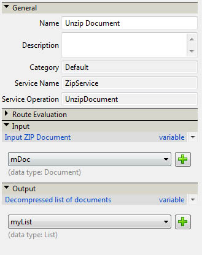

# Compresión y descompresión de archivos mediante una AEM Forms en una DSC personalizada JEE {#compressing-decompressing-files}

## Conocimientos previos {#prerequisites}

Experiencia con AEM Forms en administración de procesos JEE, programación básica de Java y creación de componentes personalizados.

**Otros productos necesarios**

Editor Java como [Eclipse](https://www.eclipse.org/) o [Netbeans IDE](https://netbeans.apache.org/)

## Nivel de usuario {#user-level}

Intermedio

AEM Forms en JEE permite a los desarrolladores crear DSC personalizado (contenedor de servicio de documentos) para crear funciones enriquecidas de fábrica. La creación de estos componentes se puede conectar al entorno de tiempo de ejecución de AEM Forms en JEE y cumple el propósito deseado. Este artículo explica cómo crear un servicio ZIP personalizado que se pueda utilizar para comprimir una lista de archivos en un archivo .zip y descomprimir un .zip a una lista de documentos.

## Creación de un componente DSC personalizado {#create-custom-dsc-component}

Cree un componente DSC personalizado con dos operaciones de servicio para comprimir y descomprimir la lista de documentos. Este componente utiliza el paquete java.util.zip para la compresión y descompresión. Siga los pasos a continuación para crear un componente personalizado:

1. Añadir el archivo adobe-livecycle-client.jar a la biblioteca
1. Añadir los iconos necesarios
1. Crear una clase pública
1. Cree dos métodos públicos llamados UnzipDocument y ZipDocuments
1. Escriba la lógica para Compresión y Decompresión

El código se puede encontrar aquí:

```java
/*
 * Custom DSC : ZIP Utility
 * Purpose: This is a LiveCycle ES2 custom component used to Compress & Decompress List of Documents
 * Author: Nithiyanandam Dharmadass
 * Organization: Ministry of Finance, Kingdom of Bahrain
 * Last modified Date: 18/Apr/2011
 */
package nith.lces2.dsc;

import java.util.zip.ZipEntry;
import java.util.zip.ZipInputStream;
import com.adobe.idp.Document;
import java.io.ByteArrayOutputStream;
import java.io.InputStream;
import java.util.ArrayList;
import java.util.List;
import java.util.zip.ZipOutputStream;

public class ZIPService {

    static final int BUFFER = 2048; // 2MB buffer size

    public java.util.List UnzipDocument(com.adobe.idp.Document zipDocument) throws Exception {
        ZipInputStream zis = new ZipInputStream(zipDocument.getInputStream());

        ZipEntry zipFile;

        List resultList = new ArrayList();

        while ((zipFile = zis.getNextEntry()) != null) {

            ByteArrayOutputStream byteArrayOutStream = new ByteArrayOutputStream();

            int count;  // an int variable to hold the number of bytes read from input stream
            byte data[] = new byte[BUFFER];
            while ((count = zis.read(data, 0, BUFFER)) != -1) {
                byteArrayOutStream.write(data, 0, count);   // write to byte array
            }

            com.adobe.idp.Document unzippedDoc = new Document(byteArrayOutStream.toByteArray());  // create an idp document
            unzippedDoc.setAttribute("file", zipFile.getName());
            unzippedDoc.setAttribute("wsfilename", zipFile.getName());  // update the wsfilename attribute
            resultList.add(unzippedDoc);
        }
        return resultList;  // List of uncompressed documents
    }

    public com.adobe.idp.Document ZipDocuments(java.util.List listOfDocuments,java.lang.String zipFileName) throws Exception {

        if (listOfDocuments == null || listOfDocuments.size() == 0) {
            return null;
        }

        ByteArrayOutputStream byteArrayOutStream = new ByteArrayOutputStream();
        ZipOutputStream zos = new ZipOutputStream(byteArrayOutStream);  // ZIP Output Stream

        for (int i = 0; i < listOfDocuments.size(); i++) {
            Document doc = (Document) listOfDocuments.get(i);
            InputStream docInputStream = doc.getInputStream();
            ZipEntry zipEntry = new ZipEntry(doc.getAttribute("file").toString());
            zos.putNextEntry(zipEntry);
            int count;
            byte data[] = new byte[BUFFER];
            while ((count = docInputStream.read(data, 0, BUFFER)) != -1) {
                zos.write(data, 0, count);  // Read document content and add to zip entry
            }
            zos.closeEntry();
        }
        zos.flush();
        zos.close();

        Document zippedDoc = new Document(byteArrayOutStream.toByteArray());
        if(zipFileName==null || zipFileName.equals(""))
        {
            zipFileName = "CompressedList.zip";
        }
        zippedDoc.setAttribute("file", zipFileName);
        return zippedDoc;
    }
}
```

## Creación de un archivo Component.XML {#create-component-xml-file}

Se debe crear un archivo component.xml dentro de la carpeta raíz del paquete que definió las operaciones de servicio y sus parámetros.

El archivo component.xml se muestra aquí:

```xml
<?xml version="1.0" encoding="UTF-8"?>
<component xmlns="http://adobe.com/idp/dsc/component/document">
<!-- Unique id identifying this component -->
   <component-id>ZipService</component-id>

<!-- Version -->
   <version>1.0</version>

<!-- Start of the Service definition -->
   <services>
<!-- Unique name for service descriptor.
           The value is used as the default name for
           deployed services -->
      <service name="ZipService">
<!-- service implementation class definition -->
        <implementation-class>nith.lces2.dsc.ZIPService</implementation-class>

<!-- description -->
        <description>Compress or Decompress list of documents</description>

<!--  You can provide your own icons for a distinct look   -->
          <small-icon>icons/Zip_icon16.png</small-icon>
          <large-icon>icons/Zip_icon32.png</large-icon>


<!-- automatically deploys the service and starts it after installation -->
         <auto-deploy service-id="ZipService" />

         <operations>
<!-- method name in the interface setSmtpHost-->
            <operation name="UnzipDocument">
<!-- input parameters to the "send" method -->
              <input-parameter name="zipDocument" title="Input ZIP Document" type="com.adobe.idp.Document">
                    <hint>A ZIP File to be decompressed</hint>
                </input-parameter>
                <output-parameter name="resultList" title="Decompressed list of documents" type="java.util.List">
                    <hint>Decompressed ZIP list</hint>
                </output-parameter>
            </operation>
            <operation name="ZipDocuments">
<!-- input parameters to the "send" method -->
              <input-parameter name="listOfDocuments" title="List of Documents" type="java.util.List">
                    <hint>A list of documents to be Compressed</hint>
                </input-parameter>
                <input-parameter name="zipFileName" title="Result File Name" type="java.lang.String">
                    <hint>The name of compressed file (optional)</hint>
                </input-parameter>

                <output-parameter name="zippedDoc" title="Compressed Zip file" type="com.adobe.idp.Document">
                    <hint>Compressed ZIP File</hint>
                </output-parameter>
            </operation>
             </operations>
      </service>
   </services>
</component>
```

## Empaquetado e implementación del componente {#packaging-deploying-component}

1. Compile el proyecto java y cree un archivo .JAR.
1. Implemente el componente (archivo .JAR) en AEM Forms en tiempo de ejecución JEE mediante Workbench.
1. Inicie el servicio desde Workbench (consulte la figura siguiente).


## Uso del servicio ZIP en flujos de trabajo {#using-zip-service-in-workflows}

La operación UnzipDocument del servicio personalizado ahora puede aceptar una variable de documento como entrada y devolver una lista de variables de documento como salida.



Del mismo modo, la operación ZipDocuments del componente personalizado puede aceptar una lista de documentos como entrada, comprimirlos como un archivo zip y devolver el documento comprimido.


La siguiente orquestación de flujo de trabajo muestra cómo descomprimir el archivo ZIP dado, comprimirlo de nuevo en otro archivo ZIP y devuelve el resultado (consulte la figura a continuación).


## Algunos casos de uso empresarial {#business-use-cases}

Puede utilizar este servicio ZIP para los siguientes casos de uso:

* Busque todos los archivos en una carpeta determinada y devuelva los archivos como documento comprimido.

* Suministre un archivo ZIP que contenga varios documentos PDF que se puedan ampliar después de descomprimirlos. Esto requiere AEM Forms en el módulo de extensiones de Reader JEE.

* Proporcione un archivo ZIP que contenga un tipo heterogéneo de documento que se pueda descomprimir y convertir como documento PDF mediante el servicio Generate PDF.

* La directiva protege una lista de documentos y devuelve como archivo ZIP.

* Permita a los usuarios descargar todos los archivos adjuntos de una instancia de proceso como un solo archivo ZIP.


