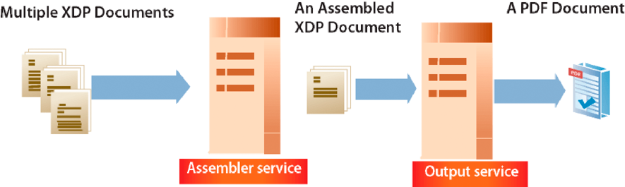

# Creación de flujos de salida de documento {#creating-document-output-streams}

**Los ejemplos y ejemplos de este documento son solo para AEM Forms en un entorno JEE.**

**Acerca del servicio de salida**

El servicio Output permite generar documentos como PDF (incluidos documentos PDF/A), PostScript, Printer Control Language (PCL) y los siguientes formatos de etiqueta:

* Zebra - ZPL
* Interė - IPL
* Datamax - DPL
* TecToshiba - TPCL

Con el servicio Output, puede combinar los datos de formulario XML con un diseño de formulario y enviar el documento a una impresora o archivo de red.

Existen dos formas de pasar un diseño de formulario (un archivo XDP) al servicio Output. Puede pasar una instancia `com.adobe.idp.Document` que contenga un diseño de formulario al servicio Output. O puede pasar un valor de URI que especifique la ubicación del diseño de formulario. Ambas maneras se tratan en *Programación con formularios AEM*.

>[!NOTE]
>
>El servicio Output no admite documentos PDF de Acrobat que contengan secuencias de comandos específicas de objetos de aplicación. No se procesan los documentos PDF que contienen secuencias de comandos específicas de objetos de aplicación.

Las siguientes secciones muestran cómo pasar un diseño de formulario al servicio Output utilizando un valor URI:

* [Creación de documentos PDF](creating-document-output-streams.md#creating-pdf-documents)
* [Creación de documentos PDF/A](creating-document-output-streams.md#creating-pdf-a-documents)

Las secciones siguientes muestran cómo pasar un diseño de formulario dentro de una instancia `com.adobe.idp.Document`:

* [Pasar documentos ubicados en Content Services (obsoleto) al servicio de salida](creating-document-output-streams.md#passing-documents-located-in-content-services-deprecated-to-the-output-service)
* [Creación de documentos PDF mediante fragmentos](creating-document-output-streams.md#creating-pdf-documents-using-fragments)

Una consideración a la hora de decidir qué técnica utilizar es si obtiene el diseño de formulario de otro servicio de AEM Forms y luego lo pasa dentro de una instancia `com.adobe.idp.Document`. Las secciones *Pasar documentos al servicio de salida* y *Crear documentos PDF utilizando fragmentos* muestran cómo obtener un diseño de formulario de otro servicio de AEM Forms. La primera sección recupera el diseño de formulario de Content Services (obsoleto). La segunda sección recupera el diseño de formulario del servicio Assembler.

Si obtiene el diseño de formulario de una ubicación fija, como el sistema de archivos, puede utilizar cualquiera de estas técnicas. Es decir, puede especificar el valor de URI en un archivo XDP o utilizar una instancia `com.adobe.idp.Document`.

Para pasar un valor de URI que especifique la ubicación del diseño de formulario al crear un documento PDF, utilice el método `generatePDFOutput`. Del mismo modo, para pasar una instancia `com.adobe.idp.Document` al servicio Output al crear un documento PDF, utilice el método `generatePDFOutput2`.

Al enviar un flujo de salida a una impresora de red, también puede utilizar cualquiera de estas técnicas. Para enviar un flujo de salida a una impresora pasando una instancia `com.adobe.idp.Document` que contenga un diseño de formulario, utilice el método `sendToPrinter2`. Para enviar un flujo de salida a una impresora pasando un valor URI, utilice el método `sendToPrinter`. La sección *Envío de emisiones de impresión a impresoras* utiliza el método `sendToPrinter`.

Puede realizar estas tareas utilizando el servicio Output :

* [Creación de documentos PDF](creating-document-output-streams.md#creating-pdf-documents)
* [Creación de documentos PDF/A](creating-document-output-streams.md#creating-pdf-a-documents)
* [Pasar documentos ubicados en Content Services (obsoleto) al servicio de salida](creating-document-output-streams.md#passing-documents-located-in-content-services-deprecated-to-the-output-service)
* [Creación de documentos PDF mediante fragmentos](creating-document-output-streams.md#creating-pdf-documents-using-fragments)
* [Imprimir en archivos](creating-document-output-streams.md#printing-to-files)
* [Envío de emisiones de impresión a impresoras](creating-document-output-streams.md#sending-print-streams-to-printers)
* [Creación de varios archivos de salida](creating-document-output-streams.md#creating-multiple-output-files)
* [Creación de reglas de búsqueda](creating-document-output-streams.md#creating-search-rules)
* [Acoplamiento de documentos PDF](creating-document-output-streams.md#flattening-pdf-documents)

>[!NOTE]
>
>Para obtener más información sobre el servicio Output, consulte [Referencia de servicios para AEM Forms](https://www.adobe.com/go/learn_aemforms_services_63).

## Creación de documentos PDF {#creating-pdf-documents}

Puede utilizar el servicio Output para crear un documento PDF basado en un diseño de formulario y en los datos de formulario XML proporcionados. El documento PDF que crea el servicio Output no es un documento PDF interactivo; un usuario no puede introducir ni modificar datos de formulario.

Si desea crear un documento PDF diseñado para almacenamiento a largo plazo, se recomienda crear un documento PDF/A. (Consulte [Creación de documentos PDF/A](creating-document-output-streams.md#creating-pdf-a-documents)).

Para crear un formulario PDF interactivo que permita al usuario introducir datos, utilice el servicio Forms. (Consulte [Representación de PDF forms interactivos](/help/forms/developing/rendering-forms.md#rendering-interactive-pdf-forms)).

>[!NOTE]
>
>Para obtener más información sobre el servicio Output, consulte [Referencia de servicios para AEM Forms](https://www.adobe.com/go/learn_aemforms_services_63).

### Resumen de los pasos {#summary-of-steps}

Para crear un documento PDF, realice los siguientes pasos:

1. Incluir archivos de proyecto.
1. Cree un objeto Cliente de salida.
1. Haga referencia a un origen de datos XML.
1. Establezca las opciones de tiempo de ejecución de PDF.
1. Establezca las opciones de procesamiento en tiempo de ejecución.
1. Genere un documento PDF.
1. Recupere los resultados de la operación.

**Incluir archivos de proyecto**

Incluya los archivos necesarios en el proyecto de desarrollo. Si está creando una aplicación cliente mediante Java, incluya los archivos JAR necesarios. Si utiliza servicios web, asegúrese de incluir los archivos proxy.

Los siguientes archivos JAR deben agregarse a la ruta de clase del proyecto:

* adobe-livecycle-client.jar
* adobe-usermanager-client.jar
* adobe-output-client.jar
* adobe-Utilities.jar (obligatorio si AEM Forms está implementado en JBoss)
* jbossall-client.jar (requerido si AEM Forms está implementado en JBoss)

si AEM Forms se implementa en un servidor de aplicaciones J2EE compatible que no sea JBoss, deberá reemplazar los archivos adobe-Utilities.jar y jbossall-client.jar por archivos JAR específicos del servidor de aplicaciones J2EE en el que se implementa AEM Forms.

**Creación de un objeto de cliente de salida**

Para poder realizar una operación de servicio de salida mediante programación, debe crear un objeto cliente de servicio de salida. Si utiliza la API de Java, cree un objeto `OutputClient`. Si utiliza la API de servicio web de salida, cree un objeto `OutputServiceService`.

**Referencia a un origen de datos XML**

Para combinar datos con el diseño de formulario, debe hacer referencia a un origen de datos XML que contenga datos. Debe existir un elemento XML para cada campo de formulario que desee rellenar con datos. El nombre del elemento XML debe coincidir con el nombre del campo. Se omite un elemento XML si no se corresponde con un campo de formulario o si el nombre del elemento XML no coincide con el nombre del campo. No es necesario coincidir con el orden en que se muestran los elementos XML si se especifican todos los elementos XML.

Consideremos el siguiente ejemplo de formulario de solicitud de préstamo.


Para combinar datos en este diseño de formulario, debe crear un origen de datos XML que corresponda al formulario. El siguiente XML representa un origen de datos XML XDP que corresponde al formulario de aplicación hipotecaria de ejemplo.

```xml
 <?xml version="1.0" encoding="UTF-8" ?>
 - <xfa:datasets xmlns:xfa="https://www.xfa.org/schema/xfa-data/1.0/">
 - <xfa:data>
 - <data>
     - <Layer>
         <closeDate>1/26/2007</closeDate>
         <lastName>Johnson</lastName>
         <firstName>Jerry</firstName>
         <mailingAddress>JJohnson@NoMailServer.com</mailingAddress>
         <city>New York</city>
         <zipCode>00501</zipCode>
         <state>NY</state>
         <dateBirth>26/08/1973</dateBirth>
         <middleInitials>D</middleInitials>
         <socialSecurityNumber>(555) 555-5555</socialSecurityNumber>
         <phoneNumber>5555550000</phoneNumber>
     </Layer>
     - <Mortgage>
         <mortgageAmount>295000.00</mortgageAmount>
         <monthlyMortgagePayment>1724.54</monthlyMortgagePayment>
         <purchasePrice>300000</purchasePrice>
         <downPayment>5000</downPayment>
         <term>25</term>
         <interestRate>5.00</interestRate>
     </Mortgage>
 </data>
 </xfa:data>
 </xfa:datasets>
```

**Definir opciones de tiempo de ejecución de PDF**

Establezca la opción URI de archivo al crear un documento PDF. Esta opción especifica el nombre y la ubicación del archivo PDF que genera el servicio Output.

>[!NOTE]
>
>En lugar de establecer la opción de tiempo de ejecución del URI de archivo, puede recuperar mediante programación el documento PDF del tipo de datos complejo que devuelve el servicio Output. Sin embargo, al establecer la opción de tiempo de ejecución del URI de archivo, no es necesario crear una lógica de aplicación que recupere mediante programación el documento PDF.

**Establecer las opciones de procesamiento en tiempo de ejecución**

Al crear un documento PDF, se pueden definir opciones de procesamiento en tiempo de ejecución. Aunque estas opciones no son necesarias (a diferencia de las opciones de tiempo de ejecución de PDF que son necesarias), puede realizar tareas como mejorar el rendimiento del servicio Output . Por ejemplo, puede almacenar en caché el diseño de formulario que utiliza el servicio Output para mejorar su rendimiento.

Si utiliza un formulario Acrobat etiquetado como entrada, no puede utilizar el Java del servicio de salida o la API del servicio web para desactivar la configuración etiquetada. Si intenta establecer esta opción mediante programación en `false`, el documento PDF resultante seguirá estando etiquetado.

>[!NOTE]
>
>Si no especifica opciones de tiempo de ejecución de procesamiento, se utilizan los valores predeterminados. Para obtener información sobre las opciones de procesamiento en tiempo de ejecución, consulte la referencia de clase `RenderOptionsSpec` . (Consulte [Referencia de la API de AEM Forms](https://www.adobe.com/go/learn_aemforms_javadocs_63_en)).

**Generar un documento PDF**

Después de hacer referencia a un origen de datos XML válido que contiene datos de formulario y de definir las opciones en tiempo de ejecución, puede invocar el servicio Output , que genera un documento PDF.

Al generar un documento PDF, se especifican los valores de URI necesarios para el servicio Output para crear un documento PDF. Un diseño de formulario se puede almacenar en ubicaciones como el sistema de archivos del servidor o como parte de una aplicación de AEM Forms. Se puede hacer referencia a un diseño de formulario (u otros recursos, como un archivo de imagen) que existe como parte de una aplicación de Forms mediante el valor de URI raíz de contenido `repository:///`. Por ejemplo, considere el siguiente diseño de formulario denominado *Loan.xdp* ubicado dentro de una aplicación de Forms denominada *Applications/FormsApplication*:


Para acceder al archivo Loan.xdp que se muestra en la ilustración anterior, especifique `repository:///Applications/FormsApplication/1.0/FormsFolder/` como el tercer parámetro pasado al método `OutputClient` del objeto `generatePDFOutput`. Especifique el nombre del formulario (*Loan.xdp*) como el segundo parámetro pasado al método `OutputClient` del objeto `generatePDFOutput`.

Si el archivo XDP contiene imágenes (u otros recursos como fragmentos), coloque los recursos en la misma carpeta de aplicación que el archivo XDP. AEM Forms utiliza el URI raíz del contenido como ruta base para resolver referencias a imágenes. Por ejemplo, si el archivo Loan.xdp contiene una imagen, asegúrese de colocar la imagen en `Applications/FormsApplication/1.0/FormsFolder/`.

>[!NOTE]
>
>Puede hacer referencia a un URI de aplicación de Forms al invocar los métodos `OutputClient` o `generatePDFOutput` del objeto `generatePrintedOutput`.

>[!NOTE]
>
>Para ver un inicio rápido completo que crea un documento PDF haciendo referencia a un XDP ubicado en una aplicación de Forms, consulte [Inicio rápido (modo EJB): Creación de un documento PDF basado en un archivo XDP de aplicación mediante la API de Java](/help/forms/developing/output-service-java-api-quick.md#quick-start-soap-mode-creating-a-pdf-document-based-on-an-application-xdp-file-using-the-java-api).

**Recuperar los resultados de la operación**

Una vez que el servicio Output realiza una operación, devuelve varios elementos de datos, como datos XML de estado, que especifican si la operación se realizó correctamente.

**Consulte también**

[Creación de un documento PDF mediante la API de Java](creating-document-output-streams.md#create-a-pdf-document-using-the-java-api)

[Creación de un documento PDF mediante la API de servicio Web](creating-document-output-streams.md#create-a-pdf-document-using-the-web-service-api)

[Inclusión de archivos de biblioteca Java de AEM Forms](/help/forms/developing/invoking-aem-forms-using-java.md#including-aem-forms-java-library-files)

[Configuración de las propiedades de conexión](/help/forms/developing/invoking-aem-forms-using-java.md#setting-connection-properties)

[Inicio rápido de la API del servicio de salida](/help/forms/developing/output-service-java-api-quick.md#output-service-java-api-quick-start-soap)

### Crear un documento PDF utilizando la API de Java {#create-a-pdf-document-using-the-java-api}

Cree un documento PDF utilizando la API de salida (Java):

1. Incluir archivos de proyecto.

   Incluya archivos JAR del cliente, como adobe-output-client.jar, en la ruta de clase de su proyecto Java.

1. Cree un objeto Cliente de salida.

   * Cree un objeto `ServiceClientFactory` que contenga propiedades de conexión.
   * Cree un objeto `OutputClient` utilizando su constructor y pasando el objeto `ServiceClientFactory`.

1. Haga referencia a un origen de datos XML.

   * Cree un objeto `java.io.FileInputStream` que represente el origen de datos XML que se utiliza para rellenar el documento PDF utilizando su constructor y pasando un valor de cadena que especifica la ubicación del archivo XML.
   * Cree un objeto `com.adobe.idp.Document` utilizando su constructor. Pase el objeto `java.io.FileInputStream`.

1. Establezca las opciones de tiempo de ejecución de PDF.

   * Cree un objeto `PDFOutputOptionsSpec` utilizando su constructor.
   * Establezca la opción URI de archivo invocando el método `PDFOutputOptionsSpec` del objeto `setFileURI`. Pase un valor de cadena que especifique la ubicación del archivo PDF que genera el servicio Output. La opción URI de archivo es relativa al servidor de aplicaciones J2EE que aloja AEM Forms, no al equipo cliente.

1. Establezca las opciones de procesamiento en tiempo de ejecución.

   * Cree un objeto `RenderOptionsSpec` utilizando su constructor.
   * Almacene en caché el diseño de formulario para mejorar el rendimiento del servicio Output invocando `RenderOptionsSpec` del objeto `setCacheEnabled` y pasando `true`.

   >[!NOTE]
   >
   >No se puede establecer la versión del documento PDF utilizando el método `RenderOptionsSpec` del objeto `setPdfVersion` si el documento de entrada es un formulario de Acrobat (un formulario creado en Acrobat) o un documento XFA que está firmado o certificado. El documento PDF de salida conserva la versión PDF original. Del mismo modo, no se puede establecer la opción Adobe PDF etiquetada invocando el método `RenderOptionsSpec` del objeto `setTaggedPDF` si el documento de entrada es un formulario de Acrobat o un documento XFA firmado o certificado.

   >[!NOTE]
   >
   >No se puede establecer la opción PDF linealizado utilizando el método `RenderOptionsSpec` del objeto `setLinearizedPDF` si el documento PDF de entrada está certificado o firmado digitalmente. (Consulte [Firma digital de documentos PDF ](/help/forms/developing/digitally-signing-certifying-documents.md#digitally-signing-pdf-documents)*.)*

1. Genere un documento PDF.

   Cree un documento PDF invocando el método `OutputClient` del objeto `generatePDFOutput` y pasando los siguientes valores:

   * Un valor de enumeración `TransformationFormat`. Para generar un documento PDF, especifique `TransformationFormat.PDF`.
   * Un valor de cadena que especifica el nombre del diseño de formulario.
   * Un valor de cadena que especifica la raíz del contenido donde se encuentra el diseño de formulario.
   * Un objeto `PDFOutputOptionsSpec` que contiene opciones de tiempo de ejecución de PDF.
   * Un objeto `RenderOptionsSpec` que contiene opciones de procesamiento en tiempo de ejecución.
   * El objeto `com.adobe.idp.Document` que contiene el origen de datos XML que contiene los datos que se van a combinar con el diseño de formulario.

   El método `generatePDFOutput` devuelve un objeto `OutputResult` que contiene los resultados de la operación.

   >[!NOTE]
   >
   >Cuando genere un documento PDF invocando el método `generatePDFOutput`, tenga en cuenta que no puede combinar datos con un formulario PDF XFA que esté firmado o certificado. (Consulte [Firma y certificación digitales de documentos ](/help/forms/developing/digitally-signing-certifying-documents.md#digitally-signing-and-certifying-documents)*)*.

   >[!NOTE]
   >
   >El método `OutputResult` del objeto `getRecordLevelMetaDataList` devuelve `null`*.*

   >[!NOTE]
   >
   >También puede crear un documento PDF invocando el método `OutputClient` del objeto `generatePDFOutput2`. (Consulte [Pasar documentos ubicados en los servicios de contenido (obsoletos) al servicio de salida ](creating-document-output-streams.md#passing-documents-located-in-content-services-deprecated-to-the-output-service)*.)*

1. Recupere los resultados de la operación.

   * Recupere un objeto `com.adobe.idp.Document` que represente el estado de la operación `generatePDFOutput` invocando el método `OutputResult` del objeto `getStatusDoc`. Este método devuelve datos XML de estado que especifican si la operación se realizó correctamente.
   * Cree un objeto `java.io.File` que contenga los resultados de la operación. Asegúrese de que la extensión del nombre de archivo es .xml.
   * Invoque el método `com.adobe.idp.Document` del objeto `copyToFile` para copiar el contenido del objeto `com.adobe.idp.Document` en el archivo (asegúrese de utilizar el objeto `com.adobe.idp.Document` que devolvió el método `getStatusDoc`).

   Aunque el servicio Output escribe el documento PDF en la ubicación especificada por el argumento que se pasa al método `PDFOutputOptionsSpec` del objeto `setFileURI`, puede recuperar mediante programación el documento PDF/A invocando el método `OutputResult` del objeto `getGeneratedDoc`.

**Consulte también**

[Resumen de los pasos](creating-document-output-streams.md#summary-of-steps)

[Inicio rápido (modo EJB): Creación de un documento PDF mediante la API de Java](/help/forms/developing/output-service-java-api-quick.md#quick-start-soap-mode-creating-a-pdf-document-using-the-java-api)

[Inicio rápido (modo SOAP): Creación de un documento PDF mediante la API de Java](/help/forms/developing/output-service-java-api-quick.md#quick-start-soap-mode-creating-a-pdf-document-using-the-java-api)

[Inclusión de archivos de biblioteca Java de AEM Forms](/help/forms/developing/invoking-aem-forms-using-java.md#including-aem-forms-java-library-files)

[Configuración de las propiedades de conexión](/help/forms/developing/invoking-aem-forms-using-java.md#setting-connection-properties)

### Crear un documento PDF utilizando la API de servicio Web {#create-a-pdf-document-using-the-web-service-api}

Cree un documento PDF utilizando la API de salida (servicio web):

1. Incluir archivos de proyecto.

   Cree un proyecto de Microsoft .NET que utilice MTOM. Asegúrese de utilizar la siguiente definición WSDL: `http://localhost:8080/soap/services/OutputService?WSDL&lc_version=9.0.1`.

   >[!NOTE]
   >
   >Sustituya `localhost` por la dirección IP del servidor que hospeda AEM Forms.

1. Cree un objeto Cliente de salida.

   * Cree un objeto `OutputServiceClient` utilizando su constructor predeterminado.
   * Cree un objeto `OutputServiceClient.Endpoint.Address` utilizando el constructor `System.ServiceModel.EndpointAddress`. Pase un valor de cadena que especifique el WSDL al servicio de AEM Forms (por ejemplo, `http://localhost:8080/soap/services/OutputService?blob=mtom`). No es necesario utilizar el atributo `lc_version`. Este atributo se utiliza al crear una referencia de servicio. Sin embargo, especifique `?blob=mtom` para usar MTOM.
   * Cree un objeto `System.ServiceModel.BasicHttpBinding` obteniendo el valor del campo `OutputServiceClient.Endpoint.Binding`. Establezca el valor devuelto en `BasicHttpBinding`.
   * Establezca el campo `System.ServiceModel.BasicHttpBinding` del objeto `MessageEncoding` en `WSMessageEncoding.Mtom`. Este valor garantiza que se utilice MTOM.
   * Habilite la autenticación HTTP básica realizando las siguientes tareas:

      * Asigne el nombre de usuario de los formularios AEM al campo `OutputServiceClient.ClientCredentials.UserName.UserName`.
      * Asigne el valor de contraseña correspondiente al campo `OutputServiceClient.ClientCredentials.UserName.Password`.
      * Asigne el valor constante `HttpClientCredentialType.Basic` al campo `BasicHttpBindingSecurity.Transport.ClientCredentialType`.
      * Asigne el valor constante `BasicHttpSecurityMode.TransportCredentialOnly` al campo `BasicHttpBindingSecurity.Security.Mode`.

1. Haga referencia a un origen de datos XML.

   * Cree un objeto `BLOB` utilizando su constructor. El objeto `BLOB` se utiliza para almacenar datos XML que se combinarán con el documento PDF.
   * Cree un objeto `System.IO.FileStream` invocando su constructor y pasando un valor de cadena que represente la ubicación del archivo XML que contiene los datos del formulario.
   * Cree una matriz de bytes que almacene el contenido del objeto `System.IO.FileStream`. Puede determinar el tamaño de la matriz de bytes obteniendo la propiedad `System.IO.FileStream` del objeto `Length`.
   * Rellene la matriz de bytes con datos de flujo invocando el método `System.IO.FileStream` del objeto `Read` y pasando la matriz de bytes, la posición de inicio y la longitud de flujo para leer.
   * Rellene el objeto `BLOB` asignando su campo `MTOM` con el contenido de la matriz de bytes.

1. Definir opciones de tiempo de ejecución de PDF

   * Cree un objeto `PDFOutputOptionsSpec` utilizando su constructor.
   * Establezca la opción URI de archivo asignando un valor de cadena que especifica la ubicación del archivo PDF que genera el servicio Output al miembro de datos `PDFOutputOptionsSpec` del objeto `fileURI`. La opción URI de archivo es relativa al servidor de aplicaciones J2EE que aloja AEM Forms, no al equipo cliente.

1. Establezca las opciones de procesamiento en tiempo de ejecución.

   * Cree un objeto `RenderOptionsSpec` utilizando su constructor.
   * Almacene en caché el diseño de formulario para mejorar el rendimiento del servicio Output asignando el valor `true` al miembro de datos `RenderOptionsSpec` del objeto `cacheEnabled`.

   >[!NOTE]
   >
   >No se puede establecer la versión del documento PDF utilizando el método `RenderOptionsSpec` del objeto `setPdfVersion` si el documento de entrada es un formulario de Acrobat (un formulario creado en Acrobat) o un documento XFA que está firmado o certificado. El documento PDF de salida conserva la versión PDF original. Del mismo modo, no se puede establecer la opción Adobe PDF etiquetada invocando el método `RenderOptionsSpec` del objeto `setTaggedPDF`* si el documento de entrada es un formulario de Acrobat o un documento XFA firmado o certificado.*

   >[!NOTE]
   >
   >No se puede establecer la opción PDF linealizado utilizando el miembro `RenderOptionsSpec` del objeto `linearizedPDF` si el documento PDF de entrada está certificado o firmado digitalmente. (Consulte [Firma digital de documentos PDF ](/help/forms/developing/digitally-signing-certifying-documents.md#digitally-signing-pdf-documents)*.)*

1. Genere un documento PDF.

   Para crear un documento PDF, invoque el método `OutputServiceService` del objeto `generatePDFOutput`y pase los valores siguientes:

   * Un valor de enumeración `TransformationFormat`. Para generar un documento PDF, especifique `TransformationFormat.PDF`.
   * Un valor de cadena que especifica el nombre del diseño de formulario.
   * Un valor de cadena que especifica la raíz del contenido donde se encuentra el diseño de formulario.
   * Un objeto `PDFOutputOptionsSpec` que contiene opciones de tiempo de ejecución de PDF.
   * Un objeto `RenderOptionsSpec` que contiene opciones de procesamiento en tiempo de ejecución.
   * El objeto `BLOB` que contiene el origen de datos XML que contiene los datos que se van a combinar con el diseño de formulario.
   * Un objeto `BLOB` que se rellena con el método `generatePDFOutput`. El método `generatePDFOutput` rellena este objeto con metadatos generados que describen el documento. (Este valor de parámetro solo es necesario para la invocación de servicio web).
   * Un objeto `BLOB` que se rellena con el método `generatePDFOutput`. El método `generatePDFOutput` rellena este objeto con datos de resultados. (Este valor de parámetro solo es necesario para la invocación de servicio web).
   * Un objeto `OutputResult` que contiene los resultados de la operación. (Este valor de parámetro solo es necesario para la invocación de servicio web).

   >[!NOTE]
   >
   >Cuando genere un documento PDF invocando el método `generatePDFOutput`, tenga en cuenta que no puede combinar datos con un formulario PDF XFA que esté firmado o certificado. (Consulte [Firma y certificación digitales de documentos ](/help/forms/developing/digitally-signing-certifying-documents.md#digitally-signing-and-certifying-documents)*)*.

   >[!NOTE]
   >
   >También puede crear un documento PDF invocando el método `OutputClient` del objeto `generatePDFOutput2`. (Consulte [Pasar documentos ubicados en los servicios de contenido (obsoletos) al servicio de salida ](creating-document-output-streams.md#passing-documents-located-in-content-services-deprecated-to-the-output-service)*.)*

1. Recupere los resultados de la operación.

   * Cree un objeto `System.IO.FileStream` invocando su constructor y pasando un valor de cadena que represente una ubicación de archivo XML que contenga datos de resultados. Asegúrese de que la extensión del nombre de archivo es .xml.
   * Cree una matriz de bytes que almacene el contenido de datos del objeto `BLOB` que el método `OutputServiceService` del objeto `generatePDFOutput` rellenó con datos de resultados (el octavo parámetro). Rellene la matriz de bytes obteniendo el valor del `BLOB` `MTOM` `field` del objeto .
   * Cree un objeto `System.IO.BinaryWriter` invocando su constructor y pasando el objeto `System.IO.FileStream`.
   * Escriba el contenido de la matriz de bytes en el archivo XML invocando el método `System.IO.BinaryWriter` del objeto `Write` y pasando la matriz de bytes.

   Consulte también

   [Resumen de los pasos](creating-document-output-streams.md#summary-of-steps)

   [Invocación de AEM Forms mediante MTOM](/help/forms/developing/invoking-aem-forms-using-web.md#invoking-aem-forms-using-mtom)

   [Invocación de AEM Forms mediante SwaRef](/help/forms/developing/invoking-aem-forms-using-web.md#invoking-aem-forms-using-swaref)

   >[!NOTE]
   >
   >El método `OutputServiceService` del objeto `generateOutput` está obsoleto.

## Creación de documentos PDF/A {#creating-pdf-a-documents}

Puede utilizar el servicio Output para crear un documento PDF/A. Dado que PDF/A es un formato de archivo para la preservación a largo plazo del contenido del documento, todas las fuentes están incrustadas y el archivo no está comprimido. Como resultado, un documento PDF/A suele ser más grande que un documento PDF estándar. Además, un documento PDF/A no contiene contenido de audio y vídeo. Al igual que otras tareas del servicio de salida, se proporciona un diseño de formulario y datos para combinar con un diseño de formulario para crear un documento PDF/A.

La especificación PDF/A-1 consta de dos niveles de conformidad, a saber, a y b. La principal diferencia entre ambos es la compatibilidad con la estructura lógica (accesibilidad), que no es necesaria para el nivel de conformidad b. Independientemente del nivel de conformidad, PDF/A-1 dicta que todas las fuentes están incrustadas en el documento PDF/A generado.

Aunque PDF/A es el estándar para archivar documentos PDF, no es obligatorio que PDF/A se utilice para archivar si un documento PDF estándar satisface las necesidades de su empresa. El propósito del estándar PDF/A es establecer un archivo PDF que se pueda almacenar durante un largo período de tiempo, así como cumplir los requisitos de conservación de documentos. Por ejemplo, una URL no se puede incrustar en un PDF/A porque con el tiempo la URL puede no ser válida.

Su organización debe evaluar sus propias necesidades, el tiempo durante el cual desea mantener el documento, las consideraciones sobre el tamaño del archivo y determinar su propia estrategia de archiving. Puede determinar mediante programación si un documento PDF es compatible con PDF/A mediante el servicio DocConverter. (Consulte [Determinación mediante programación del cumplimiento de PDF/A](/help/forms/developing/pdf-a-documents.md#programmatically-determining-pdf-a-compliancy)).

Un documento PDF/A debe utilizar la fuente especificada en el diseño de formulario y las fuentes no se pueden sustituir. Como resultado, si una fuente ubicada dentro de un documento PDF no está disponible en el sistema operativo (OS) del host, se produce una excepción.

Cuando se abre un documento PDF/A en Acrobat, aparece un mensaje que confirma que el documento es un documento PDF/A, como se muestra en la siguiente ilustración.


>[!NOTE]
>
>El sitio web de AIIM tiene una sección de preguntas más frecuentes en PDF/A a la que puede acceder desde [https://www.aiim.org/documents/standards/19005-1_FAQ.pdf](https://www.aiim.org/documents/standards/19005-1_FAQ.pdf).

>[!NOTE]
>
>Para obtener más información sobre el servicio Output, consulte [Referencia de servicios para AEM Forms](https://www.adobe.com/go/learn_aemforms_services_63).

### Resumen de los pasos {#summary_of_steps-1}

Para crear un documento PDF/A, realice los siguientes pasos:

1. Incluir archivos de proyecto.
1. Cree un objeto Cliente de salida.
1. Haga referencia a un origen de datos XML.
1. Establezca las opciones de ejecución de PDF/A.
1. Establezca las opciones de procesamiento en tiempo de ejecución.
1. Genere un documento PDF/A.
1. Recupere los resultados de la operación.

**Incluir archivos de proyecto**

Incluya los archivos necesarios en el proyecto de desarrollo. Si está creando una aplicación personalizada mediante Java, incluya los archivos JAR necesarios. Si utiliza servicios web, asegúrese de incluir los archivos proxy.

Los siguientes archivos JAR deben agregarse a la ruta de clase del proyecto:

* adobe-livecycle-client.jar
* adobe-usermanager-client.jar
* adobe-output-client.jar
* adobe-Utilities.jar (obligatorio si AEM Forms está implementado en JBoss)
* jbossall-client.jar (requerido si AEM Forms está implementado en JBoss)

si AEM Forms se implementa en un servidor de aplicaciones J2EE compatible que no sea JBoss, deberá reemplazar los archivos adobe-Utilities.jar y jbossall-client.jar por archivos JAR específicos del servidor de aplicaciones J2EE en el que se implementa AEM Forms.

**Creación de un objeto de cliente de salida**

Para poder realizar una operación de servicio de salida mediante programación, debe crear un objeto cliente de servicio de salida. Si utiliza la API de Java, cree un objeto `OutputClient`. Si utiliza la API de servicio web de salida, cree un objeto `OutputServiceService`.

**Referencia a un origen de datos XML**

Para combinar datos con el diseño de formulario, debe hacer referencia a un origen de datos XML que contenga datos. Debe existir un elemento XML para cada campo de formulario que desee rellenar con datos. El nombre del elemento XML debe coincidir con el nombre del campo. Se omite un elemento XML si no se corresponde con un campo de formulario o si el nombre del elemento XML no coincide con el nombre del campo. No es necesario coincidir con el orden en que se muestran los elementos XML si se especifican todos los elementos XML.

**Establecer opciones de ejecución de PDF/A**

Puede definir la opción URI de archivo al crear un documento PDF/A. El URI es relativo al servidor de aplicaciones J2EE que aloja AEM Forms. Es decir, si establece C:\Adobe, el archivo se escribe en la carpeta del servidor, no en el equipo cliente. El URI especifica el nombre y la ubicación del archivo PDF/A que genera el servicio Output.

**Establecer las opciones de procesamiento en tiempo de ejecución**

Al crear documentos PDF/A, puede definir opciones de procesamiento en tiempo de ejecución. Dos opciones relacionadas con PDF/A que puede establecer son los valores `PDFAConformance` y `PDFARevisionNumber`. El valor `PDFAConformance` hace referencia a cómo se adhiere un documento PDF a los requisitos que especifican cómo se conservan los documentos electrónicos a largo plazo. Los valores válidos para esta opción son `A` y `B`. Para obtener información sobre la conformidad con los niveles a y b, consulte la especificación PDF/A-1 ISO titulada *ISO 19005-1 Document management*.

El valor `PDFARevisionNumber` hace referencia al número de revisión de un documento PDF/A. Para obtener información sobre el número de revisión de un documento PDF/A, consulte la especificación PDF/A-1 ISO con el título *ISO 19005-1 Document management*.

>[!NOTE]
>
>No se puede establecer la opción Adobe PDF etiquetada en `false` al crear un documento PDF/A 1A. PDF/A 1A siempre será un documento PDF con etiquetas. Tampoco puede establecer la opción Adobe PDF etiquetada en `true` al crear un documento PDF/A 1B. PDF/A 1B siempre será un documento PDF sin etiquetar.

**Generar un documento PDF/A**

Después de hacer referencia a un origen de datos XML válido que contiene datos de formulario y de definir las opciones en tiempo de ejecución, puede invocar el servicio Output, lo que hace que genere un documento PDF/A.

**Recuperar los resultados de la operación**

Una vez que el servicio Output realiza una operación, devuelve varios elementos de datos, como datos XML, que especifican si la operación se realizó correctamente.

**Consulte también**

[Creación de un documento PDF/A mediante la API de Java](creating-document-output-streams.md#create-a-pdf-a-document-using-the-java-api)

[Creación de un documento PDF/A mediante la API de servicio web](creating-document-output-streams.md#create-a-pdf-a-document-using-the-web-service-api)

[Inclusión de archivos de biblioteca Java de AEM Forms](/help/forms/developing/invoking-aem-forms-using-java.md#including-aem-forms-java-library-files)

[Configuración de las propiedades de conexión](/help/forms/developing/invoking-aem-forms-using-java.md#setting-connection-properties)

[Inicio rápido de la API del servicio de salida](/help/forms/developing/output-service-java-api-quick.md#output-service-java-api-quick-start-soap)

### Creación de un documento PDF/A mediante la API de Java {#create-a-pdf-a-document-using-the-java-api}

Cree un documento PDF/A utilizando la API de salida (Java):

1. Incluir archivos de proyecto.

   Incluya archivos JAR del cliente, como adobe-output-client.jar, en la ruta de clase de su proyecto Java.

1. Cree un objeto Cliente de salida.

   * Cree un objeto `ServiceClientFactory` que contenga propiedades de conexión.
   * Cree un objeto `OutputClient` utilizando su constructor y pasando el objeto `ServiceClientFactory`.

1. Haga referencia a un origen de datos XML.

   * Cree un objeto `java.io.FileInputStream` que represente el origen de datos XML que se utiliza para rellenar el documento PDF/A utilizando su constructor y pasando un valor de cadena que especifique la ubicación del archivo XML.
   * Cree un objeto `com.adobe.idp.Document` utilizando su constructor y pasando el objeto `java.io.FileInputStream`.

1. Establezca las opciones de ejecución de PDF/A.

   * Cree un objeto `PDFOutputOptionsSpec` utilizando su constructor.
   * Establezca la opción URI de archivo invocando el método `PDFOutputOptionsSpec` del objeto `setFileURI`. Pase un valor de cadena que especifique la ubicación del archivo PDF que genera el servicio Output. La opción URI de archivo es relativa al servidor de aplicaciones J2EE que aloja AEM Forms, no al equipo cliente.

1. Establezca las opciones de procesamiento en tiempo de ejecución.

   * Cree un objeto `RenderOptionsSpec` utilizando su constructor.
   * Establezca el valor `PDFAConformance` invocando el método `RenderOptionsSpec` del objeto `setPDFAConformance` y pasando un valor de enumeración `PDFAConformance` que especifica el nivel de conformidad. Por ejemplo, para especificar el nivel de conformidad A, pase `PDFAConformance.A`.
   * Establezca el valor `PDFARevisionNumber` invocando el método `RenderOptionsSpec` del objeto `setPDFARevisionNumber` y pasando `PDFARevisionNumber.Revision_1`.

   >[!NOTE]
   >
   >La versión PDF de un documento PDF/A es 1.4 independientemente del valor que especifique para el método `setPdfVersion`*del objeto `RenderOptionsSpec`.*

1. Genere un documento PDF/A.

   Cree un documento PDF/A invocando el método `OutputClient` del objeto `generatePDFOutput` y pasando los siguientes valores:

   * Un valor de enumeración `TransformationFormat`. Para generar un documento PDF/A, especifique `TransformationFormat.PDFA`.
   * Un valor de cadena que especifica el nombre del diseño de formulario.
   * Un valor de cadena que especifica la raíz del contenido donde se encuentra el diseño de formulario.
   * Un objeto `PDFOutputOptionsSpec` que contiene opciones de tiempo de ejecución de PDF.
   * Un objeto `RenderOptionsSpec` que contiene opciones de procesamiento en tiempo de ejecución.
   * El objeto `com.adobe.idp.Document` que contiene el origen de datos XML que contiene los datos que se van a combinar con el diseño de formulario.

   El método `generatePDFOutput` devuelve un objeto `OutputResult` que contiene los resultados de la operación.

   >[!NOTE]
   >
   >El método `OutputResult` del objeto `getRecordLevelMetaDataList` devuelve `null`.

   >[!NOTE]
   >
   >También puede crear un documento PDF/A invocando el método `OutputClient` del objeto `generatePDFOutput`2. (Consulte [Pasar documentos ubicados en los servicios de contenido (obsoletos) al servicio de salida](creating-document-output-streams.md#passing-documents-located-in-content-services-deprecated-to-the-output-service)).

1. Recupere los resultados de la operación.

   * Cree un objeto `com.adobe.idp.Document` que represente el estado del método `generatePDFOutput` invocando el método `OutputResult` del objeto `getStatusDoc`.
   * Cree un objeto `java.io.File` que contenga los resultados de la operación. Asegúrese de que la extensión del nombre de archivo es .xml.
   * Invoque el método `com.adobe.idp.Document` del objeto `copyToFile` para copiar el contenido del objeto `com.adobe.idp.Document` en el archivo (asegúrese de utilizar el objeto `com.adobe.idp.Document` que devolvió el método `getStatusDoc`).

   >[!NOTE]
   >
   >Aunque el servicio Output escribe el documento PDF/A en la ubicación especificada por el argumento que se pasa al método `PDFOutputOptionsSpec` del objeto `setFileURI`, puede recuperar mediante programación el documento PDF/A invocando el método `OutputResult` del objeto `getGeneratedDoc`.

**Consulte también**

[Resumen de los pasos](creating-document-output-streams.md#summary-of-steps)

[Inicio rápido (modo SOAP): Creación de un documento PDF/A mediante la API de Java](/help/forms/developing/output-service-java-api-quick.md#quick-start-soap-mode-creating-a-pdf-a-document-using-the-java-api)

[Inclusión de archivos de biblioteca Java de AEM Forms](/help/forms/developing/invoking-aem-forms-using-java.md#including-aem-forms-java-library-files)

[Configuración de las propiedades de conexión](/help/forms/developing/invoking-aem-forms-using-java.md#setting-connection-properties).

### Creación de un documento PDF/A mediante la API de servicio Web {#create-a-pdf-a-document-using-the-web-service-api}

Cree un documento PDF/A utilizando la API de salida (servicio web):

1. Incluir archivos de proyecto.

   Cree un proyecto de Microsoft .NET que utilice MTOM. Asegúrese de utilizar la siguiente definición WSDL: `http://localhost:8080/soap/services/OutputService?WSDL&lc_version=9.0.1`.

   >[!NOTE]
   >
   >Sustituya `localhost` por la dirección IP del servidor que hospeda AEM Forms.

1. Cree un objeto Cliente de salida.

   * Cree un objeto `OutputServiceClient` utilizando su constructor predeterminado.
   * Cree un objeto `OutputServiceClient.Endpoint.Address` utilizando el constructor `System.ServiceModel.EndpointAddress`. Pase un valor de cadena que especifique el WSDL al servicio de AEM Forms (por ejemplo, `http://localhost:8080/soap/services/OutputService?blob=mtom`). No es necesario utilizar el atributo `lc_version`. Este atributo se utiliza al crear una referencia de servicio. Sin embargo, especifique `?blob=mtom` para usar MTOM.
   * Cree un objeto `System.ServiceModel.BasicHttpBinding` obteniendo el valor del campo `OutputServiceClient.Endpoint.Binding`. Establezca el valor devuelto en `BasicHttpBinding`.
   * Establezca el campo `System.ServiceModel.BasicHttpBinding` del objeto `MessageEncoding` en `WSMessageEncoding.Mtom`. Este valor garantiza que se utilice MTOM.
   * Habilite la autenticación HTTP básica realizando las siguientes tareas:

      * Asigne el nombre de usuario de los formularios AEM al campo `OutputServiceClient.ClientCredentials.UserName.UserName`.
      * Asigne el valor de contraseña correspondiente al campo `OutputServiceClient.ClientCredentials.UserName.Password`.
      * Asigne el valor constante `HttpClientCredentialType.Basic` al campo `BasicHttpBindingSecurity.Transport.ClientCredentialType`.
      * Asigne el valor constante `BasicHttpSecurityMode.TransportCredentialOnly` al campo `BasicHttpBindingSecurity.Security.Mode`.

1. Haga referencia a un origen de datos XML.

   * Cree un objeto `BLOB` utilizando su constructor. El objeto `BLOB` se utiliza para almacenar datos que se combinarán con el documento PDF/A.
   * Cree un objeto `System.IO.FileStream` invocando su constructor y pasando un valor de cadena que represente la ubicación del archivo del documento PDF que desea cifrar y el modo en que desea abrir el archivo.
   * Cree una matriz de bytes que almacene el contenido del objeto `System.IO.FileStream`. Puede determinar el tamaño de la matriz de bytes obteniendo la propiedad `System.IO.FileStream` del objeto `Length`.
   * Rellene la matriz de bytes con datos de flujo invocando el método `System.IO.FileStream` del objeto `Read` y pasando la matriz de bytes, la posición de inicio y la longitud de flujo para leer.
   * Rellene el objeto `BLOB` asignando su campo `MTOM` con el contenido de la matriz de bytes.

1. Establezca las opciones de ejecución de PDF/A.

   * Cree un objeto `PDFOutputOptionsSpec` utilizando su constructor.
   * Establezca la opción URI de archivo asignando un valor de cadena que especifica la ubicación del archivo PDF que genera el servicio Output al miembro de datos `PDFOutputOptionsSpec` del objeto `fileURI`. La opción URI de archivo es relativa al servidor de aplicaciones J2EE que aloja AEM Forms, no al equipo cliente

1. Establezca las opciones de procesamiento en tiempo de ejecución.

   * Cree un objeto `RenderOptionsSpec` utilizando su constructor.
   * Establezca el valor `PDFAConformance` asignando un valor de enumeración `PDFAConformance` al miembro de datos `RenderOptionsSpec` del objeto `PDFAConformance`. Por ejemplo, para especificar el nivel de conformidad A, asigne `PDFAConformance.A` a este miembro de datos.
   * Establezca el valor `PDFARevisionNumber` asignando un valor de enumeración `PDFARevisionNumber` al miembro de datos `RenderOptionsSpec` del objeto `PDFARevisionNumber`. Asigne `PDFARevisionNumber.Revision_1` a este miembro de datos.

   >[!NOTE]
   >
   >La versión PDF de un documento PDF/A es 1.4 independientemente del valor que especifique.

1. Genere un documento PDF/A.

   Para crear un documento PDF, invoque el método `OutputServiceService` del objeto `generatePDFOutput`y pase los valores siguientes:

   * Un valor de enumeración TransformationFormat . Para generar un documento PDF, especifique `TransformationFormat.PDFA`.
   * Un valor de cadena que especifica el nombre del diseño de formulario.
   * Un valor de cadena que especifica la raíz del contenido donde se encuentra el diseño de formulario.
   * Un objeto `PDFOutputOptionsSpec` que contiene opciones de tiempo de ejecución de PDF.
   * Un objeto `RenderOptionsSpec` que contiene opciones de procesamiento en tiempo de ejecución.
   * El objeto `BLOB` que contiene el origen de datos XML que contiene los datos que se van a combinar con el diseño de formulario.
   * Un objeto `BLOB` que se rellena con el método `generatePDFOutput`. El método `generatePDFOutput` rellena este objeto con metadatos generados que describen el documento. (Este valor de parámetro solo es necesario para invocar un servicio web).
   * Un objeto `BLOB` que se rellena con el método `generatePDFOutput`. El método `generatePDFOutput` rellena este objeto con datos de resultados. (Este valor de parámetro solo es necesario para invocar un servicio web).
   * Un objeto `OutputResult` que contiene los resultados de la operación. (Este valor de parámetro solo es necesario para invocar un servicio web).

   >[!NOTE]
   >
   >También puede crear un documento PDF/A invocando el método `OutputClient` del objeto `generatePDFOutput`2. (Consulte [Pasar documentos ubicados en los servicios de contenido (obsoletos) al servicio de salida](creating-document-output-streams.md#passing-documents-located-in-content-services-deprecated-to-the-output-service)).

1. Recupere los resultados de la operación.

   * Cree un objeto `System.IO.FileStream` invocando su constructor y pasando un valor de cadena que represente una ubicación de archivo XML que contenga datos de resultados. Asegúrese de que la extensión del nombre de archivo es .xml.
   * Cree una matriz de bytes que almacene el contenido de datos del objeto `BLOB` que el método `OutputServiceService` del objeto `generatePDFOutput` rellenó con datos de resultados (el octavo parámetro). Rellene la matriz de bytes obteniendo el valor del campo `BLOB` del objeto `MTOM`.
   * Cree un objeto `System.IO.BinaryWriter` invocando su constructor y pasando el objeto `System.IO.FileStream`.
   * Escriba el contenido de la matriz de bytes en el archivo XML invocando el método `System.IO.BinaryWriter` del objeto `Write` y pasando la matriz de bytes.

**Consulte también**

[Resumen de los pasos](creating-document-output-streams.md#summary-of-steps)

[Invocación de AEM Forms mediante MTOM](/help/forms/developing/invoking-aem-forms-using-web.md#invoking-aem-forms-using-mtom)

[Invocación de AEM Forms mediante SwaRef](/help/forms/developing/invoking-aem-forms-using-web.md#invoking-aem-forms-using-swaref)

## Pasar documentos ubicados en Content Services (obsoleto) al servicio de salida {#passing-documents-located-in-content-services-deprecated-to-the-output-service}

El servicio Output procesa un formulario PDF no interactivo basado en un diseño de formulario que normalmente se guarda como archivo XDP y se crea en Designer. Puede pasar un objeto `com.adobe.idp.Document` que contenga el diseño de formulario al servicio Output. A continuación, el servicio Output procesa el diseño de formulario ubicado en el objeto `com.adobe.idp.Document`.

Una ventaja de pasar un objeto `com.adobe.idp.Document` al servicio Output es que otras operaciones del servicio AEM Forms devuelven una instancia `com.adobe.idp.Document`. Es decir, puede obtener una instancia `com.adobe.idp.Document` de otra operación de servicio y procesarla. Por ejemplo, supongamos que un archivo XDP se almacena en un nodo de Content Services (desaprobado) denominado `/Company Home/Form Designs`, como se muestra en la siguiente ilustración.

Puede recuperar mediante programación Loan.xdp de Content Services (obsoleto) y pasar el archivo XDP al servicio Output dentro de un objeto `com.adobe.idp.Document`.

>[!NOTE]
>
>Para obtener más información sobre el servicio Forms, consulte [Referencia de servicios para AEM Forms](https://www.adobe.com/go/learn_aemforms_services_63).

### Resumen de los pasos {#summary_of_steps-2}

Para pasar un documento obtenido de Content Services (desaprobada) al servicio Output , realice las siguientes tareas:

1. Incluir archivos de proyecto.
1. Cree un objeto Output y un objeto Document Management Client API.
1. Recupere el diseño de formulario de Content Services (obsoleto).
1. Procese el formulario PDF no interactivo.
1. Realice una acción con el flujo de datos.

**Incluir archivos de proyecto**

Incluya los archivos necesarios en el proyecto de desarrollo. Si está creando una aplicación cliente mediante Java, incluya los archivos JAR necesarios. Si utiliza servicios web, incluya los archivos proxy.

**Creación de una salida y un objeto de API de cliente de Document Management**

Para poder realizar mediante programación una operación de API de servicio de salida, cree un objeto de API de cliente de salida. Además, como este flujo de trabajo recupera un archivo XDP de Content Services (obsoleto), cree un objeto de API de Document Management.

**Recuperar el diseño de formulario de Content Services (obsoleto)**

Recupere el archivo XDP de Content Services (obsoleto) mediante Java o la API de servicio web. El archivo XDP se devuelve dentro de una instancia `com.adobe.idp.Document` (o una instancia `BLOB` si utiliza servicios web). A continuación, puede pasar la instancia `com.adobe.idp.Document` al servicio Output.

**Representar el formulario PDF no interactivo**

Para procesar un formulario no interactivo, pase la instancia `com.adobe.idp.Document` que se devolvió desde Content Services (desaprobada) al servicio Output.

>[!NOTE]
>
>Dos nuevos métodos llamados `generatePDFOutput2`y g `eneratePrintedOutput2`aceptan un objeto `com.adobe.idp.Document` que contiene un diseño de formulario. También puede pasar un `com.adobe.idp.Document`que contenga el diseño de formulario al servicio Output al enviar un flujo de impresión a una impresora de red.

**Realizar una acción con el flujo de datos del formulario**

Puede guardar el formulario no interactivo como un archivo PDF. El formulario se puede ver en Adobe Reader o Acrobat.

**Consulte también**

[Pasar documentos al servicio de salida mediante la API de Java](creating-document-output-streams.md#pass-documents-to-the-output-service-using-the-java-api)

[Pasar documentos al servicio de salida mediante la API de servicio web](creating-document-output-streams.md#pass-documents-to-the-output-service-using-the-web-service-api)

[Inclusión de archivos de biblioteca Java de AEM Forms](/help/forms/developing/invoking-aem-forms-using-java.md#including-aem-forms-java-library-files)

[Configuración de las propiedades de conexión](/help/forms/developing/invoking-aem-forms-using-java.md#setting-connection-properties)

[Inicio rápido de la API del servicio de salida](/help/forms/developing/output-service-java-api-quick.md#output-service-java-api-quick-start-soap)

[Creación de documentos PDF mediante fragmentos](creating-document-output-streams.md#creating-pdf-documents-using-fragments)

### Pasar documentos al servicio de salida mediante la API de Java {#pass-documents-to-the-output-service-using-the-java-api}

Pase un documento recuperado de Content Services (desaprobada) mediante el servicio de salida y la API de Content Services (desaprobada) (Java):

1. Incluir archivos de proyecto.

   Incluya archivos JAR del cliente, como adobe-output-client.jar y adobe-contentservices-client.jar, en la ruta de clase de su proyecto Java.

1. Cree un objeto Output y un objeto Document Management Client API.

   * Cree un objeto `ServiceClientFactory` que contenga propiedades de conexión. (Consulte [Configuración de las propiedades de conexión](/help/forms/developing/invoking-aem-forms-using-java.md#setting-connection-properties)).
   * Cree un objeto `OutputClient` utilizando su constructor y pasando el objeto `ServiceClientFactory`.
   * Cree un objeto `DocumentManagementServiceClientImpl` utilizando su constructor y pasando el objeto `ServiceClientFactory`.

1. Recupere el diseño de formulario de Content Services (obsoleto).

   Invoque el método `DocumentManagementServiceClientImpl` del objeto `retrieveContent` y pase los siguientes valores:

   * Un valor de cadena que especifica el almacén donde se agrega el contenido. El almacén predeterminado es `SpacesStore`. Este valor es un parámetro obligatorio.
   * Un valor de cadena que especifica la ruta completa del contenido que se va a recuperar (por ejemplo, `/Company Home/Form Designs/Loan.xdp`). Este valor es un parámetro obligatorio.
   * Un valor de cadena que especifica la versión. Este valor es un parámetro opcional y puede pasar una cadena vacía. En este caso, se recupera la versión más reciente.

   El método `retrieveContent` devuelve un objeto `CRCResult` que contiene el archivo XDP. Recupere una instancia `com.adobe.idp.Document` invocando el método `CRCResult` del objeto `getDocument`.

1. Procese el formulario PDF no interactivo.

   Invoque el método `OutputClient` del objeto `generatePDFOutput2` y pase los siguientes valores:

   * Un valor de enumeración `TransformationFormat`. Para generar un documento PDF, especifique `TransformationFormat.PDF`.
   * Un valor de cadena que especifica la raíz del contenido donde se encuentran los recursos adicionales, como imágenes.
   * Un objeto `com.adobe.idp.Document` que representa el diseño de formulario (utilice la instancia devuelta por el método `CRCResult` del objeto `getDocument`).
   * Un objeto `PDFOutputOptionsSpec` que contiene opciones de tiempo de ejecución de PDF.
   * Un objeto `RenderOptionsSpec` que contiene opciones de procesamiento en tiempo de ejecución.
   * El objeto `com.adobe.idp.Document` que contiene el origen de datos XML que contiene los datos que se van a combinar con el diseño de formulario.

   El método `generatePDFOutput2` devuelve un objeto `OutputResult` que contiene los resultados de la operación.

1. Realice una acción con la secuencia de datos del formulario.

   * Recupere un objeto `com.adobe.idp.Document` que represente el formulario no interactivo invocando el método `OutputResult` del objeto `getGeneratedDoc`.
   * Cree un objeto `java.io.File` que contenga los resultados de la operación. Asegúrese de que la extensión del nombre de archivo es .pdf.
   * Invoque el método `com.adobe.idp.Document` del objeto `copyToFile` para copiar el contenido del objeto `com.adobe.idp.Document` en el archivo (asegúrese de utilizar el objeto `com.adobe.idp.Document` que devolvió el método `getGeneratedDoc`).

**Consulte también**

[Resumen de los pasos](creating-document-output-streams.md#summary-of-steps)

[Inicio rápido (modo EJB): Pasar documentos al servicio de salida mediante la API de Java](/help/forms/developing/output-service-java-api-quick.md#quick-start-soap-mode-passing-documents-to-the-output-service-using-the-java-api)

[Inicio rápido (modo SOAP): Pasar documentos al servicio de salida mediante la API de Java](/help/forms/developing/output-service-java-api-quick.md#quick-start-soap-mode-passing-documents-to-the-output-service-using-the-java-api)

[Inclusión de archivos de biblioteca Java de AEM Forms](/help/forms/developing/invoking-aem-forms-using-java.md#including-aem-forms-java-library-files)

[Configuración de las propiedades de conexión](/help/forms/developing/invoking-aem-forms-using-java.md#setting-connection-properties)

### Pasar documentos al servicio de salida mediante la API de servicio web {#pass-documents-to-the-output-service-using-the-web-service-api}

Pase un documento recuperado de Content Services (desaprobada) mediante el servicio de salida y la API de Content Services (desaprobada) (servicio web):

1. Incluir archivos de proyecto.

   Cree un proyecto de Microsoft .NET que utilice MTOM. Dado que esta aplicación cliente invoca dos servicios de AEM Forms, cree dos referencias de servicio. Utilice la siguiente definición WSDL para la referencia de servicio asociada al servicio Output : `http://localhost:8080/soap/services/OutputService?WSDL&lc_version=9.0.1`.

   Utilice la siguiente definición WSDL para la referencia de servicio asociada al servicio de gestión de documentos: `http://localhost:8080/soap/services/DocumentManagementService?WSDL&lc_version=9.0.1`.

   Dado que el tipo de datos `BLOB` es común a ambas referencias de servicio, califique completamente el tipo de datos `BLOB` al utilizarlo. En el inicio rápido correspondiente del servicio web, todas las instancias `BLOB` están completamente cualificadas.

   >[!NOTE]
   >
   >Sustituya `localhost` por la dirección IP del servidor que hospeda AEM Forms.

1. Cree un objeto Output y un objeto Document Management Client API.

   * Cree un objeto `OutputServiceClient` utilizando su constructor predeterminado.
   * Cree un objeto `OutputServiceClient.Endpoint.Address` utilizando el constructor `System.ServiceModel.EndpointAddress`. Pase un valor de cadena que especifique el WSDL al servicio de Forms (por ejemplo, `http://localhost:8080/soap/services/OutputService?blob=mtom`). No es necesario utilizar el atributo `lc_version`. Este atributo se utiliza al crear una referencia de servicio).
   * Cree un objeto `System.ServiceModel.BasicHttpBinding` obteniendo el valor del campo `OutputServiceClient.Endpoint.Binding`. Establezca el valor devuelto en `BasicHttpBinding`.
   * Establezca el campo `System.ServiceModel.BasicHttpBinding` del objeto `MessageEncoding` en `WSMessageEncoding.Mtom`. Este valor garantiza que se utilice MTOM.
   * Habilite la autenticación HTTP básica realizando las siguientes tareas:

      * Asigne el nombre de usuario de los formularios AEM al campo `OutputServiceClient.ClientCredentials.UserName.UserName`.
      * Asigne el valor de contraseña correspondiente al campo `OutputServiceClient.ClientCredentials.UserName.Password`.
      * Asigne el valor constante `HttpClientCredentialType.Basic` al campo `BasicHttpBindingSecurity.Transport.ClientCredentialType`.
   * Asigne el valor constante `BasicHttpSecurityMode.TransportCredentialOnly` al campo `BasicHttpBindingSecurity.Security.Mode`.

   >[!NOTE]
   >
   >Repita estos pasos para el cliente de servicio `DocumentManagementServiceClient`.

1. Recupere el diseño de formulario de Content Services (obsoleto).

   Recupere contenido invocando el método `DocumentManagementServiceClient` del objeto `retrieveContent` y pasando los siguientes valores:

   * Un valor de cadena que especifica el almacén donde se agrega el contenido. El almacén predeterminado es `SpacesStore`. Este valor es un parámetro obligatorio.
   * Un valor de cadena que especifica la ruta completa del contenido que se va a recuperar (por ejemplo, `/Company Home/Form Designs/Loan.xdp`). Este valor es un parámetro obligatorio.
   * Un valor de cadena que especifica la versión. Este valor es un parámetro opcional y puede pasar una cadena vacía. En este caso, se recupera la versión más reciente.
   * Un parámetro de salida de cadena que almacena el valor del vínculo de navegación.
   * Un parámetro de salida `BLOB` que almacena el contenido. Puede utilizar este parámetro de salida para recuperar el contenido.
   * Un parámetro de salida `ServiceReference1.MyMapOf_xsd_string_To_xsd_anyType` que almacena atributos de contenido.
   * Un parámetro de salida `CRCResult`. En lugar de utilizar este objeto, puede utilizar el parámetro de salida `BLOB` para recuperar el contenido.

1. Procese el formulario PDF no interactivo.

   Invoque el método `OutputServiceClient` del objeto `generatePDFOutput2` y pase los siguientes valores:

   * Un valor de enumeración `TransformationFormat`. Para generar un documento PDF, especifique `TransformationFormat.PDF`.
   * Un valor de cadena que especifica la raíz del contenido donde se encuentran los recursos adicionales, como imágenes.
   * Un objeto `BLOB` que representa el diseño de formulario (utilice la instancia `BLOB` devuelta por los servicios de contenido (obsoleto)).
   * Un objeto `PDFOutputOptionsSpec` que contiene opciones de tiempo de ejecución de PDF.
   * Un objeto `RenderOptionsSpec` que contiene opciones de procesamiento en tiempo de ejecución.
   * El objeto `BLOB` que contiene el origen de datos XML que contiene los datos que se van a combinar con el diseño de formulario.
   * Un objeto `BLOB` de salida que se rellena con el método `generatePDFOutput2`. El método `generatePDFOutput2` rellena este objeto con metadatos generados que describen el documento. (Este valor de parámetro solo es necesario para la invocación de servicio web).
   * Un objeto `OutputResult` de salida que contiene los resultados de la operación. (Este valor de parámetro solo es necesario para la invocación de servicio web).

   El método `generatePDFOutput2` devuelve un objeto `BLOB` que contiene el formulario PDF no interactivo.

1. Realice una acción con la secuencia de datos del formulario.

   * Cree un objeto `System.IO.FileStream` invocando su constructor. Pase un valor de cadena que represente la ubicación del archivo del documento PDF interactivo y el modo en que se abre el archivo.
   * Cree una matriz de bytes que almacene el contenido del objeto `BLOB` recuperado del método `generatePDFOutput2`. Rellene la matriz de bytes obteniendo el valor del miembro de datos `BLOB` del objeto `MTOM`.
   * Cree un objeto `System.IO.BinaryWriter` invocando su constructor y pasando el objeto `System.IO.FileStream`.
   * Escriba el contenido de la matriz de bytes en un archivo PDF invocando el método `System.IO.BinaryWriter` del objeto `Write` y pasando la matriz de bytes.

**Consulte también**

[Resumen de los pasos](creating-document-output-streams.md#summary-of-steps)

[Invocación de AEM Forms mediante MTOM](/help/forms/developing/invoking-aem-forms-using-web.md#invoking-aem-forms-using-mtom)

## Pasar documentos ubicados en el Repositorio al Servicio de Salida {#passing-documents-located-in-the-repository-to-the-output-service}

El servicio Output procesa un formulario PDF no interactivo basado en un diseño de formulario que normalmente se guarda como archivo XDP y se crea en Designer. Puede pasar un objeto `com.adobe.idp.Document` que contenga el diseño de formulario al servicio Output. A continuación, el servicio Output procesa el diseño de formulario ubicado en el objeto `com.adobe.idp.Document`.

Una ventaja de pasar un objeto `com.adobe.idp.Document` al servicio Output es que otras operaciones del servicio AEM Forms devuelven una instancia `com.adobe.idp.Document`. Es decir, puede obtener una instancia `com.adobe.idp.Document` de otra operación de servicio y procesarla. Por ejemplo, suponga que un archivo XDP se almacena en el repositorio de AEM Forms, como se muestra en la siguiente ilustración.


La carpeta *FormsFolder* es una ubicación definida por el usuario en el repositorio de AEM Forms (esta ubicación es un ejemplo y no existe de forma predeterminada). En este ejemplo, un diseño de formulario llamado Loan.xdp se encuentra en esta carpeta. Además del diseño de formulario, en esta ubicación se pueden almacenar otros materiales de formulario, como imágenes. La ruta a un recurso ubicado en el repositorio de AEM Forms es:

`Applications/Application-name/Application-version/Folder.../Filename`

Puede recuperar mediante programación Loan.xdp del repositorio de AEM Forms y pasarlo al servicio Output dentro de un objeto `com.adobe.idp.Document`.

Puede crear un PDF basado en un archivo XDP ubicado en el repositorio de una de las dos maneras siguientes. Puede pasar la ubicación XDP por referencia o puede recuperar el XDP del repositorio mediante programación y pasarlo al servicio Output dentro de un archivo XDP.

[Inicio rápido (modo EJB): Creación de un documento PDF basado en un archivo XDP de aplicación mediante la API de Java](/help/forms/developing/output-service-java-api-quick.md#quick-start-soap-mode-creating-a-pdf-document-based-on-an-application-xdp-file-using-the-java-api)  (muestra cómo pasar la ubicación del archivo XDP por referencia).

[Inicio rápido (modo EJB): Al pasar un documento ubicado en el repositorio de AEM Forms al servicio Output mediante la API de Java](/help/forms/developing/output-service-java-api-quick.md#quick-start-soap-mode-passing-a-document-located-in-the-repository-to-the-output-service-using-the-java-api)  (se muestra cómo recuperar mediante programación el archivo XDP del repositorio de AEM Forms y pasarlo al servicio Output dentro de una  `com.adobe.idp.Document` instancia). (Esta sección describe cómo realizar esta tarea)

>[!NOTE]
>
>Para obtener más información sobre el servicio Forms, consulte [Referencia de servicios para AEM Forms](https://www.adobe.com/go/learn_aemforms_services_63).

### Resumen de los pasos {#summary_of_steps-3}

Para pasar un documento obtenido del repositorio de AEM Forms al servicio Output , realice las siguientes tareas:

1. Incluir archivos de proyecto.
1. Cree un objeto Output y un objeto Document Management Client API.
1. Recupere el diseño de formulario del repositorio de AEM Forms.
1. Procese el formulario PDF no interactivo.
1. Realice una acción con el flujo de datos.

**Incluir archivos de proyecto**

Incluya los archivos necesarios en el proyecto de desarrollo. Si está creando una aplicación cliente mediante Java, incluya los archivos JAR necesarios. Si utiliza servicios web, incluya los archivos proxy.

**Creación de una salida y un objeto de API de cliente de Document Management**

Para poder realizar mediante programación una operación de API de servicio de salida, cree un objeto de API de cliente de salida. Además, como este flujo de trabajo recupera un archivo XDP de Content Services (obsoleto), cree un objeto de API de Document Management.

**Recupere el diseño de formulario del repositorio de AEM Forms**

Recupere el archivo XDP del repositorio de AEM Forms utilizando la API del repositorio. (Consulte [Lectura de recursos](/help/forms/developing/aem-forms-repository.md#reading-resources)).

El archivo XDP se devuelve dentro de una instancia `com.adobe.idp.Document` (o una instancia `BLOB` si utiliza servicios web). A continuación, puede pasar la instancia `com.adobe.idp.Document` al servicio de salida.

**Representar el formulario PDF no interactivo**

Para procesar un formulario no interactivo, pase la instancia `com.adobe.idp.Document` que se devolvió mediante la API del repositorio de AEM Forms.

>[!NOTE]
>
>Dos nuevos métodos llamados `generatePDFOutput2`y `generatePrintedOutput2`aceptan un objeto `com.adobe.idp.Document`que contiene un diseño de formulario. También puede pasar un `com.adobe.idp.Document` que contenga el diseño de formulario al servicio Output al enviar un flujo de impresión a una impresora de red.

**Realizar una acción con el flujo de datos del formulario**

Puede guardar el formulario no interactivo como un archivo PDF. El formulario se puede ver en Adobe Reader o Acrobat.

**Consulte también**

[Pasar documentos ubicados en el repositorio al servicio de salida mediante la API de Java](creating-document-output-streams.md#pass-documents-located-in-the-repository-to-the-output-service-using-the-java-api)

[Inclusión de archivos de biblioteca Java de AEM Forms](/help/forms/developing/invoking-aem-forms-using-java.md#including-aem-forms-java-library-files)

[Configuración de las propiedades de conexión](/help/forms/developing/invoking-aem-forms-using-java.md#setting-connection-properties)

[Inicio rápido de la API del servicio de salida](/help/forms/developing/output-service-java-api-quick.md#output-service-java-api-quick-start-soap)

ResourceRepositoryClient

### Pase documentos ubicados en el repositorio al servicio de salida utilizando la API de Java {#pass-documents-located-in-the-repository-to-the-output-service-using-the-java-api}

Pase un documento recuperado del repositorio utilizando el servicio de salida y la API del repositorio (Java):

1. Incluir archivos de proyecto.

   Incluya archivos JAR del cliente, como adobe-output-client.jar y adobe-repository-client.jar, en la ruta de clase de su proyecto Java.

1. Cree un objeto Output y un objeto Document Management Client API.

   * Cree un objeto `ServiceClientFactory` que contenga propiedades de conexión. (Consulte [Configuración de las propiedades de conexión](/help/forms/developing/invoking-aem-forms-using-java.md#setting-connection-properties)).
   * Cree un objeto `OutputClient` utilizando su constructor y pasando el objeto `ServiceClientFactory`.
   * Cree un objeto `DocumentManagementServiceClientImpl` utilizando su constructor y pasando el objeto `ServiceClientFactory`.

1. Recupere el diseño de formulario del repositorio de AEM Forms.

   Invoque el método `ResourceRepositoryClient` del objeto `readResourceContent` y pase un valor de cadena que especifique la ubicación del URI al archivo XDP. Por ejemplo, `/Applications/FormsApplication/1.0/FormsFolder/Loan.xdp`. Este valor es obligatorio. Este método devuelve una instancia `com.adobe.idp.Document` que representa el archivo XDP.

1. Procese el formulario PDF no interactivo.

   Invoque el método `OutputClient` del objeto `generatePDFOutput2` y pase los siguientes valores:

   * Un valor de enumeración `TransformationFormat`. Para generar un documento PDF, especifique `TransformationFormat.PDF`.
   * Un valor de cadena que especifica la raíz del contenido donde se encuentran los recursos adicionales, como imágenes. Por ejemplo, `repository:///Applications/FormsApplication/1.0/FormsFolder/`.
   * Un objeto `com.adobe.idp.Document` que representa el diseño de formulario (utilice la instancia devuelta por el método `ResourceRepositoryClient` del objeto `readResourceContent`).
   * Un objeto `PDFOutputOptionsSpec` que contiene opciones de tiempo de ejecución de PDF.
   * Un objeto `RenderOptionsSpec` que contiene opciones de procesamiento en tiempo de ejecución.
   * El objeto `com.adobe.idp.Document` que contiene el origen de datos XML que contiene los datos que se van a combinar con el diseño de formulario.

   El método `generatePDFOutput2` devuelve un objeto `OutputResult` que contiene los resultados de la operación.

1. Realice una acción con la secuencia de datos del formulario.

   * Recupere un objeto `com.adobe.idp.Document` que represente el formulario no interactivo invocando el método `OutputResult` del objeto `getGeneratedDoc`.
   * Cree un objeto `java.io.File` que contenga los resultados de la operación. Asegúrese de que la extensión del nombre de archivo es .pdf.
   * Invoque el método `com.adobe.idp.Document` del objeto `copyToFile` para copiar el contenido del objeto `com.adobe.idp.Document` en el archivo (asegúrese de utilizar el objeto `com.adobe.idp.Document` que devolvió el método `getGeneratedDoc`).

**Consulte también**

[Resumen de los pasos](creating-document-output-streams.md#summary-of-steps)

[Inicio rápido (modo EJB): Pasar un documento ubicado en el repositorio de AEM Forms al servicio de salida mediante la API de Java](/help/forms/developing/output-service-java-api-quick.md#quick-start-soap-mode-passing-a-document-located-in-the-repository-to-the-output-service-using-the-java-api)

[Inclusión de archivos de biblioteca Java de AEM Forms](/help/forms/developing/invoking-aem-forms-using-java.md#including-aem-forms-java-library-files)

[Configuración de las propiedades de conexión](/help/forms/developing/invoking-aem-forms-using-java.md#setting-connection-properties)

## Creación de documentos PDF utilizando fragmentos {#creating-pdf-documents-using-fragments}

Puede utilizar los servicios Output y Assembler para crear un flujo de salida, como un documento PDF, basado en fragmentos. El servicio Assembler monta un documento XDP basado en fragmentos ubicados en varios archivos XDP. El documento XDP montado se pasa al servicio Output, que crea un documento PDF. Aunque este flujo de trabajo muestra un documento PDF que se está generando, el servicio Output puede generar otros tipos de salida, como ZPL, para este flujo de trabajo. Un documento PDF se utiliza únicamente para fines de discusión.

La siguiente ilustración muestra este flujo de trabajo.



Antes de leer *Creación de documentos PDF utilizando fragmentos*, se recomienda familiarizarse con el uso del servicio Assembler para ensamblar varios documentos XDP. (Consulte [Agrupación de varios fragmentos XDP](/help/forms/developing/assembling-pdf-documents.md#assembling-multiple-xdp-fragments)).

>[!NOTE]
>
>También puede pasar un diseño de formulario montado por el servicio Assembler al servicio Forms en lugar del servicio Output . La diferencia principal entre el servicio Output y el servicio Forms es que el servicio Forms genera documentos PDF interactivos y el servicio Output produce documentos PDF no interactivos. Además, el servicio Forms no puede generar flujos de salida basados en impresoras como ZPL.

>[!NOTE]
>
>Para obtener más información sobre el servicio Output, consulte [Referencia de servicios para AEM Forms](https://www.adobe.com/go/learn_aemforms_services_63).

### Resumen de los pasos {#summary_of_steps-4}

Para crear un documento PDF basado en fragmentos, realice los siguientes pasos:

1. Incluir archivos de proyecto.
1. Cree un objeto cliente de salida y ensamblador.
1. Utilice el servicio Assembler para generar el diseño de formulario.
1. Utilice el servicio Output para generar el documento PDF.
1. Guarde el documento PDF como archivo PDF.

**Incluir archivos de proyecto**

Incluya los archivos necesarios en el proyecto de desarrollo. Si está creando una aplicación cliente mediante Java, incluya los archivos JAR necesarios. Si utiliza servicios web, asegúrese de incluir los archivos proxy.

**Creación de un objeto cliente de salida y ensamblador**

Para poder realizar mediante programación una operación de API de servicio de salida, cree un objeto de API de cliente de salida. Además, como este flujo de trabajo invoca el servicio Assembler para crear el diseño de formulario, cree un objeto de API de cliente Assembler.

**Utilice el servicio Assembler para generar el diseño de formulario**

Utilice el servicio Assembler para generar el diseño de formulario mediante fragmentos. El servicio Assembler devuelve una instancia `com.adobe.idp.Document` que contiene el diseño de formulario.

**Utilizar el servicio Output para generar el documento PDF**

Puede utilizar el servicio Output para generar un documento PDF utilizando el diseño de formulario creado por el servicio Assembler. Pase la instancia `com.adobe.idp.Document` que el servicio Assembler devolvió al servicio Output.

**Guarde el documento PDF como archivo PDF**

Una vez que el servicio Output haya generado un documento PDF, puede guardarlo como archivo PDF.

**Consulte también**

[Creación de un documento PDF basado en fragmentos mediante la API de Java](creating-document-output-streams.md#create-a-pdf-document-based-on-fragments-using-the-java-api)

[Creación de un documento PDF basado en fragmentos mediante la API de servicio web](creating-document-output-streams.md#create-a-pdf-document-based-on-fragments-using-the-web-service-api)

[Inclusión de archivos de biblioteca Java de AEM Forms](/help/forms/developing/invoking-aem-forms-using-java.md#including-aem-forms-java-library-files)

[Configuración de las propiedades de conexión](/help/forms/developing/invoking-aem-forms-using-java.md#setting-connection-properties)

[Inicio rápido de la API del servicio de salida](/help/forms/developing/output-service-java-api-quick.md#output-service-java-api-quick-start-soap)

[Agrupación de varios fragmentos XDP](/help/forms/developing/assembling-pdf-documents.md#assembling-multiple-xdp-fragments)

[Creación de documentos PDF](creating-document-output-streams.md#creating-pdf-documents)

### Crear un documento PDF basado en fragmentos utilizando la API de Java {#create-a-pdf-document-based-on-fragments-using-the-java-api}

Cree un documento PDF basado en fragmentos utilizando la API de servicio de salida y la API de servicio de ensamblador (Java):

1. Incluir archivos de proyecto.

   Incluya archivos JAR del cliente, como adobe-output-client.jar, en la ruta de clase de su proyecto Java.

1. Cree un objeto cliente de salida y ensamblador.

   * Cree un objeto `ServiceClientFactory` que contenga propiedades de conexión.
   * Cree un objeto `OutputClient` utilizando su constructor y pasando el objeto `ServiceClientFactory`.
   * Cree un objeto `AssemblerServiceClient` utilizando su constructor y pasando el objeto `ServiceClientFactory`.

1. Utilice el servicio Assembler para generar el diseño de formulario.

   Invoque el método `AssemblerServiceClient` del objeto `invokeDDX` y pase los siguientes valores obligatorios:

   * Un objeto `com.adobe.idp.Document` que representa el documento DDX que se va a utilizar.
   * Un objeto `java.util.Map` que contiene los archivos XDP de entrada.
   * Un objeto `com.adobe.livecycle.assembler.client.AssemblerOptionSpec` que especifica las opciones en tiempo de ejecución, incluyendo la fuente predeterminada y el nivel de registro de trabajo.

   El método `invokeDDX` devuelve un objeto `com.adobe.livecycle.assembler.client.AssemblerResult` que contiene el documento XDP ensamblado. Para recuperar el documento XDP montado, realice las siguientes acciones:

   * Invoque el método `AssemblerResult` del objeto `getDocuments`. Este método devuelve un objeto `java.util.Map`.
   * Repita el objeto `java.util.Map` hasta que encuentre el objeto `com.adobe.idp.Document` resultante.
   * Invoque el método `com.adobe.idp.Document` del objeto `copyToFile` para extraer el documento XDP ensamblado.


1. Utilice el servicio Output para generar el documento PDF.

   Invoque el método `OutputClient` del objeto `generatePDFOutput2` y pase los siguientes valores:

   * Un valor de enumeración `TransformationFormat`. Para generar un documento PDF, especifique `TransformationFormat.PDF`
   * Un valor de cadena que especifica la raíz del contenido donde se encuentran los recursos adicionales, como imágenes.
   * Un objeto `com.adobe.idp.Document` que representa el diseño de formulario (utilice la instancia devuelta por el servicio Assembler)
   * Un objeto `PDFOutputOptionsSpec` que contiene opciones de tiempo de ejecución de PDF
   * Un objeto `RenderOptionsSpec` que contiene opciones de procesamiento en tiempo de ejecución
   * El objeto `com.adobe.idp.Document` que contiene el origen de datos XML que contiene los datos que se van a combinar con el diseño de formulario

   El método `generatePDFOutput2` devuelve un objeto `OutputResult` que contiene los resultados de la operación

1. Guarde el documento PDF como archivo PDF.

   * Recupere un objeto `com.adobe.idp.Document` que represente el documento PDF invocando el método `OutputResult` del objeto `getGeneratedDoc`.
   * Cree un objeto `java.io.File` que contenga los resultados de la operación. Asegúrese de que la extensión del nombre del archivo sea .pdf.
   * Invoque el método `com.adobe.idp.Document` del objeto `copyToFile` para copiar el contenido del objeto `com.adobe.idp.Document` en el archivo. (Asegúrese de utilizar el objeto `com.adobe.idp.Document` que el método `getGeneratedDoc` devolvió).

**Consulte también**

[Resumen de los pasos](creating-document-output-streams.md#summary-of-steps)

[Inicio rápido (modo EJB): Creación de un documento PDF basado en fragmentos mediante la API de Java](/help/forms/developing/output-service-java-api-quick.md#quick-start-soap-mode-creating-a-pdf-document-based-on-fragments-using-the-java-api)

[Inicio rápido (modo SOAP): Creación de un documento PDF basado en fragmentos mediante la API de Java](/help/forms/developing/output-service-java-api-quick.md#quick-start-soap-mode-creating-a-pdf-document-based-on-fragments-using-the-java-api)

[Inclusión de archivos de biblioteca Java de AEM Forms](/help/forms/developing/invoking-aem-forms-using-java.md#including-aem-forms-java-library-files)

[Configuración de las propiedades de conexión](/help/forms/developing/invoking-aem-forms-using-java.md#setting-connection-properties).

### Crear un documento PDF basado en fragmentos utilizando la API de servicio Web {#create-a-pdf-document-based-on-fragments-using-the-web-service-api}

Cree un documento PDF basado en fragmentos utilizando la API del servicio de salida y la API del servicio del ensamblador (servicio web):

1. Incluir archivos de proyecto.

   Cree un proyecto de Microsoft .NET que utilice MTOM. Utilice la siguiente definición WSDL para la referencia de servicio asociada al servicio Output :

   ```java
    http://localhost:8080/soap/services/OutputService?WSDL&lc_version=9.0.1.
   ```

   Utilice la siguiente definición WSDL para la referencia de servicio asociada al servicio Assembler:

   ```java
    http://localhost:8080/soap/services/AssemblerService?WSDL&lc_version=9.0.1.
   ```

   Dado que el tipo de datos `BLOB` es común a ambas referencias de servicio, califique completamente el tipo de datos `BLOB` al utilizarlo. En el inicio rápido correspondiente del servicio web, todas las instancias `BLOB` están completamente cualificadas.

   >[!NOTE]
   >
   >Sustituya `localhost` por la dirección IP del servidor que hospeda AEM Forms.

1. Cree un objeto cliente de salida y ensamblador.

   * Cree un objeto `OutputServiceClient` utilizando su constructor predeterminado.
   * Cree un objeto `OutputServiceClient.Endpoint.Address` utilizando el constructor `System.ServiceModel.EndpointAddress`. Pase un valor de cadena que especifique el WSDL al servicio de AEM Forms (por ejemplo, `http://localhost:8080/soap/services/OutputService?blob=mtom`). No es necesario utilizar el atributo `lc_version`. Este atributo se utiliza al crear una referencia de servicio. Sin embargo, especifique `?blob=mtom` para usar MTOM.
   * Cree un objeto `System.ServiceModel.BasicHttpBinding` obteniendo el valor del campo `OutputServiceClient.Endpoint.Binding`. Establezca el valor devuelto en `BasicHttpBinding`.
   * Establezca el campo `System.ServiceModel.BasicHttpBinding` del objeto `MessageEncoding` en `WSMessageEncoding.Mtom`. Este valor garantiza que se utilice MTOM.
   * Habilite la autenticación HTTP básica realizando las siguientes tareas:

      * Asigne el nombre de usuario de los formularios AEM al campo `OutputServiceClient.ClientCredentials.UserName.UserName`.
      * Asigne el valor de contraseña correspondiente al campo `OutputServiceClient.ClientCredentials.UserName.Password`.
      * Asigne el valor constante `HttpClientCredentialType.Basic` al campo `BasicHttpBindingSecurity.Transport.ClientCredentialType`.
   * Asigne el valor de constante `BasicHttpSecurityMode.TransportCredentialOnly` al campo `BasicHttpBindingSecurity.Security.Mode`.

   >[!NOTE]
   >
   >Repita estos pasos para el objeto `AssemblerServiceClient`.

1. Utilice el servicio Assembler para generar el diseño de formulario.

   Invoque el método `AssemblerServiceClient` del objeto `invokeDDX` y pase los siguientes valores:

   * Un objeto `BLOB` que representa el documento DDX
   * El objeto `MyMapOf_xsd_string_To_xsd_anyType` que contiene los archivos necesarios
   * Un objeto `AssemblerOptionSpec` que especifica opciones en tiempo de ejecución

   El método `invokeDDX` devuelve un objeto `AssemblerResult` que contiene los resultados del trabajo y cualquier excepción que se haya producido. Para obtener el documento XDP recién creado, realice las siguientes acciones:

   * Acceda al campo `AssemblerResult` del objeto `documents`, que es un objeto `Map` que contiene los documentos PDF resultantes.
   * Repita el objeto `Map` para recuperar el diseño de formulario ensamblado. Establezca el `value` del miembro de la matriz en `BLOB`. Pase esta instancia `BLOB` al servicio Output .


1. Utilice el servicio Output para generar el documento PDF.

   Invoque el método `OutputServiceClient` del objeto `generatePDFOutput2` y pase los siguientes valores:

   * Un valor de enumeración `TransformationFormat`. Para generar un documento PDF, especifique `TransformationFormat.PDF`.
   * Un valor de cadena que especifica la raíz del contenido donde se encuentran los recursos adicionales, como imágenes.
   * Un objeto `BLOB` que representa el diseño de formulario (utilice la instancia `BLOB` devuelta por el servicio Assembler).
   * Un objeto `PDFOutputOptionsSpec` que contiene opciones de tiempo de ejecución de PDF.
   * Un objeto `RenderOptionsSpec` que contiene opciones de procesamiento en tiempo de ejecución.
   * El objeto `BLOB` que contiene el origen de datos XML que contiene los datos que se van a combinar con el diseño de formulario.
   * Un objeto `BLOB` de salida que el método `generatePDFOutput2` rellena. El método `generatePDFOutput2` rellena este objeto con metadatos generados que describen el documento. (Este valor de parámetro solo es necesario para la invocación de servicio web).
   * Un objeto `OutputResult` de salida que contiene los resultados de la operación. (Este valor de parámetro solo es necesario para la invocación de servicio web).

   El método `generatePDFOutput2` devuelve un objeto `BLOB` que contiene el formulario PDF no interactivo.

1. Guarde el documento PDF como archivo PDF.

   * Cree un objeto `System.IO.FileStream` invocando su constructor. Pase un valor de cadena que represente la ubicación del archivo del documento PDF interactivo y el modo en que se abre el archivo.
   * Cree una matriz de bytes que almacene el contenido del objeto `BLOB` recuperado del método `generatePDFOutput2`. Rellene la matriz de bytes obteniendo el valor del miembro de datos `BLOB` del objeto `MTOM`.
   * Cree un objeto `System.IO.BinaryWriter` invocando su constructor y pasando el objeto `System.IO.FileStream`.
   * Escriba el contenido de la matriz de bytes en un archivo PDF invocando el método `System.IO.BinaryWriter` del objeto `Write` y pasando la matriz de bytes.

**Consulte también**

[Resumen de los pasos](creating-document-output-streams.md#summary-of-steps)

[Invocación de AEM Forms mediante MTOM](/help/forms/developing/invoking-aem-forms-using-web.md#invoking-aem-forms-using-mtom)

## Impresión en archivos {#printing-to-files}

Puede utilizar el servicio Output para imprimir flujos como PostScript, Printer Control Language (PCL) o los siguientes formatos de etiqueta en un archivo:

* Zebra - ZPL
* Interė - IPL
* Datamax - DPL
* TecToshiba - TPCL

Con el servicio Output se pueden combinar los datos XML con un diseño de formulario y se puede imprimir el formulario en un archivo. La siguiente ilustración muestra el servicio Output creando archivos láser y de etiqueta.

>[!NOTE]
>
>Para obtener información sobre el envío de emisiones de impresión a impresoras, consulte [Envío de emisiones de impresión a impresoras](creating-document-output-streams.md#sending-print-streams-to-printers).

>[!NOTE]
>
>Para obtener más información sobre el servicio Output, consulte [Referencia de servicios para AEM Forms](https://www.adobe.com/go/learn_aemforms_services_63).

### Resumen de los pasos {#summary_of_steps-5}

Para imprimir en un archivo, realice los pasos siguientes:

1. Incluir archivos de proyecto.
1. Cree un objeto Cliente de salida.
1. Haga referencia a un origen de datos XML.
1. Defina las opciones de tiempo de ejecución de impresión necesarias para imprimir en un archivo.
1. Imprima el flujo de impresión en un archivo.
1. Recupere los resultados de la operación.

**Incluir archivos de proyecto**

Incluya los archivos necesarios en el proyecto de desarrollo. Si está creando una aplicación cliente mediante Java, incluya los archivos JAR necesarios. Si utiliza servicios web, asegúrese de incluir los archivos proxy.

Los siguientes archivos JAR deben agregarse a la ruta de clase del proyecto:

* adobe-livecycle-client.jar
* adobe-usermanager-client.jar
* adobe-output-client.jar
* adobe-Utilities.jar (obligatorio si AEM Forms está implementado en JBoss)
* jbossall-client.jar (requerido si AEM Forms está implementado en JBoss)

si AEM Forms se implementa en un servidor de aplicaciones J2EE compatible que no sea JBoss, deberá reemplazar los archivos adobe-Utilities.jar y jbossall-client.jar por archivos JAR específicos del servidor de aplicaciones J2EE en el que se implementa AEM Forms. (Consulte [Inclusión de archivos de biblioteca Java de AEM Forms](/help/forms/developing/invoking-aem-forms-using-java.md#including-aem-forms-java-library-files)).

**Creación de un objeto de cliente de salida**

Para poder realizar una operación de servicio de salida mediante programación, debe crear un objeto cliente de servicio de salida. Si utiliza la API de Java, cree un objeto `OutputClient`. Si utiliza la API de servicio web de salida, cree un objeto `OutputServiceService`.

**Referencia a un origen de datos XML**

Para imprimir un documento que contenga datos, debe hacer referencia a un origen de datos XML que contenga elementos XML para cada campo de formulario que desee rellenar con datos. El nombre del elemento XML debe coincidir con el nombre del campo. Se omite un elemento XML si no se corresponde con un campo de formulario o si el nombre del elemento XML no coincide con el nombre del campo. No es necesario coincidir con el orden en que se muestran los elementos XML si se especifican todos los elementos XML.

**Establecer las opciones de tiempo de ejecución de impresión necesarias para imprimir en un archivo**

Para imprimir en un archivo, debe definir la opción de tiempo de ejecución del URI de archivo especificando la ubicación y el nombre del archivo al que se imprime el servicio Output. Por ejemplo, para indicar al servicio Output que imprima un archivo PostScript denominado *MortgageForm.ps* en C:\Adobe, especifique C:\Adobe\MortgageForm.ps.

>[!NOTE]
>
>Existen opciones opcionales en tiempo de ejecución que puede definir. Para obtener información sobre todas las opciones que puede establecer, consulte la referencia de clase `PrintedOutputOptionsSpec` en [Referencia de la API de AEM Forms](https://www.adobe.com/go/learn_aemforms_javadocs_63_en).

**Imprimir el flujo de impresión en un archivo**

Después de hacer referencia a un origen de datos XML válido que contiene datos de formulario y de definir las opciones de impresión en tiempo de ejecución, puede invocar el servicio Output , que hace que imprima un archivo.

**Recuperar los resultados de la operación**

Una vez que el servicio Output realiza una operación, devuelve varios elementos de datos, como datos XML, que especifican si la operación se realizó correctamente.

**Consulte también**

[Imprimir en archivos mediante la API de Java](creating-document-output-streams.md#print-to-files-using-the-java-api)

[Imprimir en archivos mediante la API de servicio web](creating-document-output-streams.md#print-to-files-using-the-web-service-api)

[Inclusión de archivos de biblioteca Java de AEM Forms](/help/forms/developing/invoking-aem-forms-using-java.md#including-aem-forms-java-library-files)

[Configuración de las propiedades de conexión](/help/forms/developing/invoking-aem-forms-using-java.md#setting-connection-properties)

[Inicio rápido de la API del servicio de salida](/help/forms/developing/output-service-java-api-quick.md#output-service-java-api-quick-start-soap)

### Imprimir en archivos mediante la API de Java {#print-to-files-using-the-java-api}

Imprimir en un archivo mediante la API de salida (Java):

1. Incluir archivos de proyecto.

   Incluya archivos JAR del cliente, como adobe-output-client.jar, en la ruta de clase de su proyecto Java.

1. Cree un objeto Cliente de salida.

   * Cree un objeto `ServiceClientFactory` que contenga propiedades de conexión.
   * Cree un objeto `OutputClient` utilizando su constructor y pasando el objeto `ServiceClientFactory`.

1. Haga referencia a un origen de datos XML.

   * Cree un objeto `java.io.FileInputStream` que represente el origen de datos XML que se utiliza para rellenar el documento utilizando su constructor y pasando un valor de cadena que especifica la ubicación del archivo XML.
   * Cree un objeto `com.adobe.idp.Document` utilizando su constructor y pasando el objeto `java.io.FileInputStream`.

1. Defina las opciones de tiempo de ejecución de impresión necesarias para imprimir en un archivo.

   * Cree un objeto `PrintedOutputOptionsSpec` utilizando su constructor.
   * Especifique el archivo invocando el método `setFileURI` del objeto PrintedOutputOptionsSpec y pasando un valor de cadena que representa el nombre y la ubicación del archivo. Por ejemplo, si desea que el servicio Output imprima en un archivo PostScript denominado MortgageForm.ps ubicado en C:\Adobe, especifique C:\\Adobe\MortgageForm.ps.
   * Especifique el número de copias que desea imprimir invocando el método `PrintedOutputOptionsSpec` del objeto `setCopies` y pasando un valor entero que represente el número de copias.

1. Imprima el flujo de impresión en un archivo.

   Imprimir en un archivo invocando el método `OutputClient` del objeto `generatePrintedOutput` y pasando los siguientes valores:

   * Un valor de enumeración `PrintFormat` que especifica el formato de flujo de impresión que se va a crear. Por ejemplo, para crear un flujo de impresión PostScript, pase `PrintFormat.PostScript`.
   * Un valor de cadena que especifica el nombre del diseño de formulario.
   * Un valor de cadena que especifica la ubicación de archivos colaterales relacionados, como archivos de imagen.
   * Un valor de cadena que especifica la ubicación del archivo XDC que se va a usar (puede pasar `null` si especificó el archivo XDC que se va a usar usando el objeto `PrintedOutputOptionsSpec`).
   * El objeto `PrintedOutputOptionsSpec` que contiene las opciones en tiempo de ejecución necesarias para imprimir en un archivo.
   * El objeto `com.adobe.idp.Document` que contiene el origen de datos XML que contiene los datos del formulario.

   El método `generatePrintedOutput` devuelve un objeto `OutputResult` que contiene los resultados de la operación.

   >[!NOTE]
   >
   >El método `OutputResult` del objeto `getRecordLevelMetaDataList` devuelve `null`.

1. Recupere los resultados de la operación.

   * Cree un objeto `com.adobe.idp.Document` que represente el estado del método `generatePrintedOutput` invocando el método `OutputResult` del objeto `getStatusDoc` (el objeto `OutputResult` fue devuelto por el método `generatePrintedOutput`).
   * Cree un objeto `java.io.File` que contenga los resultados de la operación. Asegúrese de que la extensión de archivo es XML.
   * Invoque el método `com.adobe.idp.Document` del objeto `copyToFile` para copiar el contenido del objeto `com.adobe.idp.Document` en el archivo (asegúrese de utilizar el objeto `com.adobe.idp.Document` que devolvió el método `getStatusDoc`).

**Consulte también**

[Resumen de los pasos](creating-document-output-streams.md#summary-of-steps)

[Inicio rápido (modo SOAP): Impresión en un archivo mediante la API de Java](/help/forms/developing/output-service-java-api-quick.md#quick-start-soap-mode-printing-to-a-file-using-the-java-api)

[Inclusión de archivos de biblioteca Java de AEM Forms](/help/forms/developing/invoking-aem-forms-using-java.md#including-aem-forms-java-library-files)

[Configuración de las propiedades de conexión](/help/forms/developing/invoking-aem-forms-using-java.md#setting-connection-properties).

### Imprimir en archivos utilizando la API de servicio web {#print-to-files-using-the-web-service-api}

Imprimir en un archivo mediante la API de salida (servicio web):

1. Incluir archivos de proyecto.

   Cree un proyecto de Microsoft .NET que utilice MTOM. Asegúrese de utilizar la siguiente definición WSDL: `http://localhost:8080/soap/services/OutputService?WSDL&lc_version=9.0.1`.

   >[!NOTE]
   >
   >Sustituya `localhost` por la dirección IP del servidor que hospeda AEM Forms.

1. Cree un objeto Cliente de salida.

   * Cree un objeto `OutputServiceClient` utilizando su constructor predeterminado.
   * Cree un objeto `OutputServiceClient.Endpoint.Address` utilizando el constructor `System.ServiceModel.EndpointAddress`. Pase un valor de cadena que especifique el WSDL al servicio de AEM Forms (por ejemplo, `http://localhost:8080/soap/services/OutputService?blob=mtom`). No es necesario utilizar el atributo `lc_version`. Este atributo se utiliza al crear una referencia de servicio. Sin embargo, especifique `?blob=mtom` para usar MTOM.
   * Cree un objeto `System.ServiceModel.BasicHttpBinding` obteniendo el valor del campo `OutputServiceClient.Endpoint.Binding`. Establezca el valor devuelto en `BasicHttpBinding`.
   * Establezca el campo `System.ServiceModel.BasicHttpBinding` del objeto `MessageEncoding` en `WSMessageEncoding.Mtom`. Este valor garantiza que se utilice MTOM.
   * Habilite la autenticación HTTP básica realizando las siguientes tareas:

      * Asigne el nombre de usuario de los formularios AEM al campo `OutputServiceClient.ClientCredentials.UserName.UserName`.
      * Asigne el valor de contraseña correspondiente al campo `OutputServiceClient.ClientCredentials.UserName.Password`.
      * Asigne el valor constante `HttpClientCredentialType.Basic` al campo `BasicHttpBindingSecurity.Transport.ClientCredentialType`.
      * Asigne el valor constante `BasicHttpSecurityMode.TransportCredentialOnly` al campo `BasicHttpBindingSecurity.Security.Mode`.

1. Haga referencia a un origen de datos XML.

   * Cree un objeto `BLOB` utilizando su constructor. El objeto `BLOB` se utiliza para almacenar datos de formulario.
   * Cree un objeto `System.IO.FileStream` invocando su constructor y pasando un valor de cadena que especifica la ubicación del archivo XML que contiene los datos del formulario.
   * Cree una matriz de bytes que almacene el contenido del objeto `System.IO.FileStream`. Puede determinar el tamaño de la matriz de bytes obteniendo la propiedad `System.IO.FileStream` del objeto `Length`.
   * Rellene la matriz de bytes con datos de flujo invocando el método `System.IO.FileStream` del objeto `Read` y pasando la matriz de bytes, la posición de inicio y la longitud de flujo para leer.
   * Rellene el objeto `BLOB` asignando su propiedad `binaryData` con el contenido de la matriz de bytes.

1. Defina las opciones de tiempo de ejecución de impresión necesarias para imprimir en un archivo.

   * Cree un objeto `PrintedOutputOptionsSpec` utilizando su constructor.
   * Especifique el archivo asignando un valor de cadena que represente la ubicación y el nombre del archivo al miembro de datos `PrintedOutputOptionsSpec` del objeto `fileURI`. Por ejemplo, si desea que el servicio Output imprima en un archivo PostScript denominado *MortgageForm.ps* ubicado en C:\Adobe, especifique C:\\Adobe\MortgageForm.ps.
   * Especifique el número de copias que desea imprimir asignando un valor entero que represente el número de copias a los miembros de datos `PrintedOutputOptionsSpec` del objeto `copies`.

1. Imprima el flujo de impresión en un archivo.

   Imprimir en un archivo invocando el método `OutputServiceService` del objeto `generatePrintedOutput` y pasando los siguientes valores:

   * Un valor de enumeración `PrintFormat` que especifica el formato de flujo de impresión que se va a crear. Por ejemplo, para crear un flujo de impresión PostScript, pase `PrintFormat.PostScript`.
   * Un valor de cadena que especifica el nombre del diseño de formulario.
   * Un valor de cadena que especifica la ubicación de archivos colaterales relacionados, como archivos de imagen.
   * Un valor de cadena que especifica la ubicación del archivo XDC que se va a usar (puede pasar `null` si especificó el archivo XDC que se va a usar usando el objeto `PrintedOutputOptionsSpec`).
   * El objeto `PrintedOutputOptionsSpec` que contiene las opciones de tiempo de ejecución de impresión necesarias para imprimir en un archivo.
   * El objeto `BLOB` que contiene el origen de datos XML que contiene los datos del formulario.
   * Un objeto `BLOB` que se rellena con el método `generatePDFOutput`. El método `generatePDFOutput` rellena este objeto con metadatos generados que describen el documento. (Este valor de parámetro solo es necesario para invocar un servicio web).
   * Un objeto `BLOB` que se rellena con el método `generatePDFOutput`. El método `generatePDFOutput` rellena este objeto con datos de resultados. (Este valor de parámetro solo es necesario para invocar un servicio web).
   * Un objeto `OutputResult` que contiene los resultados de la operación. (Este valor de parámetro solo es necesario para invocar un servicio web).

1. Recupere los resultados de la operación.

   * Cree un objeto `System.IO.FileStream` invocando su constructor y pasando un valor de cadena que represente una ubicación de archivo XML que contenga datos de resultados. Asegúrese de que la extensión de archivo es XML.
   * Cree una matriz de bytes que almacene el contenido de datos del objeto `BLOB` que el método `OutputServiceService` del objeto `generatePDFOutput` rellenó con datos de resultados (el octavo parámetro). Rellene la matriz de bytes obteniendo el valor del miembro de datos `BLOB` del objeto `MTOM`.
   * Cree un objeto `System.IO.BinaryWriter` invocando su constructor y pasando el objeto `System.IO.FileStream`.
   * Escriba el contenido de la matriz de bytes en el archivo XML invocando el método `System.IO.BinaryWriter` del objeto `Write` y pasando la matriz de bytes.

**Consulte también**

[Resumen de los pasos](creating-document-output-streams.md#summary-of-steps)

[Invocación de AEM Forms mediante MTOM](/help/forms/developing/invoking-aem-forms-using-web.md#invoking-aem-forms-using-mtom)

[Invocación de AEM Forms mediante SwaRef](/help/forms/developing/invoking-aem-forms-using-web.md#invoking-aem-forms-using-swaref)

## Envío de emisiones de impresión a impresoras {#sending-print-streams-to-printers}

Puede utilizar el servicio Output para enviar flujos de impresión como PostScript, Printer Control Language (PCL) o los siguientes formatos de etiqueta a impresoras de red:

* Zebra - ZPL
* Interė - IPL
* Datamax - DPL
* TecToshiba - TPCL

Con el servicio Output se pueden combinar los datos XML con un diseño de formulario y obtener el formulario como una secuencia de impresión. Por ejemplo, puede crear un flujo de impresión PostScript y enviarlo a una impresora de red. La siguiente ilustración muestra el servicio de salida que envía transmisiones de impresión a impresoras de red.

>[!NOTE]
>
>Para demostrar cómo enviar un flujo de impresión a una impresora de red, esta sección envía un flujo de impresión PostScript a una impresora de red mediante el protocolo de impresora SharedPrinter.

>[!NOTE]
>
>Para obtener más información sobre el servicio Output, consulte [Referencia de servicios para AEM Forms](https://www.adobe.com/go/learn_aemforms_services_63).

### Resumen de los pasos {#summary_of_steps-6}

Para enviar un flujo de impresión a una impresora de red, realice los siguientes pasos:

1. Incluir archivos de proyecto.
1. Cree un objeto Cliente de salida.
1. Haga referencia a un origen de datos XML.
1. Establecer opciones de tiempo de ejecución de impresión
1. Recupere un documento para imprimir.
1. Envíe el documento a una impresora de red.

**Incluir archivos de proyecto**

Incluya los archivos necesarios en el proyecto de desarrollo. Si está creando una aplicación cliente mediante Java, incluya los archivos JAR necesarios. Si utiliza servicios web, asegúrese de incluir los archivos proxy.

Los siguientes archivos JAR deben agregarse a la ruta de clase del proyecto:

* adobe-livecycle-client.jar
* adobe-usermanager-client.jar
* adobe-output-client.jar
* adobe-Utilities.jar (obligatorio si AEM Forms está implementado en JBoss)
* jbossall-client.jar (requerido si AEM Forms está implementado en JBoss)

si AEM Forms se implementa en un servidor de aplicaciones J2EE compatible que no sea JBoss, deberá reemplazar los archivos adobe-Utilities.jar y jbossall-client.jar por archivos JAR específicos del servidor de aplicaciones J2EE en el que se implementa AEM Forms.

**Creación de un objeto de cliente de salida**

Antes de realizar una operación de servicio de salida mediante programación, cree un objeto cliente de servicio de salida. Si utiliza la API de Java, cree un objeto `OutputClient`. Si utiliza la API de servicio web de salida, cree un objeto `OutputServiceClient`.

**Referencia a un origen de datos XML**

Para imprimir un documento que contenga datos, debe hacer referencia a un origen de datos XML que contenga elementos XML para cada campo de formulario que desee rellenar con datos. El nombre del elemento XML debe coincidir con el nombre del campo. Se omite un elemento XML si no se corresponde con un campo de formulario o si el nombre del elemento XML no coincide con el nombre del campo. No es necesario coincidir con el orden en que se muestran los elementos XML si se especifican todos los elementos XML.

**Establecer opciones de tiempo de ejecución de impresión**

Puede establecer las opciones en tiempo de ejecución al enviar un flujo de impresión a una impresora, incluidas las siguientes opciones:

* **Copias**: Especifica el número de copias que se enviarán a la impresora. El valor predeterminado es 1.
* **Grapa**: Se establece una opción XCI cuando se utiliza una grapadora. Esta opción se puede especificar en el modelo de configuración mediante el elemento básico y se utiliza únicamente para impresoras PS y PCL.
* **OutputJog**: Se establece una opción XCI cuando las páginas de salida se deben bloquear (desplazar físicamente en la bandeja de salida). Esta opción es solo para impresoras PS y PCL.
* **OutputBin**: Valor XCI que se utiliza para permitir que el controlador de impresión seleccione el grupo de salida adecuado.

>[!NOTE]
>
>Para obtener información sobre todas las opciones de tiempo de ejecución que puede establecer, consulte la referencia de clase `PrintedOutputOptionsSpec` .

**Recuperar un documento para imprimir**

Recupere un flujo de impresión para enviarlo a una impresora. Por ejemplo, puede recuperar un archivo PostScript y enviarlo a una impresora.

Puede elegir enviar un archivo PDF si la impresora admite PDF. Sin embargo, un problema con el envío de un documento PDF a una impresora es que cada fabricante de la impresora tiene una implementación diferente del intérprete PDF. Es decir, algunos fabricantes de impresoras utilizan la interpretación Adobe PDF, pero depende de la impresora. Otras impresoras tienen su propio intérprete PDF. Como resultado, los resultados de impresión pueden variar.

Otra limitación del envío de un documento PDF a una impresora es que solo imprime; no puede acceder a la selección a doble cara, a la selección de la bandeja de papel ni al grapado, excepto a través de la configuración de la impresora.

Para recuperar un documento para imprimir, utilice el método `generatePrintedOutput`. La tabla siguiente especifica los tipos de contenido que se establecen para un flujo de impresión determinado al utilizar el método `generatePrintedOutput`.

<table>
 <thead>
  <tr>
   <th><p>Formato de impresión </p></th>
   <th><p>Descripción</p></th>
  </tr>
 </thead>
 <tbody>
  <tr>
   <td><p>DPL </p></td>
   <td><p>Crea un dpl203.xdc de salida xdc predeterminado o personalizado.</p></td>
  </tr>
  <tr>
   <td><p>DPL 300 ppp </p></td>
   <td><p>Crea un flujo de salida DPL 300 DPI.</p></td>
  </tr>
  <tr>
   <td><p>DPL 406 ppp </p></td>
   <td><p>Crea un flujo de salida DPL 400 DPI.</p></td>
  </tr>
  <tr>
   <td><p>DPL 600 ppp </p></td>
   <td><p>Crea un flujo de salida DPL 600 DPI.</p></td>
  </tr>
  <tr>
   <td><p>GenericColorPCL </p></td>
   <td><p>Crea un flujo de salida PCL de color genérico (5c).</p></td>
  </tr>
  <tr>
   <td><p>GenericPSLevel3 </p></td>
   <td><p>Crea un flujo de salida genérico PostScript de nivel 3.</p></td>
  </tr>
  <tr>
   <td><p>IPL </p></td>
   <td><p>Crea un flujo de salida de IPL personalizado.</p></td>
  </tr>
  <tr>
   <td><p>IPL 300 ppp </p></td>
   <td><p>Crea un flujo de salida IPL 300 DPI.</p></td>
  </tr>
  <tr>
   <td><p>IPL 400 ppp </p></td>
   <td><p>Crea un flujo de salida IPL 400 DPI.</p></td>
  </tr>
  <tr>
   <td><p>PCL </p></td>
   <td><p>Crea un flujo de salida genérico monocromo PCL (5e).</p></td>
  </tr>
  <tr>
   <td><p>PostScript </p></td>
   <td><p>Crea un flujo de salida genérico PostScript de nivel 2.</p></td>
  </tr>
  <tr>
   <td><p>TPCL </p></td>
   <td><p>Crea un flujo de salida TPCL personalizado.</p></td>
  </tr>
  <tr>
   <td><p>TPCL 305 ppp </p></td>
   <td><p>Crea un flujo de salida TPCL 305 DPI.</p></td>
  </tr>
  <tr>
   <td><p>TPCL 600 ppp </p></td>
   <td><p>Crea un flujo de salida TPCL 600 DPI.</p></td>
  </tr>
  <tr>
   <td><p>ZPL </p></td>
   <td><p>Crea un flujo de salida ZPL 203 DPI.</p></td>
  </tr>
  <tr>
   <td><p>ZPL 300 ppp </p></td>
   <td><p>Crea un flujo de salida ZPL 300 DPI.</p></td>
  </tr>
 </tbody>
</table>

>[!NOTE]
>
>También puede enviar un flujo de impresión a una impresora utilizando el método `generatePrintedOutput2`. Sin embargo, los inicios rápidos asociados con la sección Envío de flujos de impresión a impresoras utilizan el método `generatePrintedOutput`.

**Enviar el flujo de impresión a una impresora de red**

Después de recuperar un documento para imprimir, puede invocar el servicio Output , que hace que envíe un flujo de impresión a una impresora de red. Para que el servicio Output localice correctamente la impresora, debe especificar tanto el servidor de impresión como el nombre de la impresora. Además, también debe especificar el protocolo de impresión.

>[!NOTE]
>
>Si PDFG está instalado en el servidor de formularios y el servidor se ejecuta en Windows Server 2008, no puede utilizar la propiedad SharedPrinter. En este caso, utilice un protocolo de impresora diferente.

>[!NOTE]
>
>Si utiliza una impresora de red y el mecanismo de acceso es SharedPrinter, debe especificar la ruta de red completa de la impresora.Envíe un flujo de impresión a una impresora de red mediante la API de Java

Envíe un flujo de impresión a una impresora de red mediante la API de salida (Java):

1. Incluir archivos de proyecto.

   Incluya archivos JAR del cliente, como adobe-output-client.jar, en la ruta de clase de su proyecto Java.

1. Creación de un objeto de cliente de salida

   * Cree un objeto `ServiceClientFactory` que contenga propiedades de conexión.
   * Cree un objeto `OutputClient` utilizando su constructor y pasando el objeto `ServiceClientFactory`.

1. Referencia a un origen de datos XML

   * Cree un objeto `java.io.FileInputStream` que represente el origen de datos XML que se utiliza para rellenar el documento utilizando su constructor y pasando un valor de cadena que especifica la ubicación del archivo XML.
   * Cree un objeto `com.adobe.idp.Document` utilizando su constructor y pasando el objeto `java.io.FileInputStream`.

1. Establecer opciones de tiempo de ejecución de impresión

   Cree un objeto `PrintedOutputOptionsSpec` que represente las opciones de impresión en tiempo de ejecución. Por ejemplo, puede especificar el número de copias que desea imprimir invocando el método `PrintedOutputOptionsSpec` del objeto `setCopies`.

   >[!NOTE]
   >
   >No se puede establecer el valor de paginación utilizando el método `PrintedOutputOptionsSpec` del objeto `setPagination` si está generando un flujo de impresión ZPL. Tampoco puede establecer las siguientes opciones para un flujo de impresión ZPL: OutputJog, PageOffset y Staple. El método `setPagination` no es válido para la generación de PostScript. Solo es válido para la generación de PCL.

1. Recuperar un documento para imprimir

   * Recupere un documento para imprimir invocando el método `OutputClient` del objeto `generatePrintedOutput` y pasando los siguientes valores:

      * Un valor de enumeración `PrintFormat` que especifica el flujo de impresión. Por ejemplo, para crear un flujo de impresión PostScript, pase `PrintFormat.PostScript`.
      * Un valor de cadena que especifica el nombre del diseño de formulario.
      * Un valor de cadena que especifica la ubicación de archivos colaterales relacionados, como archivos de imagen.
      * Un valor de cadena que especifica la ubicación del archivo XDC que se va a utilizar.
      * El objeto `PrintedOutputOptionsSpec` que contiene las opciones en tiempo de ejecución necesarias para imprimir en un archivo.
      * El objeto `com.adobe.idp.Document` que representa el origen de datos XML que contiene los datos de formulario que se van a combinar con el diseño de formulario.

      Este método devuelve un objeto `OutputResult` que contiene los resultados de la operación.

   * Cree un objeto `com.adobe.idp.Document` para enviarlo a la impresora invocando el método `OutputResult` del objeto ‘s `getGeneratedDoc`. Este método devuelve un objeto `com.adobe.idp.Document`.


1. Enviar el flujo de impresión a una impresora de red

   Envíe el flujo de impresión a una impresora de red invocando el método `OutputClient` del objeto `sendToPrinter` y pasando los siguientes valores:

   * Un objeto `com.adobe.idp.Document` que representa el flujo de impresión que se va a enviar a la impresora.
   * Un valor de enumeración `PrinterProtocol` que especifica el protocolo de impresora que se va a utilizar. Por ejemplo, para especificar el protocolo SharedPrinter, pase `PrinterProtocol.SharedPrinter`.
   * Valor de cadena que especifica el nombre del servidor de impresión. Por ejemplo, suponiendo que el nombre del servidor de impresión sea PrintServer1, pase `\\\PrintSever1`.
   * Un valor de cadena que especifica el nombre de la impresora. Por ejemplo, suponiendo que el nombre de la impresora sea Impresora1, pase `\\\PrintSever1\Printer1`.

   >[!NOTE]
   >
   >Se ha agregado el método `sendToPrinter` a la API de AEM Forms en la versión 8.2.1.

### Enviar un flujo de impresión a una impresora mediante la API de servicio web {#send-a-print-stream-to-a-printer-using-the-web-service-api}

Envíe un flujo de impresión a una impresora de red mediante la API de salida (servicio web):

1. Incluir archivos de proyecto.

   Cree un proyecto de Microsoft .NET que utilice MTOM. Asegúrese de utilizar la siguiente definición WSDL: `http://localhost:8080/soap/services/OutputService?WSDL&lc_version=9.0.1`.

   >[!NOTE]
   >
   >Sustituya `localhost` por la dirección IP del servidor que hospeda AEM Forms.

1. Cree un objeto Cliente de salida.

   * Cree un objeto `OutputServiceClient` utilizando su constructor predeterminado.
   * Cree un objeto `OutputServiceClient.Endpoint.Address` utilizando el constructor `System.ServiceModel.EndpointAddress`. Pase un valor de cadena que especifique el WSDL al servicio de AEM Forms (por ejemplo, `http://localhost:8080/soap/services/OutputService?blob=mtom`). No es necesario utilizar el atributo `lc_version`. Este atributo se utiliza al crear una referencia de servicio. Sin embargo, especifique `?blob=mtom` para usar MTOM.
   * Cree un objeto `System.ServiceModel.BasicHttpBinding` obteniendo el valor del campo `OutputServiceClient.Endpoint.Binding`. Establezca el valor devuelto en `BasicHttpBinding`.
   * Establezca el campo `System.ServiceModel.BasicHttpBinding` del objeto `MessageEncoding` en `WSMessageEncoding.Mtom`. Este valor garantiza que se utilice MTOM.
   * Habilite la autenticación HTTP básica realizando las siguientes tareas:

      * Asigne el nombre de usuario de los formularios AEM al campo `OutputServiceClient.ClientCredentials.UserName.UserName`.
      * Asigne el valor de contraseña correspondiente al campo `OutputServiceClient.ClientCredentials.UserName.Password`.
      * Asigne el valor constante `HttpClientCredentialType.Basic` al campo `BasicHttpBindingSecurity.Transport.ClientCredentialType`.
      * Asigne el valor constante `BasicHttpSecurityMode.TransportCredentialOnly` al campo `BasicHttpBindingSecurity.Security.Mode`.

1. Haga referencia a un origen de datos XML.

   * Cree un objeto `BLOB` utilizando su constructor. El objeto `BLOB` se utiliza para almacenar datos de formulario.
   * Cree un objeto `System.IO.FileStream` invocando su constructor. Pase un valor de cadena que especifique la ubicación del archivo XML que contiene los datos del formulario.
   * Cree una matriz de bytes que almacene el contenido del objeto `System.IO.FileStream`. Determine la longitud de la matriz de bytes obteniendo la propiedad `System.IO.FileStream` del objeto `Length`.
   * Rellene la matriz de bytes con datos de flujo invocando el método `System.IO.FileStream` del objeto `Read` y pasando la matriz de bytes, la posición de inicio y la longitud de flujo para leer.
   * Rellene el objeto `BLOB` asignando su campo `MTOM` con el contenido de la matriz de bytes.

1. Establezca las opciones de impresión en tiempo de ejecución.

   Cree un objeto `PrintedOutputOptionsSpec` utilizando su constructor. Por ejemplo, puede especificar el número de copias que desea imprimir asignando un valor entero que represente el número de copias al miembro de datos `PrintedOutputOptionsSpec` del objeto `copies`.

   >[!NOTE]
   >
   >No se puede establecer el valor de paginación utilizando el miembro de datos `PrintedOutputOptionsSpec` del objeto `pagination` si está generando un flujo de impresión ZPL. Tampoco puede establecer las siguientes opciones para un flujo de impresión ZPL: OutputJog, PageOffset y Staple. El miembro de datos `pagination` no es válido para la generación de PostScript. Solo es válido para la generación de PCL.

1. Recupere un documento para imprimir.

   * Recupere un documento para imprimir invocando el método `OutputServiceService` del objeto `generatePrintedOutput` y pasando los siguientes valores:

      * Un valor de enumeración `PrintFormat` que especifica el flujo de impresión. Por ejemplo, para crear un flujo de impresión PostScript, pase `PrintFormat.PostScript`.
      * Un valor de cadena que especifica el nombre del diseño de formulario.
      * Un valor de cadena que especifica la ubicación de archivos colaterales relacionados, como archivos de imagen.
      * Un valor de cadena que especifica la ubicación del archivo XDC que se va a utilizar.
      * El objeto `PrintedOutputOptionsSpec` que contiene opciones de tiempo de ejecución de impresión que se utilizan al enviar un flujo de impresión a una impresora de red.
      * El objeto `BLOB` que contiene el origen de datos XML que contiene los datos del formulario.
      * Un objeto `BLOB` que se rellena con el método `generatePrintedOutput`. El método `generatePrintedOutput` rellena este objeto con metadatos generados que describen el documento. (Este valor de parámetro solo es necesario para invocar un servicio web).
      * Un objeto `BLOB` que se rellena con el método `generatePrintedOutput`. El método `generatePrintedOutput` rellena este objeto con datos de resultados. (Este valor de parámetro solo es necesario para invocar un servicio web).
      * Un objeto `OutputResult` que contiene los resultados de la operación. (Este valor de parámetro solo es necesario para invocar un servicio web).
   * Cree un objeto `BLOB` para enviarlo a la impresora obteniendo el valor del método `OutputResult` del objeto ‘s `generatedDoc`. Este método devuelve un objeto `BLOB` que contiene datos PostScript devueltos por el método `generatePrintedOutput`.


1. Envíe el flujo de impresión a una impresora de red.

   Envíe el flujo de impresión a una impresora de red invocando el método `OutputClient` del objeto `sendToPrinter` y pasando los siguientes valores:

   * Un objeto `BLOB` que representa el flujo de impresión que se va a enviar a la impresora.
   * Un valor de enumeración `PrinterProtocol` que especifica el protocolo de impresora que se va a utilizar. Por ejemplo, para especificar el protocolo SharedPrinter, pase `PrinterProtocol.SharedPrinter`.
   * Un valor `bool` que especifica si se va a usar el valor del parámetro anterior. Pase el valor `true`. (Este valor de parámetro solo es necesario para invocar un servicio web).
   * Valor de cadena que especifica el nombre del servidor de impresión. Por ejemplo, suponiendo que el nombre del servidor de impresión sea PrintServer1, pase `\\\PrintSever1`.
   * Un valor de cadena que especifica el nombre de la impresora. Por ejemplo, suponiendo que el nombre de la impresora sea Impresora1, pase `\\\PrintSever1\Printer1`.

   >[!NOTE]
   >
   >Se ha agregado el método `sendToPrinter` a la API de AEM Forms en la versión 8.2.1.

## Creación de varios archivos de salida {#creating-multiple-output-files}

El servicio Output puede crear documentos independientes para cada registro dentro de un origen de datos XML o un solo archivo que contenga todos los registros (esta funcionalidad es la predeterminada). Por ejemplo, supongamos que diez registros se encuentran en un origen de datos XML y se indica al servicio Output que cree documentos PDF independientes (u otros tipos de salida) para cada registro utilizando la API del servicio de salida. Como resultado, el servicio Output genera diez documentos PDF. (En lugar de crear documentos, puede enviar varios flujos de impresión a una impresora).

La siguiente ilustración también muestra el servicio Output procesando un archivo de datos XML que contiene varios registros. Sin embargo, supongamos que ordena al servicio Output que cree un solo documento PDF que contenga todos los registros de datos. En esta situación, el servicio Output genera un documento que contiene todos los registros.

La siguiente ilustración muestra el servicio Output procesando un archivo de datos XML que contiene varios registros. Supongamos que ordena al servicio Output que cree un documento PDF independiente para cada registro de datos. En este caso, el servicio Output genera un documento PDF independiente para cada registro de datos.


Los siguientes datos XML muestran un ejemplo de un archivo de datos que contiene tres registros de datos.

```xml
 <?xml version="1.0" encoding="UTF-8"?>
 <batch>
 <LoanRecord>
     <mortgageAmount>500000</mortgageAmount>
     <lastName>Blue</lastName>
     <firstName>Tony</firstName>
     <SSN>555666777</SSN>
     <PositionTitle>Product Manager</PositionTitle>
     <Address>555 No Where Dr</Address>
     <City>New York</City>
     <StateProv>New York</StateProv>
     <ZipCode>51256</ZipCode>
     <Email>TBlue@NoMailServer.com</Email>
     <PhoneNum>555-7418</PhoneNum>
     <FaxNum>555-9981</FaxNum>
     <Description>Buy a home</Description>
 </LoanRecord>
 <LoanRecord>
     <mortgageAmount>300000</mortgageAmount>
     <lastName>White</lastName>
     <firstName>Sam</firstName>
     <SSN>555666222</SSN>
     <PositionTitle>Program Manager</PositionTitle>
     <Address>557 No Where Dr</Address>
     <City>New York</City>
     <StateProv>New York</StateProv>
     <ZipCode>51256</ZipCode>
     <Email>SWhite@NoMailServer.com</Email>
     <PhoneNum>555-7445</PhoneNum>
     <FaxNum>555-9986</FaxNum>
     <Description>Buy a home</Description>
 </LoanRecord>
 <LoanRecord>
     <mortgageAmount>700000</mortgageAmount>
     <lastName>Green</lastName>
     <firstName>Steve</firstName>
     <SSN>55566688</SSN>
     <PositionTitle>Project Manager</PositionTitle>
     <Address>445 No Where Dr</Address>
     <City>New York</City>
     <StateProv>New York</StateProv>
     <ZipCode>51256</ZipCode>
     <Email>SGreeb@NoMailServer.com</Email>
     <PhoneNum>555-2211</PhoneNum>
     <FaxNum>555-2221</FaxNum>
     <Description>Buy a home</Description>
 </LoanRecord>
 </batch>
```

Observe que el elemento XML que inicia y finaliza cada registro de datos es `LoanRecord`. La lógica de aplicación que genera varios archivos hace referencia a este elemento XML.

>[!NOTE]
>
>Para obtener más información sobre el servicio Output, consulte [Referencia de servicios para AEM Forms](https://www.adobe.com/go/learn_aemforms_services_63).

### Resumen de los pasos {#summary_of_steps-7}

Para crear varios archivos PDF basados en un origen de datos XML, realice los siguientes pasos:

1. Incluir archivos de proyecto.
1. Cree un objeto Cliente de salida.
1. Haga referencia a un origen de datos XML.
1. Establezca las opciones de tiempo de ejecución de PDF.
1. Establezca las opciones de procesamiento en tiempo de ejecución.
1. Genere varios archivos PDF.
1. Recupere los resultados de la operación.

**Incluir archivos de proyecto**

Incluya los archivos necesarios en el proyecto de desarrollo. Si está creando una aplicación cliente mediante Java, incluya los archivos JAR necesarios. Si utiliza servicios web, asegúrese de incluir los archivos proxy.

Los siguientes archivos JAR deben agregarse a la ruta de clase del proyecto:

* adobe-livecycle-client.jar
* adobe-usermanager-client.jar
* adobe-output-client.jar
* adobe-Utilities.jar (obligatorio si AEM Forms está implementado en JBoss)
* jbossall-client.jar (requerido si AEM Forms está implementado en JBoss)

si AEM Forms se implementa en un servidor de aplicaciones J2EE compatible que no sea JBoss, deberá reemplazar los archivos adobe-Utilities.jar y jbossall-client.jar por archivos JAR específicos del servidor de aplicaciones J2EE en el que se implementa AEM Forms.

**Creación de un objeto de cliente de salida**

Para poder realizar una operación de servicio de salida mediante programación, debe crear un objeto cliente de servicio de salida. Si utiliza la API de Java, cree un objeto `OutputClient`. Si utiliza la API de servicio web de salida, cree un objeto `OutputServiceService`.

**Referencia a un origen de datos XML**

Haga referencia a un origen de datos XML que contiene varios registros. Se debe utilizar un elemento XML para separar los registros de datos. Por ejemplo, en el origen de datos XML de ejemplo que se muestra anteriormente en esta sección, el elemento XML que separa los registros de datos se denomina `LoanRecord`.

Debe existir un elemento XML para cada campo de formulario que desee rellenar con datos. El nombre del elemento XML debe coincidir con el nombre del campo. Se omite un elemento XML si no se corresponde con un campo de formulario o si el nombre del elemento XML no coincide con el nombre del campo. No es necesario coincidir con el orden en que se muestran los elementos XML si se especifican todos los elementos XML.

**Definir opciones de tiempo de ejecución de PDF**

Debe establecer las siguientes opciones de tiempo de ejecución para que el servicio Output cree correctamente varios archivos basados en un origen de datos XML:

* **Muchos archivos**: Especifica si el servicio Output crea un solo documento o varios documentos. Puede especificar true o false. Para crear un documento independiente para cada registro de datos en el origen de datos XML, especifique true.
* **URI** de archivo: Especifica la ubicación de los archivos que genera el servicio Output. Por ejemplo, suponga que especifica C:\\Adobe\forms\Loan.pdf. En esta situación, el servicio Output crea un archivo llamado Loan.pdf y coloca el archivo en el directorio C:\\Adobe\forms folder. Cuando hay varios archivos, los nombres de los archivos son Loan0001.pdf, Loan0002.pdf, Loan0003.pdf y así sucesivamente. Si especifica una ubicación de archivo, los archivos se colocan en el servidor, no en el equipo cliente.
* **Nombre** del registro: Especifica el nombre del elemento XML en el origen de datos que separa los registros de datos. Por ejemplo, en el origen de datos XML de ejemplo que se muestra anteriormente en esta sección, el elemento XML que separa los registros de datos se llama `LoanRecord`. (En lugar de establecer la opción Nombre de registro en tiempo de ejecución, puede establecer el Nivel de registro asignándole un valor numérico que indique el nivel de elemento que contiene los registros de datos. Sin embargo, solo puede establecer el Nombre de registro o el Nivel de registro. No se pueden establecer ambos valores).

**Establecer las opciones de procesamiento en tiempo de ejecución**

Puede definir opciones de procesamiento en tiempo de ejecución al crear varios archivos. Aunque estas opciones no son necesarias (a diferencia de las opciones de tiempo de ejecución de salida, que son necesarias), puede realizar tareas como mejorar el rendimiento del servicio Output . Por ejemplo, puede almacenar en caché el diseño de formulario que utiliza el servicio Output para mejorar el rendimiento.

Cuando el servicio Output procesa los registros por lotes, lee los datos que contienen varios registros de forma incremental. Es decir, el servicio Output lee los datos en la memoria y los libera a medida que se procesa el lote de registros. El servicio Output carga los datos de forma incremental cuando se establece una de las dos opciones de tiempo de ejecución. Si establece la opción Nombre de registro en tiempo de ejecución, el servicio Salida lee los datos de forma incremental. Del mismo modo, si establece la opción de tiempo de ejecución Nivel de registro en 2 o bueno, el servicio Salida lee los datos de forma incremental.

Puede controlar si el servicio Output realiza una carga incremental utilizando el método `PDFOutputOptionsSpec` o el método `PrintedOutputOptionSpec` del objeto `setLazyLoading`. Puede pasar el valor `false` a este método que desactiva la carga incremental.

**Generar varios archivos PDF**

Después de hacer referencia a un origen de datos XML válido que contiene varios registros de datos y establecer opciones de tiempo de ejecución, puede invocar el servicio Output , que hace que genere varios archivos. Cuando se generan varios registros, el método `OutputResult` del objeto `getGeneratedDoc` devuelve `null`.

**Recuperar los resultados de la operación**

Una vez que el servicio Output realiza una operación, devuelve datos XML que especifican si la operación se ha realizado correctamente. El servicio Output devuelve el siguiente XML. En esta situación, el servicio Output generó 42 documentos.

```xml
 <?xml version="1.0" encoding="UTF-8"?>
 <printResult>
 <status>0</status>
 <requestId>4ad85f9e2</requestId>
 <context/>
 <messages>
 <message>Printed all 42 records successfully.</message>
 </messages>
 <printSpec>
 <input>
 <validated>true</validated>
 <dataFile recordIdField="" recordLevel="0" recordName="LoanRecord"/>
 <sniffRules lookAhead="300"/>
 <formDesign>Loan.xdp</formDesign>
 <contentRoot>C:\Adobe</contentRoot>
 <metadata-spec record="false"/>
 </input>
 <output>
 <format>PDF</format>
 <fileURI>C:\Adobe\forms\Loan.pdf</fileURI>
 <optionString>cacheenabled=true&padebug=false&linearpdf=false&pdfarevisionnumber=1&pdfaconformance=A&taggedpdf=false&TransactionTimeOut=180</optionString>
 <waitForResponse>true</waitForResponse>
 <outputStream>multiple</outputStream>
 </output>
 </printSpec>
 </printResult>
```

**Consulte también**

[Inclusión de archivos de biblioteca Java de AEM Forms](/help/forms/developing/invoking-aem-forms-using-java.md#including-aem-forms-java-library-files)

[Configuración de las propiedades de conexión](/help/forms/developing/invoking-aem-forms-using-java.md#setting-connection-properties)

[Inicio rápido de la API del servicio de salida](/help/forms/developing/output-service-java-api-quick.md#output-service-java-api-quick-start-soap)

### Crear varios archivos PDF con la API de Java {#create-multiple-pdf-files-using-the-java-api}

Cree varios archivos PDF utilizando la API de salida (Java):

1. Incluir archivos de proyecto&quot;

   Incluya archivos JAR del cliente, como adobe-output-client.jar, en la ruta de clase de su proyecto Java. .

1. Creación de un objeto de cliente de salida

   * Cree un objeto `ServiceClientFactory` que contenga propiedades de conexión.
   * Cree un objeto `OutputClient` utilizando su constructor y pasando el objeto `ServiceClientFactory`.

1. Referencia a un origen de datos XML

   * Cree un objeto `java.io.FileInputStream` que represente el origen de datos XML que contiene varios registros usando su constructor y pasando un valor de cadena que especifique la ubicación del archivo XML.
   * Cree un objeto `com.adobe.idp.Document` utilizando su constructor y pasando el objeto `java.io.FileInputStream`.

1. Definir opciones de tiempo de ejecución de PDF

   * Cree un objeto `PDFOutputOptionsSpec` utilizando su constructor.
   * Establezca la opción Muchos archivos invocando el método `PDFOutputOptionsSpec` del objeto `setGenerateManyFiles`. Por ejemplo, pase el valor `true` para indicar al servicio Output que cree un archivo PDF independiente para cada registro del origen de datos XML. (Si pasa `false`, el servicio Output genera un solo documento PDF que contiene todos los registros).
   * Establezca la opción URI de archivo invocando el método `PDFOutputOptionsSpec` del objeto `setFileUri` y pasando un valor de cadena que especifica la ubicación de los archivos que genera el servicio Output. La opción URI de archivo es relativa al servidor de aplicaciones J2EE que aloja AEM Forms, no al equipo cliente.
   * Establezca la opción Nombre de registro invocando el método `OutputOptionsSpec` del objeto `setRecordName` y pasando un valor de cadena que especifica el nombre del elemento XML en el origen de datos que separa los registros de datos. (Por ejemplo, considere el origen de datos XML que se ha mostrado anteriormente en esta sección. El nombre del elemento XML que separa los registros de datos es LoanRecord).

1. Establecer las opciones de procesamiento en tiempo de ejecución

   * Cree un objeto `RenderOptionsSpec` utilizando su constructor.
   * Almacene en caché el diseño de formulario para mejorar el rendimiento del servicio Output invocando el `RenderOptionsSpec` objeto `setCacheEnabled` y pasando un valor `Boolean` de `true`.

1. Generar varios archivos PDF

   Genere varios archivos PDF invocando el método `OutputClient` del objeto `generatePDFOutput` y pasando los siguientes valores:

   * Un valor de enumeración `TransformationFormat`. Para generar un documento PDF, especifique `TransformationFormat.PDF`.
   * Un valor de cadena que especifica el nombre del diseño de formulario.
   * Un valor de cadena que especifica la raíz del contenido donde se encuentra el diseño de formulario.
   * Un objeto `PDFOutputOptionsSpec` que contiene opciones de tiempo de ejecución de PDF.
   * Un objeto `RenderOptionsSpec` que contiene opciones de procesamiento en tiempo de ejecución.
   * El objeto `com.adobe.idp.Document` que contiene el origen de datos XML que contiene los datos que se van a combinar con el diseño de formulario.

   El método `generatePDFOutput` devuelve un objeto `OutputResult` que contiene los resultados de la operación.

1. Recuperar los resultados de la operación

   * Cree un objeto `java.io.File` que represente un archivo XML que contendrá los resultados del método `generatePDFOutput`. Asegúrese de que la extensión del nombre de archivo es .xml.
   * Invoque el método `com.adobe.idp.Document` del objeto `copyToFile` para copiar el contenido del objeto `com.adobe.idp.Document` en el archivo (asegúrese de utilizar el objeto `com.adobe.idp.Document` que devolvió el método `applyUsageRights`).

**Consulte también**

[Resumen de los pasos](creating-document-output-streams.md#summary-of-steps)

[Inicio rápido (modo EJB): Creación de varios archivos PDF mediante la API de Java](/help/forms/developing/output-service-java-api-quick.md#quick-start-soap-mode-creating-multiple-pdf-files-using-the-java-api)

[Inclusión de archivos de biblioteca Java de AEM Forms](/help/forms/developing/invoking-aem-forms-using-java.md#including-aem-forms-java-library-files)

[Configuración de las propiedades de conexión](/help/forms/developing/invoking-aem-forms-using-java.md#setting-connection-properties)

### Crear varios archivos PDF utilizando la API de servicio web {#create-multiple-pdf-files-using-the-web-service-api}

Cree varios archivos PDF utilizando la API de salida (servicio web):

1. Incluir archivos de proyecto.

   Cree un proyecto de Microsoft .NET que utilice MTOM. Asegúrese de utilizar la siguiente definición WSDL: `http://localhost:8080/soap/services/OutputService?WSDL&lc_version=9.0.1`.

   >[!NOTE]
   >
   >Sustituya `localhost` por la dirección IP del servidor que hospeda AEM Forms.

1. Cree un objeto Cliente de salida.

   * Cree un objeto `OutputServiceClient` utilizando su constructor predeterminado.
   * Cree un objeto `OutputServiceClient.Endpoint.Address` utilizando el constructor `System.ServiceModel.EndpointAddress`. Pase un valor de cadena que especifique el WSDL al servicio de AEM Forms (por ejemplo, `http://localhost:8080/soap/services/OutputService?blob=mtom`). No es necesario utilizar el atributo `lc_version`. Este atributo se utiliza al crear una referencia de servicio. Sin embargo, especifique `?blob=mtom` para usar MTOM.
   * Cree un objeto `System.ServiceModel.BasicHttpBinding` obteniendo el valor del campo `OutputServiceClient.Endpoint.Binding`. Establezca el valor devuelto en `BasicHttpBinding`.
   * Establezca el campo `System.ServiceModel.BasicHttpBinding` del objeto `MessageEncoding` en `WSMessageEncoding.Mtom`. Este valor garantiza que se utilice MTOM.
   * Habilite la autenticación HTTP básica realizando las siguientes tareas:

      * Asigne el nombre de usuario de los formularios AEM al campo `OutputServiceClient.ClientCredentials.UserName.UserName`.
      * Asigne el valor de contraseña correspondiente al campo `OutputServiceClient.ClientCredentials.UserName.Password`.
      * Asigne el valor constante `HttpClientCredentialType.Basic` al campo `BasicHttpBindingSecurity.Transport.ClientCredentialType`.
      * Asigne el valor constante `BasicHttpSecurityMode.TransportCredentialOnly` al campo `BasicHttpBindingSecurity.Security.Mode`.

1. Haga referencia a un origen de datos XML.

   * Cree un objeto `BLOB` utilizando su constructor. El objeto `BLOB` se utiliza para almacenar datos de formulario que contienen varios registros.
   * Cree un objeto `System.IO.FileStream` invocando su constructor. Pase un valor de cadena que represente la ubicación del archivo XML que contiene varios registros.
   * Cree una matriz de bytes que almacene el contenido del objeto `System.IO.FileStream`. Puede determinar el tamaño de la matriz de bytes obteniendo la propiedad `System.IO.FileStream` del objeto `Length`.
   * Rellene la matriz de bytes con datos de flujo invocando el método `System.IO.FileStream` del objeto `Read` y pasando la matriz de bytes, la posición de inicio y la longitud de flujo para leer.
   * Rellene el objeto `BLOB` asignando su campo `MTOM` con el contenido de la matriz de bytes.

1. Establezca las opciones de tiempo de ejecución de PDF.

   * Cree un objeto `PDFOutputOptionsSpec` utilizando su constructor.
   * Establezca la opción Muchos archivos asignando un valor booleano al miembro de datos `OutputOptionsSpec` del objeto `generateManyFiles`. Por ejemplo, asigne el valor `true` a este miembro de datos para solicitar al servicio Output que cree un archivo PDF independiente para cada registro del origen de datos XML. (Si asigna `false` a este miembro de datos, el servicio Output genera un único PDF que contiene todos los registros).
   * Establezca la opción de URI de archivo asignando un valor de cadena que especifica la ubicación de los archivos que el servicio Output genera en el miembro de datos `OutputOptionsSpec` del objeto `fileURI`. La opción URI de archivo es relativa al servidor de aplicaciones J2EE que aloja AEM Forms, no al equipo cliente.
   * Establezca la opción nombre de registro asignando un valor de cadena que especifica el nombre del elemento XML en el origen de datos que separa los registros de datos del miembro de datos `OutputOptionsSpec` del objeto `recordName`.
   * Establezca la opción copias asignando un valor entero que especifique el número de copias que el servicio Output genera en el miembro de datos `copies` del objeto `OutputOptionsSpec`.

1. Establezca las opciones de procesamiento en tiempo de ejecución.

   * Cree un objeto `RenderOptionsSpec` utilizando su constructor.
   * Almacene en caché el diseño de formulario para mejorar el rendimiento del servicio Output asignando el valor `true` al miembro de datos `RenderOptionsSpec` del objeto `cacheEnabled`.

1. Genere varios archivos PDF.

   Para crear varios archivos PDF, invoque el método `OutputServiceService` del objeto `generatePDFOutput`y pase los valores siguientes:

   * Un valor de enumeración TransformationFormat. Para generar un documento PDF, especifique `TransformationFormat.PDF`.
   * Un valor de cadena que especifica el nombre del diseño de formulario.
   * Un valor de cadena que especifica la raíz del contenido donde se encuentra el diseño de formulario.
   * Un objeto `PDFOutputOptionsSpec` que contiene opciones de tiempo de ejecución de PDF.
   * Un objeto `RenderOptionsSpec` que contiene opciones de procesamiento en tiempo de ejecución.
   * El objeto `BLOB` que contiene el origen de datos XML que contiene los datos que se van a combinar con el diseño de formulario.
   * Un objeto `BLOB` que se rellena con el método `generatePDFOutput`. El método `generatePDFOutput` rellena este objeto con metadatos generados que describen el documento.
   * Un objeto `BLOB` que se rellena con el método `generatePDFOutput`. El método `generatePDFOutput` rellena este objeto con datos de resultados.
   * Un objeto `OutputResult` que contiene los resultados de la operación.

1. Recuperar los resultados de la operación

   * Cree un objeto `System.IO.FileStream` invocando su constructor y pasando un valor de cadena que represente una ubicación de archivo XML que contenga datos de resultados. Asegúrese de que la extensión del nombre de archivo es .xml.
   * Cree una matriz de bytes que almacene el contenido de datos del objeto `BLOB` que el método `OutputServiceService` del objeto `generatePDFOutput` rellenó con datos de resultados (el octavo parámetro). Rellene la matriz de bytes obteniendo el valor del miembro de datos `BLOB` del objeto `binaryData`.
   * Cree un objeto `System.IO.BinaryWriter` invocando su constructor y pasando el objeto `System.IO.FileStream`.
   * Escriba el contenido de la matriz de bytes en el archivo XML invocando el método `System.IO.BinaryWriter` del objeto `Write` y pasando la matriz de bytes.

**Consulte también**

[Resumen de los pasos](creating-document-output-streams.md#summary-of-steps)

[Invocación de AEM Forms mediante MTOM](/help/forms/developing/invoking-aem-forms-using-web.md#invoking-aem-forms-using-mtom)

[Invocación de AEM Forms mediante SwaRef](/help/forms/developing/invoking-aem-forms-using-web.md#invoking-aem-forms-using-swaref)

## Creación de reglas de búsqueda {#creating-search-rules}

Puede crear reglas de búsqueda que resulten en que el servicio Output examine los datos de entrada y utilice diferentes diseños de formulario basados en el contenido de datos para generar resultados. Por ejemplo, si el texto *hipoteca* se encuentra dentro de los datos de entrada, el servicio Output puede utilizar un diseño de formulario llamado Mortgage.xdp. Del mismo modo, si el texto *automobile* está ubicado en los datos de entrada, el servicio Output puede utilizar un diseño de formulario guardado como AutomobileLoan.xdp. Aunque el servicio Output puede generar diferentes tipos de salida, esta sección supone que el servicio Output genera un archivo PDF. En el diagrama siguiente se muestra el servicio Output que genera un archivo PDF procesando un archivo de datos XML y utilizando uno de los muchos diseños de formulario.

Además, el servicio Output puede generar paquetes de documentos, en los que se proporcionan varios registros en el conjunto de datos y cada registro coincide con un diseño de formulario, y un solo documento se genera a partir de varios diseños de formulario.


>[!NOTE]
>
>Para obtener más información sobre el servicio Output, consulte [Referencia de servicios para AEM Forms](https://www.adobe.com/go/learn_aemforms_services_63).

### Resumen de los pasos {#summary_of_steps-8}

Para indicar al servicio Output que utilice reglas de búsqueda mientras genera un documento, realice los siguientes pasos:

1. Incluir archivos de proyecto.
1. Cree un objeto Cliente de salida.
1. Haga referencia a un origen de datos XML.
1. Defina las reglas de búsqueda.
1. Establezca las opciones de tiempo de ejecución de PDF.
1. Establezca las opciones de procesamiento en tiempo de ejecución.
1. Genere un documento PDF.
1. Recupere los resultados de la operación.

**Incluir archivos de proyecto**

Incluya los archivos necesarios en el proyecto de desarrollo. Si está creando una aplicación cliente utilizando Java, incluya los archivos JAR necesarios. Si utiliza servicios web, asegúrese de incluir los archivos proxy.

Los siguientes archivos JAR deben agregarse a la ruta de clase del proyecto:

* adobe-livecycle-client.jar
* adobe-usermanager-client.jar
* adobe-output-client.jar
* adobe-Utilities.jar (obligatorio si AEM Forms está implementado en JBoss)
* jbossall-client.jar (requerido si AEM Forms está implementado en JBoss)

si AEM Forms se implementa en un servidor de aplicaciones J2EE compatible que no sea JBoss, deberá reemplazar adobe-Utilities.jar y jbossall-client.jar por archivos JAR específicos del servidor de aplicaciones J2EE en el que se implementa AEM Forms.

**Creación de un objeto de cliente de salida**

Para poder realizar una operación de servicio de salida mediante programación, debe crear un objeto cliente de servicio de salida.

**Referencia a un origen de datos XML**

Debe existir un elemento XML para cada campo de formulario que desee rellenar con datos. El nombre del elemento XML debe coincidir con el nombre del campo. Se omite un elemento XML si no se corresponde con un campo de formulario o si el nombre del elemento XML no coincide con el nombre del campo. No es necesario coincidir con el orden en que se muestran los elementos XML, siempre y cuando se especifiquen todos los elementos XML.

**Definir reglas de búsqueda**

Para definir las reglas de búsqueda, debe definir uno o varios patrones de texto que los servicios de salida buscan en los datos de entrada. Para cada patrón de texto que defina, debe especificar el diseño de formulario correspondiente que se utilizará si se encuentra el patrón de texto. Si se encuentra un patrón de texto, el servicio Output utiliza el diseño de formulario correspondiente para generar el resultado. Un ejemplo de patrón de texto es *hipoteca*.

>[!NOTE]
>
>Si no se encuentran los patrones de texto, se utiliza el formulario predeterminado. Asegúrese de que todos los diseños de formulario que utilice se encuentran en la raíz del contenido.

**Definir opciones de tiempo de ejecución de PDF**

Defina las siguientes opciones de tiempo de ejecución de PDF para que el servicio Output cree correctamente un documento PDF basado en varios diseños de formulario:

* **URI** de archivo: Especifica el nombre y la ubicación del archivo PDF que genera el servicio Output.
* **Reglas**: Especifica las reglas que ha definido.
* **LookAHead**: Especifica el número de bytes que se utilizarán desde el principio del archivo de datos de entrada para analizar los patrones de texto definidos. El valor predeterminado es 500 bytes.

**Establecer las opciones de procesamiento en tiempo de ejecución**

Puede definir opciones de procesamiento en tiempo de ejecución al crear archivos PDF. Aunque estas opciones no son necesarias (a diferencia de las opciones de tiempo de ejecución de PDF), puede realizar tareas como mejorar el rendimiento del servicio Output . Por ejemplo, puede almacenar en caché el diseño de formulario que utiliza el servicio Output para mejorar el rendimiento.

**Generar un documento PDF**

Después de hacer referencia a un origen de datos XML válido y establecer las opciones de tiempo de ejecución, puede invocar el servicio Output que hace que genere un documento PDF. Si el servicio Output localiza un patrón de texto especificado en los datos de entrada, utilizará el diseño de formulario correspondiente. Si no se utiliza un patrón de texto, el servicio Output utilizará el diseño de formulario predeterminado.

**Recuperar los resultados de la operación**

Una vez que el servicio Output realiza una operación, devuelve datos XML que especifican si la operación se ha realizado correctamente.

**Consulte también**

[Inclusión de archivos de biblioteca Java de AEM Forms](/help/forms/developing/invoking-aem-forms-using-java.md#including-aem-forms-java-library-files)

[Configuración de las propiedades de conexión](/help/forms/developing/invoking-aem-forms-using-java.md#setting-connection-properties)

[Inicio rápido de la API del servicio de salida](/help/forms/developing/output-service-java-api-quick.md#output-service-java-api-quick-start-soap)

### Crear reglas de búsqueda mediante la API de Java {#create-search-rules-using-the-java-api}

Cree reglas de búsqueda usando la API de salida (Java):

1. Incluir archivos de proyecto.

   Incluya archivos JAR del cliente, como adobe-output-client.jar, en la ruta de clase de su proyecto Java.

1. Cree un objeto Cliente de salida.

   * Cree un objeto `ServiceClientFactory` que contenga propiedades de conexión.
   * Cree un objeto `OutputClient` utilizando su constructor y pasando el objeto `ServiceClientFactory`.

1. Haga referencia a un origen de datos XML.

   * Cree un objeto `java.io.FileInputStream` que represente el origen de datos XML que se utiliza para rellenar el documento PDF utilizando su constructor y pasando un valor de cadena que especifica la ubicación del archivo XML.
   * Cree un objeto `com.adobe.idp.Document` utilizando su constructor y pasando el objeto `java.io.FileInputStream`.

1. Defina las reglas de búsqueda.

   * Cree un objeto `Rule` utilizando su constructor.
   * Defina un patrón de texto invocando el método `Rule` del objeto `setPattern` y pasando un valor de cadena que especifica un patrón de texto.
   * Defina el diseño de formulario correspondiente invocando el método `Rule` del objeto `setForm` . Pase un valor de cadena que especifique el nombre del diseño de formulario.

   >[!NOTE]
   >
   >Para cada patrón de texto que desee definir, repita los tres subpasos anteriores.

   * Cree un objeto `java.util.List` utilizando un constructor `java.util.ArrayList`.
   * Para cada objeto `Rule` que haya creado, invoque el método `java.util.List` del objeto `add` y pase el objeto `Rule`.


1. Establezca las opciones de tiempo de ejecución de PDF.

   * Cree un objeto `PDFOutputOptionsSpec` utilizando su constructor.
   * Especifique el nombre y la ubicación del archivo PDF que genera el servicio Output invocando el método `PDFOutputOptionsSpec` del objeto `setFileURI`. Pase un valor de cadena que especifique la ubicación del archivo PDF. La opción URI de archivo es relativa al servidor de aplicaciones J2EE que aloja AEM Forms, no al equipo cliente.
   * Establezca las reglas que definió invocando el método `PDFOutputOptionsSpec` del objeto `setRules`. Pase el objeto `java.util.List` que contiene los objetos `Rule`.
   * Establezca el número de bytes que se analizarán para buscar los patrones de texto definidos invocando el método `PDFOutputOptionsSpec` del objeto `setLookAhead`. Pase un valor entero que represente los números de bytes.

1. Establezca las opciones de procesamiento en tiempo de ejecución.

   * Cree un objeto `RenderOptionsSpec` utilizando su constructor.
   * Almacene en caché el diseño de formulario para mejorar el rendimiento del servicio Output invocando `RenderOptionsSpec` del objeto `setCacheEnabled` y pasando `true`.

1. Genere un documento PDF.

   Genere un documento PDF basado en varios diseños de formulario invocando el método `OutputClient` del objeto `generatePDFOutput` y pasando los siguientes valores:

   * Un valor de enumeración `TransformationFormat`. Para generar un documento PDF, especifique `TransformationFormat.PDF`.
   * Un valor de cadena que especifica el nombre del diseño de formulario predeterminado. Es decir, el diseño de formulario que se utiliza si no se encuentra un patrón de texto.
   * Un valor de cadena que especifica la raíz del contenido donde se encuentran los diseños de formulario.
   * Un objeto `PDFOutputOptionsSpec` que contiene opciones de tiempo de ejecución de PDF.
   * Un objeto `RenderOptionsSpec` que contiene opciones de procesamiento en tiempo de ejecución.
   * El objeto `com.adobe.idp.Document` que contiene los datos de formulario que el servicio Output busca para los patrones de texto definidos.

   El método `generatePDFOutput` devuelve un objeto `OutputResult` que contiene los resultados de la operación.

1. Recupere los resultados de la operación.

   * Cree un objeto `com.adobe.idp.Document` que represente el estado del método `generatePDFOutput` invocando el método `OutputResult` del objeto `getStatusDoc`.
   * Cree un objeto `java.io.File` que contenga los resultados de la operación. Asegúrese de que la extensión de archivo es .xml.
   * Invoque el método `com.adobe.idp.Document` del objeto `copyToFile` para copiar el contenido del objeto `com.adobe.idp.Document` en el archivo (asegúrese de utilizar el objeto `com.adobe.idp.Document` que devolvió el método `getStatusDoc`).

**Consulte también**

[Resumen de los pasos](creating-document-output-streams.md#summary-of-steps)

[Inicio rápido (modo EJB): Creación de reglas de búsqueda mediante la API de Java](/help/forms/developing/output-service-java-api-quick.md#quick-start-soap-mode-creating-search-rules-using-the-java-api)

[Inicio rápido (modo SOAP): Creación de reglas de búsqueda mediante la API de Java](/help/forms/developing/output-service-java-api-quick.md#quick-start-soap-mode-creating-search-rules-using-the-java-api)

[Inclusión de archivos de biblioteca Java de AEM Forms](/help/forms/developing/invoking-aem-forms-using-java.md#including-aem-forms-java-library-files)

[Configuración de las propiedades de conexión](/help/forms/developing/invoking-aem-forms-using-java.md#setting-connection-properties)

### Crear reglas de búsqueda mediante la API de servicio web {#create-search-rules-using-the-web-service-api}

Cree reglas de búsqueda mediante la API de salida (servicio web):

1. Incluir archivos de proyecto.

   Cree un proyecto de Microsoft .NET que utilice MTOM. Asegúrese de utilizar la siguiente definición WSDL: `http://localhost:8080/soap/services/OutputService?WSDL&lc_version=9.0.1`.

   >[!NOTE]
   >
   >Sustituya `localhost` por la dirección IP del servidor que hospeda AEM Forms.

1. Cree un objeto Cliente de salida.

   * Cree un objeto `OutputServiceClient` utilizando su constructor predeterminado.
   * Cree un objeto `OutputServiceClient.Endpoint.Address` utilizando el constructor `System.ServiceModel.EndpointAddress`. Pase un valor de cadena que especifique el WSDL al servicio de AEM Forms (por ejemplo, `http://localhost:8080/soap/services/OutputService?blob=mtom`). No es necesario utilizar el atributo `lc_version`. Este atributo se utiliza al crear una referencia de servicio. Sin embargo, especifique `?blob=mtom` para usar MTOM.
   * Cree un objeto `System.ServiceModel.BasicHttpBinding` obteniendo el valor del campo `OutputServiceClient.Endpoint.Binding`. Establezca el valor devuelto en `BasicHttpBinding`.
   * Establezca el campo `System.ServiceModel.BasicHttpBinding` del objeto `MessageEncoding` en `WSMessageEncoding.Mtom`. Este valor garantiza que se utilice MTOM.
   * Habilite la autenticación HTTP básica realizando las siguientes tareas:

      * Asigne el nombre de usuario de los formularios AEM al campo `OutputServiceClient.ClientCredentials.UserName.UserName`.
      * Asigne el valor de contraseña correspondiente al campo `OutputServiceClient.ClientCredentials.UserName.Password`.
      * Asigne el valor constante `HttpClientCredentialType.Basic` al campo `BasicHttpBindingSecurity.Transport.ClientCredentialType`.
      * Asigne el valor constante `BasicHttpSecurityMode.TransportCredentialOnly` al campo `BasicHttpBindingSecurity.Security.Mode`.

1. Haga referencia a un origen de datos XML.

   * Cree un objeto `BLOB` utilizando su constructor. El objeto `BLOB` se utiliza para almacenar datos que se combinarán con el documento PDF.
   * Cree un objeto `System.IO.FileStream` invocando su constructor y pasando un valor de cadena que represente la ubicación del archivo del documento PDF que desea cifrar y el modo en que desea abrir el archivo.
   * Cree una matriz de bytes que almacene el contenido del objeto `System.IO.FileStream`. Puede determinar el tamaño de la matriz de bytes obteniendo la propiedad `System.IO.FileStream` del objeto `Length`.
   * Rellene la matriz de bytes con datos de flujo invocando el método `System.IO.FileStream` del objeto `Read` y pasando la matriz de bytes, la posición de inicio y la longitud de flujo para leer.
   * Rellene el objeto `BLOB` asignando su campo `MTOM` con el contenido de la matriz de bytes.

1. Defina las reglas de búsqueda.

   * Cree un objeto `Rule` utilizando su constructor.
   * Defina un patrón de texto asignando un valor de cadena que especifica un patrón de texto al miembro de datos `Rule` del objeto `pattern`.
   * Defina el diseño de formulario correspondiente asignando un valor de cadena que especifica el diseño de formulario al miembro de datos `Rule` del objeto `form`.

   >[!NOTE]
   >
   >Para cada patrón de texto que desee definir, repita los tres subpasos anteriores.

   * Cree un objeto `MyArrayOf_xsd_anyType` que almacene las reglas.
   * Asigne cada objeto `Rule` a un elemento de la matriz `MyArrayOf_xsd_anyType`. Invoque el método `MyArrayOf_xsd_anyType` del objeto `Add` para cada objeto `Rule`.


1. Definir opciones de tiempo de ejecución de PDF

   * Cree un objeto `PDFOutputOptionsSpec` utilizando su constructor.
   * Establezca la opción de URI de archivo asignando un valor de cadena que especifica la ubicación del archivo PDF que genera el servicio Output al miembro de datos `PDFOutputOptionsSpec` del objeto `fileURI`. La opción URI de archivo es relativa al servidor de aplicaciones J2EE que aloja AEM Forms, no al equipo cliente.
   * Establezca la opción copias asignando un valor entero que especifique el número de copias que el servicio Output genera en el miembro de datos `copies` del objeto `PDFOutputOptionsSpec`.
   * Defina las reglas que definió asignando el objeto `MyArrayOf_xsd_anyType` que almacena las reglas al miembro de datos `rules` del objeto `PDFOutputOptionsSpec`.
   * Establezca el número de bytes que se analizarán para buscar los patrones de texto definidos asignando un valor entero que represente los números de bytes que se analizarán en el método de datos `PDFOutputOptionsSpec` del objeto `lookAhead`.

1. Establecer las opciones de procesamiento en tiempo de ejecución

   * Cree un objeto `RenderOptionsSpec` utilizando su constructor.
   * Almacene en caché el diseño de formulario para mejorar el rendimiento del servicio Output asignando el valor `true` al miembro de datos `RenderOptionsSpec` del objeto `cacheEnabled`.

   >[!NOTE]
   >
   >No se puede establecer la versión del documento PDF utilizando el miembro `RenderOptionsSpec` del objeto `pdfVersion` si el documento de entrada es un formulario de Acrobat. El documento PDF de salida conserva la versión PDF del formulario Acrobat. Del mismo modo, no se puede establecer la opción PDF con etiquetas utilizando el método `RenderOptionsSpec` del objeto `taggedPDF` si el documento de entrada es un formulario de Acrobat.

   >[!NOTE]
   >
   >No se puede establecer la opción PDF linealizado utilizando el miembro `RenderOptionsSpec` del objeto `linearizedPDF` si el documento PDF de entrada está certificado o firmado digitalmente. Para obtener más información, consulte [Firma digital de documentos PDF](/help/forms/developing/digitally-signing-certifying-documents.md#digitally-signing-pdf-documents).

1. Generar un documento PDF

   Para crear un documento PDF, invoque el método `OutputServiceService` del objeto `generatePDFOutput`y pase los valores siguientes:

   * Un valor de enumeración `TransformationFormat`. Para generar un documento PDF, especifique `TransformationFormat.PDF`.
   * Un valor de cadena que especifica el nombre del diseño de formulario.
   * Un valor de cadena que especifica la raíz del contenido donde se encuentra el diseño de formulario.
   * Un objeto `PDFOutputOptionsSpec` que contiene opciones de tiempo de ejecución de PDF.
   * Un objeto `RenderOptionsSpec` que contiene opciones de procesamiento en tiempo de ejecución.
   * El objeto `BLOB` que contiene el origen de datos XML que contiene los datos que se van a combinar con el diseño de formulario.
   * Un objeto `BLOB` que se rellena con el método `generatePDFOutput`. El método `generatePDFOutput` rellena este objeto con metadatos generados que describen el documento. (Este valor de parámetro solo es necesario para la invocación de servicio web).
   * Un objeto `BLOB` que se rellena con el método `generatePDFOutput`. El método `generatePDFOutput` rellena este objeto con datos de resultados. (Este valor de parámetro solo es necesario para la invocación de servicio web).
   * Un objeto `OutputResult` que contiene los resultados de la operación. (Este valor de parámetro solo es necesario para la invocación de servicio web).

   >[!NOTE]
   >
   >Cuando genere un documento PDF invocando el método `generatePDFOutput`, tenga en cuenta que no puede combinar datos con un formulario PDF XFA que esté firmado, certificado o contenga derechos de uso. Para obtener información sobre los derechos de uso, consulte [Aplicación de derechos de uso a documentos PDF](/help/forms/developing/assigning-usage-rights.md#applying-usage-rights-to-pdf-documents).

1. Recuperar los resultados de la operación

   * Cree un objeto `System.IO.FileStream` invocando su constructor y pasando un valor de cadena que represente una ubicación de archivo XML que contenga datos de resultados. Asegúrese de que la extensión de archivo es XML.
   * Cree una matriz de bytes que almacene el contenido de datos del objeto `BLOB` que el método `OutputServiceService` del objeto `generatePDFOutput` rellenó con datos de resultados (el octavo parámetro). Rellene la matriz de bytes obteniendo el valor del miembro de datos `BLOB` del objeto `MTOM`.
   * Cree un objeto `System.IO.BinaryWriter` invocando su constructor y pasando el objeto `System.IO.FileStream`.
   * Escriba el contenido de la matriz de bytes en el archivo XML invocando el método `System.IO.BinaryWriter` del objeto `Write` y pasando la matriz de bytes.

**Consulte también**

[Resumen de los pasos](creating-document-output-streams.md#summary-of-steps)

[Invocación de AEM Forms mediante MTOM](/help/forms/developing/invoking-aem-forms-using-web.md#invoking-aem-forms-using-mtom)

[Invocación de AEM Forms mediante SwaRef](/help/forms/developing/invoking-aem-forms-using-web.md#invoking-aem-forms-using-swaref)

## Acoplamiento de documentos PDF {#flattening-pdf-documents}

Puede utilizar el servicio Output para transformar un documento PDF interactivo en un PDF no interactivo. Un documento PDF interactivo permite a los usuarios introducir o modificar datos que se encuentran en los campos del documento PDF. El proceso de transformar un documento PDF interactivo en un documento PDF no interactivo se llama *acoplamiento*. Cuando se aplana un documento PDF, un usuario no puede modificar los datos de los campos del documento. Una razón para acoplar un documento PDF es garantizar que los datos no se puedan modificar.

Puede acoplar los siguientes tipos de documentos PDF:

* Documentos PDF de XFA interactivos
* Acrobat Forms

El intento de acoplar un PDF que es un documento PDF no interactivo provoca una excepción.

>[!NOTE]
>
>Para obtener más información sobre el servicio Output, consulte [Referencia de servicios para AEM Forms](https://www.adobe.com/go/learn_aemforms_services_63).

### Resumen de los pasos {#summary_of_steps-9}

Para acoplar un documento PDF interactivo a un documento PDF no interactivo, realice los siguientes pasos:

1. Incluir archivos de proyecto.
1. Cree un objeto Cliente de salida.
1. Recupere un documento PDF interactivo.
1. Transforme el documento PDF.
1. Guarde el documento PDF no interactivo como archivo PDF.

**Incluir archivos de proyecto**

Incluya los archivos necesarios en el proyecto de desarrollo. Si está creando una aplicación cliente mediante Java, incluya los archivos JAR necesarios. Si utiliza servicios web, asegúrese de incluir los archivos proxy.

Los siguientes archivos JAR deben agregarse a la ruta de clase del proyecto:

* adobe-livecycle-client.jar
* adobe-usermanager-client.jar
* adobe-output-client.jar
* adobe-Utilities.jar (obligatorio si AEM Forms está implementado en JBoss)
* jbossall-client.jar (requerido si AEM Forms está implementado en JBoss)

si AEM Forms se implementa en un servidor de aplicaciones J2EE compatible que no sea JBoss, deberá reemplazar los archivos adobe-Utilities.jar y jbossall-client.jar por archivos JAR específicos del servidor de aplicaciones J2EE en el que se implementa AEM Forms. Para obtener información sobre la ubicación de todos los archivos JAR de AEM Forms, consulte [Inclusión de archivos de biblioteca Java de AEM Forms](/help/forms/developing/invoking-aem-forms-using-java.md#including-aem-forms-java-library-files).

**Creación de un objeto de cliente de salida**

Para poder realizar una operación de servicio de salida mediante programación, debe crear un objeto cliente de servicio de salida. Si utiliza la API de Java, cree un objeto `OutputClient`. Si utiliza la API de servicio web de salida, cree un objeto `OutputServiceService`.

**Recuperar un documento PDF interactivo**

Recupere un documento PDF interactivo que desee transformar en un documento PDF no interactivo. Si se intenta transformar un documento PDF no interactivo, se producirá una excepción.

**Transformar el documento PDF**

Después de recuperar un documento PDF interactivo, puede transformarlo en un documento PDF no interactivo. El servicio Output devuelve un documento PDF no interactivo.

**Guarde el documento PDF no interactivo como archivo PDF**

Puede guardar el documento PDF no interactivo como un archivo PDF.

**Consulte también**

[Acoplar un documento PDF utilizando la API de Java](creating-document-output-streams.md#flatten-a-pdf-document-using-the-java-api)

[Acoplar un documento PDF utilizando la API de servicio Web](creating-document-output-streams.md#flatten-a-pdf-document-using-the-web-service-api)

[Inclusión de archivos de biblioteca Java de AEM Forms](/help/forms/developing/invoking-aem-forms-using-java.md#including-aem-forms-java-library-files)

[Configuración de las propiedades de conexión](/help/forms/developing/invoking-aem-forms-using-java.md#setting-connection-properties)

[Inicio rápido de la API del servicio de salida](/help/forms/developing/output-service-java-api-quick.md#output-service-java-api-quick-start-soap)

### Acoplar un documento PDF utilizando la API de Java {#flatten-a-pdf-document-using-the-java-api}

Acople un documento PDF interactivo a un documento PDF no interactivo utilizando la API de salida (Java):

1. Incluir archivos de proyecto.

   Incluya archivos JAR del cliente, como adobe-output-client.jar, en la ruta de clase de su proyecto Java.

1. Cree un objeto Cliente de salida.

   * Cree un objeto `ServiceClientFactory` que contenga propiedades de conexión.
   * Cree un objeto `OutputClient` utilizando su constructor y pasando el objeto `ServiceClientFactory`.

1. Recupere un documento PDF interactivo.

   * Cree un objeto `java.io.FileInputStream` que represente el documento PDF interactivo que se va a transformar empleando su constructor y pasando un valor de cadena que especifique la ubicación del archivo PDF interactivo.
   * Cree un objeto `com.adobe.idp.Document` utilizando su constructor y pasando el objeto `java.io.FileInputStream`.

1. Transforme el documento PDF.

   Transforme el documento PDF interactivo a un documento PDF no interactivo invocando el método `OutputServiceService` del objeto `transformPDF` y pasando los siguientes valores:

   * El objeto `com.adobe.idp.Document` que contiene el documento PDF interactivo.
   * Un valor de enumeración `TransformationFormat`. Para generar un documento PDF no interactivo, especifique `TransformationFormat.PDF`.
   * Un valor de enumeración `PDFARevisionNumber` que especifica el número de revisión. Dado que este parámetro está diseñado para un documento PDF/A, puede especificar `null`.
   * Un valor de cadena que representa el número de enmienda y el año, separados por dos puntos. Dado que este parámetro está diseñado para un documento PDF/A, puede especificar `null`.
   * Un valor de enumeración `PDFAConformance` que representa el nivel de conformidad con PDF/A. Dado que este parámetro está diseñado para un documento PDF/A, puede especificar `null`.

   El método `transformPDF` devuelve un objeto `com.adobe.idp.Document` que contiene un documento PDF no interactivo.

1. Guarde el documento PDF no interactivo como archivo PDF.

   * Cree un objeto `java.io.File` y asegúrese de que la extensión del nombre del archivo sea .pdf.
   * Invoque el método `Document` del objeto `copyToFile` para copiar el contenido del objeto `Document` en el archivo (asegúrese de utilizar el objeto `Document` que devolvió el método `transformPDF`).

**Consulte también**

[Resumen de los pasos](creating-document-output-streams.md#summary-of-steps)

[Inicio rápido (modo EJB): Transformación de un documento PDF mediante la API de Java](/help/forms/developing/output-service-java-api-quick.md#quick-start-soap-mode-transforming-a-pdf-document-using-the-java-api)

[Inicio rápido (modo SOAP): Transformación de un documento PDF mediante la API de Java](/help/forms/developing/output-service-java-api-quick.md#quick-start-soap-mode-transforming-a-pdf-document-using-the-java-api)

[Inclusión de archivos de biblioteca Java de AEM Forms](/help/forms/developing/invoking-aem-forms-using-java.md#including-aem-forms-java-library-files)

[Configuración de las propiedades de conexión](/help/forms/developing/invoking-aem-forms-using-java.md#setting-connection-properties)

### Acoplar un documento PDF utilizando la API de servicio Web {#flatten-a-pdf-document-using-the-web-service-api}

Acople un documento PDF interactivo a un documento PDF no interactivo utilizando la API de salida (servicio web):

1. Incluir archivos de proyecto.

   Cree un proyecto de Microsoft .NET que utilice MTOM. Asegúrese de utilizar la siguiente definición WSDL: `http://localhost:8080/soap/services/OutputService?WSDL&lc_version=9.0.1`.

   >[!NOTE]
   >
   >Sustituya `localhost` por la dirección IP del servidor que hospeda AEM Forms.

1. Cree un objeto Cliente de salida.

   * Cree un objeto `OutputServiceClient` utilizando su constructor predeterminado.
   * Cree un objeto `OutputServiceClient.Endpoint.Address` utilizando el constructor `System.ServiceModel.EndpointAddress`. Pase un valor de cadena que especifique el WSDL al servicio de AEM Forms (por ejemplo, `http://localhost:8080/soap/services/OutputService?blob=mtom`). No es necesario utilizar el atributo `lc_version`. Este atributo se utiliza al crear una referencia de servicio. Sin embargo, especifique `?blob=mtom` para usar MTOM.
   * Cree un objeto `System.ServiceModel.BasicHttpBinding` obteniendo el valor del campo `OutputServiceClient.Endpoint.Binding`. Establezca el valor devuelto en `BasicHttpBinding`.
   * Establezca el campo `System.ServiceModel.BasicHttpBinding` del objeto `MessageEncoding` en `WSMessageEncoding.Mtom`. Este valor garantiza que se utilice MTOM.
   * Habilite la autenticación HTTP básica realizando las siguientes tareas:

      * Asigne el nombre de usuario de los formularios AEM al campo `OutputServiceClient.ClientCredentials.UserName.UserName`.
      * Asigne el valor de contraseña correspondiente al campo `OutputServiceClient.ClientCredentials.UserName.Password`.
      * Asigne el valor constante `HttpClientCredentialType.Basic` al campo `BasicHttpBindingSecurity.Transport.ClientCredentialType`.
      * Asigne el valor constante `BasicHttpSecurityMode.TransportCredentialOnly` al campo `BasicHttpBindingSecurity.Security.Mode`.

1. Recupere un documento PDF interactivo.

   * Cree un objeto `BLOB` utilizando su constructor. El objeto `BLOB` se utiliza para almacenar el documento PDF interactivo.
   * Cree un objeto `System.IO.FileStream` invocando su constructor y pasando un valor de cadena que represente la ubicación del archivo del documento PDF interactivo.
   * Cree una matriz de bytes que almacene el contenido del objeto `System.IO.FileStream`. Puede determinar el tamaño de la matriz de bytes obteniendo la propiedad `System.IO.FileStream` del objeto `Length`.
   * Rellene la matriz de bytes con datos de flujo invocando el método `System.IO.FileStream` del objeto `Read` y pasando la matriz de bytes, la posición de inicio y la longitud de flujo para leer.
   * Rellene el objeto `BLOB` asignando su propiedad `MTOM` con el contenido de la matriz de bytes.

1. Transforme el documento PDF.

   Transforme el documento PDF interactivo a un documento PDF no interactivo invocando el método `OutputClient` del objeto `transformPDF` y pasando los siguientes valores:

   * Un objeto `BLOB` que contiene el documento PDF interactivo.
   * Un valor de enumeración `TransformationFormat`. Para generar un documento PDF no interactivo, especifique `TransformationFormat.PDF`.
   * Un valor de enumeración `PDFARevisionNumber` que especifica el número de revisión.
   * Un valor booleano que especifica si se utiliza el valor de enumeración `PDFARevisionNumber`. Dado que este parámetro está diseñado para un documento PDF/A, puede especificar `false`.
   * Un valor de cadena que representa el número de enmienda y el año, separados por dos puntos. Dado que este parámetro está diseñado para un documento PDF/A, puede especificar `null`.
   * Un valor de enumeración `PDFAConformance` que representa el nivel de conformidad con PDF/A.
   * Valor booleano que especifica si se utiliza el valor de enumeración `PDFAConformance`. Dado que este parámetro está diseñado para un documento PDF/A, puede especificar `false`.

   El método `transformPDF` devuelve un objeto `BLOB` que contiene un documento PDF no interactivo.

1. Guarde el documento PDF no interactivo como archivo PDF.

   * Cree un objeto `System.IO.FileStream` invocando su constructor y pasando un valor de cadena que represente la ubicación del archivo del documento PDF no interactivo.
   * Cree una matriz de bytes que almacene el contenido de datos del objeto `BLOB` que el método `transformPDF` devolvió. Rellene la matriz de bytes obteniendo el valor del miembro de datos `BLOB` del objeto `MTOM`.
   * Cree un objeto `System.IO.BinaryWriter` invocando su constructor y pasando el objeto `System.IO.FileStream`.
   * Escriba el contenido de la matriz de bytes en un archivo PDF invocando el método `System.IO.BinaryWriter` del objeto `Write` y pasando la matriz de bytes.

**Consulte también**

[Resumen de los pasos](creating-document-output-streams.md#summary-of-steps)

[Invocación de AEM Forms mediante MTOM](/help/forms/developing/invoking-aem-forms-using-web.md#invoking-aem-forms-using-mtom)

[Invocación de AEM Forms mediante SwaRef](/help/forms/developing/invoking-aem-forms-using-web.md#invoking-aem-forms-using-swaref)
