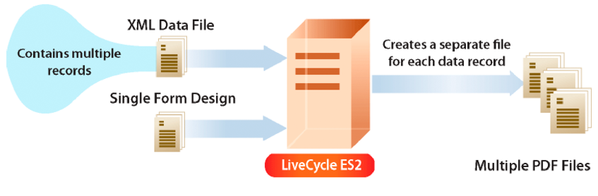

# Crear flujos de salida de documento  {#creating-document-output-streams}

**Las muestras y los ejemplos de este documento solo son para AEM Forms en un entorno JEE.**

**Acerca del servicio Output**

El servicio Output permite generar documentos como PDF (incluidos documentos de PDF/A), PostScript, Printer Control Language (PCL) y los siguientes formatos de etiqueta:

* Zebra - ZPL
* Intermec - IPL
* Datamax: DPL
* TecToshiba - TPCL

Con el servicio Output, puede combinar los datos de formulario XML con un diseño de formulario y enviar el documento a una impresora o archivo de red.

Existen dos maneras de pasar un diseño de formulario (un archivo XDP) al servicio Output. Puede pasar una instancia de `com.adobe.idp.Document` que contenga un diseño de formulario al servicio Output. O puede pasar un valor URI que especifique la ubicación del diseño de formulario. AEM Ambas maneras se describen en *Programación con formularios de datos de la lista de distribución*.

>[!NOTE]
>
>El servicio Output no admite documentos del PDF de AcroForm que contengan scripts específicos de objetos de aplicación. Los documentos del PDF de AcroForm que contienen scripts específicos de objetos de aplicación no se representan.

Las secciones siguientes muestran cómo pasar un diseño de formulario al servicio Output mediante un valor URI:

* [Creación de documentos de PDF](creating-document-output-streams.md#creating-pdf-documents)
* [Creación de documentos de PDF/A](creating-document-output-streams.md#creating-pdf-a-documents)

Las secciones siguientes muestran cómo pasar un diseño de formulario dentro de una instancia de `com.adobe.idp.Document`:

* [Pasar documentos en Content Services (obsoleto) al servicio Output](creating-document-output-streams.md#passing-documents-located-in-content-services-deprecated-to-the-output-service)
* [Creación de documentos de PDF mediante fragmentos](creating-document-output-streams.md#creating-pdf-documents-using-fragments)

Una consideración al decidir qué técnica utilizar es si obtiene el diseño de formulario de otro servicio de AEM Forms y, a continuación, pasarlo en una instancia de `com.adobe.idp.Document`. Tanto la sección *Pasar documentos al servicio de salida* como la *Creación de documentos de PDF mediante fragmentos* muestran cómo obtener un diseño de formulario de otro servicio de AEM Forms. La primera sección recupera el diseño de formulario de Content Services (obsoleto). La segunda sección recupera el diseño de formulario del servicio Assembler.

Si obtiene el diseño de formulario desde una ubicación fija, como el sistema de archivos, puede utilizar cualquiera de las técnicas. Es decir, puede especificar el valor del URI de un archivo XDP o utilizar una instancia de `com.adobe.idp.Document`.

Para pasar un valor de URI que especifique la ubicación del diseño de formulario al crear un documento de PDF, utilice el método `generatePDFOutput`. Del mismo modo, para pasar una instancia de `com.adobe.idp.Document` al servicio Output al crear un documento de PDF, utilice el método `generatePDFOutput2`.

Al enviar una secuencia de salida a una impresora de red, también puede utilizar cualquiera de estas técnicas. Para enviar una secuencia de salida a una impresora pasando una instancia de `com.adobe.idp.Document` que contenga un diseño de formulario, utilice el método `sendToPrinter2`code. Para enviar una secuencia de salida a una impresora pasando un valor URI, utilice el método `sendToPrinter`. La sección *Envío de flujos de impresión a impresoras* usa el método `sendToPrinter`.

Puede realizar estas tareas mediante el servicio Output:

* [Creación de documentos de PDF](creating-document-output-streams.md#creating-pdf-documents)
* [Creación de documentos de PDF/A](creating-document-output-streams.md#creating-pdf-a-documents)
* [Pasar documentos en Content Services (obsoleto) al servicio Output](creating-document-output-streams.md#passing-documents-located-in-content-services-deprecated-to-the-output-service)
* [Creación de documentos de PDF mediante fragmentos](creating-document-output-streams.md#creating-pdf-documents-using-fragments)
* [Impresión en archivos](creating-document-output-streams.md#printing-to-files)
* [Envío de flujos de impresión a impresoras](creating-document-output-streams.md#sending-print-streams-to-printers)
* [Creación de varios archivos de salida](creating-document-output-streams.md#creating-multiple-output-files)
* [Creación de reglas de búsqueda](creating-document-output-streams.md#creating-search-rules)
* [Acoplar documentos de PDF](creating-document-output-streams.md#flattening-pdf-documents)

>[!NOTE]
>
>Para obtener más información acerca del servicio Output, vea [Referencia de servicios para AEM Forms](https://www.adobe.com/go/learn_aemforms_services_63).

## Creación de documentos de PDF {#creating-pdf-documents}

Puede utilizar el servicio Output para crear un documento de PDF basado en un diseño de formulario y en los datos de formulario XML proporcionados. El documento de PDF creado por el servicio Output no es un documento interactivo de PDF; un usuario no puede introducir ni modificar datos de formulario.

Si desea crear un documento de PDF pensado para el almacenamiento a largo plazo, se recomienda crear un documento de PDF/A. (Consulte [Creación de documentos de PDF/A](creating-document-output-streams.md#creating-pdf-a-documents).)

Para crear un formulario interactivo de PDF que permita al usuario introducir datos, utilice el servicio de Forms. (Consulte [Procesamiento de PDF forms interactivos](/help/forms/developing/rendering-forms.md#rendering-interactive-pdf-forms).)

>[!NOTE]
>
>Para obtener más información acerca del servicio Output, vea [Referencia de servicios para AEM Forms](https://www.adobe.com/go/learn_aemforms_services_63).

### Resumen de los pasos {#summary-of-steps}

Para crear un documento de PDF, realice los siguientes pasos:

1. Incluir archivos de proyecto.
1. Cree un objeto Cliente de salida.
1. Hacer referencia a una fuente de datos XML.
1. Establecer las opciones de tiempo de ejecución del PDF.
1. Establecer las opciones de procesamiento en tiempo de ejecución.
1. Genera un documento de PDF.
1. Recupere los resultados de la operación.

**Incluir archivos de proyecto**

Incluya los archivos necesarios en el proyecto de desarrollo. Si está creando una aplicación cliente con Java, incluya los archivos JAR necesarios. Si utiliza servicios web, asegúrese de incluir los archivos proxy.

Los siguientes archivos JAR deben agregarse a la ruta de clase del proyecto:

* adobe-livecycle-client.jar
* adobe-usermanager-client.jar
* adobe-output-client.jar
* adobe-utilities.jar (obligatorio si AEM Forms está implementado en JBoss)
* jbossall-client.jar (requerido si AEM Forms está implementado en JBoss)

si AEM Forms se implementa en un servidor de aplicaciones J2EE compatible que no sea JBoss, debe reemplazar los archivos adobe-utilities.jar y jbossall-client.jar con archivos JAR específicos del servidor de aplicaciones J2EE en el que está implementado AEM Forms.

**Crear un objeto de cliente de salida**

Para poder realizar mediante programación una operación del servicio Output, debe crear un objeto de cliente del servicio Output. Si está usando la API de Java, cree un objeto `OutputClient`. Si está usando la API del servicio web de salida, cree un objeto `OutputServiceService`.

**Hacer referencia a un origen de datos XML**

Para combinar datos con el diseño de formulario, debe hacer referencia a un origen de datos XML que contenga datos. Debe existir un elemento XML para cada campo de formulario que planee rellenar con datos. El nombre del elemento XML debe coincidir con el nombre del campo. Se ignora un elemento XML si no se corresponde con un campo de formulario o si el nombre del elemento XML no coincide con el nombre del campo. Si se especifican todos los elementos XML, no es necesario coincidir con el orden en que se muestran.

Consulte el siguiente ejemplo de formulario de solicitud de préstamo.


Para combinar datos en este diseño de formulario, debe crear una fuente de datos XML que corresponda al formulario. El siguiente XML representa una fuente de datos XML XDP que corresponde al formulario de aplicación hipotecaria de ejemplo.

```xml
 <?xml version="1.0" encoding="UTF-8" ?>
 - <xfa:datasets xmlns:xfa="https://www.xfa.org/schema/xfa-data/1.0/">
 - <xfa:data>
 - <data>
     - <Layer>
         <closeDate>1/26/2007</closeDate>
         <lastName>Johnson</lastName>
         <firstName>Jerry</firstName>
         <mailingAddress>JJohnson@NoMailServer.com</mailingAddress>
         <city>New York</city>
         <zipCode>00501</zipCode>
         <state>NY</state>
         <dateBirth>26/08/1973</dateBirth>
         <middleInitials>D</middleInitials>
         <socialSecurityNumber>(555) 555-5555</socialSecurityNumber>
         <phoneNumber>5555550000</phoneNumber>
     </Layer>
     - <Mortgage>
         <mortgageAmount>295000.00</mortgageAmount>
         <monthlyMortgagePayment>1724.54</monthlyMortgagePayment>
         <purchasePrice>300000</purchasePrice>
         <downPayment>5000</downPayment>
         <term>25</term>
         <interestRate>5.00</interestRate>
     </Mortgage>
 </data>
 </xfa:data>
 </xfa:datasets>
```

**Establecer opciones de tiempo de ejecución de PDF**

Establezca la opción URI de archivo al crear un documento de PDF. Esta opción especifica el nombre y la ubicación del archivo de PDF que genera el servicio Output.

>[!NOTE]
>
>En lugar de establecer la opción de tiempo de ejecución de URI de archivo, puede recuperar mediante programación el documento de PDF a partir del tipo de datos complejo que devuelve el servicio Output. Sin embargo, al establecer la opción de tiempo de ejecución de URI de archivo, no es necesario crear una lógica de aplicación que recupere mediante programación el documento de PDF.

**Establecer opciones de tiempo de ejecución de procesamiento**

Puede establecer las opciones de procesamiento en tiempo de ejecución al crear un documento de PDF. Aunque estas opciones no son necesarias (a diferencia de las opciones de tiempo de ejecución de PDF que son necesarias), puede realizar tareas como mejorar el rendimiento del servicio Output. Por ejemplo, puede almacenar en caché el diseño de formulario que utiliza el servicio Output para mejorar su rendimiento.

Si utiliza un formulario Acrobat etiquetado como entrada, no puede utilizar el Java del servicio de salida o la API del servicio web para desactivar la configuración etiquetada. Si intenta establecer esta opción en `false` mediante programación, el documento de PDF de resultados aún estará etiquetado.

>[!NOTE]
>
>Si no especifica las opciones de procesamiento en tiempo de ejecución, se utilizarán los valores predeterminados. Para obtener información acerca de la representación de opciones en tiempo de ejecución, vea la referencia de clase `RenderOptionsSpec`. (Consulte [Referencia de la API de AEM Forms](https://www.adobe.com/go/learn_aemforms_javadocs_63_en)).

**Generar un documento de PDF**

Después de hacer referencia a un origen de datos XML válido que contiene datos de formulario y establecer las opciones en tiempo de ejecución, puede invocar el servicio Output, que genera un documento de PDF.

Al generar un documento de PDF, se especifican los valores de URI que requiere el servicio Output para crear un documento de PDF. Un diseño de formulario se puede almacenar en ubicaciones como el sistema de archivos del servidor o como parte de una aplicación de AEM Forms. Se puede hacer referencia a un diseño de formulario (u otros recursos como un archivo de imagen) que existe como parte de una aplicación de Forms mediante el valor de URI de raíz de contenido `repository:///`. Por ejemplo, considere el siguiente diseño de formulario denominado *Loan.xdp* ubicado dentro de una aplicación de Forms denominada *Applications/FormsApplication*:


Para obtener acceso al archivo Loan.xdp mostrado en la ilustración anterior, especifique `repository:///Applications/FormsApplication/1.0/FormsFolder/` como el tercer parámetro pasado al método `generatePDFOutput` del objeto `OutputClient`. Especifique el nombre del formulario (*Loan.xdp*) como el segundo parámetro pasado al método `generatePDFOutput` del objeto `OutputClient`.

Si el archivo XDP contiene imágenes (u otros recursos como fragmentos), coloque los recursos en la misma carpeta de aplicación que el archivo XDP. AEM Forms utiliza el URI de raíz de contenido como ruta base para resolver referencias a imágenes. Por ejemplo, si el archivo Loan.xdp contiene una imagen, asegúrese de colocar la imagen en `Applications/FormsApplication/1.0/FormsFolder/`.

>[!NOTE]
>
>Puede hacer referencia a un URI de aplicación de Forms al invocar los métodos `generatePDFOutput` o `generatePrintedOutput` del objeto `OutputClient`.

>[!NOTE]
>
>Para ver un inicio rápido completo que crea un documento de PDF haciendo referencia a un XDP en una aplicación de Forms, consulte [Inicio rápido (modo EJB): Creación de un documento de PDF basado en un archivo XDP de aplicación mediante la API de Java](/help/forms/developing/output-service-java-api-quick.md#quick-start-soap-mode-creating-a-pdf-document-based-on-an-application-xdp-file-using-the-java-api).

**Recuperar los resultados de la operación**

Una vez que el servicio Output realiza una operación, devuelve varios elementos de datos, como datos XML de estado, que especifican si la operación se realizó correctamente.

**Consulte también**

[Creación de un documento de PDF mediante la API de Java](creating-document-output-streams.md#create-a-pdf-document-using-the-java-api)

[Creación de un documento de PDF mediante la API de servicio web](creating-document-output-streams.md#create-a-pdf-document-using-the-web-service-api)

[Incluir archivos de biblioteca Java de AEM Forms](/help/forms/developing/invoking-aem-forms-using-java.md#including-aem-forms-java-library-files)

[Estableciendo propiedades de conexión](/help/forms/developing/invoking-aem-forms-using-java.md#setting-connection-properties)

[Inicios rápidos de API del servicio de salida](/help/forms/developing/output-service-java-api-quick.md#output-service-java-api-quick-start-soap)

### Creación de un documento de PDF mediante la API de Java {#create-a-pdf-document-using-the-java-api}

Cree un documento de PDF con la API de salida (Java):

1. Incluir archivos de proyecto.

   Incluya archivos JAR de cliente, como adobe-output-client.jar, en la ruta de clase del proyecto Java.

1. Cree un objeto Cliente de salida.

   * Cree un objeto `ServiceClientFactory` que contenga propiedades de conexión.
   * Cree un objeto `OutputClient` utilizando su constructor y pasando el objeto `ServiceClientFactory`.

1. Hacer referencia a una fuente de datos XML.

   * Cree un objeto `java.io.FileInputStream` que represente el origen de datos XML utilizado para rellenar el documento de PDF utilizando su constructor y pasando un valor de cadena que especifique la ubicación del archivo XML.
   * Crear un objeto `com.adobe.idp.Document` mediante su constructor. Pase el objeto `java.io.FileInputStream`.

1. Establecer las opciones de tiempo de ejecución del PDF.

   * Crear un objeto `PDFOutputOptionsSpec` mediante su constructor.
   * Establezca la opción URI de archivo invocando el método `setFileURI` del objeto `PDFOutputOptionsSpec`. Pase un valor de cadena que especifique la ubicación del archivo PDF que genera el servicio Output. La opción URI de archivo es relativa al servidor de aplicaciones J2EE que aloja AEM Forms, no al equipo cliente.

1. Establecer las opciones de procesamiento en tiempo de ejecución.

   * Crear un objeto `RenderOptionsSpec` mediante su constructor.
   * Almacene en caché el diseño de formulario para mejorar el rendimiento del servicio Output invocando `setCacheEnabled` del objeto `RenderOptionsSpec` y pasando `true`.

   >[!NOTE]
   >
   >No puede establecer la versión del documento de PDF mediante el método `setPdfVersion` del objeto `RenderOptionsSpec` si el documento de entrada es un formulario de Acrobat (un formulario creado en Acrobat) o un documento XFA firmado o certificado. El documento del PDF de salida conserva la versión original del PDF. Del mismo modo, no puede establecer la opción de Adobe PDF etiquetado invocando el método `setTaggedPDF` del objeto `RenderOptionsSpec` si el documento de entrada es un formulario de Acrobat o un documento XFA firmado o certificado.

   >[!NOTE]
   >
   >No puede establecer la opción de PDF linealizado mediante el método `setLinearizedPDF` del objeto `RenderOptionsSpec` si el documento del PDF de entrada está certificado o firmado digitalmente. (Consulte [Documentos de PDF de firma digital &#x200B;](/help/forms/developing/digitally-signing-certifying-documents.md#digitally-signing-pdf-documents)*.)*

1. Genera un documento de PDF.

   Cree un documento de PDF invocando el método `generatePDFOutput` del objeto `OutputClient` y pasando los siguientes valores:

   * Un valor de enumeración `TransformationFormat`. Para generar un documento de PDF, especifique `TransformationFormat.PDF`.
   * Un valor de cadena que especifica el nombre del diseño de formulario.
   * Valor de cadena que especifica la raíz de contenido donde se encuentra el diseño de formulario.
   * Objeto `PDFOutputOptionsSpec` que contiene opciones de tiempo de ejecución de PDF.
   * Objeto `RenderOptionsSpec` que contiene opciones de procesamiento en tiempo de ejecución.
   * El objeto `com.adobe.idp.Document` que contiene el origen de datos XML que contiene los datos que se van a combinar con el diseño de formulario.

   El método `generatePDFOutput` devuelve un objeto `OutputResult` que contiene los resultados de la operación.

   >[!NOTE]
   >
   >Al generar un documento de PDF invocando el método `generatePDFOutput`, no se pueden combinar datos con un formulario de PDF XFA firmado o certificado. (Consulte [Firmar y certificar documentos digitalmente &#x200B;](/help/forms/developing/digitally-signing-certifying-documents.md#digitally-signing-and-certifying-documents)*.)*

   >[!NOTE]
   >
   >El método `getRecordLevelMetaDataList` del objeto `OutputResult` devuelve `null`*.*

   >[!NOTE]
   >
   >También puede crear un documento de PDF invocando el método `generatePDFOutput2` del objeto `OutputClient`. (Consulte [Pasar documentos en Content Services (obsoleto) al servicio Output &#x200B;](creating-document-output-streams.md#passing-documents-located-in-content-services-deprecated-to-the-output-service)*.)*

1. Recupere los resultados de la operación.

   * Recupere un objeto `com.adobe.idp.Document` que represente el estado de la operación `generatePDFOutput` invocando el método `getStatusDoc` del objeto `OutputResult`. Este método devuelve datos XML de estado que especifican si la operación se realizó correctamente.
   * Cree un objeto `java.io.File` que contenga los resultados de la operación. Asegúrese de que la extensión del nombre de archivo sea .xml.
   * Invoque el método `copyToFile` del objeto `com.adobe.idp.Document` para copiar el contenido del objeto `com.adobe.idp.Document` en el archivo (asegúrese de utilizar el objeto `com.adobe.idp.Document` devuelto por el método `getStatusDoc`).

   Aunque el servicio Output escribe el documento del PDF en la ubicación especificada por el argumento que se pasa al método `setFileURI` del objeto `PDFOutputOptionsSpec`, puede recuperar mediante programación el documento PDF/A invocando el método `getGeneratedDoc` del objeto `OutputResult`.

**Consulte también**

[Resumen de los pasos](creating-document-output-streams.md#summary-of-steps)

[Inicio rápido (modo EJB): Creación de un documento de PDF con la API de Java](/help/forms/developing/output-service-java-api-quick.md#quick-start-soap-mode-creating-a-pdf-document-using-the-java-api)

[SOAP Inicio rápido (modo de): Creación de un documento de PDF mediante la API de Java](/help/forms/developing/output-service-java-api-quick.md#quick-start-soap-mode-creating-a-pdf-document-using-the-java-api)

[Incluir archivos de biblioteca Java de AEM Forms](/help/forms/developing/invoking-aem-forms-using-java.md#including-aem-forms-java-library-files)

[Estableciendo propiedades de conexión](/help/forms/developing/invoking-aem-forms-using-java.md#setting-connection-properties)

### Creación de un documento de PDF mediante la API de servicio web {#create-a-pdf-document-using-the-web-service-api}

Cree un documento de PDF mediante la API de salida (servicio web):

1. Incluir archivos de proyecto.

   Cree un proyecto de Microsoft .NET que utilice MTOM. Asegúrese de utilizar la siguiente definición de WSDL: `http://localhost:8080/soap/services/OutputService?WSDL&lc_version=9.0.1`.

   >[!NOTE]
   >
   >Reemplace `localhost` por la dirección IP del servidor que hospeda AEM Forms.

1. Cree un objeto Cliente de salida.

   * Cree un objeto `OutputServiceClient` utilizando su constructor predeterminado.
   * Cree un objeto `OutputServiceClient.Endpoint.Address` mediante el constructor `System.ServiceModel.EndpointAddress`. Pase un valor de cadena que especifique el WSDL al servicio AEM Forms (por ejemplo, `http://localhost:8080/soap/services/OutputService?blob=mtom`). No necesita usar el atributo `lc_version`. Este atributo se utiliza al crear una referencia de servicio. Sin embargo, especifique `?blob=mtom` para utilizar MTOM.
   * Cree un objeto `System.ServiceModel.BasicHttpBinding` obteniendo el valor del campo `OutputServiceClient.Endpoint.Binding`. Convertir el valor devuelto en `BasicHttpBinding`.
   * Establezca el campo `MessageEncoding` del objeto `System.ServiceModel.BasicHttpBinding` en `WSMessageEncoding.Mtom`. Este valor garantiza que se utiliza MTOM.
   * Habilite la autenticación HTTP básica realizando las siguientes tareas:

      * AEM Asigne el nombre de usuario de los formularios de la al campo `OutputServiceClient.ClientCredentials.UserName.UserName`.
      * Asigne el valor de contraseña correspondiente al campo `OutputServiceClient.ClientCredentials.UserName.Password`.
      * Asigne el valor constante `HttpClientCredentialType.Basic` al campo `BasicHttpBindingSecurity.Transport.ClientCredentialType`.
      * Asigne el valor constante `BasicHttpSecurityMode.TransportCredentialOnly` al campo `BasicHttpBindingSecurity.Security.Mode`.

1. Hacer referencia a una fuente de datos XML.

   * Crear un objeto `BLOB` mediante su constructor. El objeto `BLOB` se usa para almacenar datos XML que se combinarán con el documento de PDF.
   * Cree un objeto `System.IO.FileStream` invocando su constructor y pasando un valor de cadena que represente la ubicación del archivo XML que contiene los datos del formulario.
   * Cree una matriz de bytes que almacene el contenido del objeto `System.IO.FileStream`. Puede determinar el tamaño de la matriz de bytes obteniendo la propiedad `Length` del objeto `System.IO.FileStream`.
   * Rellene la matriz de bytes con datos de secuencia invocando el método `Read` del objeto `System.IO.FileStream` y pasando la matriz de bytes, la posición inicial y la longitud de secuencia para que se lea.
   * Rellene el objeto `BLOB` asignando su campo `MTOM` con el contenido de la matriz de bytes.

1. Establecer las opciones de tiempo de ejecución del PDF

   * Crear un objeto `PDFOutputOptionsSpec` mediante su constructor.
   * Establezca la opción URI de archivo asignando un valor de cadena que especifique la ubicación del archivo de PDF que el servicio Output genera en el miembro de datos `fileURI` del objeto `PDFOutputOptionsSpec`. La opción URI de archivo es relativa al servidor de aplicaciones J2EE que aloja AEM Forms, no al equipo cliente.

1. Establecer las opciones de procesamiento en tiempo de ejecución.

   * Crear un objeto `RenderOptionsSpec` mediante su constructor.
   * Almacene en caché el diseño de formulario para mejorar el rendimiento del servicio Output al asignar el valor `true` al miembro de datos `cacheEnabled` del objeto `RenderOptionsSpec`.

   >[!NOTE]
   >
   >No puede establecer la versión del documento de PDF mediante el método `setPdfVersion` del objeto `RenderOptionsSpec` si el documento de entrada es un formulario de Acrobat (un formulario creado en Acrobat) o un documento XFA firmado o certificado. El documento del PDF de salida conserva la versión original del PDF. Del mismo modo, no puede establecer la opción de Adobe PDF etiquetado invocando el método `setTaggedPDF`* del objeto `RenderOptionsSpec` si el documento de entrada es un formulario de Acrobat o un documento XFA firmado o certificado.*

   >[!NOTE]
   >
   >No puede establecer la opción de PDF linealizado mediante el miembro `linearizedPDF` del objeto `RenderOptionsSpec` si el documento de PDF de entrada está certificado o firmado digitalmente. (Consulte [Documentos de PDF de firma digital &#x200B;](/help/forms/developing/digitally-signing-certifying-documents.md#digitally-signing-pdf-documents)*.)*

1. Genera un documento de PDF.

   Cree un documento de PDF invocando el método `generatePDFOutput`del objeto `OutputServiceService` y pasando los siguientes valores:

   * Un valor de enumeración `TransformationFormat`. Para generar un documento de PDF, especifique `TransformationFormat.PDF`.
   * Un valor de cadena que especifica el nombre del diseño de formulario.
   * Valor de cadena que especifica la raíz de contenido donde se encuentra el diseño de formulario.
   * Objeto `PDFOutputOptionsSpec` que contiene opciones de tiempo de ejecución de PDF.
   * Objeto `RenderOptionsSpec` que contiene opciones de procesamiento en tiempo de ejecución.
   * El objeto `BLOB` que contiene el origen de datos XML que contiene los datos que se van a combinar con el diseño de formulario.
   * Un objeto `BLOB` que se rellena con el método `generatePDFOutput`. El método `generatePDFOutput` rellena este objeto con metadatos generados que describen el documento. (Este valor de parámetro solo es necesario para la invocación del servicio web).
   * Un objeto `BLOB` que se rellena con el método `generatePDFOutput`. El método `generatePDFOutput` rellena este objeto con datos de resultados. (Este valor de parámetro solo es necesario para la invocación del servicio web).
   * Un objeto `OutputResult` que contiene los resultados de la operación. (Este valor de parámetro solo es necesario para la invocación del servicio web).

   >[!NOTE]
   >
   >Al generar un documento de PDF invocando el método `generatePDFOutput`, no se pueden combinar datos con un formulario de PDF XFA firmado o certificado. (Consulte [Firmar y certificar documentos digitalmente &#x200B;](/help/forms/developing/digitally-signing-certifying-documents.md#digitally-signing-and-certifying-documents)*.)*

   >[!NOTE]
   >
   >También puede crear un documento de PDF invocando el método `generatePDFOutput2` del objeto `OutputClient`. (Consulte [Pasar documentos en Content Services (obsoleto) al servicio Output &#x200B;](creating-document-output-streams.md#passing-documents-located-in-content-services-deprecated-to-the-output-service)*.)*

1. Recupere los resultados de la operación.

   * Cree un objeto `System.IO.FileStream` invocando su constructor y pasando un valor de cadena que represente una ubicación de archivo XML que contenga datos de resultado. Asegúrese de que la extensión del nombre de archivo sea .xml.
   * Cree una matriz de bytes que almacene el contenido de datos del objeto `BLOB` que el método `generatePDFOutput` del objeto `OutputServiceService` rellenó con datos de resultados (el octavo parámetro). Rellene la matriz de bytes obteniendo el valor del objeto `MTOM` `field` del objeto `BLOB`.
   * Cree un objeto `System.IO.BinaryWriter` invocando su constructor y pasando el objeto `System.IO.FileStream`.
   * Escriba el contenido de la matriz de bytes en el archivo XML invocando el método `Write` del objeto `System.IO.BinaryWriter` y pasando la matriz de bytes.

   Ver también

[Resumen de los pasos](creating-document-output-streams.md#summary-of-steps)

[Invocar AEM Forms mediante MTOM](/help/forms/developing/invoking-aem-forms-using-web.md#invoking-aem-forms-using-mtom)

[Invocar AEM Forms mediante SwaRef](/help/forms/developing/invoking-aem-forms-using-web.md#invoking-aem-forms-using-swaref)

   >[!NOTE]
   >
   >El método `generateOutput` del objeto `OutputServiceService` está obsoleto.

## Creación de documentos de PDF/A {#creating-pdf-a-documents}

Puede utilizar el servicio Output para crear un documento de PDF/A. Como PDF/A es un formato de archivo para la preservación a largo plazo del contenido del documento, todas las fuentes están incrustadas y el archivo no está comprimido. Como resultado, un documento PDF/A suele ser más grande que un documento PDF estándar. Además, un documento de PDF/A no contiene contenido de audio y vídeo. Al igual que otras tareas del servicio Output, puede proporcionar un diseño de formulario y datos para combinarlos con uno para crear un documento de PDF/A.

La especificación PDF/A-1 consta de dos niveles de conformidad, a saber, a y b. La principal diferencia entre los dos es la compatibilidad con la estructura lógica (accesibilidad), que no es necesaria para el nivel de conformidad b. Independientemente del nivel de conformidad, PDF/A-1 dicta que todas las fuentes estén incrustadas en el documento PDF/A generado.

Aunque PDF/A es el estándar para archivar documentos de PDF, no es obligatorio que PDF/A se utilice para archivar si un documento de PDF estándar satisface las necesidades de su empresa. El propósito del estándar PDF/A es crear un archivo de PDF que se pueda almacenar durante un largo periodo de tiempo y que cumpla los requisitos de conservación de documentos. Por ejemplo, una dirección URL no se puede incrustar en un PDF/A porque, con el tiempo, la dirección URL puede no ser válida.

Su organización debe evaluar sus propias necesidades, el tiempo que desea conservar el documento, las consideraciones sobre el tamaño del archivo y determinar su propia estrategia de archivado. Puede determinar mediante programación si un documento de PDF es compatible con PDF/A mediante el servicio DocConverter. (Consulte [Determinación Programática De La Conformidad De PDF/A](/help/forms/developing/pdf-a-documents.md#programmatically-determining-pdf-a-compliancy).)

Un documento de PDF/A debe utilizar la fuente especificada en el diseño de formulario y las fuentes no se pueden sustituir. Como resultado, si una fuente ubicada en un documento de PDF no está disponible en el sistema operativo (SO) del host, se produce una excepción.

Cuando se abre un documento de PDF/A en Acrobat, aparece un mensaje que confirma que el documento es un documento de PDF/A, como se muestra en la siguiente ilustración.


>[!NOTE]
>
>El sitio web de AIIM tiene una sección de preguntas frecuentes del PDF/A a la que puede acceder en [https://www.loc.gov/preservation/digital/formats/fdd/fdd000125.shtml](https://www.loc.gov/preservation/digital/formats/fdd/fdd000125.shtml).

>[!NOTE]
>
>Para obtener más información acerca del servicio Output, vea [Referencia de servicios para AEM Forms](https://www.adobe.com/go/learn_aemforms_services_65).

### Resumen de los pasos {#summary_of_steps-1}

Para crear un documento de PDF/A, realice los siguientes pasos:

1. Incluir archivos de proyecto.
1. Cree un objeto Cliente de salida.
1. Hacer referencia a una fuente de datos XML.
1. Establecer las opciones de tiempo de ejecución de PDF/A.
1. Establecer las opciones de procesamiento en tiempo de ejecución.
1. Genera un documento de PDF/A.
1. Recupere los resultados de la operación.

**Incluir archivos de proyecto**

Incluya los archivos necesarios en el proyecto de desarrollo. Si está creando una aplicación personalizada mediante Java, incluya los archivos JAR necesarios. Si utiliza servicios web, asegúrese de incluir los archivos proxy.

Los siguientes archivos JAR deben agregarse a la ruta de clase del proyecto:

* adobe-livecycle-client.jar
* adobe-usermanager-client.jar
* adobe-output-client.jar
* adobe-utilities.jar (obligatorio si AEM Forms está implementado en JBoss)
* jbossall-client.jar (requerido si AEM Forms está implementado en JBoss)

si AEM Forms se implementa en un servidor de aplicaciones J2EE compatible que no sea JBoss, debe reemplazar los archivos adobe-utilities.jar y jbossall-client.jar con archivos JAR específicos del servidor de aplicaciones J2EE en el que está implementado AEM Forms.

**Crear un objeto de cliente de salida**

Para poder realizar mediante programación una operación del servicio Output, debe crear un objeto de cliente del servicio Output. Si está usando la API de Java, cree un objeto `OutputClient`. Si está usando la API del servicio web de salida, cree un objeto `OutputServiceService`.

**Hacer referencia a un origen de datos XML**

Para combinar datos con el diseño de formulario, debe hacer referencia a un origen de datos XML que contenga datos. Debe existir un elemento XML para cada campo de formulario que desee rellenar con datos. El nombre del elemento XML debe coincidir con el nombre del campo. Se ignora un elemento XML si no se corresponde con un campo de formulario o si el nombre del elemento XML no coincide con el nombre del campo. Si se especifican todos los elementos XML, no es necesario coincidir con el orden en que se muestran.

**Establecer opciones de tiempo de ejecución de PDF/A**

Puede establecer la opción URI de archivo al crear un documento de PDF/A. La URI es relativa al servidor de aplicaciones J2EE que aloja AEM Forms. Es decir, si establece C:\Adobe, el archivo se escribe en la carpeta del servidor, no en el equipo cliente. El URI especifica el nombre y la ubicación del archivo PDF/A que genera el servicio Output.

**Establecer opciones de tiempo de ejecución de procesamiento**

Puede establecer las opciones de procesamiento en tiempo de ejecución al crear documentos de PDF/A. Dos opciones relacionadas con el PDF/A que puede establecer son los valores `PDFAConformance` y `PDFARevisionNumber`. El valor `PDFAConformance` hace referencia a la forma en que un documento de PDF cumple los requisitos que especifican la conservación de los documentos electrónicos a largo plazo. Los valores válidos para esta opción son `A` y `B`. Para obtener información acerca de la conformidad de los niveles A y B, consulte la especificación ISO PDF/A-1 titulada *ISO 19005-1 Document management*.

El valor `PDFARevisionNumber` hace referencia al número de revisión de un documento de PDF/A. Para obtener información acerca del número de revisión de un documento PDF/A, consulte la especificación PDF/A-1 ISO titulada *ISO 19005-1 Document management*.

>[!NOTE]
>
>No puede establecer la opción de Adobe PDF etiquetado en `false` al crear un documento de PDF/A 1A. PDF/A 1A siempre será un documento de PDF etiquetado. Tampoco puede establecer la opción de Adobe PDF etiquetado en `true` al crear un documento de PDF/A 1B. PDF/A 1B siempre será un documento de PDF sin etiquetar.

**Generar un documento de PDF/A**

Después de hacer referencia a un origen de datos XML válido que contiene datos de formulario y establecer las opciones en tiempo de ejecución, puede invocar el servicio Output, lo que hace que genere un documento de PDF/A.

**Recuperar los resultados de la operación**

Una vez que el servicio Output realiza una operación, devuelve varios elementos de datos, como datos XML, que especifican si la operación se realizó correctamente.

**Consulte también**

[Creación de un documento de PDF/administrador mediante la API de Java](creating-document-output-streams.md#create-a-pdf-a-document-using-the-java-api)

[Creación de un documento de PDF/administrador mediante la API de servicio web](creating-document-output-streams.md#create-a-pdf-a-document-using-the-web-service-api)

[Incluir archivos de biblioteca Java de AEM Forms](/help/forms/developing/invoking-aem-forms-using-java.md#including-aem-forms-java-library-files)

[Estableciendo propiedades de conexión](/help/forms/developing/invoking-aem-forms-using-java.md#setting-connection-properties)

[Inicios rápidos de API del servicio de salida](/help/forms/developing/output-service-java-api-quick.md#output-service-java-api-quick-start-soap)

### Creación de un documento de PDF/administrador mediante la API de Java {#create-a-pdf-a-document-using-the-java-api}

Cree un documento de PDF/A mediante la API de salida (Java):

1. Incluir archivos de proyecto.

   Incluya archivos JAR de cliente, como adobe-output-client.jar, en la ruta de clase del proyecto Java.

1. Cree un objeto Cliente de salida.

   * Cree un objeto `ServiceClientFactory` que contenga propiedades de conexión.
   * Cree un objeto `OutputClient` utilizando su constructor y pasando el objeto `ServiceClientFactory`.

1. Hacer referencia a una fuente de datos XML.

   * Cree un objeto `java.io.FileInputStream` que represente el origen de datos XML utilizado para rellenar el documento PDF/A mediante su constructor y pasando un valor de cadena que especifique la ubicación del archivo XML.
   * Cree un objeto `com.adobe.idp.Document` utilizando su constructor y pasando el objeto `java.io.FileInputStream`.

1. Establecer las opciones de tiempo de ejecución de PDF/A.

   * Crear un objeto `PDFOutputOptionsSpec` mediante su constructor.
   * Establezca la opción URI de archivo invocando el método `setFileURI` del objeto `PDFOutputOptionsSpec`. Pase un valor de cadena que especifique la ubicación del archivo PDF que genera el servicio Output. La opción URI de archivo es relativa al servidor de aplicaciones J2EE que aloja AEM Forms, no al equipo cliente.

1. Establecer las opciones de procesamiento en tiempo de ejecución.

   * Crear un objeto `RenderOptionsSpec` mediante su constructor.
   * Establezca el valor `PDFAConformance` invocando el método `setPDFAConformance` del objeto `RenderOptionsSpec` y pasando un valor de enumeración `PDFAConformance` que especifica el nivel de conformidad. Por ejemplo, para especificar el nivel de conformidad A, pase `PDFAConformance.A`.
   * Establezca el valor `PDFARevisionNumber` invocando el método `setPDFARevisionNumber` del objeto `RenderOptionsSpec` y pasando `PDFARevisionNumber.Revision_1`.

   >[!NOTE]
   >
   >La versión de PDF de un documento PDF/A es 1.4 independientemente del valor que especifique para el método `setPdfVersion`*del objeto `RenderOptionsSpec`.*

1. Genera un documento de PDF/A.

   Cree un documento de PDF/A invocando el método `generatePDFOutput` del objeto `OutputClient` y pasando los siguientes valores:

   * Un valor de enumeración `TransformationFormat`. Para generar un documento de PDF/A, especifique `TransformationFormat.PDFA`.
   * Un valor de cadena que especifica el nombre del diseño de formulario.
   * Valor de cadena que especifica la raíz de contenido donde se encuentra el diseño de formulario.
   * Objeto `PDFOutputOptionsSpec` que contiene opciones de tiempo de ejecución de PDF.
   * Objeto `RenderOptionsSpec` que contiene opciones de procesamiento en tiempo de ejecución.
   * El objeto `com.adobe.idp.Document` que contiene el origen de datos XML que contiene los datos que se van a combinar con el diseño de formulario.

   El método `generatePDFOutput` devuelve un objeto `OutputResult` que contiene los resultados de la operación.

   >[!NOTE]
   >
   >El método `getRecordLevelMetaDataList` del objeto `OutputResult` devuelve `null`.

   >[!NOTE]
   >
   >También puede crear un documento /A de PDF invocando el método `generatePDFOutput`2 del objeto `OutputClient`. (Consulte [Pasar documentos en Content Services (obsoleto) al servicio Output](creating-document-output-streams.md#passing-documents-located-in-content-services-deprecated-to-the-output-service).)

1. Recupere los resultados de la operación.

   * Cree un objeto `com.adobe.idp.Document` que represente el estado del método `generatePDFOutput` invocando el método `getStatusDoc` del objeto `OutputResult`.
   * Cree un objeto `java.io.File` que contenga los resultados de la operación. Asegúrese de que la extensión del nombre de archivo sea .xml.
   * Invoque el método `copyToFile` del objeto `com.adobe.idp.Document` para copiar el contenido del objeto `com.adobe.idp.Document` en el archivo (asegúrese de utilizar el objeto `com.adobe.idp.Document` devuelto por el método `getStatusDoc`).

   >[!NOTE]
   >
   >Aunque el servicio Output escribe el documento PDF/A en la ubicación especificada por el argumento que se pasa al método `setFileURI` del objeto `PDFOutputOptionsSpec`, puede recuperar mediante programación el documento PDF/A invocando el método `getGeneratedDoc` del objeto `OutputResult`.

**Consulte también**

[Resumen de los pasos](creating-document-output-streams.md#summary-of-steps)

[SOAP Inicio rápido (modo de): Creación de un documento de PDF/A mediante la API de Java](/help/forms/developing/output-service-java-api-quick.md#quick-start-soap-mode-creating-a-pdf-a-document-using-the-java-api)

[Incluir archivos de biblioteca Java de AEM Forms](/help/forms/developing/invoking-aem-forms-using-java.md#including-aem-forms-java-library-files)

[Estableciendo propiedades de conexión](/help/forms/developing/invoking-aem-forms-using-java.md#setting-connection-properties).

### Creación de un documento de PDF/administrador mediante la API de servicio web {#create-a-pdf-a-document-using-the-web-service-api}

Cree un documento de PDF/A mediante la API de salida (servicio web):

1. Incluir archivos de proyecto.

   Cree un proyecto de Microsoft .NET que utilice MTOM. Asegúrese de utilizar la siguiente definición de WSDL: `http://localhost:8080/soap/services/OutputService?WSDL&lc_version=9.0.1`.

   >[!NOTE]
   >
   >Reemplace `localhost` por la dirección IP del servidor que hospeda AEM Forms.

1. Cree un objeto Cliente de salida.

   * Cree un objeto `OutputServiceClient` utilizando su constructor predeterminado.
   * Cree un objeto `OutputServiceClient.Endpoint.Address` mediante el constructor `System.ServiceModel.EndpointAddress`. Pase un valor de cadena que especifique el WSDL al servicio AEM Forms (por ejemplo, `http://localhost:8080/soap/services/OutputService?blob=mtom`). No necesita usar el atributo `lc_version`. Este atributo se utiliza al crear una referencia de servicio. Sin embargo, especifique `?blob=mtom` para utilizar MTOM.
   * Cree un objeto `System.ServiceModel.BasicHttpBinding` obteniendo el valor del campo `OutputServiceClient.Endpoint.Binding`. Convertir el valor devuelto en `BasicHttpBinding`.
   * Establezca el campo `MessageEncoding` del objeto `System.ServiceModel.BasicHttpBinding` en `WSMessageEncoding.Mtom`. Este valor garantiza que se utiliza MTOM.
   * Habilite la autenticación HTTP básica realizando las siguientes tareas:

      * AEM Asigne el nombre de usuario de los formularios de la al campo `OutputServiceClient.ClientCredentials.UserName.UserName`.
      * Asigne el valor de contraseña correspondiente al campo `OutputServiceClient.ClientCredentials.UserName.Password`.
      * Asigne el valor constante `HttpClientCredentialType.Basic` al campo `BasicHttpBindingSecurity.Transport.ClientCredentialType`.
      * Asigne el valor constante `BasicHttpSecurityMode.TransportCredentialOnly` al campo `BasicHttpBindingSecurity.Security.Mode`.

1. Hacer referencia a una fuente de datos XML.

   * Crear un objeto `BLOB` mediante su constructor. El objeto `BLOB` se usa para almacenar datos que se combinarán con el documento PDF/A.
   * Cree un objeto `System.IO.FileStream` invocando su constructor y pasando un valor de cadena que represente la ubicación de archivo del documento de PDF que se va a cifrar y el modo en que se va a abrir el archivo.
   * Cree una matriz de bytes que almacene el contenido del objeto `System.IO.FileStream`. Puede determinar el tamaño de la matriz de bytes obteniendo la propiedad `Length` del objeto `System.IO.FileStream`.
   * Rellene la matriz de bytes con datos de secuencia invocando el método `Read` del objeto `System.IO.FileStream` y pasando la matriz de bytes, la posición inicial y la longitud de secuencia para que se lea.
   * Rellene el objeto `BLOB` asignando su campo `MTOM` con el contenido de la matriz de bytes.

1. Establecer las opciones de tiempo de ejecución de PDF/A.

   * Crear un objeto `PDFOutputOptionsSpec` mediante su constructor.
   * Establezca la opción URI de archivo asignando un valor de cadena que especifique la ubicación del archivo de PDF que el servicio Output genera en el miembro de datos `fileURI` del objeto `PDFOutputOptionsSpec`. La opción URI de archivo es relativa al servidor de aplicaciones J2EE que aloja AEM Forms, no al equipo cliente

1. Establecer las opciones de procesamiento en tiempo de ejecución.

   * Crear un objeto `RenderOptionsSpec` mediante su constructor.
   * Establezca el valor `PDFAConformance` asignando un valor de enumeración `PDFAConformance` al miembro de datos `PDFAConformance` del objeto `RenderOptionsSpec`. Por ejemplo, para especificar el nivel de conformidad A, asigne `PDFAConformance.A` a este miembro de datos.
   * Establezca el valor `PDFARevisionNumber` asignando un valor de enumeración `PDFARevisionNumber` al miembro de datos `PDFARevisionNumber` del objeto `RenderOptionsSpec`. Asignar `PDFARevisionNumber.Revision_1` a este miembro de datos.

   >[!NOTE]
   >
   >La versión de PDF de un documento de PDF/A es 1.4 independientemente del valor especificado.

1. Genera un documento de PDF/A.

   Cree un documento de PDF invocando el método `generatePDFOutput`del objeto `OutputServiceService` y pasando los siguientes valores:

   * Un valor de enumeración TransformationFormat. Para generar un documento de PDF, especifique `TransformationFormat.PDFA`.
   * Un valor de cadena que especifica el nombre del diseño de formulario.
   * Valor de cadena que especifica la raíz de contenido donde se encuentra el diseño de formulario.
   * Objeto `PDFOutputOptionsSpec` que contiene opciones de tiempo de ejecución de PDF.
   * Objeto `RenderOptionsSpec` que contiene opciones de procesamiento en tiempo de ejecución.
   * El objeto `BLOB` que contiene el origen de datos XML que contiene los datos que se van a combinar con el diseño de formulario.
   * Un objeto `BLOB` que se rellena con el método `generatePDFOutput`. El método `generatePDFOutput` rellena este objeto con metadatos generados que describen el documento. (Este valor de parámetro solo es necesario para la invocación del servicio web).
   * Un objeto `BLOB` que se rellena con el método `generatePDFOutput`. El método `generatePDFOutput` rellena este objeto con datos de resultados. (Este valor de parámetro solo es necesario para la invocación del servicio web).
   * Un objeto `OutputResult` que contiene los resultados de la operación. (Este valor de parámetro solo es necesario para la invocación del servicio web).

   >[!NOTE]
   >
   >También puede crear un documento /A de PDF invocando el método `generatePDFOutput`2 del objeto `OutputClient`. (Consulte [Pasar documentos en Content Services (obsoleto) al servicio Output](creating-document-output-streams.md#passing-documents-located-in-content-services-deprecated-to-the-output-service).)

1. Recupere los resultados de la operación.

   * Cree un objeto `System.IO.FileStream` invocando su constructor y pasando un valor de cadena que represente una ubicación de archivo XML que contenga datos de resultado. Asegúrese de que la extensión del nombre de archivo sea .xml.
   * Cree una matriz de bytes que almacene el contenido de datos del objeto `BLOB` que el método `generatePDFOutput` del objeto `OutputServiceService` rellenó con datos de resultados (el octavo parámetro). Rellene la matriz de bytes obteniendo el valor del campo `MTOM` del objeto `BLOB`.
   * Cree un objeto `System.IO.BinaryWriter` invocando su constructor y pasando el objeto `System.IO.FileStream`.
   * Escriba el contenido de la matriz de bytes en el archivo XML invocando el método `Write` del objeto `System.IO.BinaryWriter` y pasando la matriz de bytes.

**Consulte también**

[Resumen de los pasos](creating-document-output-streams.md#summary-of-steps)

[Invocar AEM Forms mediante MTOM](/help/forms/developing/invoking-aem-forms-using-web.md#invoking-aem-forms-using-mtom)

[Invocar AEM Forms mediante SwaRef](/help/forms/developing/invoking-aem-forms-using-web.md#invoking-aem-forms-using-swaref)

## Pasar documentos en Content Services (obsoleto) al servicio Output {#passing-documents-located-in-content-services-deprecated-to-the-output-service}

El servicio Output procesa un formulario de PDF no interactivo basado en un diseño de formulario que normalmente se guarda como archivo XDP y se crea en Designer. Puede pasar un objeto `com.adobe.idp.Document` que contenga el diseño de formulario al servicio Output. A continuación, el servicio Output procesa el diseño de formulario en el objeto `com.adobe.idp.Document`.

Una ventaja de pasar un objeto `com.adobe.idp.Document` al servicio Output es que otras operaciones del servicio AEM Forms devuelven una instancia `com.adobe.idp.Document`. Es decir, puede obtener una instancia de `com.adobe.idp.Document` de otra operación de servicio y procesarla. Por ejemplo, supongamos que un archivo XDP se almacena en un nodo de Content Services (obsoleto) denominado `/Company Home/Form Designs`, como se muestra en la siguiente ilustración.

Puede recuperar mediante programación Loan.xdp de Content Services (obsoleto) y pasar el archivo XDP al servicio Output dentro de un objeto `com.adobe.idp.Document`.

>[!NOTE]
>
>Para obtener más información acerca del servicio Forms, consulte [Referencia de servicios para AEM Forms](https://www.adobe.com/go/learn_aemforms_services_63).

### Resumen de los pasos {#summary_of_steps-2}

Para pasar un documento obtenido de Content Services (obsoleto) al servicio Output, realice las siguientes tareas:

1. Incluir archivos de proyecto.
1. Cree un objeto Output y un objeto API de cliente de administración de documentos.
1. Recupere el diseño de formulario de Content Services (obsoleto).
1. Procese el formulario de PDF no interactivo.
1. Realice una acción con el flujo de datos.

**Incluir archivos de proyecto**

Incluya los archivos necesarios en el proyecto de desarrollo. Si está creando una aplicación cliente con Java, incluya los archivos JAR necesarios. Si utiliza servicios web, incluya los archivos proxy.

**Crear una salida y un objeto de API de cliente de administración de documentos**

Para poder realizar mediante programación una operación de la API del servicio Output, cree un objeto de la API del cliente Output. Además, como este flujo de trabajo recupera un archivo XDP de los servicios de contenido (obsoleto), cree un objeto de API de administración de documentos.

**Recuperar el diseño de formulario de los servicios de contenido (obsoleto)**

Recupere el archivo XDP de los servicios de contenido (obsoleto) mediante Java o la API de servicio web. El archivo XDP se devuelve en una instancia `com.adobe.idp.Document` (o en una instancia `BLOB` si utiliza servicios web). A continuación, puede pasar la instancia `com.adobe.idp.Document` al servicio Output.

**Procesar el formulario de PDF no interactivo**

Para procesar un formulario no interactivo, pase la instancia `com.adobe.idp.Document` devuelta por Content Services (obsoleta) al servicio Output.

>[!NOTE]
>
>Dos nuevos métodos llamados `generatePDFOutput2` y g `eneratePrintedOutput2`aceptan un objeto `com.adobe.idp.Document` que contiene un diseño de formulario. También puede pasar un elemento `com.adobe.idp.Document` que contenga el diseño de formulario al servicio Output al enviar una secuencia de impresión a una impresora de red.

**Realizar una acción con el flujo de datos del formulario**

Puede guardar el formulario no interactivo como archivo de PDF. El formulario se puede ver en Adobe Reader o Acrobat.

**Consulte también**

[Pasar documentos al servicio de salida mediante la API de Java](creating-document-output-streams.md#pass-documents-to-the-output-service-using-the-java-api)

[Pasar documentos al servicio Output mediante la API de servicio web](creating-document-output-streams.md#pass-documents-to-the-output-service-using-the-web-service-api)

[Incluir archivos de biblioteca Java de AEM Forms](/help/forms/developing/invoking-aem-forms-using-java.md#including-aem-forms-java-library-files)

[Estableciendo propiedades de conexión](/help/forms/developing/invoking-aem-forms-using-java.md#setting-connection-properties)

[Inicios rápidos de API del servicio de salida](/help/forms/developing/output-service-java-api-quick.md#output-service-java-api-quick-start-soap)

[Creación de documentos de PDF mediante fragmentos](creating-document-output-streams.md#creating-pdf-documents-using-fragments)

### Pasar documentos al servicio de salida mediante la API de Java {#pass-documents-to-the-output-service-using-the-java-api}

Pase un documento recuperado de Content Services (obsoleto) mediante el servicio Output y la API de Content Services (obsoleto) (Java):

1. Incluir archivos de proyecto.

   Incluya archivos JAR de cliente, como adobe-output-client.jar y adobe-contentservices-client.jar, en la ruta de clase del proyecto Java.

1. Cree un objeto Output y un objeto API de cliente de administración de documentos.

   * Cree un objeto `ServiceClientFactory` que contenga propiedades de conexión. (Consulte [Establecimiento de propiedades de conexión](/help/forms/developing/invoking-aem-forms-using-java.md#setting-connection-properties).)
   * Cree un objeto `OutputClient` utilizando su constructor y pasando el objeto `ServiceClientFactory`.
   * Cree un objeto `DocumentManagementServiceClientImpl` utilizando su constructor y pasando el objeto `ServiceClientFactory`.

1. Recupere el diseño de formulario de Content Services (obsoleto).

   Invoque el método `retrieveContent` del objeto `DocumentManagementServiceClientImpl` y pase los siguientes valores:

   * Un valor de cadena que especifica el almacén donde se agrega el contenido. El almacén predeterminado es `SpacesStore`. Este valor es un parámetro obligatorio.
   * Valor de cadena que especifica la ruta de acceso completa del contenido que se va a recuperar (por ejemplo, `/Company Home/Form Designs/Loan.xdp`). Este valor es un parámetro obligatorio.
   * Un valor de cadena que especifica la versión. Este valor es un parámetro opcional y puede pasar una cadena vacía. En este caso, se recupera la versión más reciente.

   El método `retrieveContent` devuelve un objeto `CRCResult` que contiene el archivo XDP. Recupere una instancia `com.adobe.idp.Document` invocando el método `getDocument` del objeto `CRCResult`.

1. Procese el formulario de PDF no interactivo.

   Invoque el método `generatePDFOutput2` del objeto `OutputClient` y pase los siguientes valores:

   * Un valor de enumeración `TransformationFormat`. Para generar un documento de PDF, especifique `TransformationFormat.PDF`.
   * Un valor de cadena que especifica la raíz de contenido donde se encuentran los recursos adicionales, como las imágenes.
   * Un objeto `com.adobe.idp.Document` que representa el diseño de formulario (utilice la instancia devuelta por el método `getDocument` del objeto `CRCResult`).
   * Objeto `PDFOutputOptionsSpec` que contiene opciones de tiempo de ejecución de PDF.
   * Objeto `RenderOptionsSpec` que contiene opciones de procesamiento en tiempo de ejecución.
   * El objeto `com.adobe.idp.Document` que contiene el origen de datos XML que contiene los datos que se van a combinar con el diseño de formulario.

   El método `generatePDFOutput2` devuelve un objeto `OutputResult` que contiene los resultados de la operación.

1. Realice una acción con el flujo de datos del formulario.

   * Recupere un objeto `com.adobe.idp.Document` que represente el formulario no interactivo invocando el método `getGeneratedDoc` del objeto `OutputResult`.
   * Cree un objeto `java.io.File` que contenga los resultados de la operación. Asegúrese de que la extensión del nombre de archivo sea .pdf.
   * Invoque el método `copyToFile` del objeto `com.adobe.idp.Document` para copiar el contenido del objeto `com.adobe.idp.Document` en el archivo (asegúrese de utilizar el objeto `com.adobe.idp.Document` devuelto por el método `getGeneratedDoc`).

**Consulte también**

[Resumen de los pasos](creating-document-output-streams.md#summary-of-steps)

[Inicio rápido (modo EJB): Pasar documentos al servicio Output mediante la API de Java](/help/forms/developing/output-service-java-api-quick.md#quick-start-soap-mode-passing-documents-to-the-output-service-using-the-java-api)

[SOAP Inicio rápido (modo de): Pasar documentos al servicio Output mediante la API de Java](/help/forms/developing/output-service-java-api-quick.md#quick-start-soap-mode-passing-documents-to-the-output-service-using-the-java-api)

[Incluir archivos de biblioteca Java de AEM Forms](/help/forms/developing/invoking-aem-forms-using-java.md#including-aem-forms-java-library-files)

[Estableciendo propiedades de conexión](/help/forms/developing/invoking-aem-forms-using-java.md#setting-connection-properties)

### Pasar documentos al servicio Output mediante la API de servicio web {#pass-documents-to-the-output-service-using-the-web-service-api}

Pase un documento recuperado de Content Services (obsoleto) mediante el servicio Output y la API de Content Services (obsoleto) (servicio web):

1. Incluir archivos de proyecto.

   Cree un proyecto de Microsoft .NET que utilice MTOM. Dado que esta aplicación cliente invoca dos servicios de AEM Forms, cree dos referencias de servicio. Utilice la siguiente definición de WSDL para la referencia de servicio asociada al servicio Output: `http://localhost:8080/soap/services/OutputService?WSDL&lc_version=9.0.1`.

   Utilice la siguiente definición de WSDL para la referencia de servicio asociada al servicio de administración de documentos: `http://localhost:8080/soap/services/DocumentManagementService?WSDL&lc_version=9.0.1`.

   Dado que el tipo de datos `BLOB` es común a ambas referencias de servicio, califique completamente el tipo de datos `BLOB` al utilizarlo. En el inicio rápido del servicio web correspondiente, todas las instancias de `BLOB` están completamente calificadas.

   >[!NOTE]
   >
   >Reemplace `localhost` por la dirección IP del servidor que hospeda AEM Forms.

1. Cree un objeto Output y un objeto API de cliente de administración de documentos.

   * Cree un objeto `OutputServiceClient` utilizando su constructor predeterminado.
   * Cree un objeto `OutputServiceClient.Endpoint.Address` mediante el constructor `System.ServiceModel.EndpointAddress`. Pase un valor de cadena que especifique el WSDL al servicio Forms (por ejemplo, `http://localhost:8080/soap/services/OutputService?blob=mtom`). No necesita usar el atributo `lc_version`. Este atributo se utiliza al crear una referencia de servicio).
   * Cree un objeto `System.ServiceModel.BasicHttpBinding` obteniendo el valor del campo `OutputServiceClient.Endpoint.Binding`. Convertir el valor devuelto en `BasicHttpBinding`.
   * Establezca el campo `MessageEncoding` del objeto `System.ServiceModel.BasicHttpBinding` en `WSMessageEncoding.Mtom`. Este valor garantiza que se utiliza MTOM.
   * Habilite la autenticación HTTP básica realizando las siguientes tareas:

      * AEM Asigne el nombre de usuario de los formularios de la al campo `OutputServiceClient.ClientCredentials.UserName.UserName`.
      * Asigne el valor de contraseña correspondiente al campo `OutputServiceClient.ClientCredentials.UserName.Password`.
      * Asigne el valor constante `HttpClientCredentialType.Basic` al campo `BasicHttpBindingSecurity.Transport.ClientCredentialType`.

   * Asigne el valor constante `BasicHttpSecurityMode.TransportCredentialOnly` al campo `BasicHttpBindingSecurity.Security.Mode`.

   >[!NOTE]
   >
   >Repita estos pasos para el cliente de servicio `DocumentManagementServiceClient`.

1. Recupere el diseño de formulario de Content Services (obsoleto).

   Recupere contenido invocando el método `retrieveContent` del objeto `DocumentManagementServiceClient` y pasando los siguientes valores:

   * Un valor de cadena que especifica el almacén donde se agrega el contenido. El almacén predeterminado es `SpacesStore`. Este valor es un parámetro obligatorio.
   * Valor de cadena que especifica la ruta de acceso completa del contenido que se va a recuperar (por ejemplo, `/Company Home/Form Designs/Loan.xdp`). Este valor es un parámetro obligatorio.
   * Un valor de cadena que especifica la versión. Este valor es un parámetro opcional y puede pasar una cadena vacía. En este caso, se recupera la versión más reciente.
   * Un parámetro de salida de cadena que almacena el valor del vínculo de exploración.
   * Parámetro de salida `BLOB` que almacena el contenido. Puede utilizar este parámetro de salida para recuperar el contenido.
   * Parámetro de salida `ServiceReference1.MyMapOf_xsd_string_To_xsd_anyType` que almacena atributos de contenido.
   * Un parámetro de salida `CRCResult`. En lugar de usar este objeto, puede usar el parámetro de salida `BLOB` para recuperar el contenido.

1. Procese el formulario de PDF no interactivo.

   Invoque el método `generatePDFOutput2` del objeto `OutputServiceClient` y pase los siguientes valores:

   * Un valor de enumeración `TransformationFormat`. Para generar un documento de PDF, especifique `TransformationFormat.PDF`.
   * Un valor de cadena que especifica la raíz de contenido donde se encuentran los recursos adicionales, como las imágenes.
   * Un objeto `BLOB` que representa el diseño de formulario (utilice la instancia `BLOB` devuelta por Content Services (obsoleto)).
   * Objeto `PDFOutputOptionsSpec` que contiene opciones de tiempo de ejecución de PDF.
   * Objeto `RenderOptionsSpec` que contiene opciones de procesamiento en tiempo de ejecución.
   * El objeto `BLOB` que contiene el origen de datos XML que contiene los datos que se van a combinar con el diseño de formulario.
   * Un objeto `BLOB` de salida que se rellena con el método `generatePDFOutput2`. El método `generatePDFOutput2` rellena este objeto con metadatos generados que describen el documento. (Este valor de parámetro solo es necesario para la invocación del servicio web).
   * Objeto `OutputResult` de salida que contiene los resultados de la operación. (Este valor de parámetro solo es necesario para la invocación del servicio web).

   El método `generatePDFOutput2` devuelve un objeto `BLOB` que contiene el formulario de PDF no interactivo.

1. Realice una acción con el flujo de datos del formulario.

   * Cree un objeto `System.IO.FileStream` invocando su constructor. Pase un valor de cadena que represente la ubicación del archivo del documento interactivo del PDF y el modo en que se abrirá el archivo.
   * Cree una matriz de bytes que almacene el contenido del objeto `BLOB` recuperado del método `generatePDFOutput2`. Rellene la matriz de bytes obteniendo el valor del miembro de datos `MTOM` del objeto `BLOB`.
   * Cree un objeto `System.IO.BinaryWriter` invocando su constructor y pasando el objeto `System.IO.FileStream`.
   * Escriba el contenido de la matriz de bytes en un archivo PDF invocando el método `Write` del objeto `System.IO.BinaryWriter` y pasando la matriz de bytes.

**Consulte también**

[Resumen de los pasos](creating-document-output-streams.md#summary-of-steps)

[Invocar AEM Forms mediante MTOM](/help/forms/developing/invoking-aem-forms-using-web.md#invoking-aem-forms-using-mtom)

## Pasar documentos del repositorio al servicio Output {#passing-documents-located-in-the-repository-to-the-output-service}

El servicio Output procesa un formulario de PDF no interactivo basado en un diseño de formulario que normalmente se guarda como archivo XDP y se crea en Designer. Puede pasar un objeto `com.adobe.idp.Document` que contenga el diseño de formulario al servicio Output. A continuación, el servicio Output procesa el diseño de formulario en el objeto `com.adobe.idp.Document`.

Una ventaja de pasar un objeto `com.adobe.idp.Document` al servicio Output es que otras operaciones del servicio AEM Forms devuelven una instancia `com.adobe.idp.Document`. Es decir, puede obtener una instancia de `com.adobe.idp.Document` de otra operación de servicio y procesarla. Por ejemplo, supongamos que hay un archivo XDP almacenado en el repositorio de AEM Forms, como se muestra en la siguiente ilustración.


La carpeta *FormsFolder* es una ubicación definida por el usuario en el repositorio de AEM Forms (esta ubicación es un ejemplo y no existe de forma predeterminada). En este ejemplo, hay un diseño de formulario denominado Loan.xdp en esta carpeta. Además del diseño de formulario, en esta ubicación se pueden almacenar otros materiales colaterales de formulario, como imágenes. La ruta a un recurso en el repositorio de AEM Forms es:

`Applications/Application-name/Application-version/Folder.../Filename`

Puede recuperar Loan.xdp mediante programación del repositorio de AEM Forms y pasarlo al servicio Output dentro de un objeto `com.adobe.idp.Document`.

Puede crear un PDF basado en un archivo XDP en el repositorio de mediante uno de los dos métodos siguientes. Puede pasar la ubicación XDP por referencia o puede recuperar el XDP del repositorio mediante programación y pasarlo al servicio Output dentro de un archivo XDP.

[Inicio rápido (modo EJB): al crear un documento de PDF basado en un archivo XDP de aplicación mediante la API de Java](/help/forms/developing/output-service-java-api-quick.md#quick-start-soap-mode-creating-a-pdf-document-based-on-an-application-xdp-file-using-the-java-api) (se muestra cómo pasar la ubicación del archivo XDP por referencia).

[Inicio rápido (modo EJB): al pasar un documento del repositorio de AEM Forms al servicio Output mediante la API de Java](/help/forms/developing/output-service-java-api-quick.md#quick-start-soap-mode-passing-a-document-located-in-the-repository-to-the-output-service-using-the-java-api) (se muestra cómo recuperar mediante programación el archivo XDP del repositorio de AEM Forms y pasarlo al servicio Output en una instancia de `com.adobe.idp.Document`). (Esta sección explica cómo realizar esta tarea)

>[!NOTE]
>
>Para obtener más información acerca del servicio Forms, consulte [Referencia de servicios para AEM Forms](https://www.adobe.com/go/learn_aemforms_services_63).

### Resumen de los pasos {#summary_of_steps-3}

Para pasar un documento obtenido del repositorio de AEM Forms al servicio Output, realice las siguientes tareas:

1. Incluir archivos de proyecto.
1. Cree un objeto Output y un objeto API de cliente de administración de documentos.
1. Recupere el diseño de formulario del repositorio de AEM Forms.
1. Procese el formulario de PDF no interactivo.
1. Realice una acción con el flujo de datos.

**Incluir archivos de proyecto**

Incluya los archivos necesarios en el proyecto de desarrollo. Si está creando una aplicación cliente con Java, incluya los archivos JAR necesarios. Si utiliza servicios web, incluya los archivos proxy.

**Crear una salida y un objeto de API de cliente de administración de documentos**

Para poder realizar mediante programación una operación de la API del servicio Output, cree un objeto de la API del cliente Output. Además, como este flujo de trabajo recupera un archivo XDP de los servicios de contenido (obsoleto), cree un objeto de API de administración de documentos.

**Recuperar el diseño de formulario del repositorio de AEM Forms**

Recupere el archivo XDP del repositorio de AEM Forms mediante la API del repositorio. (Consulte [Recursos de lectura](/help/forms/developing/aem-forms-repository.md#reading-resources).)

El archivo XDP se devuelve en una instancia `com.adobe.idp.Document` (o en una instancia `BLOB` si utiliza servicios web). A continuación, puede pasar la instancia `com.adobe.idp.Document` al servicio Output.

**Procesar el formulario de PDF no interactivo**

Para procesar un formulario no interactivo, pase la instancia `com.adobe.idp.Document` que se devolvió mediante la API del repositorio de AEM Forms.

>[!NOTE]
>
>Dos nuevos métodos llamados `generatePDFOutput2` y `generatePrintedOutput2`aceptan un objeto `com.adobe.idp.Document`que contiene un diseño de formulario. También puede pasar un elemento `com.adobe.idp.Document` que contenga el diseño de formulario al servicio Output al enviar una secuencia de impresión a una impresora de red.

**Realizar una acción con el flujo de datos del formulario**

Puede guardar el formulario no interactivo como archivo de PDF. El formulario se puede ver en Adobe Reader o Acrobat.

**Consulte también**

[Pasar documentos del repositorio al servicio de salida mediante la API de Java](creating-document-output-streams.md#pass-documents-located-in-the-repository-to-the-output-service-using-the-java-api)

[Incluir archivos de biblioteca Java de AEM Forms](/help/forms/developing/invoking-aem-forms-using-java.md#including-aem-forms-java-library-files)

[Estableciendo propiedades de conexión](/help/forms/developing/invoking-aem-forms-using-java.md#setting-connection-properties)

[Inicios rápidos de API del servicio de salida](/help/forms/developing/output-service-java-api-quick.md#output-service-java-api-quick-start-soap)

ResourceRepositoryClient

### Pasar documentos del repositorio al servicio de salida mediante la API de Java {#pass-documents-located-in-the-repository-to-the-output-service-using-the-java-api}

Pase un documento recuperado del repositorio mediante el servicio Output y la API del repositorio (Java):

1. Incluir archivos de proyecto.

   Incluya archivos JAR de cliente, como adobe-output-client.jar y adobe-repository-client.jar, en la ruta de clase del proyecto Java.

1. Cree un objeto Output y un objeto API de cliente de administración de documentos.

   * Cree un objeto `ServiceClientFactory` que contenga propiedades de conexión. (Consulte [Establecimiento de propiedades de conexión](/help/forms/developing/invoking-aem-forms-using-java.md#setting-connection-properties).)
   * Cree un objeto `OutputClient` utilizando su constructor y pasando el objeto `ServiceClientFactory`.
   * Cree un objeto `DocumentManagementServiceClientImpl` utilizando su constructor y pasando el objeto `ServiceClientFactory`.

1. Recupere el diseño de formulario del repositorio de AEM Forms.

   Invoque el método `readResourceContent` del objeto `ResourceRepositoryClient` y pase un valor de cadena que especifique la ubicación del URI al archivo XDP. Por ejemplo, `/Applications/FormsApplication/1.0/FormsFolder/Loan.xdp`. Este valor es obligatorio. Este método devuelve una instancia `com.adobe.idp.Document` que representa el archivo XDP.

1. Procese el formulario de PDF no interactivo.

   Invoque el método `generatePDFOutput2` del objeto `OutputClient` y pase los siguientes valores:

   * Un valor de enumeración `TransformationFormat`. Para generar un documento de PDF, especifique `TransformationFormat.PDF`.
   * Un valor de cadena que especifica la raíz de contenido donde se encuentran los recursos adicionales, como las imágenes. Por ejemplo, `repository:///Applications/FormsApplication/1.0/FormsFolder/`.
   * Un objeto `com.adobe.idp.Document` que representa el diseño de formulario (utilice la instancia devuelta por el método `readResourceContent` del objeto `ResourceRepositoryClient`).
   * Objeto `PDFOutputOptionsSpec` que contiene opciones de tiempo de ejecución de PDF.
   * Objeto `RenderOptionsSpec` que contiene opciones de procesamiento en tiempo de ejecución.
   * El objeto `com.adobe.idp.Document` que contiene el origen de datos XML que contiene los datos que se van a combinar con el diseño de formulario.

   El método `generatePDFOutput2` devuelve un objeto `OutputResult` que contiene los resultados de la operación.

1. Realice una acción con el flujo de datos del formulario.

   * Recupere un objeto `com.adobe.idp.Document` que represente el formulario no interactivo invocando el método `getGeneratedDoc` del objeto `OutputResult`.
   * Cree un objeto `java.io.File` que contenga los resultados de la operación. Asegúrese de que la extensión del nombre de archivo sea .pdf.
   * Invoque el método `copyToFile` del objeto `com.adobe.idp.Document` para copiar el contenido del objeto `com.adobe.idp.Document` en el archivo (asegúrese de utilizar el objeto `com.adobe.idp.Document` devuelto por el método `getGeneratedDoc`).

**Consulte también**

[Resumen de los pasos](creating-document-output-streams.md#summary-of-steps)

[Inicio rápido (modo EJB): Pasar un documento del repositorio de AEM Forms al servicio Output mediante la API de Java](/help/forms/developing/output-service-java-api-quick.md#quick-start-soap-mode-passing-a-document-located-in-the-repository-to-the-output-service-using-the-java-api)

[Incluir archivos de biblioteca Java de AEM Forms](/help/forms/developing/invoking-aem-forms-using-java.md#including-aem-forms-java-library-files)

[Estableciendo propiedades de conexión](/help/forms/developing/invoking-aem-forms-using-java.md#setting-connection-properties)

## Creación de documentos de PDF mediante fragmentos {#creating-pdf-documents-using-fragments}

Puede utilizar los servicios Output y Assembler para crear una secuencia de salida, como un documento de PDF, basada en fragmentos. El servicio Assembler ensambla un documento XDP basado en fragmentos de varios archivos XDP. El documento XDP ensamblado se pasa al servicio Output, que crea un documento de PDF. Aunque este flujo de trabajo muestra un documento de PDF que se está generando, el servicio Output puede generar otros tipos de salida, como ZPL, para este flujo de trabajo. Un documento de PDF se utiliza únicamente con fines de discusión.

La siguiente ilustración muestra este flujo de trabajo.


Antes de leer *Crear documentos de PDF mediante fragmentos*, se recomienda familiarizarse con el uso del servicio Assembler para ensamblar varios documentos XDP. (Consulte [Agrupar varios fragmentos XDP](/help/forms/developing/assembling-pdf-documents.md#assembling-multiple-xdp-fragments)).

>[!NOTE]
>
>También puede pasar un diseño de formulario ensamblado por el servicio Assembler al servicio Forms en lugar del servicio Output. La principal diferencia entre el servicio Output y el servicio Forms es que el servicio Forms genera documentos de PDF interactivos y el servicio Output produce documentos de PDF no interactivos. Además, el servicio Forms no puede generar flujos de salida basados en impresora como ZPL.

>[!NOTE]
>
>Para obtener más información acerca del servicio Output, vea [Referencia de servicios para AEM Forms](https://www.adobe.com/go/learn_aemforms_services_63).

### Resumen de los pasos {#summary_of_steps-4}

Para crear un documento PDF basado en fragmentos, realice los siguientes pasos:

1. Incluir archivos de proyecto.
1. Cree un objeto Output y Assembler Client.
1. Utilice el servicio Assembler para generar el diseño de formulario.
1. Utilice el servicio Output para generar el documento de PDF.
1. Guarde el documento de PDF como un archivo de PDF.

**Incluir archivos de proyecto**

Incluya los archivos necesarios en el proyecto de desarrollo. Si está creando una aplicación cliente con Java, incluya los archivos JAR necesarios. Si utiliza servicios web, asegúrese de incluir los archivos proxy.

**Crear un objeto de cliente de salida y ensamblador**

Para poder realizar mediante programación una operación de la API del servicio Output, cree un objeto de la API del cliente Output. Además, dado que este flujo de trabajo invoca el servicio Assembler para crear el diseño de formulario, cree un objeto de API de cliente Assembler.

**Use el servicio Assembler para generar el diseño de formulario**

Utilice el servicio Assembler para generar el diseño de formulario mediante fragmentos. El servicio Assembler devuelve una instancia de `com.adobe.idp.Document` que contiene el diseño de formulario.

**Use el servicio Output para generar el documento del PDF**

Puede utilizar el servicio Output para generar un documento de PDF mediante el diseño de formulario que ha creado el servicio Assembler. Pase la instancia `com.adobe.idp.Document` que el servicio Assembler devolvió al servicio Output.

**Guardar el documento de PDF como archivo de PDF**

Una vez que el servicio Output haya generado un documento de PDF, puede guardarlo como un archivo de PDF.

**Consulte también**

[Creación de un documento de PDF basado en fragmentos mediante la API de Java](creating-document-output-streams.md#create-a-pdf-document-based-on-fragments-using-the-java-api)

[Cree un documento de PDF basado en fragmentos mediante la API de servicio web](creating-document-output-streams.md#create-a-pdf-document-based-on-fragments-using-the-web-service-api)

[Incluir archivos de biblioteca Java de AEM Forms](/help/forms/developing/invoking-aem-forms-using-java.md#including-aem-forms-java-library-files)

[Estableciendo propiedades de conexión](/help/forms/developing/invoking-aem-forms-using-java.md#setting-connection-properties)

[Inicios rápidos de API del servicio de salida](/help/forms/developing/output-service-java-api-quick.md#output-service-java-api-quick-start-soap)

[Agrupar varios fragmentos XDP](/help/forms/developing/assembling-pdf-documents.md#assembling-multiple-xdp-fragments)

[Creación de documentos de PDF](creating-document-output-streams.md#creating-pdf-documents)

### Creación de un documento de PDF basado en fragmentos mediante la API de Java {#create-a-pdf-document-based-on-fragments-using-the-java-api}

Cree un documento de PDF basado en fragmentos mediante la API del servicio de salida y la API del servicio del ensamblador (Java):

1. Incluir archivos de proyecto.

   Incluya archivos JAR de cliente, como adobe-output-client.jar, en la ruta de clase del proyecto Java.

1. Cree un objeto Output y Assembler Client.

   * Cree un objeto `ServiceClientFactory` que contenga propiedades de conexión.
   * Cree un objeto `OutputClient` utilizando su constructor y pasando el objeto `ServiceClientFactory`.
   * Cree un objeto `AssemblerServiceClient` utilizando su constructor y pasando el objeto `ServiceClientFactory`.

1. Utilice el servicio Assembler para generar el diseño de formulario.

   Invoque el método `invokeDDX` del objeto `AssemblerServiceClient` y pase los siguientes valores necesarios:

   * Un objeto `com.adobe.idp.Document` que representa el documento DDX que se va a utilizar.
   * Un objeto `java.util.Map` que contiene los archivos XDP de entrada.
   * Objeto `com.adobe.livecycle.assembler.client.AssemblerOptionSpec` que especifica las opciones en tiempo de ejecución, incluidas la fuente predeterminada y el nivel de registro del trabajo.

   El método `invokeDDX` devuelve un objeto `com.adobe.livecycle.assembler.client.AssemblerResult` que contiene el documento XDP ensamblado. Para recuperar el documento XDP ensamblado, realice las siguientes acciones:

   * Invoque el método `getDocuments` del objeto `AssemblerResult`. Este método devuelve un objeto `java.util.Map`.
   * Recorra en iteración el objeto `java.util.Map` hasta encontrar el objeto `com.adobe.idp.Document` resultante.
   * Invoque el método `copyToFile` del objeto `com.adobe.idp.Document` para extraer el documento XDP ensamblado.

1. Utilice el servicio Output para generar el documento de PDF.

   Invoque el método `generatePDFOutput2` del objeto `OutputClient` y pase los siguientes valores:

   * Un valor de enumeración `TransformationFormat`. Para generar un documento de PDF, especifique `TransformationFormat.PDF`
   * Un valor de cadena que especifica la raíz de contenido donde se encuentran los recursos adicionales, como imágenes
   * Un objeto `com.adobe.idp.Document` que representa el diseño de formulario (utilice la instancia devuelta por el servicio Assembler)
   * Un objeto `PDFOutputOptionsSpec` que contiene opciones de tiempo de ejecución de PDF
   * Objeto `RenderOptionsSpec` que contiene opciones de procesamiento en tiempo de ejecución
   * El objeto `com.adobe.idp.Document` que contiene el origen de datos XML que contiene datos para combinar con el diseño de formulario

   El método `generatePDFOutput2` devuelve un objeto `OutputResult` que contiene los resultados de la operación

1. Guarde el documento de PDF como un archivo de PDF.

   * Recupere un objeto `com.adobe.idp.Document` que represente el documento del PDF invocando el método `getGeneratedDoc` del objeto `OutputResult`.
   * Cree un objeto `java.io.File` que contenga los resultados de la operación. Asegúrese de que la extensión del nombre del archivo sea .pdf.
   * Invoque el método `copyToFile` del objeto `com.adobe.idp.Document` para copiar el contenido del objeto `com.adobe.idp.Document` en el archivo. (Asegúrese de utilizar el objeto `com.adobe.idp.Document` que devolvió el método `getGeneratedDoc`).

**Consulte también**

[Resumen de los pasos](creating-document-output-streams.md#summary-of-steps)

[Inicio rápido (modo EJB): Creación de un documento de PDF basado en fragmentos mediante la API de Java](/help/forms/developing/output-service-java-api-quick.md#quick-start-soap-mode-creating-a-pdf-document-based-on-fragments-using-the-java-api)

[SOAP Inicio rápido (modo de): Creación de un documento de PDF basado en fragmentos mediante la API de Java](/help/forms/developing/output-service-java-api-quick.md#quick-start-soap-mode-creating-a-pdf-document-based-on-fragments-using-the-java-api)

[Incluir archivos de biblioteca Java de AEM Forms](/help/forms/developing/invoking-aem-forms-using-java.md#including-aem-forms-java-library-files)

[Estableciendo propiedades de conexión](/help/forms/developing/invoking-aem-forms-using-java.md#setting-connection-properties).

### Cree un documento de PDF basado en fragmentos mediante la API de servicio web {#create-a-pdf-document-based-on-fragments-using-the-web-service-api}

Cree un documento de PDF basado en fragmentos mediante la API del servicio de salida y la API del servicio del ensamblador (servicio web):

1. Incluir archivos de proyecto.

   Cree un proyecto de Microsoft .NET que utilice MTOM. Utilice la siguiente definición de WSDL para la referencia de servicio asociada al servicio Output:

   ```java
    http://localhost:8080/soap/services/OutputService?WSDL&lc_version=9.0.1.
   ```

   Utilice la siguiente definición de WSDL para la referencia de servicio asociada al servicio Assembler:

   ```java
    http://localhost:8080/soap/services/AssemblerService?WSDL&lc_version=9.0.1.
   ```

   Dado que el tipo de datos `BLOB` es común a ambas referencias de servicio, califique completamente el tipo de datos `BLOB` al utilizarlo. En el inicio rápido del servicio web correspondiente, todas las instancias de `BLOB` están completamente calificadas.

   >[!NOTE]
   >
   >Reemplace `localhost` por la dirección IP del servidor que hospeda AEM Forms.

1. Cree un objeto Output y Assembler Client.

   * Cree un objeto `OutputServiceClient` utilizando su constructor predeterminado.
   * Cree un objeto `OutputServiceClient.Endpoint.Address` mediante el constructor `System.ServiceModel.EndpointAddress`. Pase un valor de cadena que especifique el WSDL al servicio AEM Forms (por ejemplo, `http://localhost:8080/soap/services/OutputService?blob=mtom`). No necesita usar el atributo `lc_version`. Este atributo se utiliza al crear una referencia de servicio. Sin embargo, especifique `?blob=mtom` para utilizar MTOM.
   * Cree un objeto `System.ServiceModel.BasicHttpBinding` obteniendo el valor del campo `OutputServiceClient.Endpoint.Binding`. Convertir el valor devuelto en `BasicHttpBinding`.
   * Establezca el campo `MessageEncoding` del objeto `System.ServiceModel.BasicHttpBinding` en `WSMessageEncoding.Mtom`. Este valor garantiza que se utiliza MTOM.
   * Habilite la autenticación HTTP básica realizando las siguientes tareas:

      * AEM Asigne el nombre de usuario del formulario de la al campo `OutputServiceClient.ClientCredentials.UserName.UserName`.
      * Asigne el valor de contraseña correspondiente al campo `OutputServiceClient.ClientCredentials.UserName.Password`.
      * Asigne el valor constante `HttpClientCredentialType.Basic` al campo `BasicHttpBindingSecurity.Transport.ClientCredentialType`.

   * Asigne el valor constante `BasicHttpSecurityMode.TransportCredentialOnly` al campo `BasicHttpBindingSecurity.Security.Mode`.

   >[!NOTE]
   >
   >Repita estos pasos para el objeto `AssemblerServiceClient`.

1. Utilice el servicio Assembler para generar el diseño de formulario.

   Invoque el método `invokeDDX` del objeto `AssemblerServiceClient` y pase los siguientes valores:

   * Un objeto `BLOB` que representa el documento DDX
   * El objeto `MyMapOf_xsd_string_To_xsd_anyType` que contiene los archivos necesarios
   * Un objeto `AssemblerOptionSpec` que especifica opciones en tiempo de ejecución

   El método `invokeDDX` devuelve un objeto `AssemblerResult` que contiene los resultados del trabajo y las excepciones que se han producido. Para obtener el documento XDP recién creado, realice las siguientes acciones:

   * Obtenga acceso al campo `documents` del objeto `AssemblerResult`, que es un objeto `Map` que contiene los documentos de PDF resultantes.
   * Itere a través del objeto `Map` para recuperar el diseño de formulario ensamblado. Convierta el elemento `value` de ese miembro de la matriz en un elemento `BLOB`. Pasar esta instancia de `BLOB` al servicio Output.

1. Utilice el servicio Output para generar el documento de PDF.

   Invoque el método `generatePDFOutput2` del objeto `OutputServiceClient` y pase los siguientes valores:

   * Un valor de enumeración `TransformationFormat`. Para generar un documento de PDF, especifique `TransformationFormat.PDF`.
   * Un valor de cadena que especifica la raíz de contenido donde se encuentran los recursos adicionales, como imágenes.
   * Un objeto `BLOB` que representa el diseño de formulario (utilice la instancia `BLOB` devuelta por el servicio Assembler).
   * Objeto `PDFOutputOptionsSpec` que contiene opciones de tiempo de ejecución de PDF.
   * Objeto `RenderOptionsSpec` que contiene opciones de procesamiento en tiempo de ejecución.
   * El objeto `BLOB` que contiene el origen de datos XML que contiene los datos que se van a combinar con el diseño de formulario.
   * Un objeto `BLOB` de salida que rellena el método `generatePDFOutput2`. El método `generatePDFOutput2` rellena este objeto con metadatos generados que describen el documento. (Este valor de parámetro solo es necesario para la invocación del servicio web).
   * Objeto `OutputResult` de salida que contiene los resultados de la operación. (Este valor de parámetro solo es necesario para la invocación del servicio web).

   El método `generatePDFOutput2` devuelve un objeto `BLOB` que contiene el formulario de PDF no interactivo.

1. Guarde el documento de PDF como un archivo de PDF.

   * Cree un objeto `System.IO.FileStream` invocando su constructor. Pase un valor de cadena que represente la ubicación del archivo del documento interactivo del PDF y el modo en que se abrirá el archivo.
   * Cree una matriz de bytes que almacene el contenido del objeto `BLOB` recuperado del método `generatePDFOutput2`. Rellene la matriz de bytes obteniendo el valor del miembro de datos `MTOM` del objeto `BLOB`.
   * Cree un objeto `System.IO.BinaryWriter` invocando su constructor y pasando el objeto `System.IO.FileStream`.
   * Escriba el contenido de la matriz de bytes en un archivo PDF invocando el método `Write` del objeto `System.IO.BinaryWriter` y pasando la matriz de bytes.

**Consulte también**

[Resumen de los pasos](creating-document-output-streams.md#summary-of-steps)

[Invocar AEM Forms mediante MTOM](/help/forms/developing/invoking-aem-forms-using-web.md#invoking-aem-forms-using-mtom)

## Impresión en archivos {#printing-to-files}

Puede utilizar el servicio Output para imprimir secuencias como PostScript, Printer Control Language (PCL) o los siguientes formatos de etiqueta en un archivo:

* Zebra - ZPL
* Intermec - IPL
* Datamax: DPL
* TecToshiba - TPCL

Con el servicio Output, puede combinar datos XML con un diseño de formulario e imprimir el formulario en un archivo. La siguiente ilustración muestra el servicio Output creando archivos láser y de etiqueta.

>[!NOTE]
>
>Para obtener información acerca de cómo enviar secuencias de impresión a impresoras, vea [Enviar secuencias de impresión a impresoras](creating-document-output-streams.md#sending-print-streams-to-printers).

>[!NOTE]
>
>Para obtener más información acerca del servicio Output, vea [Referencia de servicios para AEM Forms](https://www.adobe.com/go/learn_aemforms_services_63).

### Resumen de los pasos {#summary_of_steps-5}

Para imprimir en un archivo, realice los siguientes pasos:

1. Incluir archivos de proyecto.
1. Cree un objeto Cliente de salida.
1. Hacer referencia a una fuente de datos XML.
1. Establecer las opciones de tiempo de ejecución de impresión necesarias para imprimir en un archivo.
1. Imprimir el flujo de impresión en un archivo.
1. Recupere los resultados de la operación.

**Incluir archivos de proyecto**

Incluya los archivos necesarios en el proyecto de desarrollo. Si está creando una aplicación cliente con Java, incluya los archivos JAR necesarios. Si utiliza servicios web, asegúrese de incluir los archivos proxy.

Los siguientes archivos JAR deben agregarse a la ruta de clase del proyecto:

* adobe-livecycle-client.jar
* adobe-usermanager-client.jar
* adobe-output-client.jar
* adobe-utilities.jar (requerido si AEM Forms está implementado en JBoss)
* jbossall-client.jar (requerido si AEM Forms está implementado en JBoss)

si AEM Forms se implementa en un servidor de aplicaciones J2EE compatible que no sea JBoss, debe reemplazar los archivos adobe-utilities.jar y jbossall-client.jar con archivos JAR específicos del servidor de aplicaciones J2EE en el que está implementado AEM Forms. (Consulte [Incluyendo archivos de biblioteca Java de AEM Forms](/help/forms/developing/invoking-aem-forms-using-java.md#including-aem-forms-java-library-files).)

**Crear un objeto de cliente de salida**

Para poder realizar mediante programación una operación del servicio Output, debe crear un objeto de cliente del servicio Output. Si está usando la API de Java, cree un objeto `OutputClient`. Si está usando la API del servicio web de salida, cree un objeto `OutputServiceService`.

**Hacer referencia a un origen de datos XML**

Para imprimir un documento que contenga datos, debe hacer referencia a un origen de datos XML que contenga elementos XML para cada campo de formulario que desee rellenar con datos. El nombre del elemento XML debe coincidir con el nombre del campo. Se ignora un elemento XML si no se corresponde con un campo de formulario o si el nombre del elemento XML no coincide con el nombre del campo. Si se especifican todos los elementos XML, no es necesario coincidir con el orden en que se muestran.

**Establecer las opciones de tiempo de ejecución de impresión necesarias para imprimir en un archivo**

Para imprimir en un archivo, debe establecer la opción de tiempo de ejecución URI de archivo especificando la ubicación y el nombre del archivo en el que se imprime el servicio Output. Por ejemplo, para indicar al Servicio de salida que imprima un archivo de PostScript denominado *MortgageForm.ps* en C:\Adobe, especifique C:\Adobe\MortgageForm.ps.

>[!NOTE]
>
>Hay opciones opcionales en tiempo de ejecución que puede definir. Para obtener información acerca de todas las opciones que puede establecer, vea la referencia de clase `PrintedOutputOptionsSpec` en [Referencia de API de AEM Forms](https://www.adobe.com/go/learn_aemforms_javadocs_63_en).

**Imprimir el flujo de impresión en un archivo**

Después de hacer referencia a un origen de datos XML válido que contiene datos de formulario y establecer las opciones de tiempo de ejecución de impresión, puede invocar el servicio Output, que hace que imprima un archivo.

**Recuperar los resultados de la operación**

Una vez que el servicio Output realiza una operación, devuelve varios elementos de datos, como datos XML, que especifican si la operación se realizó correctamente.

**Consulte también**

[Imprimir en archivos mediante la API de Java](creating-document-output-streams.md#print-to-files-using-the-java-api)

[Imprimir en archivos mediante la API de servicio web](creating-document-output-streams.md#print-to-files-using-the-web-service-api)

[Incluir archivos de biblioteca Java de AEM Forms](/help/forms/developing/invoking-aem-forms-using-java.md#including-aem-forms-java-library-files)

[Estableciendo propiedades de conexión](/help/forms/developing/invoking-aem-forms-using-java.md#setting-connection-properties)

[Inicios rápidos de API del servicio de salida](/help/forms/developing/output-service-java-api-quick.md#output-service-java-api-quick-start-soap)

### Imprimir en archivos mediante la API de Java {#print-to-files-using-the-java-api}

Imprimir en un archivo con la API de salida (Java):

1. Incluir archivos de proyecto.

   Incluya archivos JAR de cliente, como adobe-output-client.jar, en la ruta de clase del proyecto Java.

1. Cree un objeto Cliente de salida.

   * Cree un objeto `ServiceClientFactory` que contenga propiedades de conexión.
   * Cree un objeto `OutputClient` utilizando su constructor y pasando el objeto `ServiceClientFactory`.

1. Hacer referencia a una fuente de datos XML.

   * Cree un objeto `java.io.FileInputStream` que represente el origen de datos XML utilizado para rellenar el documento utilizando su constructor y pasando un valor de cadena que especifique la ubicación del archivo XML.
   * Cree un objeto `com.adobe.idp.Document` utilizando su constructor y pasando el objeto `java.io.FileInputStream`.

1. Establecer las opciones de tiempo de ejecución de impresión necesarias para imprimir en un archivo.

   * Crear un objeto `PrintedOutputOptionsSpec` mediante su constructor.
   * Especifique el archivo invocando el método `setFileURI` del objeto PrintedOutputOptionsSpec y pasando un valor de cadena que represente el nombre y la ubicación del archivo. Por ejemplo, si desea que el servicio Output imprima en un archivo de PostScript denominado MortgageForm.ps en C:\Adobe, especifique C:\\Adobe\MortgageForm.ps.
   * Especifique el número de copias que desea imprimir invocando el método `setCopies` del objeto `PrintedOutputOptionsSpec` y pasando un valor entero que represente el número de copias.

1. Imprimir el flujo de impresión en un archivo.

   Imprimir en un archivo invocando el método `generatePrintedOutput` del objeto `OutputClient` y pasando los siguientes valores:

   * Valor de enumeración `PrintFormat` que especifica el formato de secuencia de impresión que se va a crear. Por ejemplo, para crear una secuencia de impresión de PostScript, pase `PrintFormat.PostScript`.
   * Un valor de cadena que especifica el nombre del diseño de formulario.
   * Un valor de cadena que especifica la ubicación de los archivos de material colateral relacionados, como los archivos de imagen.
   * Valor de cadena que especifica la ubicación del archivo XDC que se va a utilizar (puede pasar `null` si especificó el archivo XDC que se va a utilizar con el objeto `PrintedOutputOptionsSpec`).
   * El objeto `PrintedOutputOptionsSpec` que contiene las opciones en tiempo de ejecución necesarias para imprimir en un archivo.
   * El objeto `com.adobe.idp.Document` que contiene el origen de datos XML que contiene los datos del formulario.

   El método `generatePrintedOutput` devuelve un objeto `OutputResult` que contiene los resultados de la operación.

   >[!NOTE]
   >
   >El método `getRecordLevelMetaDataList` del objeto `OutputResult` devuelve `null`.

1. Recupere los resultados de la operación.

   * Cree un objeto `com.adobe.idp.Document` que represente el estado del método `generatePrintedOutput` invocando el método `getStatusDoc` del objeto `OutputResult` (el método `generatePrintedOutput` devolvió el objeto `OutputResult`).
   * Cree un objeto `java.io.File` que contenga los resultados de la operación. Asegúrese de que la extensión del archivo sea XML.
   * Invoque el método `copyToFile` del objeto `com.adobe.idp.Document` para copiar el contenido del objeto `com.adobe.idp.Document` en el archivo (asegúrese de utilizar el objeto `com.adobe.idp.Document` devuelto por el método `getStatusDoc`).

**Consulte también**

[Resumen de los pasos](creating-document-output-streams.md#summary-of-steps)

[SOAP Inicio rápido (modo de): Impresión en un archivo mediante la API de Java](/help/forms/developing/output-service-java-api-quick.md#quick-start-soap-mode-printing-to-a-file-using-the-java-api)

[Incluir archivos de biblioteca Java de AEM Forms](/help/forms/developing/invoking-aem-forms-using-java.md#including-aem-forms-java-library-files)

[Estableciendo propiedades de conexión](/help/forms/developing/invoking-aem-forms-using-java.md#setting-connection-properties).

### Imprimir en archivos mediante la API de servicio web {#print-to-files-using-the-web-service-api}

Imprimir en un archivo mediante la API de salida (servicio web):

1. Incluir archivos de proyecto.

   Cree un proyecto de Microsoft .NET que utilice MTOM. Asegúrese de utilizar la siguiente definición de WSDL: `http://localhost:8080/soap/services/OutputService?WSDL&lc_version=9.0.1`.

   >[!NOTE]
   >
   >Reemplace `localhost` por la dirección IP del servidor que hospeda AEM Forms.

1. Cree un objeto Cliente de salida.

   * Cree un objeto `OutputServiceClient` utilizando su constructor predeterminado.
   * Cree un objeto `OutputServiceClient.Endpoint.Address` mediante el constructor `System.ServiceModel.EndpointAddress`. Pase un valor de cadena que especifique el WSDL al servicio AEM Forms (por ejemplo, `http://localhost:8080/soap/services/OutputService?blob=mtom`). No necesita usar el atributo `lc_version`. Este atributo se utiliza al crear una referencia de servicio. Sin embargo, especifique `?blob=mtom` para utilizar MTOM.
   * Cree un objeto `System.ServiceModel.BasicHttpBinding` obteniendo el valor del campo `OutputServiceClient.Endpoint.Binding`. Convertir el valor devuelto en `BasicHttpBinding`.
   * Establezca el campo `MessageEncoding` del objeto `System.ServiceModel.BasicHttpBinding` en `WSMessageEncoding.Mtom`. Este valor garantiza que se utiliza MTOM.
   * Habilite la autenticación HTTP básica realizando las siguientes tareas:

      * AEM Asigne el nombre de usuario de los formularios de la al campo `OutputServiceClient.ClientCredentials.UserName.UserName`.
      * Asigne el valor de contraseña correspondiente al campo `OutputServiceClient.ClientCredentials.UserName.Password`.
      * Asigne el valor constante `HttpClientCredentialType.Basic` al campo `BasicHttpBindingSecurity.Transport.ClientCredentialType`.
      * Asigne el valor constante `BasicHttpSecurityMode.TransportCredentialOnly` al campo `BasicHttpBindingSecurity.Security.Mode`.

1. Hacer referencia a una fuente de datos XML.

   * Crear un objeto `BLOB` mediante su constructor. El objeto `BLOB` se usa para almacenar datos de formulario.
   * Cree un objeto `System.IO.FileStream` invocando su constructor y pasando un valor de cadena que especifique la ubicación del archivo XML que contiene los datos del formulario.
   * Cree una matriz de bytes que almacene el contenido del objeto `System.IO.FileStream`. Puede determinar el tamaño de la matriz de bytes obteniendo la propiedad `Length` del objeto `System.IO.FileStream`.
   * Rellene la matriz de bytes con datos de secuencia invocando el método `Read` del objeto `System.IO.FileStream` y pasando la matriz de bytes, la posición inicial y la longitud de secuencia para que se lea.
   * Rellene el objeto `BLOB` asignando su propiedad `binaryData` con el contenido de la matriz de bytes.

1. Establecer las opciones de tiempo de ejecución de impresión necesarias para imprimir en un archivo.

   * Crear un objeto `PrintedOutputOptionsSpec` mediante su constructor.
   * Especifique el archivo asignando un valor de cadena que represente la ubicación y el nombre del archivo al miembro de datos `fileURI` del objeto `PrintedOutputOptionsSpec`. Por ejemplo, si desea que el Servicio de salida imprima en un archivo de PostScript llamado *MortgageForm.ps* en C:\Adobe, especifique C:\\Adobe\MortgageForm.ps.
   * Especifique el número de copias que desea imprimir asignando un valor entero que represente el número de copias a los `copies` miembros de datos del objeto `PrintedOutputOptionsSpec`.

1. Imprimir el flujo de impresión en un archivo.

   Imprimir en un archivo invocando el método `generatePrintedOutput` del objeto `OutputServiceService` y pasando los siguientes valores:

   * Valor de enumeración `PrintFormat` que especifica el formato de secuencia de impresión que se va a crear. Por ejemplo, para crear una secuencia de impresión de PostScript, pase `PrintFormat.PostScript`.
   * Un valor de cadena que especifica el nombre del diseño de formulario.
   * Un valor de cadena que especifica la ubicación de los archivos de material colateral relacionados, como los archivos de imagen.
   * Valor de cadena que especifica la ubicación del archivo XDC que se va a utilizar (puede pasar `null` si especificó el archivo XDC que se va a utilizar con el objeto `PrintedOutputOptionsSpec`).
   * El objeto `PrintedOutputOptionsSpec` que contiene las opciones de tiempo de ejecución de impresión necesarias para imprimir en un archivo.
   * El objeto `BLOB` que contiene el origen de datos XML que contiene los datos del formulario.
   * Un objeto `BLOB` que se rellena con el método `generatePDFOutput`. El método `generatePDFOutput` rellena este objeto con metadatos generados que describen el documento. (Este valor de parámetro solo es necesario para la invocación del servicio web).
   * Un objeto `BLOB` que se rellena con el método `generatePDFOutput`. El método `generatePDFOutput` rellena este objeto con datos de resultados. (Este valor de parámetro solo es necesario para la invocación del servicio web).
   * Un objeto `OutputResult` que contiene los resultados de la operación. (Este valor de parámetro solo es necesario para la invocación del servicio web).

1. Recupere los resultados de la operación.

   * Cree un objeto `System.IO.FileStream` invocando su constructor y pasando un valor de cadena que represente una ubicación de archivo XML que contenga datos de resultado. Asegúrese de que la extensión del archivo sea XML.
   * Cree una matriz de bytes que almacene el contenido de datos del objeto `BLOB` que el método `generatePDFOutput` del objeto `OutputServiceService` rellenó con datos de resultados (el octavo parámetro). Rellene la matriz de bytes obteniendo el valor del miembro de datos `MTOM` del objeto `BLOB`.
   * Cree un objeto `System.IO.BinaryWriter` invocando su constructor y pasando el objeto `System.IO.FileStream`.
   * Escriba el contenido de la matriz de bytes en el archivo XML invocando el método `Write` del objeto `System.IO.BinaryWriter` y pasando la matriz de bytes.

**Consulte también**

[Resumen de los pasos](creating-document-output-streams.md#summary-of-steps)

[Invocar AEM Forms mediante MTOM](/help/forms/developing/invoking-aem-forms-using-web.md#invoking-aem-forms-using-mtom)

[Invocar AEM Forms mediante SwaRef](/help/forms/developing/invoking-aem-forms-using-web.md#invoking-aem-forms-using-swaref)

## Envío de flujos de impresión a impresoras {#sending-print-streams-to-printers}

Puede utilizar el servicio Output para enviar secuencias de impresión como PostScript, Printer Control Language (PCL) o los siguientes formatos de etiqueta a impresoras de red:

* Zebra - ZPL
* Intermec - IPL
* Datamax: DPL
* TecToshiba - TPCL

Con el servicio Output, puede combinar datos XML con un diseño de formulario y generar la salida del formulario como una secuencia de impresión. Por ejemplo, puede crear un flujo de impresión de PostScript y enviarlo a una impresora de red. En la ilustración siguiente se muestra el Servicio de salida que envía secuencias de impresión a impresoras de red.

>[!NOTE]
>
>Para mostrar cómo enviar una secuencia de impresión a una impresora de red, esta sección envía una secuencia de impresión de PostScript a una impresora de red mediante el protocolo de impresora SharedPrinter.

>[!NOTE]
>
>Para obtener más información acerca del servicio Output, vea [Referencia de servicios para AEM Forms](https://www.adobe.com/go/learn_aemforms_services_63).

### Resumen de los pasos {#summary_of_steps-6}

Para enviar un flujo de impresión a una impresora de red, realice los siguientes pasos:

1. Incluir archivos de proyecto.
1. Cree un objeto Cliente de salida.
1. Hacer referencia a una fuente de datos XML.
1. Definir opciones de tiempo de ejecución de impresión
1. Recupere un documento para imprimir.
1. Envíe el documento a una impresora de red.

**Incluir archivos de proyecto**

Incluya los archivos necesarios en el proyecto de desarrollo. Si está creando una aplicación cliente con Java, incluya los archivos JAR necesarios. Si utiliza servicios web, asegúrese de incluir los archivos proxy.

Los siguientes archivos JAR deben agregarse a la ruta de clase del proyecto:

* adobe-livecycle-client.jar
* adobe-usermanager-client.jar
* adobe-output-client.jar
* adobe-utilities.jar (obligatorio si AEM Forms está implementado en JBoss)
* jbossall-client.jar (requerido si AEM Forms está implementado en JBoss)

si AEM Forms se implementa en un servidor de aplicaciones J2EE compatible que no sea JBoss, debe reemplazar los archivos adobe-utilities.jar y jbossall-client.jar con archivos JAR específicos del servidor de aplicaciones J2EE en el que está implementado AEM Forms.

**Crear un objeto de cliente de salida**

Para poder realizar mediante programación una operación del servicio Output, cree un objeto de cliente del servicio Output. Si está usando la API de Java, cree un objeto `OutputClient`. Si está usando la API del servicio web de salida, cree un objeto `OutputServiceClient`.

**Hacer referencia a un origen de datos XML**

Para imprimir un documento que contenga datos, debe hacer referencia a un origen de datos XML que contenga elementos XML para cada campo de formulario que desee rellenar con datos. El nombre del elemento XML debe coincidir con el nombre del campo. Se ignora un elemento XML si no se corresponde con un campo de formulario o si el nombre del elemento XML no coincide con el nombre del campo. Si se especifican todos los elementos XML, no es necesario coincidir con el orden en que se muestran.

**Establecer opciones de tiempo de ejecución de impresión**

Puede establecer las opciones en tiempo de ejecución al enviar un flujo de impresión a una impresora, incluidas las siguientes opciones:

* **Copias**: especifica el número de copias que se enviarán a la impresora. El valor predeterminado es 1.
* **Grapa**: se establece una opción XCI cuando se utiliza una grapadora. Esta opción se puede especificar en el modelo de configuración mediante el elemento principal y se utiliza únicamente para impresoras PS y PCL.
* **OutputJog**: se establece una opción XCI cuando las páginas de salida deben moverse (desplazarse físicamente en la bandeja de salida). Esta opción es sólo para impresoras PS y PCL.
* **OutputBin**: valor XCI que se usa para permitir que el controlador de impresión seleccione el grupo de salida adecuado.

>[!NOTE]
>
>Para obtener información acerca de todas las opciones en tiempo de ejecución que puede establecer, vea la referencia de clase `PrintedOutputOptionsSpec`.

**Recuperar un documento para imprimir**

Recupere un flujo de impresión para enviarlo a una impresora. Por ejemplo, puede recuperar un archivo PostScript y enviarlo a una impresora.

Puede elegir enviar un archivo de PDF si la impresora admite PDF. Sin embargo, un problema con el envío de un documento de PDF a una impresora es que cada fabricante de la impresora tiene una implementación diferente del intérprete de PDF. Es decir, algunos fabricantes de impresión utilizan la interpretación de Adobe PDF, pero depende de la impresora. Otras impresoras tienen su propio intérprete PDF. Como resultado, los resultados de impresión pueden variar.

Otra limitación del envío de un documento de PDF a una impresora es que sólo imprime; no puede tener acceso a doble cara, selección de bandeja de papel y grapado, excepto a través de la configuración de la impresora.

Para recuperar un documento que imprimir, utilice el método `generatePrintedOutput`. La siguiente tabla especifica los tipos de contenido que se establecen para una secuencia de impresión determinada al utilizar el método `generatePrintedOutput`.

<table>
 <thead>
  <tr>
   <th><p>Formato de impresión </p></th>
   <th><p>Descripción</p></th>
  </tr>
 </thead>
 <tbody>
  <tr>
   <td><p>DPL </p></td>
   <td><p>Crea un dpl203.xdc de forma predeterminada o una secuencia de salida xdc personalizada.</p></td>
  </tr>
  <tr>
   <td><p>DPL300DPI </p></td>
   <td><p>Crea un flujo de salida DPL 300 DPI.</p></td>
  </tr>
  <tr>
   <td><p>DPL406DPI </p></td>
   <td><p>Crea un flujo de salida DPL 400 DPI.</p></td>
  </tr>
  <tr>
   <td><p>DPL600DPI </p></td>
   <td><p>Crea un flujo de salida DPL 600 DPI.</p></td>
  </tr>
  <tr>
   <td><p>GenericColorPCL </p></td>
   <td><p>Crea un flujo de salida PCL (5c) de color genérico.</p></td>
  </tr>
  <tr>
   <td><p>GenericPSLevel3 </p></td>
   <td><p>Crea un flujo de salida de nivel 3 de PostScript genérico.</p></td>
  </tr>
  <tr>
   <td><p>IPL </p></td>
   <td><p>Crea un flujo de salida IPL personalizado.</p></td>
  </tr>
  <tr>
   <td><p>IPL300DPI </p></td>
   <td><p>Crea un flujo de salida IPL de 300 ppp.</p></td>
  </tr>
  <tr>
   <td><p>IPL400DPI </p></td>
   <td><p>Crea un flujo de salida IPL de 400 ppp.</p></td>
  </tr>
  <tr>
   <td><p>PCL </p></td>
   <td><p>Crea un flujo de salida PCL (5e) monocromo genérico.</p></td>
  </tr>
  <tr>
   <td><p>PostScript </p></td>
   <td><p>Crea un flujo de salida de nivel 2 de PostScript genérico.</p></td>
  </tr>
  <tr>
   <td><p>TPCL </p></td>
   <td><p>Crea un flujo de salida TPCL personalizado.</p></td>
  </tr>
  <tr>
   <td><p>TPCL305DPI </p></td>
   <td><p>Crea un flujo de salida TPCL de 305 ppp.</p></td>
  </tr>
  <tr>
   <td><p>TPCL600PPP </p></td>
   <td><p>Crea un flujo de salida TPCL de 600 ppp.</p></td>
  </tr>
  <tr>
   <td><p>ZPL </p></td>
   <td><p>Crea un flujo de salida ZPL 203 DPI.</p></td>
  </tr>
  <tr>
   <td><p>ZPL300DPI </p></td>
   <td><p>Crea un flujo de salida ZPL 300 DPI.</p></td>
  </tr>
 </tbody>
</table>

>[!NOTE]
>
>También puede enviar una secuencia de impresión a una impresora mediante el método `generatePrintedOutput2`. Sin embargo, los inicios rápidos asociados con la sección Envío de flujos de impresión a impresoras utilizan el método `generatePrintedOutput`.

**Enviar el flujo de impresión a una impresora de red**

Después de recuperar un documento para imprimir, puede invocar el servicio Output, que hace que envíe un flujo de impresión a una impresora de red. Para que el servicio Output busque correctamente la impresora, debe especificar el servidor de impresión y el nombre de la impresora. Además, también debe especificar el protocolo de impresión.

>[!NOTE]
>
>Si PDFG está instalado en Forms Server y el servidor se ejecuta en Windows Server 2008, no se puede utilizar la propiedad SharedPrinter. En este caso, utilice un protocolo de impresora diferente.

>[!NOTE]
>
>Si utiliza una impresora de red y el mecanismo de acceso es SharedPrinter, debe especificar la ruta de red completa de la impresora.Envíe una secuencia de impresión a una impresora de red mediante la API de Java

Envíe un flujo de impresión a una impresora de red mediante la API de salida (Java):

1. Incluir archivos de proyecto.

   Incluya archivos JAR de cliente, como adobe-output-client.jar, en la ruta de clase del proyecto Java.

1. Crear un objeto de cliente de salida

   * Cree un objeto `ServiceClientFactory` que contenga propiedades de conexión.
   * Cree un objeto `OutputClient` utilizando su constructor y pasando el objeto `ServiceClientFactory`.

1. Hacer referencia a una fuente de datos XML

   * Cree un objeto `java.io.FileInputStream` que represente el origen de datos XML utilizado para rellenar el documento utilizando su constructor y pasando un valor de cadena que especifique la ubicación del archivo XML.
   * Cree un objeto `com.adobe.idp.Document` utilizando su constructor y pasando el objeto `java.io.FileInputStream`.

1. Definir opciones de tiempo de ejecución de impresión

   Crear un objeto `PrintedOutputOptionsSpec` que represente las opciones de tiempo de ejecución de impresión. Por ejemplo, puede especificar el número de copias que desea imprimir invocando el método `setCopies` del objeto `PrintedOutputOptionsSpec`.

   >[!NOTE]
   >
   >No puede establecer el valor de paginación mediante el método `setPagination` del objeto `PrintedOutputOptionsSpec` si está generando una secuencia de impresión ZPL. Del mismo modo, no puede establecer las siguientes opciones para un flujo de impresión ZPL: OutputJog, PageOffset y Staple. El método `setPagination` no es válido para la generación de PostScript. Solo es válido para la generación PCL.

1. Recuperar un documento para imprimir

   * Recupere un documento para imprimir invocando el método `generatePrintedOutput` del objeto `OutputClient` y pasando los siguientes valores:

      * Valor de enumeración `PrintFormat` que especifica la secuencia de impresión. Por ejemplo, para crear una secuencia de impresión de PostScript, pase `PrintFormat.PostScript`.
      * Un valor de cadena que especifica el nombre del diseño de formulario.
      * Valor de cadena que especifica la ubicación de los archivos de material complementario relacionados, como los archivos de imagen.
      * Valor de cadena que especifica la ubicación del archivo XDC que se va a utilizar.
      * El objeto `PrintedOutputOptionsSpec` que contiene opciones en tiempo de ejecución necesarias para imprimir en un archivo.
      * El objeto `com.adobe.idp.Document` que representa el origen de datos XML que contiene los datos del formulario para combinarlos con el diseño de formulario.

     Este método devuelve un objeto `OutputResult` que contiene los resultados de la operación.

   * Cree un objeto `com.adobe.idp.Document` para enviarlo a la impresora invocando el método `getGeneratedDoc` del objeto `OutputResult`. Este método devuelve un objeto `com.adobe.idp.Document`.

1. Enviar el flujo de impresión a una impresora de red

   Envíe el flujo de impresión a una impresora de red invocando el método `sendToPrinter` del objeto `OutputClient` y pasando los siguientes valores:

   * Objeto `com.adobe.idp.Document` que representa el flujo de impresión que se va a enviar a la impresora.
   * Valor de enumeración `PrinterProtocol` que especifica el protocolo de impresora que se va a utilizar. Por ejemplo, para especificar el protocolo SharedPrinter, pase `PrinterProtocol.SharedPrinter`.
   * Valor de cadena que especifica el nombre del servidor de impresión. Por ejemplo, suponiendo que el nombre del servidor de impresión es PrintServer1, pase `\\\PrintSever1`.
   * Valor de cadena que especifica el nombre de la impresora. Por ejemplo, suponiendo que el nombre de la impresora es Printer1, pase `\\\PrintSever1\Printer1`.

   >[!NOTE]
   >
   >El método `sendToPrinter` se agregó a la API de AEM Forms en la versión 8.2.1.

### Enviar un flujo de impresión a una impresora mediante la API de servicio web {#send-a-print-stream-to-a-printer-using-the-web-service-api}

Enviar un flujo de impresión a una impresora de red mediante la API de salida (servicio web):

1. Incluir archivos de proyecto.

   Cree un proyecto de Microsoft .NET que utilice MTOM. Asegúrese de utilizar la siguiente definición de WSDL: `http://localhost:8080/soap/services/OutputService?WSDL&lc_version=9.0.1`.

   >[!NOTE]
   >
   >Reemplace `localhost` por la dirección IP del servidor que hospeda AEM Forms.

1. Cree un objeto Cliente de salida.

   * Cree un objeto `OutputServiceClient` utilizando su constructor predeterminado.
   * Cree un objeto `OutputServiceClient.Endpoint.Address` mediante el constructor `System.ServiceModel.EndpointAddress`. Pase un valor de cadena que especifique el WSDL al servicio AEM Forms (por ejemplo, `http://localhost:8080/soap/services/OutputService?blob=mtom`). No necesita usar el atributo `lc_version`. Este atributo se utiliza al crear una referencia de servicio. Sin embargo, especifique `?blob=mtom` para utilizar MTOM.
   * Cree un objeto `System.ServiceModel.BasicHttpBinding` obteniendo el valor del campo `OutputServiceClient.Endpoint.Binding`. Convertir el valor devuelto en `BasicHttpBinding`.
   * Establezca el campo `MessageEncoding` del objeto `System.ServiceModel.BasicHttpBinding` en `WSMessageEncoding.Mtom`. Este valor garantiza que se utiliza MTOM.
   * Habilite la autenticación HTTP básica realizando las siguientes tareas:

      * AEM Asigne el nombre de usuario de los formularios de la al campo `OutputServiceClient.ClientCredentials.UserName.UserName`.
      * Asigne el valor de contraseña correspondiente al campo `OutputServiceClient.ClientCredentials.UserName.Password`.
      * Asigne el valor constante `HttpClientCredentialType.Basic` al campo `BasicHttpBindingSecurity.Transport.ClientCredentialType`.
      * Asigne el valor constante `BasicHttpSecurityMode.TransportCredentialOnly` al campo `BasicHttpBindingSecurity.Security.Mode`.

1. Hacer referencia a una fuente de datos XML.

   * Crear un objeto `BLOB` mediante su constructor. El objeto `BLOB` se usa para almacenar datos de formulario.
   * Cree un objeto `System.IO.FileStream` invocando su constructor. Pase un valor de cadena que especifique la ubicación del archivo XML que contiene los datos del formulario.
   * Cree una matriz de bytes que almacene el contenido del objeto `System.IO.FileStream`. Determine la longitud de la matriz de bytes obteniendo la propiedad `Length` del objeto `System.IO.FileStream`.
   * Rellene la matriz de bytes con datos de secuencia invocando el método `Read` del objeto `System.IO.FileStream` y pasando la matriz de bytes, la posición inicial y la longitud de secuencia para que se lea.
   * Rellene el objeto `BLOB` asignando su campo `MTOM` con el contenido de la matriz de bytes.

1. Establecer las opciones de tiempo de ejecución de impresión.

   Crear un objeto `PrintedOutputOptionsSpec` mediante su constructor. Por ejemplo, puede especificar el número de copias que desea imprimir asignando un valor entero que represente el número de copias al miembro de datos `copies` del objeto `PrintedOutputOptionsSpec`.

   >[!NOTE]
   >
   >No puede establecer el valor de paginación mediante el miembro de datos `pagination` del objeto `PrintedOutputOptionsSpec` si está generando un flujo de impresión ZPL. Del mismo modo, no puede establecer las siguientes opciones para un flujo de impresión ZPL: OutputJog, PageOffset y Staple. El miembro de datos `pagination` no es válido para la generación de PostScript. Solo es válido para la generación PCL.

1. Recupere un documento para imprimir.

   * Recupere un documento para imprimir invocando el método `generatePrintedOutput` del objeto `OutputServiceService` y pasando los siguientes valores:

      * Valor de enumeración `PrintFormat` que especifica la secuencia de impresión. Por ejemplo, para crear una secuencia de impresión de PostScript, pase `PrintFormat.PostScript`.
      * Un valor de cadena que especifica el nombre del diseño de formulario.
      * Valor de cadena que especifica la ubicación de los archivos de material complementario relacionados, como los archivos de imagen.
      * Valor de cadena que especifica la ubicación del archivo XDC que se va a utilizar.
      * El objeto `PrintedOutputOptionsSpec` que contiene las opciones de tiempo de ejecución de impresión que se utilizan al enviar una secuencia de impresión a una impresora de red.
      * El objeto `BLOB` que contiene el origen de datos XML que contiene los datos del formulario.
      * Un objeto `BLOB` que se rellena con el método `generatePrintedOutput`. El método `generatePrintedOutput` rellena este objeto con metadatos generados que describen el documento. (Este valor de parámetro solo es necesario para la invocación del servicio web).
      * Un objeto `BLOB` que se rellena con el método `generatePrintedOutput`. El método `generatePrintedOutput` rellena este objeto con datos de resultados. (Este valor de parámetro solo es necesario para la invocación del servicio web).
      * Un objeto `OutputResult` que contiene los resultados de la operación. (Este valor de parámetro solo es necesario para la invocación del servicio web).

   * Cree un objeto `BLOB` para enviarlo a la impresora obteniendo el valor del método `generatedDoc` del objeto `OutputResult`. Este método devuelve un objeto `BLOB` que contiene datos de PostScript devueltos por el método `generatePrintedOutput`.

1. Envíe el flujo de impresión a una impresora de red.

   Envíe el flujo de impresión a una impresora de red invocando el método `sendToPrinter` del objeto `OutputClient` y pasando los siguientes valores:

   * Objeto `BLOB` que representa el flujo de impresión que se va a enviar a la impresora.
   * Valor de enumeración `PrinterProtocol` que especifica el protocolo de impresora que se va a utilizar. Por ejemplo, para especificar el protocolo SharedPrinter, pase `PrinterProtocol.SharedPrinter`.
   * Valor de `bool` que especifica si se va a usar el valor del parámetro anterior. Pase el valor `true`. (Este valor de parámetro solo es necesario para la invocación del servicio web).
   * Valor de cadena que especifica el nombre del servidor de impresión. Por ejemplo, suponiendo que el nombre del servidor de impresión es PrintServer1, pase `\\\PrintSever1`.
   * Valor de cadena que especifica el nombre de la impresora. Por ejemplo, suponiendo que el nombre de la impresora es Printer1, pase `\\\PrintSever1\Printer1`.

   >[!NOTE]
   >
   >El método `sendToPrinter` se agregó a la API de AEM Forms en la versión 8.2.1.

## Creación de varios archivos de salida {#creating-multiple-output-files}

El servicio Output puede crear documentos independientes para cada registro de un origen de datos XML o un solo archivo que contenga todos los registros (esta funcionalidad es la predeterminada). Por ejemplo, supongamos que hay diez registros ubicados en un origen de datos XML y que indica al servicio Output que cree documentos de PDF independientes (u otros tipos de salida) para cada registro mediante la API del servicio Output. Como resultado, el servicio Output genera diez documentos de PDF. (En lugar de crear documentos, puede enviar varias secuencias de impresión a una impresora.)

La siguiente ilustración también muestra el Servicio de salida procesando un archivo de datos XML que contiene varios registros. Sin embargo, supongamos que ordena al servicio Output que cree un único documento de PDF que contenga todos los registros de datos. En este caso, el servicio Output genera un documento que contiene todos los registros.

La siguiente ilustración muestra el Servicio de salida procesando un archivo de datos XML que contiene varios registros. Supongamos que ordena al servicio Output que cree un documento de PDF independiente para cada registro de datos. En este caso, el servicio Output genera un documento de PDF independiente para cada registro de datos.



Los siguientes datos XML muestran un ejemplo de un archivo de datos que contiene tres registros de datos.

```xml
 <?xml version="1.0" encoding="UTF-8"?>
 <batch>
 <LoanRecord>
     <mortgageAmount>500000</mortgageAmount>
     <lastName>Blue</lastName>
     <firstName>Tony</firstName>
     <SSN>555666777</SSN>
     <PositionTitle>Product Manager</PositionTitle>
     <Address>555 No Where Dr</Address>
     <City>New York</City>
     <StateProv>New York</StateProv>
     <ZipCode>51256</ZipCode>
     <Email>TBlue@NoMailServer.com</Email>
     <PhoneNum>555-7418</PhoneNum>
     <FaxNum>555-9981</FaxNum>
     <Description>Buy a home</Description>
 </LoanRecord>
 <LoanRecord>
     <mortgageAmount>300000</mortgageAmount>
     <lastName>White</lastName>
     <firstName>Sam</firstName>
     <SSN>555666222</SSN>
     <PositionTitle>Program Manager</PositionTitle>
     <Address>557 No Where Dr</Address>
     <City>New York</City>
     <StateProv>New York</StateProv>
     <ZipCode>51256</ZipCode>
     <Email>SWhite@NoMailServer.com</Email>
     <PhoneNum>555-7445</PhoneNum>
     <FaxNum>555-9986</FaxNum>
     <Description>Buy a home</Description>
 </LoanRecord>
 <LoanRecord>
     <mortgageAmount>700000</mortgageAmount>
     <lastName>Green</lastName>
     <firstName>Steve</firstName>
     <SSN>55566688</SSN>
     <PositionTitle>Project Manager</PositionTitle>
     <Address>445 No Where Dr</Address>
     <City>New York</City>
     <StateProv>New York</StateProv>
     <ZipCode>51256</ZipCode>
     <Email>SGreeb@NoMailServer.com</Email>
     <PhoneNum>555-2211</PhoneNum>
     <FaxNum>555-2221</FaxNum>
     <Description>Buy a home</Description>
 </LoanRecord>
 </batch>
```

Observe que el elemento XML que inicia y finaliza cada registro de datos es `LoanRecord`. La lógica de la aplicación que genera varios archivos hace referencia a este elemento XML.

>[!NOTE]
>
>Para obtener más información acerca del servicio Output, vea [Referencia de servicios para AEM Forms](https://www.adobe.com/go/learn_aemforms_services_63).

### Resumen de los pasos {#summary_of_steps-7}

Para crear varios archivos de PDF basados en una fuente de datos XML, realice los siguientes pasos:

1. Incluir archivos de proyecto.
1. Cree un objeto Cliente de salida.
1. Hacer referencia a una fuente de datos XML.
1. Establecer las opciones de tiempo de ejecución del PDF.
1. Establecer las opciones de procesamiento en tiempo de ejecución.
1. Genere varios archivos de PDF.
1. Recupere los resultados de la operación.

**Incluir archivos de proyecto**

Incluya los archivos necesarios en el proyecto de desarrollo. Si está creando una aplicación cliente mediante Java, incluya los archivos JAR necesarios. Si utiliza servicios web, asegúrese de incluir los archivos proxy.

Los siguientes archivos JAR deben agregarse a la ruta de clase del proyecto:

* adobe-livecycle-client.jar
* adobe-usermanager-client.jar
* adobe-output-client.jar
* adobe-utilities.jar (requerido si AEM Forms está implementado en JBoss)
* jbossall-client.jar (requerido si AEM Forms está implementado en JBoss)

si AEM Forms se implementa en un servidor de aplicaciones J2EE compatible que no sea JBoss, debe reemplazar los archivos adobe-utilities.jar y jbossall-client.jar con archivos JAR específicos del servidor de aplicaciones J2EE en el que está implementado AEM Forms.

**Crear un objeto de cliente de salida**

Para poder realizar mediante programación una operación del servicio Output, debe crear un objeto de cliente del servicio Output. Si está usando la API de Java, cree un objeto `OutputClient`. Si está usando la API del servicio web de salida, cree un objeto `OutputServiceService`.

**Hacer referencia a un origen de datos XML**

Hacer referencia a un origen de datos XML que contiene varios registros. Se debe utilizar un elemento XML para separar los registros de datos. Por ejemplo, en el ejemplo de origen de datos XML mostrado anteriormente en esta sección, el elemento XML que separa los registros de datos se denomina `LoanRecord`.

Debe existir un elemento XML para cada campo de formulario que desee rellenar con datos. El nombre del elemento XML debe coincidir con el nombre del campo. Se ignora un elemento XML si no se corresponde con un campo de formulario o si el nombre del elemento XML no coincide con el nombre del campo. Si se especifican todos los elementos XML, no es necesario coincidir con el orden en que se muestran.

**Establecer opciones de tiempo de ejecución de PDF**

Establezca las siguientes opciones en tiempo de ejecución para que el servicio Output cree correctamente varios archivos basados en un origen de datos XML:

* **Muchos archivos**: Especifica si el servicio Output crea uno o varios documentos. Puede especificar true o false. Para crear un documento independiente para cada registro de datos en la fuente de datos XML, especifique true.
* **URI de archivo**: Especifica la ubicación de los archivos que genera el servicio Output. Por ejemplo, suponga que especifica C:\\Adobe\forms\Loan.pdf. En este caso, el servicio Output crea un archivo llamado Loan.pdf y lo coloca en la carpeta C:\\Adobe\forms. Cuando hay varios archivos, los nombres de archivo son Loan0001.pdf, Loan0002.pdf, Loan0003.pdf, etc. Si especifica una ubicación de archivo, los archivos se colocan en el servidor, no en el equipo cliente.
* **Nombre de registro**: especifica el nombre del elemento XML en el origen de datos que separa los registros de datos. Por ejemplo, en el origen de datos XML de ejemplo que se muestra anteriormente en esta sección, el elemento XML que separa los registros de datos se llama `LoanRecord`. (En lugar de establecer la opción de tiempo de ejecución Nombre del registro, puede establecer el nivel de registro asignándole un valor numérico que indique el nivel de elemento que contiene los registros de datos. Sin embargo, sólo puede establecer el Nombre del registro o el Nivel de registro. No puede establecer ambos valores).

**Establecer opciones de tiempo de ejecución de procesamiento**

Puede establecer opciones de procesamiento en tiempo de ejecución al crear varios archivos. Aunque estas opciones no son necesarias (a diferencia de las opciones de tiempo de ejecución de salida, que son necesarias), puede realizar tareas como mejorar el rendimiento del servicio Output. Por ejemplo, puede almacenar en caché el diseño de formulario que utiliza el servicio Output para mejorar el rendimiento.

Cuando el Servicio de salida procesa los registros por lotes, lee de forma incremental los datos que contienen varios registros. Es decir, el servicio Output lee los datos en la memoria y los libera a medida que se procesa el lote de registros. El servicio Output carga los datos de forma incremental cuando se establece una de las dos opciones de tiempo de ejecución. Si establece la opción de tiempo de ejecución Nombre del registro, el servicio Output leerá los datos de forma incremental. Del mismo modo, si establece la opción de tiempo de ejecución Nivel de registro en 2 o superior, el servicio Output leerá los datos de forma incremental.

Puede controlar si el Servicio de salida realiza una carga incremental mediante el método `PDFOutputOptionsSpec` o el método `setLazyLoading` del objeto `PrintedOutputOptionSpec`. Puede pasar el valor `false` a este método, que desactiva la carga incremental.

**Generar varios archivos de PDF**

Después de hacer referencia a un origen de datos XML válido que contiene varios registros de datos y establecer opciones en tiempo de ejecución, puede invocar el servicio Output, que hace que genere varios archivos. Al generar varios registros, el método `getGeneratedDoc` del objeto `OutputResult` devuelve `null`.

**Recuperar los resultados de la operación**

Una vez que el servicio Output realiza una operación, devuelve datos XML que especifican si la operación se realizó correctamente. El servicio Output devuelve el siguiente XML. En esta situación, el servicio Output generó 42 documentos.

```xml
 <?xml version="1.0" encoding="UTF-8"?>
 <printResult>
 <status>0</status>
 <requestId>4ad85f9e2</requestId>
 <context/>
 <messages>
 <message>Printed all 42 records successfully.</message>
 </messages>
 <printSpec>
 <input>
 <validated>true</validated>
 <dataFile recordIdField="" recordLevel="0" recordName="LoanRecord"/>
 <sniffRules lookAhead="300"/>
 <formDesign>Loan.xdp</formDesign>
 <contentRoot>C:\Adobe</contentRoot>
 <metadata-spec record="false"/>
 </input>
 <output>
 <format>PDF</format>
 <fileURI>C:\Adobe\forms\Loan.pdf</fileURI>
 <optionString>cacheenabled=true&padebug=false&linearpdf=false&pdfarevisionnumber=1&pdfaconformance=A&taggedpdf=false&TransactionTimeOut=180</optionString>
 <waitForResponse>true</waitForResponse>
 <outputStream>multiple</outputStream>
 </output>
 </printSpec>
 </printResult>
```

**Consulte también**

[Incluir archivos de biblioteca Java de AEM Forms](/help/forms/developing/invoking-aem-forms-using-java.md#including-aem-forms-java-library-files)

[Estableciendo propiedades de conexión](/help/forms/developing/invoking-aem-forms-using-java.md#setting-connection-properties)

[Inicios rápidos de API del servicio de salida](/help/forms/developing/output-service-java-api-quick.md#output-service-java-api-quick-start-soap)

### Cree varios archivos de PDF mediante la API de Java {#create-multiple-pdf-files-using-the-java-api}

Cree varios archivos de PDF mediante la API de salida (Java):

1. &quot;Incluir archivos de proyecto&quot;

   Incluya archivos JAR de cliente, como adobe-output-client.jar, en la ruta de clase del proyecto Java.

1. Crear un objeto de cliente de salida

   * Cree un objeto `ServiceClientFactory` que contenga propiedades de conexión.
   * Cree un objeto `OutputClient` utilizando su constructor y pasando el objeto `ServiceClientFactory`.

1. Hacer referencia a una fuente de datos XML

   * Cree un objeto `java.io.FileInputStream` que represente el origen de datos XML que contiene varios registros utilizando su constructor y pasando un valor de cadena que especifique la ubicación del archivo XML.
   * Cree un objeto `com.adobe.idp.Document` utilizando su constructor y pasando el objeto `java.io.FileInputStream`.

1. Establecer las opciones de tiempo de ejecución del PDF

   * Crear un objeto `PDFOutputOptionsSpec` mediante su constructor.
   * Establezca la opción Varios archivos invocando el método `setGenerateManyFiles` del objeto `PDFOutputOptionsSpec`. Por ejemplo, pase el valor `true` para indicar al servicio Output que cree un archivo de PDF independiente para cada registro en el origen de datos XML. (Si pasa `false`, el servicio Output genera un solo documento de PDF que contiene todos los registros).
   * Establezca la opción URI de archivo invocando el método `setFileUri` del objeto `PDFOutputOptionsSpec` y pasando un valor de cadena que especifique la ubicación de los archivos que genera el servicio Output. La opción URI de archivo es relativa al servidor de aplicaciones J2EE que aloja AEM Forms, no al equipo cliente.
   * Establezca la opción Nombre de registro invocando el método `setRecordName` del objeto `OutputOptionsSpec` y pasando un valor de cadena que especifica el nombre del elemento XML en el origen de datos que separa los registros de datos. (Por ejemplo, considere la fuente de datos XML que se muestra anteriormente en esta sección. El nombre del elemento XML que separa los registros de datos es LoanRecord).

1. Establecer opciones de tiempo de ejecución de procesamiento

   * Crear un objeto `RenderOptionsSpec` mediante su constructor.
   * Almacene en caché el diseño de formulario para mejorar el rendimiento del servicio Output invocando `setCacheEnabled` del objeto `RenderOptionsSpec` y pasando un valor `Boolean` de `true`.

1. Generación de varios archivos de PDF

   Genere varios archivos de PDF invocando el método `generatePDFOutput` del objeto `OutputClient` y pasando los siguientes valores:

   * Un valor de enumeración `TransformationFormat`. Para generar un documento de PDF, especifique `TransformationFormat.PDF`.
   * Un valor de cadena que especifica el nombre del diseño de formulario.
   * Valor de cadena que especifica la raíz de contenido donde se encuentra el diseño de formulario.
   * Objeto `PDFOutputOptionsSpec` que contiene opciones de tiempo de ejecución de PDF.
   * Objeto `RenderOptionsSpec` que contiene opciones de procesamiento en tiempo de ejecución.
   * El objeto `com.adobe.idp.Document` que contiene el origen de datos XML que contiene los datos que se van a combinar con el diseño de formulario.

   El método `generatePDFOutput` devuelve un objeto `OutputResult` que contiene los resultados de la operación.

1. Recupere los resultados de la operación

   * Cree un objeto `java.io.File` que represente un archivo XML que contendrá los resultados del método `generatePDFOutput`. Asegúrese de que la extensión del nombre de archivo sea .xml.
   * Invoque el método `copyToFile` del objeto `com.adobe.idp.Document` para copiar el contenido del objeto `com.adobe.idp.Document` en el archivo (asegúrese de utilizar el objeto `com.adobe.idp.Document` devuelto por el método `applyUsageRights`).

**Consulte también**

[Resumen de los pasos](creating-document-output-streams.md#summary-of-steps)

[Inicio rápido (modo EJB): Creación de varios archivos de PDF mediante la API de Java](/help/forms/developing/output-service-java-api-quick.md#quick-start-soap-mode-creating-multiple-pdf-files-using-the-java-api)

[Incluir archivos de biblioteca Java de AEM Forms](/help/forms/developing/invoking-aem-forms-using-java.md#including-aem-forms-java-library-files)

[Estableciendo propiedades de conexión](/help/forms/developing/invoking-aem-forms-using-java.md#setting-connection-properties)

### Cree varios archivos de PDF mediante la API de servicio web {#create-multiple-pdf-files-using-the-web-service-api}

Cree varios archivos de PDF mediante la API de salida (servicio web):

1. Incluir archivos de proyecto.

   Cree un proyecto de Microsoft .NET que utilice MTOM. Asegúrese de utilizar la siguiente definición de WSDL: `http://localhost:8080/soap/services/OutputService?WSDL&lc_version=9.0.1`.

   >[!NOTE]
   >
   >Reemplace `localhost` por la dirección IP del servidor que hospeda AEM Forms.

1. Cree un objeto Cliente de salida.

   * Cree un objeto `OutputServiceClient` utilizando su constructor predeterminado.
   * Cree un objeto `OutputServiceClient.Endpoint.Address` mediante el constructor `System.ServiceModel.EndpointAddress`. Pase un valor de cadena que especifique el WSDL al servicio AEM Forms (por ejemplo, `http://localhost:8080/soap/services/OutputService?blob=mtom`). No necesita usar el atributo `lc_version`. Este atributo se utiliza al crear una referencia de servicio. Sin embargo, especifique `?blob=mtom` para utilizar MTOM.
   * Cree un objeto `System.ServiceModel.BasicHttpBinding` obteniendo el valor del campo `OutputServiceClient.Endpoint.Binding`. Convertir el valor devuelto en `BasicHttpBinding`.
   * Establezca el campo `MessageEncoding` del objeto `System.ServiceModel.BasicHttpBinding` en `WSMessageEncoding.Mtom`. Este valor garantiza que se utiliza MTOM.
   * Habilite la autenticación HTTP básica realizando las siguientes tareas:

      * AEM Asigne el nombre de usuario de los formularios de la al campo `OutputServiceClient.ClientCredentials.UserName.UserName`.
      * Asigne el valor de contraseña correspondiente al campo `OutputServiceClient.ClientCredentials.UserName.Password`.
      * Asigne el valor constante `HttpClientCredentialType.Basic` al campo `BasicHttpBindingSecurity.Transport.ClientCredentialType`.
      * Asigne el valor constante `BasicHttpSecurityMode.TransportCredentialOnly` al campo `BasicHttpBindingSecurity.Security.Mode`.

1. Hacer referencia a una fuente de datos XML.

   * Crear un objeto `BLOB` mediante su constructor. El objeto `BLOB` se usa para almacenar datos de formulario que contienen varios registros.
   * Cree un objeto `System.IO.FileStream` invocando su constructor. Pase un valor de cadena que represente la ubicación del archivo XML que contiene varios registros.
   * Cree una matriz de bytes que almacene el contenido del objeto `System.IO.FileStream`. Puede determinar el tamaño de la matriz de bytes obteniendo la propiedad `Length` del objeto `System.IO.FileStream`.
   * Rellene la matriz de bytes con datos de secuencia invocando el método `Read` del objeto `System.IO.FileStream` y pasando la matriz de bytes, la posición inicial y la longitud de secuencia para que se lea.
   * Rellene el objeto `BLOB` asignando su campo `MTOM` con el contenido de la matriz de bytes.

1. Establecer las opciones de tiempo de ejecución del PDF.

   * Crear un objeto `PDFOutputOptionsSpec` mediante su constructor.
   * Establezca la opción Varios archivos asignando un valor booleano al miembro de datos `generateManyFiles` del objeto `OutputOptionsSpec`. Por ejemplo, asigne el valor `true` a este miembro de datos para indicar al servicio Output que cree un archivo de PDF independiente para cada registro en el origen de datos XML. (Si asigna `false` a este miembro de datos, el servicio Output generará un solo PDF que contendrá todos los registros).
   * Establezca la opción URI de archivo asignando un valor de cadena que especifique la ubicación de los archivos que el servicio Output genera en el miembro de datos `fileURI` del objeto `OutputOptionsSpec`. La opción URI de archivo es relativa al servidor de aplicaciones J2EE que aloja AEM Forms, no al equipo cliente.
   * Establezca la opción de nombre de registro asignando un valor de cadena que especifique el nombre del elemento XML en el origen de datos que separa los registros de datos del miembro de datos `recordName` del objeto `OutputOptionsSpec`.
   * Establezca la opción Copias asignando un valor entero que especifique el número de copias que el servicio Output genera al miembro de datos `copies` del objeto `OutputOptionsSpec`.

1. Establecer las opciones de procesamiento en tiempo de ejecución.

   * Crear un objeto `RenderOptionsSpec` mediante su constructor.
   * Almacene en caché el diseño de formulario para mejorar el rendimiento del servicio Output al asignar el valor `true` al miembro de datos `cacheEnabled` del objeto `RenderOptionsSpec`.

1. Genere varios archivos de PDF.

   Cree varios archivos de PDF invocando el método `generatePDFOutput`del objeto `OutputServiceService` y pasando los siguientes valores:

   * Un valor de enumeración TransformationFormat. Para generar un documento de PDF, especifique `TransformationFormat.PDF`.
   * Un valor de cadena que especifica el nombre del diseño de formulario.
   * Valor de cadena que especifica la raíz de contenido donde se encuentra el diseño de formulario.
   * Objeto `PDFOutputOptionsSpec` que contiene opciones de tiempo de ejecución de PDF.
   * Objeto `RenderOptionsSpec` que contiene opciones de procesamiento en tiempo de ejecución.
   * El objeto `BLOB` que contiene el origen de datos XML que contiene los datos que se van a combinar con el diseño de formulario.
   * Un objeto `BLOB` que se rellena con el método `generatePDFOutput`. El método `generatePDFOutput` rellena este objeto con metadatos generados que describen el documento.
   * Un objeto `BLOB` que se rellena con el método `generatePDFOutput`. El método `generatePDFOutput` rellena este objeto con datos de resultados.
   * Un objeto `OutputResult` que contiene los resultados de la operación.

1. Recupere los resultados de la operación

   * Cree un objeto `System.IO.FileStream` invocando su constructor y pasando un valor de cadena que represente una ubicación de archivo XML que contenga datos de resultado. Asegúrese de que la extensión del nombre de archivo sea .xml.
   * Cree una matriz de bytes que almacene el contenido de datos del objeto `BLOB` que el método `generatePDFOutput` del objeto `OutputServiceService` rellenó con datos de resultados (el octavo parámetro). Rellene la matriz de bytes obteniendo el valor del miembro de datos `binaryData` del objeto `BLOB`.
   * Cree un objeto `System.IO.BinaryWriter` invocando su constructor y pasando el objeto `System.IO.FileStream`.
   * Escriba el contenido de la matriz de bytes en el archivo XML invocando el método `Write` del objeto `System.IO.BinaryWriter` y pasando la matriz de bytes.

**Consulte también**

[Resumen de los pasos](creating-document-output-streams.md#summary-of-steps)

[Invocar AEM Forms mediante MTOM](/help/forms/developing/invoking-aem-forms-using-web.md#invoking-aem-forms-using-mtom)

[Invocar AEM Forms mediante SwaRef](/help/forms/developing/invoking-aem-forms-using-web.md#invoking-aem-forms-using-swaref)

## Creación de reglas de búsqueda {#creating-search-rules}

Puede crear reglas de búsqueda que hagan que el servicio Output examine los datos de entrada y utilice diferentes diseños de formulario basados en el contenido de los datos para generar resultados. Por ejemplo, si el texto *mortgage* se encuentra dentro de los datos de entrada, el servicio Output puede utilizar un diseño de formulario denominado Mortgage.xdp. Del mismo modo, si el texto *automobile* está en los datos de entrada, el servicio Output puede utilizar un diseño de formulario que se guarde como AutomobileLoan.xdp. Aunque el servicio Output puede generar diferentes tipos de salida, esta sección supone que el servicio Output genera un archivo de PDF. En el diagrama siguiente se muestra el servicio Output que genera un archivo de PDF mediante el procesamiento de un archivo de datos XML y el uso de uno de los muchos diseños de formulario.

Además, el servicio Output puede generar paquetes de documentos, donde se proporcionan varios registros en el conjunto de datos y cada registro coincide con un diseño de formulario y se genera un solo documento compuesto por varios diseños de formulario.


>[!NOTE]
>
>Para obtener más información acerca del servicio Output, vea [Referencia de servicios para AEM Forms](https://www.adobe.com/go/learn_aemforms_services_63).

### Resumen de los pasos {#summary_of_steps-8}

Para indicar al servicio Output que utilice reglas de búsqueda al generar un documento, realice los siguientes pasos:

1. Incluir archivos de proyecto.
1. Cree un objeto Cliente de salida.
1. Hacer referencia a una fuente de datos XML.
1. Defina las reglas de búsqueda.
1. Establecer las opciones de tiempo de ejecución del PDF.
1. Establecer las opciones de procesamiento en tiempo de ejecución.
1. Genera un documento de PDF.
1. Recupere los resultados de la operación.

**Incluir archivos de proyecto**

Incluya los archivos necesarios en el proyecto de desarrollo. Si está creando una aplicación cliente mediante Java, incluya los archivos JAR necesarios. Si utiliza servicios web, asegúrese de incluir los archivos proxy.

Los siguientes archivos JAR deben agregarse a la ruta de clase del proyecto:

* adobe-livecycle-client.jar
* adobe-usermanager-client.jar
* adobe-output-client.jar
* adobe-utilities.jar (obligatorio si AEM Forms está implementado en JBoss)
* jbossall-client.jar (requerido si AEM Forms está implementado en JBoss)

si AEM Forms se implementa en un servidor de aplicaciones J2EE compatible que no sea JBoss, debe reemplazar adobe-utilities.jar y jbossall-client.jar por archivos JAR específicos del servidor de aplicaciones J2EE en el que está implementado AEM Forms.

**Crear un objeto de cliente de salida**

Para poder realizar mediante programación una operación del servicio Output, debe crear un objeto de cliente del servicio Output.

**Hacer referencia a un origen de datos XML**

Debe existir un elemento XML para cada campo de formulario que desee rellenar con datos. El nombre del elemento XML debe coincidir con el nombre del campo. Se ignora un elemento XML si no se corresponde con un campo de formulario o si el nombre del elemento XML no coincide con el nombre del campo. No es necesario coincidir con el orden en que se muestran los elementos XML, siempre y cuando se especifiquen todos los elementos XML.

**Definir reglas de búsqueda**

Para definir reglas de búsqueda, defina uno o varios patrones de texto que el servicio Output busque en los datos de entrada. Para cada patrón de texto que defina, especifique un diseño de formulario correspondiente que se utilice si se encuentra el patrón de texto. Si se encuentra un patrón de texto, el servicio Output utiliza el diseño de formulario correspondiente para generar el resultado. Un ejemplo de patrón de texto es *mortgage*.

>[!NOTE]
>
>Si no se encuentran patrones de texto, se utiliza el formulario predeterminado. Asegúrese de que todos los diseños de formulario que utiliza estén en la raíz de contenido.

**Establecer opciones de tiempo de ejecución de PDF**

Establezca las siguientes opciones en tiempo de ejecución de PDF para que el servicio Output cree correctamente un documento de PDF basado en varios diseños de formulario:

* **URI de archivo**: Especifica el nombre y la ubicación del archivo de PDF que genera el servicio Output.
* **Reglas**: especifica las reglas que ha definido.
* **LookAHead**: especifica el número de bytes que se utilizarán desde el principio del archivo de datos de entrada para buscar los patrones de texto definidos. El valor predeterminado es 500 bytes.

**Establecer opciones de tiempo de ejecución de procesamiento**

Puede establecer opciones de procesamiento en tiempo de ejecución al crear archivos de PDF. Aunque estas opciones no son necesarias (a diferencia de las opciones de tiempo de ejecución de PDF), puede realizar tareas como mejorar el rendimiento del servicio Output. Por ejemplo, puede almacenar en caché el diseño de formulario que utiliza el servicio Output para mejorar el rendimiento.

**Generar un documento de PDF**

Después de hacer referencia a un origen de datos XML válido y establecer las opciones en tiempo de ejecución, puede invocar el servicio Output que generará un documento de PDF. Si el servicio Output encuentra un patrón de texto especificado en los datos de entrada, utiliza el diseño de formulario correspondiente. Si no se utiliza un patrón de texto, el servicio Output utilizará el diseño de formulario predeterminado.

**Recuperar los resultados de la operación**

Una vez que el servicio Output realiza una operación, devuelve datos XML que especifican si la operación se realizó correctamente.

**Consulte también**

[Incluir archivos de biblioteca Java de AEM Forms](/help/forms/developing/invoking-aem-forms-using-java.md#including-aem-forms-java-library-files)

[Estableciendo propiedades de conexión](/help/forms/developing/invoking-aem-forms-using-java.md#setting-connection-properties)

[Inicios rápidos de API del servicio de salida](/help/forms/developing/output-service-java-api-quick.md#output-service-java-api-quick-start-soap)

### Creación de reglas de búsqueda mediante la API de Java {#create-search-rules-using-the-java-api}

Cree reglas de búsqueda mediante la API de salida (Java):

1. Incluir archivos de proyecto.

   Incluya archivos JAR de cliente, como adobe-output-client.jar, en la ruta de clase del proyecto Java.

1. Cree un objeto Cliente de salida.

   * Cree un objeto `ServiceClientFactory` que contenga propiedades de conexión.
   * Cree un objeto `OutputClient` utilizando su constructor y pasando el objeto `ServiceClientFactory`.

1. Hacer referencia a una fuente de datos XML.

   * Cree un objeto `java.io.FileInputStream` que represente el origen de datos XML utilizado para rellenar el documento de PDF utilizando su constructor y pasando un valor de cadena que especifique la ubicación del archivo XML.
   * Cree un objeto `com.adobe.idp.Document` utilizando su constructor y pasando el objeto `java.io.FileInputStream`.

1. Defina las reglas de búsqueda.

   * Crear un objeto `Rule` mediante su constructor.
   * Defina un patrón de texto invocando el método `setPattern` del objeto `Rule` y pasando un valor de cadena que especifique un patrón de texto.
   * Defina el diseño de formulario correspondiente invocando el método `setForm` del objeto `Rule` Pase un valor de cadena que especifique el nombre del diseño de formulario.

   >[!NOTE]
   >
   >Para cada patrón de texto que desee definir, repita los tres subpasos anteriores.

   * Crear un objeto `java.util.List` mediante un constructor `java.util.ArrayList`.
   * Para cada objeto `Rule` que haya creado, invoque el método `add` del objeto `java.util.List` y pase el objeto `Rule`.

1. Establecer las opciones de tiempo de ejecución del PDF.

   * Crear un objeto `PDFOutputOptionsSpec` mediante su constructor.
   * Especifique el nombre y la ubicación del archivo de PDF que el servicio Output genera invocando el método `setFileURI` del objeto `PDFOutputOptionsSpec`. Pase un valor de cadena que especifique la ubicación del archivo PDF. La opción URI de archivo es relativa al servidor de aplicaciones J2EE que aloja AEM Forms, no al equipo cliente.
   * Establezca las reglas que definió invocando el método `setRules` del objeto `PDFOutputOptionsSpec`. Pase el objeto `java.util.List` que contiene los objetos `Rule`.
   * Establezca el número de bytes para buscar los patrones de texto definidos invocando el método `setLookAhead` del objeto `PDFOutputOptionsSpec`. Pase un valor entero que represente los números de bytes.

1. Establecer las opciones de procesamiento en tiempo de ejecución.

   * Crear un objeto `RenderOptionsSpec` mediante su constructor.
   * Almacene en caché el diseño de formulario para mejorar el rendimiento del servicio Output invocando `setCacheEnabled` del objeto `RenderOptionsSpec` y pasando `true`.

1. Genera un documento de PDF.

   Genere un documento de PDF basado en varios diseños de formulario invocando el método `generatePDFOutput` del objeto `OutputClient` y pasando los siguientes valores:

   * Un valor de enumeración `TransformationFormat`. Para generar un documento de PDF, especifique `TransformationFormat.PDF`.
   * Valor de cadena que especifica el nombre del diseño de formulario predeterminado. Es decir, el diseño de formulario que se utiliza si no se encuentra un patrón de texto.
   * Un valor de cadena que especifica la raíz de contenido en la que se encuentran los diseños de formulario.
   * Objeto `PDFOutputOptionsSpec` que contiene opciones de tiempo de ejecución de PDF.
   * Objeto `RenderOptionsSpec` que contiene opciones de procesamiento en tiempo de ejecución.
   * El objeto `com.adobe.idp.Document` que contiene los datos de formulario que el servicio Output busca para los patrones de texto definidos.

   El método `generatePDFOutput` devuelve un objeto `OutputResult` que contiene los resultados de la operación.

1. Recupere los resultados de la operación.

   * Cree un objeto `com.adobe.idp.Document` que represente el estado del método `generatePDFOutput` invocando el método `getStatusDoc` del objeto `OutputResult`.
   * Cree un objeto `java.io.File` que contenga los resultados de la operación. Asegúrese de que la extensión del archivo sea .xml.
   * Invoque el método `copyToFile` del objeto `com.adobe.idp.Document` para copiar el contenido del objeto `com.adobe.idp.Document` en el archivo (asegúrese de utilizar el objeto `com.adobe.idp.Document` devuelto por el método `getStatusDoc`).

**Consulte también**

[Resumen de los pasos](creating-document-output-streams.md#summary-of-steps)

[Inicio rápido (modo EJB): Creación de reglas de búsqueda mediante la API de Java](/help/forms/developing/output-service-java-api-quick.md#quick-start-soap-mode-creating-search-rules-using-the-java-api)

[SOAP Inicio rápido (modo de): Creación de reglas de búsqueda mediante la API de Java](/help/forms/developing/output-service-java-api-quick.md#quick-start-soap-mode-creating-search-rules-using-the-java-api)

[Incluir archivos de biblioteca Java de AEM Forms](/help/forms/developing/invoking-aem-forms-using-java.md#including-aem-forms-java-library-files)

[Estableciendo propiedades de conexión](/help/forms/developing/invoking-aem-forms-using-java.md#setting-connection-properties)

### Creación de reglas de búsqueda mediante la API de servicio web {#create-search-rules-using-the-web-service-api}

Cree reglas de búsqueda mediante la API de salida (servicio web):

1. Incluir archivos de proyecto.

   Cree un proyecto de Microsoft .NET que utilice MTOM. Asegúrese de utilizar la siguiente definición de WSDL: `http://localhost:8080/soap/services/OutputService?WSDL&lc_version=9.0.1`.

   >[!NOTE]
   >
   >Reemplace `localhost` por la dirección IP del servidor que hospeda AEM Forms.

1. Cree un objeto Cliente de salida.

   * Cree un objeto `OutputServiceClient` utilizando su constructor predeterminado.
   * Cree un objeto `OutputServiceClient.Endpoint.Address` mediante el constructor `System.ServiceModel.EndpointAddress`. Pase un valor de cadena que especifique el WSDL al servicio AEM Forms (por ejemplo, `http://localhost:8080/soap/services/OutputService?blob=mtom`). No necesita usar el atributo `lc_version`. Este atributo se utiliza al crear una referencia de servicio. Sin embargo, especifique `?blob=mtom` para utilizar MTOM.
   * Cree un objeto `System.ServiceModel.BasicHttpBinding` obteniendo el valor del campo `OutputServiceClient.Endpoint.Binding`. Convertir el valor devuelto en `BasicHttpBinding`.
   * Establezca el campo `MessageEncoding` del objeto `System.ServiceModel.BasicHttpBinding` en `WSMessageEncoding.Mtom`. Este valor garantiza que se utiliza MTOM.
   * Habilite la autenticación HTTP básica realizando las siguientes tareas:

      * AEM Asigne el nombre de usuario de los formularios de la al campo `OutputServiceClient.ClientCredentials.UserName.UserName`.
      * Asigne el valor de contraseña correspondiente al campo `OutputServiceClient.ClientCredentials.UserName.Password`.
      * Asigne el valor constante `HttpClientCredentialType.Basic` al campo `BasicHttpBindingSecurity.Transport.ClientCredentialType`.
      * Asigne el valor constante `BasicHttpSecurityMode.TransportCredentialOnly` al campo `BasicHttpBindingSecurity.Security.Mode`.

1. Hacer referencia a una fuente de datos XML.

   * Crear un objeto `BLOB` mediante su constructor. El objeto `BLOB` se usa para almacenar datos que se combinarán con el documento de PDF.
   * Cree un objeto `System.IO.FileStream` invocando su constructor y pasando un valor de cadena que represente la ubicación de archivo del documento de PDF que se va a cifrar y el modo en que se va a abrir el archivo.
   * Cree una matriz de bytes que almacene el contenido del objeto `System.IO.FileStream`. Puede determinar el tamaño de la matriz de bytes obteniendo la propiedad `Length` del objeto `System.IO.FileStream`.
   * Rellene la matriz de bytes con datos de secuencia invocando el método `Read` del objeto `System.IO.FileStream` y pasando la matriz de bytes, la posición inicial y la longitud de secuencia para que se lea.
   * Rellene el objeto `BLOB` asignando su campo `MTOM` con el contenido de la matriz de bytes.

1. Defina las reglas de búsqueda.

   * Crear un objeto `Rule` mediante su constructor.
   * Defina un patrón de texto asignando un valor de cadena que especifique un patrón de texto al miembro de datos `pattern` del objeto `Rule`.
   * Defina el diseño de formulario correspondiente asignando un valor de cadena que especifique el diseño de formulario al miembro de datos `form` del objeto `Rule`.

   >[!NOTE]
   >
   >Para cada patrón de texto que desee definir, repita los tres subpasos anteriores.

   * Cree un objeto `MyArrayOf_xsd_anyType` que almacene las reglas.
   * Asigne cada objeto `Rule` a un elemento de la matriz `MyArrayOf_xsd_anyType`. Invoque el método `Add` del objeto `MyArrayOf_xsd_anyType` para cada objeto `Rule`.

1. Establecer las opciones de tiempo de ejecución del PDF

   * Crear un objeto `PDFOutputOptionsSpec` mediante su constructor.
   * Establezca la opción URI de archivo asignando un valor de cadena que especifique la ubicación del archivo de PDF que el servicio Output genera en el miembro de datos `fileURI` del objeto `PDFOutputOptionsSpec`. La opción URI de archivo es relativa al servidor de aplicaciones J2EE que aloja AEM Forms, no al equipo cliente.
   * Establezca la opción Copias asignando un valor entero que especifique el número de copias que el servicio Output genera al miembro de datos `copies` del objeto `PDFOutputOptionsSpec`.
   * Establezca las reglas que definió asignando el objeto `MyArrayOf_xsd_anyType` que almacena las reglas al miembro de datos `rules` del objeto `PDFOutputOptionsSpec`.
   * Establezca el número de bytes para buscar los patrones de texto definidos asignando un valor entero que represente el número de bytes para explorar al método de datos `lookAhead` del objeto `PDFOutputOptionsSpec`.

1. Establecer opciones de tiempo de ejecución de procesamiento

   * Crear un objeto `RenderOptionsSpec` mediante su constructor.
   * Almacene en caché el diseño de formulario para mejorar el rendimiento del servicio Output al asignar el valor `true` al miembro de datos `cacheEnabled` del objeto `RenderOptionsSpec`.

   >[!NOTE]
   >
   >No puede establecer la versión del documento de PDF utilizando el miembro `pdfVersion` del objeto `RenderOptionsSpec` si el documento de entrada es un formulario de Acrobat. El documento del PDF de salida conserva la versión del PDF del formulario de Acrobat. Del mismo modo, no puede establecer la opción de PDF etiquetado mediante el método `taggedPDF` del objeto `RenderOptionsSpec` si el documento de entrada es un formulario de Acrobat.

   >[!NOTE]
   >
   >No puede establecer la opción de PDF linealizado mediante el miembro `linearizedPDF` del objeto `RenderOptionsSpec` si el documento de PDF de entrada está certificado o firmado digitalmente. Para obtener más información, consulte [Firmar digitalmente documentos de PDF](/help/forms/developing/digitally-signing-certifying-documents.md#digitally-signing-pdf-documents).

1. Generación de un documento de PDF

   Cree un documento de PDF invocando el método `generatePDFOutput`del objeto `OutputServiceService` y pasando los siguientes valores:

   * Un valor de enumeración `TransformationFormat`. Para generar un documento de PDF, especifique `TransformationFormat.PDF`.
   * Un valor de cadena que especifica el nombre del diseño de formulario.
   * Valor de cadena que especifica la raíz de contenido donde se encuentra el diseño de formulario.
   * Objeto `PDFOutputOptionsSpec` que contiene opciones de tiempo de ejecución de PDF.
   * Objeto `RenderOptionsSpec` que contiene opciones de procesamiento en tiempo de ejecución.
   * El objeto `BLOB` que contiene el origen de datos XML que contiene los datos que se van a combinar con el diseño de formulario.
   * Un objeto `BLOB` que se rellena con el método `generatePDFOutput`. El método `generatePDFOutput` rellena este objeto con metadatos generados que describen el documento. (Este valor de parámetro solo es necesario para la invocación del servicio web).
   * Un objeto `BLOB` que se rellena con el método `generatePDFOutput`. El método `generatePDFOutput` rellena este objeto con datos de resultados. (Este valor de parámetro solo es necesario para la invocación del servicio web).
   * Un objeto `OutputResult` que contiene los resultados de la operación. (Este valor de parámetro solo es necesario para la invocación del servicio web).

   >[!NOTE]
   >
   >Al generar un documento de PDF invocando el método `generatePDFOutput`, no se pueden combinar datos con un formulario de PDF XFA firmado, certificado o con derechos de uso. Para obtener información acerca de los derechos de uso, vea [Aplicar derechos de uso a documentos de PDF](/help/forms/developing/assigning-usage-rights.md#applying-usage-rights-to-pdf-documents).

1. Recupere los resultados de la operación

   * Cree un objeto `System.IO.FileStream` invocando su constructor y pasando un valor de cadena que represente una ubicación de archivo XML que contenga datos de resultado. Asegúrese de que la extensión del archivo sea XML.
   * Cree una matriz de bytes que almacene el contenido de datos del objeto `BLOB` que el método `generatePDFOutput` del objeto `OutputServiceService` rellenó con datos de resultados (el octavo parámetro). Rellene la matriz de bytes obteniendo el valor del miembro de datos `MTOM` del objeto `BLOB`.
   * Cree un objeto `System.IO.BinaryWriter` invocando su constructor y pasando el objeto `System.IO.FileStream`.
   * Escriba el contenido de la matriz de bytes en el archivo XML invocando el método `Write` del objeto `System.IO.BinaryWriter` y pasando la matriz de bytes.

**Consulte también**

[Resumen de los pasos](creating-document-output-streams.md#summary-of-steps)

[Invocar AEM Forms mediante MTOM](/help/forms/developing/invoking-aem-forms-using-web.md#invoking-aem-forms-using-mtom)

[Invocar AEM Forms mediante SwaRef](/help/forms/developing/invoking-aem-forms-using-web.md#invoking-aem-forms-using-swaref)

## Acoplar documentos de PDF {#flattening-pdf-documents}

Puede utilizar el servicio Output para transformar un documento de PDF interactivo en un PDF no interactivo. Un documento interactivo del PDF permite a los usuarios introducir o modificar datos que se encuentran en los campos del documento del PDF. El proceso de transformar un documento PDF interactivo en un documento PDF no interactivo se denomina *acoplamiento*. Cuando se aplana un documento de PDF, un usuario no puede modificar los datos de los campos del documento. Una razón para acoplar un documento de PDF es garantizar que no se puedan modificar los datos.

Puede acoplar los siguientes tipos de documentos de PDF:

* Documentos de PDF XFA interactivos
* Acrobat Forms

Si se intenta acoplar un PDF que no es un documento de PDF interactivo, se producirá una excepción.

>[!NOTE]
>
>Para obtener más información acerca del servicio Output, vea [Referencia de servicios para AEM Forms](https://www.adobe.com/go/learn_aemforms_services_63).

### Resumen de los pasos {#summary_of_steps-9}

Para acoplar un documento de PDF interactivo a un documento de PDF no interactivo, realice los siguientes pasos:

1. Incluir archivos de proyecto.
1. Cree un objeto Cliente de salida.
1. Recupere un documento interactivo del PDF.
1. Transforme el documento del PDF.
1. Guarde el documento no interactivo del PDF como archivo del PDF.

**Incluir archivos de proyecto**

Incluya los archivos necesarios en el proyecto de desarrollo. Si está creando una aplicación cliente con Java, incluya los archivos JAR necesarios. Si está utilizando servicios web, asegúrese de incluir los archivos proxy.

Los siguientes archivos JAR deben agregarse a la ruta de clase del proyecto:

* adobe-livecycle-client.jar
* adobe-usermanager-client.jar
* adobe-output-client.jar
* adobe-utilities.jar (requerido si AEM Forms está implementado en JBoss)
* jbossall-client.jar (requerido si AEM Forms está implementado en JBoss)

si AEM Forms se implementa en un servidor de aplicaciones J2EE compatible que no sea JBoss, debe reemplazar los archivos adobe-utilities.jar y jbossall-client.jar con archivos JAR específicos del servidor de aplicaciones J2EE en el que está implementado AEM Forms. Para obtener información sobre la ubicación de todos los archivos JAR de AEM Forms, consulte [Incluyendo los archivos de la biblioteca Java de AEM Forms](/help/forms/developing/invoking-aem-forms-using-java.md#including-aem-forms-java-library-files).

**Crear un objeto de cliente de salida**

Para poder realizar mediante programación una operación del servicio Output, debe crear un objeto de cliente del servicio Output. Si está usando la API de Java, cree un objeto `OutputClient`. Si está usando la API del servicio web de salida, cree un objeto `OutputServiceService`.

**Recuperar un documento interactivo de PDF**

Recupere un documento de PDF interactivo que desee transformar en un documento de PDF no interactivo. Si se intenta transformar un documento PDF no interactivo, se producirá una excepción.

**Transformar el documento del PDF**

Después de recuperar un documento de PDF interactivo, puede transformarlo en un documento de PDF no interactivo. El servicio Output devuelve un documento de PDF no interactivo.

**Guarde el documento no interactivo del PDF como archivo de PDF**

Puede guardar el documento no interactivo del PDF como un archivo del PDF.

**Consulte también**

[Acoplar un documento de PDF mediante la API de Java](creating-document-output-streams.md#flatten-a-pdf-document-using-the-java-api)

[Acoplar un documento de PDF mediante la API de servicio web](creating-document-output-streams.md#flatten-a-pdf-document-using-the-web-service-api)

[Incluir archivos de biblioteca Java de AEM Forms](/help/forms/developing/invoking-aem-forms-using-java.md#including-aem-forms-java-library-files)

[Estableciendo propiedades de conexión](/help/forms/developing/invoking-aem-forms-using-java.md#setting-connection-properties)

[Inicios rápidos de API del servicio de salida](/help/forms/developing/output-service-java-api-quick.md#output-service-java-api-quick-start-soap)

### Acoplar un documento de PDF mediante la API de Java {#flatten-a-pdf-document-using-the-java-api}

Acople un documento interactivo del PDF a un documento no interactivo del PDF mediante la API de salida (Java):

1. Incluir archivos de proyecto.

   Incluya archivos JAR de cliente, como adobe-output-client.jar, en la ruta de clase del proyecto Java.

1. Cree un objeto Cliente de salida.

   * Cree un objeto `ServiceClientFactory` que contenga propiedades de conexión.
   * Cree un objeto `OutputClient` utilizando su constructor y pasando el objeto `ServiceClientFactory`.

1. Recupere un documento interactivo del PDF.

   * Cree un objeto `java.io.FileInputStream` que represente el documento de PDF interactivo que se va a transformar mediante su constructor y pasando un valor de cadena que especifique la ubicación del archivo de PDF interactivo.
   * Cree un objeto `com.adobe.idp.Document` utilizando su constructor y pasando el objeto `java.io.FileInputStream`.

1. Transforme el documento del PDF.

   Transforme el documento PDF interactivo en un documento PDF no interactivo invocando el método `transformPDF` del objeto `OutputServiceService` y pasando los siguientes valores:

   * El objeto `com.adobe.idp.Document` que contiene el documento interactivo del PDF.
   * Un valor de enumeración `TransformationFormat`. Para generar un documento de PDF no interactivo, especifique `TransformationFormat.PDF`.
   * Valor de enumeración `PDFARevisionNumber` que especifica el número de revisión. Dado que este parámetro está diseñado para un documento PDF/A, puede especificar `null`.
   * Valor de cadena que representa el número de modificación y el año, separados por dos puntos. Dado que este parámetro está diseñado para un documento PDF/A, puede especificar `null`.
   * Valor de enumeración `PDFAConformance` que representa el nivel de conformidad PDF/A. Dado que este parámetro está diseñado para un documento PDF/A, puede especificar `null`.

   El método `transformPDF` devuelve un objeto `com.adobe.idp.Document` que contiene un documento de PDF no interactivo.

1. Guarde el documento no interactivo del PDF como archivo del PDF.

   * Cree un objeto `java.io.File` y asegúrese de que la extensión de nombre de archivo sea .pdf.
   * Invoque el método `copyToFile` del objeto `Document` para copiar el contenido del objeto `Document` en el archivo (asegúrese de utilizar el objeto `Document` devuelto por el método `transformPDF`).

**Consulte también**

[Resumen de los pasos](creating-document-output-streams.md#summary-of-steps)

[Inicio rápido (modo EJB): Transformación de un documento de PDF mediante la API de Java](/help/forms/developing/output-service-java-api-quick.md#quick-start-soap-mode-transforming-a-pdf-document-using-the-java-api)

[SOAP Inicio rápido (modo de): Transformación de un documento de PDF mediante la API de Java](/help/forms/developing/output-service-java-api-quick.md#quick-start-soap-mode-transforming-a-pdf-document-using-the-java-api)

[Incluir archivos de biblioteca Java de AEM Forms](/help/forms/developing/invoking-aem-forms-using-java.md#including-aem-forms-java-library-files)

[Estableciendo propiedades de conexión](/help/forms/developing/invoking-aem-forms-using-java.md#setting-connection-properties)

### Acoplar un documento de PDF mediante la API de servicio web {#flatten-a-pdf-document-using-the-web-service-api}

Acoplar un documento interactivo de PDF a un documento no interactivo de PDF mediante la API de salida (servicio web):

1. Incluir archivos de proyecto.

   Cree un proyecto de Microsoft .NET que utilice MTOM. Asegúrese de utilizar la siguiente definición de WSDL: `http://localhost:8080/soap/services/OutputService?WSDL&lc_version=9.0.1`.

   >[!NOTE]
   >
   >Reemplace `localhost` por la dirección IP del servidor que hospeda AEM Forms.

1. Cree un objeto Cliente de salida.

   * Cree un objeto `OutputServiceClient` utilizando su constructor predeterminado.
   * Cree un objeto `OutputServiceClient.Endpoint.Address` mediante el constructor `System.ServiceModel.EndpointAddress`. Pase un valor de cadena que especifique el WSDL al servicio AEM Forms (por ejemplo, `http://localhost:8080/soap/services/OutputService?blob=mtom`). No necesita usar el atributo `lc_version`. Este atributo se utiliza al crear una referencia de servicio. Sin embargo, especifique `?blob=mtom` para utilizar MTOM.
   * Cree un objeto `System.ServiceModel.BasicHttpBinding` obteniendo el valor del campo `OutputServiceClient.Endpoint.Binding`. Convertir el valor devuelto en `BasicHttpBinding`.
   * Establezca el campo `MessageEncoding` del objeto `System.ServiceModel.BasicHttpBinding` en `WSMessageEncoding.Mtom`. Este valor garantiza que se utiliza MTOM.
   * Habilite la autenticación HTTP básica realizando las siguientes tareas:

      * AEM Asigne el nombre de usuario de los formularios de la al campo `OutputServiceClient.ClientCredentials.UserName.UserName`.
      * Asigne el valor de contraseña correspondiente al campo `OutputServiceClient.ClientCredentials.UserName.Password`.
      * Asigne el valor constante `HttpClientCredentialType.Basic` al campo `BasicHttpBindingSecurity.Transport.ClientCredentialType`.
      * Asigne el valor constante `BasicHttpSecurityMode.TransportCredentialOnly` al campo `BasicHttpBindingSecurity.Security.Mode`.

1. Recupere un documento interactivo del PDF.

   * Crear un objeto `BLOB` mediante su constructor. El objeto `BLOB` se usa para almacenar el documento interactivo del PDF.
   * Cree un objeto `System.IO.FileStream` invocando su constructor y pasando un valor de cadena que represente la ubicación de archivo del documento PDF interactivo.
   * Cree una matriz de bytes que almacene el contenido del objeto `System.IO.FileStream`. Puede determinar el tamaño de la matriz de bytes obteniendo la propiedad `Length` del objeto `System.IO.FileStream`.
   * Rellene la matriz de bytes con datos de secuencia invocando el método `Read` del objeto `System.IO.FileStream` y pasando la matriz de bytes, la posición inicial y la longitud de secuencia para que se lea.
   * Rellene el objeto `BLOB` asignando su propiedad `MTOM` con el contenido de la matriz de bytes.

1. Transforme el documento del PDF.

   Transforme el documento PDF interactivo en un documento PDF no interactivo invocando el método `transformPDF` del objeto `OutputClient` y pasando los siguientes valores:

   * Un objeto `BLOB` que contiene el documento interactivo del PDF.
   * Un valor de enumeración `TransformationFormat`. Para generar un documento de PDF no interactivo, especifique `TransformationFormat.PDF`.
   * Valor de enumeración `PDFARevisionNumber` que especifica el número de revisión.
   * Valor booleano que especifica si se utiliza el valor de enumeración `PDFARevisionNumber`. Dado que este parámetro está diseñado para un documento PDF/A, puede especificar `false`.
   * Valor de cadena que representa el número de modificación y el año, separados por dos puntos. Dado que este parámetro está diseñado para un documento PDF/A, puede especificar `null`.
   * Valor de enumeración `PDFAConformance` que representa el nivel de conformidad PDF/A.
   * Valor booleano que especifica si se utiliza el valor de enumeración `PDFAConformance`. Dado que este parámetro está diseñado para un documento PDF/A, puede especificar `false`.

   El método `transformPDF` devuelve un objeto `BLOB` que contiene un documento de PDF no interactivo.

1. Guarde el documento no interactivo del PDF como archivo del PDF.

   * Cree un objeto `System.IO.FileStream` invocando su constructor y pasando un valor de cadena que represente la ubicación de archivo del documento de PDF no interactivo.
   * Cree una matriz de bytes que almacene el contenido de datos del objeto `BLOB` devuelto por el método `transformPDF`. Rellene la matriz de bytes obteniendo el valor del miembro de datos `MTOM` del objeto `BLOB`.
   * Cree un objeto `System.IO.BinaryWriter` invocando su constructor y pasando el objeto `System.IO.FileStream`.
   * Escriba el contenido de la matriz de bytes en un archivo PDF invocando el método `Write` del objeto `System.IO.BinaryWriter` y pasando la matriz de bytes.

**Consulte también**

[Resumen de los pasos](creating-document-output-streams.md#summary-of-steps)

[Invocar AEM Forms mediante MTOM](/help/forms/developing/invoking-aem-forms-using-web.md#invoking-aem-forms-using-mtom)

[Invocar AEM Forms mediante SwaRef](/help/forms/developing/invoking-aem-forms-using-web.md#invoking-aem-forms-using-swaref)
