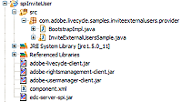

# Creación de un controlador de usuarios externos de invitación {#create-invite-external-users-handler}

**Los ejemplos y ejemplos de este documento son solo para AEM Forms en un entorno JEE.**

Puede crear un controlador de usuarios externos de invitación para el servicio de Rights Management. Un controlador de usuarios externos de invitación permite al servicio de Rights Management invitar a usuarios externos para que se conviertan en usuarios Rights Management. Una vez que un usuario se convierte en un usuario Rights Management, el usuario puede realizar tareas como abrir un documento PDF protegido por políticas. Una vez que el controlador de usuarios externos de invitación se haya implementado en AEM Forms, puede utilizar la consola de administración para interactuar con él.

>[!NOTE]
>
>Un controlador de usuarios externos de invitación es un componente de AEM Forms. Antes de crear un controlador de usuarios externos de invitación, se recomienda familiarizarse con la creación de componentes.

**Resumen de los pasos**

Para desarrollar un controlador de usuarios externos de invitación, debe realizar los siguientes pasos:

1. Configure el entorno de desarrollo.
1. Defina la implementación del controlador de usuarios externos de invitación .
1. Defina el archivo XML de componente.
1. Implemente el controlador Invitar usuarios externos.
1. Pruebe el controlador Invitar usuarios externos.

## Configuración del entorno de desarrollo {#setting-up-development-environment}

Para configurar el entorno de desarrollo, debe crear un nuevo proyecto Java, como un proyecto de Eclipse. La versión de Eclipse compatible es `3.2.1` o posterior.

El SPI del Rights Management requiere que el archivo `edc-server-spi.jar` se establezca en la ruta de clase del proyecto. Si no hace referencia a este archivo JAR, no puede utilizar el Rights Management SPI en su proyecto Java. Este archivo JAR se instala con el SDK para AEM Forms en la carpeta `[install directory]\Adobe\Adobe_Experience_Manager_forms\sdk\spi` .

Además de añadir el archivo `edc-server-spi.jar` a la ruta de clase de su proyecto, también debe añadir los archivos JAR necesarios para utilizar la API de servicio de Rights Management. Estos archivos son necesarios para utilizar la API del servicio de Rights Management en el controlador de usuarios externos de invitación.

## Definición de la implementación del controlador de usuarios externos de invitación {#define-invite-external-users-handler}

Para desarrollar un controlador de usuarios externos de invitación, debe crear una clase Java que implemente la interfaz `com.adobe.edc.server.spi.ersp.InvitedUserProvider`. Esta clase contiene un método denominado `invitedUser`, que el servicio de Rights Management invoca cuando las direcciones de correo electrónico se envían mediante la página **Agregar usuarios invitados** accesible a través de la consola de administración.

El método `invitedUser` acepta una instancia `java.util.List`, que contiene direcciones de correo electrónico con tipo de cadena que se envían desde la página **Agregar usuarios invitados**. El método `invitedUser` devuelve una matriz de objetos `InvitedUserProviderResult`, que generalmente es una asignación de direcciones de correo electrónico a objetos User (no devuelve nulo).

>[!NOTE]
>
>Además de mostrar cómo crear un controlador de usuarios externos de invitación, esta sección también utiliza la API de AEM Forms.

La implementación del controlador de usuarios externos de invitación contiene un método definido por el usuario llamado `createLocalPrincipalAccount`. Este método acepta un valor de cadena que especifica una dirección de correo electrónico como valor de parámetro. El método `createLocalPrincipalAccount` asume la preexistencia de un dominio local llamado `EDC_EXTERNAL_REGISTERED`. Puede configurar este nombre de dominio para que sea lo que desee; sin embargo, para una aplicación de producción, es posible que desee integrarla con un dominio de empresa.

El método `createUsers` se repite sobre cada dirección de correo electrónico y crea un objeto User correspondiente (un usuario local en el dominio `EDC_EXTERNAL_REGISTERED` ). Finalmente, se llama al método `doEmails`. Este método se deja intencionalmente como un stub en la muestra. En una implementación de producción, contendría lógica de aplicación para enviar mensajes de correo electrónico de invitación a los usuarios recién creados. Se deja en el ejemplo para mostrar el flujo lógico de la aplicación de una aplicación real.

### Definición de la implementación del controlador de usuarios externos de invitación {#user-handler-implementation}

La siguiente implementación del controlador de usuarios externos de invitación acepta las direcciones de correo electrónico enviadas desde la página Agregar usuarios invitados a la que se puede acceder desde la consola de administración.

```as3
package com.adobe.livecycle.samples.inviteexternalusers.provider; 
 
import com.adobe.edc.server.spi.ersp.*; 
import com.adobe.idp.dsc.clientsdk.ServiceClientFactory; 
import com.adobe.idp.um.api.*; 
import com.adobe.idp.um.api.infomodel.*; 
import com.adobe.idp.um.api.impl.UMBaseLibrary; 
import com.adobe.livecycle.usermanager.client.DirectoryManagerServiceClient; 
 
import java.util.ArrayList; 
import java.util.Iterator; 
import java.util.List; 
 
public class InviteExternalUsersSample implements InvitedUserProvider 
{ 
       private ServiceClientFactory _factory = null; 
 
       private User createLocalPrincipalAccount(String email_address) throws Exception 
       { 
    String ret = null; 
 
    //  Assume the local domain already exists! 
    String domain = "EDC_EXTERNAL_REGISTERED"; 
         
    List aliases = new ArrayList(); 
    aliases.add( email_address ); 
         
    User local_user = UMBaseLibrary.createUser( email_address, domain, email_address ); 
    local_user.setCommonName( email_address ); 
    local_user.setEmail( email_address ); 
    local_user.setEmailAliases( aliases ); 
         
    //  You may wish to disable the local user until, for example, his registration is processed by a confirmation link 
    //local_user.setDisabled( true ); 
 
    DirectoryManager directory_manager = new DirectoryManagerServiceClient( _factory ); 
    String ret_oid = directory_manager.createLocalUser( local_user, null ); 
     
    if( ret_oid == null ) 
    { 
        throw new Exception( "FAILED TO CREATE PRINCIPAL FOR EMAIL ADDRESS: " + email_address ); 
    } 
 
    return local_user; 
       } 
 
       protected User[] createUsers( List emails ) throws Exception 
       { 
    ArrayList ret_users = new ArrayList(); 
 
    _factory = ServiceClientFactory.createInstance(); 
 
    Iterator iter = emails.iterator(); 
 
    while( iter.hasNext() ) 
    { 
        String current_email = (String)iter.next(); 
 
        ret_users.add( createLocalPrincipalAccount( current_email ) ); 
    } 
 
    return (User[])ret_users.toArray( new User[0] ); 
       } 
 
       protected void doInvitations(List emails) 
       { 
    //  Here you may choose to send the users who were created an invitation email 
    //  This step is completely optional, depending on your requirements.   
       } 
 
       public InvitedUserProviderResult[] invitedUser(List emails) 
       { 
    //  This sample demonstrates the workflow for inviting a user via email 
 
    try 
    { 
 
        User[] principals = createUsers(emails); 
 
        InvitedUserProviderResult[] result = new InvitedUserProviderResult[principals.length]; 
        for( int i = 0; i < principals.length; i++ ) 
        { 
        result[i] = new InvitedUserProviderResult(); 
 
        result[i].setEmail( (String)emails.get( i ) ); 
        result[i].setUser( principals[i] ); 
        } 
 
        doInvitations(emails); 
 
        System.out.println( "SUCCESSFULLY INVITED " + result.length + " USERS" ); 
 
        return result; 
 
    } 
    catch( Exception e ) 
    { 
        System.out.println( "FAILED TO INVITE USERS FOR INVITE USERS SAMPLE" ); 
        e.printStackTrace(); 
 
        return new InvitedUserProviderResult[0]; 
    } 
       } 
}
 
```

>[!NOTE]
>
>Esta clase Java se guarda como un archivo JAVA llamado InviteExternalUsersSample.java.

## Definición del archivo XML de componentes para el controlador de autorización {#define-component-xml-authorization-handler}

Debe definir un archivo XML de componente para implementar el componente de proceso de invitación de usuarios externos. Existe un archivo XML de componente para cada componente y proporciona metadatos sobre el componente.

El siguiente archivo `component.xml` se utiliza para el controlador de usuarios externos de invitación. Observe que el nombre del servicio es `InviteExternalUsersSample` y la operación que este servicio expone se llama `invitedUser`. El parámetro de entrada es una instancia `java.util.List` y el valor de salida es una matriz de instancias `com.adobe.edc.server.spi.esrp.InvitedUserProviderResult`.

### Definición del archivo XML de componente para el controlador de usuarios externos de invitación {#component-xml-invite-external-users-handler}

```as3
<component xmlns="http://adobe.com/idp/dsc/component/document"> 
<component-id>com.adobe.livecycle.samples.inviteexternalusers</component-id> 
<version>1.0</version> 
<bootstrap-class>com.adobe.livecycle.samples.inviteexternalusers.provider.BootstrapImpl</bootstrap-class> 
<descriptor-class>com.adobe.idp.dsc.component.impl.DefaultPOJODescriptorImpl</descriptor-class> 
<services> 
<service name="InviteExternalUsersSample"> 
<specifications> 
<specification spec-id="com.adobe.edc.server.spi.ersp.InvitedUserProvider"/> 
</specifications> 
<specification-version>1.0</specification-version> 
<implementation-class>com.adobe.livecycle.samples.inviteexternalusers.provider.InviteExternalUsersSample</implementation-class> 
<auto-deploy category-id="Samples" service-id="InviteExternalUsersSample" major-version="1" minor-version="0"/> 
<operations> 
<operation name="invitedUser"> 
<input-parameter name="input" type="java.util.List" required="true"/> 
<output-parameter name="result" type="com.adobe.edc.server.spi.esrp.InvitedUserProviderResult[]"/> 
</operation> 
</operations> 
</service> 
</services> 
</component> 
```

## Empaquetado del controlador de usuarios externos de invitación {#packaging-invite-external-users-handler}

Para implementar el controlador de usuarios externos de invitación en AEM Forms, debe empaquetar el proyecto Java en un archivo JAR. Debe asegurarse de que los archivos JAR externos de los que depende la lógica empresarial del controlador de usuarios externos de invitación, como los archivos `edc-server-spi.jar` y `adobe-rightsmanagement-client.jar` también estén incluidos en el archivo JAR. Además, el archivo XML de componente debe estar presente. El archivo `component.xml` y los archivos JAR externos deben estar ubicados en la raíz del archivo JAR.

>[!NOTE]
>
>En la siguiente ilustración, se muestra una clase `BootstrapImpl`. En esta sección no se explica cómo crear una clase `BootstrapImpl`.

La siguiente ilustración muestra el contenido del proyecto Java empaquetado en el archivo JAR del controlador de usuarios externos de invitación.



A. Archivos JAR externos requeridos por el componente B. Archivo JAVA

Debe empaquetar el controlador de usuarios externos de invitación en un archivo JAR. En el diagrama anterior, observe que se muestran los archivos .JAVA. Una vez empaquetado en un archivo JAR, también se deben especificar los archivos .CLASS correspondientes. Sin los archivos .CLASS, el controlador de autorización no funciona.

>[!NOTE]
>
>Después de empaquetar el controlador de autorización externo en un archivo JAR, puede implementar el componente en AEM Forms. Solo se puede implementar un controlador de usuarios externos de invitación en un momento determinado.

>[!NOTE]
>
>También puede implementar un componente mediante programación.

## Prueba del controlador de usuarios externos de invitación {#testing-invite-external-users-handler}

Para probar el controlador de invitar usuarios externos, puede agregar usuarios externos a la invitación mediante la consola de administración.

Para agregar usuarios externos a la invitación mediante la consola de administración:

1. Implemente el archivo JAR del controlador de usuarios externos de invitación mediante Workbench.
1. Reinicie el servidor de aplicaciones.
1. Inicie sesión en la consola de administración.
1. Haga clic en **[!UICONTROL Servicios]** > **[!UICONTROL Rights Management]** > **[!UICONTROL Configuración]** > **[!UICONTROL Registro de usuario]** invitado.
1. Habilite el registro de usuario invitado marcando la casilla **[!UICONTROL Habilitar registro de usuario invitado]**. En **[!UICONTROL Usar sistema de registro integrado]**, haga clic en **[!UICONTROL No]**. Guarde la configuración.
1. En la página de inicio de la consola de administración, haga clic en **[!UICONTROL Configuración]** > **[!UICONTROL Administración de usuarios]** > **[!UICONTROL Administración de dominios]**.
1. Haga clic en **[!UICONTROL Nuevo dominio local]**. En la página siguiente, cree un dominio con el nombre y el valor de identificador de `EDC_EXTERNAL_REGISTERED`. Guarde los cambios.
1. En la página de inicio de la consola de administración, haga clic en **[!UICONTROL Servicios]** > **[!UICONTROL Rights Management]** > **[!UICONTROL Usuarios invitados y locales]**. Aparece la página **[!UICONTROL Agregar usuario invitado]**.
1. Introduzca direcciones de correo electrónico (como el controlador de usuario externo de la invitación actual no envía realmente mensajes de correo electrónico, la dirección de correo electrónico no tiene que ser válida). Haga clic en **[!UICONTROL Aceptar]**. Los usuarios son invitados al sistema.
1. En la página de inicio de la consola de administración, haga clic en **[!UICONTROL Configuración]** > **[!UICONTROL Administración de usuarios]** > **[!UICONTROL Usuarios y grupos]**.
1. En el campo **[!UICONTROL Find]**, introduzca una dirección de correo electrónico especificada. Haga clic en **[!UICONTROL Buscar]**. El usuario que ha invitado aparece como un usuario en el dominio local `EDC_EXTERNAL_REGISTERED` .

>[!NOTE]
>
>El controlador de usuarios externos de invitación falla si el componente se detiene o desinstala.
