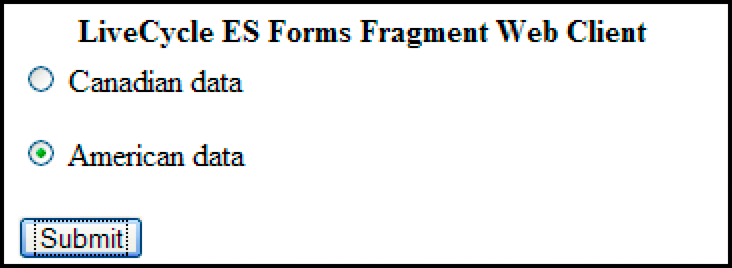

# Creación de aplicaciones Web que procesan formularios {#creating-web-applications-thatrenders-forms}

## Creación de aplicaciones Web que procesan formularios {#creating-web-applications-that-renders-forms}

Puede crear una aplicación basada en Web que utilice servlets de Java para invocar el servicio Forms y procesar formularios. Una ventaja de utilizar un servlet Java™ es que puede escribir el valor devuelto del proceso en un navegador web cliente. Es decir, se puede utilizar un servlet Java como vínculo entre el servicio Forms que devuelve un formulario y un explorador web cliente.

>[!NOTE]
>
>En esta sección se describe cómo crear una aplicación basada en Web que utilice un servlet Java que invoque el servicio Forms y procese formularios basados en fragmentos. (Consulte [Representación de formularios basados en fragmentos](/help/forms/developing/rendering-forms-based-fragments.md)).

Con un servlet de Java, puede escribir un formulario en un navegador web del cliente para que éste pueda ver e introducir datos en el formulario. Después de rellenar el formulario con datos, el usuario web hace clic en un botón de envío ubicado en el formulario para enviar información al servlet Java, donde se pueden recuperar y procesar los datos. Por ejemplo, los datos se pueden enviar a otro proceso.

En esta sección se explica cómo crear una aplicación basada en Web que permita al usuario seleccionar datos de formulario basados en EE. UU. o datos de formulario basados en Canadá, como se muestra en la siguiente ilustración.



El formulario que se procesa es un formulario basado en fragmentos. Es decir, si el usuario selecciona datos estadounidenses, el formulario devuelto utiliza fragmentos basados en datos estadounidenses. Por ejemplo, el pie de página del formulario contiene una dirección americana, como se muestra en la siguiente ilustración.


Del mismo modo, si el usuario selecciona datos canadienses, el formulario devuelto contiene una dirección canadiense, como se muestra en la siguiente ilustración.


>[!NOTE]
>
>Para obtener información sobre la creación de diseños de formulario basados en fragmentos, consulte [Forms Designer](https://www.adobe.com/go/learn_aemforms_designer_63).

**Archivos de muestra**

En esta sección se utilizan archivos de ejemplo que pueden ubicarse en la siguiente ubicación:

&lt;*Forms Designer install directory*>/Samples/Forms/Purchase Order/Form Fragments

donde &lt;*install directory*> es la ruta de instalación. Para la aplicación cliente, el archivo Purchase Order Dynamic.xdp se copió de esta ubicación de instalación y se implementó en una aplicación Forms denominada *Aplicaciones/FormsApplication*. El archivo Purchase Order Dynamic.xdp se coloca en una carpeta denominada FormsFolder. Del mismo modo, los fragmentos se colocan en la carpeta denominada Fragments, como se muestra en la siguiente ilustración.


Para acceder al diseño de formulario Purchase Order Dynamic.xdp, especifique `Applications/FormsApplication/1.0/FormsFolder/Purchase Order Dynamic.xdp` como nombre de formulario (el primer parámetro que se pasa al `renderPDFForm` método) y `repository:///` como valor de URI raíz de contenido.

Los archivos de datos XML utilizados por la aplicación web se movieron de la carpeta Data a `C:\Adobe`(el sistema de archivos que pertenece al servidor de aplicaciones J2EE que aloja AEM Forms). Los nombres de archivo son Purchase Order *Canada.xml* y Purchase Order *US.xml*.

>[!NOTE]
>
>Para obtener información sobre la creación de una aplicación de Forms mediante Workbench, consulte la Ayuda [de Workbench](https://www.adobe.com/go/learn_aemforms_workbench_63).

### Resumen de los pasos {#summary-of-steps}

Para crear aplicaciones basadas en Web que procesen formularios basados en fragmentos, lleve a cabo los siguientes pasos:

1. Cree un nuevo proyecto web.
1. Cree una lógica de aplicación Java que represente el servlet Java.
1. Cree la página web para la aplicación web.
1. Empaquete la aplicación web a un archivo WAR.
1. Implementar el archivo WAR en el servidor de aplicaciones J2EE.
1. Pruebe la aplicación web.

>[!NOTE]
>
>Algunos de estos pasos dependen de la aplicación J2EE en la que se implementa AEM Forms. Por ejemplo, el método que utilice para implementar un archivo WAR depende del servidor de aplicaciones J2EE que utilice. En esta sección se asume que AEM Forms se implementa en JBoss®.

### Creación de un proyecto web {#creating-a-web-project}

El primer paso para crear una aplicación web que contenga un servlet Java que pueda invocar el servicio Forms es crear un nuevo proyecto web. El IDE de Java en el que se basa este documento es Eclipse 3.3. Mediante el IDE de Eclipse, cree un proyecto web y agregue los archivos JAR necesarios al proyecto. Finalmente, agregue una página HTML denominada *index.html* y un servlet Java al proyecto.

La siguiente lista especifica los archivos JAR que debe agregar al proyecto web:

* adobe-forms-client.jar
* adobe-livecycle-client.jar
* adobe-usermanager-client.jar
* adobe-utilities.jar

Para ver la ubicación de estos archivos JAR, consulte [Inclusión de archivos](/help/forms/developing/invoking-aem-forms-using-java.md#including-aem-forms-java-library-files)de biblioteca Java de AEM Forms.

**Para crear un proyecto web:**

1. Inicie Eclipse y haga clic en **Archivo** > **Nuevo proyecto**.
1. En el cuadro de diálogo **Nuevo proyecto** , seleccione **Web** > Proyecto **Web** dinámico.
1. Escriba `FragmentsWebApplication` el nombre del proyecto y haga clic en **Finalizar**.

**Para agregar los archivos JAR necesarios al proyecto:**

1. En la ventana Explorador de proyectos, haga clic con el botón derecho en el `FragmentsWebApplication` proyecto y seleccione **Propiedades**.
1. Haga clic en Ruta **de compilación de** Java y, a continuación, haga clic en la ficha **Bibliotecas** .
1. Haga clic en el botón **Agregar JAR** externos y busque los archivos JAR que desea incluir.

**Para agregar un servlet Java al proyecto:**

1. En la ventana Explorador de proyectos, haga clic con el botón derecho en el `FragmentsWebApplication` proyecto y seleccione **Nuevo** > **Otro**.
1. Expanda la carpeta **Web** , seleccione **Servlet** y, a continuación, haga clic en **Siguiente**.
1. En el cuadro de diálogo Crear servlet, escriba `RenderFormFragment` el nombre del servlet y haga clic en **Finalizar**.

**Para agregar una página HTML al proyecto:**

1. En la ventana Explorador de proyectos, haga clic con el botón derecho en el `FragmentsWebApplication` proyecto y seleccione **Nuevo** > **Otro**.
1. Expanda la carpeta **Web** , seleccione **HTML** y haga clic en **Siguiente**.
1. En el cuadro de diálogo Nuevo HTML, escriba `index.html` el nombre del archivo y haga clic en **Finalizar**.

>[!NOTE]
>
>Para obtener información sobre la creación de la página HTML que invoca el servlet `RenderFormFragment` Java, consulte[Creación de la página](/help/forms/developing/rendering-forms.md#creating-the-web-page)Web.

### Creación de la lógica de la aplicación Java para el servlet {#creating-java-application-logic-for-the-servlet}

Puede crear una lógica de aplicación Java que invoque el servicio Forms desde el servlet Java. El código siguiente muestra la sintaxis del `RenderFormFragment` Servlet Java:

```as3
     public class RenderFormFragment extends HttpServlet implements Servlet {
         public void doGet(HttpServletRequest req, HttpServletResponse resp
         throws ServletException, IOException {
         doPost(req,resp);
 
         }
         public void doPost(HttpServletRequest req, HttpServletResponse resp
         throws ServletException, IOException {
             //Add code here to invoke the Forms service
             }
```

Normalmente, no se coloca el código de cliente dentro de un `doGet` `doPost` método o servlet Java. Una mejor práctica de programación es colocar este código dentro de una clase independiente, crear instancias de la clase desde el `doPost` método (o `doGet` método) y llamar a los métodos apropiados. Sin embargo, para la brevedad del código, los ejemplos de código de esta sección se mantienen al mínimo y los ejemplos de código se colocan en el `doPost` método.

Para procesar un formulario basado en fragmentos con la API de servicio de Forms, realice las siguientes tareas:

1. Incluya archivos JAR de cliente, como adobe-forms-client.jar, en la ruta de clases del proyecto Java. Para obtener información sobre la ubicación de estos archivos, consulte [Inclusión de archivos](/help/forms/developing/invoking-aem-forms-using-java.md#including-aem-forms-java-library-files)de biblioteca Java de AEM Forms.
1. Recupere el valor del botón de opción que se envía desde el formulario HTML y especifica si se deben utilizar datos estadounidenses o canadienses. Si se envía American, cree un `com.adobe.idp.Document` que almacene los datos ubicados en el archivo US.xml *de la orden de* compra. Del mismo modo, si es canadiense, cree un archivo `com.adobe.idp.Document` que almacene datos ubicados en el archivo *Purchase Order Canada.xml* .
1. Cree un `ServiceClientFactory` objeto que contenga propiedades de conexión. (Consulte [Configuración de propiedades](/help/forms/developing/invoking-aem-forms-using-java.md#setting-connection-properties)de conexión).
1. Cree un `FormsServiceClient` objeto utilizando su constructor y pasando el `ServiceClientFactory` objeto.
1. Cree un `URLSpec` objeto que almacene valores URI mediante su constructor.
1. Invoque el `URLSpec` método del `setApplicationWebRoot` objeto y pase un valor de cadena que represente la raíz web de la aplicación.
1. Invoque el `URLSpec` método del `setContentRootURI` objeto y pase un valor de cadena que especifique el valor de URI raíz del contenido. Asegúrese de que el diseño de formulario y los fragmentos están ubicados en el URI raíz de contenido. De lo contrario, el servicio Forms genera una excepción. Para hacer referencia al repositorio de AEM Forms, especifique `repository://`.
1. Invoque el `URLSpec` método del `setTargetURL` objeto y pase un valor de cadena que especifique el valor de la dirección URL de destino al que se registran los datos del formulario. Si define la dirección URL de destino en el diseño de formulario, puede pasar una cadena vacía. También puede especificar la dirección URL a la que se envía un formulario para realizar cálculos.
1. Invoque el `FormsServiceClient` método del `renderPDFForm` objeto y pase los valores siguientes:

   * Un valor de cadena que especifica el nombre del diseño de formulario, incluida la extensión del nombre de archivo.
   * Un `com.adobe.idp.Document` objeto que contiene datos para combinar con el formulario (creado en el paso 2).
   * Un `PDFFormRenderSpec` objeto que almacena opciones de tiempo de ejecución. Para obtener más información, consulte [AEM Forms API Reference](https://www.adobe.com/go/learn_aemforms_javadocs_63_en).
   * Un `URLSpec` objeto que contiene valores URI que el servicio Forms requiere para procesar un formulario basado en fragmentos.
   * Un `java.util.HashMap` objeto que almacena archivos adjuntos. Es un parámetro opcional y puede especificar `null` si no desea adjuntar archivos al formulario.
   El `renderPDFForm` método devuelve un `FormsResult` objeto que contiene una secuencia de datos de formulario que se debe escribir en el explorador Web del cliente.

1. Cree un `com.adobe.idp.Document` objeto invocando el `FormsResult` método ‘s `getOutputContent` .
1. Obtenga el tipo de contenido del `com.adobe.idp.Document` objeto invocando su `getContentType` método.
1. Defina el tipo de contenido del `javax.servlet.http.HttpServletResponse` objeto invocando su `setContentType` método y pasando el tipo de contenido del `com.adobe.idp.Document` objeto.
1. Cree un `javax.servlet.ServletOutputStream` objeto que se utilice para escribir la secuencia de datos del formulario en el navegador web del cliente invocando el `javax.servlet.http.HttpServletResponse` método `getOutputStream` del objeto.
1. Cree un `java.io.InputStream` objeto invocando el `com.adobe.idp.Document` método `getInputStream` del objeto.
1. Cree una matriz de bytes para rellenarla con la secuencia de datos del formulario invocando el `InputStream` método del `read`objeto y pasando la matriz de bytes como argumento.
1. Invoque el `javax.servlet.ServletOutputStream` método del `write` objeto para enviar la secuencia de datos del formulario al explorador web del cliente. Pase la matriz de bytes al `write` método .

El siguiente ejemplo de código representa el servlet Java que invoca el servicio Forms y procesa un formulario basado en fragmentos.

```as3
 /*
     * This Java Quick Start uses the following JAR files
     * 1. adobe-forms-client.jar
     * 2. adobe-livecycle-client.jar
     * 3. adobe-usermanager-client.jar
     *
     * (Because Forms quick starts are implemented as Java servlets, it is
     * not necessary to include J2EE specific JAR files - the Java project
     * that contains this quick start is exported as a WAR file which
     * is deployed to the J2EE application server)
     *
     * These JAR files are located in the following path:
     * <install directory>/sdk/client-libs
     *
     * For complete details about the location of these JAR files,
     * see "Including AEM Forms library files" in Programming with AEM forms
     */
 import java.io.File;
 import java.io.FileInputStream;
 import java.io.IOException;
 import java.io.PrintWriter;
 
 import javax.servlet.Servlet;
 import javax.servlet.ServletException;
 import javax.servlet.ServletOutputStream;
 import javax.servlet.http.HttpServlet;
 import javax.servlet.http.HttpServletRequest;
 import javax.servlet.http.HttpServletResponse;
 import com.adobe.livecycle.formsservice.client.*;
 import java.util.*;
 import java.io.InputStream;
 import java.net.URL;
 
 import com.adobe.idp.Document;
 import com.adobe.idp.dsc.clientsdk.ServiceClientFactory;
 import com.adobe.idp.dsc.clientsdk.ServiceClientFactoryProperties;
 
 public class RenderFormFragment extends HttpServlet implements Servlet {
 
     public void doGet(HttpServletRequest req, HttpServletResponse resp)
         throws ServletException, IOException {
             doPost(req,resp);
 
     }
     public void doPost(HttpServletRequest req, HttpServletResponse resp)
     throws ServletException, IOException {
 
 
 
         try{
             //Set connection properties required to invoke AEM Forms
             Properties connectionProps = new Properties();
             connectionProps.setProperty(ServiceClientFactoryProperties.DSC_DEFAULT_SOAP_ENDPOINT, "https://[server]:[port]");
             connectionProps.setProperty(ServiceClientFactoryProperties.DSC_TRANSPORT_PROTOCOL,ServiceClientFactoryProperties.DSC_SOAP_PROTOCOL);
             connectionProps.setProperty(ServiceClientFactoryProperties.DSC_SERVER_TYPE, "JBoss");
             connectionProps.setProperty(ServiceClientFactoryProperties.DSC_CREDENTIAL_USERNAME, "administrator");
             connectionProps.setProperty(ServiceClientFactoryProperties.DSC_CREDENTIAL_PASSWORD, "password");
 
             //Get the value of selected radio button
             String radioValue = req.getParameter("radio");
 
             //Create an Document object to store form data
             Document oInputData = null;
 
             //The value of the radio button determines the form data to use
             //which determines which fragments used in the form
             if (radioValue.compareTo("AMERICAN") == 0)            {
                 FileInputStream myData = new FileInputStream("C:\\Adobe\Purchase Order US.xml");
                 oInputData = new Document(myData);
             }
             else if (radioValue.compareTo("CANADIAN") == 0)            {
                 FileInputStream myData = new FileInputStream("C:\\Adobe\Purchase Order Canada.xml");
                 oInputData = new Document(myData);
             }
 
             //Create a ServiceClientFactory object
             ServiceClientFactory myFactory = ServiceClientFactory.createInstance(connectionProps);
 
             //Create a FormsServiceClient object
             FormsServiceClient formsClient = new FormsServiceClient(myFactory);
 
             //Set the parameter values for the renderPDFForm method
             String formName = "Applications/FormsApplication/1.0/FormsFolder/Purchase Order Dynamic.xdp";
 
             //Cache the PDF form
             PDFFormRenderSpec pdfFormRenderSpec = new PDFFormRenderSpec();
             pdfFormRenderSpec.setCacheEnabled(new Boolean(true));
 
             //Specify URI values that are required to render a form
             //design based on fragments
             URLSpec uriValues = new URLSpec();
             uriValues.setApplicationWebRoot("https://[server]:[port]/RenderFormFragment");
             uriValues.setContentRootURI("repository:///");
             uriValues.setTargetURL("https://[server]:[port]/FormsServiceClientApp/HandleData");
 
             //Invoke the renderPDFForm method and write the
             //results to a client web browser
             FormsResult formOut = formsClient.renderPDFForm(
                         formName,               //formQuery
                         oInputData,             //inDataDoc
                         pdfFormRenderSpec,      //PDFFormRenderSpec
                         uriValues,                //urlSpec
                         null                    //attachments
                         );
 
             //Create a Document object that stores form data
             Document myData = formOut.getOutputContent();
 
             //Get the content type of the response and
             //set the HttpServletResponse object’s content type
             String contentType = myData.getContentType();
             resp.setContentType(contentType);
 
             //Create a ServletOutputStream object
             ServletOutputStream oOutput = resp.getOutputStream();
 
             //Create an InputStream object
             InputStream inputStream = myData.getInputStream();
 
             //Write the data stream to the web browser
             byte[] data = new byte[4096];
             int bytesRead = 0;
             while ((bytesRead = inputStream.read(data)) > 0)
             {
                 oOutput.write(data, 0, bytesRead);
             }
 
         }catch (Exception e) {
              System.out.println("The following exception occurred: "+e.getMessage());
       }
     }
 }
```

### Creación de la página web {#creating-the-web-page}

La página web index.html proporciona un punto de entrada al servlet Java e invoca el servicio Forms. Esta página web es un formulario HTML básico que contiene dos botones de opción y un botón de envío. El nombre de los botones de radio es radio. Cuando el usuario hace clic en el botón de envío, los datos del formulario se publican en el servlet `RenderFormFragment` Java.

El servlet Java captura los datos que se anuncian desde la página HTML mediante el siguiente código Java:

```as3
             Document oInputData = null;
 
             //Get the value of selected radio button
             String radioValue = req.getParameter("radio");
 
             //The value of the radio button determines the form data to use
             //which determines which fragments used in the form
             if (radioValue.compareTo("AMERICAN") == 0)            {
                 FileInputStream myData = new FileInputStream("C:\\Adobe\Purchase Order US.xml");
                 oInputData = new Document(myData);
             }
             else if (radioValue.compareTo("CANADIAN") == 0)            {
                 FileInputStream myData = new FileInputStream("C:\\Adobe\Purchase Order Canada.xml");
                 oInputData = new Document(myData);
             }
```

El siguiente código HTML se encuentra en el archivo index.html que se creó durante la configuración del entorno de desarrollo. (Consulte [Creación de un proyecto](/help/forms/developing/rendering-forms.md#creating-a-web-project)web).

```as3
 <!DOCTYPE html PUBLIC "-//W3C//DTD XHTML 1.0 Transitional//EN" "https://www.w3.org/TR/xhtml1/DTD/xhtml1-transitional.dtd">
 <html xmlns="https://www.w3.org/1999/xhtml">
 <head>
 <meta http-equiv="Content-Type" content="text/html; charset=utf-8" />
 <title>Untitled Document</title>
 </head>
 
 <body>
 <form name="myform" action="https://[server]:[port]/FragmentsWebApplication/RenderFormFragment" method="post">
      <table>
      <tr>
        <th>Forms Fragment Web Client</th>
      </tr>
      <tr>
        <td>
          <label>
          <input type="radio" name="radio" id="radio_Data" value="CANADIAN" />
          Canadian data<br />
          </label>
          <p>
            <label>
            <input type="radio" name="radio" id="radio_Data" value="AMERICAN" checked/>
            American data</label>
          </p>
        </td>
      </tr>
      <tr>
      <td>
        <label>
          <input type="submit" name="button_Submit" id="button_Submit" value="Submit" />
            </label>
            </td>
         </tr>
        </table>
      </form>
 </body>
 </html>
```

### Empaquetado de la aplicación Web {#packaging-the-web-application}

Para implementar el servlet Java que invoca el servicio Forms, empaquete la aplicación web a un archivo WAR. Asegúrese de que los archivos JAR externos de los que depende la lógica empresarial del componente, como adobe-livecycle-client.jar y adobe-forms-client.jar, también estén incluidos en el archivo WAR.

**Para empaquetar una aplicación web en un archivo WAR:**

1. En la ventana **Explorador** de proyectos, haga clic con el botón derecho en el `FragmentsWebApplication` proyecto y seleccione **Exportar** > archivo **** WAR.
1. En el cuadro de texto Módulo **** Web, escriba `FragmentsWebApplication` el nombre del proyecto Java.
1. En el cuadro de texto **Destino** , escriba `FragmentsWebApplication.war`**el nombre del **archivo, especifique la ubicación del archivo WAR y, a continuación, haga clic en Finalizar.

### Implementación del archivo WAR en el servidor de aplicaciones J2EE {#deploying-the-war-file-to-the-j2ee-application-server}

Puede implementar el archivo WAR en el servidor de aplicaciones J2EE en el que se implementa AEM Forms. Una vez implementado el archivo WAR, puede acceder a la página web HTML mediante un navegador web.

**Para implementar el archivo WAR en el servidor de aplicaciones J2EE:**

* Copie el archivo WAR de la ruta de exportación a `[Forms Install]\Adobe\Adobe Experience Manager Forms\jboss\server\all\deploy`.

### Prueba de la aplicación web {#testing-your-web-application}

Después de implementar la aplicación web, puede probarla con un navegador web. Si utiliza el mismo equipo que aloja AEM Forms, puede especificar la siguiente URL:

* http://localhost:8080/FragmentsWebApplication/index.html

   Seleccione un botón de radio y haga clic en el botón Enviar. Aparecerá un formulario basado en fragmentos en el explorador Web. Si se producen problemas, consulte el archivo de registro del servidor de aplicaciones J2EE.

