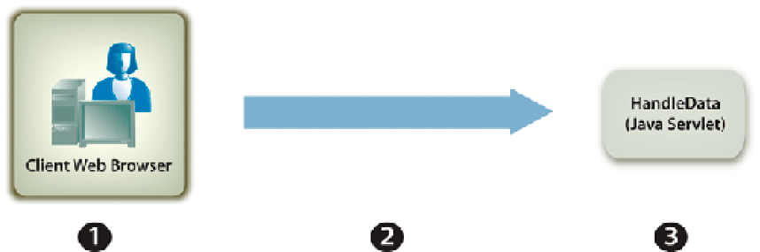

# Administrar formularios enviados {#handling-submitted-forms}

**Las muestras y los ejemplos de este documento solo son para AEM Forms en un entorno JEE.**

Las aplicaciones basadas en Web que permiten a un usuario rellenar formularios interactivos requieren que los datos se devuelvan al servidor. Con el servicio Forms, puede recuperar los datos introducidos por el usuario en un formulario interactivo. Una vez recuperados los datos, puede procesarlos para satisfacer sus necesidades empresariales. Por ejemplo, puede almacenar los datos en una base de datos, enviarlos a otra aplicación, enviarlos a otro servicio, combinar los datos en un diseño de formulario, mostrar los datos en un explorador web, etc.

Los datos de formulario se envían al servicio Forms como datos XML o de PDF, que es una opción que se establece en Designer. Un formulario enviado como XML permite extraer valores de datos de campo individuales. Es decir, puede extraer el valor de cada campo de formulario que el usuario haya introducido en el formulario. Un formulario enviado como datos de PDF son datos binarios, no datos XML. Puede guardar el formulario como archivo de PDF o enviarlo a otro servicio. Si desea extraer datos de un formulario enviado como XML y, a continuación, utilizar los datos del formulario para crear un documento de PDF, invoque otra operación de AEM Forms. (Consulte [Creación de documentos de PDF con datos XML enviados](/help/forms/developing/creating-pdf-documents-submitted-xml.md))

El diagrama siguiente muestra los datos que se están enviando a un servlet Java denominado `HandleData` desde un formulario interactivo que se muestra en un explorador web.

En la tabla siguiente se explican los pasos del diagrama.

<table>
 <thead>
  <tr>
   <th>
Paso
</th>
   <th>
Descripción
</th>
  </tr>
 </thead>
 <tbody>
  <tr>
   <td>
1
</td>
   <td>
Un usuario rellena un formulario interactivo y hace clic en el botón Enviar del formulario.
</td>
  </tr>
  <tr>
   <td>
2
</td>
   <td>
Los datos se envían al servlet Java <code>HandleData</code> como datos XML.
</td>
  </tr>
  <tr>
   <td>
3
</td>
   <td>
El servlet Java <code>HandleData</code> contiene lógica de aplicación para recuperar los datos.
</td>
  </tr>
 </tbody>
</table>

## Administrar los datos XML enviados {#handling-submitted-xml-data}

Cuando los datos del formulario se envían como XML, puede recuperar datos XML que representen los datos enviados. Todos los campos de formulario aparecen como nodos en un esquema XML. Los valores de nodo corresponden a los valores que rellenó el usuario. Imagine un formulario de préstamo en el que cada campo del formulario aparece como un nodo dentro de los datos XML. El valor de cada nodo corresponde al valor que rellena un usuario. Supongamos que un usuario rellena el formulario de préstamo con los datos que se muestran en el siguiente formulario.

La siguiente ilustración muestra los datos XML correspondientes que se recuperan mediante la API de cliente del servicio de Forms.

Los campos del formulario de préstamo. Estos valores se pueden recuperar
uso de clases XML de Java.

>[!NOTE]
>
>El diseño de formulario debe configurarse correctamente en Designer para que los datos se envíen como datos XML. Para configurar correctamente el diseño de formulario para enviar datos XML, asegúrese de que el botón Enviar ubicado en el diseño de formulario está configurado para enviar datos XML. Para obtener información sobre cómo configurar el botón Enviar para enviar datos XML, consulte [AEM Forms Designer](https://www.adobe.com/go/learn_aemforms_designer_63).

## Gestión de datos de PDF enviados {#handling-submitted-pdf-data}

Considere una aplicación web que invoque el servicio de Forms. Una vez que el servicio Forms procesa un formulario interactivo de PDF en un explorador web de cliente, el usuario rellena el formulario y lo vuelve a enviar como datos de PDF. Cuando el servicio de Forms recibe los datos del PDF PDF, puede enviarlos a otro servicio o guardarlos como un archivo de PDF. El diagrama siguiente muestra el flujo lógico de la aplicación.

En la tabla siguiente se describen los pasos de este diagrama.

<table>
 <thead>
  <tr>
   <th>
Paso
</th>
   <th>
Descripción
</th>
  </tr>
 </thead>
 <tbody>
  <tr>
   <td>
1
</td>
   <td>
Una página web contiene un vínculo que accede a un servlet Java que invoca el servicio Forms.
</td>
  </tr>
  <tr>
   <td>
2
</td>
   <td>
El servicio Forms procesa un formulario de PDF interactivo en el explorador web del cliente.
</td>
  </tr>
  <tr>
   <td>
3
</td>
   <td>
El usuario rellena un formulario interactivo y hace clic en un botón de envío. El formulario se devuelve al servicio Forms como datos de PDF. Esta opción se establece en Designer.
</td>
  </tr>
  <tr>
   <td>
4
</td>
   <td>
El servicio Forms guarda los datos del PDF como un archivo de PDF. 
</td>
  </tr>
 </tbody>
</table>

## Gestión de los datos de URL enviados UTF-16 {#handling-submitted-url-utf-16-data}

Si los datos del formulario se envían como datos UTF-16 de la dirección URL, el equipo cliente requiere Adobe Reader o Acrobat 8.1 o posterior. Además, si el diseño de formulario contiene un botón de envío con codificación de datos URL (HTTP Post) y la opción de codificación de datos es UTF-16, el diseño de formulario debe modificarse en un editor de texto como el Bloc de notas. Puede establecer la opción de codificación en `UTF-16LE` o `UTF-16BE` para el botón de envío. Designer no proporciona esta funcionalidad.

>[!NOTE]
>
>Para obtener más información acerca del servicio Forms, consulte [Referencia de servicios para AEM Forms](https://www.adobe.com/go/learn_aemforms_services_63).

## Resumen de los pasos {#summary-of-steps}

Para gestionar los formularios enviados, realice las siguientes tareas:

1. Incluir archivos de proyecto.
1. Cree un objeto de API de cliente de Forms.
1. Recuperar datos de formulario.
1. Determine si el envío del formulario contiene archivos adjuntos.
1. Procesar los datos enviados.

**Incluir archivos de proyecto**

Incluya los archivos necesarios en el proyecto de desarrollo. Si está creando una aplicación cliente mediante Java, incluya los archivos JAR necesarios. Si utiliza servicios web, asegúrese de incluir los archivos proxy.

**Crear un objeto de API de cliente de Forms**

Para poder realizar mediante programación una operación de API de cliente de servicio de Forms, debe crear un cliente de servicio de Forms. Si está usando la API de Java, cree un objeto `FormsServiceClient`. Si está usando la API del servicio web de Forms, cree un objeto `FormsService`.

**Recuperar datos de formulario**

Para recuperar los datos de formulario enviados, invoca el método `processFormSubmission` del objeto `FormsServiceClient`. Al invocar este método, debe especificar el tipo de contenido del formulario enviado. Cuando los datos se envían desde un explorador web de cliente al servicio de Forms, pueden enviarse como datos XML o de PDF. Para recuperar los datos introducidos en los campos del formulario, los datos se pueden enviar como datos XML.

También puede recuperar campos de formulario de un formulario enviado como datos de PDF estableciendo las siguientes opciones en tiempo de ejecución:

* Pase el siguiente valor al método `processFormSubmission` como parámetro de tipo de contenido: `CONTENT_TYPE=application/pdf`.
* Establecer el valor `PDFToXDP` del objeto `RenderOptionsSpec` en `true`
* Establecer el valor `ExportDataFormat` del objeto `RenderOptionsSpec` en `XMLData`

Especifique el tipo de contenido del formulario enviado cuando invoca el método `processFormSubmission`. La siguiente lista especifica los valores de tipo de contenido aplicables:

* **text/xml**: representa el tipo de contenido que se utilizará cuando un formulario de PDF envíe datos de formulario como XML.
* **application/x-www-form-urlencoded**: representa el tipo de contenido que se utilizará cuando un formulario de HTML envíe datos como XML.
* **aplicación/pdf**: representa el tipo de contenido que se va a utilizar cuando un formulario de PDF envía datos como PDF.

>[!NOTE]
>
>Observará que hay tres inicios rápidos correspondientes asociados con la sección Gestión de Forms enviados. El Inicio rápido Gestión de PDF forms enviados como PDF mediante la API de Java muestra cómo gestionar los datos de PDF enviados. El tipo de contenido especificado en este inicio rápido es `application/pdf`. El Inicio rápido Gestión de PDF forms enviados como XML mediante la API de Java muestra cómo gestionar los datos XML enviados desde un formulario de PDF. El tipo de contenido especificado en este inicio rápido es `text/xml`. Del mismo modo, el Inicio rápido Administrar formularios de HTML enviados como XML mediante la API de Java muestra cómo administrar los datos XML enviados desde un formulario de HTML. El tipo de contenido especificado en este inicio rápido es application/x-www-form-urlencoded.

Los datos de formulario que se publicaron en el servicio Forms se recuperan y se determina su estado de procesamiento. Es decir, cuando se envían datos al servicio de Forms, no significa necesariamente que el servicio de Forms haya terminado de procesar los datos y que estos estén listos para procesarse. Por ejemplo, se pueden enviar datos al servicio Forms para poder realizar un cálculo. Cuando se completa el cálculo, el formulario se devuelve al usuario con los resultados del cálculo mostrados. Antes de procesar los datos enviados, se recomienda determinar si el servicio Forms ha terminado de procesar los datos.

El servicio Forms devuelve los siguientes valores para indicar si ha terminado de procesar los datos:

* **0 (Enviar):** Los datos enviados están listos para procesarse.
* **1 (Calcular):** El servicio Forms realizó una operación de cálculo en los datos y los resultados se deben devolver al usuario.
* **2 (Validar):** El servicio Forms validó los datos del formulario y los resultados se deben devolver al usuario.
* **3 (siguiente):** La página actual ha cambiado con resultados que deben escribirse en la aplicación cliente.
* **4 (Anterior**): La página actual ha cambiado con resultados que deben escribirse en la aplicación cliente.

>[!NOTE]
>
>Los cálculos y las validaciones deben devolverse al usuario. (Consulte [Cálculo de datos de formulario](/help/forms/developing/calculating-form-data.md#calculating-form-data).

**Determine si el envío del formulario contiene archivos adjuntos**

Forms enviado al servicio Forms puede contener archivos adjuntos. Por ejemplo, con el panel de archivos adjuntos integrado de Acrobat, un usuario puede seleccionar archivos adjuntos para enviarlos junto con el formulario. Además, un usuario también puede seleccionar archivos adjuntos mediante una barra de herramientas del HTML que se representa con un archivo del HTML.

Después de determinar si un formulario contiene archivos adjuntos, puede procesar los datos. Por ejemplo, puede guardar el archivo adjunto en el sistema de archivos local.

>[!NOTE]
>
>El formulario debe enviarse como datos de PDF para recuperar los archivos adjuntos. Si el formulario se envía como datos XML, los archivos adjuntos no se envían.

**Procesar los datos enviados**

Según el tipo de contenido de los datos enviados, puede extraer valores de campo de formulario individuales de los datos XML enviados o guardar los datos del PDF enviado como un archivo de PDF (o enviarlos a otro servicio). Para extraer campos de formulario individuales, convierta los datos XML enviados a una fuente de datos XML y, a continuación, recupere los valores de la fuente de datos XML utilizando las clases `org.w3c.dom`.

**Consulte también**

[Incluir archivos de biblioteca Java de AEM Forms](/help/forms/developing/invoking-aem-forms-using-java.md#including-aem-forms-java-library-files)

[Estableciendo propiedades de conexión](/help/forms/developing/invoking-aem-forms-using-java.md#setting-connection-properties)

[Inicio rápido de la API del servicio de Forms](/help/forms/developing/forms-service-api-quick-starts.md#forms-service-api-quick-starts)

[Pasar documentos al servicio de Forms](/help/forms/developing/passing-documents-forms-service.md)

[Crear aplicaciones web que procesen Forms](/help/forms/developing/creating-web-applications-renders-forms.md)

## Administrar formularios enviados mediante la API de Java {#handle-submitted-forms-using-the-java-api}

Administrar un formulario enviado mediante la API de Forms (Java):

1. Incluir archivos de proyecto

   Incluya archivos JAR de cliente, como adobe-forms-client.jar, en la ruta de clase del proyecto Java.

1. Crear un objeto de API de cliente de Forms

   * Cree un objeto `ServiceClientFactory` que contenga propiedades de conexión.
   * Cree un objeto `FormsServiceClient` utilizando su constructor y pasando el objeto `ServiceClientFactory`.

1. Recuperar datos de formulario

   * Para recuperar datos de formulario publicados en un servlet Java, cree un objeto `com.adobe.idp.Document` utilizando su constructor e invocando el método `getInputStream` del objeto `javax.servlet.http.HttpServletResponse` desde el constructor.
   * Crear un objeto `RenderOptionsSpec` mediante su constructor. Establezca el valor de configuración regional invocando el método `setLocale` del objeto `RenderOptionsSpec` y pasando un valor de cadena que especifique el valor de configuración regional.

   >[!NOTE]
   >
   >Puede indicar al servicio Forms que cree datos XDP o XML a partir del contenido de PDF enviado invocando el método `setPDF2XDP` del objeto `RenderOptionsSpec`, pasando `true`, llamando a `setXMLData` y pasando `true`. A continuación, puede invocar el método `getOutputXML` del objeto `FormsResult` para recuperar los datos XML correspondientes a los datos XDP/XML. (El método `processFormSubmission` devuelve el objeto `FormsResult`, que se explica en el siguiente paso secundario).

   * Invoque el método `processFormSubmission` del objeto `FormsServiceClient` y pase los siguientes valores:

      * El objeto `com.adobe.idp.Document` que contiene los datos del formulario.
      * Un valor de cadena que especifica variables de entorno, incluidos todos los encabezados HTTP relevantes. Especifique el tipo de contenido que desea gestionar. Para controlar los datos XML, especifique el siguiente valor de cadena para este parámetro: `CONTENT_TYPE=text/xml`. Para controlar los datos del PDF, especifique el siguiente valor de cadena para este parámetro: `CONTENT_TYPE=application/pdf`.
      * Un valor de cadena que especifica el valor del encabezado `HTTP_USER_AGENT`, por ejemplo, . `Mozilla/4.0 (compatible; MSIE 6.0; Windows NT 5.1; SV1; .NET CLR 1.1.4322)`. Este valor de parámetro es opcional.
      * Objeto `RenderOptionsSpec` que almacena opciones en tiempo de ejecución.

     El método `processFormSubmission` devuelve un objeto `FormsResult` que contiene los resultados del envío del formulario.

   * Determine si el servicio Forms terminó de procesar los datos del formulario invocando el método `getAction` del objeto `FormsResult`. Si este método devuelve el valor `0`, los datos están listos para procesarse.

1. Determinar si el envío del formulario contiene archivos adjuntos

   * Invoque el método `getAttachments` del objeto `FormsResult`. Este método devuelve un objeto `java.util.List` que contiene archivos enviados con el formulario.
   * Recorra en iteración el objeto `java.util.List` para determinar si hay archivos adjuntos. Si hay archivos adjuntos, cada elemento es una instancia de `com.adobe.idp.Document`. Puede guardar los archivos adjuntos invocando el método `copyToFile` del objeto `com.adobe.idp.Document` y pasando un objeto `java.io.File`.

   >[!NOTE]
   >
   >Este paso solo es aplicable si el formulario se envía como PDF.

1. Procesamiento de los datos enviados

   * Si el tipo de contenido de datos es `application/vnd.adobe.xdp+xml` o `text/xml`, cree una lógica de aplicación para recuperar los valores de datos XML.

      * Cree un objeto `com.adobe.idp.Document` invocando el método `getOutputContent` del objeto `FormsResult`.
      * Cree un objeto `java.io.InputStream` invocando el constructor `java.io.DataInputStream` y pasando el objeto `com.adobe.idp.Document`.
      * Cree un objeto `org.w3c.dom.DocumentBuilderFactory` llamando al método `newInstance` del objeto `org.w3c.dom.DocumentBuilderFactory` estático.
      * Cree un objeto `org.w3c.dom.DocumentBuilder` invocando el método `newDocumentBuilder` del objeto `org.w3c.dom.DocumentBuilderFactory`.
      * Cree un objeto `org.w3c.dom.Document` invocando el método `parse` del objeto `org.w3c.dom.DocumentBuilder` y pasando el objeto `java.io.InputStream`.
      * Recupere el valor de cada nodo dentro del documento XML. Una manera de realizar esta tarea es crear un método personalizado que acepte dos parámetros: el objeto `org.w3c.dom.Document` y el nombre del nodo cuyo valor desee recuperar. Este método devuelve un valor de cadena que representa el valor del nodo. En el ejemplo de código que sigue este proceso, este método personalizado se llama `getNodeText`. Se muestra el cuerpo de este método.

   * Si el tipo de contenido de datos es `application/pdf`, cree una lógica de aplicación para guardar los datos del PDF enviado como un archivo de PDF.

      * Cree un objeto `com.adobe.idp.Document` invocando el método `getOutputContent` del objeto `FormsResult`.
      * Cree un objeto `java.io.File` mediante su constructor público. Asegúrese de especificar PDF como la extensión del nombre de archivo.
      * Rellene el archivo de PDF invocando el método `copyToFile` del objeto `com.adobe.idp.Document` y pasando el objeto `java.io.File`.

**Consulte también**

[SOAP Inicio rápido (modo de): Gestión de PDF forms enviados como XML mediante la API de Java](/help/forms/developing/forms-service-api-quick-starts.md#quick-start-soap-mode-handling-pdf-forms-submitted-as-xml-using-the-java-api)

[SOAP Inicio rápido (modo de): Administrar formularios de HTML enviados como XML mediante la API de Java](/help/forms/developing/forms-service-api-quick-starts.md#quick-start-soap-mode-handling-html-forms-submitted-as-xml-using-the-java-api)

[SOAP Inicio rápido (modo de): Gestión de PDF forms enviados como PDF mediante la API de Java](/help/forms/developing/forms-service-api-quick-starts.md#quick-start-soap-mode-handling-pdf-forms-submitted-as-pdf-using-the-java-api)

[Incluir archivos de biblioteca Java de AEM Forms](/help/forms/developing/invoking-aem-forms-using-java.md#including-aem-forms-java-library-files)

[Estableciendo propiedades de conexión](/help/forms/developing/invoking-aem-forms-using-java.md#setting-connection-properties)

## Administrar los datos de los PDF enviados mediante la API del servicio web {#handle-submitted-pdf-data-using-the-web-service-api}

Administrar un formulario enviado mediante la API de Forms (servicio web):

1. Incluir archivos de proyecto

   * Cree clases de proxy Java que consuman el WSDL del servicio Forms.
   * Incluya las clases de proxy Java en la ruta de clase.

1. Crear un objeto de API de cliente de Forms

   Cree un objeto `FormsService` y establezca los valores de autenticación.

1. Recuperar datos de formulario

   * Para recuperar datos de formulario publicados en un servlet Java, cree un objeto `BLOB` mediante su constructor.
   * Cree un objeto `java.io.InputStream` invocando el método `getInputStream` del objeto `javax.servlet.http.HttpServletResponse`.
   * Cree un objeto `java.io.ByteArrayOutputStream` utilizando su constructor y pasando la longitud del objeto `java.io.InputStream`.
   * Copie el contenido del objeto `java.io.InputStream` en el objeto `java.io.ByteArrayOutputStream`.
   * Cree una matriz de bytes invocando el método `toByteArray` del objeto `java.io.ByteArrayOutputStream`.
   * Rellene el objeto `BLOB` invocando su método `setBinaryData` y pasando la matriz de bytes como argumento.
   * Crear un objeto `RenderOptionsSpec` mediante su constructor. Establezca el valor de configuración regional invocando el método `setLocale` del objeto `RenderOptionsSpec` y pasando un valor de cadena que especifique el valor de configuración regional.
   * Invoque el método `processFormSubmission` del objeto `FormsService` y pase los siguientes valores:

      * El objeto `BLOB` que contiene los datos del formulario.
      * Un valor de cadena que especifica variables de entorno, incluidos todos los encabezados HTTP relevantes. Especifique el tipo de contenido que desea gestionar. Para controlar los datos XML, especifique el siguiente valor de cadena para este parámetro: `CONTENT_TYPE=text/xml`. Para controlar los datos del PDF, especifique el siguiente valor de cadena para este parámetro: `CONTENT_TYPE=application/pdf`.
      * Valor de cadena que especifica el valor del encabezado `HTTP_USER_AGENT`; por ejemplo, `Mozilla/4.0 (compatible; MSIE 6.0; Windows NT 5.1; SV1; .NET CLR 1.1.4322)`.
      * Objeto `RenderOptionsSpec` que almacena opciones en tiempo de ejecución.
      * Un objeto `BLOBHolder` vacío que ha rellenado el método.
      * Un objeto `javax.xml.rpc.holders.StringHolder` vacío que ha rellenado el método.
      * Un objeto `BLOBHolder` vacío que ha rellenado el método.
      * Un objeto `BLOBHolder` vacío que ha rellenado el método.
      * Un objeto `javax.xml.rpc.holders.ShortHolder` vacío que ha rellenado el método.
      * Un objeto `MyArrayOf_xsd_anyTypeHolder` vacío que ha rellenado el método. Este parámetro se utiliza para almacenar los archivos adjuntos enviados junto con el formulario.
      * Un objeto `FormsResultHolder` vacío que el método rellena con el formulario enviado.

     El método `processFormSubmission` rellena el parámetro `FormsResultHolder` con los resultados del envío del formulario.

   * Determine si el servicio Forms terminó de procesar los datos del formulario invocando el método `getAction` del objeto `FormsResult`. Si este método devuelve el valor `0`, los datos del formulario están listos para procesarse. Puede obtener un objeto `FormsResult` si obtiene el valor del miembro de datos `value` del objeto `FormsResultHolder`.

1. Determinar si el envío del formulario contiene archivos adjuntos

   Obtenga el valor del miembro de datos `value` del objeto `MyArrayOf_xsd_anyTypeHolder` (el objeto `MyArrayOf_xsd_anyTypeHolder` se pasó al método `processFormSubmission`). Este miembro de datos devuelve una matriz de `Objects`. Cada elemento dentro de la matriz `Object` es un `Object` que corresponde a los archivos enviados junto con el formulario. Puede obtener cada elemento dentro de la matriz y convertirlo en un objeto `BLOB`.

1. Procesamiento de los datos enviados

   * Si el tipo de contenido de datos es `application/vnd.adobe.xdp+xml` o `text/xml`, cree una lógica de aplicación para recuperar los valores de datos XML.

      * Cree un objeto `BLOB` invocando el método `getOutputContent` del objeto `FormsResult`.
      * Cree una matriz de bytes invocando el método `getBinaryData` del objeto `BLOB`.
      * Cree un objeto `java.io.InputStream` invocando el constructor `java.io.ByteArrayInputStream` y pasando la matriz de bytes.
      * Cree un objeto `org.w3c.dom.DocumentBuilderFactory` llamando al método `newInstance` del objeto `org.w3c.dom.DocumentBuilderFactory` estático.
      * Cree un objeto `org.w3c.dom.DocumentBuilder` invocando el método `newDocumentBuilder` del objeto `org.w3c.dom.DocumentBuilderFactory`.
      * Cree un objeto `org.w3c.dom.Document` invocando el método `parse` del objeto `org.w3c.dom.DocumentBuilder` y pasando el objeto `java.io.InputStream`.
      * Recupere el valor de cada nodo dentro del documento XML. Una manera de realizar esta tarea es crear un método personalizado que acepte dos parámetros: el objeto `org.w3c.dom.Document` y el nombre del nodo cuyo valor desee recuperar. Este método devuelve un valor de cadena que representa el valor del nodo. En el ejemplo de código que sigue este proceso, este método personalizado se llama `getNodeText`. Se muestra el cuerpo de este método.

   * Si el tipo de contenido de datos es `application/pdf`, cree una lógica de aplicación para guardar los datos del PDF enviado como un archivo de PDF.

      * Cree un objeto `BLOB` invocando el método `getOutputContent` del objeto `FormsResult`.
      * Cree una matriz de bytes invocando el método `getBinaryData` del objeto `BLOB`.
      * Cree un objeto `java.io.File` mediante su constructor público. Asegúrese de especificar PDF como la extensión del nombre de archivo.
      * Cree un objeto `java.io.FileOutputStream` utilizando su constructor y pasando el objeto `java.io.File`.
      * Rellene el archivo PDF invocando el método `write` del objeto `java.io.FileOutputStream` y pasando la matriz de bytes.

**Consulte también**

[Invocar AEM Forms con codificación Base64](/help/forms/developing/invoking-aem-forms-using-web.md#invoking-aem-forms-using-base64-encoding)
