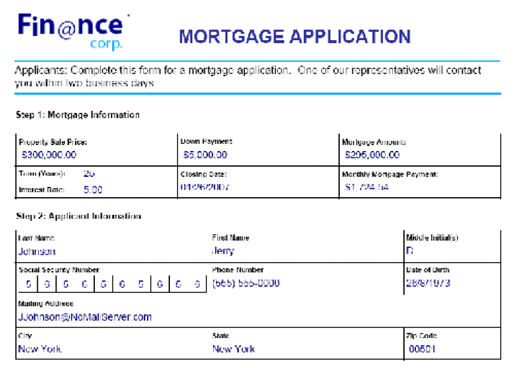

# Importar y exportar datos {#importing-and-exporting-data}

**Las muestras y los ejemplos de este documento solo son para AEM Forms en un entorno JEE.**

## Acerca del servicio de integración de datos de formulario {#about-the-form-data-integration-service}

El servicio de integración de datos de formulario puede importar datos en un formulario de PDF y exportarlos desde un formulario de PDF. Las operaciones de importación y exportación admiten dos tipos de PDF forms:

* Un formulario de Acrobat (creado en Acrobat) es un documento de PDF que contiene campos de formulario.
* Un formulario XML de Adobe (creado en Designer) es un documento de PDF que se ajusta a la arquitectura de Forms XML de Adobe XML (XFA).

Los datos de formulario pueden existir en uno de los siguientes formatos según el tipo de formulario del PDF:

* Un archivo XFDF, que es una versión XML del formato de datos del formulario de Acrobat.
* Un archivo XDP, que es un archivo XML que contiene definiciones de campos de formulario. También puede contener datos de campos de formulario y un archivo de PDF incrustado. Un archivo XDP generado por Designer solo se puede utilizar si lleva un documento de PDF incrustado con codificación base 64.

Puede realizar estas tareas mediante el servicio de integración de datos de formulario:

* Importación de datos en PDF forms. Para obtener más información, consulte [Importación de datos de formulario](importing-exporting-data.md#importing-form-data).
* Exportar datos de PDF forms. Para obtener más información, consulte [Exportación de datos de formulario](importing-exporting-data.md#exporting-form-data).

>[!NOTE]
>
>Para obtener más información acerca del servicio de integración de datos de formulario, consulte [Referencia de servicios para AEM Forms](https://www.adobe.com/go/learn_aemforms_services_63).

## Importación de datos de formulario {#importing-form-data}

Puede importar datos de formulario en PDF forms interactivos mediante el servicio de integración de datos de formulario. Un formulario PDF interactivo es un documento de PDF que contiene uno o más campos para recopilar información de un usuario o para mostrar información personalizada. El servicio de integración de datos de formulario no admite cálculos de formulario, validación ni scripts.

Para importar datos en un formulario creado en Designer, debe hacer referencia a una fuente de datos XML XDP válida. Veamos el siguiente ejemplo de formulario de solicitud de hipoteca.



Para importar valores de datos en este formulario, debe tener una fuente de datos XML XDP válida que corresponda al formulario. No se puede utilizar una fuente de datos XML arbitraria para importar datos a un formulario mediante el servicio de integración de datos de formulario. La diferencia entre una fuente de datos XML arbitraria y una fuente de datos XML XDP es que una fuente de datos XDP se ajusta a la arquitectura Forms XML (XFA). El siguiente XML representa una fuente de datos XML XDP que corresponde al formulario de aplicación hipotecaria de ejemplo.

```xml
 <?xml version="1.0" encoding="UTF-8" ?>
 - <xfa:datasets xmlns:xfa="https://www.xfa.org/schema/xfa-data/1.0/">
 - <xfa:data>
 - <data>
     - <Layer>
         <closeDate>1/26/2007</closeDate>
         <lastName>Johnson</lastName>
         <firstName>Jerry</firstName>
         <mailingAddress>JJohnson@NoMailServer.com</mailingAddress>
         <city>New York</city>
         <zipCode>00501</zipCode>
         <state>NY</state>
         <dateBirth>26/08/1973</dateBirth>
         <middleInitials>D</middleInitials>
         <socialSecurityNumber>(555) 555-5555</socialSecurityNumber>
         <phoneNumber>5555550000</phoneNumber>
     </Layer>
     - <Mortgage>
         <mortgageAmount>295000.00</mortgageAmount>
         <monthlyMortgagePayment>1724.54</monthlyMortgagePayment>
         <purchasePrice>300000</purchasePrice>
         <downPayment>5000</downPayment>
         <term>25</term>
         <interestRate>5.00</interestRate>
     </Mortgage>
 </data>
 </xfa:data>
 </xfa:datasets>
```

>[!NOTE]
>
>Para obtener más información acerca del servicio de integración de datos de formulario, consulte [Referencia de servicios para AEM Forms](https://www.adobe.com/go/learn_aemforms_services_63).

### Resumen de los pasos {#summary-of-steps}

Para importar datos de formulario en un formulario de PDF, realice los siguientes pasos:

1. Incluir archivos de proyecto.
1. Cree un cliente del servicio de integración de datos de formulario.
1. Hacer referencia a un formulario de PDF.
1. Hacer referencia a una fuente de datos XML.
1. Importe datos en el formulario de PDF.
1. Guarde el formulario de PDF como archivo de PDF.

**Incluir archivos de proyecto**

Incluya los archivos necesarios en el proyecto de desarrollo. Si está creando una aplicación cliente mediante Java, incluya los archivos JAR necesarios. Si utiliza servicios web, asegúrese de incluir los archivos proxy.

Los siguientes archivos JAR deben añadirse a la ruta de clase del proyecto:

* adobe-livecycle-client.jar
* adobe-usermanager-client.jar
* adobe-formdataintegration-client.jar
* adobe-utilities.jar (obligatorio si AEM Forms está implementado en JBoss)
* jbossall-client.jar (requerido si AEM Forms está implementado en JBoss)

Para obtener información sobre la ubicación de estos archivos JAR, consulte [Inclusión de archivos de biblioteca Java de AEM Forms](/help/forms/developing/invoking-aem-forms-using-java.md#including-aem-forms-java-library-files).

**Crear un cliente del servicio de integración de datos de formulario**

Para poder importar datos mediante programación en una API de cliente de formulario de PDF, debe crear un cliente de servicio de integración de datos. Al crear un cliente de servicios, define la configuración de conexión necesaria para invocar un servicio. Para obtener más información, vea [Configurar propiedades de conexión](/help/forms/developing/invoking-aem-forms-using-java.md#setting-connection-properties).

**Hacer referencia a un formulario de PDF**

Para importar datos en un formulario de PDF, debe hacer referencia a un formulario XML creado en Designer o a un formulario de Acrobat creado en Acrobat.

**Hacer referencia a un origen de datos XML**

Para importar datos de formulario, debe hacer referencia a un origen de datos válido. Para importar datos en un formulario XML XFA creado en Designer, debe utilizar una fuente de datos XML XDP. Si hace referencia a un formulario de Acrobat, debe utilizar una fuente de datos XFDF. Para cada campo en el que desee importar datos, se debe especificar un valor. Si un elemento de la fuente de datos XML no se corresponde con un campo del formulario, el elemento se ignora.

**Importar datos al formulario de PDF**

Después de hacer referencia a un formulario de PDF y a una fuente de datos XML válida, puede importar los datos en el formulario de PDF.

**Guardar el formulario de PDF como archivo de PDF**

Después de importar los datos en un formulario, puede guardarlo como un archivo de PDF. Una vez guardado como archivo de PDF, un usuario puede abrir el formulario en Adobe Reader o Acrobat y verlo con los datos importados.

**Consulte también**

[Importar datos de formulario mediante la API de Java](importing-exporting-data.md#import-form-data-using-the-java-api)

[Importación de datos de formulario mediante la API de servicio web](importing-exporting-data.md#import-form-data-using-the-web-service-api)

[Incluir archivos de biblioteca Java de AEM Forms](/help/forms/developing/invoking-aem-forms-using-java.md#including-aem-forms-java-library-files)

[Estableciendo propiedades de conexión](/help/forms/developing/invoking-aem-forms-using-java.md#setting-connection-properties)

[Inicio rápido de la API del servicio de integración de datos de formulario](/help/forms/developing/form-data-integration-service-java.md#form-data-integration-service-java-api-quick-start-soap)

[Exportación de datos de formulario](importing-exporting-data.md#exporting-form-data)

### Importar datos de formulario mediante la API de Java {#import-form-data-using-the-java-api}

Importar datos de formulario mediante la API de integración de datos de formulario (Java):

1. Incluir archivos de proyecto.

   Incluya archivos JAR de cliente, como adobe-formdataintegration-client.jar, en la ruta de clase del proyecto Java.

1. Cree un cliente del servicio de integración de datos de formulario.

   * Cree un objeto `ServiceClientFactory` que contenga propiedades de conexión.
   * Cree un objeto `FormDataIntegrationClient` utilizando su constructor y pasando el objeto `ServiceClientFactory`.

1. Hacer referencia a un formulario de PDF.

   * Crear un objeto `java.io.FileInputStream` mediante su constructor. Pase un valor de cadena que especifique la ubicación del formulario de PDF.
   * Cree un objeto `com.adobe.idp.Document` que almacene el formulario de PDF mediante el constructor `com.adobe.idp.Document`. Pase al constructor el objeto `java.io.FileInputStream` que contiene el formulario de PDF.

1. Hacer referencia a una fuente de datos XML.

   * Cree un objeto `java.io.FileInputStream` utilizando su constructor y pase un valor de cadena que especifique la ubicación del archivo XML que contiene los datos que se van a importar al formulario.
   * Cree un objeto `com.adobe.idp.Document` que almacene datos de formulario mediante el constructor `com.adobe.idp.Document`. Pase el objeto `java.io.FileInputStream` que contiene los datos del formulario al constructor.

1. Importe datos en el formulario de PDF.

   Importe datos al formulario de PDF invocando el método `importData` del objeto `FormDataIntegrationClient` y pasando los siguientes valores:

   * El objeto `com.adobe.idp.Document` que almacena el formulario de PDF.
   * El objeto `com.adobe.idp.Document` que almacena datos de formulario.

   El método `importData` devuelve un objeto `com.adobe.idp.Document` que almacena un formulario de PDF que contiene los datos en el origen de datos XML.

1. Guarde el formulario de PDF como archivo de PDF.

   * Cree un objeto `java.io.File` y asegúrese de que la extensión del archivo sea &quot;.PDF&quot;.
   * Invoque el método `copyToFile` del objeto `Document` para copiar el contenido del objeto `Document` en el archivo (asegúrese de utilizar el objeto `Document` devuelto por el método `importData`).

**Consulte también**

[Resumen de los pasos](importing-exporting-data.md#summary-of-steps)

[SOAP Inicio rápido (modo de): Importación de datos de formulario mediante la API de Java](/help/forms/developing/form-data-integration-service-java.md#quick-start-soap-mode-importing-form-data-using-the-java-api)

[Incluir archivos de biblioteca Java de AEM Forms](/help/forms/developing/invoking-aem-forms-using-java.md#including-aem-forms-java-library-files)

[Estableciendo propiedades de conexión](/help/forms/developing/invoking-aem-forms-using-java.md#setting-connection-properties)

### Importación de datos de formulario mediante la API de servicio web {#import-form-data-using-the-web-service-api}

Importar datos de formulario mediante la API de integración de datos de formulario (servicio web):

1. Incluir archivos de proyecto.

   Cree un proyecto de Microsoft .NET que utilice MTOM. Asegúrese de utilizar la siguiente definición de WSDL: `http://localhost:8080/soap/services/FormDataIntegration?WSDL&lc_version=9.0.1`.

   >[!NOTE]
   >
   >Reemplace `localhost` por la dirección IP del servidor que hospeda AEM Forms.

1. Cree un cliente del servicio de integración de datos de formulario.

   * Cree un objeto `FormDataIntegrationClient` utilizando su constructor predeterminado.
   * Cree un objeto `FormDataIntegrationClient.Endpoint.Address` mediante el constructor `System.ServiceModel.EndpointAddress`. Pase un valor de cadena que especifique el WSDL al servicio AEM Forms (por ejemplo, `http://localhost:8080/soap/services/FormDataIntegration?blob=mtom`). No necesita usar el atributo `lc_version`. Este atributo se utiliza al crear una referencia de servicio. Sin embargo, especifique `?blob=mtom` para utilizar MTOM.
   * Cree un objeto `System.ServiceModel.BasicHttpBinding` obteniendo el valor del campo `FormDataIntegrationClient.Endpoint.Binding`. Convertir el valor devuelto en `BasicHttpBinding`.
   * Establezca el campo `MessageEncoding` del objeto `System.ServiceModel.BasicHttpBinding` en `WSMessageEncoding.Mtom`. Este valor garantiza que se utiliza MTOM.
   * Habilite la autenticación HTTP básica realizando las siguientes tareas:

      * AEM Asigne el nombre de usuario de los formularios de la al campo `FormDataIntegrationClient.ClientCredentials.UserName.UserName`.
      * Asigne el valor de contraseña correspondiente al campo `FormDataIntegrationClient.ClientCredentials.UserName.Password`.
      * Asigne el valor constante `HttpClientCredentialType.Basic` al campo `BasicHttpBindingSecurity.Transport.ClientCredentialType`.
      * Asigne el valor constante `BasicHttpSecurityMode.TransportCredentialOnly` al campo `BasicHttpBindingSecurity.Security.Mode`.

1. Hacer referencia a un formulario de PDF.

   * Crear un objeto `BLOB` mediante su constructor. Este objeto `BLOB` se usa para almacenar el formulario de PDF.
   * Cree un objeto `System.IO.FileStream` invocando su constructor. Pase un valor de cadena que especifique la ubicación del formulario del PDF y el modo en que se abrirá el archivo.
   * Cree una matriz de bytes que almacene el contenido del objeto `System.IO.FileStream`. Puede determinar el tamaño de la matriz de bytes obteniendo la propiedad `Length` del objeto `System.IO.FileStream`.
   * Rellene la matriz de bytes con datos de secuencia invocando el método `Read` del objeto `System.IO.FileStream`. Pase a leer la matriz de bytes, la posición inicial y la longitud de la secuencia.
   * Rellene el objeto `BLOB` asignando su campo `MTOM` con el contenido de la matriz de bytes.

1. Hacer referencia a una fuente de datos XML.

   * Crear un objeto `BLOB` mediante su constructor. Este objeto `BLOB` se usa para almacenar los datos importados en el formulario.
   * Cree un objeto `System.IO.FileStream` invocando su constructor. Pase un valor de cadena que especifique la ubicación del archivo XML que contiene los datos que se van a importar y el modo en que se va a abrir el archivo.
   * Cree una matriz de bytes que almacene el contenido del objeto `System.IO.FileStream`. Puede determinar el tamaño de la matriz de bytes obteniendo la propiedad `Length` del objeto `System.IO.FileStream`.
   * Rellene la matriz de bytes con datos de secuencia invocando el método `Read` del objeto `System.IO.FileStream`. Pase a leer la matriz de bytes, la posición inicial y la longitud de la secuencia.
   * Rellene el objeto `BLOB` asignando su campo `MTOM` con el contenido de la matriz de bytes.

1. Importe datos en el formulario de PDF.

   Importe datos al formulario PDF invocando el método `importData` del objeto `FormDataIntegrationClient` y pasando los siguientes valores:

   * El objeto `BLOB` que almacena el formulario de PDF.
   * El objeto `BLOB` que almacena datos de formulario.

   El método `importData` devuelve un objeto `BLOB` que almacena un formulario de PDF que contiene los datos en el origen de datos XML.

1. Guarde el formulario de PDF como archivo de PDF.

   * Cree un objeto `System.IO.FileStream` invocando su constructor y pasando un valor de cadena que represente la ubicación del archivo PDF.
   * Cree una matriz de bytes que almacene el contenido de datos del objeto `BLOB` devuelto por el método `importData`. Rellene la matriz de bytes obteniendo el valor del campo `MTOM` del objeto `BLOB`.
   * Cree un objeto `System.IO.BinaryWriter` invocando su constructor y pasando el objeto `System.IO.FileStream`.
   * Escriba el contenido de la matriz de bytes en un archivo PDF invocando el método `Write` del objeto `System.IO.BinaryWriter` y pasando la matriz de bytes.

**Consulte también**

[Resumen de los pasos](importing-exporting-data.md#summary-of-steps)

[Invocar AEM Forms mediante MTOM](/help/forms/developing/invoking-aem-forms-using-web.md#invoking-aem-forms-using-mtom)

## Exportación de datos de formulario {#exporting-form-data}

Puede exportar datos de formulario desde un formulario de PDF interactivo mediante el servicio de integración de datos de formulario. El formato de los datos exportados depende del tipo de formulario. Si el tipo de formulario es un formulario de Acrobat creado en Acrobat, los datos exportados serán XFDF. Si el tipo de formulario es un formulario XML creado en Designer, los datos exportados son XDP.

>[!NOTE]
>
>Para obtener más información acerca del servicio de integración de datos de formulario, consulte [Referencia de servicios para AEM Forms](https://www.adobe.com/go/learn_aemforms_services_63).

### Resumen de los pasos {#summary_of_steps-1}

Para exportar datos de formulario desde un formulario de PDF, realice los siguientes pasos:

1. Incluir archivos de proyecto
1. Cree un cliente del servicio de integración de datos de formulario.
1. Hacer referencia a un formulario de PDF.
1. Exporte datos desde el formulario de PDF.
1. Guarde los datos exportados como un archivo XML.

**Incluir archivos de proyecto**

Incluya los archivos necesarios en el proyecto de desarrollo. Si está creando una aplicación cliente mediante Java, incluya los archivos JAR necesarios. Si utiliza servicios web, asegúrese de incluir los archivos proxy.

Los siguientes archivos JAR deben añadirse a la ruta de clase del proyecto:

* adobe-livecycle-client.jar
* adobe-usermanager-client.jar
* adobe-formdataintegration-client.jar
* adobe-utilities.jar (obligatorio si AEM Forms está implementado en JBoss)
* jbossall-client.jar (requerido si AEM Forms está implementado en JBoss)

**Crear un cliente del servicio de integración de datos de formulario**

Para poder importar datos mediante programación en una API de cliente de formulario de PDF, debe crear un cliente del servicio de integración de datos. Al crear un cliente de servicios, define la configuración de conexión necesaria para invocar un servicio. Para obtener más información, [Configuración de propiedades de conexión](/help/forms/developing/invoking-aem-forms-using-java.md#setting-connection-properties).

**Hacer referencia a un formulario de PDF**

Para exportar datos desde un formulario de PDF, debe hacer referencia al formulario de PDF creado en Designer o Acrobat y que contiene datos de formulario. Si intenta exportar datos desde un formulario PDF vacío, obtendrá un esquema XML vacío.

**Exportar datos del formulario de PDF**

Después de hacer referencia a un formulario de PDF que contiene datos de formulario, puede exportar los datos desde el formulario. Los datos se exportan dentro de un esquema XML basado en el formulario.

**Guardar los datos del formulario como un archivo XML**

Después de exportar los datos del formulario, puede guardarlos como un archivo XML. Una vez guardado como archivo XML, puede abrirlo en un visor XML para ver los datos del formulario.

**Consulte también**

[Exportar datos de formulario mediante la API de Java](importing-exporting-data.md#export-form-data-using-the-java-api)

[Exportación de datos de formulario mediante la API de servicio web](importing-exporting-data.md#export-form-data-using-the-web-service-api)

[Incluir archivos de biblioteca Java de AEM Forms](/help/forms/developing/invoking-aem-forms-using-java.md#including-aem-forms-java-library-files)

[Estableciendo propiedades de conexión](/help/forms/developing/invoking-aem-forms-using-java.md#setting-connection-properties)

[Inicio rápido de la API del servicio de integración de datos de formulario](/help/forms/developing/form-data-integration-service-java.md#form-data-integration-service-java-api-quick-start-soap)

[Importación de datos de formulario](importing-exporting-data.md#importing-form-data)

### Exportar datos de formulario mediante la API de Java {#export-form-data-using-the-java-api}

Exportar datos de formulario mediante la API de integración de datos de formulario (Java):

1. Incluir archivos de proyecto.

   Incluya archivos JAR de cliente, como adobe-formdataintegration-client.jar, en la ruta de clase del proyecto Java.

1. Cree un cliente del servicio de integración de datos de formulario.

   * Cree un objeto `ServiceClientFactory` que contenga propiedades de conexión.
   * Cree un objeto `FormDataIntegrationClient` utilizando su constructor y pasando el objeto `ServiceClientFactory`.

1. Hacer referencia a un formulario de PDF.

   * Cree un objeto `java.io.FileInputStream` utilizando su constructor y pase un valor de cadena que especifique la ubicación del formulario de PDF que contiene los datos que se van a exportar.
   * Cree un objeto `com.adobe.idp.Document` que almacene el formulario de PDF mediante el constructor `com.adobe.idp.Document`. Pase al constructor el objeto `java.io.FileInputStream` que contiene el formulario de PDF.

1. Exporte datos desde el formulario de PDF.

   Exporte datos de formulario invocando el método `exportData` del objeto `FormDataIntegrationClient` y pase el objeto `com.adobe.idp.Document` que almacena el formulario de PDF. Este método devuelve un objeto `com.adobe.idp.Document` que almacena datos de formulario como un esquema XML.

1. Guarde el formulario de PDF como archivo de PDF.

   * Cree un objeto `java.io.File` y asegúrese de que la extensión del archivo sea XML.
   * Invoque el método `copyToFile` del objeto `Document` para copiar el contenido del objeto `Document` en el archivo (asegúrese de utilizar el objeto `Document` devuelto por el método `exportData`).

**Consulte también**

[Resumen de los pasos](importing-exporting-data.md#summary-of-steps)

[SOAP Inicio rápido (modo de): Exportación de datos de formulario mediante la API de Java](/help/forms/developing/form-data-integration-service-java.md#quick-start-soap-mode-exporting-form-data-using-the-java-api)

[Incluir archivos de biblioteca Java de AEM Forms](/help/forms/developing/invoking-aem-forms-using-java.md#including-aem-forms-java-library-files)

[Estableciendo propiedades de conexión](/help/forms/developing/invoking-aem-forms-using-java.md#setting-connection-properties)

### Exportación de datos de formulario mediante la API de servicio web {#export-form-data-using-the-web-service-api}

Exportar datos de formulario mediante la API de integración de datos de formulario (servicio web):

1. Incluir archivos de proyecto.

   Cree un proyecto de Microsoft .NET que utilice MTOM. Asegúrese de utilizar la siguiente definición de WSDL: `http://localhost:8080/soap/services/FormDataIntegration?WSDL&lc_version=9.0.1`.

   * Reemplace `localhost` por la dirección IP del servidor que hospeda AEM Forms.

1. Cree un cliente del servicio de integración de datos de formulario.

   * Cree un objeto `FormDataIntegrationClient` utilizando su constructor predeterminado.
   * Cree un objeto `FormDataIntegrationClient.Endpoint.Address` mediante el constructor `System.ServiceModel.EndpointAddress`. Pase un valor de cadena que especifique el WSDL al servicio AEM Forms (por ejemplo, `http://localhost:8080/soap/services/FormDataIntegration?blob=mtom`). No necesita usar el atributo `lc_version`. Este atributo se utiliza al crear una referencia de servicio. Sin embargo, especifique `?blob=mtom` para utilizar MTOM.
   * Cree un objeto `System.ServiceModel.BasicHttpBinding` obteniendo el valor del campo `FormDataIntegrationClient.Endpoint.Binding`. Convertir el valor devuelto en `BasicHttpBinding`.
   * Establezca el campo `MessageEncoding` del objeto `System.ServiceModel.BasicHttpBinding` en `WSMessageEncoding.Mtom`. Este valor garantiza que se utiliza MTOM.
   * Habilite la autenticación HTTP básica realizando las siguientes tareas:

      * AEM Asigne el nombre de usuario de los formularios de la al campo `FormDataIntegrationClient.ClientCredentials.UserName.UserName`.
      * Asigne el valor de contraseña correspondiente al campo `FormDataIntegrationClient.ClientCredentials.UserName.Password`.
      * Asigne el valor constante `HttpClientCredentialType.Basic` al campo `BasicHttpBindingSecurity.Transport.ClientCredentialType`.
      * Asigne el valor constante `BasicHttpSecurityMode.TransportCredentialOnly` al campo `BasicHttpBindingSecurity.Security.Mode`.

1. Hacer referencia a un formulario de PDF.

   * Crear un objeto `BLOB` mediante su constructor. Este objeto `BLOB` se usa para almacenar el formulario de PDF desde el que se exportan los datos.
   * Cree un objeto `System.IO.FileStream` invocando su constructor. Pase un valor de cadena que especifique la ubicación del formulario del PDF y el modo en que se abrirá el archivo.
   * Cree una matriz de bytes que almacene el contenido del objeto `System.IO.FileStream`. Puede determinar el tamaño de la matriz de bytes obteniendo la propiedad `Length` del objeto `System.IO.FileStream`.
   * Rellene la matriz de bytes con datos de secuencia invocando el método `Read` del objeto `System.IO.FileStream` y pasando a leer la matriz de bytes, la posición inicial y la longitud de secuencia.
   * Rellene el objeto `BLOB` asignando su campo `MTOM` con el contenido de la matriz de bytes.

1. Exporte datos desde el formulario de PDF.

   Importe datos al formulario PDF invocando el método `exportData` del objeto `FormDataIntegrationClient` y pase el objeto `BLOB` que almacena el formulario PDF. Este método devuelve un objeto `BLOB` que almacena datos de formulario como un esquema XML.

1. Guarde el formulario de PDF como archivo de PDF.

   * Cree un objeto `System.IO.FileStream` invocando su constructor y pasando un valor de cadena que represente la ubicación del archivo XML.
   * Cree una matriz de bytes que almacene el contenido de datos del objeto `BLOB` devuelto por el método `exportData`. Rellene la matriz de bytes obteniendo el valor del campo `MTOM` del objeto `BLOB`.
   * Cree un objeto `System.IO.BinaryWriter` invocando su constructor y pasando el objeto `System.IO.FileStream`.
   * Escriba el contenido de la matriz de bytes en un archivo XML invocando el método `Write` del objeto `System.IO.BinaryWriter` y pasando la matriz de bytes.

**Consulte también**

[Resumen de los pasos](importing-exporting-data.md#summary-of-steps)

[Invocar AEM Forms mediante MTOM](/help/forms/developing/invoking-aem-forms-using-web.md#invoking-aem-forms-using-mtom)

[Invocar AEM Forms mediante SwaRef](/help/forms/developing/invoking-aem-forms-using-web.md#invoking-aem-forms-using-swaref)
