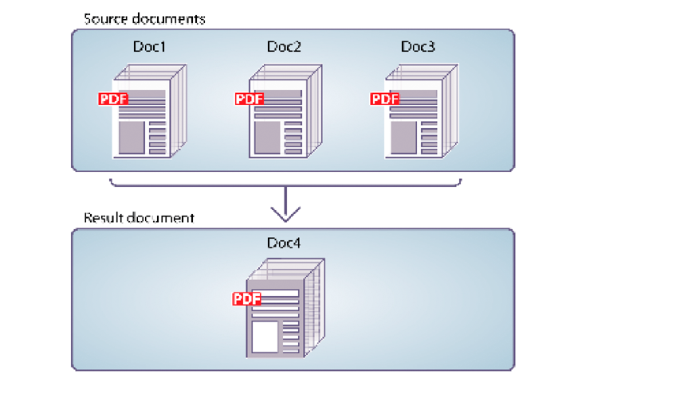

# Configuración programática de documentos PDF {#programmatically-assembling-pdf-documents}

**Las muestras y los ejemplos de este documento solo son para AEM Forms en un entorno JEE.**

Puede utilizar la API del servicio Assembler para combinar varios documentos de PDF en un único documento de PDF. La siguiente ilustración muestra tres documentos de PDF que se combinan en uno solo de PDF.



Para combinar dos o más documentos de PDF en un único documento de PDF, necesita un documento DDX. Un documento DDX describe el documento de PDF que produce el servicio Assembler. Es decir, el documento DDX indica al servicio Assembler qué acciones debe realizar.

A los efectos de este análisis, supongamos que se utiliza el siguiente documento DDX.

```xml
 <?xml version="1.0" encoding="UTF-8"?>
 <DDX xmlns="https://ns.adobe.com/DDX/1.0/">
     <PDF result="out.pdf">
         <PDF source="map.pdf" />
         <PDF source="directions.pdf" />
     </PDF>
 </DDX>
```

Este documento DDX combina dos documentos de PDF llamados *map.pdf* y *direction.pdf* en un solo documento de PDF.

>[!NOTE]
>
>Para ver un documento DDX que desmonta un documento de PDF, consulte [Desmontaje programático de documentos de PDF](/help/forms/developing/programmatically-disassembling-pdf-documents.md#programmatically-disassembling-pdf-documents).

>[!NOTE]
>
>Para obtener más información acerca del servicio Assembler, vea [Referencia de servicios para AEM Forms](https://www.adobe.com/go/learn_aemforms_services_63).

>[!NOTE]
>
>Para obtener más información sobre un documento DDX, consulte [Servicio Assembler y referencia DDX](https://www.adobe.com/go/learn_aemforms_ddx_63).

## Consideraciones al invocar el servicio Assembler mediante servicios web {#considerations-when-invoking-assembler-service-using-web-services}

Al agregar encabezados y pies de página durante el ensamblado de documentos grandes, puede que se produzca un error de `OutOfMemory` y los archivos no se ensamblarán. Para reducir la probabilidad de que se produzca este problema, agregue un elemento `DDXProcessorSetting` al documento DDX, como se muestra en el siguiente ejemplo.

`<DDXProcessorSetting name="checkpoint" value="2000" />`

Puede agregar este elemento como secundario del elemento `DDX` o como secundario de un elemento `PDF result`. El valor predeterminado de esta configuración es 0 (cero), lo que desactiva el punto de comprobación y el DDX se comporta como si el elemento `DDXProcessorSetting` no estuviera presente. Si se ha producido un error de `OutOfMemory`, es posible que tenga que establecer el valor en un número entero, normalmente entre 500 y 5000. Un valor de punto de comprobación pequeño provoca puntos de comprobación más frecuentes.

## Resumen de los pasos {#summary-of-steps}

Para combinar un solo documento de PDF a partir de varios documentos de PDF, realice las siguientes tareas:

1. Incluir archivos de proyecto.
1. Cree un cliente de PDF Assembler.
1. Hacer referencia a un documento DDX existente.
1. Hacer referencia a documentos de PDF de entrada.
1. Establecer opciones en tiempo de ejecución.
1. Montar los documentos de PDF de entrada.
1. Extraiga los resultados.

**Incluir archivos de proyecto**

Incluya los archivos necesarios en el proyecto de desarrollo. Si está creando una aplicación cliente con Java, incluya los archivos JAR necesarios. Si utiliza servicios web, asegúrese de incluir los archivos proxy.

Los siguientes archivos JAR deben agregarse a la ruta de clase del proyecto:

* adobe-livecycle-client.jar
* adobe-usermanager-client.jar
* adobe-assembler-client.jar
* adobe-utilities.jar (requerido si AEM Forms está implementado en JBoss)
* jbossall-client.jar (requerido si AEM Forms está implementado en JBoss)

si AEM Forms se implementa en un servidor de aplicaciones J2EE compatible que no sea JBoss, debe reemplazar los archivos adobe-utilities.jar y jbossall-client.jar con archivos JAR específicos del servidor de aplicaciones J2EE en el que está implementado AEM Forms.

**Crear un cliente de PDF Assembler**

Para poder realizar mediante programación una operación de Assembler, debe crear un cliente Assembler.

**Hacer referencia a un documento DDX existente**

Se debe hacer referencia a un documento DDX para combinar un documento PDF. Por ejemplo, considere el documento DDX que se introdujo en esta sección. Este documento DDX indica al servicio Assembler que combine dos documentos de PDF en un único documento de PDF.

**Documentos de PDF de entrada de referencia**

Hacer referencia a los documentos de PDF de entrada que desee pasar al servicio Assembler. Por ejemplo, si desea pasar dos documentos de PDF de entrada denominados Mapa y Direcciones, debe pasar los archivos de PDF correspondientes.

Tanto el archivo map.pdf como el archivo direction.pdf deben colocarse en un objeto de colección. El nombre de la clave debe coincidir con el valor del atributo de origen de PDF en el documento DDX. No importa cuál sea el nombre del archivo PDF si la clave y el atributo de origen del documento DDX coinciden.

>[!NOTE]
>
>Se devuelve un objeto `AssemblerResult`, que contiene un objeto de colección, si invoca la operación `invokeDDX`. Esta operación se utiliza cuando se pasan dos o más documentos de PDF de entrada al servicio Assembler. Sin embargo, si pasa solamente una PDF de entrada al servicio Assembler y espera sólo un documento de retorno, invoque la operación `invokeOneDocument`. Al invocar esta operación, se devuelve un solo documento. Para obtener información acerca de cómo usar esta operación, vea [Agrupar documentos cifrados de PDF](/help/forms/developing/assembling-encrypted-pdf-documents.md#assembling-encrypted-pdf-documents).

**Establecer opciones en tiempo de ejecución**

Puede establecer opciones en tiempo de ejecución que controlen el comportamiento del servicio Assembler mientras realiza un trabajo. Por ejemplo, puede establecer una opción que indique al servicio Assembler que continúe procesando un trabajo si se produce un error. Para obtener información acerca de las opciones en tiempo de ejecución que puede establecer, vea la referencia de clase `AssemblerOptionSpec` en [Referencia de la API de AEM Forms](https://www.adobe.com/go/learn_aemforms_javadocs_63_en).

**Montar los documentos de PDF de entrada**

Después de crear el cliente de servicio, hacer referencia a un archivo DDX, crear un objeto de colección que almacene documentos de PDF de entrada y establecer opciones en tiempo de ejecución, puede invocar la operación DDX. Al utilizar el documento DDX especificado en esta sección, los archivos map.pdf y direction.pdf se combinan en un documento de PDF.

**Extraer los resultados**

El servicio Assembler devuelve un objeto `java.util.Map`, que se puede obtener del objeto `AssemblerResult` y que contiene resultados de operaciones. El objeto `java.util.Map` devuelto contiene los documentos resultantes y las excepciones.

En la tabla siguiente se resumen algunos de los valores clave y tipos de objeto que se pueden encontrar en el objeto `java.util.Map` devuelto.

<table>
 <thead>
  <tr>
   <th><p>Valor clave</p></th>
   <th><p>Tipo de objeto</p></th>
   <th><p>Descripción</p></th>
  </tr>
 </thead>
 <tbody>
  <tr>
   <td><p><code><i>documentName</i></code></p></td>
   <td><p><code>com.adobe.idp.Document</code></p></td>
   <td><p>Contiene los documentos resultantes especificados en un elemento resultante DDX</p></td>
  </tr>
  <tr>
   <td><p><code><i>documentName</i></code></p></td>
   <td><p><code>Exception</code></p></td>
   <td><p>Contiene cualquier excepción para el documento</p></td>
  </tr>
  <tr>
   <td><p><code>OutputMapConstants.LOG_NAME</code></p></td>
   <td><p><code>com.adobe.idp.Documen</code></p></td>
   <td><p>Contiene el registro de trabajos</p></td>
  </tr>
 </tbody>
</table>

**Consulte también**

[Incluir archivos de biblioteca Java de AEM Forms](/help/forms/developing/invoking-aem-forms-using-java.md#including-aem-forms-java-library-files)

[Estableciendo propiedades de conexión](/help/forms/developing/invoking-aem-forms-using-java.md#setting-connection-properties)

[Desmontaje programático de documentos PDF](/help/forms/developing/programmatically-disassembling-pdf-documents.md#programmatically-disassembling-pdf-documents)

## Montar documentos de PDF mediante la API de Java {#assemble-pdf-documents-using-the-java-api}

Montar un documento de PDF mediante la API del servicio Assembler (Java):

1. Incluir archivos de proyecto.

   Incluya archivos JAR de cliente, como adobe-assembler-client.jar, en la ruta de clase del proyecto Java.

1. Cree un cliente de PDF Assembler.

   * Cree un objeto `ServiceClientFactory` que contenga propiedades de conexión.
   * Cree un objeto `AssemblerServiceClient` utilizando su constructor y pasando el objeto `ServiceClientFactory`.

1. Hacer referencia a un documento DDX existente.

   * Cree un objeto `java.io.FileInputStream` que represente el documento DDX utilizando su constructor y pasando un valor de cadena que especifique la ubicación del archivo DDX.
   * Cree un objeto `com.adobe.idp.Document` utilizando su constructor y pasando el objeto `java.io.FileInputStream`.

1. Hacer referencia a documentos de PDF de entrada.

   * Cree un objeto `java.util.Map` que se use para almacenar documentos de PDF de entrada mediante un constructor `HashMap`.
   * Para cada documento de PDF de entrada, cree un objeto `java.io.FileInputStream` utilizando su constructor y pasando la ubicación del documento de PDF de entrada.
   * Para cada documento de PDF de entrada, cree un objeto `com.adobe.idp.Document` y pase el objeto `java.io.FileInputStream` que contiene el documento de PDF.
   * Para cada documento de entrada, agregue una entrada al objeto `java.util.Map` invocando su método `put` y pasando los siguientes argumentos:

      * Valor de cadena que representa el nombre de clave. Este valor debe coincidir con el valor del elemento de origen PDF especificado en el documento DDX.
      * Un objeto `com.adobe.idp.Document` (o objeto `java.util.List` que especifica varios documentos) que contiene el documento de origen de PDF.

1. Establecer opciones en tiempo de ejecución.

   * Cree un objeto `AssemblerOptionSpec` que almacene opciones en tiempo de ejecución mediante su constructor.
   * Establezca opciones en tiempo de ejecución para satisfacer sus necesidades empresariales invocando un método que pertenezca al objeto `AssemblerOptionSpec`. Por ejemplo, para indicar al servicio Assembler que continúe procesando un trabajo cuando se produzca un error, invoque el método `setFailOnError` del objeto `AssemblerOptionSpec` y pase `false`.

1. Montar los documentos de PDF de entrada.

   Invoque el método `invokeDDX` del objeto `AssemblerServiceClient` y pase los siguientes valores necesarios:

   * Un objeto `com.adobe.idp.Document` que representa el documento DDX que se va a usar
   * Objeto `java.util.Map` que contiene los archivos PDF de entrada que se van a ensamblar
   * Un objeto `com.adobe.livecycle.assembler.client.AssemblerOptionSpec` que especifica las opciones en tiempo de ejecución, incluida la fuente predeterminada y el nivel de registro de trabajo

   El método `invokeDDX` devuelve un objeto `com.adobe.livecycle.assembler.client.AssemblerResult` que contiene los resultados del trabajo y las excepciones que se han producido.

1. Extraiga los resultados.

   Para obtener el documento de PDF recién creado, realice las siguientes acciones:

   * Invoque el método `getDocuments` del objeto `AssemblerResult`. Devuelve un objeto `java.util.Map`.
   * Recorra en iteración el objeto `java.util.Map` hasta encontrar el objeto `com.adobe.idp.Document` resultante. (Puede utilizar el elemento de resultado de PDF especificado en el documento DDX para obtener el documento).
   * Invoque el método `copyToFile` del objeto `com.adobe.idp.Document` para extraer el documento de PDF.

   >[!NOTE]
   >
   >Si `LOG_LEVEL` se estableció para producir un registro, puede extraerlo mediante el método `getJobLog` del objeto `AssemblerResult`.

**Consulte también**

[Inicio rápido (modo SOAP): Combinar un documento de PDF mediante la API de Java](/help/forms/developing/assembler-service-java-api-quick.md#quick-start-soap-mode-assembling-a-pdf-document-using-the-java-api)

[Incluir archivos de biblioteca Java de AEM Forms](/help/forms/developing/invoking-aem-forms-using-java.md#including-aem-forms-java-library-files)

[Estableciendo propiedades de conexión](/help/forms/developing/invoking-aem-forms-using-java.md#setting-connection-properties)

## Montar documentos de PDF mediante la API de servicio web {#assemble-pdf-documents-using-the-web-service-api}

Ensamble documentos de PDF mediante la API del servicio Assembler (servicio web):

1. Incluir archivos de proyecto.

   Cree un proyecto de Microsoft .NET que utilice MTOM. Asegúrese de utilizar la siguiente definición de WSDL: `http://localhost:8080/soap/services/AssemblerService?WSDL&lc_version=9.0.1`.

   >[!NOTE]
   >
   >Reemplace `localhost` por la dirección IP del servidor que hospeda AEM Forms.

1. Cree un cliente de PDF Assembler.

   * Cree un objeto `AssemblerServiceClient` utilizando su constructor predeterminado.
   * Cree un objeto `AssemblerServiceClient.Endpoint.Address` mediante el constructor `System.ServiceModel.EndpointAddress`. Pase un valor de cadena que especifique el WSDL al servicio AEM Forms (por ejemplo, `http://localhost:8080/soap/services/AssemblerService?blob=mtom`). No necesita usar el atributo `lc_version`. Este atributo se utiliza al crear una referencia de servicio.
   * Cree un objeto `System.ServiceModel.BasicHttpBinding` obteniendo el valor del campo `AssemblerServiceClient.Endpoint.Binding`. Convertir el valor devuelto en `BasicHttpBinding`.
   * Establezca el campo `MessageEncoding` del objeto `System.ServiceModel.BasicHttpBinding` en `WSMessageEncoding.Mtom`. Este valor garantiza que se utiliza MTOM.
   * Habilite la autenticación HTTP básica realizando las siguientes tareas:

      * Asigne el nombre de usuario de los formularios AEM Forms al campo `AssemblerServiceClient.ClientCredentials.UserName.UserName`.
      * Asigne el valor de contraseña correspondiente al campo `AssemblerServiceClient.ClientCredentials.UserName.Password`.
      * Asigne el valor constante `HttpClientCredentialType.Basic` al campo `BasicHttpBindingSecurity.Transport.ClientCredentialType`.
      * Asigne el valor constante `BasicHttpSecurityMode.TransportCredentialOnly` al campo `BasicHttpBindingSecurity.Security.Mode`.

1. Hacer referencia a un documento DDX existente.

   * Crear un objeto `BLOB` mediante su constructor. El objeto `BLOB` se usa para almacenar el documento DDX.
   * Cree un objeto `System.IO.FileStream` invocando su constructor y pasando un valor de cadena que represente la ubicación de archivo del documento DDX y el modo en que se abrirá el archivo.
   * Cree una matriz de bytes que almacene el contenido del objeto `System.IO.FileStream`. Puede determinar el tamaño de la matriz de bytes obteniendo la propiedad `Length` del objeto `System.IO.FileStream`.
   * Rellene la matriz de bytes con datos de secuencia invocando el método `Read` del objeto `System.IO.FileStream` y pasando a leer la matriz de bytes, la posición inicial y la longitud de secuencia.
   * Rellene el objeto `BLOB` asignando su propiedad `MTOM` con el contenido de la matriz de bytes.

1. Hacer referencia a documentos de PDF de entrada.

   * Para cada documento de PDF de entrada, cree un objeto `BLOB` utilizando su constructor. El objeto `BLOB` se usa para almacenar el documento de PDF de entrada.
   * Cree un objeto `System.IO.FileStream` invocando su constructor y pasando un valor de cadena que represente la ubicación de archivo del documento de PDF de entrada y el modo en que se debe abrir el archivo.
   * Cree una matriz de bytes que almacene el contenido del objeto `System.IO.FileStream`. Puede determinar el tamaño de la matriz de bytes obteniendo la propiedad `Length` del objeto `System.IO.FileStream`.
   * Rellene la matriz de bytes con datos de secuencia invocando el método `Read` del objeto `System.IO.FileStream`. Pase a leer la matriz de bytes, la posición inicial y la longitud de la secuencia.
   * Rellene el objeto `BLOB` asignando su campo `MTOM` con el contenido de la matriz de bytes.
   * Crear un objeto `MyMapOf_xsd_string_To_xsd_anyType`. Este objeto de colección se utiliza para almacenar documentos de PDF de entrada.
   * Para cada documento de PDF de entrada, cree un objeto `MyMapOf_xsd_string_To_xsd_anyType_Item`. Por ejemplo, si se utilizan dos documentos de PDF de entrada, cree dos objetos `MyMapOf_xsd_string_To_xsd_anyType_Item`.
   * Asigne un valor de cadena que represente el nombre de clave al campo `key` del objeto `MyMapOf_xsd_string_To_xsd_anyType_Item`. Este valor debe coincidir con el valor del elemento de origen PDF especificado en el documento DDX. (Realice esta tarea para cada documento de PDF de entrada).
   * Asigne el objeto `BLOB` que almacena el documento de PDF al campo `value` del objeto `MyMapOf_xsd_string_To_xsd_anyType_Item`. (Realice esta tarea para cada documento de PDF de entrada).
   * Agregue el objeto `MyMapOf_xsd_string_To_xsd_anyType_Item` al objeto `MyMapOf_xsd_string_To_xsd_anyType`. Invoque el método `Add` del objeto `MyMapOf_xsd_string_To_xsd_anyType` y pase el objeto `MyMapOf_xsd_string_To_xsd_anyType`. (Realice esta tarea para cada documento de PDF de entrada).

1. Establecer opciones en tiempo de ejecución.

   * Cree un objeto `AssemblerOptionSpec` que almacene opciones en tiempo de ejecución mediante su constructor.
   * Establezca las opciones en tiempo de ejecución para satisfacer sus necesidades comerciales asignando un valor a un miembro de datos que pertenezca al objeto `AssemblerOptionSpec`. Por ejemplo, para indicar al servicio Assembler que continúe procesando un trabajo cuando se produzca un error, asigne `false` al miembro de datos `failOnError` del objeto `AssemblerOptionSpec`.

1. Montar los documentos de PDF de entrada.

   Invoque el método `invoke` del objeto `AssemblerServiceClient` y pase los siguientes valores:

   * Un objeto `BLOB` que representa el documento DDX.
   * Matriz `mapItem` que contiene los documentos de PDF de entrada. Sus claves deben coincidir con los nombres de los archivos de origen de PDF y sus valores deben ser los objetos `BLOB` que corresponden a esos archivos.
   * Un objeto `AssemblerOptionSpec` que especifica opciones en tiempo de ejecución.

   El método `invoke` devuelve un objeto `AssemblerResult` que contiene los resultados del trabajo y las excepciones que puedan haberse producido.

1. Extraiga los resultados.

   Para obtener el documento de PDF recién creado, realice las siguientes acciones:

   * Obtenga acceso al campo `documents` del objeto `AssemblerResult`, que es un objeto `Map` que contiene los documentos de PDF resultantes.
   * Recorra en iteración el objeto `Map` hasta que encuentre la clave que coincida con el nombre del documento resultante. Luego convierta el `value` de ese miembro de la matriz en un `BLOB`.
   * Extraiga los datos binarios que representan el documento de PDF al tener acceso a la propiedad `MTOM` de su objeto `BLOB`. Devuelve una matriz de bytes que puede escribir en un archivo PDF.

   >[!NOTE]
   >
   >Si `LOG_LEVEL` se estableció para producir un registro, puede extraerlo obteniendo el valor del miembro de datos `jobLog` del objeto `AssemblerResult`.

**Consulte también**

[Invocar AEM Forms mediante MTOM](/help/forms/developing/invoking-aem-forms-using-web.md#invoking-aem-forms-using-mtom)
