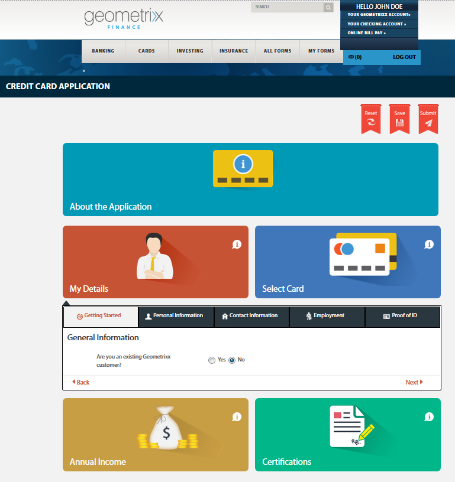

# Acceso y rellenado de formularios publicados{#accessing-and-filling-published-forms}

En una configuración de implementación de portal centrada en formularios, el desarrollo de formularios y el desarrollo de portales son dos actividades distintas. Mientras los diseñadores de formularios diseñan y almacenan formularios en un repositorio, los desarrolladores web crean una aplicación web para esos formularios de lista y gestionan los envíos. A continuación, Forms se copia en el nivel web, ya que no hay comunicación entre el repositorio de formularios y la aplicación web.

Esto suele provocar problemas con la administración de los retrasos de configuración y producción. Por ejemplo, si hay una versión más reciente de un formulario disponible en el repositorio, el diseñador del formulario reemplaza el formulario en el nivel web, modifica la aplicación web y vuelve a implementar el formulario en el sitio público. La reimplementación de la aplicación Web puede causar cierto tiempo de inactividad en el servidor. Dado que el tiempo de inactividad del servidor es una actividad planificada, los cambios no pueden transferirse inmediatamente al sitio público.

Forms Portal reduce los gastos generales de administración y los retrasos en la producción. Equipa a los desarrolladores web con componentes para crear y personalizar un portal de formularios en sitios web creados con Adobe Experience Manager (AEM).

Para obtener más información sobre el portal de formularios y sus características, consulte [Introducción a la publicación de formularios en un portal](/help/forms/using/introduction-publishing-forms.md).

## Introducción al portal de formularios {#getting-started-with-forms-portal}

Vaya a la página del portal de formularios publicados. Para obtener más información sobre la creación de una página de portal de formularios, consulte [Creación de una página de portal de formularios](../../forms/using/creating-form-portal-page.md).

El componente Búsqueda y lista del portal de grupos muestra los formularios disponibles en la instancia de publicación del servidor de AEM. Esta lista incluye todos los formularios o los formularios definidos en el filtro en el momento de crear la página del portal de formularios. Una página de portal de formularios tiene un aspecto similar al que se muestra en la siguiente imagen:

Una página de portal de formularios de ejemplo

### Buscar y listar {#search-and-lister}

El componente Búsqueda y lista permite agregar la siguiente funcionalidad al portal de formularios:

* Formularios de lista en panel, tarjeta o vista de cuadrícula disponibles de forma predeterminada. También admite plantillas personalizadasMuestra formularios de carpetas específicas en Forms Manager.
* Especifique cómo se procesan los formularios: HTML5, PDF o ambos.
* Especifique cómo se procesan los formularios PDF y XFA: HTML5, PDF o ambos. Formularios que no son XFA como HTML5.
* Permite buscar formularios en función de criterios, como propiedades de formulario, metadatos y etiquetas.
* Enviar datos de formulario a un servlet.
* Utilice hojas de estilo personalizadas (CSS) para personalizar el aspecto del portal.
* Cree vínculos a formularios.

Puede buscar formularios en la página de Forms Portal mediante las siguientes opciones:

* Búsqueda de texto completo
* Búsqueda avanzada

La búsqueda de texto completo le permite encontrar y lista formularios basados en las palabras clave especificadas.

Un cuadro de diálogo de búsqueda avanzada

La búsqueda avanzada permite buscar formularios en función de las propiedades especificadas del formulario. Esto proporciona resultados más específicos que la búsqueda de texto completo. La búsqueda avanzada incluye la búsqueda basada en etiquetas, propiedades (como Autor, Descripción y Título), fecha de modificación y texto completo.

La lista muestra los formularios basados en los parámetros de búsqueda. Cada formulario del resultado de búsqueda se muestra con un icono, que está hipervinculado al formulario asociado. Puede hacer clic en el icono para abrir y trabajar con el formulario asociado.

### Rellenado de un formulario {#filling-a-form}

Formulario adaptable de ejemplo

Se puede acceder a los formularios desde el vínculo proporcionado junto con el formulario en el componente Buscar y listar de la página.

Cada formulario contiene información de ayuda que permite al usuario rellenar el formulario.

#### Borradores y envío {#drafts-and-submission}

Un usuario tiene la opción de guardar un borrador de un formulario haciendo clic en el botón Guardar. Esto permite al usuario trabajar en un formulario durante un período de tiempo antes de enviarlo.

Los datos rellenados en el formulario (incluidos los datos adjuntos) se guardan como borrador en el servidor. El borrador de un formulario se puede guardar varias veces. El formulario guardado aparece en la ficha Borradores del componente Borrador y envío de la página.

Al completar el formulario, el usuario envía los formularios haciendo clic en el botón Enviar del formulario. Los formularios enviados aparecen en la ficha Envíos del componente Borrador y envío de la página.

>[!NOTE]
>
>Los formularios enviados aparecen en la ficha Envío de Forms solo si la acción de envío del formulario adaptable está configurada como Acción de envío de Forms Portal. Para obtener más información sobre las acciones de envío, consulte [Configuración de la acción de envío](../../forms/using/configuring-submit-actions.md).

Componente Borradores y envíos

## Inicio de un nuevo formulario con los datos del formulario enviados {#start-a-new-form-using-submitted-form-data}

Hay ciertos formularios que debe rellenar y enviar con bastante frecuencia. Por ejemplo, el formulario para presentar la declaración de impuestos individual se envía cada año. En estos casos, mientras que una parte de la información cambia cada vez que se rellena el formulario, la mayoría de ella como los datos personales y familiares no cambian. Sin embargo, se le seguirá solicitando que rellene de nuevo todo el formulario, desde cero.

AEM Forms puede ayudarle a optimizar la experiencia de cumplimentación de formularios y a reducir significativamente el tiempo necesario para rellenar y enviar un formulario de nuevo. Los usuarios finales pueden inicio de un nuevo formulario utilizando los datos de un formulario enviado. Esta funcionalidad está integrada en el [componente Borradores y envíos](../../forms/using/draft-submission-component.md). Al agregar el componente Borradores y envío a la página del portal de formularios y publicarlo, los usuarios finales encontrarán una opción en las fichas Envío de Forms y Borrador de Forms para inicio de un nuevo formulario mediante datos de un formulario enviado. La siguiente imagen resalta esa opción.

Al hacer clic en el botón para iniciar un nuevo formulario, se abre un nuevo formulario con datos del formulario enviado correspondiente. Ahora puede revisar y actualizar la información, según sea necesario, y enviar el formulario.
