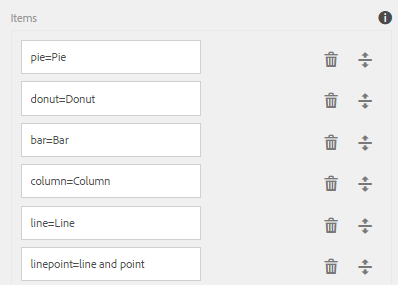

# Gráficos de formulario adaptable {#af-charts}


Un gráfico es una representación visual de los datos. Permite condensar grandes cantidades de información en un formato visual fácil de entender, lo que le permite visualizar, interpretar y analizar mejor datos complejos.
El paquete de complementos de AEM Forms proporciona un componente de gráfico predeterminado. Puede usar en formularios adaptables y documentos para la representación visual de datos bidimensionales en **paneles repetibles** y **tablas**. El componente Gráfico permite agregar y configurar los siguientes tipos de gráficos:

1. Circular
1. Columna
1. Gráfico de sectores
1. Barra
1. Línea
1. Línea y punto
1. Punto
1. Área

El componente Gráfico admite y proporciona funciones estadísticas integradas (suma, media, máximo, mínimo, modo, mediana, intervalo y frecuencia) para calcular y trazar valores en un gráfico. Además de las funciones disponibles de forma predeterminada, puede escribir sus propias funciones personalizadas y ponerlas a disposición para utilizarlas en gráficos.

Ahora veamos cómo agregar y configurar el componente Gráfico:

## Agregar gráfico {#add-chart}

AEM El componente Gráfico está disponible en la barra lateral de la de forma predeterminada. AEM Puede arrastrar y soltar el componente Gráfico desde la barra lateral de la barra de herramientas hasta el formulario o documento adaptable en modo de creación. Al soltar el componente, se crea un marcador de posición para un gráfico.

## Configurar gráfico {#configure-chart}

>[!NOTE]
> 
> Antes de configurar el gráfico, asegúrese de que el panel o la fila de tabla para los que está configurando el gráfico estén configurados en repetibles. Puede especificar recuentos mínimos y máximos para el panel repetible o la fila de tabla en la pestaña Configuración de repetición del cuadro de diálogo Editar componente.

Para configurar el gráfico, haga clic en el componente Gráfico y en  para abrir el cuadro de diálogo Editar gráfico. El cuadro de diálogo incluye las pestañas Título y texto, Configuración, Opciones avanzadas y Estilo que le permiten configurar el gráfico.

### Básica {#basic}

En la pestaña Básico, puede configurar las siguientes propiedades:


* **Nombre del elemento**: Un identificador para el elemento de gráfico en la estructura de contenido JCR. No está visible en el gráfico, pero resulta útil cuando se hace referencia al elemento desde otros componentes, scripts y expresiones SOM.
* **Tipo de gráfico**: especifica el tipo de gráfico que desea generar. Las opciones disponibles son Circular, Anillo, Barra, Columna, Línea, Línea y punto, Punto y Área. En el ejemplo, el tipo de gráfico es Columna.
* **Nombre de fila repetida o nombre de panel para la fuente de datos**: especifica el nombre del elemento de la fila de la tabla o del panel repetible desde el que se originarán los datos. En el ejemplo, statementDetails es el nombre de elemento de la fila repetible de la tabla Detalles de instrucciones.
* **Eje X > Título**: especifica el título del eje X. En el ejemplo, el título del eje X es Categoría.
* **Eje X > Campo**: especifica el nombre del elemento del campo (o una celda de una tabla) que se va a trazar en el eje X. En el ejemplo, las categorías se configuran en el eje X. El nombre del elemento para la celda de tabla de la columna Category de la tabla de ejemplo es category.
* **Eje X > Usar función**: especifica la función estadística que se utiliza para calcular los valores en el eje X. En el ejemplo, la opción seleccionada es None. Para obtener más información sobre las funciones, consulte Usar funciones en el gráfico.
* **Eje Y > Título**: especifica el título del eje Y. En el ejemplo, el título del eje Y es Expense.
* **Eje Y > Campo**: especifica el nombre del elemento del campo (o la celda de una tabla) que se va a trazar en el eje Y. En el ejemplo, configure amount on Y-axis. El nombre del elemento para la celda de tabla de la columna Amount de la tabla de ejemplo es amount.
* **Eje Y > Usar función**: especifica la función estadística que se utiliza para calcular los valores en el eje Y. En el ejemplo, se añade la cantidad gastada en cada categoría y el valor calculado se traza en el eje Y. Por lo tanto, seleccione Suma de la lista desplegable Usar función. Para obtener más información sobre las funciones, consulte Usar funciones en el gráfico.
* **Posición de leyenda**: especifica la posición del pie de ilustración con respecto al gráfico. Las opciones disponibles son Derecha, Izquierda, Superior e Inferior.
* **Mostrar leyenda**: muestra una leyenda para el gráfico cuando está habilitado.
* **Sugerencia**: especifica el formato en el que aparece la información del objeto al pasar el ratón sobre un punto de datos del gráfico. El valor predeterminado es **\${x}(\${y})**. Según el tipo de gráfico, cuando el ratón señala un punto, barra o fracción del gráfico, las variables **\${x}** y **\${y}** se sustituyen dinámicamente por los valores correspondientes del eje X y del eje Y y se muestran en la información del objeto. Como se muestra en el ejemplo siguiente, la información del objeto se muestra como **Tiendas minoristas (5870)** al apuntar con el ratón a la columna Tiendas minoristas. Para deshabilitar la información del objeto, deje en blanco el campo Información del objeto. Esta opción no es aplicable a los gráficos de líneas y áreas.
* **Configuraciones específicas de gráficos**: Además de las configuraciones comunes, está disponible la siguiente configuración específica del gráfico:
* **Radio interior**: disponible para gráficos de anillo para especificar el radio (en píxeles) del círculo interior del gráfico.
* **Color de línea**: disponible para gráficos de líneas, líneas y puntos y áreas para especificar el valor hexadecimal del color de la línea del gráfico.
* **Color de punto**: disponible para gráficos de puntos y líneas y puntos para especificar el valor hexadecimal del color de los puntos del gráfico.
* **Color de área**: disponible para gráficos de área para especificar el valor hexadecimal del color para el área bajo la línea del gráfico.
* **Clase CSS**: especifique el nombre de una clase CSS en el campo CSS class para aplicar un estilo personalizado al gráfico.

### Configuración {#configuration}

En la pestaña Básico, se define el tipo de gráfico, el panel de origen o la fila de tabla que contiene datos, los valores que se van a trazar en el eje X y el eje Y del gráfico y, opcionalmente, la función estadística para calcular los valores para trazar en el gráfico.

Comprendamos en detalle la información que aparece en esta pestaña, con la ayuda de un ejemplo de una tabla repetible en un extracto de tarjeta de crédito. Imagine que desea generar un gráfico para representar y correlacionar el gasto total en diferentes categorías en la sección de detalles del extracto de un extracto de tarjeta de crédito, como se muestra a continuación.

Para ello, debe trazar las categorías en el eje X y, en el eje Y, trazar el gasto total en cada categoría.


La instrucción de tarjeta de crédito utilizada en este ejemplo es un documento de formulario adaptable y la sección de detalles de la instrucción es una tabla, que tiene el siguiente aspecto en el modo de creación.


Consideremos los siguientes requisitos y condiciones para generar el gráfico:

* El gráfico muestra el gasto total en cada categoría de la tabla Detalles de estado.
* El tipo de gráfico es Columna, aunque puede elegir cualquier otro tipo de gráfico, según corresponda.
* La fila Tabla de la tabla Detalles de sentencias es repetible. Puede configurarlo en el campo Configuración de repetición de las propiedades de fila de la tabla.
* El nombre de elemento para la fila es Detalles de instrucción. Puede configurarlo en las propiedades de la fila de la tabla.
* El nombre del elemento para la celda de tabla de la columna Category es category. Puede especificarlo en línea. Seleccione la celda y pulse el botón editar.
* El nombre del elemento para la celda de tabla de la columna Amount es amount. Además, la celda de tabla de la columna Importe es un cuadro numérico.
* Con la configuración especificada, el gráfico de columnas del ejemplo aparecerá de la siguiente manera. Cada color representa una categoría y los elementos de línea individuales o las cantidades de una categoría se suman en el gráfico.

  

El pie de ilustración y la información del objeto aparecen de la siguiente manera.


### Estilo {#styling}

En el modo Estilo, puede configurar la anchura, en porcentaje de la anchura total disponible en el formulario o documento, y la altura, en píxeles, del gráfico. Otras opciones incluyen texto, fondo, borde, efectos y anulaciones de CSS.

Para cambiar al modo Estilo, en la barra de herramientas de la página, haga lo siguiente: **pulse>>Estilo**.


## Usar funciones en el gráfico {#use-functions}

Puede configurar un gráfico para que utilice funciones estadísticas a fin de calcular los valores a partir de los datos de origen para trazar en el gráfico. Aunque el componente Gráfico tiene algunas funciones integradas, puede escribir sus propias funciones y ponerlas a disposición para utilizarlas en la configuración del gráfico.

>[!NOTE]
>
> Puede utilizar funciones para calcular valores para el eje X o el eje Y en un gráfico.

### Funciones predeterminadas {#default-functions}

Las siguientes funciones están disponibles de forma predeterminada con el componente Gráfico:

* **Media (media)**: Devuelve la media de los valores del eje X o Y para un valor determinado del otro eje.
* **Sum**: Devuelve la suma de todos los valores del eje X o Y para un valor determinado del otro eje.
* **Máximo**: Devuelve el máximo de los valores del eje X o Y para un valor determinado del otro eje.
* **Frecuencia**: Devuelve el número de valores en el eje X o Y para un valor determinado del otro eje.
* **Intervalo**: Devuelve la diferencia entre el máximo y el mínimo de los valores del eje X o Y para un valor determinado del otro eje.
* **Mediana**: Devuelve el valor que separa los valores más altos e inferiores a la mitad en el eje X o Y para un valor determinado en el otro eje.
* **Mínimo**: Devuelve el mínimo de los valores del eje X o Y para un valor determinado del otro eje.
* **Modo**: Devuelve el valor con la mayoría de las incidencias en el eje X o Y para un valor determinado en el otro eje

### Funciones personalizadas {#custom-functions}

Además de utilizar las funciones predeterminadas en los gráficos, puede escribir [funciones personalizadas](/help/forms/using/rule-editor.md#custom-functions-in-rule-editor-custom-functions) en JavaScript y haga que estén disponibles en la lista de funciones del componente Gráfico.

Una función toma una matriz o valores y un nombre de categoría como entradas y devuelve un valor. Por ejemplo:

```
Multiply(valueArray, category) {
    var val = 1;
    _.each(valueArray, function(value) {
        val = val * value;
    });
    return val;
}
```

Una vez que haya escrito una función personalizada, haga lo siguiente para que esté disponible para usarla en la configuración del gráfico:

1. Agregue la función personalizada en la biblioteca de cliente asociada al formulario o documento adaptable.
1. En CRXDE Lite, cree un nodo nt:unstructured en la carpeta de aplicaciones con las siguientes propiedades:
   * Establezca guideComponentType en fd/af/reducer. (obligatorio)
   * Establezca este valor en un nombre completo de la función de JavaScript personalizada. (obligatorio)
   * Establezca jcr:description con un nombre significativo. Aparece en el **Usar función** lista desplegable. Por ejemplo, **Multiplicar**.
   * Establezca qtip para una breve descripción de la función. Aparece como información del objeto al pasar el puntero sobre el nombre de la función en la lista desplegable Usar función.
   * Haga clic en **Guardar todo** para guardar la configuración.
   * La función ahora está disponible para usarla en el gráfico.


## Actualizar gráfico automáticamente {#auto-refresh-chart}

Un gráfico se actualiza automáticamente cuando los usuarios realizan una de las siguientes acciones:
* Agregue o quite una instancia del panel de fuente de datos o de la fila de tabla.
* Cambie cualquier valor trazado en el eje X o Y en el panel de origen de datos o en la fila de la tabla.
* Cambie el tipo de gráfico.

## Usar tipo de gráfico en reglas de formularios adaptables {#chart-in-rules}

La propiedad chartType especifica el tipo de gráfico. Los valores posibles son circular, circular, barra, línea, punto de línea, punto y área. Es una propiedad que se puede utilizar como script, lo que significa que se puede utilizar en [reglas de formularios adaptables](/help/forms/using/rule-editor.md) para manipular las configuraciones de gráficos. Vamos a entenderlo con la ayuda de un ejemplo.

Tenga en cuenta que ha configurado un gráfico de columnas. Sin embargo, también desea proporcionar a los usuarios una opción para seleccionar un tipo de gráfico diferente de una lista desplegable y volver a dibujar el gráfico. Puede conseguirlo utilizando la propiedad chartType en una regla de la siguiente manera:

1. AEM Arrastre y suelte un componente de lista desplegable desde la barra lateral del formulario adaptable, en la barra de herramientas de la barra de herramientas de la aplicación.
1. Seleccione el componente y pulse .
1. Especifique un título para la lista desplegable. Por ejemplo, Seleccionar tipo de gráfico.
1. Agregue los tipos de gráficos admitidos en la sección Elementos para rellenar la lista desplegable. Haga clic en **Listo**.
   

1. Seleccione el componente desplegable y pulse . En el editor de reglas, escriba una regla en el editor de reglas visual como se muestra a continuación.
   

   En este ejemplo, el nombre del elemento del componente del gráfico es **myChart**.

   Como alternativa, puede escribir las siguientes reglas en el editor de código.

   

   Para obtener más información sobre cómo escribir reglas, consulte [Editor de reglas](/help/forms/using/rule-editor.md)

1. Haga clic en Listo para guardar la regla.

Ahora puede seleccionar un tipo de gráfico en la lista desplegable y hacer clic en Actualizar para volver a dibujarlo.
