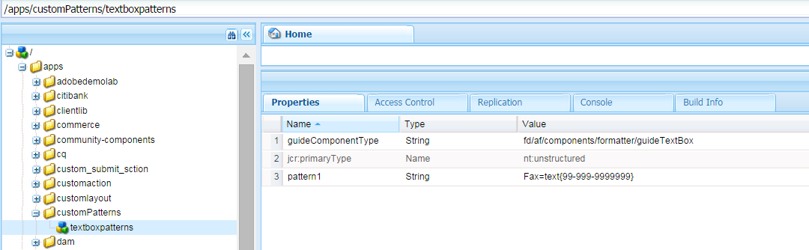

# Expresiones de formulario adaptables{#adaptive-form-expressions}

Los formularios adaptables proporcionan una experiencia de cumplimentación de formularios optimizada y simplificada para los usuarios finales con capacidades de secuencias de comandos dinámicas. Le permite escribir expresiones para agregar varios comportamientos, como mostrar/ocultar campos y paneles dinámicos. También permite agregar campos calculados, convertir campos en de solo lectura, agregar lógica de validación y mucho más. El comportamiento dinámico se basa en los datos introducidos por el usuario o rellenados previamente.

JavaScript es el lenguaje de expresión de los formularios adaptables. Todas las expresiones son expresiones JavaScript válidas y utilizan API de modelos de secuencias de comandos de formularios adaptables. Estas expresiones devuelven valores de ciertos tipos. Para obtener la lista completa de clases de formularios adaptables, eventos, objetos y API públicas, consulte [Referencia de la API de la biblioteca JavaScript para formularios adaptables](https://helpx.adobe.com/experience-manager/6-5/forms/javascript-api/index.html).

## Prácticas recomendadas para escribir expresiones {#best-practices-for-writing-expressions}

* Al escribir expresiones, para acceder a los campos y paneles, puede utilizar el nombre del campo o del panel. Para acceder al valor de un campo, utilice la propiedad value. Por ejemplo, `field1.value`
* Utilice nombres únicos para los campos y paneles de todo el formulario. Ayuda a evitar posibles conflictos con los nombres de campo utilizados al escribir expresiones.
* Al escribir expresiones multilínea, utilice un punto y coma para finalizar una instrucción.

## Prácticas recomendadas para expresiones que involucran el panel de repetición {#best-practices-for-expressions-involving-repeating-panel}

Los paneles de repetición son instancias de un panel que se agregan o eliminan dinámicamente, mediante API de secuencias de comandos o datos previamente rellenados. Para obtener información detallada sobre el uso del panel de repetición, consulte [creación de formularios con secciones repetibles](/help/forms/using/creating-forms-repeatable-sections.md).

* Para crear un panel de repetición, en el cuadro de diálogo del panel, abra la configuración y defina el valor del campo de recuento máximo en más de 1.
* El valor de recuento mínimo de la configuración de repetición del panel puede ser uno o más, pero no puede ser superior al valor de recuento máximo.
* Cuando una expresión hace referencia a un campo de panel de repetición, los nombres de campo de la expresión se resuelven en el elemento de repetición más cercano.
* Los formularios adaptables proporcionan algunas funciones especiales para simplificar el cálculo de los paneles repetitivos, como suma, recuento, mínimo, máximo, filtro y muchas más. Para obtener la lista completa de las funciones, consulte [Referencia de la API de la biblioteca JavaScript para formularios adaptables](https://helpx.adobe.com/aem-forms/6/javascript-api/af.html)
* Las API para manipular instancias de panel de repetición son:

   * Para agregar una instancia de panel: `panel1.instanceManager.addInstance()`
   * Para obtener un índice de repetición de panel: `panel1.instanceIndex`
   * Para obtener instanceManager de un panel: `_panel1 or panel1.instanceManager`
   * Para quitar una instancia de un panel: `_panel1.removeInstance(panel1.instanceIndex)`

## Tipos de expresión {#expression-types}

En los formularios adaptables, puede escribir expresiones para agregar comportamientos como mostrar/ocultar dinámicos campos y paneles. También puede escribir expresiones para agregar campos calculados, hacer que los campos sean de solo lectura, lógica de validación y mucho más. Los formularios adaptables admiten las siguientes expresiones:

* **[Expresiones](#access-expression-enablement-expression)** de acceso: para activar o desactivar un campo.
* **[Calcular expresiones](#calculate-expression)**: para calcular automáticamente el valor de un campo.
* **[Haga clic en expresión](#click-expression)**: para gestionar acciones al hacer clic en el evento de un botón.
* **[Secuencia de comandos](#initialization-script) de inicialización:** realice una acción al inicializar un campo.
* **[Expresión](#options-expression)** de opciones: para rellenar dinámicamente una lista desplegable.
* **[Expresión](#summary)** de resumen: para calcular dinámicamente el título de un acordeón.
* **[Validar expresiones](#validate-expression)**: para validar un campo.
* **[Secuencia de comandos](#value-commit-script) de confirmación de valores:** para cambiar los componentes de un formulario después de cambiar el valor de un campo.
* **[Expresión](#visibility-expression)** de visibilidad: para controlar la visibilidad de un campo y un panel.
* **[Expresión](#step-completion-expression)** de finalización de pasos: para evitar que un usuario vaya al paso siguiente de un asistente.

### Expresión de acceso (Expresión de habilitación) {#access-expression-enablement-expression}

Puede utilizar la expresión de acceso para habilitar o deshabilitar un campo. Si la expresión utiliza el valor de un campo, siempre que el valor del campo cambie se recuperará la expresión.

**Se aplica a**: campos

**Tipo** de devolución: La expresión devuelve un valor booleano que indica si el campo está activado o desactivado. **** true representa que el campo está habilitado y  **** falsererepresenta que el campo está deshabilitado.

**Ejemplo**: Para habilitar un campo únicamente cuando el valor de  **field1** está establecido en  **X**, la expresión de acceso es:  `field1.value == "X"`

### Calcular Expresión {#calculate-expression}

La expresión calculate se utiliza para calcular automáticamente el valor de un campo mediante una expresión. Normalmente, esta expresión utiliza la propiedad value de otros campos. Por ejemplo, `field2.value + field3.value`. Siempre que cambia el valor de `field2`o `field3`, se recupera la expresión y se vuelve a calcular el valor.

**Se aplica a**: campos

**Tipo** de devolución: La expresión devuelve un valor compatible con el campo en el que se muestra el resultado de la expresión (por ejemplo, decimal).

**Ejemplo**: La expresión de cálculo para mostrar la suma de dos campos en  **field1** es: 
`field2.value + field3.value`

### Haga clic en Expresión {#click-expression}

La expresión de clic gestiona las acciones realizadas en el evento de clic de un botón. De forma predeterminada, GuideBridge proporciona API para realizar diversas funciones, como enviar y validar, que se utilizan junto con la expresión de clic. Para obtener una lista completa de las API, consulte [GuideBridge API](https://helpx.adobe.com/aem-forms/6/javascript-api/GuideBridge.html).

**Se aplica a**: Campos de botón

**Tipo** de devolución: La expresión de clic no devuelve ningún valor. Si alguna expresión devuelve un valor, se ignora el valor.

**Ejemplo**: Para rellenar un  **cuadro de texto de cuadro de texto1** en la acción de clic de un botón con el valor  **AEM Forms**, la expresión de clic del botón es  `textbox1.value="AEM Forms"`

### Script de inicialización {#initialization-script}

La secuencia de comandos de inicialización se activa cuando se inicializa un formulario adaptable. Según los escenarios, la secuencia de comandos de inicialización se comporta de la siguiente manera:

* Cuando se procesa un formulario adaptable sin un relleno previo de datos, la secuencia de comandos de inicialización se ejecuta después de que se inicialice el formulario.
* Cuando se procesa un formulario adaptable con un relleno previo de datos, la secuencia de comandos se ejecuta una vez finalizada la operación de rellenado previo.
* Cuando se activa la revalidación de un formulario adaptable por parte del servidor, se ejecuta la secuencia de comandos de inicialización.

**Se aplica a:** campos y panel

**Tipo de valor devuelto:** la expresión de script de inicialización no devuelve ningún valor. Si alguna expresión devuelve un valor, se ignora el valor.

**Ejemplo:** En un escenario de relleno previo de datos, para rellenar campos con valor predeterminado  `'Adaptive Forms'` cuando su valor se guarda como nulo, la expresión de secuencia de comandos de inicialización es: 
`if(this.value==null) this.value='Adaptive Forms';`

### Expresión de opciones {#options-expression}

La expresión de opciones se utiliza para rellenar dinámicamente las opciones de un campo de lista desplegable.

**Se aplica a**: campos de lista desplegable

**Tipo** de devolución: La expresión options devuelve una matriz de valores de cadena. Cada valor puede ser una cadena simple, como **Hombre**, o en un formato de par clave=valor, como **1=Hombre**

**Ejemplo**: Para rellenar el valor de un campo, en función del valor de otro campo, proporcione una expresión de opciones sencilla. Por ejemplo, para rellenar un campo, **Número de niños**, según el **Estado civil** expresado en otro campo, la expresión es:

**`marital_status.value == "married" ? ["1=One", "2=two"] : ["0=Zero"]`.**

Siempre que cambie el valor del campo **marital_status**, se recuperará la expresión. También puede rellenar el menú desplegable desde un servicio REST. Para obtener información detallada, consulte [Desgloses de relleno dinámico](../../forms/using/dynamically-populate-dropdowns.md).

### Expresión de resumen {#summary}

La expresión Resumen calcula dinámicamente el título de un panel secundario de un panel de diseño de acordeón. Puede especificar la expresión Resumen en una regla, que utiliza un campo de formulario o una lógica personalizada para evaluar el título. La expresión se ejecuta cuando se inicializa el formulario. Si va a incluir un formulario como prefijo, la expresión se ejecuta después de rellenar previamente los datos o cuando cambia el valor de los campos dependientes utilizados en la expresión.

La expresión Resumen se utiliza generalmente para repetir elementos secundarios de un panel de diseño de acordeón para proporcionar un título significativo a cada panel secundario.

**Se aplica a:** paneles que son elementos secundarios directos de un panel cuyo diseño está configurado como acordeón.

**Tipo de valor devuelto:** La expresión devuelve un valor de tipo String que se convierte en el título del acordeón.

**Ejemplo:** &quot;Número de cuenta : &quot;+ textbox1.value

### Validar Expresión {#validate-expression}

La expresión validate se utiliza para validar los campos mediante la expresión dada. Normalmente, estas expresiones utilizan expresiones regulares junto con el valor del campo para validar un campo. Se recupera la expresión y se vuelve a calcular el estado de validación del campo en caso de que se produzca algún cambio en el valor de un campo.

**Se aplica a**: campos

**Tipo** de devolución: La expresión devuelve un valor booleano que representa el estado de validación del campo. El valor **false** representa que el campo no es válido y **true** representa que el campo es válido.
**Ejemplo**: Para un campo que representa el código postal del Reino Unido, la expresión de validación es:

(**this.value** &amp;&amp; `this.value.match(/^(GIR 0AA|[A-Z]{1,2}\d[A-Z0-9]? ?[0-9][A-Z]{2}\s*)$/i) == null) ? false : true`

En el ejemplo anterior, si el valor no vacío no coincide con el patrón, la expresión devuelve **false** para indicar que el campo no es válido.

>[!NOTE]
>
>Si escribe una expresión de validación para un campo no obligatorio o obligatorio, la expresión se evalúa independientemente del estado de visibilidad del campo. Para detener la validación de los campos ocultos, establezca la propiedad validationsDisabled en el script de inicialización o confirmación de valor en true. Por ejemplo, `this.validationsDisabled=true`

### Script de implementación de valor {#value-commit-script}

La secuencia de comandos Commit de valores se activa cuando:

* Un usuario cambia el valor de un campo de la interfaz de usuario.
* El valor de un campo cambia programáticamente debido a cambios en otro campo.

**Se aplica a:** campos

**Tipo de valor devuelto:** la expresión de script de confirmación de valor no devuelve ningún valor. Si alguna expresión devuelve un valor, se ignora el valor.

**Ejemplo:** Para convertir las mayúsculas y minúsculas de los alfabetos introducidos en el campo en mayúsculas al confirmar, la expresión de valor commit es: 
`this.value=this.value.toUpperCase()`

>[!NOTE]
>
>Puede desactivar la ejecución de la secuencia de comandos de confirmación de valores cuando el valor de un campo se cambia mediante programación. Para ello, vaya a https://&#39;[server]:[port]&#39;/system/console/configMgr y cambie **Adaptive Forms Version for Compatibility** a **AEM Forms 6.1**. A partir de entonces, la secuencia de comandos de confirmación de valores se ejecuta únicamente cuando el usuario cambia el valor del campo de la interfaz de usuario.

### Expresión de visibilidad {#visibility-expression}

La expresión Visibilidad se utiliza para controlar la visibilidad del campo o panel. Normalmente, la expresión de visibilidad utiliza la propiedad value de un campo y se recupera cada vez que cambia ese valor.

**Se aplica a**: campos y panel

**Tipo** de devolución: Expresión devuelve un valor booleano, que representa el campo o panel que está visible o no. **** falserrepresenta que el campo o panel no está visible y true representa que el campo o panel está visible.

**Ejemplo**: Para un panel que solo se muestra visible si el valor de  **field1** está establecido en  **Masculino**, la expresión de visibilidad es:  `field1.value == "Male"`

### Expresión de finalización de pasos {#step-completion-expression}

La expresión de finalización de pasos se utiliza para evitar que un usuario vaya al siguiente paso de un diseño de asistente. Estas expresiones se utilizan cuando los paneles tienen una presentación de asistente (formularios de varios pasos que muestran un paso a la vez). El usuario puede pasar al siguiente paso, panel o subsección solo si se han rellenado y son válidos todos los valores necesarios de la sección actual.

**Se aplica a**: Paneles con diseño de elemento definido en asistente.

**Tipo** de devolución: Expresión devuelve un valor booleano, que representa el panel actual como válido o no. **** Verdaderamente, el panel actual es válido y el usuario puede desplazarse al panel siguiente.

**Ejemplo**: En un formulario organizado en varios paneles, antes de desplazarse al siguiente panel se valida el panel actual. En estos casos, se utilizan las expresiones de finalización de pasos. En general, estas expresiones utilizan la API de validación de GuideBridge. Un ejemplo de expresión de finalización de pasos es:
`window.guideBridge.validate([],this.panel.navigationContext.currentItem.somExpression)`

## Validaciones en formulario adaptable {#validations-in-adaptive-form}

Existen varios métodos para agregar la validación de campos a un formulario adaptable. Si se agrega una comprobación de validación en un campo, **True** representa que el valor introducido en el campo es válido. **** Falserrepresenta que el valor no es válido. Si introduce y extrae un tabulador de un campo, no se genera el mensaje de error.

Los métodos para agregar validaciones en un campo son:

### Requerido {#required}

Para hacer que un componente sea obligatorio, en el cuadro de diálogo **Editar** del componente, puede seleccionar la opción **Título y texto > Requerido**. También puede agregar el **mensaje requerido apropiado** (opcional). .

### Patrones de validación {#validation-patterns}

Hay varios patrones de validación predeterminados disponibles para un campo. Para seleccionar un patrón de validación, en el cuadro de diálogo **Editar** del componente, localice la sección **Patrones** y seleccione **patrones**. Puede crear su propio patrón de validación personalizado en un cuadro de texto **Patrón**. El estado de validación se devuelve **True** sólo si los datos rellenados cumplen el patrón de validación, de lo contrario se devuelve **False**. Para escribir su propio patrón de validación personalizado, consulte [Compatibilidad de cláusula de imagen para formularios HTML5](/help/forms/using/picture-clause-support.md).

### Expresiones de validación {#validation-expressions}

La validación de un campo también se puede calcular mediante expresiones en diferentes campos. Estas expresiones se escriben dentro del campo **Secuencia de comandos de validación** de la ficha **Script** del cuadro de diálogo **Editar** del componente. El estado de validación de un campo depende del valor que devuelve la expresión. Para obtener información sobre cómo escribir estas expresiones, consulte [Validar Expresión](../../forms/using/adaptive-form-expressions.md#p-validate-expression-p).

## Información adicional {#additional-information}

### Uso del formato de visualización de campo {#using-field-display-format}

El formato de visualización puede utilizarse para mostrar los datos en diferentes formatos. Por ejemplo, puede utilizar el formato de visualización para mostrar un número de teléfono con guiones, código postal de formato o selector de fecha. Estos patrones de visualización se pueden seleccionar en la sección **Patrones** del cuadro de diálogo Editar de un componente. Puede escribir patrones de visualización personalizados similares a los patrones de validación mencionados anteriormente.

### GuideBridge: API y Eventos {#guidebridge-apis-and-events}

GuideBridge es una colección de API que se puede utilizar para interactuar con formularios adaptables en un modelo de memoria en un navegador. Para obtener una introducción detallada a la API de Guide Bridge, los métodos de clase y los eventos expuestos, consulte [Referencia de la API de la biblioteca JavaScript para formularios adaptables](https://helpx.adobe.com/aem-forms/6/javascript-api/).

>[!NOTE]
>
>Se recomienda no utilizar los oyentes de evento de GuideBridge en expresiones.

#### Uso de GuideBridge en varias expresiones {#guidebridge-usage-in-various-expressions}

* Para restablecer los campos de formulario, puede déclencheur `guideBridge.reset()` API en la expresión de clic de un botón. Del mismo modo, existe una API de envío que se puede llamar como una expresión de clic `guideBridge.submit()`**.**

* Puede utilizar la API `setFocus()` para definir el enfoque en varios campos o paneles (el enfoque del panel se establece automáticamente en el primer campo). `setFocus()`proporciona una amplia gama de opciones para desplazarse, como navegación en paneles, recorrido anterior/siguiente, definición del enfoque en un campo concreto y muchas más. Por ejemplo, para desplazarse al panel siguiente, puede utilizar: `guideBridge.setFocus(this.panel.somExpression, 'nextItem').`

* Para validar un formulario adaptable o sus paneles específicos, utilice `guideBridge.validate(errorList, somExpression).`

#### Uso de GuideBridge fuera de Expresiones  {#using-guidebridge-outside-expressions-nbsp}

También puede utilizar las API de GuideBridge fuera de las expresiones. Por ejemplo, puede utilizar la API de GuideBridge para establecer la comunicación entre el HTML de la página que aloja el formulario adaptable y el Modelo de formulario. Además, puede establecer el valor que proviene del elemento principal de Iframe que aloja el formulario.

Para utilizar la API de GuideBridge en el ejemplo mencionado anteriormente, capture una instancia de GuideBridge. Para capturar la instancia, escuche el `bridgeInitializeStart`evento de un objeto `window`:

```javascript
window.addEventListener("bridgeInitializeStart", function(evnt) {

     // get hold of the guideBridge object

     var gb = evnt.detail.guideBridge;

     //wait for the completion of AF

     gb.connect(function (){

        //this function will be called after Adaptive Form is initialized

     })

})
```

>[!NOTE]
>
>En AEM, es recomendable escribir código en clientLib e incluirlo en la página (header.jsp o pie.jsp de la página)

Para utilizar GuideBridge después de inicializar el formulario (se distribuye el evento `bridgeInitializeComplete`), obtenga la instancia de GuideBridge mediante `window.guideBridge`. Puede comprobar el estado de inicialización de GuideBridge mediante la API `guideBride.isConnected`.

#### Eventos de GuideBridge {#guidebridge-events}

GuideBridge también proporciona determinados eventos para scripts externos en la página de alojamiento. Los scripts externos pueden escuchar estos eventos y realizar diversas operaciones. Por ejemplo, cada vez que cambia el nombre de usuario en un formulario, también cambia el nombre que se muestra en el encabezado de la página. Para obtener más información sobre estos eventos, consulte [Referencia de la API de la biblioteca JavaScript para formularios adaptables](https://helpx.adobe.com/aem-forms/6/javascript-api/GuideBridge.html).

Utilice el siguiente código para registrar controladores:

```javascript
guideBridge.on("elementValueChanged", function (event, data)  {

      // execute some logic when value of a field is changed

});
```

### Creación de patrones personalizados para un campo {#creating-custom-patterns-for-a-field}

Como se mencionó anteriormente, los formularios adaptables permiten al autor proporcionar patrones para los formatos de validación o visualización. Además de utilizar patrones predeterminados, puede definir un patrón personalizado reutilizable para un componente de formulario adaptable. Por ejemplo, puede definir un campo de texto o un campo numérico. Una vez definidos, estos patrones se pueden utilizar en todos los formularios para un tipo de componente específico. Por ejemplo, puede crear un patrón personalizado para un campo de texto y utilizarlo en los campos de texto de sus formularios adaptables. Puede seleccionar el patrón personalizado accediendo a la sección de patrones del cuadro de diálogo de edición de un componente. Para obtener más información sobre la definición o el formato del patrón, consulte [Compatibilidad de la cláusula de imagen para formularios HTML5](/help/forms/using/picture-clause-support.md).

Realice los siguientes pasos para crear un patrón personalizado para un tipo de campo específico y reutilizarlo para otros campos del mismo tipo:

1. Vaya a CRXDE Lite en la instancia de creación.
1. Cree una carpeta para mantener los patrones personalizados. En el directorio /apps, cree un nodo de tipo sling:folder. Por ejemplo, cree un nodo con el nombre `customPatterns`. Bajo este nodo, cree otro nodo de tipo `nt:unstructed` y asígnele el nombre `textboxpatterns`. Este nodo contiene los distintos patrones personalizados que desea agregar.
1. Abra la ficha Propiedades del nodo creado. Por ejemplo, abra la ficha Propiedades de `textboxpatterns`. Añada la propiedad `guideComponentType` a este nodo y establezca su valor en *fd/af/components/formatter/guideTextBox*.

1. El valor de esta propiedad varía según el campo para el que desee definir los patrones. Para el campo numérico, el valor de la propiedad `guideComponentType` es *fd/af/components/formatter/guideNumericBox*. El valor del campo Selector de datos es *fd/af/components/formatter/guideDatepicker*.
&quot;
1. Puede agregar un patrón personalizado asignando una propiedad al nodo `textboxpatterns`. Añada una propiedad con un nombre (por ejemplo, `pattern1`) y defina su valor en el patrón que desee agregar. Por ejemplo, agregue una propiedad `pattern1` con el valor Fax=text{99-999-9999999}. El patrón está disponible para todos los cuadros de texto que se utilizan en Forms adaptable.

   

   Creación de patrones personalizados

