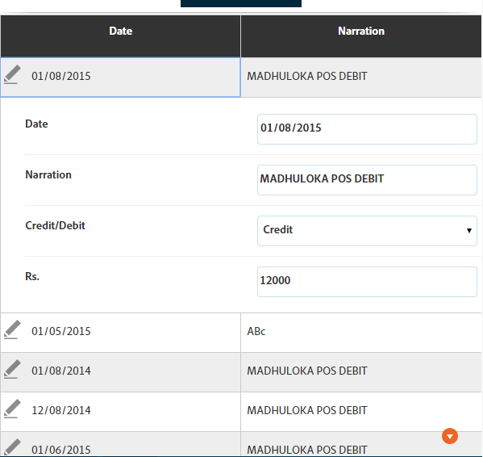

# Tablas en formularios adaptables{#tables-in-adaptive-forms}

El uso de tablas es una manera eficaz, simplificada y organizada de presentar datos complejos. Ayuda a los usuarios a identificar la información fácilmente y a proporcionar entradas en una organización ordenada de filas y columnas. La mayoría de los formularios de los servicios financieros y las organizaciones gubernamentales requieren tablas de datos de gran tamaño para poner números y realizar cálculos.

AEM Forms proporciona un componente Tabla en el navegador de componentes de la barra lateral que permite crear tablas en formularios adaptables. Algunas de las funciones clave que ofrece son:

* Diseño adaptable en dispositivos móviles
* Columnas y filas configurables
* Adición y eliminación dinámicas de filas durante la ejecución
* Combinar o combinar celdas y dividirlas
* Accesible para lectores de pantalla
* Diseño personalizado con CSS
* Compatible y asignado al componente de tabla XDP
* Compatibilidad para agregar filas o celdas mediante elementos de tipo complejo XSD
* Combinar datos de un archivo XML

## Cree una tabla {#create-a-table}

Para crear una tabla, arrastre y suelte el componente Tabla desde el navegador de componentes en la barra de tareas del formulario adaptable. De forma predeterminada, la tabla contiene dos columnas y tres filas, incluida la fila de encabezado.


### Acerca del encabezado y las celdas de cuerpo {#about-header-and-body-cells}

Las celdas del encabezado son campos de texto. Para cambiar la etiqueta de un encabezado, haga clic con el botón secundario en la celda del encabezado y haga clic en **Editar**. En el cuadro de diálogo Editar, actualice la etiqueta en el campo **Valor** y haga clic en **Aceptar**.

De forma predeterminada, las celdas de cuerpo son cuadros de texto. Puede reemplazar una celda de cuerpo por cualquier otro componente de formulario adaptable disponible en la barra de tareas, como un cuadro numérico, un selector de fecha o una lista desplegable.

Por ejemplo, la primera fila de trabajo de la tabla siguiente incluye componentes de cuadro de texto, selector de fecha y lista desplegable como celdas.


Puede combinar dos o más celdas de cuerpo seleccionando las celdas que desee combinar, haciendo clic con el botón derecho y seleccionando **Combinar**. Además, puede dividir una celda combinada haciendo clic con el botón derecho y seleccionando **Dividir celdas**.

### Añadir, eliminar, mover filas y columnas {#add-delete-move-rows-and-columns}

Puede agregar y eliminar una fila o columna y mover una fila hacia arriba y hacia abajo en una tabla.

Para agregar o eliminar una fila o columna o mover una fila, haga clic en cualquier celda de la fila o columna. Aparece un menú desplegable en la parte superior de la columna y en la parte izquierda de la fila. El menú de la parte superior ofrece opciones para agregar o eliminar la columna, mientras que el menú de la izquierda permite agregar, eliminar o mover la fila.

* La operación Añadir agrega una fila debajo o una columna a la derecha de la fila o columna seleccionada.
* La operación Eliminar elimina la fila o columna seleccionada.
* La operación Subir y Bajar mueve la fila seleccionada hacia arriba y hacia abajo.

El menú desplegable de la fila también proporciona la operación Editar para editar las propiedades de fila, la configuración y las opciones de estilo.


>[!NOTE]
>
>Aunque puede agregar cualquier número de filas en una tabla, el número máximo de columnas que puede agregar es seis. Además, no puede eliminar la fila de encabezado de la tabla.

### Añadir descripción de tabla {#add-table-description}

Puede agregar una descripción de la tabla para explicar cómo se organiza la información que los lectores de pantalla pueden interpretar y leer. Para agregar la descripción:

1. Seleccione la tabla y toque  para ver sus propiedades en la barra lateral.
1. Especifique un resumen en la ficha Accesibilidad.
1. Haga clic en **Listo**.

### Ordenar columnas en una tabla {#sortcolumnstable}

Puede ordenar los datos en función de cualquier columna de una tabla en el formulario adaptable. Los valores de la columna se pueden ordenar en orden ascendente o descendente.

La ordenación se puede aplicar a las columnas de tabla que contengan:

* Texto estático
* Propiedades del objeto del modelo de datos
* Combinación de las propiedades del objeto de modelo de datos y texto estático

Para aplicar el orden en las columnas de la tabla, las celdas de la columna de la tabla deben contener cualquiera de los siguientes componentes: Cuadro numérico, Paso numérico, Campo de entrada de fecha, Selector de fecha, Texto o Cuadro de texto.

Para habilitar la clasificación:

1. Seleccione la tabla y toque  (Configurar). También puede seleccionar la tabla mediante el navegador **Contenido** en la barra de tareas de la Comunicación interactiva.
1. Seleccione **Habilitar ordenación**.
1. Toque  para guardar las propiedades de la tabla. Los iconos de clasificación, flechas arriba y abajo, en los encabezados de columna representan que la clasificación se ha activado.

   

1. Cambie al modo **Previsualización** para vista de la salida. La tabla se ordena automáticamente en función de la primera columna de la tabla.
1. Haga clic en el encabezado de columna para ordenar los valores en función de la columna.

   Un encabezado de columna con una flecha hacia arriba representa que la tabla se ordena en función de esa columna. Además, los valores de la columna se muestran en orden ascendente.

   

   Del mismo modo, un encabezado de columna con una flecha hacia abajo representa que los valores de la columna se muestran en orden descendente.

   También puede realizar cambios en la tabla en el modo **Previsualización** y volver a hacer clic en el encabezado de columna para ordenar los valores de columna.

## Configurar el ancho de columna de una tabla {#set-column-width}

Siga los pasos siguientes para definir el ancho de columna de una tabla:

1. En la ficha **[!UICONTROL Contenido]**, toque el componente **[!UICONTROL Tabla]** y toque el icono Configurar ().

1. Introduzca la lista de valores separados por comas en el campo **[!UICONTROL Ancho de columna]** para especificar el ancho proporcionado de cada columna de la tabla. Por ejemplo, para una tabla que incluye 3 columnas, si se especifica 2,4,6 como valor en el campo **[!UICONTROL Ancho de columna]**, el ancho de las columnas se define como 2/12 para la primera columna, 4/12 para la segunda columna y 6/12 para la tercera columna. 2/12, ya que la anchura de la primera columna se refiere a una sexta parte de la anchura de la tabla. Del mismo modo, 4/12 define el ancho de la segunda columna como un tercio del ancho de la tabla y 6/12 define el ancho de la tercera columna como la mitad del ancho de la tabla.

## Configurar estilo de tabla {#configure}

Puede definir el estilo de una tabla mediante el modo Estilo de la barra de herramientas de la página. Realice los siguientes pasos para cambiar al modo de estilo y editar el estilo de tabla

1. En la barra de herramientas de la página, antes de la Previsualización, toque  > **Estilo**.

1. En la barra lateral, seleccione la tabla y toque el botón de edición .
Puede ver las propiedades de estilo en la barra lateral.


>[!NOTE]
>
>Puede cambiar el tema de color de las filas de encabezado y de trabajo cambiando los valores de las variables LESS. Para obtener más información, consulte [Temáticas en AEM Forms](/help/forms/using/themes.md) [](/help/forms/using/creating-custom-adaptive-form-themes.md).

## Añadir o eliminar dinámicamente una fila {#add-or-delete-a-row-dynamically}

Las tablas proporcionan compatibilidad inmediata para agregar o eliminar filas de forma dinámica durante la ejecución.

1. Seleccione una fila de tabla y toque .
1. En la ficha Ajustes de repetición, especifique los recuentos mínimo y máximo para limitar el número de filas de la tabla.
1. Haga clic en **Listo**.

En tiempo de ejecución, verá los botones **+** y *-* para agregar o eliminar una fila.


>[!NOTE]
>
>No se admite añadir o eliminar una fila dinámicamente en los encabezados en el diseño de tablas para móviles a la izquierda.

## Expresiones en una tabla {#expressions-in-a-table}

Las tablas de formularios adaptables permiten escribir expresiones en JavaScript para inducir comportamientos, como mostrar u ocultar una tabla o una fila, agregar todos los números y mostrar el total en una celda, habilitar o deshabilitar una celda, validar la entrada del usuario, etc. Estas expresiones utilizan API de modelos de secuencias de comandos de formularios adaptables.

Mientras que las tablas y las filas solo admiten expresiones de visibilidad para controlar su visibilidad en función del valor devuelto por una expresión, las celdas admiten las siguientes expresiones:

* **Secuencia de comandos de inicialización:** para realizar una acción al inicializar un campo.
* **Secuencia de comandos de confirmación de valores:** para cambiar los componentes de un formulario después de cambiar el valor de un campo.

>[!NOTE]
>
>Si la secuencia de comandos de cambio/salida XFA también se aplica al mismo campo, la secuencia de comandos de cambio/salida XFA se ejecuta antes que la secuencia de comandos de confirmación de valor.

* **Calcular expresiones**: para calcular automáticamente el valor de un campo.
* **Expresiones** de validación: para validar un campo.
* **Expresiones** de acceso: para activar o desactivar un campo.
* **Expresión** de visibilidad: para controlar la visibilidad de un campo y un panel.

La expresión de visibilidad de una tabla o fila se puede definir en la ficha Propiedades del panel del cuadro de diálogo del componente Editar correspondiente. Las expresiones de una celda se pueden definir en la ficha Secuencia de comandos del cuadro de diálogo Editar componente.

Para obtener la lista completa de clases de formularios adaptables, eventos, objetos y API públicas, consulte [Referencia de la API de la biblioteca JavaScript para formularios adaptables](https://helpx.adobe.com/experience-manager/6-5/forms/javascript-api/index.html).

## Diseños móviles {#mobile-layouts}

Las tablas de formularios adaptables proporcionan una experiencia incomparable para dispositivos móviles debido a sus diseños fluidos y adaptables. AEM Forms oferta dos tipos de diseños móviles para tablas: encabezados en columnas izquierda y columnas que pueden contraerse.

Puede configurar un diseño móvil para una tabla desde la ficha Estilo del cuadro de diálogo Editar componente para una tabla.

### Encabezados a la izquierda {#headers-on-left}

En el diseño Encabezados de la izquierda, el encabezado de la tabla se transpone a la izquierda y solo aparece una celda contra un encabezado. Cada fila de este diseño aparece como una sección distinta. Las siguientes imágenes comparan una tabla de un escritorio con la de un dispositivo móvil.


Vista de escritorio de una tabla con Encabezado en el diseño izquierdo


Vista móvil de una tabla con Encabezado en el diseño izquierdo

### Diseño de columnas contraíble {#collapsible-columns-layout}

En el diseño de columna que puede contraerse, las columnas de la tabla se contraen para mostrar una o dos columnas, según el tamaño del dispositivo, mientras que otras columnas se contraen. Puede hacer clic en el icono contraer o expandir para vista de otras columnas de la tabla.

>[!NOTE]
>
>Aunque el diseño de columna que puede contraerse está optimizado para dispositivos móviles, también funcionará en el escritorio si el ancho disponible no es suficiente para mostrar todas las columnas de una tabla.

Las siguientes imágenes comparan el aspecto de una tabla en un dispositivo con columnas contraídas y expandidas.


Columnas contraídas de una tabla con solo dos columnas que se muestran en un dispositivo móvil



Columna ampliada de una tabla en un dispositivo móvil

## Combinar datos en una tabla {#merge-data-in-a-table}

Las tablas de formularios adaptables permiten rellenar la tabla en tiempo de ejecución utilizando datos de un archivo XML. El archivo XML de datos puede residir en el sistema de archivos local del equipo en el que se ejecuta AEM Forms Server o en el repositorio de CRX.

Veamos un ejemplo de la siguiente tabla de resumen de transacciones bancarias que queremos rellenar con datos de un archivo XML.


En este ejemplo, la propiedad Nombre de elemento para:

* la fila es **Fila1**
* la celda body en Fecha de transacción es **tableItem1**
* la celda de cuerpo bajo Descripción es **tableItem2**
* la celda de cuerpo del tipo Transaction es **type**
* la celda de cuerpo debajo de Amount en USD es **tableItem3**

El archivo XML que contiene datos con el siguiente formato:

```xml
<?xml version="1.0" encoding="UTF-8"?><afData>
  <afUnboundData>
    <data>
 <typeSelect>0</typeSelect>
 <Row1>
      <tableItem1>2015-01-08</tableItem1>
      <tableItem2>Purchase laptop</tableItem2>
      <type>0</type>
      <tableItem3>12000</tableItem3>
 </Row1>
 <Row1>
      <tableItem1>2015-01-05</tableItem1>
      <tableItem2>Transport expense</tableItem2>
      <type>0</type>
      <tableItem3>120</tableItem3>
 </Row1>
 <Row1>
      <tableItem1>2014-01-08</tableItem1>
      <tableItem2>Laser printer</tableItem2>
      <type>0</type>
      <tableItem3>500</tableItem3>
 </Row1>
 <Row1>
      <tableItem1>2014-12-08</tableItem1>
      <tableItem2>Credit card payment</tableItem2>
      <type>0</type>
      <tableItem3>300</tableItem3>
 </Row1>
 <Row1>
      <tableItem1>2015-01-06</tableItem1>
      <tableItem2>Interest earnings</tableItem2>
      <type>1</type>
      <tableItem3>12000</tableItem3>
 </Row1>
 <Row1>
      <tableItem1>2015-01-05</tableItem1>
      <tableItem2>Payment from a client</tableItem2>
      <type>1</type>
      <tableItem3>500</tableItem3>
 </Row1>
 <Row1>
      <tableItem1>2015-01-08</tableItem1>
      <tableItem2>Food expense</tableItem2>
      <type>0</type>
      <tableItem3>120</tableItem3>
 </Row1>
 </data>
  </afUnboundData>
  <afBoundData>
    <data/>
  </afBoundData>
  <afBoundData/>
</afData>
```

En el XML de ejemplo, los datos de una fila se definen mediante las etiquetas `<Row1>`, que es el nombre del elemento de la fila de la tabla. Dentro de la etiqueta `<Row1>`, los datos de cada celda se definen dentro de la etiqueta para su nombre de elemento, como `<tableItem1>`, `<tableItem2>`, `<tableItem3>` y `<type>`.

Para combinar estos datos con la tabla en tiempo de ejecución, es necesario que señalemos el formulario adaptable que contiene la tabla a la ubicación XML absoluta con wcmmode desactivado. Por ejemplo, si el formulario adaptable se encuentra en *https://localhost:4502/myForms/bankTransaction.html* y el archivo XML de datos se guarda en *C:/myTransactions/bankSummary.xml*, puede vista de la tabla con datos en la siguiente dirección URL:

*https://localhost:4502/myForms/bankTransaction.html?dataRef=file:/// C:/myTransactions/bankSummary.xml&amp;wcmmode=disabled*


## Utilizar componentes XDP y tipos complejos XSD {#use-xdp-components-and-xsd-complex-types}

Si ha creado un formulario adaptable basado en una plantilla de formulario XFA, los elementos XFA están disponibles en la ficha Modelo de datos de AEM Buscador de contenido. Puede arrastrar y soltar estos elementos XFA, incluidas las tablas, en el formulario adaptable.

El elemento de tabla XFA se asigna al componente Tabla y funciona de forma predeterminada en formularios adaptables. Todas las propiedades y funcionalidades de la tabla XDP se conservan cuando se mueven a un formulario adaptable, y puede realizar cualquier operación en ella al igual que con la tabla de formulario adaptable nativa. Por ejemplo, si una fila de una tabla XDP está marcada como repetible, también se repetirá cuando se suelte en formularios adaptables.

Además, puede arrastrar y soltar el subformulario XDP para agregar una nueva fila a la tabla. Sin embargo, tenga en cuenta que la colocación de un subformulario anidado no funciona.

>[!NOTE]
>
>Una tabla XDP sin una fila de encabezado no se asignará al componente Tabla de formulario adaptable. En su lugar, se asignará al componente Panel de formularios adaptable con presentación fluida. Además, cuando se agrega una tabla anidada de un XDP a un formulario adaptable, la tabla exterior se convierte en un panel mientras se mantiene la tabla interna.

Además, puede arrastrar y soltar un grupo de elementos de tipo complejo XSD para crear una fila de tabla. Se crea una fila nueva justo debajo de la fila en la que se han colocado los elementos. Las celdas creadas con elementos de tipo complejos XSD mantienen una referencia de enlace al XSD. También puede reemplazar una celda de cuerpo por un elemento de tipo complejo XSD soltando el elemento en la celda.

>[!NOTE]
>
>El número de elementos de un componente de tabla XDP, un subformulario o un tipo complejo XSD no puede superar el número de celdas de una fila. Por ejemplo, no se pueden soltar cuatro elementos en una fila que solo tenga tres celdas. Producirá un error.
>
>Si el número de elementos es menor que el número de celdas de una fila, la nueva fila primero agrega celdas basadas en los elementos y, a continuación, se agregan las celdas predeterminadas para rellenar las celdas restantes de la fila. Por ejemplo, si se coloca un grupo de tres elementos en una fila que tiene cuatro celdas, las tres primeras se basan en los elementos que se han soltado y la otra celda será la celda de tabla predeterminada.

## Consideraciones clave {#key-considerations}

* Si mueve filas hacia arriba y hacia abajo durante la creación de una tabla basada en XSD, se verá cierta pérdida de datos de las filas de tabla en el XML de datos generado al enviar el formulario.
* Cada celda de cuerpo de una tabla predeterminada tiene un nombre de elemento predefinido asociado. Si agrega otra tabla en el formulario adaptable, las celdas de cuerpo predeterminadas de la nueva tabla tendrán el mismo nombre de elemento que en la primera tabla. En este escenario, los datos generados al enviar el formulario incluirán datos en las celdas de cuerpo predeterminadas de sólo una de las tablas. Por lo tanto, asegúrese de cambiar el nombre de los elementos para las celdas de cuerpo predeterminadas a fin de mantenerlos únicos en todas las tablas y evitar la pérdida de datos.

   Tenga en cuenta que esto solo se aplica a las celdas de cuerpo predeterminadas. Si agrega más filas o columnas a una tabla, se generarán automáticamente nombres de elementos únicos para celdas de cuerpo no predeterminadas.

