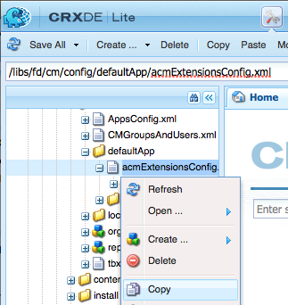

# Agregar un botón de acción personalizado en la interfaz de usuario Crear correspondencia {#add-custom-action-button-in-create-correspondence-ui}

## Información general {#overview}

La solución Administración de correspondencia le permite agregar acciones personalizadas a la interfaz de usuario Crear correspondencia.

El escenario de este documento explica cómo puede crear un botón en la interfaz de usuario Crear correspondencia para compartir una carta como PDF de revisión adjunto a un correo electrónico.

### Requisitos previos {#prerequisites}

Para completar este escenario, necesita lo siguiente:

* Conocimiento de CRX y JavaScript
* Servidor de LiveCycle

## Escenario: cree el botón en la interfaz de usuario Crear correspondencia para enviar una carta a revisión {#scenario-create-the-button-in-the-create-correspondence-user-interface-to-send-a-letter-for-review}

Agregar un botón con una acción (enviar carta para revisión) a la interfaz de usuario Crear correspondencia incluye:

1. Agregar del botón a la interfaz de usuario Crear correspondencia
1. Agregar la administración de acciones al botón
1. Agregar el proceso de LiveCycle para habilitar la administración de acciones

### Agregar el botón a la interfaz de usuario Crear correspondencia {#add-the-button-to-the-create-correspondence-user-interface}

1. Vaya a `https://'[server]:[port]'/[ContextPath]/crx/de` e inicie sesión como administrador.
1. En la carpeta de aplicaciones, cree una carpeta denominada `defaultApp` con una ruta/estructura similar a la carpeta defaultApp (en la carpeta config). Para crear la carpeta, siga estos pasos:

   1. Haga clic con el botón derecho en la carpeta **defaultApp** en la siguiente ruta y seleccione **Nodo de superposición**:

      /libs/fd/cm/config/defaultApp/

      

   1. Asegúrese de que el cuadro de diálogo Nodo de superposición tenga los siguientes valores:

      **Ruta:** /libs/fd/cm/config/defaultApp/

      **Ubicación de superposición:** /apps/

      **Coincidir tipos de nodo:** Comprobado

      

   1. Haga clic en **Aceptar**.
   1. Haga clic en **Guardar todo**.

1. Haga una copia del archivo acmExtensionsConfig.xml (existe en la rama /libs) en la rama /apps.

   1. Vaya a “/libs/fd/cm/config/defaultApp/acmExtensionsConfig.xml”

   1. Haga clic con el botón derecho en el archivo acmExtensionsConfig.xml y seleccione **Copiar**.

      

   1. Haga clic con el botón derecho en la carpeta **defaultApp** en “/apps/fd/cm/config/defaultApp/” y seleccione **Pegar**.
   1. Haga clic en **Guardar todo**.

1. Haga doble clic en la copia de acmExtentionsConfig.xml que acaba de crear en la carpeta de aplicaciones. El archivo se abre para editarlo.
1. Busque el siguiente código:

   ```xml
   <?xml version="1.0" encoding="utf-8"?>
   <extensionsConfig>
       <modelExtensions>
           <modelExtension type="LetterInstance">
     <customAction name="Preview" label="loc.letterInstance.preview.label" tooltip="loc.letterInstance.preview.tooltip" styleName="previewButton"/>
               <customAction name="Submit" label="loc.letterInstance.submit.label" tooltip="loc.letterInstance.submit.tooltip" styleName="submitButton" permissionName="forms-users"/>
               <customAction name="SaveAsDraft" label="loc.letterInstance.saveAsDraft.label" tooltip="loc.letterInstance.saveAsDraft.tooltip" styleName="submitButton" permissionName="forms-users"/>
               <customAction name="Close" label="loc.letterInstance.close.label" tooltip="loc.letterInstance.close.tooltip" styleName="closeButton"/>
           </modelExtension>
       </modelExtensions>
   </extensionsConfig>
   ```

1. Para enviar una carta por correo electrónico, puede utilizar el flujo de trabajo de Forms de LiveCycle. Agregue una etiqueta customAction bajo la etiqueta modelExtension en acmExtensionsConfig.xml como se indica a continuación:

   ```xml
    <customAction name="Letter Review" label="Letter Review" tooltip="Letter Review" styleName="" permissionName="forms-users" actionHandler="CM.domain.CCRCustomActionHandler">
         <serviceName>Forms Workflow -> SendLetterForReview/SendLetterForReviewProcess</serviceName>
       </customAction>
   ```

   

   La etiqueta modelExtension tiene un conjunto de etiquetas secundarias customAction que configuran la acción, los permisos y el aspecto del botón de acción. A continuación se muestra la lista de etiquetas de configuración customAction:

   | **Nombre** | **Descripción** |
   |---|---|
   | name | Nombre alfanumérico de la acción que se va a realizar. El valor de esta etiqueta es obligatorio, debe ser único (dentro de la etiqueta modelExtension) y debe comenzar con una letra. |
   | etiqueta | La etiqueta que se mostrará en el botón de acción |
   | información de objeto | Texto de información del objeto del botón, que se muestra cuando el usuario pasa el ratón por encima del botón. |
   | styleName | Nombre del estilo personalizado que se aplica en el botón de acción. |
   | permissionName | La acción correspondiente solo se muestra si el usuario tiene el permiso especificado por permissionName. Cuando especifique permissionName como `forms-users`, todos los usuarios tendrán acceso a esta opción. |
   | actionHandler | Nombre completo de la clase ActionHandler a la que se llama cuando el usuario hace clic en el botón. |

   Aparte de los parámetros anteriores, puede haber configuraciones adicionales asociadas con customAction. Estas configuraciones adicionales están disponibles para el controlador a través del objeto CustomAction.

   | **Nombre** | **Descripción** |
   |---|---|
   | serviceName | Si customAction contiene una etiqueta secundaria con el nombre serviceName, al hacer clic en el botón o vínculo correspondiente se llamará a un proceso con el nombre representado por la etiqueta serviceName. Asegúrese de que este proceso tenga la misma firma que la Carta PostProcess. Agregue el prefijo “Forms Workflow ->” en el nombre del servicio. |
   | Parámetros que contienen cm_ prefix en el nombre de la etiqueta | Si un customAction contiene etiquetas secundarias que comienzan por name cm_, en el proceso posterior (ya sea Letter Post Process o el proceso especial representado por la etiqueta serviceName), estos parámetros están disponibles en el código XML de entrada bajo la etiqueta correspondiente con cm_ prefix quitado. |
   | actionName | Siempre que un proceso posterior se deba a un clic, el XML enviado contendrá una etiqueta especial con el nombre bajo la etiqueta con el nombre de la acción del usuario. |

1. Haga clic en **Guardar todo**.

#### Cree una carpeta “locale” con un archivo de propiedades en la rama /apps {#create-a-locale-folder-with-properties-file-in-the-apps-branch}

El archivo ACMExtensionsMessages.properties incluye etiquetas y mensajes de información de objeto de varios campos en la interfaz de usuario Crear correspondencia. Para que funcionen las acciones/botones personalizados, realice una copia de este archivo en la rama /apps.

1. Haga clic con el botón derecho en la carpeta **locale** en la siguiente ruta y seleccione **Nodo de superposición**:

   /libs/fd/cm/config/defaultApp/locale

1. Asegúrese de que el cuadro de diálogo Nodo de superposición tenga los siguientes valores:

   **Ruta:**/libs/fd/cm/config/defaultApp/locale

   **Ubicación de superposición:** /apps/

   **Coincidir tipos de nodo:** Comprobado

1. Haga clic en **Aceptar**.
1. Haga clic en **Guardar todo**.
1. Haga clic con el botón derecho en el siguiente archivo y seleccione **Copiar**:

   `/libs/fd/cm/config/defaultApp/locale/ACMExtensionsMessages.properties`

1. Haga clic con el botón derecho en la carpeta **locale** en la siguiente ruta y seleccione **Pegar**:

   `/apps/fd/cm/config/defaultApp/locale/`

   El archivo ACMExtensionsMessages.properties se copia en la carpeta locale.

1. Para localizar las etiquetas del botón/acción personalizados agregados recientemente, cree el archivo ACMExtensionsMessages.properties para el “locale” relevante en `/apps/fd/cm/config/defaultApp/locale/`.

   Por ejemplo, para localizar la acción/botón personalizado creado en este artículo, cree un archivo llamado ACMExtensionsMessages_fr.properties con la siguiente entrada:

   `loc.letterInstance.letterreview.label=Revue De Lettre`

   Del mismo modo, puede agregar más propiedades, como información sobre herramientas y estilo, en este archivo.

1. Haga clic en **Guardar todo**.

#### Reinicie el paquete de bloque de creación del Compositor de recursos de Adobe {#restart-the-adobe-asset-composer-building-block-bundle}

Después de realizar cada cambio en el lado del servidor, reinicie el paquete de bloque de creación del Compositor de recursos de Adobe. En esta situación, se editan los archivos acmExtensionsConfig.xml y ACMExtensionsMessages.properties del lado del servidor y, por lo tanto, el paquete del bloque de creación del Compositor de recursos de Adobe requiere un reinicio.

>[!NOTE]
>
>Es posible que tenga que borrar la memoria caché del explorador.

1. Vaya a `https://[host]:'port'/system/console/bundles`. Si es necesario, inicie sesión como administrador.

1. Busque el paquete de bloque de creación del Compositor de recursos de Adobe. Reinicie el paquete: haga clic en Detener y, a continuación, en Iniciar.

   

Después de reiniciar el paquete de bloque de creación del Compositor de recursos de Adobe, aparecerá el botón personalizado en la interfaz de usuario Crear correspondencia. Puede abrir una carta en la interfaz de usuario Crear correspondencia para obtener una vista previa del botón personalizado.

### Agregar el control de acciones al botón {#add-action-handling-to-the-button}

La interfaz de usuario Crear correspondencia tiene de forma predeterminada la implementación de ActionHandler en el archivo cm.domain.js en la siguiente ubicación:

/libs/fd/cm/ccr/gui/components/admin/clientlibs/ccr/js/cm.domain.js

Para la administración de acciones personalizadas, cree una superposición del archivo cm.domain.js en la rama /apps de CRX.

La administración de la acción/botón al hacer clic en la acción/botón incluye lógica para lo siguiente:

* Hacer que la acción recién agregada sea visible/invisible: hecho al anular la función actionVisible().
* Habilitar o deshabilitar la acción agregada recientemente: hecho al anular la función actionEnabled().
* Tratamiento real de la acción cuando el usuario hace clic en el botón: hecho al anular la implementación de la función handleAction().

1. Vaya a `https://'[server]:[port]'/[ContextPath]/crx/de`. Si es necesario, inicie sesión como administrador.

1. En la carpeta de aplicaciones, cree una carpeta denominada `js` en la rama /apps de CRX con una estructura similar a la siguiente carpeta:

   `/libs/fd/cm/ccr/gui/components/admin/clientlibs/ccrui/js`

   Para crear la carpeta, siga estos pasos:

   1. Haga clic con el botón derecho en la carpeta **js** en la siguiente ruta y seleccione **Nodo de superposición**:

      `/libs/fd/cm/ccr/gui/components/admin/clientlibs/ccrui/js`

   1. Asegúrese de que el cuadro de diálogo Nodo de superposición tenga los siguientes valores:

      **Ruta:** /libs/fd/cm/ccr/gui/components/admin/clientlibs/ccrui/js

      **Ubicación de superposición:** /apps/

      **Coincidir tipos de nodo:** Comprobado

   1. Haga clic en **Aceptar**.
   1. Haga clic en **Guardar todo**.

1. En la carpeta js, cree un archivo llamado ccustomization.js con el código para administrar acciones del botón al seguir los siguientes pasos:

   1. Haga clic con el botón derecho en la carpeta **js** en la siguiente ruta y seleccione **Crear > Crear archivo**:

      `/apps/fd/cm/ccr/gui/components/admin/clientlibs/ccrui/js`

      Asigne un nombre al archivo como ccustomization.js.

   1. Haga doble clic en el archivo ccustomization.js para abrirlo en CRX.
   1. En el archivo, pegue el siguiente código y haga clic en **Guardar todo**:

      ```javascript
      /* for adding and handling custom actions in Extensible Toolbar.
        * One instance of handler will be created for each action.
        * CM.domain.CCRCustomActionHandler is actionHandler class.
        */
      var CCRCustomActionHandler;
          CCRCustomActionHandler = CM.domain.CCRCustomActionHandler = new Class({
              className: 'CCRCustomActionHandler',
              extend: CCRDefaultActionHandler,
              construct : function(action,model){
              }
          });
          /**
           * Called when user user click an action
           * @param extraParams additional arguments that may be passed to handler (For future use)
           */
          CCRCustomActionHandler.prototype.handleAction = function(extraParams){
              if (this.action.name == CCRCustomActionHandler.SEND_FOR_REVIEW) {
                  var sendForReview = function(){
                      var serviceName = this.action.actionConfig["serviceName"];
                      var inputParams = {};
                      inputParams["dataXML"] = this.model.iccData.data;
                      inputParams["letterId"] = this.letterVO.id;
                      inputParams["letterName"] = this.letterVO.name;
                      inputParams["mailId"] = $('#email').val();
                      /*function to invoke the LivecyleService */
                      ServiceDelegate.callJSONService(this,"lc.icc.renderlib.serviceInvoker.json","invokeProcess",[serviceName,inputParams],this.onProcessInvokeComplete,this.onProcessInvokeFail);
                      $('#ccraction').modal("hide");
                  }
                  if($('#ccraction').length == 0){
                      /*For first click adding popup & setting letterName.*/
                      $("body").append(popUp);
                      $("input[id*='letterName']").val(this.letterVO.name);
                      $(document).on('click',"#submitLetter",$.proxy( sendForReview, this ));
                  }
                  $('#ccraction').modal("show");
              }
          };
          /**
           * Should the action be enabled in toolbar
           * @param extraParams additional arguements that may be passed to handler (For future use)
           * @return flag indicating whether the action should be enabled
           */
         CCRCustomActionHandler.prototype.actionEnabled = function(extraParams){
                  /*can be customized as per user requirement*/
                  return true;
          };
          /**
           * Should the action be visible in toolbar
           * @param extraParams additional arguments that may be passed to handler (For future use)
           * @return flag indicating whether the action should be enabled
           */
          CCRCustomActionHandler.prototype.actionVisible = function(extraParams){
              /*Check can be enabled for Non-Preview Mode.*/
              return true;
          };
          /*SuccessHandler*/
          CCRCustomActionHandler.prototype.onProcessInvokeComplete = function(response) {
              ErrorHandler.showSuccess("Letter Sent for Review");
          };
          /*FaultHandler*/
          CCRCustomActionHandler.prototype.onProcessInvokeFail = function(event) {
              ErrorHandler.showError(event.message);
          };
          CCRCustomActionHandler.SEND_FOR_REVIEW  = "Letter Review";
      /*For PopUp*/
          var popUp = '<div class="modal fade" id="ccraction" tabindex="-1" role="dialog" aria-hidden="true">'+
          '<div class="modal-dialog modal-sm">'+
              '<div class="modal-content">' +
                  '<div class="modal-header">'+
                      '<button type="button" class="close" data-dismiss="modal" aria-label="Close"><span aria-hidden="true">&times;</code></button>'+
                      '<h4 class="modal-title"> Send Review </h4>'+
                  '</div>'+
                  '<div class="modal-body">'+
                      '<form>'+
                          '<div class="form-group">'+
                              '<label class="control-label">Email Id</label>'+
                              '<input type="text" class="form-control" id="email">'+
                          '</div>'+
                          '<div class="form-group">'+
                              '<label  class="control-label">Letter Name</label>'+
                              '<input id="letterName" type="text" class="form-control" readonly>'+
                          '</div>'+
                          '<div class="form-group">'+
                              '<input id="letterData" type="text" class="form-control hide" readonly>'+
                          '</div>'+
                      '</form>'+
                  '</div>'+
                  '<div class="modal-footer">'+
                     '<button type="button" class="btn btn-default" data-dismiss="modal"> Cancel </button>'+
                     '<button type="button" class="btn btn-primary" id="submitLetter"> Submit </button>'+
                  '</div>'+
              '</div>'+
          '</div>'+
      '</div>';
      ```

### Agregar el proceso de LiveCycle para habilitar la acción <span class="acrolinxCursorMarker"></code>manejo {#add-the-livecycle-process-to-enable-action-span-class-acrolinxcursormarker-span-handling}

En esta situación, habilite los siguientes componentes, que forman parte del archivo adjunto components.zip:

* Componentes DSC (DSCSample.jar)
* Enviar carta para el proceso de revisión LCA (SendLetterForReview.lca)

Descargue y descomprima el archivo components.zip para obtener los archivos DSCSample.jar y SendLetterForReview.lca. Utilice estos archivos como se especifica en los siguientes procedimientos.
[Obtener archivo](assets/components.zip)

#### Configurar el servidor de LiveCycle para ejecutar el proceso LCA {#configure-the-livecycle-server-to-run-the-lca-process}

>[!NOTE]
>
>Este paso solo es necesario si está en una configuración OSGI y la integración LC es necesaria para el tipo de personalización que implementa.

El proceso LCA se ejecuta en el servidor de LiveCycle y requiere la dirección del servidor y las credenciales de inicio de sesión.

1. Vaya a `https://'[server]:[port]'/system/console/configMgr` e inicie sesión como administrador.
1. Busque la configuración del SDK del cliente de Adobe LiveCycle y haga clic en **Editar** (icono de edición). Se abre el panel Configuraciones.

1. Escriba los siguientes detalles y haga clic en **Guardar**:

   * **URL del servidor**: URL del servidor LC cuyo servicio Enviar para revisión utiliza el código del controlador de acciones.
   * **Nombre de usuario**: nombre de usuario de administrador del servidor LC
   * **Contraseña**: contraseña del nombre de usuario del administrador

   

#### Instalar el archivo de LiveCycle (LCA) {#install-livecycle-archive-lca}

Proceso de LiveCycle requerido que habilita el proceso de servicio de correo electrónico.

>[!NOTE]
>
>Para ver lo que hace este proceso o crear un proceso similar propio, necesita Workbench.

1. Inicie sesión como administrador en LiveCycle® Server adminui en `https:/[lc server]/:[lc port]/adminui`.

1. Navegue hasta **Inicio > Servicios > Aplicaciones y servicios > Administración de aplicaciones**.

1. Si la aplicación SendLetterForReview ya está presente, omita los pasos restantes de este procedimiento; de lo contrario, continúe con los siguientes pasos.

   

1. Haga clic en **Importar**.

1. Haga clic en **Elegir archivo** y seleccione SendLetterForReview.lca.

   

1. Haga clic en **Vista previa**.

1. Seleccione **Implementar recursos en tiempo de ejecución cuando se complete la importación**.

1. Haga clic en **Importar**.

#### Agregar ServiceName a la lista Servicio de la Lista de permitidos {#adding-servicename-to-the-allowlist-service-list}

Mencione en el servidor de Experience Manager los servicios de LiveCycle a los que desea acceder el servidor de Experience Manager.

1. Inicie sesión como administrador para `https:/[host]:'port'/system/console/configMgr`.

1. Busque y haga clic en **Configuración del SDK de cliente de Adobe LiveCycle**. Aparecerá el panel Configuración del SDK del cliente de Adobe LiveCycle.
1. En la lista Nombre del servicio, haga clic en el icono + y agregue un serviceName **SendLetterForReview/SendLetterForReviewProcess**.

1. Haga clic en **Guardar**.

#### Configurar el servicio de correo electrónico {#configure-the-email-service}

En esta situación, para que Administración de correspondencia pueda enviar un correo electrónico, configure el servicio de correo electrónico en el servidor de LiveCycle.

1. Inicie sesión con credenciales de administrador en el servidor de LiveCycle en `https:/[lc server]:[lc port]/adminui`.

1. Navegue hasta **Inicio > Servicios > Aplicaciones y servicios > Administración de servicios**.

1. Busque y haga clic en **EmailService**.

1. En **Host SMTP**, configure el servicio de correo electrónico.

1. Haga clic en **Guardar**.

#### Configurar el servicio DSC {#configure-the-dsc-service}

Para utilizar la API Administración de correspondencia, descargue el archivo DSCSample.jar (adjunto en este documento como parte de components.zip) y cárguelo en el servidor de LiveCycle. Una vez cargado el archivo DSCSample.jar en el servidor de LiveCycle, el servidor de Experience Manager utilizará el archivo DSCSample.jar para acceder a la API renderLetter.

Para obtener más información, consulte [Conectar AEM Forms con Adobe LiveCycle](/help/forms/using/aem-livecycle-connector.md).

1. Actualice la URL del servidor de Experience Manager en cmsa.properties en DSCSample.jar, que se encuentra en la siguiente ubicación:

   DSCSample.jar\com\adobe\livecycle\cmsa.properties

1. Proporcione los siguientes parámetros en el archivo de configuración:

   * **crx.serverUrl**=https:/host:port/[context path]/[AEM URL]
   * **crx.username**= nombre de usuario de Experience Manager
   * **crx.password**= contraseña de Experience Manager
   * **crx.appRoot**=/content/apps/cm

   >[!NOTE]
   >
   >Cada vez que realice cambios en el servidor de LiveCycle, reinícielo.

   El archivo DSCSample.jar utiliza la API renderLetter. Para obtener más información sobre la API renderLetter, consulte [Interfaz de LetterRenderService](https://www.adobe.io/experience-manager/reference-materials/6-5/forms/javadocs/index.html?com/adobe/icc/ddg/api/LetterRenderService.html).

#### Importar DSC a LiveCycle {#import-dsc-to-livecyle}

El archivo DSCSample.jar utiliza la API renderLetter para procesar la carta como bytes de PDF de los datos XML que DSC proporciona como entrada. Para obtener más información sobre renderLetter y otras API, consulte [Servicio de procesamiento de cartas](https://www.adobe.io/experience-manager/reference-materials/6-5/forms/javadocs/index.html?com/adobe/icc/ddg/api/LetterRenderService.html).

1. Inicie Workbench e inicie sesión.
1. Seleccione **Ventana > Mostrar vistas > Componentes**. La vista Componentes se agrega a Workbench ES2.

1. Haga clic con el botón derecho en **Componentes** y seleccione **Instalar componente**.

1. Seleccione el archivo **DSCSample.jar** a través del explorador de archivos y haga clic en **Abrir**.
1. Haga clic con el botón derecho en **RenderWrapper** y seleccione **Iniciar componente**. Si se inicia el componente, aparecerá una flecha verde junto al nombre del componente.

## Enviar carta para revisión {#send-letter-for-review}

Después de configurar la acción y el botón para enviar la carta para su revisión:

1. Borre la memoria caché del explorador.

1. En la interfaz de usuario Crear correspondencia, haga clic en **Revisión de carta** y especifique el ID de correo electrónico del revisor.

1. Haga clic en **Enviar**.


El revisor recibirá un correo electrónico del sistema con la carta como datos adjuntos PDF.
