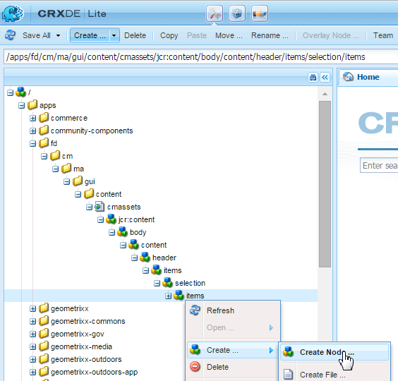

# Agregar una acción personalizada a la vista Listado de recursos{#add-custom-action-to-the-asset-listing-view}

## Información general {#overview}

La solución de Administración de correspondencia le permite agregar acciones personalizadas a la interfaz de usuario Administrar recursos.

Puede agregar una acción personalizada a la vista Listado de recursos para lo siguiente:

* Uno o más tipos de recursos o cartas
* Ejecución (la acción/el comando se activa) al seleccionar recursos/cartas individuales, múltiples o sin selección

Esta personalización se muestra con el escenario que agrega el comando “Descargar PDF aplanado” a la vista Listado de recursos para las cartas. Este escenario de personalización permite a los usuarios descargar un PDF aplanado de una sola carta seleccionada.

### Requisitos previos {#prerequisites}

Para completar el siguiente escenario o uno similar, necesita conocer:

* CRX
* JavaScript
* Java™

## Escenario: agregue un comando a la interfaz de usuario de la lista Cartas para descargar la versión de PDF aplanado de una carta {#addcommandtoletters}

Los pasos siguientes agregan un comando “Descargar PDF aplanado” a la vista Lista de recursos para las cartas y permiten a sus usuarios descargar un PDF aplanado de la carta seleccionada. Mediante estos pasos con el código y los parámetros adecuados, puede agregar otras funcionalidades para un recurso diferente, como diccionarios de datos o textos.

Para personalizar Administración de correspondencia para permitir que los usuarios descarguen un PDF aplanado de cartas, complete los siguientes pasos:

1. Vaya a `https://'[server]:[port]'/[ContextPath]/crx/de` e inicie sesión como administrador.

1. En la carpeta de aplicaciones, cree una carpeta denominada Elementos con una ruta/estructura similar a la de la carpeta Elementos ubicada en la carpeta de selección, para hacerlo, siga los siguientes pasos:

   1. Haga clic con el botón derecho en la carpeta **Elementos** en la siguiente ruta y seleccione **Nodo de superposición**:

      `/libs/fd/cm/ma/gui/content/cmassets/jcr:content/body/content/header/items/selection/items`

      >[!NOTE]
      >
      >Esta ruta es específica para crear una acción que funcione con la selección de uno o varios recursos o cartas. Si desea crear una acción que funcione sin selección, cree un nodo de superposición para la siguiente ruta y complete los pasos restantes en consecuencia:
      >
      >
      >`/libs/fd/cm/ma/gui/content/cmassets/jcr:content/body/content/header/items/default/items`

      

   1. Asegúrese de que el cuadro de diálogo Nodo de superposición tenga los siguientes valores:

      **Ruta:** /libs/fd/cm/ma/gui/content/cmassets/jcr:content/body/content/header/items/selection/items

      **Ubicación:** /apps/

      **Tipos de nodos coincidentes:** Seleccionado

      

   1. Haga clic en **Aceptar**. La estructura de carpetas se crea en la carpeta de aplicaciones.

      Haga clic en **Guardar todo**.

1. En la carpeta Elementos recién creada, agregue un nodo para el botón o la acción personalizados en un recurso concreto (Ejemplo: downloadFlatPDF), para hacerlo, siga estos pasos:

   1. Haga clic con el botón derecho en la carpeta **Elementos** y seleccione **Crear** > **Crear nodo**.

   1. Asegúrese de que el cuadro de diálogo Crear nodo tiene los siguientes valores y haga clic en **Aceptar**:

      **Nombre:** downloadFlatPDF (o el nombre que desee dar a esta propiedad)

      **Tipo:** nt:unstructured

   1. Haga clic en el nuevo nodo que ha creado (aquí downloadFlatPDF). CRX muestra las propiedades del nodo.

   1. Agregue las siguientes propiedades al nodo (aquí downloadFlatPDF) y haga clic en **Guardar todo**:

      <table>
        <tbody>
        <tr>
        <td><strong>Nombre</strong></td>
        <td><strong>Tipo</strong></td>
        <td><strong>Valor  y Descripción</strong></td>
        </tr>
        <tr>
        <td>clase</td>
        <td>Cadena</td>
        <td>foundation-collection-action</td>
        </tr>
        <tr>
        <td>foundation-collection-action</td>
        <td>Cadena</td>
        <td><p>{"target": ".cq-manageasset-admin-childpages", "activeSelectionCount": "single","type": "LETTER"}<br /> <br /> <br /> <strong>activeSelectionCount</strong> puede ser individual o múltiple para permitir selecciones de recursos individuales o múltiples en los que se realiza la acción personalizada.</p> <p><strong>type</strong> puede ser una o más (entradas múltiples separadas por comas) de lo siguiente: CARTA, TEXTO, LISTA, CONDICIÓN, DICCIONARIO DE DATOS</p> </td>
        </tr>
        <tr>
        <td>icono</td>
        <td>Cadena</td>
        <td>icon-download<br /> <br /> Icono que muestra Administración de correspondencia a la izquierda del comando/menú. Para ver los diferentes iconos y configuraciones disponibles, consulte <a href="https://experienceleague.adobe.com/docs/experience-manager-release-information/aem-release-updates/previous-updates/aem-previous-versions.html?lang=es" target="_blank">Documentación de los iconos de CoralUI</a>.<br /> </td>
        </tr>
        <tr>
        <td>jcr:primaryType</td>
        <td>Nombre</td>
        <td>nt:unstructured</td>
        </tr>
        <tr>
        <td>rel</td>
        <td>Cadena</td>
        <td>download-plain-pdf-button</td>
        </tr>
        <tr>
        <td>sling:resourceType</td>
        <td>Cadena</td>
        <td>granite/ui/components/endor/actionbar/button</td>
        </tr>
        <tr>
        <td>text</td>
        <td>Cadena</td>
        <td>Descargar PDF aplanado (o cualquier otra etiqueta)<br /> <br /> El comando que aparece en la interfaz Listado de recursos</td>
        </tr>
        <tr>
        <td>título</td>
        <td>Cadena</td>
        <td>Descargue un PDF aplanado de la carta seleccionada (o cualquier otra etiqueta/texto alternativo)<br /> <br /> El título es el texto alternativo que se muestra cuando el usuario pasa el ratón sobre el comando personalizado.</td>
        </tr>
        </tbody>
       </table>

1. En la carpeta de aplicaciones, cree una carpeta denominada js con una ruta o estructura similares a la carpeta Elementos ubicada en la carpeta de administración, para hacerlo, siga estos pasos:

   1. Haga clic con el botón derecho en la carpeta **js** en la siguiente ruta y seleccione **Nodo de superposición**:

      `/libs/fd/cm/ma/gui/components/admin/clientlibs/admin/js`

   1. Asegúrese de que el cuadro de diálogo Nodo de superposición tenga los siguientes valores:

      **Ruta:** /libs/fd/cm/ma/gui/components/admin/clientlibs/admin/js

      **Ubicación:** /apps/

      **Tipos de nodos coincidentes:** Seleccionado

   1. Haga clic en **Aceptar**. La estructura de carpetas se crea en la carpeta de aplicaciones. Haga clic en **Guardar todo**.

1. En la carpeta js, cree un archivo llamado formaction.js con el código para administrar la acción del botón, para hacerlo, siga los siguientes pasos:

   1. Haga clic con el botón derecho en la carpeta **js** en la siguiente ruta y seleccione **Crear > Crear archivo**:

      `/apps/fd/cm/ma/gui/components/admin/clientlibs/admin/js`

      Asigne un nombre al archivo formaction.js.

   1. Haga doble clic en el archivo para abrirlo en CRX.
   1. En el archivo formaction.js (en la rama /apps), copie el código del archivo formaction.js en la siguiente ubicación:

      `/libs/fd/cm/ma/gui/components/admin/clientlibs/admin/js/formaction.js`

      A continuación, anexe el siguiente código al final del archivo formaction.js (en la rama /apps) y haga clic en **Guardar todo**:

      ```javascript
      /* Action url for xml file to be added.*/
      var ACTION_URL = "/apps/fd/cm/ma/gui/content/commons/actionhandlers/items/letterpdfdownloader.html";
      
      /* File upload handling*/
      var fileSelectedHandler = function(e){
          if(e && e.target && e.target.value)
              $(".downloadLetterPDFBtn").removeAttr('disabled');
          else
              $(".downloadLetterPDFBtn").attr('disabled','disabled');
      }
      
      /*Handing of Download button in pop up.*/
      var downloadClickHandler = function(){
          $('#downloadLetterPDFDilaog').modal("hide");
          var element = $('.foundation-selections-item');
          var path = $(element).data("path");
          $("#fileUploadForm").attr('action', ACTION_URL + "?letterId="+path).submit();
      }
      
      /*Click handling on action button.*/
      $(document).on("click",'.download-flat-pdf-button',function(e){
          $("#uploadSamepledata").val("");
           if($('#downloadLetterPDFDilaog').length == 0){
              $(document).on("click",".downloadLetterPDFBtn",downloadClickHandler);
              $(document).on("change","#uploadSamepledata",fileSelectedHandler);
              $("body").append(downloadLetterPDFDilaog);
          }
            $('#downloadLetterPDFDilaog').modal("show");
      });
      
      /*Download popup.*/
      var downloadLetterPDFDilaog = '<div id="downloadLetterPDFDilaog" class="coral-Modal notice " role="dialog"  aria-hidden="true">'+
          '<form id="fileUploadForm" method="POST" enctype="multipart/form-data">'+
              '<div class="coral-Modal-header">'+
                  '<h2 class="coral-Modal-title coral-Heading coral-Heading--2" id="modal-header1443020790107-label" tabindex="0">Download Letter as PDF.</h2>'+
                  '<button type="button" class="coral-MinimalButton coral-Modal-closeButton" data-dismiss="modal">×</button>'+
              '</div>'+
              '<div class="coral-Modal-body" id="modal-header1443020790107-message" role="document" tabindex="0">'+
                  '<div class="coral-Modal-message">'+
                      '<p></p>'+
                  '</div>'+
                  '<div class="coral-Modal-uploader">'+
                      '<p>Select sample data for letter.</p>'+
                      '<input type="file" id="uploadSamepledata" name="file" accept=".xml" size="70px">'+
                  '</div>'+
              '</div>'+
           '</form>'+
              '<div class="coral-Modal-footer">'+
                  '<button type="button" class="coral-Button" data-dismiss="modal">Cancel</button>'+
                  '<button type="button" class="coral-Button coral-Button--primary downloadLetterPDFBtn" disabled="disabled">Download</button>'+
              '</div>'+
      '</div>';
      ```

      El código que agregue en este paso anulará el código de la carpeta libs, por lo que copie el código anterior en el archivo formaction.js de la rama /apps. Copiar el código de la rama /libs a la rama /apps garantizará que la funcionalidad anterior también funcione.

      El código anterior es para la administración de acciones específicas de cartas del comando creado en este procedimiento. Para administrar acciones de otros recursos, modifique el código JavaScript.

1. En la carpeta de aplicaciones, cree una carpeta denominada Elementos con una ruta/estructura similar a la de la carpeta Elementos ubicada en la carpeta actionhandlers, para hacerlo, siga los siguientes pasos:

   1. Haga clic con el botón derecho en la carpeta **Elementos** en la siguiente ruta y seleccione **Nodo de superposición**:

      `/libs/fd/cm/ma/gui/content/commons/actionhandlers/items/`

   1. Asegúrese de que el cuadro de diálogo Nodo de superposición tenga los siguientes valores:

      **Ruta:** /libs/fd/cm/ma/gui/content/commons/actionhandlers/items/

      **Ubicación:** /apps/

      **Tipos de nodos coincidentes:** Seleccionado

   1. Haga clic en **Aceptar**. La estructura de carpetas se crea en la carpeta de aplicaciones.

   1. Haga clic en **Guardar todo**.

1. En el nodo de elementos recién creado, agregue un nodo para el botón o la acción personalizados en un recurso concreto (Ejemplo: letterpdfdownloader), para hacerlo, siga estos pasos:

   1. Haga clic con el botón derecho en la carpeta Elementos y seleccione **Crear > Crear nodo**.

   1. Asegúrese de que el cuadro de diálogo Crear nodo tiene los siguientes valores y haga clic en **Aceptar**:

      **Nombre:** letterpdfdownloader (o el nombre que desee dar a esta propiedad, debe ser único. Si usa un nombre diferente, especifique el mismo en la variable ACTION_URL del archivo formaction.js).

      **Tipo:** nt:unstructured

   1. Haga clic en el nuevo nodo que ha creado (aquí downloadFlatPDF). CRX muestra las propiedades del nodo.

   1. Agregue la siguiente propiedad al nodo (aquí letterpdfdownloader) y haga clic en **Guardar todo**:

      | **Nombre** | **Tipo** | **Valor** |
      |---|---|---|
      | sling:resourceType | Cadena | fd/cm/ma/gui/components/admin/clientlibs/admin |

1. Cree un archivo llamado POST.jsp con el código para administrar acciones del comando en la siguiente ubicación:

   /apps/fd/cm/ma/gui/components/admin/clientlibs/admin

   1. Haga clic con el botón derecho en la carpeta **Administrador** en la siguiente ruta y seleccione **Crear > Crear archivo**:

      /apps/fd/cm/ma/gui/components/admin/clientlibs/admin

      Asigne al archivo el nombre POST.jsp. (El nombre de archivo solo debe ser POST.jsp).

   1. Haga doble clic en el botón **POST.jsp** para abrirlo en CRX.
   1. Agregue el siguiente código al archivo POST.jsp y haga clic en **Guardar todo**:

      Este código es específico del servicio de procesamiento de cartas. Para cualquier otro recurso, añada las bibliotecas Java™ de ese recurso a este código. Para obtener más información sobre las API de AEM Forms, consulte [API de AEM Forms](https://experienceleague.adobe.com/docs/experience-manager-release-information/aem-release-updates/previous-updates/aem-previous-versions.html?lang=es).

      Para obtener más información sobre las bibliotecas de AEM, consulte [Componentes](/help/sites-developing/components.md) de AEM.

      ```xml
      /*Import libraries. Here we are downloading letter flat pdf with input xml data so we require letterRender Api. For any other Module functionality we need to first import that library. */
      <%@include file="/libs/foundation/global.jsp"%>
      <!DOCTYPE html lang="en" PUBLIC "-//W3C//DTD XHTML 1.1//EN" "https://www.w3.org/TR/xhtml11/DTD/xhtml11.dtd">
      <%@page import="com.adobe.icc.ddg.api.*"%>
      <%@page import="com.adobe.icc.dbforms.obj.*"%>
      <%@page import="com.adobe.icc.render.obj.*" %>
      <%@page import="com.adobe.icc.services.api.*" %>
      <%@page import="org.apache.sling.api.resource.*" %>
      <%@page import="java.io.File" %>
      <%@page import="java.util.*" %>
      <%@page import="com.adobe.livecycle.content.appcontext.AppContextManager"%>
      <%@page import=" com.adobe.icc.dbforms.exceptions.ICCException"%>
      <%@page import="java.io.InputStream" %>
      <%@page import="java.io.FileInputStream" %>
      <%@page import="org.apache.commons.io.IOUtils" %>
      <%@page session="false" contentType="text/html; charset=utf-8"%>
      <%@taglib prefix="sling" uri="https://sling.apache.org/taglibs/sling/1.0"%>
      <%@taglib prefix="cq" uri="https://www.day.com/taglibs/cq/1.0" %>
       <%@page session="false" contentType="text/html; charset=utf-8"%>
      <%
         AppContextManager.setCurrentAppContext("/content/apps/cm");
         /*Get letter id sent in js file.*/
          String letterId = request.getParameter("letterId");
          if(letterId.lastIndexOf("?") != -1)
              letterId = letterId.substring(0, letterId.indexOf("?"));
          String fileName = null;
          String letterName = null;
          InputStream inputStream = null;
          /*Get xml file data*/
          if (slingRequest.getRequestParameter("file") != null)
              inputStream = slingRequest.getRequestParameter("file").getInputStream();
          if(letterId != null){
              String xmlData = null;
              try{
                  xmlData = IOUtils.toString(inputStream, "UTF-8");
              }
              catch (Exception e) {
                  log.error("Xml data does not exists.");
              }
              /*letter Name from letter letter id.*/
              letterName = letterId.substring(letterId.lastIndexOf("/")+1);
              /*Invoking letter render services API.*/
              LetterRenderService letterRenderService = sling.getService(LetterRenderService.class);
              /*using CM renderLetter api to get pdfbytes.*/
              PDFResponseType  pdfResponseType= letterRenderService.renderLetter(letterId,xmlData,true,false,false,false);
              byte[] bytes = null;
              /*Downloading pdf bytes as pdf.*/
              if(pdfResponseType != null && pdfResponseType.getFile() != null){
                  bytes = pdfResponseType.getFile().getDocument();
                  /*set the response header to enable download*/
                  response.setContentType("application/OCTET-STREAM");
                  response.setHeader("Content-Disposition", "attachment;filename=\"" + letterName + ".pdf\"");
                  response.setHeader("Pragma", "cache");
                  response.setHeader("Cache-Control", "private");
                  out.clear();
                  response.getOutputStream().write(bytes);
              }
          }
          else{
              log.error("Letter id does not exists.");
          }
      %>
      ```

## Descargar PDF aplanado de una carta mediante la funcionalidad personalizada {#download-flat-pdf-of-a-letter-using-the-custom-functionality}

Después de haber agregado la funcionalidad personalizada para descargar el PDF aplanado de sus cartas, puede seguir los siguientes pasos para descargar la versión aplanada del PDF que seleccione:

1. Vaya a `https://'[server]:[port]'/[ContextPath]/projects.html` e inicie sesión.

1. Seleccione **Formularios > Cartas**. Administración de correspondencia enumera las cartas disponibles en el sistema.
1. Haga clic en **Seleccionar** y, a continuación, haga clic en una carta para seleccionarla.
1. Seleccione **Más** > **&lt;Descargar PDF aplanado>** (La funcionalidad personalizada creada con las instrucciones de este artículo). Aparecerá el cuadro de diálogo Descargar carta como PDF.

   El nombre del elemento de menú, la funcionalidad y el texto alternativo dependen de la personalización creada en [Escenario: Agregue un comando a la interfaz de usuario de la lista Cartas para descargar la versión de PDF aplanado de una carta.](#addcommandtoletters)

   

1. En el cuadro de diálogo Descargar carta como PDF, seleccione el XML relevante desde el que desea rellenar los datos en el PDF.

   >[!NOTE]
   >
   >Antes de descargar la carta como PDF aplanado, puede crear el archivo XML con los datos de la carta mediante la opción **Crear informe**.

   

   La carta se descargará en su ordenador como PDF aplanado.
