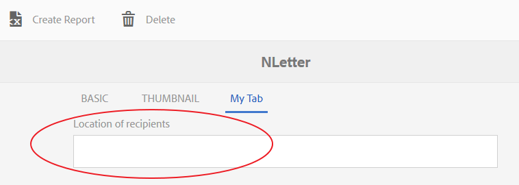

# Agregar propiedades personalizadas a los recursos de Gestión de correspondencia{#add-custom-properties-to-correspondence-management-assets}

## Información general {#overview}

Puede personalizar la interfaz de usuario de Gestión de Correspondencia y presentar a los usuarios un conjunto personalizado de propiedades y pestañas. Esta personalización incluye la adición de campos, propiedades y pestañas personalizadas a tipos/letras de recurso específicos o a todos los tipos de recursos y letras.

## Adición de propiedades personalizadas a los activos de Administración de correspondencia {#adding-custom-properties-to-correspondence-management-assets}

Los siguientes escenarios muestran cómo se pueden agregar propiedades/pestañas a los recursos y cartas de la Gestión de Correspondencia:

* Adición de una propiedad común a todos los tipos de recursos
* Adición de una pestaña común a todos los tipos de recursos
* Adición de propiedades personalizadas a tipos de recurso específicos

Al modificar las propiedades, las rutas y los valores de estos escenarios, puede agregar propiedades y pestañas personalizadas a un conjunto diferente de recursos según sus necesidades.

### Escenario: Adición de un campo común (propiedad) a todos los tipos de recursos {#scenario-adding-a-common-field-property-to-all-the-asset-types}

Este escenario muestra cómo se puede agregar una propiedad personalizada a todos los tipos de recursos (fragmentos de texto, lista, condición y diseño) y a las letras. En este escenario, se puede añadir una propiedad, Ubicación de los destinatarios, a todos los recursos y letras. La propiedad Location of recipients ayuda a identificar a qué área geográfica de entrega corresponde un recurso o una carta.

>[!NOTE]
>
>Si ya ha agregado una propiedad personalizada, la propiedad empieza a aparecer en la página de creación de recursos. Para ocultar una propiedad de este tipo, consulte Mostrar u ocultar propiedades personalizadas en las páginas Creación de recursos y Propiedades .


Complete los siguientes pasos para agregar una propiedad personalizada a todos los tipos de recursos y letras:

1. Vaya a `https://'[server]:[port]'/[ContextPath]/crx/de` e inicie sesión como administrador.
1. En la carpeta de aplicaciones, cree una carpeta denominada css con una ruta o estructura similares a la carpeta css (ubicada en la carpeta clave) siguiendo los pasos siguientes:

   1. Haga clic con el botón derecho en la carpeta de elementos de la siguiente ruta y seleccione **Nodo de superposición**:

      `/libs/fd/cm/ma/gui/content/cmmetadataproperties/commonproperties/col1/items`

      

   1. Asegúrese de que el cuadro de diálogo Nodo de superposición tiene los siguientes valores:

      **Ruta:** /libs/fd/cm/ma/gui/content/cmmetadataproperties/commproperties/col1/items

      **Ubicación:** /apps/

      **Coincidir tipos de nodo:** seleccionados

      

   1. Haga clic en **Aceptar**. La estructura de carpetas se crea en la carpeta de aplicaciones.

   1. Haga clic en **Guardar todo**.

1. En la carpeta de elementos recién creada, añada un nodo para la propiedad personalizada en todo el recurso (Ejemplo: GeoLocation) siguiendo estos pasos:

   1. Haga clic con el botón derecho en la carpeta de elementos y seleccione **Create** > **Create Node**.

      

   1. Asegúrese de que el cuadro de diálogo Crear nodo tiene los siguientes valores y haga clic en **Aceptar**:

      **Nombre:** GeoLocation (o el nombre que desea dar a esta propiedad)

      **Tipo:** nt:unstructured

      

   1. Haga clic en el nuevo nodo que ha creado (aquí GeoLocation). CRX muestra las propiedades del nodo.
   1. Agregue las siguientes propiedades al nodo (aquí GeoLocation):

      | **Nombre** | **Tipo** | **Value** |
      |---|---|---|
      | fieldLabel | Cadena | El nombre que desea dar al campo/propiedad. (Aquí: Ubicación de los destinatarios) |
      | name | Cadena | `./extendedproperties/GeoLocation` (Mantenga el mismo valor que el nombre de campo creado en el nodo elementos) |
      | renderReadOnly | Booleano | verdadero |
      | sling:resourceType | Cadena | `granite/ui/components/coral/foundation/form/textfield` |

   1. Haga clic en **Guardar todo**.

1. Para ver la personalización, pase el ratón sobre un recurso (texto, lista, condición o fragmento de diseño) o carta, haga clic en **Ver propiedades** y haga clic en **Editar**. El nuevo campo (Ubicación de los destinatarios) aparece en la pestaña Básico de las propiedades del recurso o la carta.

   >[!NOTE]
   >
   >Es posible que tenga que borrar la caché del explorador antes de que aparezca la personalización en la interfaz de usuario.

   

   >[!NOTE]
   >
   >Las propiedades comunes de todos los recursos que agregue aparecen en la pestaña básica de las propiedades del recurso. De forma predeterminada, las propiedades comunes agregadas para todos los recursos aparecen en la página de propiedades, así como en la página de creación de recursos. Para ocultar las propiedades comunes, debe <!--link to show / hide properties]-->.

### Escenario: Añadir valores y listas desplegables personalizados a una propiedad o campo personalizado {#scenario-add-custom-drop-down-and-values-to-a-custom-property-field}

Este escenario muestra cómo se puede agregar una propiedad personalizada a todos los tipos de recursos y agregarle valores desplegables.

1. Haga clic con el botón derecho en la carpeta de elementos de la siguiente ruta y seleccione **Nodo de superposición**:

   `/libs/fd/cm/ma/gui/content/cmmetadataproperties/commonproperties/col1/items`

1. En el nodo de superposición recién creado (/apps/fd/cm/ma/gui/content/cmmetadataproperties/commproperties/col1/items)
Cree un nodo para cada una de las propiedades (campos) para las que necesita crear una lista desplegable (aquí `geographicallocation`) del tipo nt:unstructured.
1. Agregue las siguientes propiedades al nodo (aquí geographicallocate) y haga clic en **Guardar todo**:

   <table>
   <tbody>
   <tr>
      <td><strong>Nombre</strong></td>
      <td><strong>Tipo</strong></td>
      <td><strong>Value</strong></td>
   </tr>
   <tr>
      <td>fieldLabel</td>
      <td>Cadena</td>
      <td>El nombre que desea dar al campo/propiedad. (Aquí: geographicallocate)</td>
   </tr>
   <tr>
      <td>name</td>
      <td>Cadena</td>
      <td>./extendedproperties/geographicallocate (Mantenga el valor igual que el nombre de campo que creó en el nodo elementos)</td>
   </tr>
   <tr>
      <td>renderReadOnly</td>
      <td>Booleano</td>
      <td>verdadero</td>
   </tr>
   <tr>
      <td>sling:resourceType</td>
      <td>Cadena</td>
      <td>granite/ui/components/coral/foundation/form/select<br /> </td>
   </tr>
   </tbody>
   </table>

1. En el nodo de propiedad (aquí asignación geográfica), agregue un nuevo nodo con el nombre `items`. Bajo el nodo items , añada un nodo cada uno para los valores de la lista desplegable. Como práctica recomendada, añada el primer nodo como en blanco para que sirva como valor predeterminado de la lista desplegable y una opción para que el usuario no especifique ningún valor para el campo. Para agregar varias opciones o valores desplegables, repita los siguientes pasos:

   1. Haga clic con el botón derecho del ratón en el nodo de propiedad (aquí geographicallocate) y seleccione **Create** > **Create Node**.
   1. Introduzca el nombre del campo como `item1,` retener tipo como nt:unstructured y haga clic en **OK**.
   1. Agregue las siguientes propiedades al nodo recién creado (aquí elemento1) y haga clic en **Guardar todo**:

      <table>
         <tbody>
         <tr>
          <td><strong>Nombre</strong></td>
          <td><strong>Tipo</strong></td>
          <td><strong>Valor</strong></td>
         </tr>
         <tr>
          <td>text</td>
          <td>Cadena</td>
          <td>Este es el valor de la opción desplegable que es visible para el usuario. Manténgalo en blanco para el valor en blanco (predeterminado) o introduzca el valor, como <strong>Internacional</strong> o <strong>En EE. UU.</strong>.<br /> </td>
         </tr>
         <tr>
          <td>seleccionado</td>
          <td>Cadena</td>
          <td>Valor almacenado en CRXDE para el texto. Escriba cualquier palabra clave única. <br /> </td>
         </tr>
         </tbody>
   </table>

   

La lista desplegable personalizada aparece de la siguiente manera en las propiedades de los recursos:


### Escenario: Pestaña común para todos los tipos de recursos {#scenario-common-tab-for-all-asset-types}

Este escenario muestra cómo se puede agregar una pestaña personalizada, Recipients, a todos los tipos de recursos (fragmentos de texto, lista, condición y diseño) y a las letras. En la pestaña Recipients puede planificar la colocación de todas las propiedades personalizadas relevantes para los destinatarios.


Con el procedimiento siguiente, puede añadir una pestaña con un campo a todos los recursos:

1. Vaya a `https://'[server]:[port]'/[ContextPath]/crx/de` e inicie sesión como administrador.
1. En la carpeta de aplicaciones, cree una carpeta denominada cmmetadataproperties con una ruta o estructura similares a la carpeta cmmetadataproperties (ubicada en la carpeta de contenido) siguiendo estos pasos:

   1. Haga clic con el botón derecho en la carpeta cmmetadataproperties en la siguiente ruta y seleccione **Overlay Node**:

      `/libs/fd/cm/ma/gui/content/cmmetadataproperties`

      

   1. Asegúrese de que el cuadro de diálogo Nodo de superposición tiene los siguientes valores:

      **Ruta:** /libs/fd/cm/ma/gui/content/cmmetadataproperties

      **Ubicación:** /apps/

      **Coincidir tipos de nodo:** seleccionados

   1. Haga clic en **Aceptar**. La estructura de carpetas se crea en la carpeta de aplicaciones.

      

      Haga clic en **Guardar todo**.

1. En la carpeta cmmetadataproperties , agregue un nodo para crear una pestaña personalizada para todos los recursos (Ejemplo: pestaña común) siguiendo estos pasos:

   1. Haga clic con el botón derecho en la carpeta cmmetadataproperties y seleccione **Create** > **Create Node**.

      

   1. Asegúrese de que el cuadro de diálogo Crear nodo tiene los siguientes valores y haga clic en **Aceptar**:

      **Nombre:** pestaña común (o el nombre que desea dar a esta propiedad)

      **Tipo:** nt:unstructured

   1. Haga clic en el nuevo nodo que ha creado (aquí pestaña de uso común). CRX muestra las propiedades del nodo.
   1. Agregue las siguientes propiedades al nodo (aquí pestaña de elementos comunes):

      <table>
         <tbody>
         <tr>
          <td><strong>Nombre</strong></td>
          <td><strong>Tipo</strong></td>
          <td><strong>Valor</strong></td>
         </tr>
         <tr>
          <td>jcr:title</td>
          <td>Cadena</td>
          <td>El nombre que desea dar a la columna. (Aquí: Recipients)</td>
         </tr>
         <tr>
          <td>sling:resourceType</td>
          <td>Cadena</td>
          <td>granite/ui/components/coral/foundation/container<br /> </td>
   </tr>
         </tbody>
       </table>

   1. Haga clic en **Guardar todo**.

1. Para el nodo de pestañas creado en el último paso (aquí, pestaña Common), cree un nodo llamado item siguiendo el siguiente paso:

   1. Haga clic con el botón derecho del ratón en el nodo correspondiente (aquí pestaña de uso común) y seleccione **Crear** > **Crear nodo**.
   1. Asegúrese de que el cuadro de diálogo Crear nodo tiene los siguientes valores y haga clic en **Aceptar**:

      **Nombre:** elementos

      **Tipo:** nt:unstructured

   1. Haga clic en **Guardar todo:**

1. En el nodo de elementos que creó en el paso anterior (en la pestaña de elementos comunes), añada un nodo para crear una columna (aquí Columna1) en la pestaña personalizada (pestaña de elementos comunes) siguiendo los pasos siguientes (para agregar más columnas, repita este paso):

   1. Haga clic con el botón derecho en el nodo elementos y seleccione **Create** > **Create Node**.
   1. Asegúrese de que el cuadro de diálogo Crear nodo tiene los siguientes valores y haga clic en **Aceptar**:

      **Nombre:** Columna1 (o el nombre que desee asignar al nodo; este nombre no aparece en la interfaz de usuario).

      **Tipo:** nt:unstructured

   1. Agregue la siguiente propiedad al nodo (Columna1 aquí) y haga clic en **Guardar todo**:

      <table>
         <tbody>
         <tr>
           <td><strong>Nombre</strong></td>
           <td><strong>Tipo</strong></td>
           <td><strong>Valor</strong></td>
         </tr>
         <tr>
           <td>sling:resourceType</td>
           <td>Cadena</td>
           <td>granite/ui/components/coral/foundation/container<br /> </td>
         </tr>
         </tbody>
       </table>

1. En el nodo creado en el paso anterior (aquí Columna1), agregue un nodo denominado elementos siguiendo los pasos siguientes:

   1. Haga clic con el botón derecho en el nodo (aquí Columna1) y seleccione **Crear** > **Crear nodo**.
   1. Asegúrese de que el cuadro de diálogo Crear nodo tiene los siguientes valores y haga clic en **Aceptar**:

      **Nombre:** elementos

      **Tipo:** nt:unstructured

   1. Haga clic en **Guardar todo**.

1. Para crear un campo en la pestaña personalizada (aquí Recipients), agregue un nodo (aquí GeographicLocation). Esta propiedad corresponde a la columna que ha creado. Siga estos pasos para crear el campo (para crear más campos/nodos, repita estos pasos).:

   1. Haga clic con el botón derecho en el nodo elementos y seleccione **Create** > **Create Node**.
   1. Asegúrese de que el cuadro de diálogo Crear nodo tiene los siguientes valores y haga clic en **Aceptar**:

      **Nombre:** GeographicLocation (u otro nombre para la propiedad field)

      **Tipo:** nt:unstructured

   1. Agregue las siguientes propiedades al nodo de campo (aquí Ubicación geográfica) y haga clic en **Guardar todo**.

      | **Nombre** | **Tipo** | **Valor** |
      |---|---|---|
      | fieldLabel | Cadena | Ubicación de los destinatarios (o el nombre que desea dar al campo ). |
      | name | Cadena | ./extendedproperties/GeographicLocation |
      | renderReadOnly | Booleano | verdadero |
      | sling:resourceType | Cadena | `/libs/granite/ui/components/coral/foundation/form/textfield` |

1. Para agregar esta ficha para cartas, cree una carpeta de superposición con una ruta o estructura similar a la siguiente carpeta de elementos en la siguiente ruta:

   `/libs/fd/cm/ma/gui/content/cmmetadataproperties/properties/letter/items/tabs/items`

   Para crear superposición para una letra o un recurso diferente, utilice la siguiente ruta reemplazando [assettype] por texto, condición, lista, adictivo o fragmento:

   `/libs/fd/cm/ma/gui/content/cmmetadataproperties/properties/[assettype]/items/tabs/items`

   1. Haga clic con el botón derecho en la carpeta de elementos de la siguiente ruta y seleccione **Nodo de superposición**:

      `/libs/fd/cm/ma/gui/content/cmmetadataproperties/properties/letter/items/tabs/items`

   1. Asegúrese de que el cuadro de diálogo Nodo de superposición tiene los siguientes valores:

      **Ruta:** `/libs/fd/cm/ma/gui/content/cmmetadataproperties/properties/letter/items/tabs/items`

      **Ubicación:** /apps/

      **Coincidir tipos de nodo:** seleccionados

   1. Haga clic en **Aceptar**. Se crea la carpeta. Haga clic en **Guardar todo**.

1. En la carpeta de elementos recién creada, añada un nodo para la pestaña personalizada en el recurso (aquí mytab - este nombre no aparece en la interfaz de usuario) siguiendo los pasos siguientes:

   1. Haga clic con el botón derecho en la carpeta de elementos y seleccione **Create** > **Create Node**.
   1. Asegúrese de que el cuadro de diálogo Crear nodo tiene los siguientes valores y haga clic en **Aceptar**:

      **Nombre:** mytab (o el nombre que desea dar a esta propiedad)

      **Tipo:** nt:unstructured

   1. Haga clic en el nuevo nodo que ha creado (aquí mytab). CRX muestra las propiedades del nodo.
   1. Agregue las dos propiedades siguientes al nodo (pestaña customtab ):

      <table>
         <tbody>
         <tr>
           <td><strong>Nombre</strong></td>
           <td><strong>Tipo</strong></td>
           <td><strong>Valor</strong></td>
         </tr>
         <tr>
           <td>path<br /> </td>
           <td>Cadena</td>
           <td>fd/cm/ma/gui/content/cmmetadataproperties/commtab<br /> </td>
         </tr>
         <tr>
           <td>sling:resourceType</td>
           <td>Cadena</td>
           <td>granite/ui/components/coral/foundation/include<br /> </td>
         </tr>
         </tbody>
       </table>

   1. Haga clic en **Guardar todo**.

1. Para ver la personalización, pase el ratón sobre el recurso correspondiente (aquí una carta), haga clic en Ver propiedades y haga clic en **Editar**. La nueva pestaña (Recipients) y el campo (Location of Recipients) aparecen en la interfaz de usuario.

   >[!NOTE]
   >
   >Es posible que tenga que borrar la caché del explorador antes de que aparezca la personalización en la interfaz de usuario.

   

### Escenario: Adición de propiedades personalizadas para tipos de recursos específicos {#scenario-adding-custom-properties-for-specific-asset-types}

Este escenario muestra cómo se puede agregar una propiedad a un tipo de recurso concreto, como un campo a todos los recursos de texto. Con este proceso, puede añadir propiedades a una de las siguientes opciones:

* Texto
* Condición
* Lista
* Fragmento de diseño
* Diccionario de datos
* Carta

Por ejemplo, solo para los recursos de texto, se desea añadir una propiedad, Ubicación de los destinatarios, para identificar a qué área geográfica es relevante un recurso.  

Para agregar una propiedad a un tipo de recurso, complete los siguientes pasos:

1. Vaya a `https://'[server]:[port]'/[ContextPath]/crx/de` e inicie sesión como administrador.
1. Para crear una pestaña en un tipo de recurso (como Texto), cree la siguiente estructura de carpetas en la carpeta de aplicaciones:

   `/libs/fd/cm/ma/gui/content/cmmetadataproperties/properties/[AssetType]/items/tabs/items`

   [AssetType]  = texto, condición, lista, carta, adictivo o fragmento

   A continuación se indican los pasos para crear esta estructura de carpetas:

   1. Haga clic con el botón derecho en la carpeta de elementos de la siguiente ruta y seleccione **Nodo de superposición**:

      `/libs/fd/cm/ma/gui/content/cmmetadataproperties/properties/[AssetType]/items/tabs/items`

      Por ejemplo, si desea crear una propiedad para recursos de texto, seleccione la siguiente carpeta:

      `/libs/fd/cm/ma/gui/content/cmmetadataproperties/properties/text/items/tabs/items`

      

   1. Asegúrese de que el cuadro de diálogo Nodo de superposición tiene los siguientes valores:

      **Ruta:** /libs/fd/cm/ma/gui/content/cmmetadataproperties/[AssetType]/items/tabs/items

      **Ubicación:** /apps/

      **Coincidir tipos de nodo:** seleccionados

   1. Haga clic en **Aceptar**. La estructura de carpetas se crea en la carpeta de aplicaciones.

      Haga clic en **Guardar todo**.

1. En la carpeta de elementos recién creada, añada un nodo para la pestaña personalizada en el recurso (Ejemplo: customtab) siguiendo estos pasos:

   1. Haga clic con el botón derecho en la carpeta de elementos y seleccione **Create** > **Create Node**.
   1. Asegúrese de que el cuadro de diálogo Crear nodo tiene los siguientes valores y haga clic en **Aceptar**:

      **Nombre:** customtab (o el nombre que desea dar a esta propiedad)

      **Tipo:** nt:unstructured

   1. Haga clic en el nuevo nodo que ha creado (aquí customtab). CRX muestra las propiedades del nodo.
   1. Agregue las dos propiedades siguientes al nodo (pestaña customtab ):

      | **Nombre** | **Tipo** | **Valor** |
      |---|---|---|
      | sling:resourceType | Cadena | granite/ui/components/coral/foundation/container |
      | jcr:title | Cadena | El nombre del campo en la interfaz de usuario (aquí My tab) |

   1. Haga clic en **Guardar todo**.

1. En el nodo que ha creado en el paso anterior (aquí customtab), añada un nodo denominado items siguiendo los pasos siguientes:

   1. Haga clic con el botón derecho del ratón en el nodo (aquí customtab) y seleccione **Create** > **Create Node**.
   1. Asegúrese de que el cuadro de diálogo Crear nodo tiene los siguientes valores y haga clic en **Aceptar**:

      **Nombre:** elementos

      **Tipo:** nt:unstructured

   1. Haga clic en **Guardar todo**.

1. En el nodo de elementos que creó en el paso anterior (en la pestaña de personalización), añada un nodo para crear una columna (aquí Columna1) en la pestaña personalizada siguiendo los pasos siguientes (para añadir más columnas, repita este paso):

   1. Haga clic con el botón derecho en el nodo elementos y seleccione **Create** > **Create Node**.
   1. Asegúrese de que el cuadro de diálogo Crear nodo tiene los siguientes valores y haga clic en **Aceptar**:

      **Nombre:** Columna1 (o el nombre que desee asignar al nodo)

      **Tipo:** nt:unstructured

   1. Agregue la siguiente propiedad al nodo (Columna1 aquí) y haga clic en **Guardar todo**.

      <table>
         <tbody>
         <tr>
           <td><strong>Nombre</strong></td>
           <td><strong>Tipo</strong></td>
           <td><strong>Valor</strong></td>
         </tr>
         <tr>
           <td>sling:resourceType</td>
           <td>Cadena</td>
           <td>granite/ui/components/coral/foundation/container<br /> </td>
         </tr>
         </tbody>
       </table>

1. Para cada columna que cree (como se especifica en el paso anterior - aquí Columna1), cree un nodo llamado elemento siguiendo los pasos siguientes:

   1. Haga clic con el botón derecho en el nodo de columna correspondiente (aquí Columna1) y seleccione **Crear** > **Crear nodo**.
   1. Asegúrese de que el cuadro de diálogo Crear nodo tiene los siguientes valores y haga clic en **Aceptar**:

      **Nombre:** elementos

      **Tipo:** nt:unstructured

   1. Haga clic en **Guardar todo:**

1. Para cada una de las columnas creadas, cree un nodo en el nodo items para crear un campo en la nueva pestaña de la interfaz de usuario. Repita este paso para crear más campos en la columna :

   1. Haga clic con el botón derecho en el nodo correspondiente (aquí elementos en Columna1) y seleccione **Crear** > **Crear nodo**.
   1. Asegúrese de que el cuadro de diálogo Crear nodo tiene los siguientes valores y haga clic en **Aceptar**:

      **Nombre:** El nombre que elija (aquí GeoLocation).

      **Tipo:** nt:unstructured

   1. Agregue las siguientes propiedades al nodo y haga clic en **Guardar todo**.

      | **Nombre** | **Tipo** | **Valor** |
      |---|---|---|
      | fieldLabel | Cadena | Ubicación de los destinatarios (o el nombre que desea dar al campo ). |
      | name | Cadena | `./extendedproperties/GeoLocation` |
      | renderReadOnly | Booleano | verdadero |
      | sling:resourceType | Cadena | granite/ui/components/coral/foundation/form/textfield |

1. Para ver la personalización, pase el ratón sobre el recurso correspondiente (aquí un texto), haga clic en Ver propiedades y haga clic en **Editar**. La nueva pestaña y campo (Ubicación de los destinatarios) aparecen en la interfaz de usuario.

   >[!NOTE]
   >
   >Es posible que tenga que borrar la caché del explorador antes de que aparezca la personalización en la interfaz de usuario.

   

### Mostrar propiedades personalizadas en la página de creación de recursos {#display-custom-properties-on-the-asset-creation-page}

De forma predeterminada, las propiedades personalizadas agregadas a las pestañas nuevas solo son visibles en la página de propiedades y no en la página de creación de recursos, ya que la página de creación de recursos no tiene presentación de pestañas. Para mostrar las propiedades personalizadas en la página de creación de recursos junto con otras propiedades, debe hacer lo siguiente:

1. Haga clic con el botón derecho en la carpeta de elementos de la siguiente ruta y seleccione **Nodo de superposición**:

   `/libs/fd/cm/ma/gui/content/createasset/createletter/jcr:content/body/items/form/items/letterWizard/items/properties/items/properties/items/letterproperties/items`

1. Asegúrese de que el cuadro de diálogo Nodo de superposición tiene los siguientes valores, por letra. Para otros tipos de recursos, la ruta se indica en la siguiente tabla:

   **Ruta:** /libs/fd/cm/ma/gui/content/createasset/createlter/jcr:content/body/items/form/items/letterWizard/items/properties/items/properties/properties/items/letterproperties/items

   **Ubicación:** /apps/

   **Coincidir tipos de nodo:** seleccionados

   Según el tipo de recurso, la ruta debe ser la siguiente:

   | **Tipo de recurso/documento** | **Ruta que se agregará** |
   |---|---|
   | Texto | /libs/fd/cm/ma/gui/content/createasset/createtext/jcr:content/body/items/form/items/textwizard/items/editproperties/items/properties/items/tabs/items/tab1/items |
   | Lista | /libs/fd/cm/ma/gui/content/createasset/createlist/jcr:content/body/items/form/items/listwizard/items/editproperties/items/properties/properties/items/tabs/items/tab1/items |
   | Condición | /libs/fd/cm/ma/gui/content/createasset/createcondition/jcr:content/body/items/form/items/conditionwizard/items/editproperties/items/properties/properties/items/tabs/items/tab1/items |
   | Fragmento | /libs/fd/cm/ma/gui/content/createasset/createfragment/jcr:content/body/items/form/items/fragmentwizard/items/properties/items/properties/properties/items/tabs2/items/tab1/items |
   | Carta | /libs/fd/cm/ma/gui/content/createasset/createletter/jcr:content/body/items/form/items/letter/Wizard/items/properties/items/properties/items/letterproperties/items |

1. Haga clic en **Aceptar**. La estructura de carpetas se crea en la carpeta de aplicaciones.

1. En el nodo de elementos de superposición que ha creado, cree un nodo del nombre col4 (o cualquier otro nombre) y haga clic en **Guardar todo**.

   Por ejemplo, a continuación se muestra el nodo de superposición creado para las letras.

   `/apps/fd/cm/ma/gui/content/createasset/createletter/jcr:content/body/items/form/items/letterWizard/items/properties/items/properties/items/letterproperties/items`

1. Agregue las siguientes propiedades al nodo recién creado (aquí col4) y haga clic en **Guardar todo**:

<table>
 <tbody>
  <tr>
   <td><strong>Nombre</strong></td>
   <td><strong>Tipo</strong></td>
   <td><strong>Valor</strong></td>
  </tr>
  <tr>
   <td>path</td>
   <td>Cadena</td>
   <td><p>Esta ruta es el puntero a la columna creada en:</p>
    <ul>
     <li>Para la ficha común de todos los tipos de recursos: /apps/fd/cm/ma/gui/content/cmmetadataproperties/commtab/items/col1</li>
     <li>Para diferentes propiedades para diferentes tipos de recursos: /apps/fd/cm/ma/gui/content/cmmetadataproperties/properties/items/tabs/items/customtab/items/col1</li>
    </ul> </td>
  </tr>
  <tr>
   <td>sling:resourceType</td>
   <td>Cadena</td>
   <td> granite/ui/components/coral/foundation/include<br /> </td>
  </tr>
 </tbody>
</table>


Propiedad personalizada, Idioma, que aparece en la interfaz de usuario para crear una carta

## Personalice la vista de lista para mostrar propiedades personalizadas {#customize-the-list-view-to-show-custom-properties}

Después de agregar una propiedad personalizada a los recursos de Gestión de correspondencia, debe realizar más cambios en CRX/DE para asegurarse de que la propiedad personalizada se muestre en la interfaz de usuario de Administración de correspondencia.

Complete los siguientes pasos para mostrar la propiedad personalizada en la interfaz de usuario de la lista de activos de la Gestión de correspondencia:

1. Vaya a `https://'[server]:[port]'/[ContextPath]/crx/de` e inicie sesión como administrador.
1. Cree la siguiente estructura de carpetas en la carpeta de aplicaciones:

   `/libs/fd/cm/ma/gui/content/cmassets/jcr:content/views/lists/columns`

   A continuación se indican los pasos para crear esta estructura de carpetas:

   1. Haga clic con el botón derecho en la carpeta de columnas en la siguiente ruta y seleccione **Nodo de superposición**:

      `/libs/fd/cm/ma/gui/content/cmassets/jcr:content/views/lists/columns`

   1. Asegúrese de que el cuadro de diálogo Nodo de superposición tiene los siguientes valores:

      **Ruta:** /libs/fd/cm/ma/gui/content/massets/jcr:content/views/lists/columns

      **Ubicación:** /apps/

      **Coincidir tipos de nodo:** seleccionados

   1. Haga clic en **Aceptar**. La estructura de carpetas se crea en la carpeta de aplicaciones.

      Haga clic en **Guardar todo**.

1. Para cada una de las propiedades creadas, cree un nodo en el nodo columns para crear una columna en la interfaz de usuario. Repita este paso para crear más columnas en la interfaz de usuario:

   1. Haga clic con el botón derecho en el nodo (columnas) correspondiente y seleccione **Crear** > **Crear nodo**.
   1. Asegúrese de que el cuadro de diálogo Crear nodo tiene los siguientes valores y haga clic en **Aceptar**:

      **Nombre:** El nombre que elija (en GeographicLocation).

      **Tipo:** nt:unstructured

   1. Agregue las siguientes propiedades al nodo y haga clic en **Guardar todo**.

      <table>
         <tbody>
         <tr>
           <td><strong>Nombre</strong></td>
           <td><strong>Tipo</strong></td>
           <td><strong>Valor</strong></td>
         </tr>
         <tr>
           <td>jcr:primaryType</td>
           <td>Nombre</td>
           <td><p>nt:unstructured</p> </td>
         </tr>
         <tr>
           <td>jcr:title</td>
           <td>Cadena</td>
           <td><p>Ubicación geográfica</p> <p>Este valor aparece como el encabezado de columna en la interfaz de usuario. </p> </td>
         </tr>
         <tr>
           <td>ordenable</td>
           <td>Booleano</td>
           <td><p>verdadero</p> <p>Un valor de true significa que el usuario puede ordenar los valores de esta columna. </p> </td>
         </tr>
         </tbody>
       </table>

1. Cree la siguiente estructura de carpetas en la carpeta de aplicaciones:

   `/libs/fd/cm/ma/gui/components/admin/childpagerenderer/childlistpage`

   A continuación se indican los pasos para crear esta estructura de carpetas:

   1. Haga clic con el botón derecho en la carpeta de columnas en la siguiente ruta y seleccione **Nodo de superposición**:

      `/libs/fd/cm/ma/gui/components/admin/childpagerenderer/childlistpage`

   1. Asegúrese de que el cuadro de diálogo Nodo de superposición tiene los siguientes valores:

      **Ruta:** /libs/fd/cm/ma/gui/components/admin/child/pagerenderer/child-page

      **Ubicación:** /apps/

      **Coincidir tipos de nodo:** seleccionados

   1. Haga clic en **Aceptar**. La estructura de carpetas se crea en la carpeta de aplicaciones.

      Haga clic en **Guardar todo**.

1. Copie el archivo childPage.jsp desde la siguiente ubicación:

   /libs/fd/cm/ma/gui/components/admin/childpagerenderer/childlistpage/childlistpage.jsp

   Pegue el archivo en la siguiente ubicación:

   /apps//fd/cm/ma/gui/components/admin/child/pagerenderer/childPage/.

1. Abra el archivo childpage.jsp (/apps/fd/cm/ma/gui/components/admin/childpagerenderer/childlistpage/childlistpage.jsp) y realice los cambios siguientes:

   1. Agregue lo siguiente a la línea 19 del archivo (después de la declaración de copyright).

      ```jsp
      <%@page import="java.util.Map"%>
      ```

   1. Agregue el siguiente código de una función que obtenga valor para cada propiedad personalizada al final del archivo:

      ```jsp
      <%!
          private String getCustomPropertyValue(Map<String, Object> extendedProperties, String propertyName) {
      
              String propertyValue = "";
              if (extendedProperties.containsKey(propertyName)) {
                  propertyValue = (String) extendedProperties.get(propertyName);
              }
      
              return propertyValue;
          }
      %>
      ```

   1. Añada lo siguiente antes del inicio de la etiqueta &lt;tr> (&lt;tr &lt;%= atraer.build() %>):

      ```jsp
      <%
          String GeoLocation = "";
          if (asset != null) {
                  Map<String, Object> extendedProperties = asset.getExtendedProperties();
                  if (extendedProperties != null) {
                      GeoLocation = getCustomPropertyValue(extendedProperties,"GeoLocation");
                  }
          }
      %>
      ```

      En el código, GeoLocation es el valor que se establece en la propiedad name al crear el nodo o campo personalizado. Al crear un nodo o campo personalizado, ha especificado el nombre de la propiedad con ./extendedproperties/ prefix: ./extendedproperties/GeoLocation. En el código, el prefijo no es obligatorio.

   1. Para mostrar la nueva propiedad en la interfaz de usuario, agregue una etiqueta TD como se muestra a continuación antes de la etiqueta de cierre (&lt;/tr>):

      ```jsp
      <td is="coral-td" value="<%= xssAPI.encodeForHTMLAttr(geographicalLocation) %>"><%= xssAPI.encodeForHTML(geographicalLocation) %></td>
      ```

      Para agregar más columnas, repita los pasos 6.3 y 6.4.

   1. Haga clic en **Guardar todo**.

1. Para ver la personalización, abra la vista de lista de fragmentos de documento o las letras en las que haya añadido la propiedad personalizada.

   La columna UI y la propiedad añadidas en este procedimiento se muestran para todos los tipos de recursos. Sin embargo, los valores de estas propiedades se pueden introducir y mostrar solo para los tipos de recurso para los que añadió originalmente la propiedad personalizada.

   Por ejemplo, con el escenario: Si agrega propiedades personalizadas para tipos de recurso específicos, agregue una propiedad personalizada a recursos de texto, solo podrá especificar propiedades personalizadas a recursos de texto. Sin embargo, si muestra esa propiedad personalizada en la interfaz de usuario, aparecerá la columna para todos los tipos de recursos.

   

1. (Opcional) De forma predeterminada, la nueva columna aparece como la última columna de la interfaz de usuario. Para que la columna aparezca en una posición específica, agregue la siguiente propiedad al nodo de columna:

<table>
 <tbody>
  <tr>
   <td><strong>Nombre</strong></td>
   <td><strong>Tipo</strong></td>
   <td><strong>Valor</strong></td>
  </tr>
  <tr>
   <td>sling:orderBefore</td>
   <td>Cadena</td>
   <td><p>El nombre del nodo de columna en la ruta "/libs/fd/cm/ma/gui/content/massets/jcr:content/views/list/columns" antes del cual debe aparecer una columna personalizada en la interfaz de usuario.</p> <p>En este caso, si desea que la columna Ubicación geográfica aparezca antes (a la izquierda) de la columna Versión , añada la propiedad sling:orderBefore al nodo GeoLocation en la ruta ""/apps/fd/cm/ma/gui/content/massets/jcr:content/views/list/columns/GeoLocation" y establezca el valor de la propiedad en versión.</p> </td>
  </tr>
 </tbody>
</table>

Cuando agregue la propiedad sling:orderBefore para especificar la ubicación de la columna, también deberá actualizar el orden de la etiqueta &lt;td> correspondiente especificada en el paso 6.4 de este procedimiento. Por ejemplo, en este caso, debe asegurarse de que la etiqueta &lt;td> de Ubicación geográfica se coloca antes de la etiqueta &lt;td> de la columna Versión:

```xml
<td is="coral-td" value="<%= xssAPI.encodeForHTMLAttr(geographicalLocation) %>"><%= xssAPI.encodeForHTML(geographicalLocation) %></td>
<td is="coral-td" value="<%= xssAPI.encodeForHTMLAttr(version) %>"><%= xssAPI.encodeForHTML(version) %></td>
```

## Habilitar la búsqueda de propiedades personalizadas {#enable-search-for-custom-properties}

De forma predeterminada, la búsqueda de texto completo no incluye propiedades personalizadas que se agregan a la interfaz de usuario mediante CRX/DE.

Para incluir las propiedades personalizadas en la búsqueda, debe permitir la indexación de propiedades personalizadas.

Para permitir la indexación de propiedades personalizadas, complete los siguientes pasos:

1. Vaya a `https://'[server]:[port]'/[ContextPath]/crx/de` e inicie sesión como administrador.
1. Vaya a `/oak:index/cmLucene`y añada un nodo denominado **agregados** debajo de él.

   1. Haga clic con el botón derecho en la carpeta cmLucene y seleccione **Create** > **Create Node**.
   1. Asegúrese de que el cuadro de diálogo Crear nodo tiene los siguientes valores y haga clic en **Aceptar**:

      **Nombre:** agregados

      **Tipo:** nt:unstructured

   1. Haga clic en **Guardar todo**.

1. En la carpeta de agregados recién creada, añada un nodo cm:resource. Y en cm:resource, agregue un nodo llamado include0.

   1. Haga clic con el botón derecho en la carpeta agregados y seleccione **Crear** > **Crear nodo**. Asegúrese de que el cuadro de diálogo Crear nodo tiene los siguientes valores y haga clic en **Aceptar**:

      **Nombre:** cm:resource

      **Tipo:** nt:unstructured

   1. Haga clic con el botón derecho en la carpeta cm:resource y seleccione **Create** > **Create Node**. Asegúrese de que el cuadro de diálogo Crear nodo tiene los siguientes valores y haga clic en **Aceptar**:

      **Nombre:** include0

      **Tipo:** nt:unstructured

   1. Haga clic en el nuevo nodo que ha creado (aquí include0). CRX muestra las propiedades del nodo.
   1. Agregue la siguiente propiedad al nodo (aquí include0):

      <table>
         <tbody>
         <tr>
           <td><strong>Nombre</strong></td>
           <td><strong>Tipo</strong></td>
           <td><strong>Valor</strong></td>
         </tr>
         <tr>
           <td>ruta</td>
           <td>Cadena</td>
           <td>ExtendedProperties<br /> </td>
         </tr>
         </tbody>
       </table>

   1. Haga clic en **Guardar todo**.

1. Vaya a propiedades en la siguiente ubicación y añada una ubicación de nodo debajo de ella: `/oak:index/cmLucene/indexRules/cm:resource/properties`

   Repita este paso para cada una de las propiedades personalizadas que desee agregar a la búsqueda.

   1. Haga clic con el botón derecho en la carpeta de propiedades y seleccione **Create** > **Create Node**.
   1. Asegúrese de que el cuadro de diálogo Crear nodo tiene los siguientes valores y haga clic en **Aceptar**:

      **Nombre:** ubicación (o el nombre de la propiedad personalizada que desea agregar a la búsqueda)

      **Tipo:** nt:unstructured

   1. Haga clic en el nuevo nodo que ha creado (aquí ubicación). CRX muestra las propiedades del nodo.
   1. Agregue las siguientes propiedades al nodo (aquí ubicación):

      | **Nombre** | **Tipo** | **Valor** |
      |---|---|---|
      | analizado | Cadena | verdadero |
      | name | Cadena | ExtendedProperties/location (o el nombre de la propiedad que desea agregar a la búsqueda) |
      | propertyIndex | Booleano | verdadero |
      | useInSusel | Booleano | verdadero |

   1. Haga clic en **Guardar todo**.

1. Ahora puede utilizar valores de propiedad personalizados en la búsqueda de texto completo para localizar los recursos relevantes.

>[!NOTE]
>
>Si todavía no puede buscar, puede deberse a un problema de indexación. Para volver a indexar, vaya al nodo siguiente y cambie el valor de la propiedad &quot;re-index&quot; a true:
>
>/oak:index/cmLucene&quot; y cambiar el valor de la propiedad

## Cambiar la vista predeterminada de la página de búsqueda {#change-default-view-of-the-search-page}

1. Vaya a `https://'[server]:[port]'/[ContextPath]/crx/de` e inicie sesión como administrador.
1. En la carpeta de aplicaciones, cree una carpeta denominada list con una ruta/estructura similar a la carpeta de lista ubicada en /libs/granite/ui/content/shell/omnisearch/searchresults/singlerresults/views:

   1. Haga clic con el botón derecho en la carpeta de elementos de la siguiente ruta y seleccione **Nodo de superposición**:

      `/libs/granite/ui/content/shell/omnisearch/searchresults/singleresults/views/list`

   1. Asegúrese de que el cuadro de diálogo Nodo de superposición tiene los siguientes valores:

      **Ruta:** /libs/granite/ui/content/shell/omnisearch/searchresults/singlerresults/views/list

      **Ubicación:** /apps/

      **Coincidir tipos de nodo:** seleccionados

   1. Haga clic en **Aceptar**. La estructura de carpetas se crea en la carpeta de aplicaciones.

   1. Haga clic en **Guardar todo**.

1. En el nodo recién creado, añada la siguiente propiedad y haga clic en **Guardar todo**:

   <table>
   <tbody>
   <tr>
      <td><strong>Nombre</strong></td>
      <td><strong>Tipo</strong></td>
      <td><strong>Valor</strong></td>
   </tr>
   <tr>
      <td>sling:orderBefore<br /> </td>
      <td>Cadena</td>
      <td>tarjeta</td>
   </tr>
   </tbody>
   </table>

1. La personalización muestra los resultados de búsqueda en la vista de lista para todas las consolas, incluidas Forms y Documentos, Recursos y Sitios.

## Cambiar la vista predeterminada de la página de activos {#change-default-view-of-the-assets-page}

>[!NOTE]
>
>Estos pasos cambian la vista predeterminada de todas las consolas, como Forms y Documentos, Recursos y Sitios.

1. Vaya a `https://'[server]:[port]'/[ContextPath]/crx/de` e inicie sesión como administrador.
1. En la carpeta de aplicaciones, cree una carpeta denominada list con una ruta o estructura similares a la carpeta de lista ubicada en:

   /libs/fd/cm/ma/gui/content/massets/jcr:content/views/

   1. Haga clic con el botón derecho en la carpeta de elementos de la siguiente ruta y seleccione **Nodo de superposición**:

      `/libs/fd/cm/ma/gui/content/cmassets/jcr:content/views/list`

   1. Asegúrese de que el cuadro de diálogo Nodo de superposición tiene los siguientes valores:

      **Ruta:** /libs/fd/cm/ma/gui/content/massets/jcr:content/views/list

      **Ubicación:** /apps/

      **Coincidir tipos de nodo:** seleccionados

   1. Haga clic en **Aceptar**. La estructura de carpetas se crea en la carpeta de aplicaciones.

   1. Haga clic en **Guardar todo**.

1. En el nodo recién creado, añada la siguiente propiedad y haga clic en **Guardar todo**:

   <table>
   <tbody>
   <tr>
      <td><strong>Nombre</strong></td>
      <td><strong>Tipo</strong></td>
      <td><strong>Valor</strong></td>
   </tr>
   <tr>
      <td>sling:orderBefore<br /> </td>
      <td>Cadena</td>
      <td>tarjeta</td>
   </tr>
   </tbody>
   </table>

1. Borre las cookies del explorador o utilice el modo incógnito del explorador para ver los recursos. De forma predeterminada, la página de recursos aparece en el diseño de la tarjeta.

## Mostrar u ocultar propiedades personalizadas en las páginas Creación de recursos y Propiedades {#show-hide-custom-properties-on-asset-creation-and-properties-pages}

Para mostrar u ocultar las propiedades personalizadas, complete los siguientes pasos:

1. En el nodo de propiedad personalizada, como asignación geográfica, cree un nuevo nodo con el nombre &quot;granite:rendercondition&quot; de tipo &quot;nt:unstructured&quot;.
1. Agregue la siguiente propiedad al nodo y haga clic en **Guardar todo**:

   <table>
   <tbody>
   <tr>
      <td><strong>Nombre</strong></td>
      <td><strong>Tipo</strong></td>
      <td><strong>Valor</strong></td>
   </tr>
   <tr>
      <td>sling:resourceType<br /> </td>
      <td>Cadena</td>
      <td>fd/cm/ma/gui/components/admin/assetsproperties/custompropertyconfig<br /> </td>
   </tr>
   </tbody>
   </table>

1. Para ocultar esta propiedad en la página de creación de recursos, añada la siguiente propiedad y haga clic en **Guardar todo**:

   <table>
   <tbody>
   <tr>
      <td><strong>Nombre</strong></td>
      <td><strong>Tipo</strong></td>
      <td><strong>Valor</strong></td>
   </tr>
   <tr>
      <td>hideOnCreate<br /> </td>
      <td>Booleano</td>
      <td>verdadero<br /> </td>
   </tr>
   </tbody>
   </table>

1. Para ocultar la propiedad personalizada en la página de propiedades de los recursos, añada la siguiente propiedad y haga clic en **Guardar todo**:

   <table>
   <tbody>
   <tr>
      <td><strong>Nombre</strong></td>
      <td><strong>Tipo</strong></td>
      <td><strong>Valor</strong></td>
   </tr>
   <tr>
      <td>hideOnEdit<br /> </td>
      <td>Booleano</td>
      <td>verdadero<br /> </td>
   </tr>
   </tbody>
   </table>

   Para volver a mostrar los valores, restablezca los valores de propiedad en `false` o elimine las entradas de propiedad.
