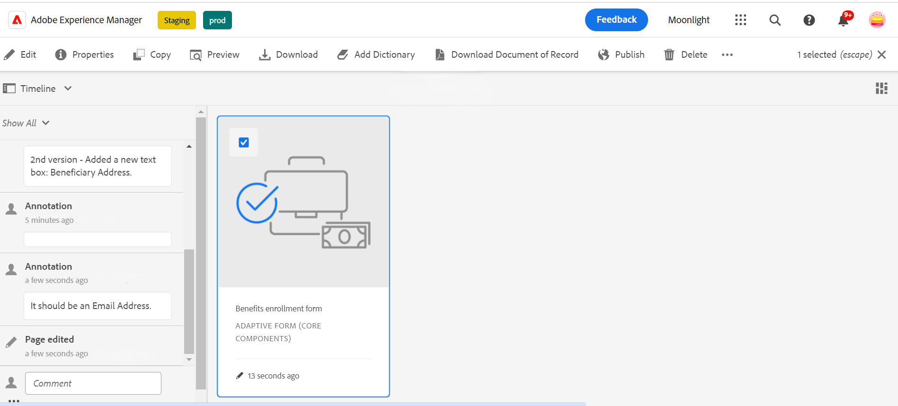

# Versiones, revisión y comentarios de un formulario adaptable

<!--
 This feature is under the early adopter program. If you’re interested in joining our early access program for this feature, send an email from your official address to aem-forms-ea@adobe.com to request access 
-->

Esta característica no está habilitada de manera predeterminada. Puede escribir desde su dirección oficial a aem-forms-ea@adobe.com para solicitar acceso a la función.

Los componentes principales de los formularios adaptables permiten a los autores de formularios añadir versiones, comentarios y anotaciones a los formularios. Estas características simplifican el desarrollo de formularios al permitir a los usuarios crear y administrar varias versiones, colaborar mediante comentarios y agregar notas a secciones específicas del formulario, lo que mejora la experiencia de creación de formularios.

## Requisitos previos {#prerequisite-versioning}

AEM Para usar las características de versiones, comentarios y anotaciones en un formulario adaptable, asegúrese de que [Componentes principales de un formulario adaptable](https://experienceleague.adobe.com/es/docs/experience-manager-65/content/forms/adaptive-forms-core-components/enable-adaptive-forms-core-components) esté habilitado en su entorno de Forms de 6.5.

## Versiones de formularios adaptables {#adaptive-form-versioning}

Las versiones de formularios adaptables ayudan a añadir versiones a un formulario. Los autores de formularios pueden crear fácilmente varias versiones de un formulario y, finalmente, utilizar la que mejor se adapte a los objetivos de la empresa. Además, los usuarios de formularios también pueden revertir el formulario a las versiones anteriores. También permite a los autores comparar dos versiones distintas de un formulario previsualizándolas, lo que les permite analizar mejor los formularios desde el punto de vista de la interfaz de usuario. Veamos en detalle cada una de las funcionalidades de las versiones de los formularios adaptativos:

### Creación de una versión del formulario {#create-a-form-version}

Para crear una versión de un formulario, siga los pasos a continuación:

1. En su entorno de AEM Forms, vaya a **[!UICONTROL Formulario]**>**[!UICONTROL Forms y documentos]** y seleccione su **Formulario**.
1. En el menú desplegable de selección del panel izquierdo, seleccione **[!UICONTROL Versiones]**.
   
1. Haga clic en los **tres puntos** situados en el panel inferior de la izquierda y, a continuación, haga clic en **[!UICONTROL Guardar como versión]**.
1. Proporcione una etiqueta a la versión del formulario; también puede agregar información sobre el formulario a través de un comentario.
   

### Actualizar una versión de formulario {#update-a-form-version}

Una vez editado y actualizado el formulario, se agrega una nueva versión al formulario. Siga los pasos de la última sección para asignar un nombre a una nueva versión del formulario, como se muestra en la imagen:

### Revertir una versión de formulario {#revert-a-form-version}

Para revertir una versión de formulario a la anterior, seleccione una versión de formulario y haga clic en **[!UICONTROL Revertir a esta versión]**.

### Comparar versiones de formularios {#compare-form-versions}

Los autores de formularios pueden comparar dos versiones diferentes de un formulario para obtener una vista previa. Para comparar versiones, seleccione cualquier versión del formulario y haga clic en **[!UICONTROL Comparar con actual]**. Muestra dos versiones de formulario diferentes en el modo de vista previa.

## Añadir comentarios {#add-comments}

Una revisión es un mecanismo que permite a uno o más revisores realizar comentarios sobre los formularios.  Cualquier usuario de un formulario puede realizar comentarios en un formulario o revisarlo mediante comentarios. Para realizar comentarios en un formulario, seleccione un **[!UICONTROL Formulario]** y añada un **[!UICONTROL Comentario]** al formulario.

>[!NOTE]
> Cuando se usan comentarios en los componentes principales de los formularios adaptables, como se ha indicado anteriormente, la funcionalidad del formulario [agregar revisores a los formularios](/help/forms/using/create-reviews-forms.md) está deshabilitada.

## Añadir anotaciones {#adaptive-form-annotations}

En muchos casos, los usuarios de grupos de formularios deben agregar anotaciones a un formulario con fines de revisión, como en una pestaña o componentes específicos de un formulario. En estos casos, los autores pueden utilizar anotaciones.
Para añadir anotaciones a un formulario, siga los siguientes pasos:

1. Abra un formulario en el modo **[!UICONTROL Editar]**.

1. Haga clic en el icono **añadir** situado en el carril superior derecho, como se indica en la imagen.
   

1. Ahora, haga clic en el **icono de agregar** ubicado en el carril superior izquierdo como se indica en la imagen para agregar la anotación.
   

1. Ahora puede añadir comentarios y dibujar bocetos con varios colores para formar componentes.

1. Para ver todas las anotaciones agregadas a un formulario, seleccione el formulario y verá que las anotaciones se agregaron en el panel izquierdo, como se muestra en la imagen.

   

## Consulte también

* [Comparar componentes principales de Forms adaptable](/help/forms/using/compare-forms-core-components.md)
