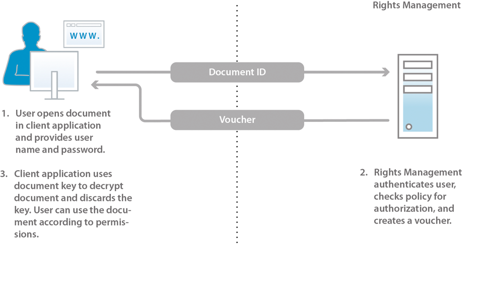

# Acerca de la seguridad del documento {#about-document-security}

La seguridad de los documentos garantiza que solo los usuarios autorizados puedan utilizar sus documentos. Con la seguridad de los documentos, puede distribuir de forma segura cualquier información guardada en un formato compatible. Los formatos de archivo admitidos son:

* Archivos Adobe PDF
* Archivos de Microsoft® Word, Excel y PowerPoint

Para obtener más información acerca de cómo las políticas protegen los tipos de archivo compatibles, consulte [más información de seguridad del documento](https://www.adobe.com/go/learn_aemforms_doc_security_65).

Con la seguridad de los documentos, puede crear, almacenar y aplicar fácilmente configuraciones de confidencialidad predefinidas a sus documentos. Para evitar que la información se extienda más allá de su alcance, también puede supervisar y controlar cómo los destinatarios utilizan sus documentos después de distribuirlos.

Puede proteger los documentos mediante políticas. Una *directiva* es una recopilación de información que incluye parámetros de confidencialidad y una lista de usuarios autorizados. La configuración de confidencialidad que especifique en una directiva determina cómo un destinatario puede utilizar un documento al que aplica la directiva. Por ejemplo, puede especificar si los destinatarios pueden imprimir o copiar texto, editar texto o agregar firmas y comentarios a documentos protegidos.

Los usuarios de seguridad de documentos crean directivas a través de las páginas web del usuario final. Los administradores utilizan las páginas web de seguridad del documento para crear conjuntos de directivas que contengan directivas compartidas disponibles para todos los usuarios autorizados.

Aunque las directivas se almacenan en seguridad de documentos, las aplica a los documentos a través de la aplicación cliente. En la *Ayuda de Acrobat* se describe en detalle cómo aplicar las políticas a los documentos PDF. La aplicación de directivas mediante otras aplicaciones, como Microsoft® Office, se documenta en la *Ayuda de extensiones de Acrobat Reader DC* de la aplicación.

Cuando aplica una directiva a un documento, la configuración de confidencialidad especificada en la directiva protege la información que contiene el documento. La configuración de confidencialidad también protege cualquier archivo (texto, audio o vídeo) de un documento PDF. Puede distribuir el documento protegido por políticas a los destinatarios autorizados por la directiva.

**Control y auditoría del acceso a los documentos**

El uso de una política para proteger un documento le proporciona un control constante sobre ese documento, incluso después de distribuirlo. Puede supervisar el documento, realizar cambios en la directiva, impedir que los usuarios sigan accediendo al documento y cambiar la directiva que se aplica al documento.

A través de la seguridad de los documentos, puede supervisar los documentos protegidos por políticas y rastrear eventos, como cuando un usuario autorizado o no autorizado intenta abrir el documento.

**Componentes**

La seguridad de los documentos consta de un servidor y una interfaz de usuario:

**Servidor:** componente central mediante el cual la seguridad de los documentos realiza transacciones como la autenticación de usuarios, la administración en tiempo real de políticas y la aplicación de la confidencialidad. El servidor también proporciona un repositorio central para políticas, registros de auditoría y otra información relacionada.

**Páginas web:** la interfaz en la que se crean las políticas, se administran los documentos protegidos por políticas y se supervisan los eventos asociados a documentos protegidos por políticas. Los administradores también pueden configurar opciones globales como autenticación de usuarios, auditoría y mensajería para usuarios invitados y administrar cuentas de usuario invitadas.

Los pasos de la ilustración son los siguientes:

1. El propietario del documento crea directivas utilizando las páginas web. Los propietarios de documentos pueden crear políticas personales a las que solo puedan acceder. Los administradores y los coordinadores de conjuntos de políticas pueden crear políticas compartidas dentro de conjuntos de políticas a los que puedan acceder los usuarios autorizados.
1. El propietario del documento aplica la directiva y, a continuación, guarda y distribuye el documento. El documento se puede distribuir por correo electrónico, a través de una carpeta de red o en un sitio web.
1. El destinatario abre el documento en la aplicación cliente adecuada. El destinatario puede utilizar el documento según su política.
1. El propietario del documento, el coordinador del conjunto de políticas o el administrador pueden rastrear documentos y modificar el acceso a ellos mediante las páginas web.

## Acerca de los usuarios de seguridad de documentos {#about-document-security-users}

Varios tipos de usuarios trabajan con la seguridad de los documentos para realizar diferentes tareas:

* El administrador del sistema u otra persona de sistemas de información (IS) instala y configura la seguridad de los documentos. Esta persona también puede ser responsable de configurar la configuración global del servidor, las páginas web, las políticas y los documentos.

   Estos ajustes pueden incluir, por ejemplo, una URL de seguridad de documento base, notificaciones de auditoría y privacidad, avisos de registro de usuarios invitados y periodos de arrendamiento sin conexión predeterminados.

* Los administradores de seguridad de documentos crean políticas y conjuntos de políticas y administran documentos protegidos por políticas para los usuarios según sea necesario. También crean cuentas de usuario invitadas y supervisan el sistema, el documento, el usuario, la política, el conjunto de políticas y los eventos personalizados. También pueden ser responsables de configurar el servidor global, así como la página web y la configuración de directivas junto con un administrador del sistema.

   Los administradores pueden asignar a los usuarios las funciones siguientes en el área Administración de usuarios de la consola de administración. Los usuarios asignados a estas funciones realizan sus tareas en el área de la interfaz de usuario de seguridad del documento de la consola de administración.

   **Superadministrador de seguridad de documentos**

   Los usuarios con esta función tienen acceso a todos los ajustes de seguridad del documento en la consola de administración. Estos permisos están asociados a la función :

   * Administrar configuración
   * Administrar directiva
   * Administrar conjuntos de directivas
   * Administrar documentos
   * Administrar editores de documentos
   * Administrar usuarios invitados y locales
   * Ver eventos
   * Delegar
   * Invitar usuarios externos

   **Administrador de seguridad de documentos**

   Los usuarios con esta función pueden configurar el servidor de seguridad de documentos mediante la página Configuración de la sección Seguridad de documentos de la consola de administración. Este permiso está asociado con la función Administrar configuración.

   >[!NOTE]
   >
   >Los usuarios con esta función también deben tener la función Usuario de la consola de administración para poder iniciar sesión en la consola de administración y editar cualquier configuración relacionada con la configuración.

   **Administrador de conjuntos de directivas de seguridad de documentos**

   Los usuarios con esta función pueden utilizar la sección de seguridad del documento de la consola de administración para editar las políticas de otros usuarios y para crear, editar y eliminar conjuntos de políticas. Cuando un administrador de conjuntos de directivas crea un conjunto de directivas, puede asignar un coordinador de conjuntos de directivas a ese conjunto de directivas. Estos permisos están asociados a la función :

   * Administrar directiva
   * Administrar conjuntos de directivas
   * Administrar documentos
   * Administrar editores de documentos
   * Ver eventos
   * Delegar

   >[!NOTE]
   >
   >Los usuarios con esta función también deben tener la función Usuario de la consola de administración para poder iniciar sesión en la consola de administración y editar cualquier configuración relacionada con la configuración.

   **La seguridad de los documentos administra a los usuarios invitados y locales**

   Los usuarios con esta función pueden realizar las tareas necesarias para administrar todos los usuarios invitados y locales en las páginas web de seguridad de documentos relevantes. Estos permisos están asociados a la función :

   * Administrar usuarios invitados y locales
   * Invitar usuarios externos
   * Acceso a páginas web del usuario final

   >[!NOTE]
   >
   >Los usuarios con esta función también deben tener la función Usuario de la consola de administración para poder iniciar sesión en la consola de administración y editar cualquier configuración relacionada con la configuración.

   **Usuario de invitación de seguridad de documentos**

   Los usuarios con esta función pueden invitar a usuarios. Estos permisos están asociados a la función :

   * Invitar usuarios externos
   * Acceso a páginas web del usuario final

   **Usuario final de seguridad de documentos**

   Los usuarios con esta función pueden acceder a las páginas web de los usuarios finales sobre seguridad de documentos. Esta función también se puede asignar a los administradores para que puedan crear políticas mediante las páginas del usuario final. Este permiso está asociado con la función Acceso a páginas web de usuarios finales.

* Los usuarios de la organización que tengan cuentas de seguridad de documentos válidas crean sus propias políticas, utilizan políticas para proteger documentos, rastrean y administran sus documentos protegidos por políticas y supervisan eventos relacionados con sus documentos.
* Los coordinadores de conjuntos de políticas administran documentos, visualizan eventos y administran otros coordinadores de conjuntos de políticas (según sus permisos). Los administradores designan a los usuarios como coordinadores de conjuntos de políticas para conjuntos de políticas concretos.
* Los usuarios externos a su organización (por ejemplo, un socio comercial) pueden utilizar documentos protegidos por políticas si se encuentran en el directorio de seguridad de documentos de seguridad de documentos, si el administrador les crea una cuenta o si se registran con seguridad de documentos mediante un proceso automatizado de invitación por correo electrónico. Según la forma en que el administrador habilita la configuración de acceso, los usuarios invitados también pueden tener permiso para aplicar políticas a documentos, crear, modificar y eliminar sus políticas e invitar a otros usuarios externos a utilizar sus documentos protegidos por políticas.
* Los desarrolladores utilizan el SDK de AEM Forms para integrar aplicaciones personalizadas con seguridad de documentos.

Los administradores de seguridad de documentos pueden crear funciones personalizadas mediante los siguientes permisos en Administración de usuarios:

* Configuración de gestión de seguridad de documentos
* Seguridad de documentos Administrar usuarios invitados y locales
* Conjunto de directivas Administrar seguridad de documentos
* Conjunto de directivas Administrar seguridad de documentos
* Eventos de servidor de vista de seguridad de documentos
* Propietario de la directiva de cambio de seguridad de documentos

## Políticas y documentos protegidos por políticas {#policies-and-policy-protected-documents}

Una *directiva* define un conjunto de configuraciones de confidencialidad y usuarios que pueden acceder a un documento al que se aplica la directiva. Una directiva también permite que los permisos de un documento se cambien de forma dinámica. Permite a la persona que asegura el documento cambiar la configuración de confidencialidad para revocar el acceso al documento o cambiar la directiva.

La protección de políticas se puede aplicar a un documento PDF utilizando Adobe Acrobat® Pro y Acrobat Standard. La protección de directivas se puede aplicar a otros tipos de archivos, como archivos de Microsoft® Word, Excel y PowerPoint, mediante la aplicación cliente con las extensiones de Acrobat Reader DC instaladas adecuadas.

### Funcionamiento de las directivas {#how-policies-work}

Las directivas contienen información sobre los usuarios autorizados y la configuración de confidencialidad que se aplicará a los documentos. Los usuarios pueden ser cualquier persona de su organización, así como personas externas a su organización que tengan una cuenta. Si el administrador habilita la función de invitación del usuario, es posible agregar nuevos usuarios a las directivas, iniciando así un proceso de correo electrónico de invitación de registro.

La configuración de confidencialidad de una directiva determina cómo pueden utilizar el documento los destinatarios. Por ejemplo, puede especificar si los destinatarios pueden imprimir o copiar texto, realizar cambios o agregar firmas y comentarios a documentos protegidos. La misma directiva también puede especificar diferentes configuraciones de confidencialidad para usuarios específicos.

>[!NOTE]
>
>La configuración de confidencialidad que se aplica mediante una directiva anula cualquier configuración que se pueda haber aplicado a un documento PDF en Acrobat mediante las opciones de seguridad de contraseña o certificado. (Consulte la Ayuda de Acrobat para obtener más información).

Los usuarios y administradores crean directivas a través de las páginas web de seguridad de documentos. Sólo se puede aplicar una política a la vez a un documento. Puede aplicar una directiva mediante uno de estos métodos:

* Abra el documento en Acrobat u otra aplicación cliente y seleccione una directiva para protegerlo.
* Envíe un documento como archivo adjunto de correo electrónico en Microsoft® Outlook. En este caso, puede seleccionar una política de una lista de directivas o seleccionar una política generada automáticamente que Acrobat cree con un conjunto predeterminado de configuraciones de confidencialidad para proteger el documento solo para los destinatarios de mensajes de correo electrónico.

Se puede quitar una directiva de un documento mediante la aplicación cliente.

Los pasos del diagrama son los siguientes:

1. El propietario del documento protege el documento de una aplicación cliente compatible con una directiva que permite el uso en línea.
1. Document security crea una licencia de documento y claves de documento, y cifra la directiva. La licencia del documento, la directiva cifrada y la clave del documento se devuelven a la aplicación cliente.
1. El documento se cifra con la clave del documento y la clave del documento se descarta. El documento ahora incrusta la licencia y la directiva. Estas tareas se realizan en la aplicación cliente admitida.

Cuando se aplica una política a un documento, la información que contiene el documento, incluidos los archivos contenidos (texto, audio o vídeo) en documentos PDF, está protegida por la configuración de confidencialidad especificada en la directiva. La seguridad del documento genera una licencia y una información de cifrado que luego se incrusta en el documento. Al distribuir el documento, la seguridad del documento puede autenticar a los destinatarios que intenten abrir el documento y autorizar el acceso según los privilegios especificados en la directiva.

Si el uso sin conexión está habilitado, los destinatarios también pueden utilizar documentos protegidos por políticas sin conexión (sin una conexión activa a Internet o a la red) durante el período de tiempo especificado en la directiva.

### Cómo funcionan los documentos protegidos por políticas {#how-policy-protected-documents-work}

Para abrir y utilizar documentos protegidos por políticas, la directiva debe incluir su nombre como destinatario y debe tener una cuenta de seguridad de documento válida. Para documentos PDF, necesita Acrobat o Adobe Reader®. Para otros tipos de archivo, necesita la aplicación adecuada para el archivo con las extensiones de Acrobat Reader DC instaladas.

Cuando intenta abrir un documento protegido por políticas, Acrobat, Adobe Reader o las extensiones de Acrobat Reader DC se conectan a document security para autenticarlo. A continuación, puede iniciar sesión. Si se está auditando el uso del documento, aparece un mensaje de notificación. Después de que la seguridad del documento determina qué permisos de documento se van a conceder, administra el descifrado del documento. A continuación, puede utilizar el documento según la configuración de confidencialidad de la directiva.

Los pasos del diagrama son los siguientes:

1. El usuario del documento abre el documento en una aplicación cliente compatible y se autentica con el servidor. El identificador del documento se envía al servidor de seguridad del documento.
1. La seguridad de los documentos autentica a los usuarios, comprueba la directiva para obtener autorización y crea un vale. El asiento (que contiene la clave del documento y los permisos) se devuelve a la aplicación cliente.
1. El documento se descifra con la clave del documento y se descarta la clave del documento. El documento se puede utilizar según la configuración de confidencialidad de la directiva. Estas tareas se realizan en la aplicación cliente admitida.

Puede seguir utilizando un documento con estas condiciones:

* Indefinidamente o para el periodo de validez especificado en la directiva
* Hasta que el administrador o la persona que aplicó la directiva revoque el acceso al documento o cambie la directiva

También puede utilizar documentos protegidos por políticas sin conexión (sin conexión a Internet o a la red) si la directiva permite el acceso sin conexión. Primero debe iniciar sesión en document security para sincronizar el documento. A continuación, puede utilizar el documento durante el periodo de arrendamiento sin conexión especificado en la directiva.

Cuando finaliza el periodo de lesión sin conexión, debe sincronizar de nuevo el documento con la seguridad del documento, ya sea conectándose y abriendo un documento protegido por políticas o utilizando un comando en la aplicación cliente. (Consulte *Ayuda de Acrobat* o la *Ayuda de extensiones de Acrobat Reader DC* correspondiente para obtener más información).

Si guarda una copia de un documento protegido por una política utilizando el comando de menú Guardar o Guardar como, la política se aplica automáticamente y se aplica al nuevo documento. Eventos como los intentos de abrir el nuevo documento también se auditan y registran para el documento original.

## Conjuntos de directivas {#policy-sets}

*Los* conjuntos de políticas se utilizan para agrupar un conjunto de políticas que tienen un propósito comercial común. Estos conjuntos de políticas se ponen a disposición de un subconjunto de usuarios del sistema.

Cada conjunto de directivas puede tener uno o más coordinadores de conjuntos de directivas asociados. El coordinador del conjunto de directivas es un administrador o un usuario que tiene más permisos. El *coordinador del conjunto de políticas* es normalmente un especialista de la organización que puede crear mejor las políticas en un conjunto de políticas determinado.

Los coordinadores de conjuntos de políticas pueden realizar las siguientes tareas:

* Crear nuevas políticas
* Editar y eliminar cualquier directiva del conjunto de directivas
* Editar configuración de conjunto de directivas
* Agregar y quitar coordinadores de conjuntos de directivas
* Ver eventos de directivas y documentos para cualquier directiva o documento dentro del conjunto de directivas
* Revocar el acceso a los documentos
* Cambiar directivas para el documento.

>[!NOTE]
>
>Puede recuperar un máximo de 1000 nombres de conjuntos de directivas de la base de datos mediante la API `getAllPolicysetnames()`.

Los administradores y los coordinadores de conjuntos de políticas que tienen permiso para hacerlo crean y eliminan conjuntos de políticas en las páginas web de la administración de seguridad de documentos.

Los conjuntos de políticas generalmente están disponibles para un número limitado de usuarios, especificando qué usuarios o grupos dentro de un dominio pueden utilizar las políticas del conjunto de políticas para proteger documentos.

Cuando se instala la seguridad del documento, se crea un conjunto de directivas predeterminado denominado *Conjunto de directivas globales*. El administrador que instaló el software administra este conjunto de directivas.

## Prácticas recomendadas {#best-practices}

Las directivas son conjuntos reutilizables de permisos y grupos de usuarios que se pueden aplicar a varios documentos. Para los documentos protegidos. Estas directivas garantizan que solo los usuarios autorizados puedan utilizar las funciones permitidas. Se espera que el número de políticas y conjuntos de políticas aumente con un aumento de las diferentes funciones de usuario y documentos dentro de un departamento. Estas son algunas consideraciones y prácticas recomendadas para crear y administrar políticas:

* **Crear políticas reutilizables:** Adobe recomienda reutilizar las directivas en varios documentos. Ayuda a reducir al mínimo el número de políticas, ofrece un rendimiento óptimo y facilita la administración de las políticas. Para crear una directiva reutilizable:

1. Identificar y definir los requisitos de control de acceso a nivel de departamentos y organizaciones.

1. Cree grupos de usuarios y agregue usuarios a estos grupos.

1. Cree un conjunto de directivas.

1. Abra el conjunto de directivas y cree una directiva. Agregue grupos de usuarios y establezca la configuración de confidencialidad (control de acceso) para la directiva.

Agregue grupos de usuarios a las directivas en lugar de usuarios individuales. Esto facilita la administración y aplicación de políticas a un gran número de usuarios.

* **Crear conjuntos de directivas personalizados:** un conjunto de directivas combina varias directivas en una entidad manejable. Cree conjuntos de directivas personalizados para su organización o departamento, utilícelos para agrupar directivas relacionadas y haga que estén disponibles para un subconjunto de usuarios del sistema.

   El uso de conjuntos de políticas facilita la asignación y administración de políticas relacionadas a usuarios específicos de una organización o departamento. Por ejemplo, los conjuntos de políticas separados para el departamento de finanzas y recursos humanos pueden ayudar a administrar y aplicar fácilmente las políticas conexas a los documentos designados para los departamentos correspondientes.

* **Utilice un autorizador externo para aplicar permisos de forma dinámica:** puede utilizar un autorizador  [externo ](https://help.adobe.com/en_US/livecycle/11.0/ProgramLC/WS624e3cba99b79e12e69a9941333732bac8-6f26.2.html) para evaluar y aplicar permisos de forma dinámica en función de una condición externa. Cuando los permisos se evalúan dinámicamente, en función de una condición externa, puede:

   * Proporcione control de acceso centralizado para los documentos de su organización.

   * Controle el acceso a los documentos protegidos por políticas determinando dinámicamente si un usuario puede acceder a un documento protegido por políticas. Por ejemplo, decide dinámicamente si un usuario puede imprimir un documento protegido por políticas.

   * Utilice un mecanismo de control de acceso que utilice su sistema de administración de contenido, además del proceso de evaluación de directivas estándar. Por ejemplo, cuando el servicio determina si un usuario puede imprimir un documento protegido por políticas, puede utilizar el proceso de evaluación de directivas estándar y el mecanismo de control de acceso que utiliza su sistema de administración de contenido.
   Aunque es posible reemplazar completamente el proceso de evaluación de la directiva de seguridad de documentos con un controlador de autorización externo, se recomienda utilizar un controlador de autorización externo junto con el proceso de evaluación de directivas. Como resultado, el acceso a los documentos se puede controlar mediante el mismo mecanismo de control que utiliza el sistema de administración de contenido. Por ejemplo, cuando el servicio de seguridad de documentos determina si un usuario puede imprimir un documento protegido por políticas, utiliza el proceso de evaluación de directivas estándar y el mecanismo de control de acceso que utiliza su sistema de administración de contenido. Para obtener más información, consulte [Creación de controladores de autorización externos](https://help.adobe.com/en_US/livecycle/11.0/ProgramLC/WS624e3cba99b79e12e69a9941333732bac8-6f26.2.html).

* **Mantenga los conjuntos de políticas en un número limitado:**  Varios factores conducen al crecimiento constante de las políticas y los conjuntos de políticas. Algunos factores comunes son:

   * Aumento de las funciones de usuario, los departamentos y los documentos dentro de una organización durante un período.
   * Los departamentos de una organización trabajan aisladamente y mantienen un control estricto de las políticas específicas de cada departamento. Genera políticas idénticas dentro de una organización.

   Adobe recomienda mantener al mínimo el número de políticas y conjuntos de políticas. Ayuda a administrar fácilmente las políticas y los conjuntos de políticas y a proporcionar un mejor rendimiento. Para reducir el número al mínimo:

   * Crear políticas reutilizables. Se pueden compartir en varios departamentos.
   * Considere la posibilidad de crear conjuntos de políticas para toda la organización si algunas políticas se aplican a varios departamentos en lugar de a un conjunto de políticas individual para cada departamento.
   * Agrupar directivas relacionadas en un conjunto de directivas. No cree un conjunto de directivas separado para cada directiva.
   * Utilice un autorizador externo para controlar dinámicamente los permisos de usuario.

   >[!NOTE]
   >
   > Puede utilizar la API [getAllPolicysetnames()]((https://helpx.adobe.com/experience-manager/6-5/forms/programlc/javadoc/com/adobe/livecycle/rightsmanagement/client/PolicyManager.html)) para recuperar un máximo de 1000 nombres de conjuntos de directivas. Internamente, la API recupera un máximo de 1000 directivas para las que el invocador de API tiene permiso de editor de documentos y, a continuación, crea y devuelve una lista de nombres de conjuntos de directivas exclusivos asociados a las políticas recuperadas. Por ejemplo, cuando la API recupera 1000 directivas y las políticas recuperadas están asociadas con 200 conjuntos de directivas en total, la API solo devuelve 200 nombres de conjuntos de directivas.
