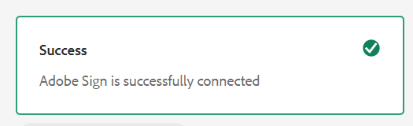

# Integrar [!DNL Adobe Sign]con AEM [!DNL Forms]{#integrate-adobe-sign-with-aem-forms}

 Adobe recomienda utilizar la captura de datos moderna y ampliable [Componentes principales](https://experienceleague.adobe.com/docs/experience-manager-core-components/using/adaptive-forms/introduction.html?lang=es) para [crear un nuevo formulario adaptable](/help/forms/using/create-an-adaptive-form-core-components.md) o [añadir formularios adaptables a páginas de AEM Sites](/help/forms/using/create-or-add-an-adaptive-form-to-aem-sites-page.md). Estos componentes representan un avance significativo en la creación de formularios adaptables, lo que garantiza experiencias de usuario impresionantes. Este artículo describe un enfoque más antiguo para crear Formularios adaptables con componentes de base. 

| Versión | Vínculo del artículo |
| -------- | ---------------------------- |
| AEM as a Cloud Service | [Haga clic aquí](https://experienceleague.adobe.com/docs/experience-manager-cloud-service/content/forms/integrate/services/adobe-sign-integration-adaptive-forms.html?lang=en#adobe-acrobat-sign-for-government) |
| AEM 6.5 | Este artículo |

[!DNL Adobe Sign] habilita los flujos de trabajo de firma electrónica para formularios adaptables. Las firmas electrónicas mejoran los flujos de trabajo para procesar documentos para el área legal, ventas, nóminas, administración de recursos humanos y mucho más.

Cuando se trabaja con [!DNL Adobe Acrobat Sign] y los formularios adaptables, normalmente los usuarios rellenan un formulario adaptable para solicitar un servicio. Por ejemplo, una solicitud de tarjeta de crédito y un formulario de solicitud para una prestación. Cuando un usuario rellena, envía y firma el formulario de solicitud, este se envía al proveedor de servicios para que realice más acciones. El proveedor de servicios revisa la solicitud y utiliza [!DNL Adobe Acrobat Sign] para marcarla como aprobada. AEM Forms es compatible tanto con Adobe Acrobat Sign como con Adobe Acrobat Sign Solutions para el gobierno. Según la licencia y los requisitos, puede integrar o conectar AEM Forms con cualquiera de las soluciones:

* [Conectar AEM Forms con Adobe Acrobat Sign](#adobe-sign)
* [Conectar AEM Forms con Adobe Acrobat Sign Solutions para el gobierno](#adobe-acrobat-sign-for-government)

## Conectar AEM Forms con Adobe Acrobat Sign {#adobe-sign}

Para conectar **[!DNL AEM Forms]** con **[!DNL Adobe Acrobat Sign]**, configure el software y las cuentas que se enumeran en la sección Requisitos previos y conecte Adobe Sign a todas las instancias de autor de AEM Forms y Publish:

## Requisitos previos {#prerequisites}

Para integrar [!DNL Adobe Sign] con AEM [!DNL Forms], necesita lo siguiente:

* Una [cuenta de desarrollador de Adobe Sign](https://acrobat.adobe.com/es/es/why-adobe/developer-form.html) activa.
* Un servidor AEM [Habilitado para SSL](/help/sites-administering/ssl-by-default.md) AEM [!DNL Forms].
* Un [aplicación API de Adobe Sign](https://www.adobe.io/apis/documentcloud/sign/docs.html#!adobedocs/adobe-sign/master/gstarted/create_app.md);
* Las credenciales (ID de cliente y Secreto de cliente) de la aplicación API de [!DNL Adobe Sign];
* Al volver a configurar, quite la [!DNL Adobe Sign] configuración de las instancias de autor y publicación.
* Use una [clave criptográfica idéntica](/help/sites-administering/security-checklist.md#make-sure-you-properly-replicate-encryption-keys-when-needed) para las instancias de autor y publicación.

## Configurar[!DNL Adobe Sign] con AEM [!DNL Forms] {#configure-adobe-sign-with-aem-forms}

Una vez cumplidos los requisitos previos, realice los siguientes pasos para configurar [!DNL Adobe Sign] con AEM [!DNL Forms] en la instancia de autor:

1. En la instancia de autor de AEM [!DNL Forms], navegue hasta **Herramientas**  > **[!UICONTROL General]** > **[!UICONTROL Explorador de configuración]**.
1. En la página **[!UICONTROL Explorador de configuración]**, seleccione **[!UICONTROL Crear]**.
   * Consulte la documentación del [Explorador de configuración](/help/sites-administering/configurations.md) para obtener más información.
1. En el cuadro de diálogo **[!UICONTROL Crear configuración]**, especifique un **[!UICONTROL Título]** para la configuración, habilite **[!UICONTROL Configuraciones de nube]** y seleccione **[!UICONTROL Crear]**. Crea un contenedor de configuración.
1. Navegue hasta **Herramientas**  > **[!UICONTROL Cloud Services]** > **[!UICONTROL Adobe Sign]** y abra el contenedor de configuración que creó en el paso anterior.

   >[!NOTE]
   >
   >Puede ejecutar los pasos 1-4 para crear un contenedor de configuración y crear una configuración de [!DNL Adobe Sign] en el contenedor o usar la carpeta de `global` existente en **Herramientas**  > **[!UICONTROL Cloud Service]** > **[!UICONTROL Adobe Sign]**. Si crea la configuración en el nuevo contenedor de configuración, asegúrese de especificar el nombre del contenedor en el campo **[!UICONTROL Contenedor de configuración]** al crear un formulario adaptable.

   >[!NOTE]
   >
   >Asegúrese de que la dirección URL de la página de configuración de Cloud Service comience por **HTTPS**. Si no, [habilite SSL](/help/sites-administering/ssl-by-default.md) para el servidor de AEM [!DNL Forms].

1. En la página de configuración, pulse **[!UICONTROL Crear]** para crear una configuración de [!DNL Adobe Sign] en AEM [!DNL Forms].
1. En la pestaña **[!UICONTROL General]** de la página **[!UICONTROL Crear configuración de Adobe Sign]**, especifique un **[!UICONTROL Nombre]** para la configuración y pulse **[!UICONTROL Siguiente]**. Si lo desea, puede especificar un Título y examinar los archivos para seleccionar una miniatura para la configuración.
1. Ahora puede **[!UICONTROL Seleccionar solución]** para seleccionar [!DNL Adobe Acrobat Sign].

   

1. Copie la dirección URL de la ventana actual del explorador en un bloc de notas y quite la parte /`ui#/aem` de la dirección URL. La URL modificada es necesaria para configurar la [!DNL Adobe Acrobat Sign] aplicación con [!DNL AEM Forms], en un paso posterior. Pulse [!UICONTROL Siguiente].

1. En la pestaña **[!UICONTROL Configuración]**,
   * el campo **[!UICONTROL URL de OAuth]** contiene la dirección URL predeterminada que incluye la partición de la base de datos Adobe Sign. El formato de la URL es el siguiente:

     `https://<shard>/public/oauth/v2`

     Por ejemplo:
     `https://secure.na1.echosign.com/public/oauth/v2`

   * el campo **[!UICONTROL URL de token de acceso]** contiene la dirección URL predeterminada que incluye la partición de la base de datos Adobe Sign. El formato de la URL es el siguiente:

     `https://<shard>/oauth/v2/token`

     Por ejemplo:
     `https://api.na1.echosign.com/oauth/v2/token`

   donde:

   **na1** hace referencia a la partición predeterminada de la base de datos. Puede modificar el valor de la partición de la base de datos. Asegúrese de que las configuraciones en la nube de [!DNL &#x200B; Adobe Acrobat Sign] apuntan a la [partición correcta](https://helpx.adobe.com/es/sign/using/identify-account-shard.html).

   >[!NOTE]
   >
   >* Mantenga abierta la página **Crear la configuración de Adobe Acrobat Sign**. No la cierre. Puede recuperar la **ID de cliente** y el **Secreto de cliente** después de configurar OAuth para la aplicación [!DNL Adobe Acrobat Sign] como se describe en los pasos siguientes.
   >* Después de iniciar sesión en su cuenta de Adobe Sign, vaya a la **[!UICONTROL API de Acrobat Sign]** > **[!UICONTROL Información de API]** > **[!UICONTROL Documentación de métodos de API de REST]** > **[!UICONTROL Token de acceso de OAuth]** para acceder a información relacionada con la URL de OAuth de Adobe Sign y la URL del token de acceso.

1. Configure OAuth para la aplicación [!DNL Adobe Sign]:

   1. Abra una ventana del explorador e inicie sesión en su cuenta de desarrollador de [!DNL Adobe Sign].
   1. AEM Seleccione la aplicación configurada para la aplicación [!DNL Forms] y seleccione **[!UICONTROL Configurar OAuth para la aplicación]**.
   1. Copie el **[!UICONTROL ID de cliente]** y el **[!UICONTROL Secreto del cliente]** a un bloc de notas.
   1. En el cuadro **[!UICONTROL URL de redireccionamiento]**, agregue la URL HTTPS copiada en el paso anterior.
   1. Habilite la siguiente configuración de OAuth para la aplicación de [!DNL Adobe Sign] y haga clic en **[!UICONTROL Guardar]**.

   * agreement_read
   * agreement_write
   * agreement_send
   * widget_write
   * workflow_read

   Para obtener información paso a paso sobre cómo configurar OAuth para una aplicación [!DNL Adobe Sign] y obtener las claves, consulte la documentación para desarrolladores [Configurar OAuth para la aplicación](https://www.adobe.io/apis/documentcloud/sign/docs.html#!adobedocs/adobe-sign/master/gstarted/configure_oauth.md).

   

<!--
1. Go back to the **[!UICONTROL Create Adobe Sign Configuration]** page. In the **[!UICONTROL Settings]** tab, the **[!UICONTROL OAuth URL]** field mentions the  default URL. The format of the URL is:

   `https://<shard>/public/oAuth/v2`

   For example: 
   `https://secure.na1.echosign.com/public/oauth/v2`

   where:

   **na1** refers to the default database shard.

   You can modify the value for the database shard. Restart the server to be able to use the new value for the database shard.

   >[!NOTE]
   >
   >Ensure that your author and publish instance configurations point to the same shard. If you create multiple Adobe Sign configurations for an organization, ensure all the configurations utilize the same shard. -->

1. Vuelva a la página **[!UICONTROL Crear configuración de Adobe Sign]**. En la pestaña **[!UICONTROL Configuración]** especifique el **ID de cliente** (también denominado ID de aplicación) y el **secreto de cliente**. Utilice la aplicación [ID de cliente y Secreto de cliente de la aplicación Adobe Sign](https://opensource.adobe.com/acrobat-sign/developer_guide/helloworld.html#get-the-app-id-and-secret) creada para AEM Forms.

1. Seleccione la opción **[!UICONTROL Habilitar Adobe Sign para archivos adjuntos]** para anexar los archivos adjuntos a un formulario adaptable al documento de [!DNL Adobe Sign]correspondiente enviado para su firma.

1. Seleccione **[!UICONTROL Conectar con Adobe Sign]**. Cuando se le soliciten credenciales, indique el nombre de usuario y la contraseña de la cuenta utilizada al crear la aplicación [!DNL Adobe Sign]. 

   

1. Pulse **[!UICONTROL Crear]** para crear la configuración de [!DNL Adobe Sign].
1. Abra la consola web de AEM. La URL es `https://'[server]:[port]'/system/console/configMgr`. 
1. Abra el **[!UICONTROL Servicio de configuración común de Forms].**
1. En el campo **[!UICONTROL Permitir]**, **seleccione** Todos los usuarios: todos los usuarios, anónimos o conectados, pueden obtener una vista previa de los archivos adjuntos, comprobar y firmar formularios y hacer clic en **[!UICONTROL Guardar].** La instancia de autor está configurada para usar [!DNL Adobe Sign].
1. Publique la configuración.
1. Use [replicación](https://experienceleague.adobe.com/docs/experience-manager-65/deploying/configuring/replication.html) para crear una configuración idéntica en las instancias de publicación correspondientes.

Ahora, [!DNL Adobe Sign] está integrado con AEM [!DNL Forms] y listo para utilizarlo en formularios adaptables. Para [usar el servicio Adobe Sign en un formulario adaptable](../../forms/using/working-with-adobe-sign.md#configure-adobe-sign-for-an-adaptive-form), especifique el contenedor de configuración creado anteriormente en las propiedades del formulario adaptable.

>[!NOTE]
>
>Para configurar la zona protegida de Adobe Sign, puede seguir los mismos pasos de configuración explicados en [Adobe Sign](#adobe-sign).

## Conectar AEM Forms con Adobe Acrobat Sign Solutions para el gobierno {#adobe-acrobat-sign-for-government}

La conexión de AEM Forms con Adobe Acrobat Sign Solutions para el gobierno es un proceso de varios pasos. Implica:

* La creación de una URL de redireccionamiento para sus casos de AEM
* Uso compartido de la URL de redireccionamiento y los ámbitos con el equipo de Adobe Sign Solutions para el gobierno
* Recibiendo credenciales del equipo de Adobe Sign
* Uso de las credenciales recibidas para conectar AEM Forms con Adobe Acrobat Sign Solutions para el gobierno

### Antes de comenzar {#prerequisites-for-adobe-sign-for-acrobat-sign-for-government}

Antes de empezar a conectar AEM Forms con la solución de Adobe Acrobat Sign,

* Asegúrese de que su cuenta de [Adobe Acrobat Sign Solutions for Government](https://opensource.adobe.com/acrobat-sign/signgov/gstarted.html#account-provisioning) esté aprovisionada.
* AEM Sus servidores de [!DNL Forms] de están [habilitados para SSL](/help/sites-administering/ssl-by-default.md) .
* AEM Sus servidores de [!DNL Forms] de la están usando [clave criptográfica idéntica](/help/sites-administering/security-checklist.md#make-sure-you-properly-replicate-encryption-keys-when-needed) para las instancias de autor y publicación.

### Conectar AEM Forms a Adobe Acrobat Sign Solutions para Administración Pública {#connect-adobe-acrobat-sign-for-government}

#### Cree una URL de redireccionamiento para la instancia de AEM

1. En su instancia de AEM Forms, vaya a **[!UICONTROL Herramientas]**  > **[!UICONTROL General]** > **[!UICONTROL Explorador de configuración]**.
1. En la página **[!UICONTROL Explorador de configuración]**, seleccione **[!UICONTROL Crear]**.
1. En el cuadro de diálogo **[!UICONTROL Crear configuración]**, especifique un **[!UICONTROL Título]** para la configuración, habilite **[!UICONTROL Configuraciones de nube]** y seleccione **[!UICONTROL Crear]**. Crea un contenedor de configuración. Asegúrese de que el nombre del contenedor/carpeta no contenga ningún espacio.

1. Navegue hacia **[!UICONTROL Herramientas]**  > **[!UICONTROL Cloud Services]** > **[!UICONTROL Adobe Acrobat Sign]** y abra el contenedor de configuración que creó en el paso anterior. Cuando cree un formulario adaptable, especifique el nombre del contenedor en el campo **[!UICONTROL Contenedor de configuración]**.
1. En la página de configuración, seleccione **[!UICONTROL Crear]** para crear una configuración de [!DNL Adobe Acrobat Sign] en AEM Forms.
1. Copie la URL de la ventana actual del explorador a un bloc de notas desde la URL. Esta URL se denomina `re-direct URL`. En la siguiente sección, comparta la `re-direct URL` y `Scopes` con el equipo de Adobe Sign y las credenciales de solicitud (ID de cliente y Secreto de cliente).

>[!NOTE]
>
>
>* Un `re-direct URL` debe contener un dominio [de nivel superior](https://en.wikipedia.org/wiki/Top-level_domain). Por ejemplo, `https://adobe.com/libs/adobesign/cloudservices/adobesign/createcloudconfigwizard/cloudservices.html/conf/global`
>* No use una dirección URL local como `re-direct URL`. Por ejemplo, `https://localhost:4502/libs/adobesign/cloudservices/adobesign/createcloudconfigwizard/cloudservices.html/conf/global`.

#### Comparta la URL de redireccionamiento y los ámbitos con el equipo de Adobe Sign y reciba las credenciales

El equipo de Adobe Acrobat Sign para soluciones de gobierno requiere que `re-direct URL` y ciertos ámbitos estén habilitados para la aplicación de Adobe Acrobat Sign (que se muestra a continuación) a fin de generar credenciales (Id. de cliente y Secreto de cliente) que le permitan conectar AEM Forms con Adobe Acrobat Sign Solutions para el gobierno.

Comparta `scopes` (mostrado a continuación) y `re-direct URL` creados y anotados en el último paso de la sección anterior con su representante de Adobe Acrobat Sign para soluciones gubernamentales [miembro del equipo de Adobe Professional Services](https://opensource.adobe.com/acrobat-sign/signgov/gstarted.html#password).

**_Ámbitos_**

* [!DNL agreement_read]
* [!DNL agreement_write]
* [!DNL agreement_send]
* [!DNL widget_read]
* [!DNL widget_write]
* [!DNL workflow_read]
* [!DNL offline_access]

El representante genera y comparte credenciales con usted. En la siguiente sección, utilice las credenciales (ID de cliente y Secreto de cliente) para conectar AEM Forms con Adobe Acrobat Sign Solutions para el gobierno.

#### Utilice las credenciales recibidas para conectar AEM Forms con Adobe Acrobat Sign Solutions para el gobierno

1. Abra la `re-direct URL` en su explorador. Ha creado y anotado la `re-direct URL` en el último paso del [ cree una URL de redireccionamiento en la instancia AEM de la](#create-redirect-url) sección.

1. En la pestaña **[!UICONTROL General]** de la página **[!UICONTROL Crear configuración de Adobe Sign]**, especifique un **[!UICONTROL Nombre]** para la configuración y seleccione **[!UICONTROL Siguiente]**. Si lo desea, puede especificar un **[!UICONTROL Título]** y examinar los archivos para seleccionar una **[!UICONTROL miniatura]** para la configuración. Haga clic en **[!UICONTROL Siguiente]**.

1. En la pestaña de **[!UICONTROL Configuración]** de la página **[!UICONTROL Crear configuración de Adobe Sign]**, para la opción de **[!UICONTROL Seleccionar solución]**, seleccione [!DNL Adobe Acrobat Sign Solutions for Government].

   

1. En el campo **[!UICONTROL Correo electrónico]**, especifique la dirección de correo electrónico asociada a su cuenta de Adobe Acrobat Sign Solutions para Administración Pública.

1. En la pestaña **[!UICONTROL Configuración]**,
   * el campo **[!UICONTROL URL de OAuth]** contiene la dirección URL predeterminada que incluye la partición de la base de datos Adobe Sign. El formato de la URL es el siguiente:

     `https://<shard>/api/gateway/adobesignauthservice/api/v1/authorize`

     Por ejemplo:
     `https://secure.na1.adobesign.us/api/gateway/adobesignauthservice/api/v1/authorize`

   * el campo **[!UICONTROL URL de token de acceso]** contiene la dirección URL predeterminada que incluye la partición de la base de datos Adobe Sign. El formato de la URL es el siguiente:

     `https://<shard>/api/gateway/adobesignauthservice/api/v1/token`

     Por ejemplo:
     `https://secure.na1.adobesign.us/api/gateway/adobesignauthservice/api/v1/token`

   donde:

   **na1** hace referencia a la partición predeterminada de la base de datos. Puede modificar el valor de la partición de la base de datos. Asegúrese de que las configuraciones en la nube de [!DNL &#x200B; Adobe Acrobat Sign] apuntan a la [partición correcta](https://helpx.adobe.com/es/sign/using/identify-account-shard.html).

   >[!NOTE]
   >
   >* Después de iniciar sesión en su cuenta de Adobe Sign, vaya a **[!UICONTROL API de Acrobat Sign]** > **[!UICONTROL Información de API]** > **[!UICONTROL Documentación de métodos de API de REST]** > **[!UICONTROL Token de acceso de OAuth]** para acceder a información relacionada con la URL de autenticación de Adobe Sign y la URL del token de acceso.

1. Use las credenciales compartidas por Adobe Acrobat Sign para el representante de soluciones gubernamentales ([miembro del equipo de Adobe Professional Services]) en la sección anterior como [**[!UICONTROL ID de cliente]** y **[!UICONTROL Secreto del cliente]**].

1. Seleccione la opción **[!UICONTROL Habilitar Adobe Acrobat Sign para archivos adjuntos]** para anexar los archivos adjuntos a un formulario adaptable al documento de [!DNL Adobe Acrobat Sign]correspondiente enviado para su firma.

1. Seleccione **[!UICONTROL Conectar con Adobe Sign]**. Cuando se le soliciten credenciales, indique el nombre de usuario y la contraseña de la cuenta utilizada al crear la aplicación [!DNL Adobe Acrobat Sign]. Cuando se le pida que confirme el acceso de `Adobe Acrobat Sign for Government Solutions` y , haga clic en **[!UICONTROL Permitir acceso]**. Si las credenciales son correctas y permite a [!DNL AEM Forms] acceder a su cuenta de desarrollador de [!DNL Adobe Acrobat Sign], aparecerá un mensaje de éxito similar al siguiente.

   

   Cuando se le soliciten credenciales, indique el nombre de usuario y la contraseña de la cuenta utilizada al crear la aplicación [!DNL Adobe Acrobat Sign]. Cuando se le pidió que confirmara el acceso de `your account`, haga clic en **[!UICONTROL Permitir acceso]**.

1. Seleccione **[!UICONTROL Crear]** para crear la configuración.
1. Abra la consola web de AEM. La URL es `https://'[server]:[port]'/system/console/configMgr`. 
1. Abra el **[!UICONTROL Servicio de configuración común de Forms].**
1. En el campo **[!UICONTROL Permitir]**, **seleccione** Todos los usuarios: todos los usuarios, anónimos o conectados, pueden obtener una vista previa de los archivos adjuntos, comprobar y firmar formularios y hacer clic en **[!UICONTROL Guardar].** La instancia de autor está configurada para usar [!DNL Adobe Sign].

1. Publique la configuración.
1. Use [replicación](https://experienceleague.adobe.com/docs/experience-manager-65/deploying/configuring/replication.html) para crear una configuración idéntica en las instancias de publicación correspondientes.

Ahora puede [utilizar agregar campos de Adobe Acrobat Sign en un formulario adaptable](working-with-adobe-sign.md) o [Flujo de trabajo de AEM](/help/forms/using/aem-forms-workflow-step-reference.md#sign-document-step-sign-document-step). Asegúrese de agregar el contenedor de configuración utilizado para Cloud Service a todos los formularios adaptables habilitados para [!DNL Adobe Acrobat Sign]. Puede especificar un contenedor de configuración desde las propiedades de un formulario adaptable.

## Configure el planificador [!DNL Adobe Sign] para sincronizar el estado de la firma {#configure-adobe-sign-scheduler-to-sync-the-signing-status}

Un [!DNL Adobe Sign] el formulario adaptable habilitado solo se envía una vez que todos los firmantes hayan completado el proceso de firma. De forma predeterminada, los servicios [!DNL Adobe Sign] de planificador tienen programada la comprobación (encuesta) de la respuesta del firmante cada 24 horas. Puede cambiar el intervalo predeterminado para su entorno. Realice los siguientes pasos para cambiar el intervalo predeterminado:

1. Inicie sesión en el servidor de AEM [!DNL Forms] con las credenciales de administrador y navegue hasta **Herramientas** > **[!UICONTROL Operaciones]** > **[!UICONTROL Consola web]**.

   También puede abrir la siguiente URL en una ventana del explorador:
   `https://[localhost]:'port'/system/console/configMgr`

1. Busque y abra la opción **[!UICONTROL Servicio de configuración de Adobe Sign]**. Especifique una [expresión cron](https://en.wikipedia.org/wiki/Cron#CRON_expression) en el campo **[!UICONTROL Expresión del programador de actualización de estado]** y haga clic en **[!UICONTROL Guardar]**. Por ejemplo, para ejecutar el servicio de configuración diariamente a las 00:00, especifique `0 0 0 1/1 * ? *` en el campo **[!UICONTROL Expresión del programador de actualización de estado]**.

El intervalo predeterminado para sincronizar el estado de [!DNL Adobe Sign] ahora ha cambiado.

## Artículos relacionados {#related-articles}

* [Usar Adobe Sign en un formulario adaptable](../../forms/using/working-with-adobe-sign.md)
* [Adobe Sign con flujos de trabajo centrados en formularios](/help/forms/using/aem-forms-workflow-step-reference.md#sign-document-step-sign-document-step)
* [Usar Adobe Sign con AEM Forms (vídeo)](https://experienceleague.adobe.com/docs/experience-manager-learn/forms/forms-and-sign/introduction.html?lang=es)
