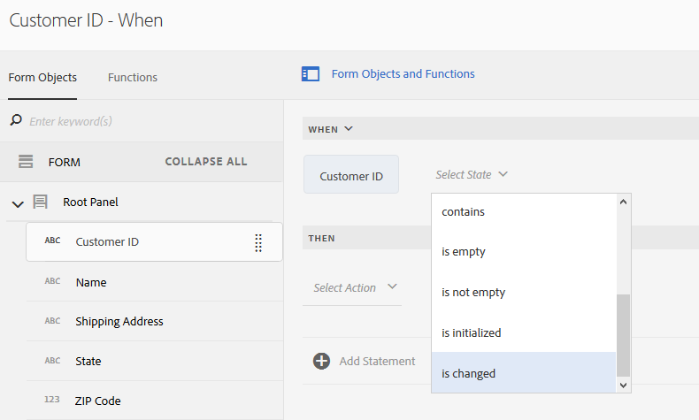

# Tutorial: Aplicar reglas a campos de formularios adaptables {#tutorial-apply-rules-to-adaptive-form-fields}


Este tutorial es un paso en la serie [Crear su primer formulario adaptable](/help/forms/using/create-your-first-adaptive-form.md). Adobe recomienda seguir la serie en secuencia cronológica para comprender, realizar y mostrar el caso de uso completo del tutorial.

## Información sobre el tutorial {#about-the-tutorial}

Puede utilizar reglas para agregar interactividad, lógica empresarial y validaciones inteligentes a un formulario adaptable. Los formularios adaptables tienen un editor de reglas integrado. El editor de reglas proporciona la funcionalidad de arrastrar y soltar, similar a las visitas guiadas. El método de arrastrar y soltar es el más rápido y sencillo para crear reglas. El editor de reglas también proporciona una ventana de código para los usuarios interesados en probar sus aptitudes de codificación o llevar las reglas al siguiente nivel.

Puede obtener más información sobre el editor de reglas en [Editor de reglas de formularios adaptables](/help/forms/using/rule-editor.md).

Al final del tutorial, aprenderá a crear reglas para lo siguiente:

* Invocar un servicio del Modelo de datos de formulario para recuperar datos de la base de datos
* Invocar un servicio del Modelo de datos de formulario para agregar datos a la base de datos
* Ejecutar una comprobación de validaciones y mostrar mensajes de error

Las imágenes interactivas GIF al final de cada sección del tutorial le ayudarán a aprender y validar la funcionalidad del formulario que cree sobre la marcha.

## Paso 1: Recuperar un registro de cliente de la base de datos {#retrieve-customer-record}

Se ha creado un modelo de datos de formulario según el artículo [Crear un modelo de datos de formulario](/help/forms/using/create-form-data-model.md). Ahora puede utilizar el editor de reglas para invocar los servicios del Modelo de datos de formulario para recuperar y agregar información a la base de datos.

A cada cliente se le asigna un número de ID de cliente único, que ayuda a identificar los datos de clientes relevantes en una base de datos. El siguiente procedimiento utiliza el ID de cliente para recuperar información de la base de datos:

1. Abra el formulario adaptable para editarlo.

   [http://localhost:4502/editor.html/content/forms/af/change-billing-shipping-address.html](http://localhost:4502/editor.html/content/forms/af/change-billing-shipping-address.html)

1. Seleccione el **[!UICONTROL ID de cliente]** y seleccione el campo **[!UICONTROL Editar reglas]** icono. Se abrirá la ventana Editor de reglas.
1. Seleccione el **[!UICONTROL + Crear]** para agregar una regla. Se abrirá el Editor visual.

   En el Editor visual, la instrucción **[!UICONTROL CUANDO]** está seleccionada de forma predeterminada. Además, el objeto de formulario (en este caso **[!UICONTROL Id. del cliente]**) desde el que se inició el Editor de reglas se especifica en la instrucción **[!UICONTROL CUANDO]**.

1. Seleccione el **[!UICONTROL Seleccionar estado]** y seleccione. **[!UICONTROL se ha cambiado]**.

   

1. En la instrucción **[!UICONTROL ENTONCES]**, seleccione **[!UICONTROL Invocar servicio]** de la lista desplegable **[!UICONTROL Seleccionar acción]**.
1. Seleccione el servicio **[!UICONTROL Recuperar dirección de envío]** de la lista desplegable **[!UICONTROL Seleccionar]**.
1. Arrastre y suelte el campo **[!UICONTROL ID del cliente]** desde el campo de la pestaña Objetos de formulario hasta el campo **[!UICONTROL Colocar objeto o seleccionar aquí]** en el cuadro de diálogo **[!UICONTROL ENTRADA]**.

   

1. Arrastre y suelte el campo **[!UICONTROL ID de cliente, nombre, dirección de envío, estado y código postal]** desde el campo de la pestaña Objetos de formulario hasta el campo **[!UICONTROL Colocar objeto o seleccionar aquí]** en el cuadro de diálogo **[!UICONTROL SALIDA]**.

   

   Seleccionar **[!UICONTROL Listo]** para guardar la regla. En la ventana del editor de reglas, seleccione **[!UICONTROL Cerrar]**.

1. Previsualice el formulario adaptable. Introduzca un ID en el campo **[!UICONTROL ID de cliente]**. El formulario ahora puede recuperar los detalles del cliente de la base de datos.

   

## Paso 2: Agregar la dirección del cliente actualizada a la base de datos {#updated-customer-address}

Una vez recuperados los detalles del cliente de la base de datos, puede actualizar la dirección de envío, el estado y el código postal. El siguiente procedimiento invoca un servicio del Modelo de datos de formulario para actualizar la información del cliente en la base de datos:

1. Seleccione el **[!UICONTROL Enviar]** y seleccione el campo **[!UICONTROL Editar reglas]** icono. Se abrirá la ventana Editor de reglas.
1. Seleccione el **[!UICONTROL Enviar: haga clic]** y seleccione la **[!UICONTROL Editar]** icono. Aparecerán las opciones para editar la regla Enviar.

   

   En la opción CUANDO, las opciones **[!UICONTROL Enviar]** y **[!UICONTROL se hace clic]** ya están seleccionadas.

   

1. En el **[!UICONTROL THEN]** , seleccione la opción **[!UICONTROL + Agregar instrucción]** opción. Seleccione **[!UICONTROL Invocar servicio]** de la lista desplegable **[!UICONTROL Seleccionar acción]**.
1. Seleccione el servicio **[!UICONTROL Actualizar dirección de envío]** de la lista desplegable **[!UICONTROL Seleccionar]**.

   

   

1. Arrastre y suelte el campo **[!UICONTROL Dirección de envío, estado y código postal]** desde la pestaña [!UICONTROL Objetos de formulario] hasta la propiedad .property correspondiente de tablename (por ejemplo, customerdetails .shippingAddress) del campo **[!UICONTROL Colocar objeto o seleccionar aquí]** en el cuadro de diálogo **[!UICONTROL ENTRADA]**. Todos los campos con el prefijo tablename (por ejemplo, los detalles del cliente en este caso de uso) sirven como datos de entrada para el servicio de actualización. Todo el contenido proporcionado en estos campos se actualiza en la fuente de datos.

   >[!NOTE]
   >
   >No arrastre y suelte los campos **[!UICONTROL Nombre]** ni **[!UICONTROL ID del cliente]** hasta la propiedad tablename.property correspondiente (por ejemplo, customerdetails.name). Ayuda a evitar actualizar el nombre y el ID del cliente por error.

1. Arrastre y suelte el campo **[!UICONTROL ID de cliente]** desde la pestaña [!UICONTROL Objetos de formulario] hasta el cuadro de diálogo **[!UICONTROL ENTRADA]**. Los campos sin un nombre de tabla prefijado (por ejemplo, detalles del cliente en este caso de uso) sirven como parámetro de búsqueda para el servicio de actualización. El campo **[!UICONTROL ID]** en este caso de uso identifica de forma exclusiva un registro de la tabla **detalles del cliente**.
1. Seleccionar **[!UICONTROL Listo]** para guardar la regla. En la ventana del editor de reglas, seleccione **[!UICONTROL Cerrar]**.
1. Previsualice el formulario adaptable. Recuperar detalles de un cliente, actualizar la dirección de envío y enviar el formulario. Cuando recupere los detalles del mismo cliente de nuevo, se mostrará la dirección de envío actualizada.

## Paso 3: (Sección bonus) Utilice el editor de código para ejecutar las validaciones y mostrar los mensajes de error {#step-bonus-section-use-the-code-editor-to-run-validations-and-display-error-messages}

Debe ejecutar la validación en el formulario para asegurarse de que los datos introducidos en el formulario son correctos y se mostrará un mensaje de error si hay datos incorrectos. Por ejemplo, si se introduce un ID De un cliente no existente en el formulario, se mostrará un mensaje de error.

Los formularios adaptables proporcionan varios componentes con validaciones integradas, por ejemplo, campos numéricos y de correo electrónico que se pueden utilizar para casos de uso comunes. Utilice el editor de reglas para casos de uso avanzados, por ejemplo, para mostrar un mensaje de error cuando la base de datos devuelva registros cero (0) (sin registros).

El siguiente procedimiento muestra cómo crear una regla para mostrar un mensaje de error si el ID del cliente introducido en el formulario no existe en la base de datos. La regla también lleva se centra en y restablece el campo **[!UICONTROL ID del cliente]**. La regla utiliza [la API dataIntegrationUtils del servicio del modelo de datos de formulario](/help/forms/using/invoke-form-data-model-services.md) para comprobar si el ID de cliente existe en la base de datos.

1. Seleccione el **[!UICONTROL ID de cliente]** y seleccione el campo `Edit Rules` icono. Se abrirá la ventana [!UICONTROL Editor de reglas].
1. Seleccione el **[!UICONTROL + Crear]** para agregar una regla. Se abrirá el Editor visual.

   En el Editor visual, la instrucción **[!UICONTROL CUANDO]** está seleccionada de forma predeterminada. Además, el objeto de formulario (en este caso **[!UICONTROL Id. del cliente]**) desde el que se inició el Editor de reglas se especifica en la instrucción **[!UICONTROL CUANDO]**.

1. Seleccione el **[!UICONTROL Seleccionar estado]** y seleccione. **[!UICONTROL se ha cambiado]**.

   

   En la instrucción **[!UICONTROL ENTONCES]**, seleccione **[!UICONTROL Invocar servicio]** de la lista desplegable **[!UICONTROL Seleccionar acción]**.

1. Cambie de **[!UICONTROL Editor visual]** a **[!UICONTROL Editor de código]**. El interruptor de control se encuentra en el lado derecho de la ventana. Se abre el Editor de código, que muestra código similar al siguiente:

   

1. Reemplace la sección de la variable de entrada con el siguiente código:

   ```javascript
   var inputs = {
       "id" : this
   };
   ```

1. Sustituya la sección `guidelib.dataIntegrationUtils.executeOperation (operationInfo, inputs, outputs)` por el siguiente código:

   ```javascript
   guidelib.dataIntegrationUtils.executeOperation(operationInfo, inputs, outputs, function (result) {
     if (result) {
         result = JSON.parse(result);
       customer_Name.value = result.name;
       customer_Shipping_Address = result.shippingAddress;
     } else {
       if(window.confirm("Invalid Customer ID. Provide a valid customer ID")) {
             customer_Name.value = " ";
            guideBridge.setFocus(customer_ID);
       }
     }
   });
   ```

1. Previsualice el formulario adaptable. Introduzca un ID de cliente incorrecto. Aparecerá un mensaje de error.

   
