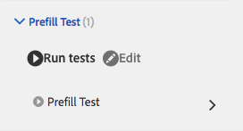

# Automatizar las pruebas de formularios adaptables{#automate-testing-of-adaptive-forms}

## Información general {#overview}

Los formularios adaptables son integrales en las interacciones de los clientes. Es importante probar los formularios adaptables con cada cambio que realice en ellos, como cuando se despliega un nuevo paquete de correcciones o se cambia una regla del formulario. Sin embargo, las pruebas funcionales de los formularios adaptables y de todos los campos que contienen pueden ser tediosos.

Calvin le permite automatizar las pruebas de sus formularios adaptables en el explorador web. Calvin utiliza la interfaz de usuario de [Hobbes](/help/sites-developing/hobbes.md) para ejecutar las pruebas y proporciona las siguientes herramientas:

* Una API de JavaScript para crear pruebas.
* Una interfaz de usuario para ejecutar pruebas.

Con Calvin, puede crear casos de prueba en CRXDE y ejecutar pruebas de IU directamente en el explorador web para probar a fondo los siguientes aspectos de sus formularios adaptables:

<table>
 <tbody>
  <tr>
   <td><strong>Aspecto del formulario adaptable a la prueba</strong></td>
   <td><strong>Descripción</strong></td>
  </tr>
  <tr>
   <td>Experiencia de cumplimentación previa de un formulario adaptable</td>
   <td>
    <ul>
     <li>¿El formulario se rellena previamente como se espera en función del tipo de modelo de datos?</li>
     <li>¿Los valores predeterminados de los objetos de formulario se van a rellenar previamente como se espera?</li>
    </ul> </td>
  </tr>
  <tr>
   <td>Enviar experiencia de un formulario adaptable</td>
   <td>
    <ul>
     <li>¿Se generan datos correctos en el envío?</li>
     <li>¿Se está revalidando el formulario en el servidor durante el envío?</li>
     <li>¿La acción de envío está configurada para el formulario que se está ejecutando?</li>
    </ul> </td>
  </tr>
  <tr>
   <td><p>Reglas de expresión</p> <p> </p> </td>
   <td>
    <ul>
     <li>¿Las expresiones asociadas con objetos de formulario, como calculate, están visibles, ejecutan secuencias de comandos después de salir de un campo, y se ejecutan después de realizar las operaciones de IU relevantes?<br /> </li>
    </ul> </td>
  </tr>
  <tr>
   <td>Validaciones</td>
   <td>
    <ul>
     <li>¿Las validaciones de campos se ejecutan según lo esperado después de realizar las operaciones?</li>
    </ul> </td>
  </tr>
  <tr>
   <td><p>Carga diferida</p> <p> </p> </td>
   <td>
    <ul>
     <li>Al hacer clic en pestañas (o en cualquier elemento de navegación de un panel), ¿se recupera el HTML del servidor según la configuración de carga diferida?</li>
    </ul></td>
  </tr>
  <tr>
   <td><p>Interacción con la interfaz de usuario</p> </td>
   <td>
    <ul>
     <li><a href="https://helpx.adobe.com/aem-forms/6-3/calvin-sdk-javascript-api/calvin.html#toc2__anchor" target="_blank">Prueba de la interacción de la interfaz de usuario con los objetos de formulario adaptable</a></li>
    </ul> </td>
  </tr>
 </tbody>
</table>

### Requisitos previos {#prerequisites}

Antes de usar este artículo para crear los casos de prueba, debe saber lo siguiente:

* Creación de grupos de pruebas y ejecución de casos de prueba utilizando [Hobbes](https://docs.adobe.com/docs/en/aem/6-3/develop/components/hobbes.html)
* [API de JavaScript de Hobbes](https://docs.adobe.com/docs/en/aem/6-2/develop/ref/test-api/index.html)
* [API de JavaScript de Calvin](https://helpx.adobe.com/aem-forms/6-3/calvin-sdk-javascript-api/calvin.html)

## Ejemplo: Crear un grupo de pruebas para un formulario adaptable utilizando Hobbes como marco de pruebas {#example-create-a-test-suite-for-an-adaptive-form-using-hobbes-as-testing-framework}

El siguiente ejemplo lo acompaña durante la creación de un grupo de pruebas para probar varios formularios adaptables. Debe crear un caso de prueba independiente para cada formulario que necesite probar. Si sigue pasos similares a los siguientes y modifica el código JavaScript en el paso 11, puede crear su propio grupo de pruebas para probar los formularios adaptables.

1. Vaya al CRXDE Lite en el explorador web: `https://'[server]:[port]'/crx/de`.
1. Haga clic con el botón derecho en la subcarpeta /etc/clientlibs y haga clic en **Crear** > **Crear nodo**. Escriba un nombre (aquí afTestRegistration), especifique el tipo de nodo como cq:ClientLibraryFolder y haga clic en **Aceptar.**

   La carpeta clientlibs contiene el aspecto de registro de su aplicación (JS e Init). Se recomienda registrar todos los objetos de grupos de pruebas de Hobbes específicos de un formulario en la carpeta clientlibs .

1. Especifique los siguientes valores de propiedad en el nodo recién creado (aquí afTestRegistration) y haga clic en **Guardar todo**. Estas propiedades ayudan a Hobbes a reconocer la carpeta como una prueba. Para reutilizar esta biblioteca de cliente como dependencia en otras bibliotecas de cliente, asígnele el nombre granite.testing.calvin.testing.

<table>
 <tbody>
  <tr>
   <td>Propiedad</td>
   <td>Tipo</td>
   <td>Value</td>
  </tr>
  <tr>
   <td><p>categorías</p> </td>
   <td><p>Cadena[]</p> </td>
   <td><p>granite.testing.hobbes.testing, granite.testing.calvin.testing</p> </td>
  </tr>
  <tr>
   <td><p>dependencias</p> </td>
   <td><p>Cadena[]</p> </td>
   <td><p>granite.testing.hobbes.testrunner, granite.testing.calvin, apps.testframework.all</p> </td>
  </tr>
 </tbody>
</table>

>[!NOTE]
>
>La clientlib granite.testing.calvin.af contiene todas las API de formularios adaptables. Estas API forman parte del espacio de nombres de llamadas.


1. Haga clic con el botón derecho en el nodo de prueba (aquí **afTestRegistration)** y, a continuación, haga clic en **Crear** > **Crear archivo**. Asigne un nombre al archivo js.txt y haga clic en **OK**.
1. En el archivo js.txt , agregue el siguiente texto:

   ```javascript
   #base=.
   js.txt
   ```

1. Haga clic en **Guardar todo** y cierre el archivo js.txt.
1. Haga clic con el botón derecho en el nodo de prueba (aquí **afTestRegistration)** y haga clic en **Crear** > **Crear archivo**. Asigne un nombre al archivo init.js y haga clic en **OK**.
1. Copie el siguiente código al archivo init.js y haga clic en **Guardar todo**:

   ```javascript
   (function(window, hobs) {
       'use strict';
       window.testsuites = window.testsuites || {};
     // Registering the test form suite to the sytem
     // If there are other forms, all registration should be done here
       window.testsuites.testForm = new hobs.TestSuite("Adaptive Form - Demo Test", {
           path: '/etc/clientlibs/afTestRegistration/init.js',
           register: true
       });
    // window.testsuites.testForm1 = new hobs.TestSuite("testForm1");
   }(window, window.hobs));
   ```

   El código anterior crea un grupo de pruebas denominado **Formulario adaptable - Prueba de demostración**. Para crear un grupo de pruebas con un nombre diferente, cambie el nombre en consecuencia.

1. Haga clic en **Crear** > **Crear nodo** para crear un nodo en la carpeta clientlib para cada formulario que desee probar. En este ejemplo se utiliza un nodo denominado **testForm** para probar un formulario adaptable denominado **testForm**. Especifique las siguientes propiedades y haga clic en **OK**:

   * Nombre: testForm (su nombre de formulario)
   * Tipo: cq:ClientLibraryFolder

1. Agregue las siguientes propiedades al nodo recién creado (aquí testForm) para probar un formulario adaptable:

   | **Propiedad** | **Tipo** | **Value** |
   |---|---|---|
   | categorías | Cadena[] | granite.testing.hobbes.testing, granite.testing.hobbes.testing.testForm |
   | dependencias | Cadena[] | granite.testing.calvin.tests |

   >[!NOTE]
   >
   >Este ejemplo utiliza una dependencia de la biblioteca cliente granite.testing.calvin.testing para una mejor administración. En este ejemplo también se agrega una categoría de biblioteca de cliente, &quot;granite.testing.hobbes.testing.testForm&quot;, para reutilizar esta biblioteca de cliente, si es necesario.

   

1. Haga clic con el botón derecho en la carpeta que ha creado para el formulario de prueba (aquí testForm) y seleccione **Create** > **Create File**. Asigne un nombre al archivo scriptingTest.js y añada el siguiente código al archivo y haga clic en **Guardar todo.**

   Para utilizar el siguiente código para probar otro formulario adaptable, cambie la ruta y el nombre del formulario en **navegarTo** (líneas 11, 36 y 62) y los respectivos casos de prueba. Para obtener más información sobre las API para probar diferentes aspectos de los formularios y los objetos de formulario, consulte [API de Calvin](https://helpx.adobe.com/aem-forms/6-3/calvin-sdk-javascript-api/calvin.html).

   ```javascript
   (function(window, hobs) {
       'use strict';
   
    var ts = new hobs.TestSuite("Script Test", {
           path: '/etc/clientlibs/testForm/scriptingTest.js',
     register: false
    })
   
       .addTestCase(new hobs.TestCase("Checking execution of calculate script")
           // navigate to the testForm which is to be tested
           .navigateTo("/content/forms/af/testForm.html?wcmmode=disabled")
           // check if adaptive form is loaded
           .asserts.isTrue(function () {
               return calvin.isFormLoaded()
           })
           .execSyncFct(function () {
               // create a spy before checking for the expression
               calvin.spyOnExpression("panel1.textbox1");
               // setValue would trigger enter, set the value and exit from the field
               calvin.setValueInDOM("panel1.textbox", "5");
           })
           // if the calculate expression was setting "textbox1" value to "5", let's also check that
           .asserts.isTrue(function () {
               return calvin.isExpressionExecuted("panel1.textbox1", "Calculate");
           })
           .execSyncFct(function () {
               calvin.destroySpyOnExpression("panel1.textbox1");
           })
           .asserts.isTrue(function () {
               return calvin.model("panel1.textbox1").value == "5"
           })
       )
   
       .addTestCase(new hobs.TestCase("Calculate script Test")
           // navigate to the testForm which is to be tested
           .navigateTo("/content/forms/af/cal/demoform.html?wcmmode=disabled&dataRef=crx:///content/forms/af/cal/prefill.xml")
           // check if adaptive form is loaded
           .asserts.isTrue(function () {
               return calvin.isFormLoaded()
           })
   
           .execSyncFct(function () {
               // create a spy before checking for the expression
               calvin.spyOnExpression("panel2.panel1488218690733.downPayment");
               // setValue would trigger enter, set the value and exit from the field
               calvin.setValueInDOM("panel2.panel1488218690733.priceProperty", "1000000");
           })
           .asserts.isTrue(function () {
               return calvin.isExpressionExecuted("panel2.panel1488218690733.downPayment", "Calculate");
           })
           .execSyncFct(function () {
               calvin.destroySpyOnExpression("panel2.panel1488218690733.downPayment");
           })
           .asserts.isTrue(function () {
               // if the calculate expression was setting "downPayment" value to "10000", let's also check that
      return calvin.model("panel2.panel1488218690733.downPayment").value == 10000
           })
       )
   
       .addTestCase(new hobs.TestCase("Checking execution of Value commit script")
           // navigate to the testForm which is to be tested
           .navigateTo("/content/forms/af/cal/demoform.html?wcmmode=disabled&dataRef=crx:///content/forms/af/cal/prefill.xml")
           // check if adaptive form is loaded
           .asserts.isTrue(function () {
               return calvin.isFormLoaded()
           })
   
           .execSyncFct(function () {
               // create a spy before checking for the expression
               calvin.spyOnExpression("panel2.panel1488218690733.priceProperty");
               // setValue would trigger enter, set the value and exit from the field
               calvin.setValueInDOM("panel2.panel1488218690733.priceProperty", "100");
           })
           .asserts.isTrue(function () {
               return calvin.isExpressionExecuted("panel2.panel1488218690733.priceProperty", "Value Commit");
           })
           .execSyncFct(function () {
               calvin.destroySpyOnExpression("panel2.panel1488218690733.priceProperty");
           })
           .asserts.isTrue(function () {
            // if the value commit expression was setting "textbox1488215618594" value to "0", let's also check that
               return calvin.model("panel2.panel1488218690733.textbox1488215618594").value == 0
           })
       );
   
    // register the test suite with testForm
     window.testsuites.testForm.add(ts);
   
    }(window, window.hobs));
   ```

   Se crea el caso de prueba. Continúe ejecutando el caso de prueba para probar los formularios adaptables a través de Hobbes. Para ver los pasos para ejecutar los casos de prueba, consulte [Ejecución de pruebas en la prueba de la interfaz de usuario mediante pruebas automatizadas](/help/sites-developing/hobbes.md).

También puede instalar el paquete en el archivo adjunto SampleTestPackage.zip para obtener los mismos resultados que con los pasos descritos en Ejemplo: Cree un grupo de pruebas para un formulario adaptable usando Hobbes como marco de pruebas.

[Obtener archivo](assets/sampletestpackage.zip)

## Pruebas de la interfaz de usuario mediante las pruebas automatizadas {#testing-your-ui-using-automated-tests}

### Ejecución de un único grupo de pruebas {#running-a-single-test-suite}

Los grupos de pruebas se pueden ejecutar individualmente. Cuando ejecuta un grupo de pruebas, la página cambia a medida que se ejecutan los casos de prueba y sus acciones y los resultados aparecen después de completar la prueba. Los iconos indican los resultados.

Un icono de marca de verificación indica una prueba pasada: 

El icono &quot;X&quot; indica una prueba fallida: 

Para ejecutar un grupo de pruebas:

1. En el panel Pruebas, toque o haga clic en el nombre del caso de prueba que desea ejecutar para expandir los detalles de las acciones.

   

1. Toque o haga clic en el botón Ejecutar pruebas . 

   

1. El marcador de posición se reemplaza por el contenido de la página a medida que se ejecuta la prueba.

   

1. Revise los resultados del caso de prueba tocando o haciendo clic en la descripción para abrir el panel Resultado. Al tocar o hacer clic en el nombre del caso de prueba en el panel Resultado se muestran todos los detalles.

   

Los pasos para probar los formularios adaptables AEM son similares a los pasos para probar la IU de AEM. Para obtener más información sobre la prueba de los formularios adaptables, consulte los temas siguientes en [Prueba de la IU](https://helpx.adobe.com//experience-manager/6-3/help/sites-developing/hobbes.html):

* Visualización de grupos de pruebas
* Ejecución de varias pruebas

## Glosario {#glossary}

<table>
 <tbody>
  <tr>
   <td><strong>Término</strong></td>
   <td><strong>Descripción</strong></td>
  </tr>
  <tr>
   <td><p>Conjunto de pruebas</p> </td>
   <td><p>Un grupo de pruebas es una colección de casos de prueba relacionados.</p> </td>
  </tr>
  <tr>
   <td><p>Caso de prueba</p> </td>
   <td><p>Un caso de prueba representa una tarea que un usuario realiza mediante su interfaz de usuario. Agregue casos de prueba a su grupo de pruebas para probar las actividades que realizan los usuarios.</p> </td>
  </tr>
  <tr>
   <td><p>Acciones</p> </td>
   <td><p>Las acciones son métodos que realizan un gesto en la interfaz de usuario, como hacer clic en un botón o rellenar un cuadro de entrada con un valor.</p> <p>Los métodos de las clases hobs.actions.Asserts, hobs.actions.Core y hobs.utils.af son acciones que puede utilizar en las pruebas. Todas las acciones se ejecutan sincrónicamente.</p> </td>
  </tr>
  <tr>
   <td><p>Creación o publicación de un entorno</p> </td>
   <td><p>En general, los formularios se pueden probar en un entorno de creación o publicación. En el caso del entorno de publicación, de forma predeterminada, el acceso para ejecutar la prueba está restringido. Esto se debe a que todas las bibliotecas de cliente relacionadas con el runner de prueba se encuentran dentro de /libs en la estructura JCR.</p> </td>
  </tr>
 </tbody>
</table>

