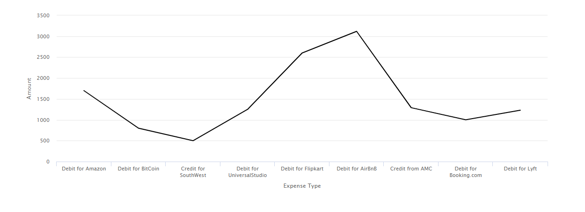
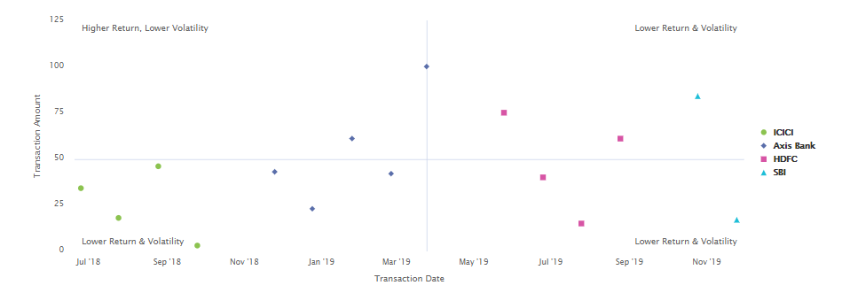

# Uso de gráficos en Interactive Communications{#using-charts-in-interactive-communications}

Un gráfico o un gráfico es una representación visual de los datos. Condensa grandes cantidades de información en un formato visual fácil de entender, lo que permite a los destinatarios de la Comunicación interactiva visualizar, interpretar y analizar mejor los datos complejos.

Al crear una comunicación interactiva, puede agregar gráficos para representar visualmente datos bidimensionales del modelo de datos de formulario de la comunicación interactiva. El componente Gráfico permite agregar y configurar los siguientes tipos de gráficos: Circular, Columna, Cuadrante, Cuadrante, Línea y Punto, Punto, Área y Cuadrante.

## Agregar y configurar gráficos en una comunicación interactiva {#add-and-configure-chart-in-an-interactive-communication}

Realice los siguientes pasos para agregar y configurar un gráfico en una comunicación interactiva:

1. Toque **Componentes** desde la barra de tareas de la comunicación interactiva.
1. Arrastre y suelte el componente **Gráfico** en uno de los siguientes componentes:

   * Canal de impresión: Área de destino o campo de imagen
   * Canal web: Panel o área de Target

1. Toque el componente de gráfico en el editor de comunicación interactiva y seleccione **[!UICONTROL Configurar (]** configure_icon ) en la barra de herramientas Componente.

   Las Propiedades del gráfico se muestran en el panel izquierdo.

   

   Propiedades básicas de un gráfico de tipo de línea en el canal de impresión

   

   Propiedades básicas de un gráfico de tipo de línea en el canal web

1. Configure las propiedades [del](../../forms/using/chart-component-interactive-communications.md#configure-chart-properties) gráfico en función del tipo de canal.
1. (Solo canal de impresión) En la Configuración **[!UICONTROL del]** agente, especifique si es obligatorio que el agente utilice este gráfico. Si la opción **[!UICONTROL t es obligatorio para que el agente utilice este gráfico]** no está seleccionada, el agente puede tocar el icono de ojo del gráfico en la ficha **[!UICONTROL Contenido]** de la interfaz de usuario del agente para mostrar u ocultar el gráfico.

   

1. Toque  para guardar las propiedades del gráfico.

   Toque **[!UICONTROL Vista previa]** para ver el aspecto y los datos asociados con el gráfico. Toque **[!UICONTROL Editar]** para volver a configurar las propiedades del gráfico.

## Configuración de las propiedades del gráfico {#configure-chart-properties}

Configure las siguientes propiedades al crear gráficos para canales web e impresos:

<table>
 <tbody>
  <tr>
   <td>Campo</td>
   <td>Descripción</td>
   <td>Tipo de canal</td>
  </tr>
  <tr>
   <td>Nombre</td>
   <td>Identificador del elemento de gráfico. El nombre del gráfico especificado en este campo no está visible en el gráfico. Se utiliza para hacer referencia al elemento desde otros componentes, secuencias de comandos y expresiones SOM.</td>
   <td>Imprimir y Web</td>
  </tr>
  <tr>
   <td>Tipo de gráfico</td>
   <td>Tipo de gráfico que desea generar. Las opciones disponibles son circular, columna, anillo, barra, línea, línea y punto, punto y área.</td>
   <td>Imprimir y Web</td>
  </tr>
  <tr>
   <td>Serie &gt; Varias series</td>
   <td>Seleccione esta opción para agregar varias series para los elementos de recopilación del modelo de datos de formulario trazados en los ejes X e Y.</td>
   <td>Imprimir y Web</td>
  </tr>
  <tr>
   <td>Serie &gt; Objeto del modelo de datos</td>
   <td>Nombre del elemento de recopilación del modelo de datos de formulario para agregar varias series al gráfico.<br /> Elija una propiedad de objeto del modelo de datos de formulario principal para las propiedades trazadas en los ejes X e Y para formar una serie significativa. El objeto del modelo de datos que se enlace debe ser de tipo Número, Cadena o Fecha.</td>
   <td>Imprimir y Web</td>
  </tr>
  <tr>
   <td>Mostrar apilados</td>
   <td>Seleccione para apilar los valores de cada serie uno encima de otro.</td>
   <td>Imprimir y Web</td>
  </tr>
  <tr>
   <td>Eje X &gt; Título</td>
   <td>Título del eje X.</td>
   <td>Imprimir y Web</td>
  </tr>
  <tr>
   <td>Eje X &gt; Objeto del modelo de datos</td>
   <td><p>Nombre del elemento de recopilación del modelo de datos de formulario que se va a trazar en el eje X.</p> <p>Elija dos propiedades de colección/tipo de matriz del mismo objeto del modelo de datos principal que sean significativas en relación mutua para trazar en los ejes X e Y de un gráfico. El objeto del modelo de datos que se enlace debe ser de tipo Número, Cadena o Fecha.</p> </td>
   <td>Imprimir y Web</td>
  </tr>
  <tr>
   <td>Eje Y &gt; Título</td>
   <td>Título para el eje Y. </td>
   <td>Imprimir y Web</td>
  </tr>
  <tr>
   <td>Eje Y &gt; Objeto del modelo de datos</td>
   <td><p>Elemento de recopilación del modelo de datos de formulario que se va a trazar en el eje Y. En el canal Imprimir, el objeto del modelo de datos para el eje Y debe ser del tipo Número.</p> <p>Elija dos propiedades de colección/tipo de matriz del mismo objeto del modelo de datos principal que sean significativas en relación mutua para trazar en los ejes X e Y de un gráfico. </p> </td>
   <td>Imprimir y Web</td>
  </tr>
  <tr>
   <td>Eje Y &gt; Función</td>
   <td>Función estadística/personalizada que se utilizará para calcular los valores en el eje Y.</td>
   <td>Imprimir y Web</td>
  </tr>
  <tr>
   <td>Ocultar objeto</td>
   <td>Seleccione esta opción para ocultar el gráfico en el resultado final.</td>
   <td>Imprimir y Web</td>
  </tr>
  <tr>
   <td>Título</td>
   <td>Título del gráfico. </td>
   <td>Imprimir</td>
  </tr>
  <tr>
   <td>Altura</td>
   <td>Altura del gráfico en píxeles.</td>
   <td>Imprimir</td>
  </tr>
  <tr>
   <td>Anchura</td>
   <td>Anchura del gráfico en píxeles. Puede controlar la anchura del gráfico en el canal web mediante la capa de estilo o aplicando un tema.</td>
   <td>Imprimir</td>
  </tr>
  <tr>
   <td>Salto de página obligatorio antes de</td>
   <td>Seleccione esta opción para agregar un salto de página obligatorio antes del gráfico y colocar el gráfico en la parte superior de una nueva página. </td>
   <td>Imprimir</td>
  </tr>
  <tr>
   <td>Salto de página obligatorio después de</td>
   <td>Seleccione esta opción para agregar un salto de página obligatorio después del gráfico y coloque el contenido que sigue al gráfico en la parte superior de una nueva página. </td>
   <td>Imprimir</td>
  </tr>
  <tr>
   <td>Sangría</td>
   <td>Sangría del gráfico desde la izquierda de la página. </td>
   <td>Imprimir</td>
  </tr>
  <tr>
   <td>Información de objeto</td>
   <td><p>Formato en el que la información de objeto aparece al pasar el ratón sobre un punto de datos en el gráfico del canal web. El valor predeterminado es ${x}(${y}). Según el tipo de gráfico, cuando se señala el ratón en un punto, una barra o una fracción del gráfico, las variables ${x} y ${y} se reemplazan dinámicamente con los valores correspondientes en los ejes X e Y y se muestran en la información del objeto.</p> <p>Para desactivar la información del objeto, deje el campo <span class="uicontrol">Información del objeto</code> en blanco. Esta opción no se aplica a los gráficos de líneas y áreas. Por ejemplo, consulte <a href="../../forms/using/chart-component-interactive-communications.md#main-pars-header-e1f6">Ejemplo 1: Salida de gráfico en impresión y Web</a>.</code></p> </td>
   <td>Web</td>
  </tr>
  <tr>
   <td>Configuraciones específicas del gráfico</td>
   <td><p>Además de las configuraciones comunes, están disponibles las siguientes configuraciones específicas del gráfico:</p>
    <ul>
     <li><strong>Mostrar leyenda: </strong>Muestra una leyenda para el gráfico circular o circular cuando está activada.</li>
     <li><strong>Posición de leyenda: </strong>Especifica la posición de la leyenda con respecto al gráfico. Las opciones disponibles son Derecha, Izquierda, Superior e Inferior. Se recomienda utilizar la leyenda del lado derecho en el canal de impresión.</li>
     <li><strong>Radio interior</strong>: Disponible para gráficos circulares para especificar el radio (en píxeles) del círculo interior del gráfico.</li>
     <li><strong>Color</strong>de línea: Disponible para gráficos de líneas, líneas y puntos y áreas para especificar el color de la línea en el gráfico.</li>
     <li><strong>Color</strong>del punto: Disponible para gráficos de puntos y líneas y puntos para especificar el color de los puntos del gráfico.<br /> </li>
     <li><strong>Color</strong>de área: Disponible para gráficos de área para especificar el color del área bajo la línea en el gráfico.</li>
     <li><strong>Punto de referencia &gt; Tipo de enlace: </strong>Disponible para gráficos de cuadrantes para<strong> </strong>especificar el tipo de enlace para el punto de referencia. Utilice la propiedad de objeto de texto estático o modelo de datos para definir el valor del punto de referencia.</li>
     <li><strong>Punto de referencia &gt; Eje X: </strong>Disponible para gráficos de cuadrantes si selecciona <span class="uicontrol">Estático</code> en la lista desplegable Tipo de enlace para especificar el valor del eje X para el punto de referencia.</code></li>
     <li><strong>Punto de referencia &gt; Eje Y: </strong>Disponible para gráficos de cuadrantes si selecciona <span class="uicontrol">Estático</code> en la lista desplegable Tipo de enlace para especificar el valor del eje Y para el punto de referencia.</code></li>
     <li><strong>Punto de referencia &gt; Objeto de modelo de datos para serie: </strong>Disponible para varios gráficos de cuadrantes de serie si selecciona Objeto <span class="uicontrol">de modelo de</code> datos en la lista desplegable Tipo de enlace. Defina la propiedad del objeto del modelo de datos de formulario para identificar la serie del punto de referencia. </code></li>
     <li><strong>Punto de referencia &gt; Valor del objeto del modelo de datos para la serie: </strong>Disponible para varios gráficos de cuadrantes de serie si selecciona Objeto <span class="uicontrol">de modelo de</code> datos en la lista desplegable Tipo de enlace. Utilice la propiedad de objeto del modelo de datos de formulario para series y el valor definido en este campo para identificar la serie para el punto de referencia.</code></li>
     <li><strong>Punto de referencia &gt; Objeto de modelo de datos para punto de referencia: </strong>Disponible para gráficos de cuadrantes si selecciona Objeto <span class="uicontrol">de modelo de</code> datos en la lista desplegable Tipo de enlace. Defina una propiedad de objeto del modelo de datos de formulario que sea similar a las propiedades trazadas en los ejes X e Y. Además, para varias series, defina una propiedad de objeto de modelo de datos que sea una entidad secundaria de la propiedad de objeto de modelo de datos definida para la serie.</code></li>
     <li><strong>Punto de referencia &gt; Valor del objeto del modelo de datos para el punto de referencia: </strong>Disponible para gráficos de cuadrantes si selecciona Objeto <span class="uicontrol">de modelo de</code> datos en la lista desplegable Tipo de enlace. Utilice la propiedad del objeto del modelo de datos de formulario para el punto de referencia y el valor definido en este campo para identificar el punto de referencia del gráfico.<br /><strong> Etiquetas </strong>de cuadrante &gt; Superior izquierda: Disponible para gráficos de cuadrantes para especificar el nombre del cuadrante superior izquierdo.</code></li>
     <li><strong></strong> Rótulos de cuadrante &gt; Superior derecha: Disponible para gráficos de cuadrantes para especificar el nombre del cuadrante superior derecho.</li>
     <li><strong>Rótulos de cuadrante &gt; Inferior derecha: </strong>Disponible para gráficos de cuadrantes para especificar el nombre del cuadrante inferior derecho.</li>
     <li><strong>Rótulos de cuadrante &gt; Inferior izquierda: </strong>Disponible para gráficos de cuadrantes para especificar el nombre del cuadrante inferior izquierdo.</li>
    </ul> </td>
   <td>Imprimir y Web</td>
  </tr>
 </tbody>
</table>

## Usar funciones en el gráfico {#use-functions-in-chart}

Puede configurar un gráfico para que utilice funciones estadísticas a fin de calcular los valores de los datos de origen para trazar en el gráfico. Mediante la aplicación de funciones en un gráfico, puede trazar datos que el modelo de datos de formulario no proporciona directamente.


Aunque el componente Gráfico incluye algunas funciones integradas, puede escribir funciones [](../../forms/using/chart-component-interactive-communications.md#main-pars-header-473010287) personalizadas y hacerlas disponibles para su uso en la configuración de gráficos del canal Web.

Las siguientes funciones están disponibles de forma predeterminada con el componente Gráfico:

**Media (Promedio)** Devuelve la media de los valores en los ejes X o Y de un valor determinado en el otro eje.

**Suma** Devuelve la suma de todos los valores del eje X o Y para un valor determinado del otro eje.

**Máximo** Devuelve el máximo de los valores del eje X o Y para un valor determinado del otro eje.

**Frecuencia** Devuelve el número de valores en el eje X o Y para un valor determinado en el otro eje.

**Intervalo** Devuelve la diferencia entre el máximo y el mínimo de los valores en los ejes X e Y para un valor determinado en el otro eje.

**Mediana** Devuelve el valor que separa los valores más altos e inferiores a la mitad en el eje X o Y para un valor determinado en el otro eje.

**Mínimo** Devuelve el mínimo de los valores del eje X o Y para un valor determinado del otro eje.

**Modo** Devuelve el valor con la mayoría de las incidencias en los ejes X e Y de un valor determinado en el otro eje.

Para obtener más información, consulte [Ejemplo 2: Aplicación de las funciones Suma y Frecuencia en un gráfico](../../forms/using/chart-component-interactive-communications.md#main-pars-header-ae38)de líneas.

### Funciones personalizadas en el canal web {#customfunctionsweb}

Además de utilizar las funciones predeterminadas en los gráficos, puede escribir funciones personalizadas en JavaScript™ y hacerlas disponibles en la lista de funciones del componente Gráfico para el canal Web.

Una función toma una matriz o valores y un nombre de categoría como entradas y devuelve un valor. Por ejemplo:

```
Multiply(valueArray, category) {
 var val = 1;
 _.each(valueArray, function(value) {
 val = val * value;
 });
 return val;
}
```

Una vez que haya escrito una función personalizada, haga lo siguiente para que esté disponible para su uso en la configuración del gráfico:

1. Agregue la función personalizada en la biblioteca del cliente asociada con la comunicación interactiva pertinente. Para obtener más información, consulte [Configuración de la acción](/help/forms/using/configuring-submit-actions.md) Enviar y [Uso de bibliotecas](/help/sites-developing/clientlibs.md)del lado del cliente.

1. Para mostrar la función personalizada en la lista desplegable Función, en CRXDe Lite, cree un `nt:unstructured` nodo en la carpeta de aplicaciones con las siguientes propiedades:

   * Agregue la propiedad `guideComponentType` con el valor como `fd/af/reducer`. (obligatorio)

   * Agregue la propiedad `value` a un nombre completo de la función personalizada de JavaScript™. (obligatorio) y establezca su valor en el nombre de la función personalizada, como Multiplicar.
   * Agregue una propiedad `jcr:description` con el valor que desea mostrar como nombre de la función personalizada que aparece en la lista desplegable Función. Por ejemplo, **Multiplicar**.

   * Agregue una propiedad `qtip` con un valor que describa brevemente la función personalizada. Aparece como información de objeto al pasar el puntero sobre el nombre de la función en la lista desplegable **Función** .

1. Haga clic en **Guardar todo** para guardar la configuración.

La función ahora está disponible para su uso en el gráfico.

## Ejemplo 1: Salida de gráfico en impresión y Web {#chartoutputprintweb}

En la ficha Básico, se define el tipo de gráfico, las propiedades del modelo de datos del formulario de origen que contienen datos, las etiquetas que se van a trazar en los ejes X e Y del gráfico y, opcionalmente, la función estadística para calcular los valores para trazar en el gráfico.

Comprendamos en detalle la información mínima requerida en las propiedades básicas, con la ayuda de una declaración de tarjeta generada mediante una comunicación interactiva. Considere que desea generar un gráfico que muestre la cantidad de gastos diferentes en el estado. Desea utilizar diferentes tipos de gráficos para impresión y salida web de la Comunicación interactiva.

### Gráfico de columnas para imprimir {#columnchartprint}

Para ello, especifique las siguientes propiedades:

* **[!UICONTROL Nombre]** : especifique el nombre del gráfico.
* **[!UICONTROL Tipo]** de gráfico: seleccione **Columna** en la lista desplegable.
* **[!UICONTROL Título]** : especifique el tipo de gasto para el eje X y el importe de transacción para el eje Y.
* **[!UICONTROL Objetos]** del modelo de datos: seleccione las propiedades del objeto del modelo de datos para crear enlaces de datos para los ejes X (Tipo de gasto) e Y (Importe de transacción).


Gráfico de columnas en el canal de impresión de una comunicación interactiva

### Gráfico circular para Web {#donutchartweb}

Para ello, especifique las siguientes propiedades:

* **[!UICONTROL Nombre]** : especifique el nombre del gráfico.
* **[!UICONTROL Tipo]** de gráfico: seleccione **[!UICONTROL Salida]** en la lista desplegable.
* **[!UICONTROL Objetos]** del modelo de datos: seleccione las propiedades del objeto del modelo de datos para crear enlaces de datos para los ejes X (Tipo de gasto) e Y (Importe de transacción).
* **[!UICONTROL Radio]** interior: especifique el valor del radio interior como 150 para especificar el radio (en píxeles) del círculo interior en el gráfico.
* **[!UICONTROL Información de objeto]** : use el formato predeterminado ${x}(${y}) para mostrar la información de objeto. La información sobre herramientas se muestra como: Tipo de Gasto (Importe de Transacción). Ejemplo: Débito para Bitcoin(10000).


Gráfico circular en el canal web de una comunicación interactiva

## Ejemplo 2: Aplicación de las funciones Suma y Frecuencia en un gráfico de líneas {#applicationsumfrequency}

Mediante la aplicación de funciones en un gráfico, puede trazar datos que el modelo de datos de formulario no proporciona directamente. En este ejemplo, utilizamos un ejemplo de extracto de tarjeta de crédito para comprender cómo se pueden aplicar las funciones Suma y Frecuencia al gráfico.


Gráfico de líneas sin función con dos transacciones &quot;Debit for AirBnB&quot;

### Sum, función {#sum-function}

Puede aplicar la función sum para agregar valores de varias instancias de la misma propiedad de datos y mostrarlos solo una vez. Por ejemplo, en el gráfico siguiente, la función Suma se aplica en el eje Y para sumar el importe de dos Débito para transacciones AirBnB (2050 y 1050) y mostrar sólo una transacción (3100).

La función Sum puede hacer que el gráfico sea más útil cuando se desea intercalar y mostrar la suma para muchas instancias de la misma propiedad de datos.



### Función de frecuencia {#frequency-function}

La función Frecuencia devuelve el número de valores del eje Y para un valor determinado del otro eje. Con la aplicación de la función Frecuencia en el eje Y (Importe de la Transacción), el gráfico muestra que se han producido dos incidencias de Débito para transacciones AirBnB y una incidencia del resto de tipos de transacciones.


## Ejemplo 3: Gráfico de cuadrantes de varias series en la Web {#example-multi-series-quadrant-chart-in-web}

El gráfico representa el importe de las transacciones realizadas en un intervalo de fechas determinado. El gráfico Cuadrante permite dividir el área del gráfico en cuatro secciones etiquetadas. El carácter utiliza un punto de referencia estático para los ejes X e Y. Utilice la función de varias series para separar los datos en función del nombre del banco.

Para ello, especifique las siguientes propiedades:

* **** Nombre: Especifique el nombre del gráfico.
* **** Tipo de gráfico: Seleccione **Cuadrante** en la lista desplegable.

* Seleccione la casilla de verificación **Varias series** .
* **Objeto** del modelo de datos: Especifique la propiedad del objeto del modelo de datos para la serie. La propiedad del objeto del modelo de datos para el nombre del banco es una propiedad principal de las propiedades del objeto del modelo de datos trazadas en los ejes X e Y.
* **** Objetos del modelo de datos: Seleccione las propiedades del objeto del modelo de datos para crear enlaces de datos para los ejes X (Fecha de transacción) y Y (Importe de transacción).
* En la sección Punto **de** referencia, seleccione **Estático** como Tipo de enlace.

* Especifique los valores de los puntos de referencia del eje X y del eje Y.
* Especifique las etiquetas de cuadrante para los cuadrantes Superior izquierda, Superior derecha, Inferior derecha e Inferior izquierda.
* Seleccione la casilla **Mostrar leyendas** para mostrar los códigos de color de los nombres de banco.



