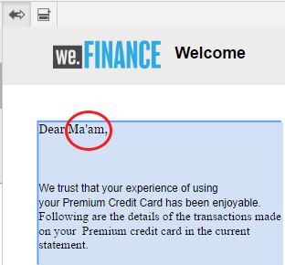

# Condición en línea y repetición en comunicaciones interactivas y letras{#inline-condition-and-repeat-in-interactive-communications-and-letters}

## Condiciones en línea {#inline-conditions}

AEM Forms permite utilizar condiciones en línea en módulos de texto para automatizar la representación de texto que depende del contexto o los datos asociados con el modelo de datos de formulario (en Comunicación interactiva) o el diccionario de datos (en letras). La condición en línea muestra contenido específico en función de que la evaluación de condiciones sea verdadera o falsa.

Las condiciones realizan cálculos en valores de datos proporcionados por el modelo de datos de formulario/el diccionario de datos o por usuarios finales. Con las condiciones en línea, puede ahorrar tiempo y reducir los errores humanos, al tiempo que crea comunicaciones/letras interactivas personalizadas y altamente contextuales.

Para obtener más información, consulte:

* [Crear una comunicación interactiva](../../forms/using/create-interactive-communication.md)
* [Información general sobre la administración de correspondencias](/help/forms/using/cm-overview.md)
* [Texto en comunicaciones interactivas](../../forms/using/texts-interactive-communications.md)

### Ejemplo: Uso de reglas para condicionalizar el texto en línea en la comunicación interactiva {#example-using-rules-to-conditionalize-inline-text-in-interactive-communication}

Para condicionalizar una frase, un párrafo o una cadena de texto en una comunicación interactiva, puede crear una regla en el fragmento de documento de texto correspondiente. En el siguiente ejemplo se utiliza una regla para mostrar un número gratuito únicamente a los destinatarios de EE.UU. de la Comunicación interactiva.

Para obtener más información, consulte Crear regla en texto en [Textos en comunicaciones interactivas](../../forms/using/texts-interactive-communications.md).

Una vez que se incluye el fragmento de texto en una comunicación interactiva y el agente utiliza la interfaz de usuario del agente para preparar una comunicación interactiva, se evalúan los datos (modelo de datos de formulario) de los destinatarios y el texto se muestra únicamente a los destinatarios de EE.UU.

### Ejemplo: Usar una condición en línea en una carta para representar la dirección adecuada {#example-using-inline-condition-in-a-letter-to-render-the-appropriate-address}

Puede insertar una condición en línea en una letra insertando la condición en línea en el módulo de texto correspondiente. El siguiente ejemplo utiliza dos condiciones para evaluar y mostrar la dirección adecuada, Sir o Ma&#39;am, en una carta basada en el elemento DD Sexo. Con pasos similares, puede crear otras condiciones.

>[!NOTE]
>
>Si los recursos existentes incluyen expresiones de estado o repetición antiguas (anteriores a 6.2 SP1 CFP 4), los recursos mostrarán una sintaxis antigua de condición y se repetirán. Sin embargo, la condición o repetición anterior funciona. Las expresiones de repetición/condición nuevas y antiguas son compatibles entre sí para crear una combinación anidada de expresiones de repetición/condición antiguas y nuevas.

1. En el módulo de texto relevante, seleccione la parte del texto que desea condicionalizar y toque **Condición**.

   

   El cuadro de diálogo Condición aparece con una condición vacía.

   

   >[!NOTE]
   >
   >No se puede guardar la expresión condicional vacía o no válida. Debe haber una expresión condicional válida dentro de `${}` para guardar la expresión.

1. Para crear una condición para evaluar si el texto seleccionado/condicionalizado aparece en la letra y, a continuación, toque la marca de verificación para guardar la expresión, haga lo siguiente:

   Toque con el doble un elemento DD para insertarlo en la condición. Inserte el operador adecuado y cree la siguiente condición en el cuadro de diálogo.

   ```javascript
   ${DD_creditcard_Gender=="Male"}
   ```

   Para obtener más información sobre la creación de la expresión, consulte **Creación de expresiones y funciones remotas con el creador de expresiones** en [Generador de Expresiones](../../forms/using/expression-builder.md). El valor especificado en la expresión debe ser compatible con el elemento del diccionario de datos. Para obtener más información, consulte [Diccionario de datos](../../forms/using/data-dictionary.md).

   Una vez insertada la condición, puede situar el cursor sobre el controlador situado a la izquierda de la condición para vista de la condición. Puede tocar el control para vista del menú emergente de la condición, que le permite editar o eliminar la condición.

    

1. Inserte una condición similar seleccionando el texto `Ma'am`.

   ```javascript
   ${DD_creditcard_Gender == "Female"}
   ```

1. Previsualización la letra pertinente y observe que el texto se presenta según la condición en línea. Puede introducir el valor del elemento DD Sexo mediante:

   * Un archivo de datos XML de ejemplo creado en función del diccionario de datos relevante al obtener una vista previa de la carta con datos de ejemplo.
   * Un archivo de datos XML adjunto al diccionario de datos correspondiente.

   Para obtener más información, consulte [Diccionario de datos](../../forms/using/data-dictionary.md).

   

## Repetir {#repeat}

Puede tener información dinámica en la comunicación o carta interactiva, como transacciones en un extracto de tarjeta de crédito, cuya instancia o incidencia puede seguir cambiando con cada carta generada. Si utiliza la opción de repetición, puede dar formato y estructurar dicha información dinámica en el fragmento de documento de texto.

Además, puede especificar una regla o condición dentro de la construcción repetida para condicionalizar la información o las entradas que se procesan en la comunicación o letra interactiva.

### Ejemplo: Uso de repetir en una comunicación interactiva para dar formato, estructurar y mostrar una lista de las transacciones de tarjetas de crédito {#example-using-repeat-in-an-interactive-communication-to-format-structure-and-display-a-list-of-credit-card-transactions}

En el siguiente ejemplo se muestran los pasos para usar la opción de repetición para estructurar y procesar las transacciones de tarjetas de crédito en una comunicación interactiva.

1. En un fragmento de documento de texto basado en modelos de datos de formulario, inserte los objetos del modelo de datos de formulario relevantes (y el texto incrustado necesario para las etiquetas, como en este ejemplo):

   

   >[!NOTE]
   >
   >El contenido repetible debe incluir al menos una propiedad del tipo Colección.

1. Seleccione el contenido en el que desea aplicar la repetición.

   

1. Toque Repetir.

   Aparecerá el cuadro de diálogo Repetir.

   

1. Seleccione Salto de línea como separador y, si es necesario, toque Añadir condición para crear una regla. También puede utilizar el texto como separador y especificar los caracteres de texto que se utilizarán como separadores.

   Aparecerá el cuadro de diálogo Crear regla.

1. Cree una regla que muestre las transacciones con fecha posterior al 28 de febrero de 2018 para incluir las transacciones solo para el mes de marzo en la Comunicación interactiva.

   >[!NOTE]
   >
   >En este ejemplo se asume que el agente creará la sentencia a finales de marzo de 2018. De lo contrario, puede crear otra regla para incluir las transacciones anteriores al 2018-04-01 para excluir las transacciones posteriores a marzo de 2018.

   

1. Guarde la condición/regla y, a continuación, guarde la repetición. La repetición condicional se aplica al contenido seleccionado.

   

   Al pasar el ratón por encima, el fragmento de documento de texto muestra la condición y el separador utilizados en la repetición aplicada al contenido.

1. Guarde el fragmento de documento de texto y previsualización de la comunicación interactiva pertinente. Según los datos del modelo de datos de formulario, la repetición aplicada a los elementos procesa los detalles de la transacción de forma similar a la siguiente en la previsualización:

   

### Ejemplo: Usando la opción de repetir en una carta para dar formato, estructurar y mostrar una lista de las transacciones con tarjeta de crédito {#example-using-repeat-in-a-letter-to-format-structure-and-display-a-list-of-credit-card-transactions}

En el siguiente ejemplo se proporcionan los pasos para utilizar la opción de repetición para estructurar y procesar las transacciones de tarjetas de crédito en una carta. Con pasos similares, puede utilizar repetir en un escenario diferente.

1. Abra (mientras edita o crea) un módulo de texto que tenga elementos DD que procesen datos repetidos/dinámicos e incorporen el texto requerido alrededor de los elementos DD. Por ejemplo, un módulo de texto tiene los siguientes elementos DD para crear un estado de transacciones en una tarjeta de crédito:

   ```javascript
   {^DD_creditcard_TransactionDate^} {^DD_creditcard_TransactionAmount^}
   {^DD_creditcard_TransactionType^}
   ```

   Estos elementos DD presentan una lista de las transacciones realizadas en la tarjeta de crédito con la siguiente información:

   Fecha de transacción, Importe de transacción y Tipo de transacción (débito o crédito)

1. Incruste el texto dentro de los elementos DD para que la declaración sea más legible, como por ejemplo:

   

   ```javascript
   Date: {^DD_creditcard_TransactionDate^} Amount (USD): {^DD_creditcard_TransactionAmount^} Transaction Type: {^DD_creditcard_TransactionType^}
   ```

   Sin embargo, el trabajo de procesar una instrucción con buen formato aún no se ha realizado. Si procesa una carta basada en el trabajo realizado hasta ahora, aparece como sigue:

   

   Para repetir el texto estático junto con los elementos DD, debe aplicar la repetición tal como se explica en los pasos posteriores.

1. Seleccione el texto estático y los elementos DD que desea repetir, como se muestra a continuación:

   

1. Toque **Repetir**. El cuadro de diálogo Repetir aparece con una condición en línea vacía.

   

1. Si es necesario, inserte una condición para que las transacciones se procesen de manera selectiva, como para que las cantidades de las transacciones superen los 50 centavos:

   ```javascript
   ${DD_creditcard_TransactionAmount > 0.5}
   ```

   De lo contrario, si no necesita procesar la información (aquí transacciones) de forma selectiva, mantenga la condición vacía eliminando lo siguiente del cuadro de diálogo: `${}`. Guardar una expresión de repetición se activa cuando la ventana de expresión de repetición está vacía (sin ${} cuando no se necesita repetir) o cuando contiene una condición válida para la repetición.

1. Seleccione un separador para dar formato al texto dinámico y toque la marca de verificación para guardar:

   * **Salto** de línea: Inserta un salto de línea después de cada entrada de transacción en la letra de salida.
   * **Texto**: Inserta el carácter de texto especificado después de cada entrada de transacción en la letra de salida.

   Una vez insertada la condición, el texto con repetición se resalta en rojo y aparece un indicador a la izquierda. Puede situar el ratón sobre el controlador de la izquierda de la repetición para aplicar la vista a la construcción repetida.

   

   Puede tocar el control para vista del menú emergente de la repetición, que le permite editar o eliminar la construcción repetida.

   

1. Previsualización la letra pertinente y observe que el texto se presenta de acuerdo con una repetición. Puede introducir el valor de los elementos DD mediante:

   * Un archivo de datos XML de ejemplo creado en función del diccionario de datos relevante al obtener una vista previa de la carta con datos de ejemplo.
   * Un archivo de datos XML adjunto al diccionario de datos correspondiente.

   Para obtener más información, consulte [Diccionario de datos](https://helpx.adobe.com/aem-forms/6-2/data-dictionary.html).

   

   El texto estático se repite con los detalles de la transacción. La repetición aplicada al texto en este procedimiento facilita la repetición de texto estático. La condición, ${DD_creditcard_TransactionAmount > 0.5}, garantiza que las transacciones por debajo de USD.5 no se representen en la carta.

   >[!NOTE]
   >
   >Puede insertar una condición y repetirla solo mientras crea o edita el módulo de texto relevante. Al obtener una vista previa de la carta, aunque puede realizar modificaciones en el módulo de texto, no puede insertar condición ni repetir.

## Uso de condiciones en línea y repetición - algunos casos de uso {#using-inline-condition-and-repeat-some-use-cases}

### Repetir dentro de la condición {#repeat-within-condition}

Es posible que deba utilizar la opción de repetición dentro de una condición. La Administración de correspondencia le permite utilizar la función de repetición dentro de una construcción de condiciones en línea.

Por ejemplo, lo siguiente se repite (con formato de rojo) dentro de una condición (con formato de verde).

Mientras que la repetición procesa las transacciones con tarjeta de crédito, la condición ${DD_creditcard_nooftransaction > 0} garantiza que la construcción repetida se procese solamente si hay al menos una transacción.


Del mismo modo, según sus necesidades, puede crear:

* Una o más condiciones dentro de una condición
* Una o más condiciones dentro de una repetición
* Combinación de condiciones y repetición dentro de una condición o repetición

### Condición en línea vacía {#empty-inline-condition}

Es posible que tenga que insertar condiciones en línea vacías e incrustar texto y elementos DD más adelante. La Administración de correspondencia le permite hacer eso.


Sin embargo, se recomienda que, si es posible, inserte primero el texto y los elementos DD en el módulo de texto con el formato deseado, como las viñetas, y aplique una condición en línea después.
